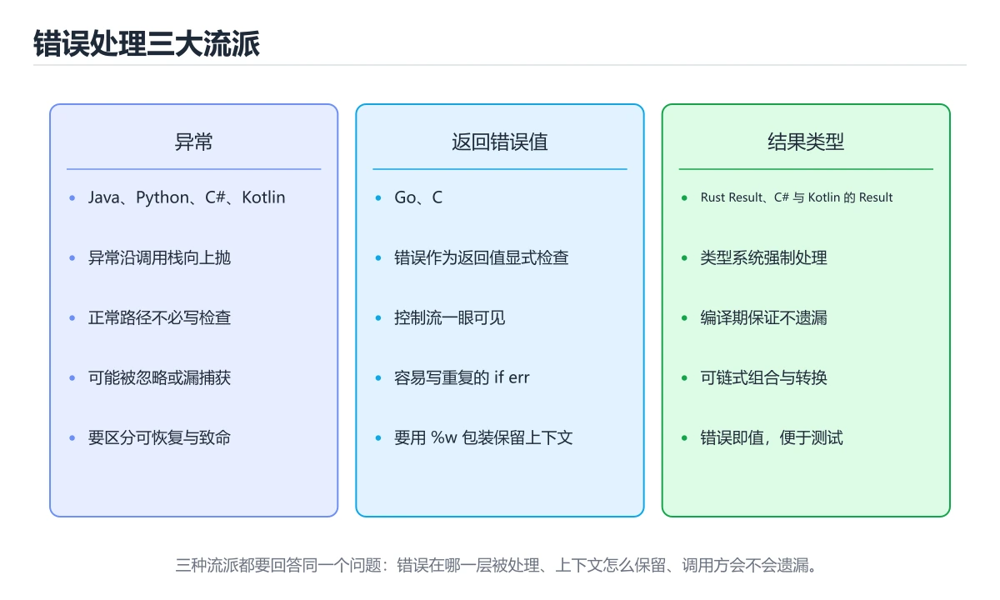
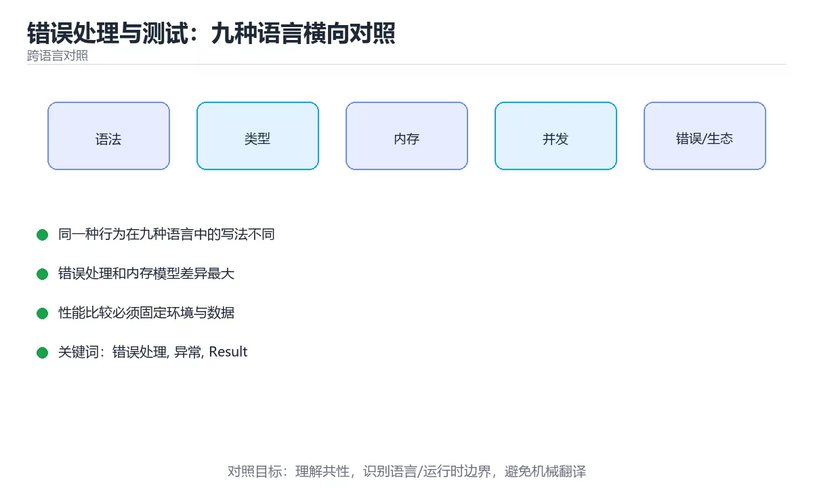

# 错误处理与测试：九种语言横向对照

> 内容更新时间：2026-10-06 · 学习阶段：进阶 · 预计用时：35 分钟





## 学习目标

- 能用自己的话解释错误处理与测试：九种语言横向对照解决了什么问题，而不是只背术语。
- 能说清 「错误处理」、「异常」、「Result」、「测试」 之间的关系，并分别举出一个例子。
- 能把本课知识放回「跨语言对照」的知识体系，说明它和相邻主题的边界。
- 能完成本课练习，并用验收标准检查自己的结果。

> 一句话摘要：异常、返回值、Promise 三大流派，以及各语言主流测试框架。

## 前置知识

- 先完成上一课《并发写法：九种语言横向对照》；如果已经掌握，可以直接用本课练习自测。
- 本课阶段：进阶。建议先掌握同一分类的基础课程，并能独立运行正文中的最小示例。
- 开始前先复习：错误处理、异常、Result。
- 如果某一步看不懂，先记录具体卡点，完成练习后再回头读一遍。

## 一句话目标

错误处理回答「出错时怎么表达」，测试回答「怎么证明它是对的」。
这两件事最能看出一门语言是否适合长期维护。

## 错误处理的三大流派

| 流派 | 代表语言 | 表达方式 | 特点 |
| --- | --- | --- | --- |
| 异常 | Python、Java、C#、C++ | `try / catch` 或 `except` | 代码干净，但容易漏捕获 |
| 返回值 | Go、Rust | 显式返回 `error` 或 `Result` | 不遗漏，但代码更啰嗦 |
| 回调与拒约 | JavaScript、TypeScript | `throw` + Promise 拒绝 | 异步容易漏处理 |
| 退出码 | Shell | `$?` 与 `set -e` | 只能表达成功或失败 |

## 一段代码看清差异

```python
def parse_age(text: str) -> int:
    value = int(text)              # 失败抛 ValueError
    if value < 0:
        raise ValueError("年龄不能为负")
    return value

try:
    print(parse_age("abc"))
except ValueError as err:
    print("出错：", err)
```

```javascript
function parseAge(text) {
  const value = Number(text);
  if (!Number.isInteger(value) || value < 0) {
    throw new Error(`年龄不合法：${text}`);
  }
  return value;
}

try {
  console.log(parseAge("abc"));
} catch (error) {
  console.error("出错：", error.message);
}

// 异步场景
await fetch(url).catch((e) => console.error(e));
```

```typescript
class ValidationError extends Error {
  constructor(readonly field: string, message: string) {
    super(message);
    this.name = "ValidationError";
  }
}

function parseAge(text: string): number {
  const value = Number(text);
  if (!Number.isInteger(value) || value < 0) {
    throw new ValidationError("age", `年龄不合法：${text}`);
  }
  return value;
}
```

```java
public static int parseAge(String text) {
    int value;
    try {
        value = Integer.parseInt(text.trim());
    } catch (NumberFormatException e) {
        throw new IllegalArgumentException("不是合法数字：" + text, e);   // 保留原因链
    }
    if (value < 0) throw new IllegalArgumentException("年龄不能为负");
    return value;
}
```

```csharp
public static bool TryParseAge(string text, out int age)
{
    age = 0;
    if (!int.TryParse(text, out var value) || value < 0) return false;
    age = value;
    return true;
}
```

```cpp
#include <optional>
#include <string>

std::optional<int> parseAge(const std::string& text) {
    try {
        int value = std::stoi(text);
        if (value < 0) return std::nullopt;
        return value;
    } catch (const std::exception&) {
        return std::nullopt;         // 用 optional 表达「没有有效值」
    }
}
```

```go
var ErrNegative = errors.New("年龄不能为负")

func ParseAge(text string) (int, error) {
    value, err := strconv.Atoi(strings.TrimSpace(text))
    if err != nil {
        return 0, fmt.Errorf("解析年龄 %q: %w", text, err)
    }
    if value < 0 {
        return 0, ErrNegative
    }
    return value, nil
}

// 调用方
age, err := ParseAge("abc")
if errors.Is(err, ErrNegative) { /* 按类型处理 */ }
```

```rust
#[derive(Debug)]
enum AgeError {
    NotANumber,
    Negative,
}

fn parse_age(text: &str) -> Result<u8, AgeError> {
    let value: i32 = text.trim().parse().map_err(|_| AgeError::NotANumber)?;
    if value < 0 {
        return Err(AgeError::Negative);
    }
    Ok(value as u8)
}
```

```bash
#!/usr/bin/env bash
set -euo pipefail

if ! [[ "$1" =~ ^[0-9]+$ ]]; then
  echo "年龄必须是数字：$1" >&2
  exit 1
fi
age="$1"
```

## 测试写法对照

| 语言 | 主流框架 | 最小测试写法 |
| --- | --- | --- |
| Python | pytest | `def test_x(): assert f() == 1` |
| JavaScript | Vitest / Jest | `it("x", () => expect(f()).toBe(1))` |
| TypeScript | Vitest | 同 JavaScript，另加类型断言 |
| Java | JUnit 5 | `@Test void x() { assertEquals(1, f()); }` |
| C# | xUnit | `[Fact] public void X() => Assert.Equal(1, F());` |
| C++ | Catch2 / GoogleTest | `TEST_CASE("x") { CHECK(f() == 1); }` |
| Go | 标准库 testing | `func TestX(t *testing.T) { ... }` |
| Rust | 内置 `#[test]` | `#[test] fn x() { assert_eq!(f(), 1); }` |
| Shell | bats | `@test "x" { [ "$(f)" = 1 ]; }` |

## 四类测试的共同分层

| 层级 | 目的 | 数量 |
| --- | --- | --- |
| 单元测试 | 验证纯函数与规则 | 最多 |
| 集成测试 | 验证模块与数据库配合 | 中等 |
| 端到端测试 | 验证关键用户流程 | 最少 |
| 性能测试 | 验证延迟与吞吐 | 按需 |

**跨语言通用的三条纪律**：用例相互独立、不依赖时间与网络、断言具体值而不是「不为空」。

## 新手最容易踩的八个坑

| 坑 | 出现语言 | 正确做法 |
| --- | --- | --- |
| 空 catch 什么都不做 | Java、C#、C++、Python | 至少记录或重新抛出 |
| 丢弃原始错误 | Java、Go、Python | 保留原因链（`%w`、`cause`） |
| 用字符串比较错误 | 全部 | 用错误类型或错误码 |
| 忽略 Promise 拒绝 | JavaScript、TypeScript | 加 `catch` 或 `try/catch` |
| 到处 `unwrap()` | Rust | 用 `?` 或 `unwrap_or` |
| 用异常做流程控制 | 全部 | 能用判断就用判断 |
| 测试依赖执行顺序 | 全部 | 每个用例自带准备与清理 |
| 只测成功路径 | 全部 | 补异常与边界用例 |

## 本课小结
- **异常流派**写起来最简洁，但要求开发者主动记得处理。
- **返回值流派**（Go、Rust）把「必须处理」写进语法，代价是代码更长。
- 无论哪种语言，**保留错误原因、用类型而不是文案判断、测试覆盖失败路径**这三条都成立。

## 动手练习

> 本课练习重点：围绕「错误处理、异常、Result」完成复述、实验和交付，每个结果都要能被别人检查。

用两种语言实现同一行为，再对比语法、错误、性能和生态差异。

### 练习 1：建立心智模型（10 分钟）

合上教程，用 3～5 句话回答：

1. 错误处理与测试：九种语言横向对照解决了什么问题？
2. 如果没有它，会出现什么具体后果？
3. 它和「异常」是什么关系？

**验收标准**：至少出现一个本课关键词，并写出一个反例、边界条件或失效场景。

### 练习 2：做一次可控实验（20 分钟）

从正文中选一个最小示例，完成以下操作：

1. 先预测修改一个参数、输入或步骤后的结果。
2. 再实际执行或逐步推演，记录真实结果。
3. 如果结果与预测不同，写出差异原因。

**验收标准**：留下「原例 → 改动 → 预测 → 结果 → 原因」五步记录。

### 练习 3：交付一个小结果（30 分钟）

选两种语言实现同一行为，列出语法、错误处理、性能和生态差异。

任务要求：

- 结果必须能被别人检查，不能只写“我已经理解了”。
- 至少覆盖「错误处理」和「异常」两个关键词。
- 写出 1 个仍然不确定的问题，以及下一步如何验证。

> 提示：时间有限时优先做练习 1 和练习 2；练习 3 可以拆成两次完成。

## 可运行练习

### 任务 1：先跑通，再解释

```python
def parse_age(text: str) -> int:
    value = int(text)              # 失败抛 ValueError
    if value < 0:
        raise ValueError("年龄不能为负")
    return value

try:
    print(parse_age("abc"))
except ValueError as err:
    print("出错：", err)
```

### 任务 2：只改一个条件

把「错误处理与测试：九种语言横向对照」的最小示例复制一份，只改一个条件再跑一次：

- 改动点：只把错误处理的输入换成空值、极值或错误输入，其余保持不变。
- 预测：先写下「错误处理与测试：九种语言横向对照」在改动后的输出或错误信息，再运行。
- 记录：对照改动前后的结果，指出差异出在哪一步。
- 验收：换回原条件能复现原结果，改动只影响错误处理。

### 任务 3：迁移到自己的数据

用同一套思路处理一组你自己的数据或场景，保持输出格式与任务 1 一致。

## 故障现场

### 现场 1：本课的 错误处理 常规用例通过，但边界用例失败

**症状**：在本课的练习或生产场景里出现“本课的 错误处理 常规用例通过，但边界用例失败”。

**复现**：准备一组最小输入，只保留触发“本课的 错误处理 常规用例通过，但边界用例失败”的必要条件，连续运行两次确认结果稳定。

**定位**：围绕“错误处理 的前置条件与取值边界没有写进代码，默认值掩盖了空值和极值”检查调用链、输入数据和环境配置，先验证假设再改代码。

**预防**：把“本课的 错误处理 常规用例通过，但边界用例失败”写成一条自动化用例，并在本课的验收清单里保留对应检查项。

### 现场 2：本课的 异常 结果在两次运行之间不一致

**症状**：在本课的练习或生产场景里出现“本课的 异常 结果在两次运行之间不一致”。

**复现**：准备一组最小输入，只保留触发“本课的 异常 结果在两次运行之间不一致”的必要条件，连续运行两次确认结果稳定。

**定位**：围绕“异常 依赖了当前版本、执行顺序或共享状态，单次运行无法暴露差异”检查调用链、输入数据和环境配置，先验证假设再改代码。

**预防**：把“本课的 异常 结果在两次运行之间不一致”写成一条自动化用例，并在本课的验收清单里保留对应检查项。

### 现场 3：本课的验证只在开发机通过

**症状**：在本课的练习或生产场景里出现“本课的验证只在开发机通过”。

**定位**：围绕“环境版本、配置和输入规模与目标环境不同，错误处理 缺少可重复的验证记录”检查调用链、输入数据和环境配置，先验证假设再改代码。

## 深入补充：错误处理与测试：九种语言横向对照 的取舍与边界

### 一、把概念放回真实约束

学习错误处理与测试：九种语言横向对照时，最容易只记住结论而忽略前提。先写出三个约束：数据规模、时间预算、可接受的失败方式；再判断 错误处理 与 异常 在这些约束下是否仍然成立。只要约束改变，原来的最优解就可能变成错误解。

| 维度 | 错误处理 的典型写法 | 另一种语言的等价写法 | 迁移时最易踩的坑 |
| --- | --- | --- | --- |
| 错误处理 | 显式返回或抛出 | 异常或结果类型 | 错误被静默吞掉 |
| 并发模型 | 线程、协程或事件循环 | 运行时调度不同 | 共享状态与取消语义 |
| 依赖管理 | 官方包管理器 | 生态与锁文件不同 | 版本解析结果不一致 |

### 二、三个容易混淆的边界

1. 澄清输入与目标。先写清「错误处理与测试：九种语言横向对照」要解决的问题、合法输入范围和成功标准，再进入后续步骤。
2. **把“平均值”当成“全部”**：错误处理 的指标好看，不代表尾部请求、冷启动或失败重试也好看。
3. **把“当前版本”当成“永久行为”**：异常 依赖的默认值、API 或性能特征都可能随版本变化，需要固定版本并保留回归用例。

### 三、一个生产场景

假设团队要在真实系统里使用错误处理与测试：九种语言横向对照：第一周先做小流量验证，记录 错误处理 的基线与异常；第二周扩大输入规模，观察 异常 是否成为瓶颈；第三周再做故障演练，主动注入超时、重复请求和依赖不可用，确认系统能降级、能重试、能恢复。每一步都要留下指标、日志和结论，而不是只留下“感觉更快了”。

### 四、自测清单

- 能否用一句话说出错误处理与测试：九种语言横向对照解决的核心问题与不适用场景？
- 能否画出 错误处理 的数据流或状态变化，并标出失败路径？
- 能否给出一个反例，证明某个看似合理的结论在边界条件下不成立？
- 能否写出一条可复现的验证命令，让别人独立得到相同结论？

### 五、跨语言迁移清单

在本课的迁移练习里，先列出 错误处理 在两种语言中的类型、错误处理、并发模型和内存管理差异；再用同一个输入各写一版最小实现，比较编译或运行时的错误信息。最后记录 异常 在两种语言里的性能与可读性差异，避免只凭语法熟悉度做选型。

## 本课复习清单

离开本课前，逐项确认：

- [ ] 不看解析，能说出「Go 与 Rust 在错误处理上的共同点是？」的判断依据。
- [ ] 不看解析，能说出「在 JavaScript 中处理异步错误，最容易漏掉的是？」的判断依据。
- [ ] 不看解析，能说出「关于用字符串比较错误，正确的认识是？」的判断依据。
- [ ] 不看解析，能说出「关于测试分层，跨语言通用的建议是？」的判断依据。
- [ ] 不看解析，能说出的判断依据。
- [ ] 至少运行一次本课示例，记录输入、输出和一个边界情况。
- [ ] 把本课最容易混淆的两个概念写成一句话对照。

| 复盘项 | 记录 |
| --- | --- |
| 已经能独立解释的考点 |  |
| 仍然说不清的概念 |  |
| 下一步验证动作 |  |

## 术语速查

| 术语 | 本课语境 |
| --- | --- |
| `try / catch` | \| 异常 \| Python、Java、C#、C++ \| `try / catch` 或 `except` \| 代码干净，但容易漏捕获 \| |
| `except` | \| 异常 \| Python、Java、C#、C++ \| `try / catch` 或 `except` \| 代码干净，但容易漏捕获 \| |
| `error` | \| 返回值 \| Go、Rust \| 显式返回 `error` 或 `Result` \| 不遗漏，但代码更啰嗦 \| |
| `Result` | \| 返回值 \| Go、Rust \| 显式返回 `error` 或 `Result` \| 不遗漏，但代码更啰嗦 \| |
| `throw` | \| 回调与拒约 \| JavaScript、TypeScript \| `throw` + Promise 拒绝 \| 异步容易漏处理 \| |
| `$?` | \| 退出码 \| Shell \| `$?` 与 `set -e` \| 只能表达成功或失败 \| |

## 考点精讲

### 考点 1：多选辨析·错误处理

- **题目**：围绕“错误处理与测试：九种语言横向对照”中的 错误处理、异常、Result，下列哪两项是本课强调的实践判断？
- **判断依据**：本课把错误处理与测试：九种语言横向对照拆成概念、示例与故障现场三部分，因此判断 错误处理 时必须同时交代输入、输出和失败路径，这使“学习 错误处理 时要同时说明输入、输出和失败路径，不能只看正常流程”成立。在错误处理与测试：九种语言横向对照里，判断 异常 时要固定版本与边界输入，所以“验证 异常 时要固定版本并覆盖边界输入，结论才可复现”才可复现。

### 考点 2：代码补全·错误处理

- **题目**：下面这段 Rust 代码摘自「错误处理与测试：九种语言横向对照」的正文示例。关于这段代码，下面哪一项说法与实际内容相符？
- **判断依据**：在「错误处理与测试：九种语言横向对照」里，这段代码包含条件分支，不同输入会走不同的执行路径。这段代码出自「错误处理与测试：九种语言横向对照」的正文示例，围绕错误处理、异常、Result展开；把输入或边界换成空值、极值或失败情况后，结论要以「错误处理与测试：九种语言横向对照」的实际运行结果为准。

### 考点 3：概念判断·错误处理

- **题目**：关于用字符串比较错误，正确的认识是？
- **判断依据**：在「错误处理与测试：九种语言横向对照」里，作答时，先用错误处理建立输入与输出的基线，再把文案一变就会失效代入边界条件核对，结论才能复现。在「错误处理与测试：九种语言横向对照」里，如果只凭关键词作答，很容易把「这是最可靠的方式」、「所有语言都推荐这样写」与「文案一变就会失效」混在一起；

### 考点 4：概念判断·错误处理

- **题目**：关于测试分层，跨语言通用的建议是？
- **判断依据**：在「错误处理与测试：九种语言横向对照」里，作答时，先用错误处理建立输入与输出的基线，再把单元测试最多，集成测试中等代入边界条件核对，结论才能复现。在「错误处理与测试：九种语言横向对照」里，这道题要求区分概念与边界，「单元测试最多，集成测试中等」只有在题干给出的前提下才成立，而「全部写端到端测试最省事」、「只写单元测试即可」缺少同一组条件。

### 考点 5：填空·错误处理

- **题目**：补全代码：「错误处理与测试：九种语言横向对照」示例中，下面这行代码缺少哪个关键字或函数名？请填入 ____。 `await fetch(url).catch((e) => console.____(e));`
- **判断依据**：在「错误处理与测试：九种语言横向对照」里，error。「错误处理与测试：九种语言横向对照」要求先交代错误处理、异常、Result的前提再下结论，所以“error”只在题干“错误处理与测试”给定的条件下成立。把“error”代回「错误处理与测试：九种语言横向对照」里“错误处理与测试”的例子核对，条件一旦改变，结论就要用错误处理、异常、Result重新推导。

### 考点 6：顺序排列·错误处理

- **题目**：按照「错误处理与测试：九种语言横向对照」从概念到实践的讲解顺序排列下列主题。
- **判断依据**：在「错误处理与测试：九种语言横向对照」里，正确的执行顺序是「一句话目标」 → 「错误处理的三大流派」 → 「一段代码看清差异」 → 「测试写法对照」。在「错误处理与测试：九种语言横向对照」里，在本课中，正确顺序是：1. 一句话目标 → 2. 错误处理的三大流派 → 3. 一段代码看清差异 → 4. 测试写法对照。

## English Overview

**Title:** Errors and Testing Across Languages

**Summary:** Exception, return-value and Promise styles plus testing frameworks.

**Category:** Cross-Language Comparison
**Level:** 进阶
**Key terms:** 错误处理, 异常, Result, 测试, 断言

## 内容元数据

- 内容版本：v2.0
- 最后更新：2026-10-06
- 学习阶段：进阶
- 适用环境：九种主流语言生态横向对照
- 内容来源：内置结构化课程与工程实践整理
- 相关主题：错误处理、异常、Result、测试、断言
- 质量版本：P0 测验标准 + P1 覆盖扩展 + P2 体验补全

## 参考资料与复核

- 最后复核：2026-10-04
- 下次复核：2027-04-04
- 复核范围：版本兼容、API 行为、安全建议与工程实践
- 来源性质：官方文档、标准或权威教材；正文为离线教学重组

| 参考资料 | 本课用途 |
| --- | --- |
| [Exercism](https://exercism.org/docs) | 多语言练习与反馈 |
| [DevDocs](https://devdocs.io/) | 多语言 API 快速检索 |
| [Compiler Explorer](https://godbolt.org/) | 不同编译器与汇编对照 |

> 「错误处理与测试：九种语言横向对照」的链接用于离线阅读后的延伸核对；App 不会自动联网。
