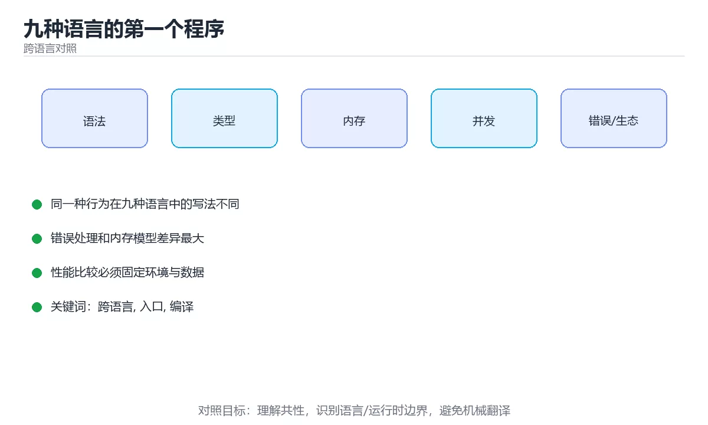

# 九种语言的第一个程序



> 内容更新时间：2026-10-03 · 学习阶段：入门 · 预计用时：18 分钟

## 学习目标

- 能用自己的话解释「九种语言的第一个程序」解决了什么问题，而不是只背术语。
- 能说清 「跨语言」、「入口」、「编译」、「解释」 之间的关系，并分别举出一个例子。
- 能把本课知识放回「跨语言对照」的知识体系，说明它和相邻主题的边界。
- 能完成本课练习，并用验收标准检查自己的结果。

> 一句话摘要：打印、入口、运行方式的横向对照，快速建立语言地图。

## 前置知识

- 会进行基本的文件、命令行或浏览器操作；遇到不熟悉的术语先查本课关键词。
- 本课阶段：入门。只需要基本计算机操作，不要求编程经验。
- 开始前先复习：跨语言、入口、编译。
- 如果某一步看不懂，先记录具体卡点，完成练习后再回头读一遍。


## 一句话目标

同一个「打印问候语并读取输入」的小程序，在九种语言里各有写法。
把它们并排看，能最快建立「语言之间到底差在哪」的直觉。

## 横向对照：打印一句话

| 语言 | 打印写法 | 需要分号 | 入口 |
| --- | --- | --- | --- |
| Python | `print("你好")` | 否 | 顶层的任意代码 |
| JavaScript | `console.log("你好")` | 否 | 顶层的任意代码 |
| TypeScript | `console.log("你好")` | 否 | 顶层或函数 |
| Java | `System.out.println("你好");` | 是 | `public static void main` |
| C# | `Console.WriteLine("你好");` | 是 | 顶层语句或 `Main` |
| C++ | `std::cout << "你好\n";` | 是 | `int main()` |
| Go | `fmt.Println("你好")` | 否 | `func main()` |
| Rust | `println!("你好");` | 是 | `fn main()` |
| Shell | `echo "你好"` | 否 | 脚本从上到下 |

## 九种语言的最小可运行文件

```python
# hello.py
print("你好，世界")
```

```javascript
// hello.js
console.log("你好，世界");
```

```typescript
// hello.ts
const who: string = "世界";
console.log(`你好，${who}`);
```

```java
// Hello.java —— 文件名必须与类名一致
public class Hello {
    public static void main(String[] args) {
        System.out.println("你好，世界");
    }
}
```

```csharp
// Program.cs（顶层语句写法）
Console.WriteLine("你好，世界");
```

```cpp
// hello.cpp
#include <iostream>

int main() {
    std::cout << "你好，世界\n";
    return 0;
}
```

```go
// main.go
package main

import "fmt"

func main() {
    fmt.Println("你好，世界")
}
```

```rust
// main.rs
fn main() {
    println!("你好，世界");
}
```

```bash
#!/usr/bin/env bash
echo "你好，世界"
```

## 怎么跑起来

| 语言 | 常见执行方式 | 备注 |
| --- | --- | --- |
| Python | `python hello.py` | 无需编译 |
| JavaScript | `node hello.js` | 浏览器里可用 `<script>` |
| TypeScript | `npx tsx hello.ts` 或先编译 | 需要转译或运行时 |
| Java | `javac Hello.java` 然后 `java Hello` | 先编译成字节码 |
| C# | `dotnet run` | 需要 SDK 与项目文件 |
| C++ | `g++ hello.cpp -o hello` 然后 `./hello` | 编译成原生可执行文件 |
| Go | `go run main.go` | 也可 `go build` |
| Rust | `cargo run` 或 `rustc main.rs` | 推荐 Cargo |
| Shell | `bash hello.sh` | 需要执行权限才能直接运行 |

## 编译型与解释型不是绝对二分

| 类型 | 语言 | 特点 |
| --- | --- | --- |
| 直接解释 | Python、Shell | 改完立即运行，启动快、峰值性能一般 |
| 先编译再执行 | C++、Rust、Go | 运行前必须过编译，性能最好 |
| 编译成中间码再即时编译 | Java、C# | 兼顾跨平台与性能 |
| 先转译再执行 | TypeScript、现代 JavaScript | 类型只在转译期存在 |

## 读输入：九种写法

| 语言 | 读取一行输入 |
| --- | --- |
| Python | `name = input("姓名：")` |
| JavaScript（Node） | `readline` 模块或 `process.stdin` |
| TypeScript（Node） | 同 JavaScript，另加类型标注 |
| Java | `new Scanner(System.in).nextLine()` |
| C# | `Console.ReadLine()` |
| C++ | `std::getline(std::cin, name)` |
| Go | `fmt.Scanln(&name)` 或 `bufio.Scanner` |
| Rust | `std::io::stdin().read_line(&mut s)` |
| Shell | `read -r name` |

三个共同点：

1. **输入永远是文本**，要计算必须自己转成数字。
2. 读取都可能失败（文件结束、格式错误），要处理。
3. 提示语与读取通常写成两步，别指望所有语言都支持「带提示的输入」。

## 新手最容易踩的八个坑

| 坑 | 出现语言 | 正确做法 |
| --- | --- | --- |
| 文件名与类名不一致 | Java | `Hello.java` 对应 `public class Hello` |
| 忘了分号 | Java、C#、C++、Rust | 语句结尾补分号 |
| 忘了引入标准库 | C++、Go | `#include <iostream>`、`import "fmt"` |
| 少了入口函数 | C++、Go、Rust | 写 `main` |
| 用了中文标点 | 全部 | 代码里只用英文半角标点 |
| Shell 脚本没有执行权限 | Shell | `chmod +x` 或 `bash script.sh` |
| 直接跑 `.ts` | TypeScript | 用 `tsx` 或先编译 |
| 忘了换行符 | C++ | `"\n"` 或 `std::endl` |

## 本课小结
- **语法差异最小的**是打印与变量，**差异最大的**是入口、类型与并发。
- 学新语言时先跑通「打印 + 输入 + 判断 + 循环」，就等于掌握了这门语言的骨架。
- 真正的差异不在写法，而在**类型系统、内存管理和错误处理**这三件事上。

## 动手练习


> 本课练习重点：围绕「跨语言、入口、编译」完成复述、实验和交付，每个结果都要能被别人检查。

用两种语言实现同一行为，再对比语法、错误、性能和生态差异。

### 练习 1：建立心智模型（10 分钟）

合上教程，用 3～5 句话回答：

1. 「九种语言的第一个程序」解决了什么问题？
2. 如果没有它，会出现什么具体后果？
3. 它和「入口」是什么关系？

**验收标准**：至少出现一个本课关键词，并写出一个反例、边界条件或失效场景。

### 练习 2：做一次可控实验（20 分钟）

从正文中选一个最小示例，完成以下操作：

1. 先预测修改一个参数、输入或步骤后的结果。
2. 再实际执行或逐步推演，记录真实结果。
3. 如果结果与预测不同，写出差异原因。

**验收标准**：留下「原例 → 改动 → 预测 → 结果 → 原因」五步记录。

### 练习 3：交付一个小结果（30 分钟）

选两种语言实现同一行为，列出语法、错误处理、性能和生态差异。

任务要求：

- 结果必须能被别人检查，不能只写“我已经理解了”。
- 至少覆盖「跨语言」和「入口」两个关键词。
- 写出 1 个仍然不确定的问题，以及下一步如何验证。

> 提示：时间有限时优先做练习 1 和练习 2；练习 3 可以拆成两次完成。


## 深入补充：九种语言的第一个程序

前面已经建立了基本概念。这一节换一个角度，把「九种语言的第一个程序」放进真实工程里，
重点回答三件事：它为什么存在、内部如何运转、什么时候会失效。

### 一、核心模型

不同语言的“第一个程序”看似只差一行打印，实际上暴露了完整的工具链差异：源码如何编译或解释、依赖如何安装、程序从哪里进入、输出写到哪里、退出码如何返回。

```text
安装工具链 → 创建项目 → 编写入口文件 → 编译或解释 → 运行 → 观察输出与退出码 → 打包分发
```

### 二、关键机制拆解

1. 编译型语言先生成机器码或字节码，解释型语言通常直接执行源码，但现代语言常混合编译与即时优化。
2. 入口点可能是 main 函数、模块顶层代码、脚本首行或框架约定，理解入口是调试启动问题的第一步。
3. 标准输出用于正常结果，标准错误用于诊断信息，退出码 0 表示成功，非 0 表示失败。
4. 包管理器和锁文件决定依赖版本，虚拟环境或项目文件隔离不同项目的依赖。
5. 构建产物可能是二进制、字节码、容器镜像或静态资源；部署方式取决于运行环境。
6. REPL 适合探索语法，文件加版本控制适合可复现工程，两者应配合而不是互相替代。

### 三、对照表：抓住容易混淆的边界

| 维度 | 一侧 | 另一侧 |
| --- | --- | --- |
| 解释执行 | 逐条读取源码并执行 | 启动快但运行时优化依实现而定 |
| 编译执行 | 先转成机器码或字节码 | 构建慢但运行稳定、便于分发 |
| 标准输出 | 程序正常结果 | 可被管道和重定向处理 |
| 标准错误 | 日志、警告和错误 | 不应混入结构化结果 |

### 四、工作示例

同一个“打印并返回失败”的程序，在 Python 中用 `print` 与 `sys.exit(1)`，在 Go 中用 `fmt.Println` 与 `os.Exit(1)`，在 Shell 中用 `echo` 与 `exit 1`。语言不同，但标准输出、标准错误和退出码的契约一致。

### 五、常见误区与失效边界

| 错误做法或假设 | 后果 | 正确做法 |
| --- | --- | --- |
| 把日志写进标准输出 | 管道消费到混合数据 | 结果走 stdout，诊断走 stderr |
| 依赖全局安装 | 换机器后无法复现 | 使用项目级依赖和锁文件 |
| 忽略退出码 | CI 看起来成功但实际失败 | 在脚本和流水线中检查退出码 |
| 把 REPL 当成项目结构 | 代码无法复现和测试 | 把探索结果整理成文件和测试 |

### 六、场景推演

CI 中构建脚本偶发失败，但日志没有报错。检查发现程序把错误写到标准输出后仍返回 0，流水线因此误判成功。修复方式是错误写 stderr，并在所有失败分支返回非 0 退出码。

### 七、自测问答

**Q1：stdout 和 stderr 为什么要分开？**

正常结果与诊断信息用途不同，分开后管道和日志系统才能正确处理。

**Q2：退出码在 CI 中有什么作用？**

它决定流水线是否把当前步骤判定为成功。

**Q3：为什么要使用锁文件？**

它固定依赖版本，保证不同机器构建结果可复现。

**Q4：REPL 和源文件各自适合什么？**

REPL 适合探索，源文件适合版本控制、测试和部署。

### 八、小项目：把知识变成可检查的产出

用三种语言各写一个小程序：读取两个参数，输出结果到 stdout，错误到 stderr，成功返回 0、参数错误返回 2；再写一个脚本统一调用并检查退出码。

### 九、适用边界

第一个程序只验证工具链是否可用，不代表语言全貌。真正的工程还需要包管理、测试、日志、配置、构建和发布，后续课程会逐项展开。

### 十、完成检查清单

- [ ] 能在九种语言中说出编译与运行命令
- [ ] 能区分 stdout、stderr 和退出码
- [ ] 能创建隔离的依赖环境
- [ ] 能解释构建产物和运行环境
- [ ] 能用脚本检查退出码

### 十一、复习顺序

1. 先不看资料复述“核心模型”，确认能说出它解决的三个问题。
2. 再对照表逐行解释容易混淆的概念，每个概念补一个反例。
3. 跟着工作示例做一遍，改变一个条件并预测结果。
4. 用自测问答检查理解，错题回到对应小节重新阅读。
5. 最后完成小项目，把结果、失败记录和复查清单整理成一份可提交产物。

> 复习不是重读一遍，而是离开原文重新产出：复述、改写、验证、复盘。


## 考点精讲：把测验题还原成判断过程

本课有 5 个判断点。先自己作答，再看「判断依据」；如果结论正确但理由不完整，回到正文对应章节补足概念。

### 考点 1：关于各语言的程序入口，说法正确的是？

- **正确判断**：Python 与 JavaScript 可以在顶层直接写代码
- **判断依据**：正确答案是「Python 与 JavaScript 可以在顶层直接写代码」，本课在「深入补充：九种语言的第一个程序」中说明：不同语言的“第一个程序”看似只差一行打印，实际上暴露了完整的工具链差异：源码如何编译或解释、依赖如何安装、程序从哪里进入、输出写到哪里、退出码如何返回。脚本语言允许顶层直接执行，而 C++、Go、Rust 都要求 main 作为入口。本课还在「读输入：九种写法」中说明：提示语与读取通常写成两步，别指望所有语言都支持「带提示的输入」。
- **迁移检查**：遮住选项，只根据定义复述一次答案，再回来看哪个选项与复述一致。

### 考点 2：把「编译型 vs 解释型」用在 Java 与 C# 上，最准确的说法是？

- **正确判断**：它们先编译成中间码，再由运行时即时编译执行
- **判断依据**：正确答案是「它们先编译成中间码，再由运行时即时编译执行」，本课在「深入补充：九种语言的第一个程序」中说明：编译型语言先生成机器码或字节码，解释型语言通常直接执行源码，但现代语言常混合编译与即时优化。Java 编译成字节码由 JVM 执行，C# 编译成 IL 由 CLR 执行，两者都会在运行时做即时编译。本课还在「深入补充：九种语言的第一个程序」中说明：不同语言的“第一个程序”看似只差一行打印，实际上暴露了完整的工具链差异：源码如何编译或解释、依赖如何安装、程序从哪里进入、输出写到哪里、退出码如何返回。
- **迁移检查**：遮住选项，只根据定义复述一次答案，再回来看哪个选项与复述一致。

### 考点 3：TypeScript 文件不能直接被 Node 运行，原因是？

- **正确判断**：类型信息需要在运行前被转译掉
- **判断依据**：正确答案是「类型信息需要在运行前被转译掉」，本课在「深入补充：九种语言的第一个程序」中说明：第一个程序只验证工具链是否可用，不代表语言全貌。TypeScript 是 JavaScript 的超集，多出的类型语法必须在运行前转译成 JavaScript。本课还在「一句话目标」中说明：同一个「打印问候语并读取输入」的小程序，在九种语言里各有写法。本课还在「深入补充：九种语言的第一个程序」中说明：入口点可能是 main 函数、模块顶层代码、脚本首行或框架约定，理解入口是调试启动问题的第一步。
- **迁移检查**：把题干里的一个条件换成边界值，原来的结论还成立吗？写出判断过程。

### 考点 4：关于读取用户输入，跨语言共同的注意事项是？

- **正确判断**：输入默认是文本
- **判断依据**：正确答案是「输入默认是文本」，本课在「读输入：九种写法」中说明：提示语与读取通常写成两步，别指望所有语言都支持「带提示的输入」。无论哪种语言，从终端读到的都是文本，需要自己转成数字并处理失败。本课还在「一句话目标」中说明：同一个「打印问候语并读取输入」的小程序，在九种语言里各有写法。本课还在「深入补充：九种语言的第一个程序」中说明：第一个程序只验证工具链是否可用，不代表语言全貌。
- **迁移检查**：如果给某个错误选项去掉一个限定词，它会不会变成正确？说明理由。

### 考点 5：补全代码：「九种语言的第一个程序」示例中，下面这行代码缺少哪个关键字或函数名？请填入 ____。 `Console.____("你好，世界");`

- **正确判断**：WriteLine / writeline
- **判断依据**：正确答案是「WriteLine」，本课在「深入补充：九种语言的第一个程序」中说明：入口点可能是 main 函数、模块顶层代码、脚本首行或框架约定，理解入口是调试启动问题的第一步。本课还在「深入补充：九种语言的第一个程序」中说明：用三种语言各写一个小程序：读取两个参数，输出结果到 stdout，错误到 stderr，成功返回 0、参数错误返回 2。本课还在「本课小结」中说明：学新语言时先跑通「打印 + 输入 + 判断 + 循环」，就等于掌握了这门语言的骨架。
- **迁移检查**：不看题干，用自己的话补全这句话，再与标准答案对照。

## 本课复习清单

离开本课前，逐项确认：

- [ ] 不看解析，能说出「关于各语言的程序入口，说法正确的是？」的判断依据。
- [ ] 不看解析，能说出「把「编译型 vs 解释型」用在 Java 与 C# 上，最准确的说法是？」的判断依据。
- [ ] 不看解析，能说出「TypeScript 文件不能直接被 Node 运行，原因是？」的判断依据。
- [ ] 不看解析，能说出「关于读取用户输入，跨语言共同的注意事项是？」的判断依据。
- [ ] 不看解析，能说出「补全代码：「九种语言的第一个程序」示例中，下面这行代码缺少哪个关键字或函数名？请…」的判断依据。
- [ ] 至少运行一次本课示例，记录输入、输出和一个边界情况。
- [ ] 把本课最容易混淆的两个概念写成一句话对照。

| 复盘项 | 记录 |
| --- | --- |
| 已经能独立解释的考点 |  |
| 仍然说不清的概念 |  |
| 下一步验证动作 |  |

## English Overview

**Title:** First Program in 9 Languages

**Summary:** Compare entry points, printing and how to run across 9 languages.

**Category:** Cross-Language Comparison  
**Level:** 入门  
**Key terms:** 跨语言, 入口, 编译, 解释, Hello World

> The full tutorial is written in Chinese. This bilingual overview helps English readers identify the topic, scope and key terms before studying the detailed examples.

## 内容元数据

- 内容版本：v2.0
- 最后更新：2026-10-03
- 学习阶段：入门
- 适用环境：九种主流语言生态横向对照
- 内容来源：内置结构化课程与工程实践整理
- 相关主题：跨语言、入口、编译、解释、Hello World
- 质量版本：P0 测验标准 + P1 覆盖扩展 + P2 体验补全


## 参考资料与复核

- 最后复核：2026-10-04
- 下次复核：2027-04-04
- 复核范围：版本兼容、API 行为、安全建议与工程实践
- 来源性质：官方文档与标准；本课正文为离线教学重组，不复制原文

| 参考资料 | 本课用途 |
| --- | --- |
| [DevDocs](https://devdocs.io/) | 多语言 API 快速检索 |
| [官方语言文档](https://developer.mozilla.org/docs/Web) | 跨语言语义对照 |

> 本课主题：打印、入口、运行方式的横向对照，快速建立语言地图。

> App 完全离线展示文字链接，不会自动联网；需要延伸阅读时可复制链接到浏览器。

