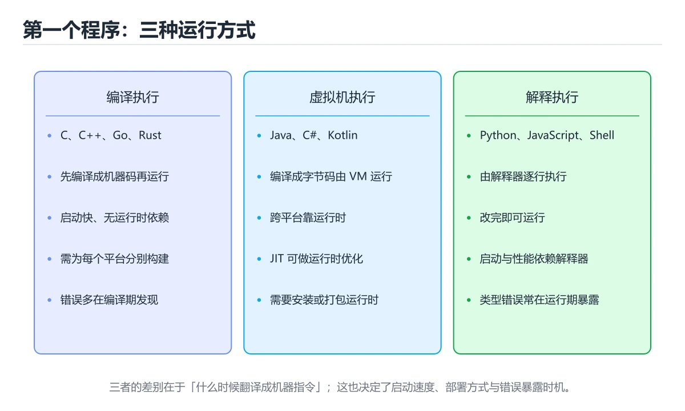

# 九种语言的第一个程序




> 内容更新时间：2026-10-06 · 学习阶段：入门 · 预计用时：50 分钟

## 本节知识框架

**课程定位**：所属分类 `cross_language`（跨语言对照），课程主题 `九种语言的第一个程序`，学习阶段 入门，建议用时 50 分钟。

本课主线：打印、入口、运行方式的横向对照，快速建立语言地图。

**学完本课应当能够**
- 说清 `编译` 与 `入口函数` 的含义与区别，并各举一个正例和一个反例。
- 用本课示例验证 `编译与链接` 的行为，记录输入、输出与失败条件。
- 遇到「把日志写进标准输出」这类问题时，能说出触发条件与修复顺序。

### 从概念到验证的学习链条

1. `编译`：先掌握 把源代码转换成目标机器代码或中间表示，并在此过程中检查语法和类型，再用它解释 `入口函数` 为什么会出现。
2. `入口函数`：先掌握 程序启动后第一个被调用的函数，它的返回值会成为进程退出码，再用它解释 `编译与链接` 为什么会出现。
3. `编译与链接`：先掌握 编译器把源码翻译成目标文件，链接器再合并库与符号，两步都可能报错，再用它解释 `标准输出` 为什么会出现。
4. `标准输出`：先掌握 程序默认的输出通道，与标准错误分开，方便脚本分别重定向，再用它解释 本课示例的观察结果 为什么会出现。

**先修与衔接**：本课是「跨语言对照」分类的第 1 课。相关或后续课程：《类型与变量：九种语言横向对照》。

### 完成判据

- **定义关**：不看正文也能说明 `编译` 是 把源代码转换成目标机器代码或中间表示，并在此过程中检查语法和类型，并指出一个反例。
- **机制关**：能按“输入 → 转换 → 输出 → 验证”复述 `九种语言的第一个程序`，而不是只背结论。
- **示例关**：能运行或推演 `九种语言的第一个程序` 的 `python` 示例，并说明一个真实出现的标识符或字面量。
- **证据关**：能指出 `九种语言的第一个程序` 示例里的 调用了 `print()`，并说明它支持或反驳了本课的哪一条结论。
- **排错关**：能复现 把日志写进标准输出，记录现象并按 结果走 stdout，诊断走 stderr 修复。
- **迁移关**：能把 `跨语言`、`入口`、`编译`、`解释` 放进一个与 `九种语言的第一个程序` 不同的项目场景，并保持输入与验证条件可追踪。
- **复盘关**：学完 `九种语言的第一个程序` 后，用一句话写下仍然不确定的结论，并列出下一次验证需要的输入、环境和成功判据。

### 复习清单

- [ ] 能不看正文复述本课核心术语，并指出一个边界或反例。
- [ ] 能运行或推演本课示例，记录输入、输出与失败现象。
- [ ] 能完成一次自测，并把错题对照错误表定位原因。

## 核心概念定义

| 术语 | 操作性定义 | 常见边界与风险 |
| --- | --- | --- |
| 编译 | 把源代码转换成目标机器代码或中间表示，并在此过程中检查语法和类型。 | 易错：TypeScript；正确做法是用 `tsx` 或先编译。 |
| 入口函数 | 程序启动后第一个被调用的函数，它的返回值会成为进程退出码。 | 易错：C++、Go、Rust；正确做法是写 `main`。 |
| 编译与链接 | 编译器把源码翻译成目标文件，链接器再合并库与符号，两步都可能报错。 | 静态检查只在编译期成立，运行期输入仍需校验。 |
| 标准输出 | 程序默认的输出通道，与标准错误分开，方便脚本分别重定向。 | 易错：管道消费到混合数据；正确做法是结果走 stdout，诊断走 stderr。 |

## 原理与运行机制

### 机制总览

**教材衔接：一句话目标**

同一个「打印问候语并读取输入」的小程序，在九种语言里各有写法。
把它们并排看，能最快建立「语言之间到底差在哪」的直觉。

**教材衔接：九种语言的最小可运行文件**

```python
# hello.py
print("你好，世界")
```

```javascript
// hello.js
console.log("你好，世界");
```

```typescript
// hello.ts
const who: string = "世界";
console.log(`你好，${who}`);
```

```java
// Hello.java —— 文件名必须与类名一致
public class Hello {
    public static void main(String[] args) {
        System.out.println("你好，世界");
    }
}
```

```csharp
// Program.cs（顶层语句写法）
Console.WriteLine("你好，世界");
```

```cpp
// hello.cpp
#include <iostream>

int main() {
    std::cout << "你好，世界\n";
    return 0;
}
```

```go
// main.go
package main

import "fmt"

func main() {
    fmt.Println("你好，世界")
}
```

```rust
// main.rs
fn main() {
    println!("你好，世界");
}
```

```bash
#!/usr/bin/env bash
echo "你好，世界"
```

**教材衔接：怎么跑起来**

| 语言 | 常见执行方式 | 备注 |
| --- | --- | --- |
| Python | `python hello.py` | 无需编译 |
| JavaScript | `node hello.js` | 浏览器里可用 `<script>` |
| TypeScript | `npx tsx hello.ts` 或先编译 | 需要转译或运行时 |
| Java | `javac Hello.java` 然后 `java Hello` | 先编译成字节码 |
| C# | `dotnet run` | 需要 SDK 与项目文件 |
| C++ | `g++ hello.cpp -o hello` 然后 `./hello` | 编译成原生可执行文件 |
| Go | `go run main.go` | 也可 `go build` |
| Rust | `cargo run` 或 `rustc main.rs` | 推荐 Cargo |
| Shell | `bash hello.sh` | 需要执行权限才能直接运行 |

**教材衔接：编译型与解释型不是绝对二分**

| 类型 | 语言 | 特点 |
| --- | --- | --- |
| 直接解释 | Python、Shell | 改完立即运行，启动快、峰值性能一般 |
| 先编译再执行 | C++、Rust、Go | 运行前必须过编译，性能最好 |
| 编译成中间码再即时编译 | Java、C# | 兼顾跨平台与性能 |
| 先转译再执行 | TypeScript、现代 JavaScript | 类型只在转译期存在 |

**教材衔接：读输入：九种写法**

| 语言 | 读取一行输入 |
| --- | --- |
| Python | `name = input("姓名：")` |
| JavaScript（Node） | `readline` 模块或 `process.stdin` |
| TypeScript（Node） | 同 JavaScript，另加类型标注 |
| Java | `new Scanner(System.in).nextLine()` |
| C# | `Console.ReadLine()` |
| C++ | `std::getline(std::cin, name)` |
| Go | `fmt.Scanln(&name)` 或 `bufio.Scanner` |
| Rust | `std::io::stdin().read_line(&mut s)` |
| Shell | `read -r name` |

三个共同点：

1. **输入永远是文本**，要计算必须自己转成数字。
2. 读取都可能失败（文件结束、格式错误），要处理。
3. 提示语与读取通常写成两步，别指望所有语言都支持「带提示的输入」。

### 机制拆解：每一步的输入、动作与输出

#### 1. `编译`
- 输入：`跨语言`；本步把 把源代码转换成目标机器代码或中间表示，并在此过程中检查语法和类型 当作判断规则。
- 动作：围绕 `编译` 保留中间状态，并记录它与 `入口函数` 的对应关系。
- 输出：`入口函数`，它可以被下一段代码、测试或记录继续使用。
- `编译` 的失败条件：当直接跑 `.ts`时，会出现TypeScript。

#### 2. `入口函数`
- 输入：`编译`；本步把 程序启动后第一个被调用的函数，它的返回值会成为进程退出码 当作判断规则。
- 动作：围绕 `入口函数` 保留中间状态，并记录它与 `编译与链接` 的对应关系。
- 输出：`编译与链接`，它可以被下一段代码、测试或记录继续使用。
- `入口函数` 的失败条件：当少了入口函数时，会出现C++、Go、Rust。

#### 3. `编译与链接`
- 输入：`入口函数`；本步把 编译器把源码翻译成目标文件，链接器再合并库与符号，两步都可能报错 当作判断规则。
- 动作：围绕 `编译与链接` 保留中间状态，并记录它与 `标准输出` 的对应关系。
- 输出：`标准输出`，它可以被下一段代码、测试或记录继续使用。
- `编译与链接` 的失败条件：静态检查只在编译期成立，运行期输入仍需校验。

#### 4. `标准输出`
- 输入：`编译与链接`；本步把 程序默认的输出通道，与标准错误分开，方便脚本分别重定向 当作判断规则。
- 动作：围绕 `标准输出` 保留中间状态，并记录它与 `print` 的对应关系。
- 输出：`print`，它可以被下一段代码、测试或记录继续使用。
- `标准输出` 的失败条件：当把日志写进标准输出时，会出现管道消费到混合数据。

### 示例中的可观察事实

1. 调用了 `print()`；它对应的课程主题是 `九种语言的第一个程序`。
2. 出现字面量 `你好，世界`；它对应的课程主题是 `九种语言的第一个程序`。
3. 调用了 `log()`；它对应的课程主题是 `九种语言的第一个程序`。

### 复现实验记录

- 环境：`九种语言的第一个程序` 使用 `python` 示例，固定 `跨语言`、`入口`、`编译`、`解释` 作为第一组条件。
- 首轮输入：先确认 调用了 `print()`，预测 `编译` 会怎样变化。
- 基线观察：记录命令、输入、输出和错误原文，不用截图代替可复制的文本。
- 单变量修改：只改变 `跨语言`，观察 `标准输出` 是否仍满足定义。
- 失败注入：复现 把日志写进标准输出，确认现象是 管道消费到混合数据。
- 记录结论：把“修改前、修改后、预期变化、实际变化”写成四列表，这样复盘 `九种语言的第一个程序` 时才能区分概念错误与实现错误。

## 典型应用场景

| 场景 | 典型输入或前提 | 期望产物 |
| --- | --- | --- |
| 学习验证 | 使用本课最小示例和 跨语言、入口 | 能复现正文结论，并解释每一步。 |
| 工程落地 | 把「九种语言的第一个程序」放入真实模块或服务边界 | 输出可观测、失败可定位、参数可配置。 |
| 故障排查 | 只改一个版本、规模、输入或依赖条件 | 能区分概念错误、实现错误和环境差异。 |

- **把日志写进标准输出**：典型现象是管道消费到混合数据；正确做法是结果走 stdout，诊断走 stderr。
- **依赖全局安装**：典型现象是换机器后无法复现；正确做法是使用项目级依赖和锁文件。
- **忽略退出码**：典型现象是CI 看起来成功但实际失败；正确做法是在脚本和流水线中检查退出码。
- **把 REPL 当成项目结构**：典型现象是代码无法复现和测试；正确做法是把探索结果整理成文件和测试。

### 最小验证场景

- 准备：保留 `python` 示例的原始输入，先记录 `九种语言的第一个程序` 的基线输出和完整运行命令。
- 观察：先核对 调用了 `print()`，再改变一个与 `编译` 相关的条件。
- 判定：新结果与 `九种语言的第一个程序` 的基线不同不等于错误；只有当差异破坏了 `编译` 的定义或错误表中的约束，才判定为失败。

### 选择与边界

- 使用 `编译` 时，先满足它的定义：把源代码转换成目标机器代码或中间表示，并在此过程中检查语法和类型；易错：TypeScript；正确做法是用 `tsx` 或先编译。
- 使用 `入口函数` 时，先满足它的定义：程序启动后第一个被调用的函数，它的返回值会成为进程退出码；易错：C++、Go、Rust；正确做法是写 `main`。
- 使用 `编译与链接` 时，先满足它的定义：编译器把源码翻译成目标文件，链接器再合并库与符号，两步都可能报错；静态检查只在编译期成立，运行期输入仍需校验。
- 使用 `标准输出` 时，先满足它的定义：程序默认的输出通道，与标准错误分开，方便脚本分别重定向；易错：管道消费到混合数据；正确做法是结果走 stdout，诊断走 stderr。

## 代码/协议/SQL 示例

**教材衔接：深入补充：九种语言的第一个程序**

前面已经建立了基本概念。这一节换一个角度，把九种语言的第一个程序放进真实工程里，
重点回答三件事：WriteLine 解决什么问题、依赖哪些前提、在什么条件下失效。

### 一、核心模型

不同语言的“第一个程序”看似只差一行打印，实际上暴露了完整的工具链差异：源码如何编译或解释、依赖如何安装、程序从哪里进入、输出写到哪里、退出码如何返回。

```text
安装工具链 → 创建项目 → 编写入口文件 → 编译或解释 → 运行 → 观察输出与退出码 → 打包分发
```

### 二、关键机制拆解

1. 编译型语言先生成机器码或字节码，解释型语言通常直接执行源码，但现代语言常混合编译与即时优化。
2. 入口点可能是 main 函数、模块顶层代码、脚本首行或框架约定，理解入口是调试启动问题的第一步。
3. 标准输出用于正常结果，标准错误用于诊断信息，退出码 0 表示成功，非 0 表示失败。
4. 包管理器和锁文件决定依赖版本，虚拟环境或项目文件隔离不同项目的依赖。
5. 构建产物可能是二进制、字节码、容器镜像或静态资源；部署方式取决于运行环境。
6. REPL 适合探索语法，文件加版本控制适合可复现工程，两者应配合而不是互相替代。

### 三、对照表：抓住容易混淆的边界

| 维度 | 一侧 | 另一侧 |
| --- | --- | --- |
| 解释执行 | 逐条读取源码并执行 | 启动快但运行时优化依实现而定 |
| 编译执行 | 先转成机器码或字节码 | 构建慢但运行稳定、便于分发 |
| 标准输出 | 程序正常结果 | 可被管道和重定向处理 |
| 标准错误 | 日志、警告和错误 | 不应混入结构化结果 |

### 四、工作示例

同一个“打印并返回失败”的程序，在 Python 中用 `print` 与 `sys.exit(1)`，在 Go 中用 `fmt.Println` 与 `os.Exit(1)`，在 Shell 中用 `echo` 与 `exit 1`。语言不同，但标准输出、标准错误和退出码的契约一致。

### 五、常见误区与失效边界

| 错误做法或假设 | 后果 | 正确做法 |
| --- | --- | --- |
| 把日志写进标准输出 | 管道消费到混合数据 | 结果走 stdout，诊断走 stderr |
| 依赖全局安装 | 换机器后无法复现 | 使用项目级依赖和锁文件 |
| 忽略退出码 | CI 看起来成功但实际失败 | 在脚本和流水线中检查退出码 |
| 把 REPL 当成项目结构 | 代码无法复现和测试 | 把探索结果整理成文件和测试 |

### 六、场景推演

CI 中构建脚本偶发失败，但日志没有报错。检查发现程序把错误写到标准输出后仍返回 0，流水线因此误判成功。修复方式是错误写 stderr，并在所有失败分支返回非 0 退出码。

### 七、自测问答

**Q1：stdout 和 stderr 为什么要分开？**

正常结果与诊断信息用途不同，分开后管道和日志系统才能正确处理。

**Q2：退出码在 CI 中有什么作用？**

它决定流水线是否把当前步骤判定为成功。

**Q3：为什么要使用锁文件？**

它固定依赖版本，保证不同机器构建结果可复现。

**Q4：REPL 和源文件各自适合什么？**

REPL 适合探索，源文件适合版本控制、测试和部署。

### 八、小项目：把知识变成可检查的产出

用三种语言各写一个小程序：读取两个参数，输出结果到 stdout，错误到 stderr，成功返回 0、参数错误返回 2；再写一个脚本统一调用并检查退出码。

### 九、适用边界

第一个程序只验证工具链是否可用，不代表语言全貌。真正的工程还需要包管理、测试、日志、配置、构建和发布，后续课程会逐项展开。

### 十、完成检查清单

- [ ] 能在九种语言中说出编译与运行命令
- [ ] 能区分 stdout、stderr 和退出码
- [ ] 能创建隔离的依赖环境
- [ ] 能解释构建产物和运行环境
- [ ] 能用脚本检查退出码

### 十一、复习顺序

1. 不看资料讲清「九种语言的第一个程序」的核心模型，并各举一个正例和反例。
2. 再对照表逐行解释容易混淆的概念，每个概念补一个反例。
3. 跟着工作示例做一遍，改变一个条件并预测结果。
4. 用自测问答检查理解，错题回到对应小节重新阅读。
5. 把 入口 的实现、测试与复盘整理成一份可提交的产物。

> 复习不是重读一遍，而是离开原文重新产出：复述、改写、验证、复盘。

**教材衔接：深挖「跨语言」的边界与代价**

### 一、跨语言 的关键句与适用条件

| 正文出处 | 原句 | 用之前先确认 |
| --- | --- | --- |
| 一、核心模型 | 不同语言的“第一个程序”看似只差一行打印，实际上暴露了完整的工具链差异：源码如何编译或解释、依赖如何安装、程序从哪里进入、输出写到哪里、退出码如何返回。 | 把 编译 换成边界值时，这一步是否仍然成立 |
| 二、关键机制拆解 | 编译型语言先生成机器码或字节码，解释型语言通常直接执行源码，但现代语言常混合编译与即时优化。 | 把 编译 换成边界值时，这一步是否仍然成立 |
| 二、关键机制拆解 | 入口点可能是 main 函数、模块顶层代码、脚本首行或框架约定，理解入口是调试启动问题的第一步。 | 把 入口 换成边界值时，这一步是否仍然成立 |
| 十一、复习顺序 | 再对照表逐行解释容易混淆的概念，每个概念补一个反例。 | 把 解释 换成边界值时，这一步是否仍然成立 |
| 十一、复习顺序 | 把 入口 的实现、测试与复盘整理成一份可提交的产物。 | 把 入口 换成边界值时，这一步是否仍然成立 |

### 二、把 hello 推到边界

下面是本课第一段代码（python），先原样运行一次作为基线：

```python
# hello.py
print("你好，世界")
```

| 变式 | 怎么改 | 先写下什么 | 观察点 |
| --- | --- | --- | --- |
| 边界输入 | 把 hello 的输入换成空值或最大值 | 预测输出 | 是否报错、是否静默返回 |
| 只改一处 | 把 hello 的一个参数改成另一档 | 预测差异来源 | 输出变化能否用本课结论解释 |
| 去掉一步 | 注释掉 hello 之后的一行 | 预测哪一步先失败 | 错误位置是否与预期一致 |


### 四、测验复盘

| 题号 | 正确答案 | 最容易选错的干扰项 | 复盘动作 |
| --- | --- | --- | --- |
| 1 | 这段代码会产生可观察的输出，运行后能看到结果。 | 这段代码只做静态声明，没有循环、分支或可观察输出。 | 把干扰项改写成一句反例，再说明它违反本课哪条前提 |
| 2 | 它们先编译成中间码，再由运行时即时编译执行 | 它们属于纯解释型，逐行执行源码 | 把干扰项改写成一句反例，再说明它违反本课哪条前提 |
| 3 | 类型信息需要在运行前被转译掉 | TypeScript 不是编程语言 | 把干扰项改写成一句反例，再说明它违反本课哪条前提 |
| 4 | 输入默认是文本 | 输入一定是数字类型 | 把干扰项改写成一句反例，再说明它违反本课哪条前提 |
| 5 | 0 | （无干扰项） | 把干扰项改写成一句反例，再说明它违反本课哪条前提 |
| 6 | 它们先编译成中间码，再由运行时即时编译执行 | Java 的 main 可以写在任意类里且文件名随意 | 把干扰项改写成一句反例，再说明它违反本课哪条前提 |

### 五、离开本课前的自检

- [ ] 能用一句话说明 跨语言 解决什么问题、在什么条件下失效。
- [ ] 能指出 入口 与相邻概念的分工，并各举一个反例。
- [ ] 能在不看解析的情况下重做本课测验，并解释九种语言的第一个程序中每个错误选项。
- [ ] 能按第二节的表格完成至少两次 跨语言 实验，并留下命令与输出。
- [ ] 能写出「九种语言的第一个程序」的三条结论，每条都配一个适用边界。

**运行方式**：运行 `九种语言的第一个程序` 的示例时，保存为 `.py` 文件后用 `python 文件名.py` 运行；第三方依赖先在虚拟环境里安装。

### 示例精读：先找证据，再改一个条件

1. 调用了 `print()`；它出现在 `九种语言的第一个程序` 的示例中，阅读时先确认它前后各发生了什么。
2. 出现字面量 `你好，世界`；它出现在 `九种语言的第一个程序` 的示例中，阅读时先确认它前后各发生了什么。
3. 调用了 `log()`；它出现在 `九种语言的第一个程序` 的示例中，阅读时先确认它前后各发生了什么。
- 在 `九种语言的第一个程序` 中与 `编译` 对照：示例必须能支持 把源代码转换成目标机器代码或中间表示，并在此过程中检查语法和类型，否则说明这一段还缺少实现或验证步骤。
- 在 `九种语言的第一个程序` 中与 `入口函数` 对照：示例必须能支持 程序启动后第一个被调用的函数，它的返回值会成为进程退出码，否则说明这一段还缺少实现或验证步骤。
- 在 `九种语言的第一个程序` 中与 `编译与链接` 对照：示例必须能支持 编译器把源码翻译成目标文件，链接器再合并库与符号，两步都可能报错，否则说明这一段还缺少实现或验证步骤。
- 在 `九种语言的第一个程序` 中与 `标准输出` 对照：示例必须能支持 程序默认的输出通道，与标准错误分开，方便脚本分别重定向，否则说明这一段还缺少实现或验证步骤。

## 时间/空间复杂度或性能分析

**性能关注点（九种语言的第一个程序）**：同一算法的实现差异体现在常数项与内存模型：用同一输入横向对比耗时与内存。

**本课特有开销（九种语言的第一个程序 · 跨语言）**：并发度提高后要观察是否出现拐点：延迟上升而吞吐不增，说明瓶颈已转移。

**测量方法**：以 `九种语言的第一个程序` 的 `跨语言` 场景为对象，固定输入跑一遍记录基线，再把规模或并发度提高一个数量级复测；两次结果的差值与波动范围才是结论依据。

### 需要控制的变量与记录项

- `九种语言的第一个程序` 的 `跨语言`：固定它的版本、输入范围和资源上限，分别记录速度、内存与失败率的变化。
- `九种语言的第一个程序` 的 `入口`：固定它的版本、输入范围和资源上限，分别记录速度、内存与失败率的变化。
- `九种语言的第一个程序` 的 `编译`：固定它的版本、输入范围和资源上限，分别记录速度、内存与失败率的变化。
- `九种语言的第一个程序` 的 `解释`：固定它的版本、输入范围和资源上限，分别记录速度、内存与失败率的变化。
- `九种语言的第一个程序` 的 `Hello World`：固定它的版本、输入范围和资源上限，分别记录速度、内存与失败率的变化。
- `九种语言的第一个程序` 中 `编译` 的边界：易错：TypeScript；正确做法是用 `tsx` 或先编译。达到边界时不要外推，必须重新测量。
- `九种语言的第一个程序` 中 `入口函数` 的边界：易错：C++、Go、Rust；正确做法是写 `main`。达到边界时不要外推，必须重新测量。
- `九种语言的第一个程序` 中 `编译与链接` 的边界：静态检查只在编译期成立，运行期输入仍需校验。达到边界时不要外推，必须重新测量。
- `九种语言的第一个程序` 中 `标准输出` 的边界：易错：管道消费到混合数据；正确做法是结果走 stdout，诊断走 stderr。达到边界时不要外推，必须重新测量。
- `九种语言的第一个程序` 的代码证据：先验证 调用了 `print()`，再记录该路径的输入规模与耗时；只看代码行数不能推出复杂度。

## 常见误区与易错点

| 容易写错的做法 | 实际现象 | 原因与正确做法 |
| --- | --- | --- |
| 把日志写进标准输出 | 管道消费到混合数据 | 结果走 stdout，诊断走 stderr |
| 依赖全局安装 | 换机器后无法复现 | 使用项目级依赖和锁文件 |
| 忽略退出码 | CI 看起来成功但实际失败 | 在脚本和流水线中检查退出码 |
| 把 REPL 当成项目结构 | 代码无法复现和测试 | 把探索结果整理成文件和测试 |
| 文件名与类名不一致 | Java | `Hello.java` 对应 `public class Hello` |
| 忘了分号 | Java、C#、C++、Rust | 语句结尾补分号 |
| 忘了引入标准库 | C++、Go | `#include <iostream>`、`import "fmt"` |
| 少了入口函数 | C++、Go、Rust | 写 `main` |
| 用了中文标点 | 全部 | 代码里只用英文半角标点 |
| Shell 脚本没有执行权限 | Shell | `chmod +x` 或 `bash script.sh` |
| 直接跑 `.ts` | TypeScript | 用 `tsx` 或先编译 |
| 忘了换行符 | C++ | `"\n"` 或 `std::endl` |
| 直接跑 .ts | TypeScript。 | 用 tsx 或先编译。 |

### 现场 1：把日志写进标准输出

**症状**：管道消费到混合数据。

**根因与修复**：结果走 stdout，诊断走 stderr。

**自检**：在本课示例里复现「把日志写进标准输出」，改成结果走 stdout，诊断走 stderr后重跑；如果症状消失且失败路径按预期变化，说明定位正确。

### 现场 2：依赖全局安装

**症状**：换机器后无法复现。

**根因与修复**：使用项目级依赖和锁文件。

**自检**：在本课示例里复现「依赖全局安装」，改成使用项目级依赖和锁文件后重跑；如果症状消失且失败路径按预期变化，说明定位正确。

### 现场 3：忽略退出码

**症状**：CI 看起来成功但实际失败。

**根因与修复**：在脚本和流水线中检查退出码。

**自检**：在本课示例里复现「忽略退出码」，改成在脚本和流水线中检查退出码后重跑；如果症状消失且失败路径按预期变化，说明定位正确。

### 现场 4：把 REPL 当成项目结构

**症状**：代码无法复现和测试。

**根因与修复**：把探索结果整理成文件和测试。

**自检**：在本课示例里复现「把 REPL 当成项目结构」，改成把探索结果整理成文件和测试后重跑；如果症状消失且失败路径按预期变化，说明定位正确。

### 现场 5：文件名与类名不一致

**症状**：Java。

**根因与修复**：`Hello.java` 对应 `public class Hello`。

**自检**：在本课示例里复现「文件名与类名不一致」，改成`Hello.java` 对应 `public class Hello`后重跑；如果症状消失且失败路径按预期变化，说明定位正确。

### 现场 6：忘了分号

**症状**：Java、C#、C++、Rust。

**根因与修复**：语句结尾补分号。

**自检**：在本课示例里复现「忘了分号」，改成语句结尾补分号后重跑；如果症状消失且失败路径按预期变化，说明定位正确。

### 现场 7：忘了引入标准库

**症状**：C++、Go。

**根因与修复**：`#include <iostream>`、`import "fmt"`。

**自检**：在本课示例里复现「忘了引入标准库」，改成`#include <iostream>`、`import "fmt"`后重跑；如果症状消失且失败路径按预期变化，说明定位正确。

### 现场 8：少了入口函数

**症状**：C++、Go、Rust。

**根因与修复**：写 `main`。

**自检**：在本课示例里复现「少了入口函数」，改成写 `main`后重跑；如果症状消失且失败路径按预期变化，说明定位正确。

### 现场 9：用了中文标点

**症状**：全部。

**根因与修复**：代码里只用英文半角标点。

**自检**：在本课示例里复现「用了中文标点」，改成代码里只用英文半角标点后重跑；如果症状消失且失败路径按预期变化，说明定位正确。

## 与其他知识点的关系

**教材衔接：横向对照：打印一句话**

| 语言 | 打印写法 | 需要分号 | 入口 |
| --- | --- | --- | --- |
| Python | `print("你好")` | 否 | 顶层的任意代码 |
| JavaScript | `console.log("你好")` | 否 | 顶层的任意代码 |
| TypeScript | `console.log("你好")` | 否 | 顶层或函数 |
| Java | `System.out.println("你好");` | 是 | `public static void main` |
| C# | `Console.WriteLine("你好");` | 是 | 顶层语句或 `Main` |
| C++ | `std::cout << "你好\n";` | 是 | `int main()` |
| Go | `fmt.Println("你好")` | 否 | `func main()` |
| Rust | `println!("你好");` | 是 | `fn main()` |
| Shell | `echo "你好"` | 否 | 脚本从上到下 |

- **相关或后续**：`类型与变量：九种语言横向对照`。本课术语会在这些课程里继续使用。
- **术语归属**：`编译`、`入口函数`、`编译与链接` 的定义以本课「核心概念定义」为准，换到其他课程时先确认定义是否被改写。

### 先修与后续术语接口

- `类型与变量：九种语言横向对照`：两者通过本分类的学习顺序衔接，阅读时重点比较各自的输入与失败条件。

### 容易混淆的相邻概念

- `编译` 与 `入口函数`：前者强调 把源代码转换成目标机器代码或中间表示，并在此过程中检查语法和类型；后者强调 程序启动后第一个被调用的函数，它的返回值会成为进程退出码。判断时分别检查两条定义的适用范围，不要只看名称相似就互换。
- `入口函数` 与 `编译与链接`：前者强调 程序启动后第一个被调用的函数，它的返回值会成为进程退出码；后者强调 编译器把源码翻译成目标文件，链接器再合并库与符号，两步都可能报错。判断时分别检查两条定义的适用范围，不要只看名称相似就互换。
- `编译与链接` 与 `标准输出`：前者强调 编译器把源码翻译成目标文件，链接器再合并库与符号，两步都可能报错；后者强调 程序默认的输出通道，与标准错误分开，方便脚本分别重定向。判断时分别检查两条定义的适用范围，不要只看名称相似就互换。

## 自测题与参考答案

> 先独立作答，再对照参考答案；答案都能在本课正文、术语表或错误表里找到依据。

### 自测 1（概念复述）

不看正文，写出 `编译` 的操作性定义，并说明它与 `入口函数` 的区别。

**参考答案**：把源代码转换成目标机器代码或中间表示，并在此过程中检查语法和类型。

`入口函数` 的定位是：程序启动后第一个被调用的函数，它的返回值会成为进程退出码；两者的差别要从适用对象与失败模式上说明。

### 自测 2（排错）

本课错误表记录了「把日志写进标准输出」这类做法。请写出它会出现的现象、根因，以及修复顺序。

**参考答案**：现象是管道消费到混合数据；正确做法是结果走 stdout，诊断走 stderr。修复时先复现现象并保留证据，再改动一处假设重跑，确认现象消失。

### 自测 3（动手验证）

运行本课的 `python` 示例，把其中的 `"你好，世界"` 换成一个边界值后重新运行，记录输出与错误信息。

**参考答案**：正常输入下 `python` 示例应当复现正文给出的结果；把 `"你好，世界"` 换成边界值后，如果结果改变或报错，先核对它是否满足 `九种语言的第一个程序` 中`编译` 的适用范围，再检查错误表里是否有同类现象。

### 自测 4（代码阅读）

阅读本课开头的 `python` 示例，说明它体现了`编译` 的哪一条性质，并指出改动哪个输入会让这条性质不再成立。

**参考答案**：`编译` 的定义是 把源代码转换成目标机器代码或中间表示，并在此过程中检查语法和类型，示例正是在实现这条定义。改动与 `编译` 有关的一个输入后，如果结果不再符合 `九种语言的第一个程序` 的正文描述，就说明该性质只在当前前提成立。

### 自测 5（迁移）

把 `九种语言的第一个程序` 的方法迁移到自己的项目：围绕 `编译` 写出一个与错误表同类的风险点，并说明触发条件和检验方式。

**参考答案**：例如「直接跑 .ts」，它会导致TypeScript；检验方式是按用 tsx 或先编译改一处再复现，确认现象消失且没有引入新的失败分支。

### 自测 6（对比）

用一个表格对比 `编译` 与 `入口函数`：各写一行适用场景、一行失败表现。

**参考答案**：`编译` 的定义是把源代码转换成目标机器代码或中间表示，并在此过程中检查语法和类型；`入口函数` 的定义是程序启动后第一个被调用的函数，它的返回值会成为进程退出码。两者的失败表现分别对应本课错误表里与本术语相关的行。

### 自测 7（排错顺序）

面对「把日志写进标准输出」引发的问题，请把“复现 管道消费到混合数据 → 保留证据 → 结果走 stdout，诊断走 stderr → 回归验证”四步写成可执行的检查清单。

**参考答案**：第一步按管道消费到混合数据复现；第二步记录输入、版本与完整报错；第三步按结果走 stdout，诊断走 stderr只改一处；第四步重跑并确认失败路径也按预期变化。

### 自测 8（边界判断）

针对 `标准输出`，分别写出“可以使用”的条件和“结论不再成立”的条件。

**参考答案**：易错：管道消费到混合数据；正确做法是结果走 stdout，诊断走 stderr。 同时要把 `标准输出` 的定义 程序默认的输出通道，与标准错误分开，方便脚本分别重定向 与实际输入逐项对照。

### 自测 9（机制重建）

不看正文，按输入、转换、输出、验证四段重建 `编译` → `入口函数` → `编译与链接` → `标准输出` 的作用链。

**参考答案**：起点是 `编译` 的定义 把源代码转换成目标机器代码或中间表示，并在此过程中检查语法和类型；中间每一步都保留可观察状态；终点由 `标准输出` 检查，失败时回到错误表定位第一个偏离定义的步骤。

### 自测 10（综合排错）

在 `九种语言的第一个程序` 中，现象是 TypeScript。请围绕 直接跑 .ts 写出最小复现、关键证据、修复动作和回归验证，并说明为什么不能只凭一次运行下结论。

**参考答案**：先复现 直接跑 .ts，记录输入与完整错误；再按 用 tsx 或先编译 只改一处。回归时同时跑正常路径和边界路径，只有两次结果都可解释，才把修复视为完成。

### 自测 11（一分钟复述）

用每分钟约 200 字的速度复述 `九种语言的第一个程序`：先给主问题，再按顺序说出 `编译`、`入口函数`、`编译与链接`、`标准输出`，最后给一个失败案例。

**自评标准**：主问题必须对应 打印、入口、运行方式的横向对照，快速建立语言地图；每个术语都要能接上一句定义或边界；失败案例必须写成可观察现象，不能用“可能有风险”代替证据。

## 术语速查

| 术语 | 一句话说明 |
| --- | --- |
| `编译` | 把源代码转换成目标机器代码或中间表示，并在此过程中检查语法和类型。 |
| `入口函数` | 程序启动后第一个被调用的函数，它的返回值会成为进程退出码。 |
| `编译与链接` | 编译器把源码翻译成目标文件，链接器再合并库与符号，两步都可能报错。 |
| `标准输出` | 程序默认的输出通道，与标准错误分开，方便脚本分别重定向。 |

**术语关系**：`编译`（把源代码转换成目标机器代码或中间表示） → `入口函数`（程序启动后第一个被调用的函数） → `编译与链接`（编译器把源码翻译成目标文件） → `标准输出`（程序默认的输出通道）。

## 考点精讲

`九种语言的第一个程序` 的题库有 6 道题，下面逐题给出题干、正确项与判断依据：先自己作答，再核对正确项，最后回到正文对应小节复核。

### 考点 1：第 1 题

- **题目**：阅读 `九种语言的第一个程序` 的 `编译` 示例。它服务于打印、入口、运行方式的横向对照，快速建立语言地图。代码中实际包含下列哪一项？
- **正确项**：出现字面量 `你好，世界`
- **判断依据**：这道题落在术语 `编译` 上：把源代码转换成目标机器代码或中间表示，并在此过程中检查语法和类型。复习时把 `编译` 的定义、适用边界和一个反例一起说清楚，再回到「核心概念定义」核对原文。

### 考点 2：第 2 题

- **题目**：把「编译型 vs 解释型」用在 Java 与 C# 上，最准确的说法是？
- **正确项**：它们先编译成中间码
- **判断依据**：这道题落在术语 `编译` 上：把源代码转换成目标机器代码或中间表示，并在此过程中检查语法和类型。复习时把 `编译` 的定义、适用边界和一个反例一起说清楚，再回到「核心概念定义」核对原文。

### 考点 3：第 3 题

- **题目**：TypeScript 文件不能直接被 Node 运行，原因是？
- **正确项**：类型信息需要在运行前被转译掉
- **判断依据**：这道题检验本课主问题：打印、入口、运行方式的横向对照，快速建立语言地图。复习时先复述本课主问题，再举一个会让结论失效的输入。

### 考点 4：第 4 题

- **题目**：关于读取用户输入，跨语言共同的注意事项是？
- **正确项**：输入默认是文本
- **判断依据**：这道题检验本课主问题：打印、入口、运行方式的横向对照，快速建立语言地图。复习时先复述本课主问题，再举一个会让结论失效的输入。

### 考点 5：第 5 题

- **题目**：填空：补齐下面这段术语说明中的空缺。课程 `打印、入口、运行方式的横向对照，快速建立语言地图。`，这段说明是：`____`：程序默认的输出通道，与标准错误分开，方便脚本分别重定向。空缺处应填哪个术语？
- **正确项**：标准输出
- **判断依据**：这道题落在术语 `标准输出` 上：程序默认的输出通道，与标准错误分开，方便脚本分别重定向。复习时把 `标准输出` 的定义、适用边界和一个反例一起说清楚，再回到「核心概念定义」核对原文。

### 考点 6：第 6 题

- **题目**：关于 `编译`，下列哪些说法与 `九种语言的第一个程序` 的正文一致？判断时以打印、入口、运行方式的横向对照，快速建立语言地图。为主线。（多选）
- **正确项**：它们先编译成中间码，再由运行时即时编译执行；Python 与 JavaScript 可以在顶层直接写代码
- **判断依据**：这道题落在术语 `编译` 上：把源代码转换成目标机器代码或中间表示，并在此过程中检查语法和类型。复习时把 `编译` 的定义、适用边界和一个反例一起说清楚，再回到「核心概念定义」核对原文。

### 考点 7：`编译`

- **要点**：把源代码转换成目标机器代码或中间表示，并在此过程中检查语法和类型。
- **编译 的边界**：易错：TypeScript；正确做法是用 `tsx` 或先编译。

### 考点 8：`入口函数`

- **要点**：程序启动后第一个被调用的函数，它的返回值会成为进程退出码。
- **入口函数 的边界**：易错：C++、Go、Rust；正确做法是写 `main`。

### 考点 9：`编译与链接`

- **要点**：编译器把源码翻译成目标文件，链接器再合并库与符号，两步都可能报错。
- **编译与链接 的边界**：静态检查只在编译期成立，运行期输入仍需校验。

### 考点 10：`标准输出`

- **要点**：程序默认的输出通道，与标准错误分开，方便脚本分别重定向。
- **标准输出 的边界**：易错：管道消费到混合数据；正确做法是结果走 stdout，诊断走 stderr。

### 考点 11：排错——把日志写进标准输出

- **现象**：管道消费到混合数据。
- **处理**：结果走 stdout，诊断走 stderr。

### 考点 12：排错——依赖全局安装

- **现象**：换机器后无法复现。
- **处理**：使用项目级依赖和锁文件。

### 考点 13：综合辨析——`编译` 与 `标准输出`

- **辨析点**：`编译` 的定义是 把源代码转换成目标机器代码或中间表示，并在此过程中检查语法和类型；`标准输出` 的定义是 程序默认的输出通道，与标准错误分开，方便脚本分别重定向。
- **答题要求**：面对 `九种语言的第一个程序` 的题目，先判断描述的是 `编译` 还是 `标准输出`，再归到对应定义，最后写出一个会让该定义失效的边界输入。

### 考点 14：排错评分点

- **现象分**：能写出 管道消费到混合数据，而不是只写“程序有错”。
- **证据分**：保留触发 把日志写进标准输出 的输入、版本和错误原文。
- **修复分**：按 结果走 stdout，诊断走 stderr 只改一处，并同时回归正常路径与边界路径。

## 内容元数据

- 内容版本：v2.0
- 最后更新：2026-10-06
- 学习阶段：入门
- 适用环境：九种主流语言生态横向对照
；本课聚焦 跨语言。
- 内容来源：内置结构化课程与工程实践整理
- 相关主题：跨语言、入口、编译、解释、Hello World
- 质量版本：P0 测验标准 + P1 覆盖扩展 + P2 体验补全

## 参考资料与复核

- 最后复核：2026-10-04
- 下次复核：2027-07-17
- 复核范围：版本兼容、API 行为、安全建议与工程实践
- 来源性质：官方文档、标准或权威教材；本课核对关键词：跨语言、入口、编译、解释、Hello World。

| 参考资料 | 本课用途 |
| --- | --- |
| [DevDocs](https://devdocs.io/) | 多语言 API 快速检索 |
| [Exercism](https://exercism.org/docs) | 多语言练习与反馈 |
| [Programming Languages DB](https://pldb.io/) | 语言特性与生态对照 |

| [本课术语索引：九种语言的第一个程序](#核心概念定义) | 按本课输入、术语边界和错误表现逐项核对 |
> 「九种语言的第一个程序」的链接用于离线阅读后的延伸核对；App 不会自动联网。

<!-- p1-deep-dive:start -->