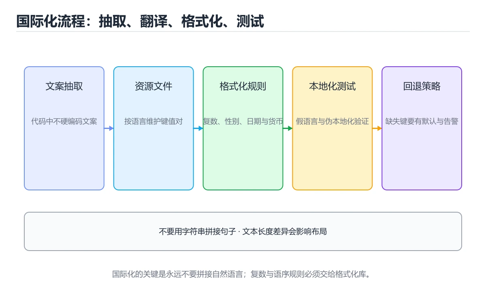
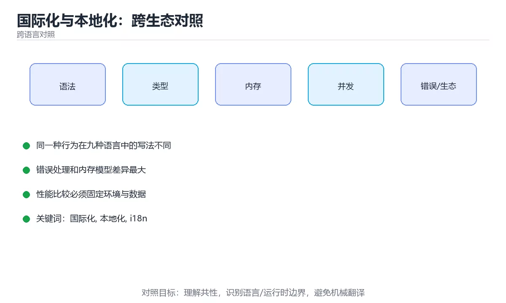

# 本课主题





> 内容更新时间：2026-10-03 · 学习阶段：入门 · 预计用时：18 分钟

## 学习目标

- 能用自己的话解释本课主题解决了什么问题，而不是只背术语。
- 能说清 「国际化」、「本地化」、「i18n」、「复数」 之间的关系，并分别举出一个例子。
- 能把本课知识放回「跨语言对照」的知识体系，说明它和相邻主题的边界。
- 能完成本课练习，并用验收标准检查自己的结果。

> 一句话摘要：五类需本地化的内容、九种方案、拼接句子与格式化的经典坑。

## 前置知识

- 先完成上一课《接口文档与契约测试：跨生态对照》；如果已经掌握，可以直接用本课练习自测。
- 本课阶段：入门。只需要基本计算机操作，不要求编程经验。
- 开始前先复习：国际化、本地化、i18n。
- 如果某一步看不懂，先记录具体卡点，完成练习后再回头读一遍。

## 一句话说清

国际化（i18n）是「让代码支持多语言」，本地化（l10n）是「提供具体语言的翻译」。
做对的关键只有两条：**不要在代码里写死文案**，**不要假设格式与语言无关**。

## 五类必须本地化的内容

```text
① 文案：界面文字、提示、错误信息
② 数字：千分位、小数点符号、精度
③ 日期时间：格式、周起始日、时区
④ 货币：符号、位置、小数位
⑤ 排序与复数：字母顺序、复数规则
```

| 内容 | 中文示例 | 英文示例 | 注意 |
| --- | --- | --- | --- |
| 数字 | 1,234.56 | 1,234.56 | 德语用 1.234,56 |
| 日期 | 2026年3月5日 | Mar 5, 2026 | 避免手写格式串 |
| 货币 | ¥1,234.56 | $1,234.56 | 符号位置随语言变化 |
| 复数 | 3 条消息 | 3 messages / 1 message | 英语区分单复数 |
| 排序 | 拼音顺序 | 字母顺序 | 需要专门的排序规则 |

## 各生态的主流方案

| 语言 | 主流库 | 资源文件 | 复数支持 |
| --- | --- | --- | --- |
| Python | `gettext` / Babel | `.po` / `.mo` | 有 |
| JavaScript | i18next / FormatJS | JSON | 有（ICU） |
| TypeScript | i18next / typesafe-i18n | JSON | 有 |
| Java | ResourceBundle / ICU4J | `.properties` | 有 |
| C# | `.resx` + `IStringLocalizer` | `.resx` | 有 |
| C++ | gettext / Qt Linguist | `.po` / `.ts` | 部分 |
| Go | `golang.org/x/text` | JSON / PO | 有 |
| Rust | `fluent` / `rust-i18n` | `.ftl` / YAML | 有 |
| Shell | 自建消息表 | sh 文件 | 无 |

## 写法示例：不要在代码里拼句子

```python
# 反例：拼接句子，语序一变就错
print("你好，" + name + "，你有 " + str(count) + " 条消息")

# 正例：整句作为资源，占位符由库填充
from gettext import gettext as _

print(_("你好，{name}，你有 {count} 条消息").format(name=name, count=count))
```

```typescript
// 反例
const text = `Hello, ${name}, you have ${count} messages`;

// 正例：i18next，支持复数
import i18n from "i18next";

const text = i18n.t("messages", { name, count });
// zh.json:  "messages": "你好，{{name}}，你有 {{count}} 条消息"
// en.json:  "messages_one": "Hello {{name}}, you have {{count}} message",
//           "messages_other": "Hello {{name}}, you have {{count}} messages"
```

```csharp
// ASP.NET Core
public class HomeController(IStringLocalizer<HomeController> localizer)
{
    public string Greet(string name, int count) =>
        localizer["Messages", name, count];
}
```

```go
// Go：用 x/text 做复数与格式化
import "golang.org/x/text/message"

p := message.NewPrinter(language.SimplifiedChinese)
p.Printf("你有 %d 条消息\n", count)
```

## 三种经典坑

```text
① 拼接句子
   ✗ "You have " + count + " messages"
   ✓ 整句作为一条资源，占位符替换
   原因：不同语言语序、量词、性别都不一样

② 手动格式化日期与数字
   ✗ dt.Format("2006-01-02") 写死在展示层
   ✓ 用 Intl / DateTimeFormatter / Babel 按 locale 格式化

③ 用图标或颜色单独表意
   ✗ 只用红色表示错误
   ✓ 颜色 + 图标 + 文案三者结合
```

## 界面与资源的三个实践

```text
1. 文案集中管理：禁止在组件里写字符串字面量
2. 预留空间：德语、俄语文本通常比英语长 30%，按钮要能伸缩
3. 布局方向：支持从右到左（RTL）时要用逻辑属性
   padding-start / padding-end  而不是 padding-left / padding-right
```

```css
/* 支持 RTL 的逻辑属性写法 */
.card {
  padding-inline-start: 16px;   /* 而不是 padding-left */
  margin-inline-end: 8px;       /* 而不是 margin-right */
}
```

## 翻译资源的维护流程

```text
① 开发只改默认语言资源（如 zh.json）
② 抽取键值并与默认语言比对，找出缺失键
③ 交给翻译（或机器翻译 + 人工校对）
④ CI 检查：所有语言键集合一致，无孤儿键
⑤ 发布前抽查界面：长文案、复数、日期格式
```

```bash
# 检查各语言键是否一致（jq 实现）
jq -r 'paths(scalars) | join(".")' locales/zh.json | sort > /tmp/zh.keys
jq -r 'paths(scalars) | join(".")' locales/en.json | sort > /tmp/en.keys
diff /tmp/zh.keys /tmp/en.keys && echo "键集合一致"
```

## 新手最容易踩的八个坑

| 坑 | 现象 | 正确做法 |
| --- | --- | --- |
| 代码里写死文案 | 无法多语言 | 全部走资源文件 |
| 拼接句子 | 语序错乱 | 整句资源加占位符 |
| 手写日期格式 | 不符合当地习惯 | 用 locale 格式化 API |
| 忽略复数规则 | 显示 1 messages | 用 ICU 复数规则 |
| 按钮宽度写死 | 长文案被截断 | 自适应或换行 |
| 用图标单独表意 | 文化差异误解 | 配文字说明 |
| 资源键各语言不一致 | 运行时显示键名 | CI 校验键集合 |
| 忘记 RTL | 阿拉伯语布局错乱 | 用逻辑属性 |

## 本课小结
- 两条铁律：**文案集中管理**、**格式交给 locale 感知的库**。
- 最容易出错的是拼接句子与手写日期格式。
- 用 CI 校验各语言资源键集合，能挡掉大部分低级的显示问题。

## 动手练习

> 本课练习重点：围绕「国际化、本地化、i18n」完成复述、实验和交付，每个结果都要能被别人检查。

用两种语言实现同一行为，再对比语法、错误、性能和生态差异。

### 练习 1：建立心智模型（10 分钟）

合上教程，用 3～5 句话回答：

1. 本课主题解决了什么问题？
2. 如果没有它，会出现什么具体后果？
3. 它和「本地化」是什么关系？

**验收标准**：至少出现一个本课关键词，并写出一个反例、边界条件或失效场景。

### 练习 2：做一次可控实验（20 分钟）

从正文中选一个最小示例，完成以下操作：

1. 先预测修改一个参数、输入或步骤后的结果。
2. 再实际执行或逐步推演，记录真实结果。
3. 如果结果与预测不同，写出差异原因。

**验收标准**：留下「原例 → 改动 → 预测 → 结果 → 原因」五步记录。

### 练习 3：交付一个小结果（30 分钟）

选两种语言实现同一行为，列出语法、错误处理、性能和生态差异。

任务要求：

- 结果必须能被别人检查，不能只写“我已经理解了”。
- 至少覆盖「国际化」和「本地化」两个关键词。
- 写出 1 个仍然不确定的问题，以及下一步如何验证。

> 提示：时间有限时优先做练习 1 和练习 2；练习 3 可以拆成两次完成。

## 深入补充：本课主题

前面已经建立了基本概念。这一节换一个角度，把本课主题放进真实工程里，
重点回答三件事：它为什么存在、内部如何运转、什么时候会失效。

### 一、核心模型

国际化让软件适配不同语言、地区和文化，本地化把具体语言资源落地；核心是把文本、日期、数字、货币、时区、布局和合规从代码中分离出来。

```text
抽取文案 → 定义 locale → 翻译资源 → 格式化日期/数字 → 适配布局 → 测试回退 → 发布与更新
```

### 二、关键机制拆解

1. 不要拼接句子，应使用完整句子加占位符，避免语序和复数规则差异。
2. 复数、性别和量词在不同语言规则不同，需要 ICU MessageFormat 一类工具。
3. 日期时间要区分时刻和本地时间，存储使用 UTC 并附带时区信息。
4. 数字、货币和单位格式依赖 locale，不能直接拼接符号和小数点。
5. 从左到右和从右到左语言需要镜像布局、图标方向和文本对齐。
6. 翻译资源缺失时要回退到默认语言并记录，而不是显示键名。
7. 文案长度会变化，按钮和导航必须支持换行和动态尺寸。

### 三、对照表：抓住容易混淆的边界

| 维度 | 一侧 | 另一侧 |
| --- | --- | --- |
| 国际化 | 让系统具备适配多种地区的能力 | 关注架构和资源分离 |
| 本地化 | 为某个地区提供具体翻译和格式 | 关注语言与文化细节 |
| 语言 | en、zh、ar 等 | 影响文本和书写方向 |
| 地区 | US、CN、DE 等 | 影响日期、货币和数字格式 |

### 四、工作示例

英文 `1 item` 与 `2 items` 是复数变化，中文不变化，阿拉伯语可能有多套复数形式。代码应使用 `{count, plural, ...}`，而不是 `count + ' items'`。

### 五、常见误区与失效边界

| 错误做法或假设 | 后果 | 正确做法 |
| --- | --- | --- |
| 字符串拼接 | 语序和复数错误 | 使用完整句子和 ICU 消息格式 |
| 资源键命名随意 | 翻译和清理困难 | 按页面和语义命名键 |
| 忘记 RTL 布局 | 界面错位 | 使用方向感知布局和镜像资源 |
| 只测默认语言 | 小语种上线后溢出或缺失 | 对最长文本和 RTL 做自动化截图测试 |

### 六、场景推演

英文界面一切正常，德语上线后按钮文字溢出。原因是翻译平均长 30%。修复方式是允许按钮换行、使用自适应宽度，并在 CI 中运行多语言截图对比。

### 七、自测问答

**Q1：为什么不能拼接句子？**

不同语言语序、复数和性别规则不同，拼接会产生错误句子。

**Q2：时刻和本地日期时间有什么区别？**

时刻是绝对时间点，本地日期时间需要时区规则解释。

**Q3：RTL 语言需要哪些适配？**

文本方向、布局镜像、图标方向和对齐方式。

**Q4：资源缺失时应该怎么办？**

回退到默认语言、记录日志并在测试中发现。

### 八、小项目：把知识变成可检查的产出

为一个小页面实现中英德三种语言，包含复数、日期、货币和 RTL 预览；加入缺失键检测和最长文本截图测试，验证布局不溢出。

### 九、适用边界

国际化不只是翻译文本，还涉及时区、合规、支付、地址和内容审核。覆盖地区越多，测试和运营成本越高，需要按目标市场逐步推进。

### 十、完成检查清单

- [ ] 能抽取并管理翻译资源
- [ ] 能使用复数与占位符规则
- [ ] 能正确处理时区和格式
- [ ] 能适配 RTL 与长文本
- [ ] 能自动化检测缺失和溢出

### 十一、复习顺序

1. 先不看资料复述“核心模型”，确认能说出它解决的三个问题。
2. 再对照表逐行解释容易混淆的概念，每个概念补一个反例。
3. 跟着工作示例做一遍，改变一个条件并预测结果。
4. 用自测问答检查理解，错题回到对应小节重新阅读。
5. 最后完成小项目，把结果、失败记录和复查清单整理成一份可提交产物。

> 复习不是重读一遍，而是离开原文重新产出：复述、改写、验证、复盘。

## 可运行练习

### 任务 1：先跑通，再解释

```python
# 反例：拼接句子，语序一变就错
print("你好，" + name + "，你有 " + str(count) + " 条消息")

# 正例：整句作为资源，占位符由库填充
from gettext import gettext as _

print(_("你好，{name}，你有 {count} 条消息").format(name=name, count=count))
```

### 任务 2：只改一个条件

### 任务 3：迁移到自己的数据

用同一套思路处理一组你自己的数据或场景，保持输出格式与任务 1 一致。

## 故障现场

### 现场 1：本课的 国际化 常规用例通过，但边界用例失败

**症状**：在本课的练习或生产场景里出现“本课的 国际化 常规用例通过，但边界用例失败”。

**复现**：准备一组最小输入，只保留触发“本课的 国际化 常规用例通过，但边界用例失败”的必要条件，连续运行两次确认结果稳定。

**定位**：围绕“国际化 的前置条件与取值边界没有写进代码，默认值掩盖了空值和极值”检查调用链、输入数据和环境配置，先验证假设再改代码。

**预防**：把“本课的 国际化 常规用例通过，但边界用例失败”写成一条自动化用例，并在本课的验收清单里保留对应检查项。

### 现场 2：本课的 本地化 结果在两次运行之间不一致

**症状**：在本课的练习或生产场景里出现“本课的 本地化 结果在两次运行之间不一致”。

**复现**：准备一组最小输入，只保留触发“本课的 本地化 结果在两次运行之间不一致”的必要条件，连续运行两次确认结果稳定。

**定位**：围绕“本地化 依赖了当前版本、执行顺序或共享状态，单次运行无法暴露差异”检查调用链、输入数据和环境配置，先验证假设再改代码。

**预防**：把“本课的 本地化 结果在两次运行之间不一致”写成一条自动化用例，并在本课的验收清单里保留对应检查项。

### 现场 3：本课的验证只在开发机通过

**症状**：在本课的练习或生产场景里出现“本课的验证只在开发机通过”。

**定位**：围绕“环境版本、配置和输入规模与目标环境不同，国际化 缺少可重复的验证记录”检查调用链、输入数据和环境配置，先验证假设再改代码。

## 本课复习清单

离开本课前，逐项确认：

- [ ] 不看解析，能说出「为什么不能用字符串拼接构造多语言文案？」的判断依据。
- [ ] 不看解析，能说出「下面哪一类内容不需要本地化？」的判断依据。
- [ ] 不看解析，能说出「支持从右到左（RTL）布局时，更推荐使用？」的判断依据。
- [ ] 不看解析，能说出「CI 中校验各语言资源文件的主要目的是？」的判断依据。
- [ ] 至少运行一次本课示例，记录输入、输出和一个边界情况。
- [ ] 把本课最容易混淆的两个概念写成一句话对照。

| 复盘项 | 记录 |
| --- | --- |
| 已经能独立解释的考点 |  |
| 仍然说不清的概念 |  |
| 下一步验证动作 |  |

## 术语速查

| 术语 | 本课语境 |
| --- | --- |
| `gettext` | \| Python \| `gettext` / Babel \| `.po` / `.mo` \| 有 \| |
| `.po` | \| Python \| `gettext` / Babel \| `.po` / `.mo` \| 有 \| |
| `.mo` | \| Python \| `gettext` / Babel \| `.po` / `.mo` \| 有 \| |
| `.properties` | \| Java \| ResourceBundle / ICU4J \| `.properties` \| 有 \| |
| `.resx` | \| C# \| `.resx` + `IStringLocalizer` \| `.resx` \| 有 \| |
| `IStringLocalizer` | \| C# \| `.resx` + `IStringLocalizer` \| `.resx` \| 有 \| |
| `.ts` | \| C++ \| gettext / Qt Linguist \| `.po` / `.ts` \| 部分 \| |
| `golang.org/x/text` | \| Go \| `golang.org/x/text` \| JSON / PO \| 有 \| |
| `fluent` | \| Rust \| `fluent` / `rust-i18n` \| `.ftl` / YAML \| 有 \| |
| `rust-i18n` | \| Rust \| `fluent` / `rust-i18n` \| `.ftl` / YAML \| 有 \| |
| `.ftl` | \| Rust \| `fluent` / `rust-i18n` \| `.ftl` / YAML \| 有 \| |
| `1 item` | 英文 `1 item` 与 `2 items` 是复数变化，中文不变化，阿拉伯语可能有多套复数形式。代码应使用 `{count, plural, ...}`，而不是 `count + ' items'`。 |

## 考点精讲

### 考点 1：下面这段 Python 代码复现了“国际化与本地化：跨生态对照”中 国际化、本地化、i18n 相关的一个常见故障，哪一项最准确地解释了问题？

- **判断依据**：正确答案是「遍历列表时直接删除元素，后续元素被跳过（cross_i18n 第 1 题）；应遍历副本或构造新列表」（cross_i18n 第 1 题）。正确答案是遍历列表时直接删除元素，后续元素被跳过（cross_i18n 第 1 题）。应遍历副本或构造新列表（cross_i18n 第 1 题）。正确答案是遍历列表时直接删除元素，后续元素被跳过（crossi18n 第 1 题）。

### 考点 2：围绕“国际化与本地化：跨生态对照”中的 国际化、本地化、i18n，下列哪两项是本课强调的实践判断？

- **判断依据**：正确答案包括「学习 国际化 时要同时说明输入、输出和失败路径，不能只看正常流程」、「验证 本地化 时要固定版本并覆盖边界输入，结论才可复现」。本题应选学习 国际化 时要同时说明输入、输出和失败路径。本课把本课主题拆成概念、示例与故障现场三部分，因此判断 国际化 时必须同时交代输入、输出和失败路径，这使“学习 国际化 时要同时说明输入、输出和失败路径，不能只看正常流程”成立。在本课主题里，判断 本地化 时要固定版本与边界输入，所以“验证 本地化 时要固定版本并覆盖边界输入，结论才可复现”才可复现。

### 考点 3：支持从右到左（RTL）布局时，更推荐使用？

- **判断依据**：符合题干条件的是「padding-inline-start 与 margin-inline-end 等逻辑属性」。正确的判断需要逐项核对定义、版本和适用条件（crossi18n 第 3 题）。正确的判断需要逐项核对定义、版本和适用条件（cross_i18n 第 3 题）。

### 考点 4：CI 中校验各语言资源文件的主要目的是？

- **判断依据**：键集合不一致会导致界面直接显示键名或回退到默认语言。围绕 CI 中校验各语言资源文件的主要目的是。作答时，先用国际化建立输入与输出的基线，再把确保键集合一致代入边界条件核对，结论才能复现。这道题要求区分概念与边界，「确保键集合一致」只有在题干给出的前提下才成立，而「减小文件体积」、「提高加载速度」缺少同一组条件。

### 考点 5：补全代码：「国际化与本地化：跨生态对照」示例中，下面这行代码缺少哪个关键字或函数名？请填入 ____。

`public class HomeController(____<HomeController> localizer)`

- **判断依据**：空格应填写「IStringLocalizer」、「istringlocalizer」。判断这类题时，要把「IStringLocalizer 或 istringlocalizer」放回题干限定的对象、输入和边界， 等说法虽然包含相关术语，但范围或前提与本题不一致。

## English Overview

**Title:** Internationalization and Localization

**Summary:** What to localize, tooling per ecosystem and common traps.

**Category:** Cross-Language Comparison
**Level:** 入门
**Key terms:** 国际化, 本地化, i18n, 复数, RTL

## 内容元数据

- 内容版本：v2.0
- 最后更新：2026-10-03
- 学习阶段：入门
- 适用环境：九种主流语言生态横向对照
- 内容来源：内置结构化课程与工程实践整理
- 相关主题：国际化、本地化、i18n、复数、RTL
- 质量版本：P0 测验标准 + P1 覆盖扩展 + P2 体验补全


## 参考资料与复核

- 最后复核：2026-10-04
- 下次复核：2027-04-04
- 复核范围：版本兼容、API 行为、安全建议与工程实践
- 来源性质：官方文档、标准或权威教材；正文为离线教学重组

| 参考资料 | 本课用途 |
| --- | --- |
| [Programming Languages DB](https://pldb.io/) | 语言特性与生态对照 |
| [Compiler Explorer](https://godbolt.org/) | 不同编译器与汇编对照 |
| [Learn X in Y minutes](https://learnxinyminutes.com/) | 语言语法速览 |

> 「国际化与本地化：跨生态对照」的链接用于离线阅读后的延伸核对；App 不会自动联网。
