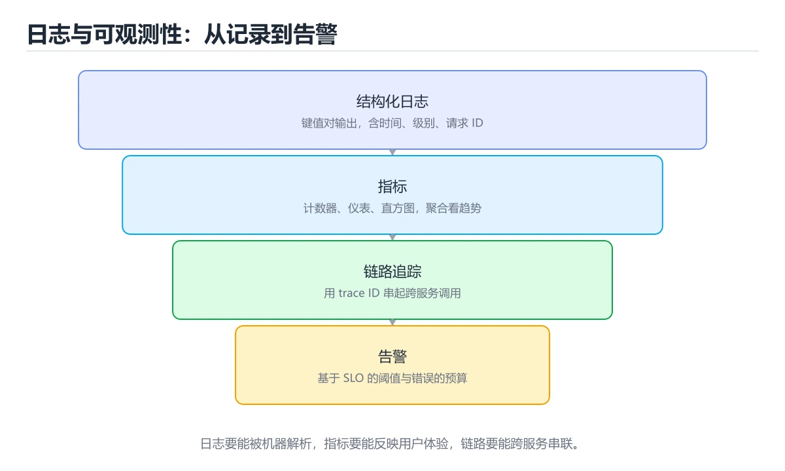

# 日志与可观测性：九种生态横向对照

> 内容更新时间：2026-10-06 · 学习阶段：进阶 · 预计用时：40 分钟




## 学习目标

- 能用自己的话解释日志与可观测性：九种生态横向对照解决了什么问题，而不是只背术语。
- 能说清 「日志」、「可观测性」、「结构化」、「trace id」 之间的关系，并分别举出一个例子。
- 能把 日志 放回「日志与可观测性：九种生态横向对照」的知识体系，说明它和 可观测性 的边界。
- 能完成本课练习，并用验收标准检查自己的结果。

> 一句话摘要：结构化日志、级别选择、可观测性三支柱与日志安全底线。

## 前置知识

- 先完成上一课《构建与发布产物：九种生态横向对照》；如果已经掌握，可以直接用本课练习自测。
- 本课阶段：进阶。建议先完成「构建与发布产物：九种生态横向对照」，或确认自己能独立跑通正文里的 LOG_LEVEL 示例。
- 开始前先复习：日志、可观测性、结构化。
- 看不懂就直接缩小例子：只保留 日志 相关的两行输入，跑通后再加回其余部分。

## 一句话说清

可观测性回答三个问题：**有没有问题（指标）、出了什么问题（日志）、问题在哪一环（链路）**。
各语言的日志库不同，但「结构化、分级、带上下文」三条要求一致。

## 各语言主流日志方案

| 语言 | 标准输出 | 主流结构化日志库 | 特点 |
| --- | --- | --- | --- |
| Python | `print` | `logging` + `structlog` | 标准库够用，structlog 更易结构化 |
| JavaScript | `console.log` | `pino` / `winston` | pino 性能好，默认 JSON |
| TypeScript | `console.log` | `pino` / `tslog` | 与 JS 相同，可加类型 |
| Java | `System.out` | SLF4J + Logback / Log4j2 | 门面 + 实现分离 |
| C# | `Console.WriteLine` | `Microsoft.Extensions.Logging` + Serilog | 内建抽象 + 结构化后端 |
| C++ | `std::cout` | spdlog / glog | spdlog 轻量、格式灵活 |
| Go | `fmt.Println` | `log/slog` / zap / zerolog | 标准库 slog 已够用 |
| Rust | `println!` | `tracing` / `log` + `env_logger` | tracing 支持 span 与异步 |
| Shell | `echo` | 自己封装 `log()` | 靠约定统一格式 |

## 结构化日志长什么样

```text
非结构化（难以检索与统计）
  [2026-03-05 14:02:11] ERROR 用户 42 下单失败，库存不足

结构化（一行一个 JSON，机器可读）
  {"ts":"2026-03-05T14:02:11Z","level":"error","msg":"下单失败",
   "user_id":42,"sku":"A-100","reason":"out_of_stock","trace_id":"a1b2c3"}
```

| 要素 | 说明 |
| --- | --- |
| 时间戳 | 用 UTC 加时区，别用本地时间 |
| 级别 | debug / info / warn / error |
| 消息 | 稳定、可检索的一句话 |
| 字段 | 结构化键值对，便于过滤与聚合 |
| trace id | 串联同一次请求的所有日志 |

## 各语言的写法示例

```python
import logging
import structlog

structlog.configure(
    processors=[structlog.processors.add_log_level,
                structlog.processors.TimeStamper(fmt="iso"),
                structlog.processors.JSONRenderer()],
)
log = structlog.get_logger()
log.info("order_created", user_id=42, amount=99.5, trace_id=trace_id)
```

```javascript
import pino from "pino";

const log = pino({ level: process.env.LOG_LEVEL ?? "info" });
log.info({ userId: 42, amount: 99.5, traceId }, "order_created");
```

```java
import org.slf4j.Logger;
import org.slf4j.LoggerFactory;
import net.logstash.logback.argument.StructuredArguments.kv;

private static final Logger log = LoggerFactory.getLogger(OrderService.class);
log.info("order_created {}", kv("userId", 42), kv("amount", 99.5));
```

```csharp
logger.LogInformation("订单已创建 {@Order} trace={TraceId}", order, traceId);
```

```go
slog.Info("order_created",
    "user_id", 42,
    "amount", 99.5,
    "trace_id", traceID,
)
```

```rust
tracing::info!(
    user_id = 42,
    amount = 99.5,
    trace_id = %trace_id,
    "order_created"
);
```

```bash
log() {
  local level="$1"; shift
  printf '{"ts":"%s","level":"%s","msg":"%s"}\n' \
    "$(date -u +%Y-%m-%dT%H:%M:%SZ)" "$level" "$*" >&2
}
log info "backup_finished"
```

## 日志级别怎么选

| 级别 | 什么时候用 | 生产是否默认输出 |
| --- | --- | --- |
| `debug` | 排查细节，高频 | 否 |
| `info` | 关键业务动作（创建、支付、发布） | 是 |
| `warn` | 可恢复的异常（重试成功、降级） | 是 |
| `error` | 需要人介入的失败 | 是，并触发告警 |

**error 级别不是越多越好**：满屏 error 会让真正的故障被淹没。

## 指标与链路

| 支柱 | 常见做法 | 回答的问题 |
| --- | --- | --- |
| 指标 | Prometheus 客户端（各语言都有） | 趋势与告警 |
| 日志 | 结构化 JSON 输出到标准输出 | 细节与上下文 |
| 链路 | OpenTelemetry SDK | 跨服务定位瓶颈 |

```text
一次请求的三种数据如何串起来
  trace_id ──┬─► 日志里带 trace_id
             ├─► 指标按接口与状态码聚合
             └─► 链路里展示每个 span 的耗时
```

**延迟指标要用直方图**，否则算不出 P95 与 P99。

## 日志的三条纪律

```text
1. 输出到标准输出（stdout），由平台负责收集与轮转
2. 永远不要记录密钥、令牌、完整身份证号与银行卡号
3. 一条日志只描述一件事，异常信息与堆栈要完整
```

```bash
# 脱敏示例
mask() { local v="$1"; ((${#v} <= 8)) && printf '***' || printf '%s****%s' "${v:0:4}" "${v: -4}"; }
echo "token=$(mask "$API_TOKEN")"
```

## 常见错误与排查

| 坑 | 现象 | 正确做法 |
| --- | --- | --- |
| 用字符串拼接日志 | 无法检索字段 | 用结构化键值对 |
| 日志里打印令牌 | 泄露 | 脱敏或干脆不记录 |
| 本地时间不加时区 | 跨时区排查困难 | 统一 UTC 加 ISO 格式 |
| 所有异常都打 error | 告警噪音 | 按可恢复性分级 |
| 忘了带 trace id | 无法串联请求 | 全链路透传 |
| 日志写文件并自己轮转 | 容器里难以收集 | 输出到 stdout |
| 只在出错时打日志 | 无法还原过程 | 关键路径打 info |
| 指标只有平均值 | 长尾问题看不见 | 用直方图算分位数 |

## 本课小结

- 日志要**结构化**：一行一个 JSON，字段稳定，带 trace id。
- 可观测性三支柱互补：指标看趋势、日志看细节、链路看路径。
- 安全底线：任何密钥与个人敏感信息都不进日志。

## 动手练习

> 本课练习重点：围绕「日志、可观测性、结构化」完成复述、实验和交付，每个结果都要能被别人检查。

用两种语言实现同一行为，再对比语法、错误、性能和生态差异。

### 练习 1：建立心智模型（10 分钟）

合上教程，用 3～5 句话回答：

1. 日志与可观测性：九种生态横向对照解决了什么问题？
2. 如果没有它，会出现什么具体后果？
3. 它和「可观测性」是什么关系？

验收标准：说明 日志 与 可观测性 的分工，并写出一个失效场景。

### 练习 2：做一次可控实验（20 分钟）

从正文中选一个最小示例，完成以下操作：

1. 先预测修改一个参数、输入或步骤后的结果。
2. 再实际执行或逐步推演，记录真实结果。
3. 如果结果与预测不同，写出差异原因。

**验收标准**：先原样跑通正文里的 `LOG_LEVEL`，再只改日志相关的输入，按「原例 → 改动 → 预测 → 结果 → 原因」记录；预测必须写在实际运行之前。

### 练习 3：交付一个小结果（30 分钟）

把 LOG_LEVEL 用另一种语言重写一遍，对比错误处理与工具链差异。

任务要求：

- 结果必须能被别人检查，不能只写“我已经理解了”。
- 至少覆盖「日志」和「可观测性」两个关键词。
- 写出 1 个仍然不确定的问题，以及下一步如何验证。

> 提示：时间有限时优先做练习 1 和练习 2；练习 3 可以拆成两次完成。

## 可运行练习

### 任务 1：先跑通，再解释

```bash
log() {
  local level="$1"; shift
  printf '{"ts":"%s","level":"%s","msg":"%s"}\n' \
    "$(date -u +%Y-%m-%dT%H:%M:%SZ)" "$level" "$*" >&2
}
log info "backup_finished"
```

### 任务 2：只改一个条件

把「日志与可观测性：九种生态横向对照」的最小示例复制一份，只改一个条件再跑一次：

- 改动点：只调整 LOG_LEVEL 的一个参数，其余条件一律不动。
- 预测：先写下「日志与可观测性：九种生态横向对照」在改动后的输出或错误信息，再运行。
- 记录：对照改动前后的结果，指出差异出在哪一步。
- 验收：换回原条件能复现原结果，改动只影响日志。

### 任务 3：迁移到自己的数据

把 LOG_LEVEL 换成你自己的输入，先保持步骤不变，再比较输出差异。

## 故障现场

### 现场 1：用字符串拼接日志

**症状**：在《日志与可观测性：九种生态横向对照》的复现场景中，无法检索字段。

**根因**：触发点是把“用字符串拼接日志”当成安全做法。它没有满足《日志与可观测性：九种生态横向对照》要求的前提，因此先表现为“无法检索字段”；排查时先完整复现这一段，再核对输入、配置与依赖。

**修复**：针对《日志与可观测性：九种生态横向对照》的问题，用结构化键值对。

**验证**：保留《日志与可观测性：九种生态横向对照》里触发“无法检索字段”的输入、版本和日志，按“用结构化键值对”完成修改后原样重放；只有失败现象消失且相邻场景仍可解释，才保留改动。

### 现场 2：本地时间不加时区

**症状**：在《日志与可观测性：九种生态横向对照》的复现场景中，跨时区排查困难。

**根因**：触发点是把“本地时间不加时区”当成安全做法。它没有满足《日志与可观测性：九种生态横向对照》要求的前提，因此先表现为“跨时区排查困难”；排查时先完整复现这一段，再核对输入、配置与依赖。

**修复**：针对《日志与可观测性：九种生态横向对照》的问题，统一 UTC 加 ISO 格式。

**验证**：保留《日志与可观测性：九种生态横向对照》里触发“跨时区排查困难”的输入、版本和日志，按“统一 UTC 加 ISO 格式”完成修改后原样重放；只有失败现象消失且相邻场景仍可解释，才保留改动。

### 现场 3：日志写文件并自己轮转

**症状**：在《日志与可观测性：九种生态横向对照》的复现场景中，容器里难以收集。

**根因**：当出现“日志写文件并自己轮转”时，执行路径已经绕过了《日志与可观测性：九种生态横向对照》的关键约束，最终以“容器里难以收集”暴露出来；修复前必须先确认约束在哪里失效。

**修复**：针对《日志与可观测性：九种生态横向对照》的问题，输出到 stdout。

**验证**：先在《日志与可观测性：九种生态横向对照》中记录“日志写文件并自己轮转”留下的失败证据，再执行“输出到 stdout”并重放；确认错误路径变为明确结果，且修复没有掩盖同类故障。

## 深入补充：日志与可观测性：九种生态横向对照 的取舍与边界

### 一、把概念放回真实约束

学习日志与可观测性：九种生态横向对照时，最容易只记住结论而忽略前提。先写出三个约束：数据规模、时间预算、可接受的失败方式；再判断 日志 与 可观测性 在这些约束下是否仍然成立。只要约束改变，原来的最优解就可能变成错误解。

| 维度 | 日志 的典型写法 | 另一种语言的等价写法 | 迁移时最易踩的坑 |
| --- | --- | --- | --- |
| 错误处理 | 显式返回或抛出 | 异常或结果类型 | 错误被静默吞掉 |
| 并发模型 | 线程、协程或事件循环 | 运行时调度不同 | 共享状态与取消语义 |
| 依赖管理 | 官方包管理器 | 生态与锁文件不同 | 版本解析结果不一致 |

### 二、三个容易混淆的边界

1. 澄清输入与目标。先写清「日志与可观测性：九种生态横向对照」要解决的问题、合法输入范围和成功标准，再进入后续步骤。
2. **把“平均值”当成“全部”**：日志 的指标好看，不代表尾部请求、冷启动或失败重试也好看。
3. **把“当前版本”当成“永久行为”**：可观测性 依赖的默认值、API 或性能特征都可能随版本变化，需要固定版本并保留回归用例。

### 三、一个生产场景

假设团队要在真实系统里使用日志与可观测性：九种生态横向对照：第一周先做小流量验证，记录 日志 的基线与异常；第二周扩大输入规模，观察 可观测性 是否成为瓶颈；第三周再做故障演练，主动注入超时、重复请求和依赖不可用，确认系统能降级、能重试、能恢复。每一步都要留下指标、日志和结论，而不是只留下“感觉更快了”。

### 四、自测清单

- 能否用一句话说出日志与可观测性：九种生态横向对照解决的核心问题与不适用场景？
- 能否画出 日志 的数据流或状态变化，并标出失败路径？
- 构造一个 可观测性 的反例，证明「总是成立」的说法不成立。
- 能否写出一条可复现的验证命令，让别人独立得到相同结论？

### 五、跨语言迁移清单

在本课的迁移练习里，先列出 日志 在两种语言中的类型、错误处理、并发模型和内存管理差异；再用同一个输入各写一版最小实现，比较编译或运行时的错误信息。最后记录 可观测性 在两种语言里的性能与可读性差异，避免只凭语法熟悉度做选型。

## 本课复习清单

离开本课前，逐项确认：

- [ ] 不看解析，能说出「结构化日志相比普通文本日志的核心优势是？」的判断依据。
- [ ] 不看解析，能说出「哪一类事件最适合用 warn 级别？」的判断依据。
- [ ] 不看解析，能说出「在容器环境里，日志应该输出到哪里？」的判断依据。
- [ ] 不看解析，能说出「关于日志安全，下面哪条是必须遵守的？」的判断依据。
- [ ] 用 日志 构造一个正常输入和一个边界输入，分别记录输出与判断依据。
- [ ] 把本课最容易混淆的两个概念写成一句话对照。

| 复盘项 | 记录 |
| --- | --- |
| 已经能独立解释的考点 |  |
| 仍然说不清的概念 |  |
| 下一步验证动作 |  |

## 术语速查

| 术语 | 一句话说明 |
| --- | --- |
| `可观测性` | 日志与可观测性：九种生态横向对照解决了什么问题，而不是只背术语。 |
| `结构化` | 日志要结构化：一行一个 JSON，字段稳定，带 trace id。 |
| `任务 1：先跑通，再解释` | local level="$1"; shift。 |
| `任务 2：只改一个条件` | 把「日志与可观测性：九种生态横向对照」的最小示例复制一份，只改一个条件再跑一次。 |

## 考点精讲

### 考点 1：多选辨析·日志

- **题目**：围绕“日志与可观测性：九种生态横向对照”中的 日志、可观测性、结构化，下列哪两项是本课强调的实践判断？
- **判断依据**：本课把日志与可观测性：九种生态横向对照拆成概念、示例与故障现场三部分，因此判断 日志 时必须同时交代输入、输出和失败路径，这使“学习 日志 时要同时说明输入、输出和失败路径，不能只看正常流程”成立。在日志与可观测性：九种生态横向对照里，判断 可观测性 时要固定版本与边界输入，所以“验证 可观测性 时要固定版本并覆盖边界输入，结论才可复现”才可复现。

### 考点 2：代码补全·日志

- **题目**：下面这段代码摘自「日志与可观测性：九种生态横向对照」的正文示例。关于这段代码，下面哪一项说法与实际内容相符？
- **判断依据**：在「日志与可观测性：九种生态横向对照」里，这段代码把主要逻辑封装在函数或方法里，需要被调用才会执行。这段代码出自「日志与可观测性：九种生态横向对照」的正文示例，围绕日志、可观测性、结构化展开；把输入或边界换成空值、极值或失败情况后，结论要以「日志与可观测性：九种生态横向对照」的实际运行结果为准。

### 考点 3：概念判断·日志

- **题目**：在容器环境里，日志应该输出到哪里？
- **判断依据**：在「日志与可观测性：九种生态横向对照」里，标准输出（stdout），由平台统一收集。输出到标准输出是云原生的标准做法，平台负责收集与轮转。“在容器环境里”与「日志与可观测性：九种生态横向对照」的术语表相呼应，只有符合日志、可观测性、结构化约束的“标准输出（stdout），由平台统一收集”才是正文支持的结论。

### 考点 4：概念判断·日志

- **题目**：关于日志安全，下面哪条是必须遵守的？
- **判断依据**：在「日志与可观测性：九种生态横向对照」里，结论应落在「密钥与个人敏感信息一律不入日志」。日志会被多方访问与长期留存，必须默认脱敏。在「日志与可观测性：九种生态横向对照」里，这道题要求区分概念与边界，「密钥与个人敏感信息一律不入日志」只有在题干给出的前提下才成立，而「为了排查方便，记录完整令牌」、「只在生产环境脱敏」缺少同一组条件。

### 考点 5：填空·日志

- **题目**：补全代码：「日志与可观测性：九种生态横向对照」示例中，下面这行代码缺少哪个关键字或函数名？请填入 ____。 `processors=[____.processors.add_log_level,`
- **判断依据**：在「日志与可观测性：九种生态横向对照」里，structlog。在「日志与可观测性：九种生态横向对照」里判断这道题，要把日志、可观测性、结构化的条件、过程与失败路径逐项对齐，换成“补全代码”这个场景，只有满足前提的结论才成立。“日志与可观测性”与「日志与可观测性：九种生态横向对照」的术语表相呼应，只有符合日志、可观测性、结构化约束的“structlog”才是正文支持的结论。

## 复习与自测

- [ ] 能解释「一句话说清」里最容易混淆的两个概念。
- [ ] 能不看正文写出「各语言主流日志方案」的关键步骤。
- [ ] 能用一句话说明「结构化日志长什么样」解决什么问题。
- [ ] 能把「各语言的写法示例」的判断标准套到一个新例子上。
- [ ] 能说清「日志级别怎么选」的结论，并说出它的适用边界。
- [ ] 能用自己的话复述「指标与链路」，并各举一个正例和反例。

## English Overview

**Title:** Logging and Observability

**Summary:** Structured logging, levels, the three pillars and safety rules.

**Category:** Cross-Language Comparison
**Level:** 进阶
**Key terms:** 日志, 可观测性, 结构化, trace id, 脱敏

## 内容元数据

- 内容版本：v2.0
- 最后更新：2026-10-06
- 学习阶段：进阶
- 适用环境：九种主流语言生态横向对照；本课聚焦 日志。
- 内容来源：内置结构化课程与工程实践整理
- 相关主题：日志、可观测性、结构化、trace id、脱敏
- 质量版本：P0 测验标准 + P1 覆盖扩展 + P2 体验补全

## 参考资料与复核

- 最后复核：2026-10-04
- 下次复核：2027-07-10
- 复核范围：版本兼容、API 行为、安全建议与工程实践
- 来源性质：官方文档、标准或权威教材；正文为离线教学重组

| 参考资料 | 本课用途 |
| --- | --- |
| [Programming Languages DB](https://pldb.io/) | 语言特性与生态对照 |
| [DevDocs](https://devdocs.io/) | 多语言 API 快速检索 |
| [Learn X in Y minutes](https://learnxinyminutes.com/) | 语言语法速览 |

> 「日志与可观测性：九种生态横向对照」的链接用于离线阅读后的延伸核对；App 不会自动联网。

## 工程化精练：决策、失败与验证

这一章把「日志与可观测性：九种生态横向对照」从“看懂”推进到“能判断、能验证、能排错”。所有判断都围绕日志、可观测性与结构化展开，并与前文的示例、测验和失败现场互相对照。

### 一、日志 的判断算法

| 步骤 | 要回答的问题 | 判断依据 | 记录什么 |
| --- | --- | --- | --- |
| 1. 定目标 | 「日志与可观测性：九种生态横向对照」这一步要解决什么问题？ | 把日志的目标写成一句可验证的结论 | 输入、约束、成功标准 |
| 2. 找边界 | 可观测性在什么条件下失效？ | 先列空值、极值、重复和失败路径 | 反例与触发条件 |
| 3. 跑基线 | 原始示例的真实输出是什么？ | 命令、版本和环境必须可复现 | 命令、输出、耗时 |
| 4. 只改一处 | 把结构化换成另一种取值会怎样？ | 预测写在运行之前 | 预测与实际的差异 |
| 5. 回写结论 | 结论能否被他人复现？ | 把判断写成清单或测试 | 结论、证据、遗留问题 |

这张表的用法不是从上到下浏览，而是每次只填一行：先用「日志与可观测性：九种生态横向对照」前文的示例验证第 3 行，再故意破坏一个条件验证第 2 行。当你能在不看解析的情况下说出日志的判断依据，才算真正掌握本课。

- 先从日志入手：把它写成“输入是什么、输出是什么、哪一步最容易出错”。如果这三句话中有一句说不清，说明对「日志与可观测性：九种生态横向对照」的理解还停留在术语层面，需要回到正文的最小示例重新观察一次。

- 再把可观测性当成对照实验的变量：固定其他条件，只改变它的取值，记录输出是否变化。结论“变”或“不变”都要写出理由，并说明这个理由能否被他人独立复现。

- 针对结构化做一次失败演练：故意给出空值、极值或错误类型，观察「日志与可观测性：九种生态横向对照」的报错位置和处理方式。错误信息只是入口，真正要定位的是哪一层假设被破坏。

- 把「日志与可观测性：九种生态横向对照」的结论压缩成一条可执行清单：先检查输入，再检查版本与环境，然后跑最小用例，最后才扩大规模。顺序颠倒会让排错范围成倍增加。

- 如果结论依赖时间或规模，就把数据量提高一个数量级再跑一次。在「日志与可观测性：九种生态横向对照」里，小样本成立不代表大样本成立，复杂度、资源占用和失败率都要重新记录。

- 如果结论依赖并发或共享状态，就固定输入并连续运行多次。结果不一致时，优先怀疑「日志与可观测性：九种生态横向对照」中日志相关步骤的隐藏状态，而不是先改代码。

- 把「日志与可观测性：九种生态横向对照」的判断写成测试：一个正常用例、一个边界用例、一个失败用例。测试通过只是起点，还要确认失败用例确实以预期方式失败。

- 把本课与相邻主题连起来：日志解决的是“怎么做”，可观测性回答“什么时候不适用”。两者都答得出来，迁移才算完成。

> 第 2 轮复核「日志与可观测性：九种生态横向对照」：把上面的结论逐条改写为可验证的问题，并记录仍不确定的部分。

- 先从日志入手：把它写成“输入是什么、输出是什么、哪一步最容易出错”。如果这三句话中有一句说不清，说明对「日志与可观测性：九种生态横向对照」的理解还停留在术语层面，需要回到正文的最小示例重新观察一次。

### 二、日志与可观测性：九种生态横向对照 的机制拆解与自测

把本课考点还原成可回答的问题，再逐题写出依据：

**问题 1**：围绕“日志与可观测性：九种生态横向对照”中的 日志、可观测性、结构化，下列哪两项是本课强调的实践判断？

- 关联术语：日志
- 判断依据：学习 日志 时要同时说明输入、输出和失败路径，不能只看正常流程
- 追问：如果把日志的条件换成边界值，这个结论是否仍然成立？

**问题 2**：下面这段代码摘自「日志与可观测性：九种生态横向对照」的正文示例。关于这段代码，下面哪一项说法与实际内容相符？

- 关联术语：可观测性
- 判断依据：回到「日志与可观测性：九种生态横向对照」正文对应小节，先用最小示例验证再下结论。
- 追问：如果把可观测性的条件换成边界值，这个结论是否仍然成立？

**问题 3**：在容器环境里，日志应该输出到哪里？

- 关联术语：结构化
- 判断依据：标准输出（stdout），由平台统一收集
- 追问：如果把结构化的条件换成边界值，这个结论是否仍然成立？

**问题 4**：关于日志安全，下面哪条是必须遵守的？

- 关联术语：trace id
- 判断依据：密钥与个人敏感信息一律不入日志
- 追问：如果把trace id的条件换成边界值，这个结论是否仍然成立？

**问题 5**：补全代码：「日志与可观测性：九种生态横向对照」示例中，下面这行代码缺少哪个关键字或函数名？请填入 ____。

`processors=[____.processors.add_log_level,`

- 关联术语：脱敏
- 判断依据：回到「日志与可观测性：九种生态横向对照」正文对应小节，先用最小示例验证再下结论。
- 追问：如果把脱敏的条件换成边界值，这个结论是否仍然成立？

### 三、失败模式与修复顺序

| 失败信号 | 常见根因 | 先做什么 | 修复后如何确认 |
| --- | --- | --- | --- |
| 「日志与可观测性：九种生态横向对照」中 日志 相关步骤报错 | 输入、版本或前置条件与示例不一致 | 保留第一条错误信息，回到最小输入 | 用学习 日志 时要同时说明输入、输出和失败路径，不能只看正常流程复跑，确认输出可复现 |
| 「日志与可观测性：九种生态横向对照」中 可观测性 相关步骤报错 | 输入、版本或前置条件与示例不一致 | 保留第一条错误信息，回到最小输入 | 用标准输出（stdout），由平台统一收集复跑，确认输出可复现 |
| 「日志与可观测性：九种生态横向对照」中 结构化 相关步骤报错 | 输入、版本或前置条件与示例不一致 | 保留第一条错误信息，回到最小输入 | 用密钥与个人敏感信息一律不入日志复跑，确认输出可复现 |
- 检查点：固定版本与输入重跑《日志与可观测性：九种生态横向对照》，记录两次差异并定位不稳定条件。
| 单次结果正确但规模一大就失效 | 只测了正常路径，没有覆盖边界 | 把数据量或并发度提高一个数量级 | 记录边界值、耗时与失败率 |

排错顺序固定为：先复现，再缩小输入，然后只改一个条件，最后把结论写成回归用例。对「日志与可观测性：九种生态横向对照」来说，任何不能复现的“修好了”都不算完成。

### 四、离开本课前的验证清单

| 检查项 | 通过标准 | 证据 |
| --- | --- | --- |
| 能复述 | 用三句话说明「日志与可观测性：九种生态横向对照」解决什么问题、边界在哪 | 不看解析写出的结论 |
| 能运行 | 最小示例在本机跑通 | 命令、输出与版本 |
| 能改条件 | 只改一个输入并解释差异 | 预测与实际的对照 |
| 能排错 | 至少制造并修复一个失败 | 错误信息与修复步骤 |
| 能迁移 | 把日志、可观测性、结构化、trace id、脱敏用到新场景 | 一个自选练习的结论 |

完成标准：能不看解析说清「日志与可观测性：九种生态横向对照」全部自测题的依据，并且至少有一条日志相关的结论经过真实运行验证。如果某一步只停留在“感觉懂了”，就把它写成下一轮针对「日志与可观测性：九种生态横向对照」的最小验证任务。

### 五、把结论写成可检查的证据

学习「日志与可观测性：九种生态横向对照」时，最容易出现的情况是“听过、看懂了，但换一个输入就说不清”。下面把日志与可观测性放进一条可检查的证据链：每一句结论都要能回答“从哪里来、在什么条件下成立、失败时怎么发现”。

| 证据类型 | 本课要求 | 不合格的表现 |
| --- | --- | --- |
| 概念证据 | 用一句话说明日志的定义与适用场景 | 只背术语，说不出它解决什么问题 |
| 运行证据 | 能复现「日志与可观测性：九种生态横向对照」的最小示例 | 输出与记录对不上，或换机器就不一致 |
| 对照证据 | 只改一个条件，说明差异来自哪里 | 一次改多个变量，无法归因 |
| 失败证据 | 故意制造错误并记录恢复步骤 | 只测正常路径，失败时靠猜 |
| 迁移证据 | 把可观测性用到自选场景 | 换一个例子就完全套不上 |

举例：学习 日志 时要同时说明输入、输出和失败路径，不能只看正常流程。把这个结论代回「日志与可观测性：九种生态横向对照」的正文，找出它对应的输入、处理步骤与输出；再换掉其中一个条件，观察结论是否仍然成立。能完成这一步，才说明这条知识已经从“记忆”变成“可用的判断”。

最后留一个自检问题：如果只能保留三条笔记，你会写下哪三句？把答案限定为「日志与可观测性：九种生态横向对照」中的可验证结论，并给每条结论配一个反例。这三句加上对应反例，就是本课最值得带入后续课程的复习材料。
