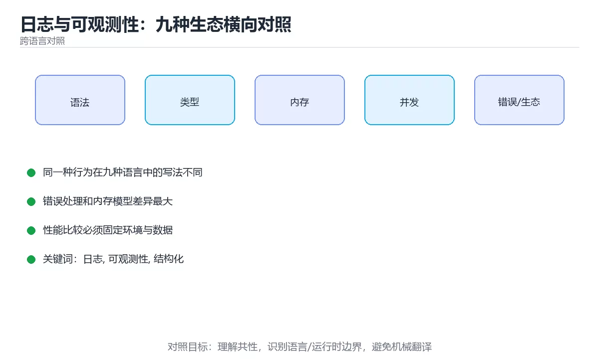

# 日志与可观测性：九种生态横向对照



> 内容更新时间：2026-10-03 · 学习阶段：进阶 · 预计用时：20 分钟

## 学习目标

- 能用自己的话解释「日志与可观测性：九种生态横向对照」解决了什么问题，而不是只背术语。
- 能说清 「日志」、「可观测性」、「结构化」、「trace id」 之间的关系，并分别举出一个例子。
- 能把本课知识放回「跨语言对照」的知识体系，说明它和相邻主题的边界。
- 能完成本课练习，并用验收标准检查自己的结果。

> 一句话摘要：结构化日志、级别选择、可观测性三支柱与日志安全底线。

## 前置知识

- 先完成上一课《构建与发布产物：九种生态横向对照》；如果已经掌握，可以直接用本课练习自测。
- 本课阶段：进阶。建议先掌握同一分类的基础课程，并能独立运行正文中的最小示例。
- 开始前先复习：日志、可观测性、结构化。
- 如果某一步看不懂，先记录具体卡点，完成练习后再回头读一遍。


## 一句话说清

可观测性回答三个问题：**有没有问题（指标）、出了什么问题（日志）、问题在哪一环（链路）**。
各语言的日志库不同，但「结构化、分级、带上下文」三条要求一致。

## 各语言主流日志方案

| 语言 | 标准输出 | 主流结构化日志库 | 特点 |
| --- | --- | --- | --- |
| Python | `print` | `logging` + `structlog` | 标准库够用，structlog 更易结构化 |
| JavaScript | `console.log` | `pino` / `winston` | pino 性能好，默认 JSON |
| TypeScript | `console.log` | `pino` / `tslog` | 与 JS 相同，可加类型 |
| Java | `System.out` | SLF4J + Logback / Log4j2 | 门面 + 实现分离 |
| C# | `Console.WriteLine` | `Microsoft.Extensions.Logging` + Serilog | 内建抽象 + 结构化后端 |
| C++ | `std::cout` | spdlog / glog | spdlog 轻量、格式灵活 |
| Go | `fmt.Println` | `log/slog` / zap / zerolog | 标准库 slog 已够用 |
| Rust | `println!` | `tracing` / `log` + `env_logger` | tracing 支持 span 与异步 |
| Shell | `echo` | 自己封装 `log()` | 靠约定统一格式 |

## 结构化日志长什么样

```text
非结构化（难以检索与统计）
  [2026-03-05 14:02:11] ERROR 用户 42 下单失败，库存不足

结构化（一行一个 JSON，机器可读）
  {"ts":"2026-03-05T14:02:11Z","level":"error","msg":"下单失败",
   "user_id":42,"sku":"A-100","reason":"out_of_stock","trace_id":"a1b2c3"}
```

| 要素 | 说明 |
| --- | --- |
| 时间戳 | 用 UTC 加时区，别用本地时间 |
| 级别 | debug / info / warn / error |
| 消息 | 稳定、可检索的一句话 |
| 字段 | 结构化键值对，便于过滤与聚合 |
| trace id | 串联同一次请求的所有日志 |

## 各语言的写法示例

```python
import logging
import structlog

structlog.configure(
    processors=[structlog.processors.add_log_level,
                structlog.processors.TimeStamper(fmt="iso"),
                structlog.processors.JSONRenderer()],
)
log = structlog.get_logger()
log.info("order_created", user_id=42, amount=99.5, trace_id=trace_id)
```

```javascript
import pino from "pino";

const log = pino({ level: process.env.LOG_LEVEL ?? "info" });
log.info({ userId: 42, amount: 99.5, traceId }, "order_created");
```

```java
import org.slf4j.Logger;
import org.slf4j.LoggerFactory;
import net.logstash.logback.argument.StructuredArguments.kv;

private static final Logger log = LoggerFactory.getLogger(OrderService.class);
log.info("order_created {}", kv("userId", 42), kv("amount", 99.5));
```

```csharp
logger.LogInformation("订单已创建 {@Order} trace={TraceId}", order, traceId);
```

```go
slog.Info("order_created",
    "user_id", 42,
    "amount", 99.5,
    "trace_id", traceID,
)
```

```rust
tracing::info!(
    user_id = 42,
    amount = 99.5,
    trace_id = %trace_id,
    "order_created"
);
```

```bash
log() {
  local level="$1"; shift
  printf '{"ts":"%s","level":"%s","msg":"%s"}\n' \
    "$(date -u +%Y-%m-%dT%H:%M:%SZ)" "$level" "$*" >&2
}
log info "backup_finished"
```

## 日志级别怎么选

| 级别 | 什么时候用 | 生产是否默认输出 |
| --- | --- | --- |
| `debug` | 排查细节，高频 | 否 |
| `info` | 关键业务动作（创建、支付、发布） | 是 |
| `warn` | 可恢复的异常（重试成功、降级） | 是 |
| `error` | 需要人介入的失败 | 是，并触发告警 |

**error 级别不是越多越好**：满屏 error 会让真正的故障被淹没。

## 指标与链路

| 支柱 | 常见做法 | 回答的问题 |
| --- | --- | --- |
| 指标 | Prometheus 客户端（各语言都有） | 趋势与告警 |
| 日志 | 结构化 JSON 输出到标准输出 | 细节与上下文 |
| 链路 | OpenTelemetry SDK | 跨服务定位瓶颈 |

```text
一次请求的三种数据如何串起来
  trace_id ──┬─► 日志里带 trace_id
             ├─► 指标按接口与状态码聚合
             └─► 链路里展示每个 span 的耗时
```

**延迟指标要用直方图**，否则算不出 P95 与 P99。

## 日志的三条纪律

```text
1. 输出到标准输出（stdout），由平台负责收集与轮转
2. 永远不要记录密钥、令牌、完整身份证号与银行卡号
3. 一条日志只描述一件事，异常信息与堆栈要完整
```

```bash
# 脱敏示例
mask() { local v="$1"; ((${#v} <= 8)) && printf '***' || printf '%s****%s' "${v:0:4}" "${v: -4}"; }
echo "token=$(mask "$API_TOKEN")"
```

## 新手最容易踩的八个坑

| 坑 | 现象 | 正确做法 |
| --- | --- | --- |
| 用字符串拼接日志 | 无法检索字段 | 用结构化键值对 |
| 日志里打印令牌 | 泄露 | 脱敏或干脆不记录 |
| 本地时间不加时区 | 跨时区排查困难 | 统一 UTC 加 ISO 格式 |
| 所有异常都打 error | 告警噪音 | 按可恢复性分级 |
| 忘了带 trace id | 无法串联请求 | 全链路透传 |
| 日志写文件并自己轮转 | 容器里难以收集 | 输出到 stdout |
| 只在出错时打日志 | 无法还原过程 | 关键路径打 info |
| 指标只有平均值 | 长尾问题看不见 | 用直方图算分位数 |

## 本课小结
- 日志要**结构化**：一行一个 JSON，字段稳定，带 trace id。
- 可观测性三支柱互补：指标看趋势、日志看细节、链路看路径。
- 安全底线：任何密钥与个人敏感信息都不进日志。

## 动手练习


> 本课练习重点：围绕「日志、可观测性、结构化」完成复述、实验和交付，每个结果都要能被别人检查。

用两种语言实现同一行为，再对比语法、错误、性能和生态差异。

### 练习 1：建立心智模型（10 分钟）

合上教程，用 3～5 句话回答：

1. 「日志与可观测性：九种生态横向对照」解决了什么问题？
2. 如果没有它，会出现什么具体后果？
3. 它和「可观测性」是什么关系？

**验收标准**：至少出现一个本课关键词，并写出一个反例、边界条件或失效场景。

### 练习 2：做一次可控实验（20 分钟）

从正文中选一个最小示例，完成以下操作：

1. 先预测修改一个参数、输入或步骤后的结果。
2. 再实际执行或逐步推演，记录真实结果。
3. 如果结果与预测不同，写出差异原因。

**验收标准**：留下「原例 → 改动 → 预测 → 结果 → 原因」五步记录。

### 练习 3：交付一个小结果（30 分钟）

选两种语言实现同一行为，列出语法、错误处理、性能和生态差异。

任务要求：

- 结果必须能被别人检查，不能只写“我已经理解了”。
- 至少覆盖「日志」和「可观测性」两个关键词。
- 写出 1 个仍然不确定的问题，以及下一步如何验证。

> 提示：时间有限时优先做练习 1 和练习 2；练习 3 可以拆成两次完成。


## 考点精讲：把测验题还原成判断过程

本课有 5 个判断点。先自己作答，再看「判断依据」；如果结论正确但理由不完整，回到正文对应章节补足概念。

### 考点 1：结构化日志相比普通文本日志的核心优势是？

- **正确判断**：字段固定可检索，可聚合
- **判断依据**：正确答案是「字段固定可检索，可聚合」，本课在「一句话说清」中说明：可观测性回答三个问题：有没有问题（指标）、出了什么问题（日志）、问题在哪一环（链路）。结构化日志的价值在于可查询与可统计。本课还在「本课小结」中说明：可观测性三支柱互补：指标看趋势、日志看细节、链路看路径。本课还在「本课小结」中说明：日志要结构化：一行一个 JSON，字段稳定，带 trace id。
- **迁移检查**：如果给某个错误选项去掉一个限定词，它会不会变成正确？说明理由。

### 考点 2：哪一类事件最适合用 warn 级别？

- **正确判断**：出现异常但已自动重试成功
- **判断依据**：正确答案是「出现异常但已自动重试成功」，本课在「一句话说清」中说明：可观测性回答三个问题：有没有问题（指标）、出了什么问题（日志）、问题在哪一环（链路）。可恢复的异常属于 warn，需要关注但不必立即告警。本课还在「本课小结」中说明：可观测性三支柱互补：指标看趋势、日志看细节、链路看路径。本课还在「本课小结」中说明：日志要结构化：一行一个 JSON，字段稳定，带 trace id。
- **迁移检查**：遮住选项，只根据定义复述一次答案，再回来看哪个选项与复述一致。

### 考点 3：在容器环境里，日志应该输出到哪里？

- **正确判断**：标准输出（stdout），由平台统一收集
- **判断依据**：正确答案是「标准输出（stdout），由平台统一收集」，本课在「一句话说清」中说明：各语言的日志库不同，但「结构化、分级、带上下文」三条要求一致。输出到标准输出是云原生的标准做法，平台负责收集与轮转。本课还在「本课小结」中说明：安全底线：任何密钥与个人敏感信息都不进日志。
- **迁移检查**：把题干里的一个条件换成边界值，原来的结论还成立吗？写出判断过程。

### 考点 4：关于日志安全，下面哪条是必须遵守的？

- **正确判断**：密钥与个人敏感信息一律不入日志
- **判断依据**：正确答案是「密钥与个人敏感信息一律不入日志」，本课在「本课小结」中说明：安全底线：任何密钥与个人敏感信息都不进日志。日志会被多方访问与长期留存，必须默认脱敏。本课还在「一句话说清」中说明：各语言的日志库不同，但「结构化、分级、带上下文」三条要求一致。
- **迁移检查**：如果给某个错误选项去掉一个限定词，它会不会变成正确？说明理由。

### 考点 5：补全代码：「日志与可观测性：九种生态横向对照」示例中，下面这行代码缺少哪个关键字或函数名？请填入 ____。 `processors=[____.processors.add_log_level,`

- **正确判断**：structlog
- **判断依据**：正确答案是「structlog」，这道题在问补全代码：日志与可观测性：九种生态横向对照示例中，下…sors.add_log_level,`，判断时要把题干限定的输入、边界与目标逐项对齐。本课示例中还能看到 `import structlog` 这样的用法，说明该关键字在本课代码中承担实际功能。
- **迁移检查**：把答案换成另一种等价写法，是否仍然正确？说明依据。

## 本课复习清单

离开本课前，逐项确认：

- [ ] 不看解析，能说出「结构化日志相比普通文本日志的核心优势是？」的判断依据。
- [ ] 不看解析，能说出「哪一类事件最适合用 warn 级别？」的判断依据。
- [ ] 不看解析，能说出「在容器环境里，日志应该输出到哪里？」的判断依据。
- [ ] 不看解析，能说出「关于日志安全，下面哪条是必须遵守的？」的判断依据。
- [ ] 不看解析，能说出「补全代码：「日志与可观测性：九种生态横向对照」示例中，下面这行代码缺少哪个关键字…」的判断依据。
- [ ] 至少运行一次本课示例，记录输入、输出和一个边界情况。
- [ ] 把本课最容易混淆的两个概念写成一句话对照。

| 复盘项 | 记录 |
| --- | --- |
| 已经能独立解释的考点 |  |
| 仍然说不清的概念 |  |
| 下一步验证动作 |  |

## English Overview

**Title:** Logging and Observability

**Summary:** Structured logging, levels, the three pillars and safety rules.

**Category:** Cross-Language Comparison  
**Level:** 进阶  
**Key terms:** 日志, 可观测性, 结构化, trace id, 脱敏

> The full tutorial is written in Chinese. This bilingual overview helps English readers identify the topic, scope and key terms before studying the detailed examples.

## 内容元数据

- 内容版本：v2.0
- 最后更新：2026-10-03
- 学习阶段：进阶
- 适用环境：九种主流语言生态横向对照
- 内容来源：内置结构化课程与工程实践整理
- 相关主题：日志、可观测性、结构化、trace id、脱敏
- 质量版本：P0 测验标准 + P1 覆盖扩展 + P2 体验补全


## 参考资料与复核

- 最后复核：2026-10-04
- 下次复核：2027-04-04
- 复核范围：版本兼容、API 行为、安全建议与工程实践
- 来源性质：官方文档与标准；本课正文为离线教学重组，不复制原文

| 参考资料 | 本课用途 |
| --- | --- |
| [DevDocs](https://devdocs.io/) | 多语言 API 快速检索 |
| [官方语言文档](https://developer.mozilla.org/docs/Web) | 跨语言语义对照 |

> 本课主题：结构化日志、级别选择、可观测性三支柱与日志安全底线。

> App 完全离线展示文字链接，不会自动联网；需要延伸阅读时可复制链接到浏览器。

