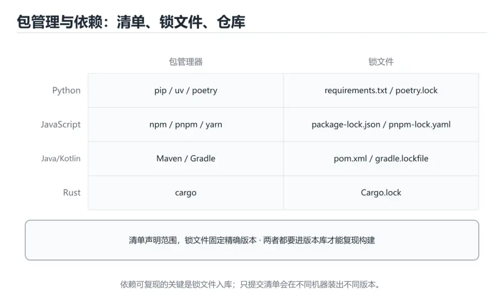

# 包管理与依赖：九种生态横向对照




> 内容更新时间：2026-10-06 · 学习阶段：入门 · 预计用时：45 分钟

## 本节知识框架

**课程定位**：所属分类为「跨语言对照」，课程主题为「包管理与依赖：九种生态横向对照」，学习阶段为「入门」，建议用时 45 分钟。

**本课要解决的主问题**：清单文件、锁文件与版本语义，以及依赖冲突的排查方法。

| 学习层次 | 要回答的问题 | 完成判据 |
| --- | --- | --- |
| 概念层 | 「包管理与依赖：九种生态横向对照」有哪些必须区分的对象与术语？ | 能用自己的话定义核心术语，并各举一个正例和一个反例。 |
| 机制层 | 这些对象按什么顺序发生作用，输入如何变成输出？ | 能画出或写出机制步骤，并说明每一步的失败条件。 |
| 应用层 | 什么场景适合使用「包管理与依赖：九种生态横向对照」，什么场景不适合？ | 能给出一个真实场景、一个最小示例和一个边界案例。 |
| 性能层 | 时间、空间、吞吐或延迟受哪些量影响？ | 能说出复杂度或性能瓶颈的证据来源；没有证据时明确写“材料未提供”。 |
| 复习层 | 怎样确认自己不是只记住了结论？ | 能独立完成本课自测，并把错误定位到概念、机制、示例或边界。 |

### 阅读路线

1. 先读「核心概念定义」，建立「包管理」等对象的精确定义。
2. 再读「原理与运行机制」，把定义串成可重复的过程。
3. 用「代码/协议/SQL 示例」验证过程，并只改一个条件观察结果变化。
4. 最后检查性能、易错点、知识关系与自测题，形成可复习的证据链。

**前置知识**：没有硬性先修课；仍建议先具备本分类的基础阅读与操作能力。

**学习位置**：本课位于《集合类型：九种语言横向对照》之后；如果前一课的自测不能通过，应先回补再继续。

**后续衔接**：下一课《命令行参数解析：九种语言横向对照》会继续使用本课术语，学完后建议立即完成一次自测。

**教材衔接：学习目标**

- 能用自己的话解释包管理与依赖：九种生态横向对照解决了什么问题，而不是只背术语。
- 能说清 「包管理」、「依赖」、「锁文件」、「版本号」 之间的关系，并分别举出一个例子。
- 能把 包管理 放回「包管理与依赖：九种生态横向对照」的知识体系，说明它和 依赖 的边界。
- 能完成本课练习，并用验收标准检查自己的结果。

> 一句话摘要：清单文件、锁文件与版本语义，以及依赖冲突的排查方法。

**教材衔接：前置知识**

- 先完成上一课《错误处理与测试：九种语言横向对照》；如果已经掌握，可以直接用本课练习自测。
- 本课阶段：入门。只需要基本计算机操作，不要求编程经验。
- 开始前先复习：包管理、依赖、锁文件。
- 看不懂就直接缩小例子：只保留 包管理 相关的两行输入，跑通后再加回其余部分。

**教材衔接：本课小结**

- 记住三件套：**清单文件描述意图，锁文件保证一致，缓存目录加速安装**。
- CI 里必须用「按锁文件安装」的命令，否则测试过的版本不是发布的版本。
- 排查依赖问题，先看依赖树，再谈改版本。

## 核心概念定义

> 在阅读《包管理与依赖：九种生态横向对照》时，术语第一次出现先给操作性定义，再给边界；正文说法与这里冲突时，以定义和可复现示例为准。

| 术语 | 操作性定义 | 本课中的边界 |
| --- | --- | --- |
| 包管理 | 声明、下载、锁定并安装项目依赖版本的工具与流程。 | 仅在「包管理与依赖：九种生态横向对照」明确给出的输入、版本与资源条件下成立。 |
| 依赖 | 包管理与依赖：九种生态横向对照解决了什么问题，而不是只背术语。 | 仅在「包管理与依赖：九种生态横向对照」明确给出的输入、版本与资源条件下成立。 |
| 锁文件 | 包管理与依赖系统负责下载、解析、锁定和安装第三方代码；不同生态命令不同，但都要解决版本约束、传递依赖、锁文件、私有源和安全审计。 | 仅在「包管理与依赖：九种生态横向对照」明确给出的输入、版本与资源条件下成立。 |
| 版本号 | 标识软件或接口迭代次序的编号，常用语义化版本表达兼容性变化。 | 仅在「包管理与依赖：九种生态横向对照」明确给出的输入、版本与资源条件下成立。 |
| SemVer | 用主版本、次版本和补丁号表达兼容性与变更范围的版本规范。 | 仅在「包管理与依赖：九种生态横向对照」明确给出的输入、版本与资源条件下成立。 |

### 定义如何使用

在「包管理与依赖：九种生态横向对照」中判断一个说法是否成立，先确认它使用的是哪个对象的定义，再检查输入规模、运行环境与失败路径。定义不是口号，而是后续推导、代码示例和自测题共享的约束。

## 原理与运行机制

### 机制总览

1. **建立输入**：把「包管理」按本课定义整理成可观察、可重复的输入条件。
2. **执行转换**：围绕「依赖」执行本课的核心步骤；每一步都记录中间状态，避免只看最终输出。
3. **产生输出**：得到「锁文件」后，用正文示例或协议/SQL 结果核对输出是否符合预期。
4. **改变一个条件**：只替换一个边界条件或环境参数，观察「包管理与依赖：九种生态横向对照」的结论是否仍然成立。

| 阶段 | 关注对象 | 失败时应检查 |
| --- | --- | --- |
| 输入 | 包管理 | 类型、范围、编码、版本或前置状态是否满足定义。 |
| 处理 | 依赖 | 顺序、可见性、锁、路由、事务或调度规则是否被破坏。 |
| 输出 | 锁文件 | 结果是否可复现，错误是否被正确传播而不是被吞掉。 |

本课的机制结论要用「包管理与依赖：九种生态横向对照」自己的示例验证。「包管理与依赖：九种生态横向对照」没有给出某个数量级、吞吐或内存数据时，本课把该判断标为“材料未提供”，不从相邻主题外推。

**教材衔接：一句话说清**

包管理解决三件事：**从哪下载、怎么记录版本、怎么保证别人装出一样的环境**。
认准这三件事，换生态时就不需要重新学一遍。

## 典型应用场景

| 场景 | 典型输入或前提 | 期望产物 |
| --- | --- | --- |
| 学习验证 | 使用本课最小示例和 包管理、依赖 | 能复现正文结论，并解释每一步。 |
| 工程落地 | 把「包管理与依赖：九种生态横向对照」放入真实模块或服务边界 | 输出可观测、失败可定位、参数可配置。 |
| 故障排查 | 只改一个版本、规模、输入或依赖条件 | 能区分概念错误、实现错误和环境差异。 |

判断「包管理与依赖：九种生态横向对照」的场景是否成立，标准是能否写出输入、处理、输出和失败路径；材料中没有出现的数据在本课标注为“材料未提供”，不用推测替代证据。

**教材衔接：一个真实场景：升级依赖**

```text
1. 先看有哪些可升级项（npm outdated / mvn versions:display-dependency-updates）
2. 一次只升一类（补丁 → 次版本 → 主版本）
3. 每升一次跑完整测试与构建
4. 主版本升级先读迁移指南
5. 升级后观察线上指标，必要时回滚锁文件
```

## 代码/协议/SQL 示例

以下代码、协议或 SQL 片段来自《包管理与依赖：九种生态横向对照》原文，保留原有语言标记与上下文；先预测《包管理与依赖：九种生态横向对照》示例的输出，再按正文步骤运行或推演，示例依赖外部环境时同时记录版本与输入。

**教材衔接：三类文件的分工（最容易被混淆）**

```text
清单文件（manifest）：我直接依赖了什么，允许什么版本范围
   package.json / pyproject.toml / pom.xml / Cargo.toml / go.mod

锁文件（lockfile）：实际装到的精确版本与校验值
   package-lock.json / pnpm-lock.yaml / Cargo.lock / go.sum

缓存目录：下载过的包，本地复用
   node_modules / .venv / ~/.m2 / ~/.cargo / ~/go/pkg
```

| 文件 | 要不要提交 | 原因 |
| --- | --- | --- |
| 清单文件 | **必须提交** | 描述项目依赖 |
| 锁文件（应用） | **必须提交** | 保证各环境版本一致 |
| 锁文件（库） | 视生态 | Rust 库通常不提交，Go 需要 `go.sum` |
| 缓存目录 | 不要提交 | 体积大、可重建 |

**教材衔接：版本号语义（SemVer）**

```text
1.4.2
 │ │ └── 补丁号：向后兼容的问题修复
 │ └──── 次版本号：向后兼容的新功能
 └────── 主版本号：不兼容的破坏性变更
```

| 写法 | 含义 |
| --- | --- |
| `^1.4.2` | 允许 1.x 的最新版（不跨主版本） |
| `~1.4.2` | 只允许 1.4.x 的补丁更新 |
| `1.4.2` | 精确锁定 |
| `>=1.2 <2.0` | 显式范围 |
| `workspace:*` | 引用同仓库的本地包 |

**依赖版本尽量固定或收窄范围**：范围越宽，不同机器装出的差异越大。

**教材衔接：各生态的「干净安装」命令**

| 生态 | 干净安装（按锁文件） | 不要用 |
| --- | --- | --- |
| npm | `npm ci` | `npm install`（可能改锁文件） |
| pnpm | `pnpm install --frozen-lockfile` | 无参数的 `pnpm install` |
| Python | `uv sync` 或 `pip install -r requirements.lock` | 直接 `pip install 包名` |
| Go | `go mod download` | 手工拉代码 |
| Rust | `cargo fetch --locked` | 忽略 `Cargo.lock` |
| .NET | `dotnet restore --locked-mode` | 无锁还原 |

**教材衔接：依赖冲突怎么排查**

```bash
# 查看实际生效的版本与来源
npm ls <pkg>              # JavaScript
mvn dependency:tree       # Java
./gradlew dependencies    # Gradle
dotnet list package --include-transitive   # .NET
cargo tree -i <pkg>       # Rust
go mod why <pkg>          # Go
pipdeptree                # Python
```

| 现象 | 常见原因 | 处理 |
| --- | --- | --- |
| 编译通过但运行缺方法 | 版本冲突 | 用上面的命令定位并统一版本 |
| 同一包装了多份 | 间接依赖范围不兼容 | 提升主版本或加约束 |
| 生产缺依赖 | 装到 devDependencies | 运行时依赖放对位置 |
| 昨天能装今天不行 | 范围太宽且上游发新版 | 收窄范围并提交锁文件 |

**教材衔接：深挖「包管理」的边界与代价**

这一章只用「包管理与依赖：九种生态横向对照」自己的正文、代码和测验题，把包管理推到边界再看一遍：先确认它在什么条件下成立，再估计代价，最后给出可复现的证据。

### 一、包管理 的关键句与适用条件

| 正文出处 | 原句 | 用之前先确认 |
| --- | --- | --- |
| 一句话说清 | 包管理解决三件事：从哪下载、怎么记录版本、怎么保证别人装出一样的环境。 | 把 包管理 换成边界值时，这一步是否仍然成立 |
| 版本号语义（SemVer） | 依赖版本尽量固定或收窄范围：范围越宽，不同机器装出的差异越大。 | 把 依赖 换成边界值时，这一步是否仍然成立 |
| 一、核心模型 | 包管理与依赖系统负责下载、解析、锁定和安装第三方代码； | 把 包管理 换成边界值时，这一步是否仍然成立 |
| 二、关键机制拆解 | 精确版本保证可复现，范围版本便于升级但可能引入不兼容；锁文件固定实际解析结果。 | 把 锁文件 换成边界值时，这一步是否仍然成立 |
| 二、关键机制拆解 | 传递依赖会形成依赖图，版本冲突需要解析器选择满足所有约束的组合。 | 把 依赖 换成边界值时，这一步是否仍然成立 |

读这张表时不要只记结论：每一句都要问「把包管理换成边界值还成立吗」。如果第二列的原句里已经写明前提，第三列就写成「前提不变」；如果原句省略了前提，第三列必须补出来。

### 二、把 node_modules 推到边界

下面是本课第一段代码（text），先原样运行一次作为基线：

```text
清单文件（manifest）：我直接依赖了什么，允许什么版本范围
   package.json / pyproject.toml / pom.xml / Cargo.toml / go.mod
锁文件（lockfile）：实际装到的精确版本与校验值
   package-lock.json / pnpm-lock.yaml / Cargo.lock / go.sum
缓存目录：下载过的包，本地复用
   node_modules / .venv / ~/.m2 / ~/.cargo / ~/go/pkg
```

| 变式 | 怎么改 | 先写下什么 | 观察点 |
| --- | --- | --- | --- |
| 边界输入 | 把 node_modules 的输入换成空值或最大值 | 预测输出 | 是否报错、是否静默返回 |
| 只改一处 | 把 manifest 的一个参数改成另一档 | 预测差异来源 | 输出变化能否用本课结论解释 |
| 去掉一步 | 注释掉 node_modules 之后的一行 | 预测哪一步先失败 | 错误位置是否与预期一致 |

三次实验都要保留「原例 → 改动 → 预测 → 结果 → 原因」五步记录；其中「原因」必须引用「包管理与依赖：九种生态横向对照」正文里的结论，而不是只写「正常」或「报错」。

### 三、「包管理」的代价怎么量

| 观察项 | 怎么测 | 结论怎么写 |
| --- | --- | --- |
| 时间 | 把 包管理 的输入规模翻倍，记录耗时变化 | 写出增长是线性、对数还是常数，并给出实测数据 |
| 空间 | 记录 依赖 占用的内存或存储峰值 | 说明峰值出现在哪一步，以及能否提前释放 |
| 可读性 | 统计完成同一件事需要多少行代码或多少步操作 | 用具体行数代替「更简洁」这类主观描述 |
| 失败代价 | 触发一次失败，记录恢复所需步骤 | 写清失败后是否有残留状态、如何回滚 |

如果在「包管理与依赖：九种生态横向对照」里量不出上表的任何一项，说明实验还停留在阅读层面：先把输入规模翻倍，再回来填表。

### 四、测验复盘

| 题号 | 正确答案 | 最容易选错的干扰项 | 复盘动作 |
| --- | --- | --- | --- |
| 1 | 学习 包管理 时要同时说明输入、输出和失败路径，不能只看正常流程 | 把 依赖 的单次运行结果当成所有版本和规模都成立 | 把干扰项改写成一句反例，再说明它违反本课哪条前提 |
| 2 | 这段代码只做静态声明，没有循环、分支或可观察输出。 | 这段代码会产生可观察的输出，运行后能看到结果。 | 把干扰项改写成一句反例，再说明它违反本课哪条前提 |
| 3 | npm ci | npm install | 把干扰项改写成一句反例，再说明它违反本课哪条前提 |
| 4 | 用依赖树命令查看实际生效的版本与来源 | 直接删除锁文件重装（仅部分场景成立） | 把干扰项改写成一句反例，再说明它违反本课哪条前提 |
| 5 | 0 | （无干扰项） | 把干扰项改写成一句反例，再说明它违反本课哪条前提 |
| 6 | 一句话说清 | 主流包管理器对照 | 把干扰项改写成一句反例，再说明它违反本课哪条前提 |

复盘「包管理与依赖：九种生态横向对照」时只写「我记住了」没有意义：每个错误选项都要能对应到本课的一条前提，写完后再回到第一节的关键句表核对一次。

### 五、离开本课前的自检

- [ ] 能用一句话说明 包管理 解决什么问题、在什么条件下失效。
- [ ] 能指出 依赖 与相邻概念的分工，并各举一个反例。
- [ ] 能在不看解析的情况下重做本课测验，并解释包管理与依赖：九种生态横向对照中每个错误选项。
- [ ] 能按第二节的表格完成至少两次 包管理 实验，并留下命令与输出。
- [ ] 能写出「包管理与依赖：九种生态横向对照」的三条结论，每条都配一个适用边界。

全部勾选后，再去做「包管理与依赖：九种生态横向对照」的测验与练习；只要有一项答不上来，就回到对应小节补一次实验，而不是先背结论。
<!-- p1-deep-dive:end -->

## 时间/空间复杂度或性能分析

**复杂度证据**：「包管理与依赖：九种生态横向对照」的现有材料没有给出渐近时间或空间复杂度的明确结论，本课只做定性检查，不补写未经验证的 $O$ 记号。

| 维度 | 本课关注点 | 判断依据 |
| --- | --- | --- |
| 时间/延迟 | 「包管理与依赖：九种生态横向对照」的主要步骤是否会随输入规模、并发度或网络往返增长。 | 以正文复杂度、基准数据或可重复测量为准。 |
| 空间/内存 | 中间状态、缓存、副本、连接或索引是否随规模增长。 | 记录峰值内存与数据副本，不只看最终结果。 |
| 吞吐/资源 | 版本、调度、锁、IO、序列化或协议开销是否成为瓶颈。 | 固定环境做对照实验，改变一个变量。 |

评估「包管理与依赖：九种生态横向对照」时要区分“正确性成立”和“性能达标”两件事；材料没有给出基准时，本课只保留量级来源与测量方法，不写不可验证的绝对数字。

## 常见误区与易错点

> 复核《包管理与依赖：九种生态横向对照》的易错点时，优先保留原文的错误表、故障现场与排错路径；每条修正都要能用本课示例复验。

| 易错点 | 常见表现 | 正确做法 |
| --- | --- | --- |
| 只背结论 | 能复述「包管理与依赖：九种生态横向对照」的定义，却说不清输入、输出与边界。 | 回到机制步骤，用最小示例逐一验证。 |
| 混淆相邻概念 | 把本课对象与相邻主题的对象当成同一类。 | 先比较定义、资源归属、生命周期和失败模式。 |
| 忽略版本与环境 | 在开发机通过后直接外推到生产环境。 | 固定版本、输入和资源条件，再记录可复现结果。 |

**教材衔接：常见错误与排查**

| 坑 | 现象 | 正确做法 |
| --- | --- | --- |
| 不提交锁文件 | 各环境版本不一致 | 提交锁文件 |
| CI 用 `npm install` | 每次都改版本 | 用 `npm ci` |
| 依赖范围写 `*` | 随时被破坏 | 明确版本或收窄范围 |
| 把构建工具放运行时依赖 | 生产体积变大 | 分清依赖类型 |
| 直接删锁文件重装 | 冲突升级 | 先定位再改 |
| 手工复制依赖目录 | 平台不兼容 | 用包管理器安装 |
| 全局安装项目依赖 | 版本互相污染 | 用虚拟环境或本地依赖 |
| 忽略安全告警 | 已知漏洞长期存在 | CI 加依赖扫描 |

**教材衔接：故障现场**

### 现场 1：CI 用 npm install

**症状**：在《包管理与依赖：九种生态横向对照》的复现场景中，每次都改版本。

**根因**：触发点是把“CI 用 npm install”当成安全做法。它没有满足《包管理与依赖：九种生态横向对照》要求的前提，因此先表现为“每次都改版本”；排查时先完整复现这一段，再核对输入、配置与依赖。

**修复**：针对《包管理与依赖：九种生态横向对照》的问题，用 npm ci。

**验证**：在《包管理与依赖：九种生态横向对照》中按“用 npm ci”调整后，从“CI 用 npm install”的触发条件重放同一条路径，确认“每次都改版本”不再出现，并补一个相邻边界用例检查没有引入新问题。

### 现场 2：把构建工具放运行时依赖

**症状**：在《包管理与依赖：九种生态横向对照》的复现场景中，生产体积变大。

**根因**：触发点是把“把构建工具放运行时依赖”当成安全做法。它没有满足《包管理与依赖：九种生态横向对照》要求的前提，因此先表现为“生产体积变大”；排查时先完整复现这一段，再核对输入、配置与依赖。

**修复**：针对《包管理与依赖：九种生态横向对照》的问题，分清依赖类型。

**验证**：先在《包管理与依赖：九种生态横向对照》中记录“把构建工具放运行时依赖”留下的失败证据，再执行“分清依赖类型”并重放；确认错误路径变为明确结果，且修复没有掩盖同类故障。

### 现场 3：全局安装项目依赖

**症状**：在《包管理与依赖：九种生态横向对照》的复现场景中，版本互相污染。

**根因**：“版本互相污染”只是表层结果。向上追溯会落到“全局安装项目依赖”这一步，因为它省略了《包管理与依赖：九种生态横向对照》的约束，使实现行为和预期模型发生了偏离。

**修复**：针对《包管理与依赖：九种生态横向对照》的问题，用虚拟环境或本地依赖。

**验证**：保留《包管理与依赖：九种生态横向对照》里触发“版本互相污染”的输入、版本和日志，按“用虚拟环境或本地依赖”完成修改后原样重放；只有失败现象消失且相邻场景仍可解释，才保留改动。

## 与其他知识点的关系

| 关系 | 课程 | 为什么 |
| --- | --- | --- |
| 关联 | 《构建与发布产物：九种生态横向对照》 | 用于横向比较或把本课结论迁移到相邻主题。 |
| 前置顺序 | 《集合类型：九种语言横向对照》 | 同分类中安排在本课之前，建议先完成其自测。 |
| 后续顺序 | 《命令行参数解析：九种语言横向对照》 | 同分类中安排在本课之后，会继续使用本课术语。 |

把「包管理与依赖：九种生态横向对照」放回知识体系时，不只要记住“前面学过什么”，还要说明两个主题在输入、机制、资源边界和失败模式上的差异。这样才能把单课知识迁移到项目、排障和后续课程。

**教材衔接：主流包管理器对照**

| 语言 | 包管理器 | 清单文件 | 锁文件 | 安装命令 |
| --- | --- | --- | --- | --- |
| Python | pip + venv | `pyproject.toml` / `requirements.txt` | `requirements.lock` / `uv.lock` | `pip install -r ...` |
| JavaScript | npm / pnpm / yarn | `package.json` | `package-lock.json` / `pnpm-lock.yaml` | `npm ci` |
| TypeScript | 同 JavaScript | 同上 | 同上 | `npm ci` |
| Java | Maven / Gradle | `pom.xml` / `build.gradle.kts` | Gradle 有 lockfile，Maven 无 | `mvn verify` |
| C# | NuGet | `*.csproj` / `Directory.Packages.props` | `packages.lock.json` | `dotnet restore` |
| C++ | vcpkg / Conan | `vcpkg.json` / `conanfile.txt` | vcpkg 基线提交 | `vcpkg install` |
| Go | go modules | `go.mod` | `go.sum` | `go mod download` |
| Rust | Cargo | `Cargo.toml` | `Cargo.lock` | `cargo fetch` |
| Shell | 系统包管理器 | 无统一标准 | 无 | `apt` / `brew` |

**教材衔接：深入补充：包管理与依赖：九种生态横向对照**

前面已经建立了基本概念。这一节换一个角度，把包管理与依赖：九种生态横向对照放进真实工程里，
重点回答三件事：包管理 为什么存在、内部如何运转、什么时候会失效。

### 一、核心模型

包管理与依赖系统负责下载、解析、锁定和安装第三方代码；不同生态命令不同，但都要解决版本约束、传递依赖、锁文件、私有源和安全审计。

```text
声明依赖 → 解析版本约束 → 下载包 → 生成锁文件 → 安装到隔离环境 → 构建 → 审计与升级
```

### 二、关键机制拆解

1. 精确版本保证可复现，范围版本便于升级但可能引入不兼容；锁文件固定实际解析结果。
2. 传递依赖会形成依赖图，版本冲突需要解析器选择满足所有约束的组合。
3. 虚拟环境、vendor 目录和容器用于隔离依赖，避免污染系统环境。
4. 私有源和镜像源需要认证、缓存和可用性策略，不能把凭据写进仓库。
5. 依赖审计要检查已知漏洞、许可证和维护状态，而不仅是版本是否最新。
6. 升级应小步进行并跑完整测试，重大版本要阅读迁移指南和变更日志。
7. 可复现构建依赖锁文件、固定工具链和稳定的构建环境。

### 三、对照表：抓住容易混淆的边界

| 维度 | 一侧 | 另一侧 |
| --- | --- | --- |
| 版本范围 | 允许自动选择兼容版本 | 灵活但可能引入变化 |
| 精确版本 | 固定到单一版本 | 可复现但升级需要主动操作 |
| 锁文件 | 记录实际解析结果 | 保证团队和 CI 一致 |
| 私有源 | 组织内部包仓库 | 需要认证、权限和审计 |

### 四、工作示例

Python 使用 `pyproject.toml` 声明依赖，`uv.lock` 或 `poetry.lock` 锁定版本；Node 使用 `package.json` 加 `package-lock.json`；Go 使用 `go.mod` 与 `go.sum`；Rust 使用 `Cargo.toml` 与 `Cargo.lock`。

### 五、常见误区与失效边界

| 错误做法或假设 | 后果 | 正确做法 |
| --- | --- | --- |
| 把密钥写进源地址 | 凭据泄露到仓库 | 使用环境变量或凭据管理器 |
| 只提交清单不提交锁文件 | 不同机器构建结果不一致 | 将锁文件纳入版本控制 |
| 盲目升级所有依赖 | 一次引入大量兼容问题 | 分批升级并跑回归测试 |
| 忽略许可证 | 发布时产生合规风险 | 在依赖审计中检查许可证和来源 |

### 六、场景推演

CI 突然构建失败，本地却正常。排查顺序是：比较 Node/Python 等工具链版本；检查锁文件是否一致；确认依赖源可用且未被删除；最后在干净容器中复现并修复。

### 七、自测问答

**Q1：锁文件解决什么问题？**

固定实际解析的依赖版本，保证不同环境构建一致。

**Q2：为什么依赖需要隔离？**

避免不同项目的版本互相冲突，并减少污染系统环境。

**Q3：升级依赖为什么要分批？**

一次性升级会混合多个不兼容变化，难以定位回归。

**Q4：依赖审计包含哪些维度？**

已知漏洞、许可证、维护状态、来源可信度和升级成本。

### 八、小项目：把知识变成可检查的产出

选择三种语言生态，各创建一个最小项目，声明一个直接依赖和一个传递依赖；生成本地锁文件，在干净目录中复现安装，并输出依赖树、许可证和漏洞审计结果。

### 九、适用边界

包管理解决依赖获取与版本问题，不保证依赖安全、性能或 API 稳定。生产系统还需要私有源、制品签名、SBOM、漏洞扫描和弃用管理。

### 十、完成检查清单

- [ ] 能解释版本范围与锁文件
- [ ] 能维护依赖图和冲突解决
- [ ] 能隔离项目环境
- [ ] 能配置私有源与凭据
- [ ] 能完成依赖审计和安全升级

### 十一、复习顺序

1. 用自己的话说明 node_modules 的作用，再说出它不适用的情况。
2. 再对照表逐行解释容易混淆的概念，每个概念补一个反例。
3. 跟着工作示例做一遍，改变一个条件并预测结果。
4. 用自测问答检查理解，错题回到对应小节重新阅读。
5. 最后完成 包管理 的小项目，把结果、失败记录和复查清单整理成可提交产物。

> 复习不是重读一遍，而是离开原文重新产出：复述、改写、验证、复盘。

## 自测题与参考答案

> 先独立完成《包管理与依赖：九种生态横向对照》的自测，再核对答案与解析。答案必须能在本课正文或示例中找到依据，不能只凭语感。

### 自测 1

围绕“包管理与依赖：九种生态横向对照”中的 包管理、依赖、锁文件，下列哪两项是本课强调的实践判断？

A. 把 依赖 的单次运行结果当成所有版本和规模都成立
B. 学习 包管理 时要同时说明输入、输出和失败路径，不能只看正常流程
C. 只要 包管理 的常规示例通过，就可以跳过边界与异常路径
D. 验证 依赖 时要固定版本并覆盖边界输入，结论才可复现

**参考答案**：学习 包管理 时要同时说明输入、输出和失败路径，不能只看正常流程；验证 依赖 时要固定版本并覆盖边界输入，结论才可复现

**解析**：本课把包管理与依赖：九种生态横向对照拆成概念、示例与故障现场三部分，因此判断 包管理 时必须同时交代输入、输出和失败路径，这使“学习 包管理 时要同时说明输入、输出和失败路径，不能只看正常流程”成立。在包管理与依赖：九种生态横向对照里，判断 依赖 时要固定版本与边界输入，所以“验证 依赖 时要固定版本并覆盖边界输入，结论才可复现”才可复现。

### 自测 2

阅读「包管理与依赖：九种生态横向对照」正文里的这段代码，下面哪一项判断是正确的？

```bash
# 查看实际生效的版本与来源
npm ls <pkg>              # JavaScript
mvn dependency:tree       # Java
./gradlew dependencies    # Gradle
dotnet list package --include-transitive   # .NET
cargo tree -i <pkg>       # Rust
go mod why <pkg>          # Go
pipdeptree                # Python
```

A. 这段代码会产生可观察的输出，运行后能看到结果。
B. 这段代码包含循环结构，同一段逻辑会被重复执行。
C. 这段代码只做静态声明，没有循环、分支或可观察输出。
D. 这段代码会读取外部输入，结果依赖传入的数据。

**参考答案**：这段代码只做静态声明，没有循环、分支或可观察输出。

**解析**：在「包管理与依赖：九种生态横向对照」里，这段代码只做静态声明，没有循环、分支或可观察输出。这段代码出自「包管理与依赖：九种生态横向对照」的正文示例，围绕包管理、依赖、锁文件展开；把输入或边界换成空值、极值或失败情况后，结论要以「包管理与依赖：九种生态横向对照」的实际运行结果为准。

### 自测 3

在 CI 里安装 Node 依赖，应该用哪个命令？

A. npm install
B. npm ci
C. npm update
D. 逐个安装依赖包

**参考答案**：npm ci

**解析**：npm ci 严格按锁文件安装，不会改写版本。在「包管理与依赖：九种生态横向对照」里，「npm install」与「npm update」可能更新依赖，导致测试过的版本与发布的不一致。这道题的关键在「包管理与依赖：九种生态横向对照」的包管理、依赖、锁文件：先确认题干“在 CI 里安装 Node 依赖”问的是哪一步，再排除偷换前提的选项。

**教材衔接：动手练习**

> 本课练习重点：围绕「包管理、依赖、锁文件」完成复述、实验和交付，每个结果都要能被别人检查。

用两种语言实现同一行为，再对比语法、错误、性能和生态差异。

### 练习 1：建立心智模型（10 分钟）

合上教程，用 3～5 句话回答：

1. 包管理与依赖：九种生态横向对照解决了什么问题？
2. 如果没有它，会出现什么具体后果？
3. 它和「依赖」是什么关系？

验收标准：回答里必须出现 包管理，并写出一个让结论失效的边界条件。

### 练习 2：做一次可控实验（20 分钟）

从正文中选一个最小示例，完成以下操作：

1. 先预测修改一个参数、输入或步骤后的结果。
2. 再实际执行或逐步推演，记录真实结果。
3. 如果结果与预测不同，写出差异原因。

**验收标准**：五步记录要写进笔记——原例是 node_modules，改动落在包管理上，结论必须能被他人在同一环境里复现。

### 练习 3：交付一个小结果（30 分钟）

用两种语言实现 依赖，只比较客观差异，不评价语言优劣。

任务要求：

- 结果必须能被别人检查，不能只写“我已经理解了”。
- 至少覆盖「包管理」和「依赖」两个关键词。
- 写出 1 个仍然不确定的问题，以及下一步如何验证。

> 提示：时间有限时优先做练习 1 和练习 2；练习 3 可以拆成两次完成。

**教材衔接：可运行练习**

### 任务 1：先跑通，再解释

```bash
# 查看实际生效的版本与来源
npm ls <pkg>              # JavaScript
mvn dependency:tree       # Java
./gradlew dependencies    # Gradle
dotnet list package --include-transitive   # .NET
cargo tree -i <pkg>       # Rust
go mod why <pkg>          # Go
pipdeptree                # Python
```

### 任务 2：只改一个条件

把「包管理与依赖：九种生态横向对照」的最小示例复制一份，只改一个条件再跑一次：

- 改动点：把 依赖 换成边界值，其他输入保持原样。
- 预测：先写下「包管理与依赖：九种生态横向对照」在改动后的输出或错误信息，再运行。
- 记录：对照改动前后的结果，指出差异出在哪一步。
- 验收：换回原条件能复现原结果，改动只影响包管理。

### 任务 3：迁移到自己的数据

把 node_modules 换成你自己的输入，先保持步骤不变，再比较输出差异。

**教材衔接：本课复习清单**

离开本课前，逐项确认：

- [ ] 不看解析，能说出「清单文件与锁文件的分工是？」的判断依据。
- [ ] 不看解析，能说出「版本号 1.4.2 中，哪一位变化表示包含不兼容的破坏性变更？」的判断依据。
- [ ] 不看解析，能说出「在 CI 里安装 Node 依赖，应该用哪个命令？」的判断依据。
- [ ] 不看解析，能说出「排查「编译通过但运行时报找不到方法」的依赖问题，第一步应该做什么？」的判断依据。
- [ ] 至少运行一次 node_modules 的示例，记录输入、输出和 包管理 的边界情况。
- [ ] 把本课最容易混淆的两个概念写成一句话对照。

| 复盘项 | 记录 |
| --- | --- |
| 已经能独立解释的考点 |  |
| 仍然说不清的概念 |  |
| 下一步验证动作 |  |

**教材衔接：复习与自测**

- [ ] 能解释「一句话说清」里最容易混淆的两个概念。
- [ ] 能不看正文写出「主流包管理器对照」的关键步骤。
- [ ] 能用一句话说明「三类文件的分工（最容易被混淆）」解决什么问题。
- [ ] 能把「版本号语义（SemVer）」的判断标准套到一个新例子上。
- [ ] 能说清「各生态的「干净安装」命令」的结论，并说出它的适用边界。
- [ ] 能用自己的话复述「依赖冲突怎么排查」，并各举一个正例和反例。

---

## 术语速查

把「包管理与依赖：九种生态横向对照」里反复出现的术语集中放在一起。复习时先遮住右列，尝试用自己的话解释，再回到正文核对。

| 术语 | 一句话说明 |
| --- | --- |
| `包管理` | 声明、下载、锁定并安装项目依赖版本的工具与流程。 |
| `依赖` | 包管理与依赖：九种生态横向对照解决了什么问题，而不是只背术语。 |
| `锁文件` | 包管理与依赖系统负责下载、解析、锁定和安装第三方代码；不同生态命令不同，但都要解决版本约束、传递依赖、锁文件、私有源和安全审计。 |
| `版本号` | 标识软件或接口迭代次序的编号，常用语义化版本表达兼容性变化。 |
| `SemVer` | 用主版本、次版本和补丁号表达兼容性与变更范围的版本规范。 |

## 考点精讲

### 考点 1：多选辨析·包管理

- **题目**：围绕“包管理与依赖：九种生态横向对照”中的 包管理、依赖、锁文件，下列哪两项是本课强调的实践判断？
- **判断依据**：本课把包管理与依赖：九种生态横向对照拆成概念、示例与故障现场三部分，因此判断 包管理 时必须同时交代输入、输出和失败路径，这使“学习 包管理 时要同时说明输入、输出和失败路径，不能只看正常流程”成立。在包管理与依赖：九种生态横向对照里，判断 依赖 时要固定版本与边界输入，所以“验证 依赖 时要固定版本并覆盖边界输入，结论才可复现”才可复现。

### 考点 2：代码补全·包管理

- **题目**：阅读「包管理与依赖：九种生态横向对照」正文里的这段代码，下面哪一项判断是正确的？
- **判断依据**：在「包管理与依赖：九种生态横向对照」里，这段代码只做静态声明，没有循环、分支或可观察输出。这段代码出自「包管理与依赖：九种生态横向对照」的正文示例，围绕包管理、依赖、锁文件展开；把输入或边界换成空值、极值或失败情况后，结论要以「包管理与依赖：九种生态横向对照」的实际运行结果为准。

### 考点 3：概念判断·包管理

- **题目**：在 CI 里安装 Node 依赖，应该用哪个命令？
- **判断依据**：npm ci 严格按锁文件安装，不会改写版本。在「包管理与依赖：九种生态横向对照」里，「npm install」与「npm update」可能更新依赖，导致测试过的版本与发布的不一致。这道题的关键在「包管理与依赖：九种生态横向对照」的包管理、依赖、锁文件：先确认题干“在 CI 里安装 Node 依赖”问的是哪一步，再排除偷换前提的选项。

### 考点 4：概念判断·编译通过但运行时报找不到方法

- **题目**：排查「编译通过但运行时报找不到方法」的依赖问题，第一步应该做什么？
- **判断依据**：在「包管理与依赖：九种生态横向对照」里，结论应落在「用依赖树命令查看实际生效的版本与来源」。先看清哪两个版本冲突，再决定处理方式。在「包管理与依赖：九种生态横向对照」里，这道题要求区分概念与边界，「用依赖树命令查看实际生效的版本与来源」只有在题干给出的前提下才成立，而「直接删除锁文件重装」、「升级到最新版本」缺少同一组条件。

### 考点 5：填空·包管理

- **题目**：补全代码：「包管理与依赖：九种生态横向对照」示例中，下面这行代码缺少哪个关键字或函数名？请填入 ____。 `./gradlew ____ # Gradle`
- **判断依据**：在「包管理与依赖：九种生态横向对照」里，dependencies。这道题的关键在「包管理与依赖：九种生态横向对照」的包管理、依赖、锁文件：先确认题干“补全代码”问的是哪一步，再排除偷换前提的选项。回到包管理、依赖、锁文件本身再看一遍：只有“dependencies”与题干“包管理与依赖”的前提一致，结论才成立。

### 考点 6：顺序排列·包管理

- **题目**：按照「包管理与依赖：九种生态横向对照」从概念到实践的讲解顺序排列下列主题。
- **判断依据**：在「包管理与依赖：九种生态横向对照」里，正确的执行顺序是「一句话说清」 → 「主流包管理器对照」 → 「三类文件的分工（最容易被混淆）」 → 「版本号语义（SemVer）」。在「包管理与依赖：九种生态横向对照」里，在本课中，正确顺序是：1. 一句话说清 → 2. 主流包管理器对照 → 3. 三类文件的分工（最容易被混淆） → 4. 版本号语义（SemVer）。

## English Overview

**Title:** Package Management Across Ecosystems

**Summary:** Manifests, lockfiles, version semantics and conflict debugging.

**Category:** Cross-Language Comparison
**Level:** 入门
**Key terms:** 包管理, 依赖, 锁文件, 版本号, SemVer

## 内容元数据

- 内容版本：v2.0
- 最后更新：2026-10-06
- 学习阶段：入门
- 适用环境：九种主流语言生态横向对照；本课聚焦 包管理。
- 内容来源：内置结构化课程与工程实践整理
- 相关主题：包管理、依赖、锁文件、版本号、SemVer
- 质量版本：P0 测验标准 + P1 覆盖扩展 + P2 体验补全

## 参考资料与复核

- 最后复核：2026-10-04
- 下次复核：2027-07-17
- 复核范围：版本兼容、API 行为、安全建议与工程实践
- 来源性质：官方文档、标准或权威教材；正文为离线教学重组

| 参考资料 | 本课用途 |
| --- | --- |
| [Programming Languages DB](https://pldb.io/) | 语言特性与生态对照 |
| [Rosetta Code](https://rosettacode.org/wiki/Rosetta_Code) | 同一任务的跨语言实现 |
| [Open Source Guides](https://opensource.guide/) | 跨语言协作与项目规范 |

> 「包管理与依赖：九种生态横向对照」的链接用于离线阅读后的延伸核对；App 不会自动联网。

<!-- p1-deep-dive:start -->
