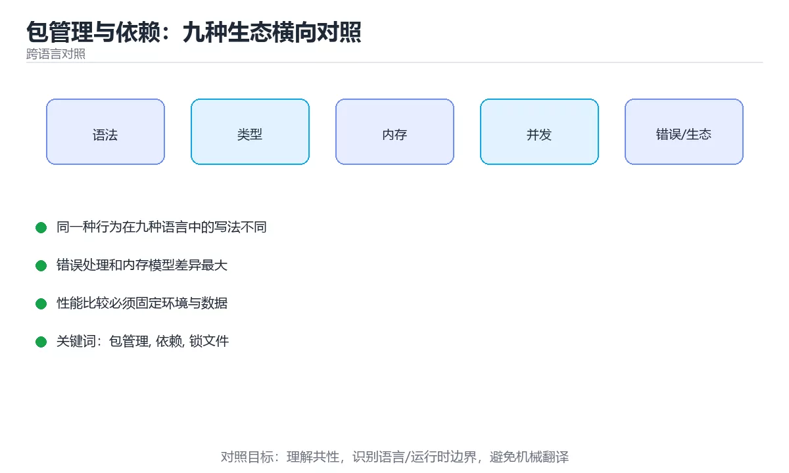

# 包管理与依赖：九种生态横向对照



> 内容更新时间：2026-10-03 · 学习阶段：入门 · 预计用时：20 分钟

## 学习目标

- 能用自己的话解释「包管理与依赖：九种生态横向对照」解决了什么问题，而不是只背术语。
- 能说清 「包管理」、「依赖」、「锁文件」、「版本号」 之间的关系，并分别举出一个例子。
- 能把本课知识放回「跨语言对照」的知识体系，说明它和相邻主题的边界。
- 能完成本课练习，并用验收标准检查自己的结果。

> 一句话摘要：清单文件、锁文件与版本语义，以及依赖冲突的排查方法。

## 前置知识

- 先完成上一课《错误处理与测试：九种语言横向对照》；如果已经掌握，可以直接用本课练习自测。
- 本课阶段：入门。只需要基本计算机操作，不要求编程经验。
- 开始前先复习：包管理、依赖、锁文件。
- 如果某一步看不懂，先记录具体卡点，完成练习后再回头读一遍。


## 一句话说清

包管理解决三件事：**从哪下载、怎么记录版本、怎么保证别人装出一样的环境**。
认准这三件事，换生态时就不需要重新学一遍。

## 主流包管理器对照

| 语言 | 包管理器 | 清单文件 | 锁文件 | 安装命令 |
| --- | --- | --- | --- | --- |
| Python | pip + venv | `pyproject.toml` / `requirements.txt` | `requirements.lock` / `uv.lock` | `pip install -r ...` |
| JavaScript | npm / pnpm / yarn | `package.json` | `package-lock.json` / `pnpm-lock.yaml` | `npm ci` |
| TypeScript | 同 JavaScript | 同上 | 同上 | `npm ci` |
| Java | Maven / Gradle | `pom.xml` / `build.gradle.kts` | Gradle 有 lockfile，Maven 无 | `mvn verify` |
| C# | NuGet | `*.csproj` / `Directory.Packages.props` | `packages.lock.json` | `dotnet restore` |
| C++ | vcpkg / Conan | `vcpkg.json` / `conanfile.txt` | vcpkg 基线提交 | `vcpkg install` |
| Go | go modules | `go.mod` | `go.sum` | `go mod download` |
| Rust | Cargo | `Cargo.toml` | `Cargo.lock` | `cargo fetch` |
| Shell | 系统包管理器 | 无统一标准 | 无 | `apt` / `brew` |

## 三类文件的分工（最容易被混淆）

```text
清单文件（manifest）：我直接依赖了什么，允许什么版本范围
   package.json / pyproject.toml / pom.xml / Cargo.toml / go.mod

锁文件（lockfile）：实际装到的精确版本与校验值
   package-lock.json / pnpm-lock.yaml / Cargo.lock / go.sum

缓存目录：下载过的包，本地复用
   node_modules / .venv / ~/.m2 / ~/.cargo / ~/go/pkg
```

| 文件 | 要不要提交 | 原因 |
| --- | --- | --- |
| 清单文件 | **必须提交** | 描述项目依赖 |
| 锁文件（应用） | **必须提交** | 保证各环境版本一致 |
| 锁文件（库） | 视生态 | Rust 库通常不提交，Go 需要 `go.sum` |
| 缓存目录 | 不要提交 | 体积大、可重建 |

## 版本号语义（SemVer）

```text
1.4.2
 │ │ └── 补丁号：向后兼容的问题修复
 │ └──── 次版本号：向后兼容的新功能
 └────── 主版本号：不兼容的破坏性变更
```

| 写法 | 含义 |
| --- | --- |
| `^1.4.2` | 允许 1.x 的最新版（不跨主版本） |
| `~1.4.2` | 只允许 1.4.x 的补丁更新 |
| `1.4.2` | 精确锁定 |
| `>=1.2 <2.0` | 显式范围 |
| `workspace:*` | 引用同仓库的本地包 |

**依赖版本尽量固定或收窄范围**：范围越宽，不同机器装出的差异越大。

## 各生态的「干净安装」命令

| 生态 | 干净安装（按锁文件） | 不要用 |
| --- | --- | --- |
| npm | `npm ci` | `npm install`（可能改锁文件） |
| pnpm | `pnpm install --frozen-lockfile` | 无参数的 `pnpm install` |
| Python | `uv sync` 或 `pip install -r requirements.lock` | 直接 `pip install 包名` |
| Go | `go mod download` | 手工拉代码 |
| Rust | `cargo fetch --locked` | 忽略 `Cargo.lock` |
| .NET | `dotnet restore --locked-mode` | 无锁还原 |

## 依赖冲突怎么排查

```bash
# 查看实际生效的版本与来源
npm ls <pkg>              # JavaScript
mvn dependency:tree       # Java
./gradlew dependencies    # Gradle
dotnet list package --include-transitive   # .NET
cargo tree -i <pkg>       # Rust
go mod why <pkg>          # Go
pipdeptree                # Python
```

| 现象 | 常见原因 | 处理 |
| --- | --- | --- |
| 编译通过但运行缺方法 | 版本冲突 | 用上面的命令定位并统一版本 |
| 同一包装了多份 | 间接依赖范围不兼容 | 提升主版本或加约束 |
| 生产缺依赖 | 装到 devDependencies | 运行时依赖放对位置 |
| 昨天能装今天不行 | 范围太宽且上游发新版 | 收窄范围并提交锁文件 |

## 一个真实场景：升级依赖

```text
1. 先看有哪些可升级项（npm outdated / mvn versions:display-dependency-updates）
2. 一次只升一类（补丁 → 次版本 → 主版本）
3. 每升一次跑完整测试与构建
4. 主版本升级先读迁移指南
5. 升级后观察线上指标，必要时回滚锁文件
```

## 新手最容易踩的八个坑

| 坑 | 现象 | 正确做法 |
| --- | --- | --- |
| 不提交锁文件 | 各环境版本不一致 | 提交锁文件 |
| CI 用 `npm install` | 每次都改版本 | 用 `npm ci` |
| 依赖范围写 `*` | 随时被破坏 | 明确版本或收窄范围 |
| 把构建工具放运行时依赖 | 生产体积变大 | 分清依赖类型 |
| 直接删锁文件重装 | 冲突升级 | 先定位再改 |
| 手工复制依赖目录 | 平台不兼容 | 用包管理器安装 |
| 全局安装项目依赖 | 版本互相污染 | 用虚拟环境或本地依赖 |
| 忽略安全告警 | 已知漏洞长期存在 | CI 加依赖扫描 |

## 本课小结
- 记住三件套：**清单文件描述意图，锁文件保证一致，缓存目录加速安装**。
- CI 里必须用「按锁文件安装」的命令，否则测试过的版本不是发布的版本。
- 排查依赖问题，先看依赖树，再谈改版本。

## 动手练习


> 本课练习重点：围绕「包管理、依赖、锁文件」完成复述、实验和交付，每个结果都要能被别人检查。

用两种语言实现同一行为，再对比语法、错误、性能和生态差异。

### 练习 1：建立心智模型（10 分钟）

合上教程，用 3～5 句话回答：

1. 「包管理与依赖：九种生态横向对照」解决了什么问题？
2. 如果没有它，会出现什么具体后果？
3. 它和「依赖」是什么关系？

**验收标准**：至少出现一个本课关键词，并写出一个反例、边界条件或失效场景。

### 练习 2：做一次可控实验（20 分钟）

从正文中选一个最小示例，完成以下操作：

1. 先预测修改一个参数、输入或步骤后的结果。
2. 再实际执行或逐步推演，记录真实结果。
3. 如果结果与预测不同，写出差异原因。

**验收标准**：留下「原例 → 改动 → 预测 → 结果 → 原因」五步记录。

### 练习 3：交付一个小结果（30 分钟）

选两种语言实现同一行为，列出语法、错误处理、性能和生态差异。

任务要求：

- 结果必须能被别人检查，不能只写“我已经理解了”。
- 至少覆盖「包管理」和「依赖」两个关键词。
- 写出 1 个仍然不确定的问题，以及下一步如何验证。

> 提示：时间有限时优先做练习 1 和练习 2；练习 3 可以拆成两次完成。


## 深入补充：包管理与依赖：九种生态横向对照

前面已经建立了基本概念。这一节换一个角度，把「包管理与依赖：九种生态横向对照」放进真实工程里，
重点回答三件事：它为什么存在、内部如何运转、什么时候会失效。

### 一、核心模型

包管理与依赖系统负责下载、解析、锁定和安装第三方代码；不同生态命令不同，但都要解决版本约束、传递依赖、锁文件、私有源和安全审计。

```text
声明依赖 → 解析版本约束 → 下载包 → 生成锁文件 → 安装到隔离环境 → 构建 → 审计与升级
```

### 二、关键机制拆解

1. 精确版本保证可复现，范围版本便于升级但可能引入不兼容；锁文件固定实际解析结果。
2. 传递依赖会形成依赖图，版本冲突需要解析器选择满足所有约束的组合。
3. 虚拟环境、vendor 目录和容器用于隔离依赖，避免污染系统环境。
4. 私有源和镜像源需要认证、缓存和可用性策略，不能把凭据写进仓库。
5. 依赖审计要检查已知漏洞、许可证和维护状态，而不仅是版本是否最新。
6. 升级应小步进行并跑完整测试，重大版本要阅读迁移指南和变更日志。
7. 可复现构建依赖锁文件、固定工具链和稳定的构建环境。

### 三、对照表：抓住容易混淆的边界

| 维度 | 一侧 | 另一侧 |
| --- | --- | --- |
| 版本范围 | 允许自动选择兼容版本 | 灵活但可能引入变化 |
| 精确版本 | 固定到单一版本 | 可复现但升级需要主动操作 |
| 锁文件 | 记录实际解析结果 | 保证团队和 CI 一致 |
| 私有源 | 组织内部包仓库 | 需要认证、权限和审计 |

### 四、工作示例

Python 使用 `pyproject.toml` 声明依赖，`uv.lock` 或 `poetry.lock` 锁定版本；Node 使用 `package.json` 加 `package-lock.json`；Go 使用 `go.mod` 与 `go.sum`；Rust 使用 `Cargo.toml` 与 `Cargo.lock`。

### 五、常见误区与失效边界

| 错误做法或假设 | 后果 | 正确做法 |
| --- | --- | --- |
| 把密钥写进源地址 | 凭据泄露到仓库 | 使用环境变量或凭据管理器 |
| 只提交清单不提交锁文件 | 不同机器构建结果不一致 | 将锁文件纳入版本控制 |
| 盲目升级所有依赖 | 一次引入大量兼容问题 | 分批升级并跑回归测试 |
| 忽略许可证 | 发布时产生合规风险 | 在依赖审计中检查许可证和来源 |

### 六、场景推演

CI 突然构建失败，本地却正常。排查顺序是：比较 Node/Python 等工具链版本；检查锁文件是否一致；确认依赖源可用且未被删除；最后在干净容器中复现并修复。

### 七、自测问答

**Q1：锁文件解决什么问题？**

固定实际解析的依赖版本，保证不同环境构建一致。

**Q2：为什么依赖需要隔离？**

避免不同项目的版本互相冲突，并减少污染系统环境。

**Q3：升级依赖为什么要分批？**

一次性升级会混合多个不兼容变化，难以定位回归。

**Q4：依赖审计包含哪些维度？**

已知漏洞、许可证、维护状态、来源可信度和升级成本。

### 八、小项目：把知识变成可检查的产出

选择三种语言生态，各创建一个最小项目，声明一个直接依赖和一个传递依赖；生成本地锁文件，在干净目录中复现安装，并输出依赖树、许可证和漏洞审计结果。

### 九、适用边界

包管理解决依赖获取与版本问题，不保证依赖安全、性能或 API 稳定。生产系统还需要私有源、制品签名、SBOM、漏洞扫描和弃用管理。

### 十、完成检查清单

- [ ] 能解释版本范围与锁文件
- [ ] 能维护依赖图和冲突解决
- [ ] 能隔离项目环境
- [ ] 能配置私有源与凭据
- [ ] 能完成依赖审计和安全升级

### 十一、复习顺序

1. 先不看资料复述“核心模型”，确认能说出它解决的三个问题。
2. 再对照表逐行解释容易混淆的概念，每个概念补一个反例。
3. 跟着工作示例做一遍，改变一个条件并预测结果。
4. 用自测问答检查理解，错题回到对应小节重新阅读。
5. 最后完成小项目，把结果、失败记录和复查清单整理成一份可提交产物。

> 复习不是重读一遍，而是离开原文重新产出：复述、改写、验证、复盘。


## 考点精讲：把测验题还原成判断过程

本课有 4 个判断点。先自己作答，再看「判断依据」；如果结论正确但理由不完整，回到正文对应章节补足概念。

### 考点 1：清单文件与锁文件的分工是？

- **正确判断**：清单文件描述依赖意图与版本范围
- **判断依据**：清单表达「我要什么」，锁文件保证「大家装到的是同一份」。选项四与事实相反，清单文件必须提交。正确项「清单文件描述依赖意图与版本范围」既符合定义也满足题干限定的场景，因此应当选择。错误项「两者作用相同，提交一个即可」把因果关系颠倒了，不能作为正确结论。错误项「锁文件只用于加密」属于相邻主题的说法，范围与本题要求不一致。错误项「清单文件由工具自动生成，不需要提交」把不同概念混在一起，缺少题干限定的前提。把题干「清单文件与锁文件的分工是？」放回《包管理与依赖：九种生态横向对照》的「清单文件、锁文件与版本语义，以及依赖冲突的排查方法」语境，逐项对照定义与边界条件，就能排除其余说法。
- **迁移检查**：把题干里的一个条件换成边界值，原来的结论还成立吗？写出判断过程。

### 考点 2：版本号 1.4.2 中，哪一位变化表示包含不兼容的破坏性变更？

- **正确判断**：第一位（主版本号）
- **判断依据**：按语义化版本约定，主版本号变化代表不兼容变更，次版本是兼容新增，补丁号是兼容修复。选项二与选项三都是向后兼容的变化。正确项「第一位（主版本号）」抓住了题干的核心条件，是经得起边界检验的表述。错误项「第二位（次版本号）」与课程给出的定义相冲突，不能回答题目所问。错误项「第三位（补丁号）」只看到了表面现象，没有解释题干真正考查的机制。错误项「任意一位」在边界或失败路径上会得出错误结果。把题干「版本号 1.4.2 中，哪一位变化表示包含不兼容的破坏性变更？」放回《包管理与依赖：九种生态横向对照》的「清单文件、锁文件与版本语义，以及依赖冲突的排查方法」语境，逐项对照定义与边界条件，就能排除其余说法。
- **迁移检查**：如果给某个错误选项去掉一个限定词，它会不会变成正确？说明理由。

### 考点 3：在 CI 里安装 Node 依赖，应该用哪个命令？

- **正确判断**：npm ci
- **判断依据**：npm ci 严格按锁文件安装，不会改写版本。选项一与选项三可能更新依赖，导致测试过的版本与发布的不一致。正确项「npm ci」完整覆盖了题目要求的关键点，没有遗漏前提。错误项「npm install」在边界或失败路径上会得出错误结果。错误项「npm update」把因果关系颠倒了，不能作为正确结论。错误项「逐个安装依赖包」忽略了题目中的限制条件，因此不成立。把题干「在 CI 里安装 Node 依赖，应该用哪个命令？」放回《包管理与依赖：九种生态横向对照》的「清单文件、锁文件与版本语义，以及依赖冲突的排查方法」语境，逐项对照定义与边界条件，就能排除其余说法。
- **迁移检查**：遮住选项，只根据定义复述一次答案，再回来看哪个选项与复述一致。

### 考点 4：排查「编译通过但运行时报找不到方法」的依赖问题，第一步应该做什么？

- **正确判断**：用依赖树命令查看实际生效的版本与来源
- **判断依据**：先看清哪两个版本冲突，再决定处理方式。选项一与选项三会掩盖问题、引入新风险。选项四成本极高且不解决根因。正确项「用依赖树命令查看实际生效的版本与来源」既符合定义也满足题干限定的场景，因此应当选择。错误项「直接删除锁文件重装（仅部分场景成立）」把因果关系颠倒了，不能作为正确结论。错误项「升级到最新版本」属于相邻主题的说法，范围与本题要求不一致。错误项「换成另一个包管理器」把不同概念混在一起，缺少题干限定的前提。把题干「排查「编译通过但运行时报找不到方法」的依赖问题，第一步应该做什么？」放回《包管理与依赖：九种生态横向对照》的「清单文件、锁文件与版本语义，以及依赖冲突的排查方法」语境，逐项对照定义与边界条件，就能排除其余说法。
- **迁移检查**：如果给某个错误选项去掉一个限定词，它会不会变成正确？说明理由。

## 本课复习清单

离开本课前，逐项确认：

- [ ] 不看解析，能说出「清单文件与锁文件的分工是？」的判断依据。
- [ ] 不看解析，能说出「版本号 1.4.2 中，哪一位变化表示包含不兼容的破坏性变更？」的判断依据。
- [ ] 不看解析，能说出「在 CI 里安装 Node 依赖，应该用哪个命令？」的判断依据。
- [ ] 不看解析，能说出「排查「编译通过但运行时报找不到方法」的依赖问题，第一步应该做什么？」的判断依据。
- [ ] 至少运行一次本课示例，记录输入、输出和一个边界情况。
- [ ] 把本课最容易混淆的两个概念写成一句话对照。

| 复盘项 | 记录 |
| --- | --- |
| 已经能独立解释的考点 |  |
| 仍然说不清的概念 |  |
| 下一步验证动作 |  |

## English Overview

**Title:** Package Management Across Ecosystems

**Summary:** Manifests, lockfiles, version semantics and conflict debugging.

**Category:** Cross-Language Comparison  
**Level:** 入门  
**Key terms:** 包管理, 依赖, 锁文件, 版本号, SemVer

> The full tutorial is written in Chinese. This bilingual overview helps English readers identify the topic, scope and key terms before studying the detailed examples.

## 内容元数据

- 内容版本：v2.0
- 最后更新：2026-10-03
- 学习阶段：入门
- 适用环境：九种主流语言生态横向对照
- 内容来源：内置结构化课程与工程实践整理
- 相关主题：包管理、依赖、锁文件、版本号、SemVer
- 质量版本：P0 测验标准 + P1 覆盖扩展 + P2 体验补全


## 参考资料与复核

- 最后复核：2026-10-04
- 下次复核：2027-04-04
- 复核范围：版本兼容、API 行为、安全建议与工程实践
- 来源性质：官方文档与标准；本课正文为离线教学重组，不复制原文

| 参考资料 | 本课用途 |
| --- | --- |
| [DevDocs](https://devdocs.io/) | 多语言 API 快速检索 |
| [官方语言文档](https://developer.mozilla.org/docs/Web) | 跨语言语义对照 |

> 本课主题：清单文件、锁文件与版本语义，以及依赖冲突的排查方法。

> App 完全离线展示文字链接，不会自动联网；需要延伸阅读时可复制链接到浏览器。

