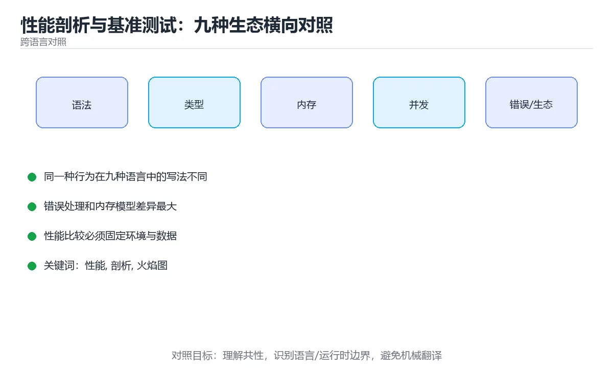

# 性能剖析与基准测试：九种生态横向对照



> 内容更新时间：2026-10-03 · 学习阶段：进阶 · 预计用时：20 分钟

## 学习目标

- 能用自己的话解释「性能剖析与基准测试：九种生态横向对照」解决了什么问题，而不是只背术语。
- 能说清 「性能」、「剖析」、「火焰图」、「基准测试」 之间的关系，并分别举出一个例子。
- 能把本课知识放回「跨语言对照」的知识体系，说明它和相邻主题的边界。
- 能完成本课练习，并用验收标准检查自己的结果。

> 一句话摘要：各语言剖析工具、火焰图阅读法、基准测试五纪律与常见性能根因。

## 前置知识

- 先完成上一课《序列化格式：JSON、YAML、Protobuf 横向对照》；如果已经掌握，可以直接用本课练习自测。
- 本课阶段：进阶。建议先掌握同一分类的基础课程，并能独立运行正文中的最小示例。
- 开始前先复习：性能、剖析、火焰图。
- 如果某一步看不懂，先记录具体卡点，完成练习后再回头读一遍。


## 一句话说清

性能优化只有一条正确路径：**先测量、再定位、改一处、复测**。
各生态的工具名字不同，但「采样剖析 + 基准测试」这两件事完全一致。

## 各语言的剖析与基准工具

| 语言 | 采样剖析 | 基准测试 | 内存分析 |
| --- | --- | --- | --- |
| Python | `cProfile` / `py-spy` | `timeit` / `pytest-benchmark` | `tracemalloc` / `memray` |
| JavaScript | Chrome DevTools Performance | `benchmark.js` | DevTools Memory |
| TypeScript | 同 JavaScript | `vitest bench` / `tinybench` | 同上 |
| Java | JFR / async-profiler | JMH | MAT / JFR |
| C# | dotnet-trace / PerfView | BenchmarkDotNet | dotnet-counters |
| C++ | perf / VTune | Google Benchmark | Valgrind / heaptrack |
| Go | pprof | `testing.B` | pprof heap |
| Rust | perf / cargo-flamegraph | Criterion | DHAT / heaptrack |
| Shell | `time` / `hyperfine` | hyperfine | 无 |

## 一张图看懂剖析流程

```text
① 明确指标：延迟？吞吐？内存？启动时间？
        │
        ▼
② 建立基线：用基准测试记录当前数字
        │
        ▼
③ 采样剖析：找出热点函数（占时间最多的）
        │
        ▼
④ 形成假设：例如「热点在 JSON 解析」
        │
        ▼
⑤ 改一处 → 复测同一基准 → 对比数字
        │
        ├─ 变快 → 保留，更新基线
        └─ 没变 → 回退，回到第 ③ 步
```

**一次只改一个变量**，否则无法判断是哪一个改动带来的效果。

## 火焰图怎么看

```text
横轴 = 采样时间占比（越宽越耗时）
纵轴 = 调用栈深度（越深调用层级越多）

┌──────────────────────────────────────────────────────────┐
│ main                                                      │
├───────────────────────┬──────────────────────────────────┤
│ handleRequest         │  initConfig                      │
├───────────┬───────────┼──────────────────────────────────┤
│ parseJson │ queryDb   │  loadYaml        ← 明显的宽条      │
└───────────┴───────────┴──────────────────────────────────┘
                    宽度就是优化优先级
```

| 现象 | 含义 |
| --- | --- |
| 某个函数条特别宽 | 自身耗时最多，优先优化 |
| 大量窄条 | 可能是调用过于频繁 |
| 出现「平顶」 | 该层是真正的热点，不是它的子调用 |

## 基准测试的五条纪律

```text
1. 多次运行取统计值，别只看一次（-count=5 或 --warmup）
2. 先预热：JIT 与缓存会让前几次偏慢
3. 隔离变量：同一台机器、同一负载、同一数据规模
4. 报告分位数：P50 / P95 / P99，而不是只看平均
5. 同时看内存：分配次数比耗时更容易暴露问题
```

```bash
# Go：基准测试与统计
go test -bench . -benchmem -count=5

# Shell：多轮计时对比
hyperfine --warmup 3 './app --mode fast' './app --mode safe'

# Python：快速计时
python -m timeit -s "from m import f" "f(1000)"

# Rust：Criterion 会给出统计显著性
cargo bench
```

## 常见性能问题与对策（跨语言通用）

| 现象 | 常见根因 | 对策 |
| --- | --- | --- |
| CPU 高但吞吐不涨 | 频繁上下文切换 | 减少线程数或改异步 |
| 延迟毛刺 | GC / 锁竞争 | 调 GC 参数、拆锁 |
| 内存持续增长 | 缓存无上限或泄漏 | 加容量限制、查引用 |
| 启动慢 | 初始化过多 | 延迟初始化、并行加载 |
| 单次调用慢 | 缺少索引或网络往返 | 加索引、批量合并 |
| 大量小对象 | 每次都新建 | 复用或池化 |

## 新手最容易踩的八个坑

| 坑 | 现象 | 正确做法 |
| --- | --- | --- |
| 凭感觉优化 | 改了半天没效果 | 先采样定位 |
| 只测一次 | 波动导致误判 | 多次取统计值 |
| 同时改多处 | 无法归因 | 一次一个变量 |
| 忽略预热 | 结果偏慢 | 加 warmup |
| 只看平均延迟 | 长尾被掩盖 | 看 P95 与 P99 |
| 在开发机测生产负载 | 数据失真 | 用接近生产的数据与配置 |
| 忘记内存指标 | 修了速度坏了内存 | 同时看分配与峰值 |
| 优化后不复测 | 不知道是否真的变快 | 用同一基准复测 |

## 本课小结
- 性能工作流的四步：**测量 → 定位 → 单变量修改 → 复测**。
- 火焰图看宽度，基准测试看分位数，内存看分配次数。
- 先问「优化哪一个指标」，再动手，否则只是碰运气。


## 补充：基准测试的统计严谨性与性能门禁

### 一次测量为什么不可信

```text
单次测量的四种噪声来源
  · CPU 频率浮动（睿频、降频、温度墙）
  · 容器限额（CPU 配额、cgroup 限流）
  · 后台进程与 GC
  · 缓存预热状态（第一轮必然偏慢）

应对：多次运行取分位数，并报告离散程度
  推荐 -count=5 以上，报告 P50 与 P95，而不是只报最小值
```

| 报告方式 | 问题 |
| --- | --- |
| 只报最快的一次 | 掩盖真实分布，容易得出错误结论 |
| 只报平均值 | 长尾被抹平 |
| 不带样本量 | 无法判断可信度 |
| 不写机器与配置 | 别人无法复现 |

### 各生态的成熟基准工具

| 语言 | 工具 | 它会自动处理 |
| --- | --- | --- |
| Java | JMH | 预热轮次、JIT、死代码消除 |
| Rust | Criterion | 统计显著性、离群值、回归检测 |
| C++ | Google Benchmark | 迭代次数自适应、最小耗时统计 |
| Go | `testing.B` | `b.N` 自动放大、`-benchmem` 统计分配 |
| Python | pytest-benchmark | 预热、多轮、标准差 |

```text
为什么需要专用工具
  编译器会删掉「没有副作用」的计算（死代码消除），
  朴素计时得到的可能是「什么都没算」的结果。
  这些工具通过消费结果、固定输入等方式避免被优化掉。
```

### 火焰图之外：三类互补工具

```text
① 采样剖析（perf、py-spy、async-profiler）
   回答：时间花在哪些函数上

② 差异剖析（pprof -diff_base、JFR 对比）
   回答：这次改动让哪个函数变慢/变快了

③ 指标监控（P95 延迟、GC 次数、分配速率）
   回答：线上是否真的变好了

三者顺序：改动前用 ① 找热点 → 用 ② 验证改动 → 用 ③ 确认线上效果
```

### 把性能纳入 CI：回归门禁

```bash
# 思路：与基线对比，超过阈值就失败
cargo bench -- --save-baseline main      # 主干建立基线
cargo bench -- --baseline main           # 分支上对比

# Go：把关键基准的 ns/op 存下来做趋势对比
go test -bench . -benchmem -count=5 | tee bench.txt
```

```text
门禁设计要点
  · 只对「关键路径」的基准设阈值，避免噪音导致频繁失败
  · 阈值留出余量（如 +10% 才算回归），而不是要求完全一致
  · 在专用机器或固定配额环境下跑，减少抖动
  · 回归失败要能一键复现命令，否则会被当成噪声忽略
```

### 优化时最容易自欺的四种情况

| 情况 | 表现 | 如何避免 |
| --- | --- | --- |
| 测了但没测对 | 优化了非热点 | 先剖析再动手 |
| 改了多处 | 无法归因 | 单变量修改 |
| 用开发数据测 | 生产数据分布不同 | 用真实规模与分布 |
| 只看耗时 | 内存或 GC 变差 | 同时看分配与峰值 |

### 自查清单

- [ ] 基准至少跑 5 轮并报告分位数
- [ ] 记录了机器、版本与运行参数
- [ ] 用专用工具避免被编译器优化掉
- [ ] 关键路径有 CI 回归门禁（带余量阈值）
- [ ] 改动前后用同一套基准对比

## 动手练习


> 本课练习重点：围绕「性能、剖析、火焰图」完成复述、实验和交付，每个结果都要能被别人检查。

用两种语言实现同一行为，再对比语法、错误、性能和生态差异。

### 练习 1：建立心智模型（10 分钟）

合上教程，用 3～5 句话回答：

1. 「性能剖析与基准测试：九种生态横向对照」解决了什么问题？
2. 如果没有它，会出现什么具体后果？
3. 它和「剖析」是什么关系？

**验收标准**：至少出现一个本课关键词，并写出一个反例、边界条件或失效场景。

### 练习 2：做一次可控实验（20 分钟）

从正文中选一个最小示例，完成以下操作：

1. 先预测修改一个参数、输入或步骤后的结果。
2. 再实际执行或逐步推演，记录真实结果。
3. 如果结果与预测不同，写出差异原因。

**验收标准**：留下「原例 → 改动 → 预测 → 结果 → 原因」五步记录。

### 练习 3：交付一个小结果（30 分钟）

选两种语言实现同一行为，列出语法、错误处理、性能和生态差异。

任务要求：

- 结果必须能被别人检查，不能只写“我已经理解了”。
- 至少覆盖「性能」和「剖析」两个关键词。
- 写出 1 个仍然不确定的问题，以及下一步如何验证。

> 提示：时间有限时优先做练习 1 和练习 2；练习 3 可以拆成两次完成。


## 考点精讲：把测验题还原成判断过程

本课有 4 个判断点。先自己作答，再看「判断依据」；如果结论正确但理由不完整，回到正文对应章节补足概念。

### 考点 1：性能优化的正确流程是？

- **正确判断**：先测量建基线，再定位热点，改一处后复测
- **判断依据**：没有测量就没有优化，必须基于数据定位并复测验证。选项二与选项三是成本极高的猜测性方案。正确项「先测量建基线，再定位热点，改一处后复测」抓住了题干的核心条件，是经得起边界检验的表述。错误项「先改代码，效果不好再回退」把不同概念混在一起，缺少题干限定的前提。错误项「直接换更快的语言」只看到了表面现象，没有解释题干真正考查的机制。错误项「增加机器数量」在边界或失败路径上会得出错误结果。把题干「性能优化的正确流程是？」放回《性能剖析与基准测试：九种生态横向对照》的「各语言剖析工具、火焰图阅读法、基准测试五纪律与常见性能根因」语境，逐项对照定义与边界条件，就能排除其余说法。
- **迁移检查**：如果给某个错误选项去掉一个限定词，它会不会变成正确？说明理由。

### 考点 2：火焰图中某个函数条特别宽，说明？

- **正确判断**：该函数占用时间最多
- **判断依据**：火焰图横轴是采样时间占比，越宽说明耗时越多。选项一、二、四都不是宽度的含义（层级看纵轴，内存需要另外的工具）。正确项「该函数占用时间最多」描述正确，能够解释题干场景中的现象与结果。错误项「代码行数多」与课程给出的定义相冲突，不能回答题目所问。错误项「调用层级深」只看到了表面现象，没有解释题干真正考查的机制。错误项「内存占用大」适用于其他场景，但与本题的前提不匹配。把题干「火焰图中某个函数条特别宽，说明？」放回《性能剖析与基准测试：九种生态横向对照》的「各语言剖析工具、火焰图阅读法、基准测试五纪律与常见性能根因」语境，逐项对照定义与边界条件，就能排除其余说法。
- **迁移检查**：把题干里的一个条件换成边界值，原来的结论还成立吗？写出判断过程。

### 考点 3：做基准测试时，为什么要加预热（warmup）？

- **正确判断**：因为 JIT 编译与缓存会让前几次偏慢，预热后数据才稳定
- **判断依据**：预热能让 JIT、连接池与缓存进入稳定状态，避免首轮偏慢影响结论。选项四需要专门的压测而不是 warmup。正确项「因为 JIT 编译与缓存会让前几次偏慢，预热后数据才稳定」既符合定义也满足题干限定的场景，因此应当选择。错误项「为了增加测试次数（没有覆盖题干给出的条件）」把因果关系颠倒了，不能作为正确结论。错误项「为了节省时间」属于相邻主题的说法，范围与本题要求不一致。错误项「为了模拟生产流量」把不同概念混在一起，缺少题干限定的前提。把题干「做基准测试时，为什么要加预热（warmup）？」放回《性能剖析与基准测试：九种生态横向对照》的「各语言剖析工具、火焰图阅读法、基准测试五纪律与常见性能根因」语境，逐项对照定义与边界条件，就能排除其余说法。
- **迁移检查**：遮住选项，只根据定义复述一次答案，再回来看哪个选项与复述一致。

### 考点 4：评估接口性能时，为什么不能只看平均延迟？

- **正确判断**：平均值会掩盖长尾
- **判断依据**：少量极慢请求会被大量快请求平均掉，用户体验由高分位决定。选项一、三、四都不是核心原因。正确项「平均值会掩盖长尾」与本课示例和结论一致，可以直接用于实际编码。错误项「平均值计算容易出错」只看到了表面现象，没有解释题干真正考查的机制。错误项「平均值只能用于内存」适用于其他场景，但与本题的前提不匹配。错误项「平均值单位不一致」把因果关系颠倒了，不能作为正确结论。把题干「评估接口性能时，为什么不能只看平均延迟？」放回《性能剖析与基准测试：九种生态横向对照》的「各语言剖析工具、火焰图阅读法、基准测试五纪律与常见性能根因」语境，逐项对照定义与边界条件，就能排除其余说法。
- **迁移检查**：如果给某个错误选项去掉一个限定词，它会不会变成正确？说明理由。

## 本课复习清单

离开本课前，逐项确认：

- [ ] 不看解析，能说出「性能优化的正确流程是？」的判断依据。
- [ ] 不看解析，能说出「火焰图中某个函数条特别宽，说明？」的判断依据。
- [ ] 不看解析，能说出「做基准测试时，为什么要加预热（warmup）？」的判断依据。
- [ ] 不看解析，能说出「评估接口性能时，为什么不能只看平均延迟？」的判断依据。
- [ ] 至少运行一次本课示例，记录输入、输出和一个边界情况。
- [ ] 把本课最容易混淆的两个概念写成一句话对照。

| 复盘项 | 记录 |
| --- | --- |
| 已经能独立解释的考点 |  |
| 仍然说不清的概念 |  |
| 下一步验证动作 |  |

## English Overview

**Title:** Profiling and Benchmarking

**Summary:** Profilers, flame graphs, benchmark discipline and common causes.

**Category:** Cross-Language Comparison  
**Level:** 进阶  
**Key terms:** 性能, 剖析, 火焰图, 基准测试, 分位数

> The full tutorial is written in Chinese. This bilingual overview helps English readers identify the topic, scope and key terms before studying the detailed examples.

## 内容元数据

- 内容版本：v2.0
- 最后更新：2026-10-03
- 学习阶段：进阶
- 适用环境：九种主流语言生态横向对照
- 内容来源：内置结构化课程与工程实践整理
- 相关主题：性能、剖析、火焰图、基准测试、分位数
- 质量版本：P0 测验标准 + P1 覆盖扩展 + P2 体验补全


## 参考资料与复核

- 最后复核：2026-10-04
- 下次复核：2027-04-04
- 复核范围：版本兼容、API 行为、安全建议与工程实践
- 来源性质：官方文档与标准；本课正文为离线教学重组，不复制原文

| 参考资料 | 本课用途 |
| --- | --- |
| [DevDocs](https://devdocs.io/) | 多语言 API 快速检索 |
| [官方语言文档](https://developer.mozilla.org/docs/Web) | 跨语言语义对照 |

> 本课主题：各语言剖析工具、火焰图阅读法、基准测试五纪律与常见性能根因。

> App 完全离线展示文字链接，不会自动联网；需要延伸阅读时可复制链接到浏览器。

