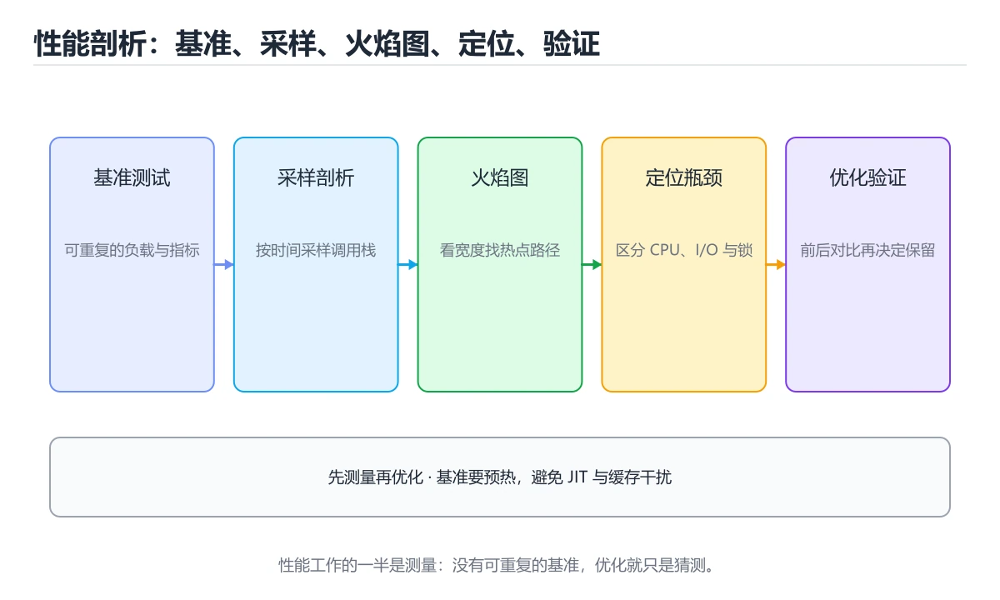

# 性能剖析与基准测试：九种生态横向对照

> 内容更新时间：2026-10-06 · 学习阶段：进阶 · 预计用时：45 分钟




## 本节知识框架

**课程定位**：所属分类为「跨语言对照」，课程主题为「性能剖析与基准测试：九种生态横向对照」，学习阶段为「进阶」，建议用时 45 分钟。

**本课要解决的主问题**：各语言剖析工具、火焰图阅读法、基准测试五纪律与常见性能根因。

| 学习层次 | 要回答的问题 | 完成判据 |
| --- | --- | --- |
| 概念层 | 「性能剖析与基准测试：九种生态横向对照」有哪些必须区分的对象与术语？ | 能用自己的话定义核心术语，并各举一个正例和一个反例。 |
| 机制层 | 这些对象按什么顺序发生作用，输入如何变成输出？ | 能画出或写出机制步骤，并说明每一步的失败条件。 |
| 应用层 | 什么场景适合使用「性能剖析与基准测试：九种生态横向对照」，什么场景不适合？ | 能给出一个真实场景、一个最小示例和一个边界案例。 |
| 性能层 | 时间、空间、吞吐或延迟受哪些量影响？ | 能说出复杂度或性能瓶颈的证据来源；没有证据时明确写“材料未提供”。 |
| 复习层 | 怎样确认自己不是只记住了结论？ | 能独立完成本课自测，并把错误定位到概念、机制、示例或边界。 |

### 阅读路线

1. 先读「核心概念定义」，建立「性能」等对象的精确定义。
2. 再读「原理与运行机制」，把定义串成可重复的过程。
3. 用「代码/协议/SQL 示例」验证过程，并只改一个条件观察结果变化。
4. 最后检查性能、易错点、知识关系与自测题，形成可复习的证据链。

**前置知识**：《序列化格式：JSON、YAML、Protobuf 横向对照》

**学习位置**：本课位于《序列化格式：JSON、YAML、Protobuf 横向对照》之后；如果前一课的自测不能通过，应先回补再继续。

**后续衔接**：下一课《CI 流水线配置：九种生态横向对照》会继续使用本课术语，学完后建议立即完成一次自测。

**教材衔接：学习目标**

- 能用自己的话解释性能剖析与基准测试：九种生态横向对照解决了什么问题，而不是只背术语。
- 能说清 「性能」、「剖析」、「火焰图」、「基准测试」 之间的关系，并分别举出一个例子。
- 能把 性能 放回「性能剖析与基准测试：九种生态横向对照」的知识体系，说明它和 剖析 的边界。
- 能完成本课练习，并用验收标准检查自己的结果。

> 一句话摘要：各语言剖析工具、火焰图阅读法、基准测试五纪律与常见性能根因。

**教材衔接：前置知识**

- 先完成上一课《序列化格式：JSON、YAML、Protobuf 横向对照》；如果已经掌握，可以直接用本课练习自测。
- 本课阶段：进阶。建议先完成「序列化格式：JSON、YAML、Protobuf 横向对照」，或确认自己能独立跑通正文里的 handleRequest 示例。
- 开始前先复习：性能、剖析、火焰图。
- 看不懂就直接缩小例子：只保留 性能 相关的两行输入，跑通后再加回其余部分。

**教材衔接：本课小结**

- 性能工作流的四步：**测量 → 定位 → 单变量修改 → 复测**。
- 火焰图看宽度，基准测试看分位数，内存看分配次数。
- 先问「优化哪一个指标」，再动手，否则只是碰运气。

## 核心概念定义

> 在阅读《性能剖析与基准测试：九种生态横向对照》时，术语第一次出现先给操作性定义，再给边界；正文说法与这里冲突时，以定义和可复现示例为准。

| 术语 | 操作性定义 | 本课中的边界 |
| --- | --- | --- |
| 性能 | 系统在给定负载下表现出的吞吐、延迟、资源占用和稳定性。 | 仅在「性能剖析与基准测试：九种生态横向对照」明确给出的输入、版本与资源条件下成立。 |
| 剖析 | ③ 采样剖析：找出热点函数（占时间最多的）。 | 仅在「性能剖析与基准测试：九种生态横向对照」明确给出的输入、版本与资源条件下成立。 |
| 基准测试 | 在固定环境和输入下重复测量性能，得到可比较的基线。 | 仅在「性能剖析与基准测试：九种生态横向对照」明确给出的输入、版本与资源条件下成立。 |
| 分位数 | 报告分位数：P50 / P95 / P99，而不是只看平均。 | 仅在「性能剖析与基准测试：九种生态横向对照」明确给出的输入、版本与资源条件下成立。 |

### 定义如何使用

在「性能剖析与基准测试：九种生态横向对照」中判断一个说法是否成立，先确认它使用的是哪个对象的定义，再检查输入规模、运行环境与失败路径。定义不是口号，而是后续推导、代码示例和自测题共享的约束。

## 原理与运行机制

### 机制总览

1. **建立输入**：把「性能」按本课定义整理成可观察、可重复的输入条件。
2. **执行转换**：围绕「剖析」执行本课的核心步骤；每一步都记录中间状态，避免只看最终输出。
3. **产生输出**：得到「基准测试」后，用正文示例或协议/SQL 结果核对输出是否符合预期。
4. **改变一个条件**：只替换一个边界条件或环境参数，观察「性能剖析与基准测试：九种生态横向对照」的结论是否仍然成立。

| 阶段 | 关注对象 | 失败时应检查 |
| --- | --- | --- |
| 输入 | 性能 | 类型、范围、编码、版本或前置状态是否满足定义。 |
| 处理 | 剖析 | 顺序、可见性、锁、路由、事务或调度规则是否被破坏。 |
| 输出 | 基准测试 | 结果是否可复现，错误是否被正确传播而不是被吞掉。 |

本课的机制结论要用「性能剖析与基准测试：九种生态横向对照」自己的示例验证。「性能剖析与基准测试：九种生态横向对照」没有给出某个数量级、吞吐或内存数据时，本课把该判断标为“材料未提供”，不从相邻主题外推。

**教材衔接：一句话说清**

性能优化只有一条正确路径：**先测量、再定位、改一处、复测**。
各生态的工具名字不同，但「采样剖析 + 基准测试」这两件事完全一致。

**教材衔接：一张图看懂剖析流程**

```text
① 明确指标：延迟？吞吐？内存？启动时间？
        │
        ▼
② 建立基线：用基准测试记录当前数字
        │
        ▼
③ 采样剖析：找出热点函数（占时间最多的）
        │
        ▼
④ 形成假设：例如「热点在 JSON 解析」
        │
        ▼
⑤ 改一处 → 复测同一基准 → 对比数字
        │
        ├─ 变快 → 保留，更新基线
        └─ 没变 → 回退，回到第 ③ 步
```

**一次只改一个变量**，否则无法判断是哪一个改动带来的效果。

## 典型应用场景

| 场景 | 典型输入或前提 | 期望产物 |
| --- | --- | --- |
| 学习验证 | 使用本课最小示例和 性能、剖析 | 能复现正文结论，并解释每一步。 |
| 工程落地 | 把「性能剖析与基准测试：九种生态横向对照」放入真实模块或服务边界 | 输出可观测、失败可定位、参数可配置。 |
| 故障排查 | 只改一个版本、规模、输入或依赖条件 | 能区分概念错误、实现错误和环境差异。 |

判断「性能剖析与基准测试：九种生态横向对照」的场景是否成立，标准是能否写出输入、处理、输出和失败路径；材料中没有出现的数据在本课标注为“材料未提供”，不用推测替代证据。

## 代码/协议/SQL 示例

以下代码、协议或 SQL 片段来自《性能剖析与基准测试：九种生态横向对照》原文，保留原有语言标记与上下文；先预测《性能剖析与基准测试：九种生态横向对照》示例的输出，再按正文步骤运行或推演，示例依赖外部环境时同时记录版本与输入。

**教材衔接：火焰图怎么看**

```text
横轴 = 采样时间占比（越宽越耗时）
纵轴 = 调用栈深度（越深调用层级越多）

┌──────────────────────────────────────────────────────────┐
│ main                                                      │
├───────────────────────┬──────────────────────────────────┤
│ handleRequest         │  initConfig                      │
├───────────┬───────────┼──────────────────────────────────┤
│ parseJson │ queryDb   │  loadYaml        ← 明显的宽条      │
└───────────┴───────────┴──────────────────────────────────┘
                    宽度就是优化优先级
```

| 现象 | 含义 |
| --- | --- |
| 某个函数条特别宽 | 自身耗时最多，优先优化 |
| 大量窄条 | 可能是调用过于频繁 |
| 出现「平顶」 | 该层是真正的热点，不是它的子调用 |

## 时间/空间复杂度或性能分析

**复杂度证据**：「性能剖析与基准测试：九种生态横向对照」的现有材料没有给出渐近时间或空间复杂度的明确结论，本课只做定性检查，不补写未经验证的 $O$ 记号。

| 维度 | 本课关注点 | 判断依据 |
| --- | --- | --- |
| 时间/延迟 | 「性能剖析与基准测试：九种生态横向对照」的主要步骤是否会随输入规模、并发度或网络往返增长。 | 以正文复杂度、基准数据或可重复测量为准。 |
| 空间/内存 | 中间状态、缓存、副本、连接或索引是否随规模增长。 | 记录峰值内存与数据副本，不只看最终结果。 |
| 吞吐/资源 | 版本、调度、锁、IO、序列化或协议开销是否成为瓶颈。 | 固定环境做对照实验，改变一个变量。 |

评估「性能剖析与基准测试：九种生态横向对照」时要区分“正确性成立”和“性能达标”两件事；材料没有给出基准时，本课只保留量级来源与测量方法，不写不可验证的绝对数字。

**教材衔接：各语言的剖析与基准工具**

| 语言 | 采样剖析 | 基准测试 | 内存分析 |
| --- | --- | --- | --- |
| Python | `cProfile` / `py-spy` | `timeit` / `pytest-benchmark` | `tracemalloc` / `memray` |
| JavaScript | Chrome DevTools Performance | `benchmark.js` | DevTools Memory |
| TypeScript | 同 JavaScript | `vitest bench` / `tinybench` | 同上 |
| Java | JFR / async-profiler | JMH | MAT / JFR |
| C# | dotnet-trace / PerfView | BenchmarkDotNet | dotnet-counters |
| C++ | perf / VTune | Google Benchmark | Valgrind / heaptrack |
| Go | pprof | `testing.B` | pprof heap |
| Rust | perf / cargo-flamegraph | Criterion | DHAT / heaptrack |
| Shell | `time` / `hyperfine` | hyperfine | 无 |

**教材衔接：基准测试的五条纪律**

```text
1. 多次运行取统计值，别只看一次（-count=5 或 --warmup）
2. 先预热：JIT 与缓存会让前几次偏慢
3. 隔离变量：同一台机器、同一负载、同一数据规模
4. 报告分位数：P50 / P95 / P99，而不是只看平均
5. 同时看内存：分配次数比耗时更容易暴露问题
```

```bash
# Go：基准测试与统计
go test -bench . -benchmem -count=5

# Shell：多轮计时对比
hyperfine --warmup 3 './app --mode fast' './app --mode safe'

# Python：快速计时
python -m timeit -s "from m import f" "f(1000)"

# Rust：Criterion 会给出统计显著性
cargo bench
```

**教材衔接：常见性能问题与对策（跨语言通用）**

| 现象 | 常见根因 | 对策 |
| --- | --- | --- |
| CPU 高但吞吐不涨 | 频繁上下文切换 | 减少线程数或改异步 |
| 延迟毛刺 | GC / 锁竞争 | 调 GC 参数、拆锁 |
| 内存持续增长 | 缓存无上限或泄漏 | 加容量限制、查引用 |
| 启动慢 | 初始化过多 | 延迟初始化、并行加载 |
| 单次调用慢 | 缺少索引或网络往返 | 加索引、批量合并 |
| 大量小对象 | 每次都新建 | 复用或池化 |

**教材衔接：补充：基准测试的统计严谨性与性能门禁**

### 一次测量为什么不可信

```text
单次测量的四种噪声来源
  · CPU 频率浮动（睿频、降频、温度墙）
  · 容器限额（CPU 配额、cgroup 限流）
  · 后台进程与 GC
  · 缓存预热状态（第一轮必然偏慢）

应对：多次运行取分位数，并报告离散程度
  推荐 -count=5 以上，报告 P50 与 P95，而不是只报最小值
```

| 报告方式 | 问题 |
| --- | --- |
| 只报最快的一次 | 掩盖真实分布，容易得出错误结论 |
| 只报平均值 | 长尾被抹平 |
| 不带样本量 | 无法判断可信度 |
| 不写机器与配置 | 别人无法复现 |

### 各生态的成熟基准工具

| 语言 | 工具 | 它会自动处理 |
| --- | --- | --- |
| Java | JMH | 预热轮次、JIT、死代码消除 |
| Rust | Criterion | 统计显著性、离群值、回归检测 |
| C++ | Google Benchmark | 迭代次数自适应、最小耗时统计 |
| Go | `testing.B` | `b.N` 自动放大、`-benchmem` 统计分配 |
| Python | pytest-benchmark | 预热、多轮、标准差 |

```text
为什么需要专用工具
  编译器会删掉「没有副作用」的计算（死代码消除），
  朴素计时得到的可能是「什么都没算」的结果。
  这些工具通过消费结果、固定输入等方式避免被优化掉。
```

### 火焰图之外：三类互补工具

```text
① 采样剖析（perf、py-spy、async-profiler）
   回答：时间花在哪些函数上

② 差异剖析（pprof -diff_base、JFR 对比）
   回答：这次改动让哪个函数变慢/变快了

③ 指标监控（P95 延迟、GC 次数、分配速率）
   回答：线上是否真的变好了

三者顺序：改动前用 ① 找热点 → 用 ② 验证改动 → 用 ③ 确认线上效果
```

### 把性能纳入 CI：回归门禁

```bash
# 思路：与基线对比，超过阈值就失败
cargo bench -- --save-baseline main      # 主干建立基线
cargo bench -- --baseline main           # 分支上对比

# Go：把关键基准的 ns/op 存下来做趋势对比
go test -bench . -benchmem -count=5 | tee bench.txt
```

```text
门禁设计要点
  · 只对「关键路径」的基准设阈值，避免噪音导致频繁失败
  · 阈值留出余量（如 +10% 才算回归），而不是要求完全一致
  · 在专用机器或固定配额环境下跑，减少抖动
  · 回归失败要能一键复现命令，否则会被当成噪声忽略
```

### 优化时最容易自欺的四种情况

| 情况 | 表现 | 如何避免 |
| --- | --- | --- |
| 测了但没测对 | 优化了非热点 | 先剖析再动手 |
| 改了多处 | 无法归因 | 单变量修改 |
| 用开发数据测 | 生产数据分布不同 | 用真实规模与分布 |
| 只看耗时 | 内存或 GC 变差 | 同时看分配与峰值 |

### 自查清单

- [ ] 基准至少跑 5 轮并报告分位数
- [ ] 记录了机器、版本与运行参数
- [ ] 用专用工具避免被编译器优化掉
- [ ] 关键路径有 CI 回归门禁（带余量阈值）
- [ ] 改动前后用同一套基准对比

## 常见误区与易错点

> 复核《性能剖析与基准测试：九种生态横向对照》的易错点时，优先保留原文的错误表、故障现场与排错路径；每条修正都要能用本课示例复验。

| 易错点 | 常见表现 | 正确做法 |
| --- | --- | --- |
| 只背结论 | 能复述「性能剖析与基准测试：九种生态横向对照」的定义，却说不清输入、输出与边界。 | 回到机制步骤，用最小示例逐一验证。 |
| 混淆相邻概念 | 把本课对象与相邻主题的对象当成同一类。 | 先比较定义、资源归属、生命周期和失败模式。 |
| 忽略版本与环境 | 在开发机通过后直接外推到生产环境。 | 固定版本、输入和资源条件，再记录可复现结果。 |

**教材衔接：常见错误与排查**

> 说明：本表由《性能剖析与基准测试：九种生态横向对照》的核心知识整理（2026-10-07），人工复核进度见 docs/content_review_batches.md。

| 易错点 | 容易踩的做法 | 正确结论 |
| --- | --- | --- |
| 基准不做预热 | 首次运行包含编译与缓存冷启动，数据偏高 | 先预热固定轮次，再统计中位数与波动 |
| 只测一个规模 | 复杂度拐点被单点数据掩盖 | 至少测三档规模，观察增长趋势再下结论 |
| 只看平均耗时 | 尾延迟问题被平均值掩盖 | 同时记录 P95/P99、分配量与 CPU 占用 |

**教材衔接：故障现场**

### 现场 1：基准不做预热

**症状**：在《性能剖析与基准测试：九种生态横向对照》的复现场景中，首次运行包含编译与缓存冷启动，数据偏高。

**根因**：当出现“基准不做预热”时，执行路径已经绕过了《性能剖析与基准测试：九种生态横向对照》的关键约束，最终以“首次运行包含编译与缓存冷启动，数据偏高”暴露出来；修复前必须先确认约束在哪里失效。

**修复**：针对《性能剖析与基准测试：九种生态横向对照》的问题，先预热固定轮次，再统计中位数与波动。

**验证**：先在《性能剖析与基准测试：九种生态横向对照》中记录“基准不做预热”留下的失败证据，再执行“先预热固定轮次，再统计中位数与波动”并重放；确认错误路径变为明确结果，且修复没有掩盖同类故障。

### 现场 2：只测一个规模

**症状**：在《性能剖析与基准测试：九种生态横向对照》的复现场景中，复杂度拐点被单点数据掩盖。

**根因**：触发点是把“只测一个规模”当成安全做法。它没有满足《性能剖析与基准测试：九种生态横向对照》要求的前提，因此先表现为“复杂度拐点被单点数据掩盖”；排查时先完整复现这一段，再核对输入、配置与依赖。

**修复**：针对《性能剖析与基准测试：九种生态横向对照》的问题，至少测三档规模，观察增长趋势再下结论。

**验证**：在《性能剖析与基准测试：九种生态横向对照》中按“至少测三档规模，观察增长趋势再下结论”调整后，从“只测一个规模”的触发条件重放同一条路径，确认“复杂度拐点被单点数据掩盖”不再出现，并补一个相邻边界用例检查没有引入新问题。

### 现场 3：只看平均耗时

**症状**：在《性能剖析与基准测试：九种生态横向对照》的复现场景中，尾延迟问题被平均值掩盖。

**根因**：“尾延迟问题被平均值掩盖”只是表层结果。向上追溯会落到“只看平均耗时”这一步，因为它省略了《性能剖析与基准测试：九种生态横向对照》的约束，使实现行为和预期模型发生了偏离。

**修复**：针对《性能剖析与基准测试：九种生态横向对照》的问题，同时记录 P95/P99、分配量与 CPU 占用。

**验证**：在《性能剖析与基准测试：九种生态横向对照》中按“同时记录 P95/P99、分配量与 CPU 占用”调整后，从“只看平均耗时”的触发条件重放同一条路径，确认“尾延迟问题被平均值掩盖”不再出现，并补一个相邻边界用例检查没有引入新问题。

## 与其他知识点的关系

| 关系 | 课程 | 为什么 |
| --- | --- | --- |
| 先修 | 《序列化格式：JSON、YAML、Protobuf 横向对照》 | 本课会直接使用它的概念或操作前提。 |
| 关联 | 《CI 流水线配置：九种生态横向对照》 | 用于横向比较或把本课结论迁移到相邻主题。 |
| 关联 | 《Go 性能剖析与调优实战》 | 用于横向比较或把本课结论迁移到相邻主题。 |
| 关联 | 《性能度量与并行体系结构》 | 用于横向比较或把本课结论迁移到相邻主题。 |
| 前置顺序 | 《序列化格式：JSON、YAML、Protobuf 横向对照》 | 同分类中安排在本课之前，建议先完成其自测。 |
| 后续顺序 | 《CI 流水线配置：九种生态横向对照》 | 同分类中安排在本课之后，会继续使用本课术语。 |

把「性能剖析与基准测试：九种生态横向对照」放回知识体系时，不只要记住“前面学过什么”，还要说明两个主题在输入、机制、资源边界和失败模式上的差异。这样才能把单课知识迁移到项目、排障和后续课程。

**教材衔接：深入补充：性能剖析与基准测试：九种生态横向对照 的取舍与边界**

### 一、把概念放回真实约束

学习性能剖析与基准测试：九种生态横向对照时，最容易只记住结论而忽略前提。先写出三个约束：数据规模、时间预算、可接受的失败方式；再判断 性能 与 剖析 在这些约束下是否仍然成立。只要约束改变，原来的最优解就可能变成错误解。

| 维度 | 性能 的典型写法 | 另一种语言的等价写法 | 迁移时最易踩的坑 |
| --- | --- | --- | --- |
| 错误处理 | 显式返回或抛出 | 异常或结果类型 | 错误被静默吞掉 |
| 并发模型 | 线程、协程或事件循环 | 运行时调度不同 | 共享状态与取消语义 |
| 依赖管理 | 官方包管理器 | 生态与锁文件不同 | 版本解析结果不一致 |

### 二、三个容易混淆的边界

1. 澄清输入与目标。先写清「性能剖析与基准测试：九种生态横向对照」要解决的问题、合法输入范围和成功标准，再进入后续步骤。
2. **把“平均值”当成“全部”**：性能 的指标好看，不代表尾部请求、冷启动或失败重试也好看。
3. **把“当前版本”当成“永久行为”**：剖析 依赖的默认值、API 或性能特征都可能随版本变化，需要固定版本并保留回归用例。

### 三、一个生产场景

假设团队要在真实系统里使用性能剖析与基准测试：九种生态横向对照：第一周先做小流量验证，记录 性能 的基线与异常；第二周扩大输入规模，观察 剖析 是否成为瓶颈；第三周再做故障演练，主动注入超时、重复请求和依赖不可用，确认系统能降级、能重试、能恢复。每一步都要留下指标、日志和结论，而不是只留下“感觉更快了”。

### 四、自测清单

- 能否用一句话说出性能剖析与基准测试：九种生态横向对照解决的核心问题与不适用场景？
- 能否画出 性能 的数据流或状态变化，并标出失败路径？
- 能否给出一个反例，证明 性能 的结论在边界条件下不成立？
- 能否写出一条可复现的验证命令，让别人独立得到相同结论？

### 五、跨语言迁移清单

在本课的迁移练习里，先列出 性能 在两种语言中的类型、错误处理、并发模型和内存管理差异；再用同一个输入各写一版最小实现，比较编译或运行时的错误信息。最后记录 剖析 在两种语言里的性能与可读性差异，避免只凭语法熟悉度做选型。

## 自测题与参考答案

> 先独立完成《性能剖析与基准测试：九种生态横向对照》的自测，再核对答案与解析。答案必须能在本课正文或示例中找到依据，不能只凭语感。

### 自测 1

围绕“性能剖析与基准测试：九种生态横向对照”中的 性能、剖析、火焰图，下列哪两项是本课强调的实践判断？

A. 验证 剖析 时要固定版本并覆盖边界输入，结论才可复现
B. 把 剖析 的单次运行结果当成所有版本和规模都成立
C. 学习 性能 时要同时说明输入、输出和失败路径，不能只看正常流程
D. 只要 性能 的常规示例通过，就可以跳过边界与异常路径

**参考答案**：验证 剖析 时要固定版本并覆盖边界输入，结论才可复现；学习 性能 时要同时说明输入、输出和失败路径，不能只看正常流程

**解析**：本课把性能剖析与基准测试：九种生态横向对照拆成概念、示例与故障现场三部分，因此判断 性能 时必须同时交代输入、输出和失败路径，这使“学习 性能 时要同时说明输入、输出和失败路径，不能只看正常流程”成立。在性能剖析与基准测试：九种生态横向对照里，判断 剖析 时要固定版本与边界输入，所以“验证 剖析 时要固定版本并覆盖边界输入，结论才可复现”才可复现。

### 自测 2

这段代码是「性能剖析与基准测试：九种生态横向对照」的示例片段，下面哪一项描述与它一致？

```bash
# Go：基准测试与统计
go test -bench . -benchmem -count=5

# Shell：多轮计时对比
hyperfine --warmup 3 './app --mode fast' './app --mode safe'

# Python：快速计时
python -m timeit -s "from m import f" "f(1000)"

# Rust：Criterion 会给出统计显著性
cargo bench
```

A. 这段代码会产生可观察的输出，运行后能看到结果。
B. 这段代码包含循环结构，同一段逻辑会被重复执行。
C. 这段代码包含条件分支，不同输入会走不同的执行路径。
D. 这段代码只做静态声明，没有循环、分支或可观察输出。

**参考答案**：这段代码只做静态声明，没有循环、分支或可观察输出。

**解析**：在「性能剖析与基准测试：九种生态横向对照」里，这段代码只做静态声明，没有循环、分支或可观察输出。这段代码出自「性能剖析与基准测试：九种生态横向对照」的正文示例，围绕性能、剖析、火焰图展开；把输入或边界换成空值、极值或失败情况后，结论要以「性能剖析与基准测试：九种生态横向对照」的实际运行结果为准。

### 自测 3

做基准测试时，为什么要加预热（warmup）？

A. 为了增加测试次数，但这会掩盖真实的缺陷，同时这会拖慢反馈速度
B. 因为 JIT 编译与缓存会让前几次偏慢，预热后数据才稳定
C. 为了节省时间
D. 为了模拟生产流量

**参考答案**：因为 JIT 编译与缓存会让前几次偏慢，预热后数据才稳定

**解析**：在「性能剖析与基准测试：九种生态横向对照」里，因为 JIT 编译与缓存会让前几次偏慢，预热后数据才稳定。预热能让 JIT、连接池与缓存进入稳定状态，避免首轮偏慢影响结论。“做基准测试时”与「性能剖析与基准测试：九种生态横向对照」的术语表相呼应，只有符合性能、剖析、火焰图约束的“因为 JIT 编译与缓存会让前几次偏慢”才是正文支持的结论。

**教材衔接：动手练习**

> 本课练习重点：围绕「性能、剖析、火焰图」完成复述、实验和交付，每个结果都要能被别人检查。

用两种语言实现同一行为，再对比语法、错误、性能和生态差异。

### 练习 1：建立心智模型（10 分钟）

合上教程，用 3～5 句话回答：

1. 性能剖析与基准测试：九种生态横向对照解决了什么问题？
2. 如果没有它，会出现什么具体后果？
3. 它和「剖析」是什么关系？

验收标准：回答里必须出现 性能，并写出一个让结论失效的边界条件。

### 练习 2：做一次可控实验（20 分钟）

从正文中选一个最小示例，完成以下操作：

1. 先预测修改一个参数、输入或步骤后的结果。
2. 再实际执行或逐步推演，记录真实结果。
3. 如果结果与预测不同，写出差异原因。

**验收标准**：先原样跑通正文里的 `handleRequest`，再只改性能相关的输入，按「原例 → 改动 → 预测 → 结果 → 原因」记录；预测必须写在实际运行之前。

### 练习 3：交付一个小结果（30 分钟）

用两种语言实现 剖析，只比较客观差异，不评价语言优劣。

任务要求：

- 结果必须能被别人检查，不能只写“我已经理解了”。
- 至少覆盖「性能」和「剖析」两个关键词。
- 写出 1 个仍然不确定的问题，以及下一步如何验证。

> 提示：时间有限时优先做练习 1 和练习 2；练习 3 可以拆成两次完成。

**教材衔接：可运行练习**

### 任务 1：先跑通，再解释

```bash
# Go：基准测试与统计
go test -bench . -benchmem -count=5

# Shell：多轮计时对比
hyperfine --warmup 3 './app --mode fast' './app --mode safe'

# Python：快速计时
python -m timeit -s "from m import f" "f(1000)"

# Rust：Criterion 会给出统计显著性
cargo bench
```

### 任务 2：只改一个条件

把「性能剖析与基准测试：九种生态横向对照」的最小示例复制一份，只改一个条件再跑一次：

- 改动点：把 剖析 换成边界值，其他输入保持原样。
- 预测：先写下「性能剖析与基准测试：九种生态横向对照」在改动后的输出或错误信息，再运行。
- 记录：对照改动前后的结果，指出差异出在哪一步。
- 验收：换回原条件能复现原结果，改动只影响性能。

### 任务 3：迁移到自己的数据

换一个 剖析 场景重做一次，确认结论不是只对示例数据成立。

**教材衔接：本课复习清单**

离开本课前，逐项确认：

- [ ] 不看解析，能说出「性能优化的正确流程是？」的判断依据。
- [ ] 不看解析，能说出「火焰图中某个函数条特别宽，说明？」的判断依据。
- [ ] 不看解析，能说出「做基准测试时，为什么要加预热（warmup）？」的判断依据。
- [ ] 不看解析，能说出「评估接口性能时，为什么不能只看平均延迟？」的判断依据。
- [ ] 跑通「性能剖析与基准测试：九种生态横向对照」的最小示例，并记录一次失败输入的处理方式。
- [ ] 把本课最容易混淆的两个概念写成一句话对照。

| 复盘项 | 记录 |
| --- | --- |
| 已经能独立解释的考点 |  |
| 仍然说不清的概念 |  |
| 下一步验证动作 |  |

**教材衔接：复习与自测**

- [ ] 能把「一句话说清」的判断标准套到一个新例子上。
- [ ] 能说清「各语言的剖析与基准工具」的结论，并说出它的适用边界。
- [ ] 能用自己的话复述「一张图看懂剖析流程」，并各举一个正例和反例。
- [ ] 能解释「火焰图怎么看」里最容易混淆的两个概念。
- [ ] 能不看正文写出「基准测试的五条纪律」的关键步骤。
- [ ] 能用一句话说明「常见性能问题与对策（跨语言通用）」解决什么问题。

---

## 术语速查

| 术语 | 一句话说明 |
| --- | --- |
| `性能` | 系统在给定负载下表现出的吞吐、延迟、资源占用和稳定性。 |
| `剖析` | ③ 采样剖析：找出热点函数（占时间最多的）。 |
| `基准测试` | 在固定环境和输入下重复测量性能，得到可比较的基线。 |
| `分位数` | 报告分位数：P50 / P95 / P99，而不是只看平均。 |

## 考点精讲

### 考点 1：多选辨析·性能

- **题目**：围绕“性能剖析与基准测试：九种生态横向对照”中的 性能、剖析、火焰图，下列哪两项是本课强调的实践判断？
- **判断依据**：本课把性能剖析与基准测试：九种生态横向对照拆成概念、示例与故障现场三部分，因此判断 性能 时必须同时交代输入、输出和失败路径，这使“学习 性能 时要同时说明输入、输出和失败路径，不能只看正常流程”成立。在性能剖析与基准测试：九种生态横向对照里，判断 剖析 时要固定版本与边界输入，所以“验证 剖析 时要固定版本并覆盖边界输入，结论才可复现”才可复现。

### 考点 2：代码补全·性能

- **题目**：这段代码是「性能剖析与基准测试：九种生态横向对照」的示例片段，下面哪一项描述与它一致？
- **判断依据**：在「性能剖析与基准测试：九种生态横向对照」里，这段代码只做静态声明，没有循环、分支或可观察输出。这段代码出自「性能剖析与基准测试：九种生态横向对照」的正文示例，围绕性能、剖析、火焰图展开；把输入或边界换成空值、极值或失败情况后，结论要以「性能剖析与基准测试：九种生态横向对照」的实际运行结果为准。

### 考点 3：概念判断·性能

- **题目**：做基准测试时，为什么要加预热（warmup）？
- **判断依据**：在「性能剖析与基准测试：九种生态横向对照」里，因为 JIT 编译与缓存会让前几次偏慢，预热后数据才稳定。预热能让 JIT、连接池与缓存进入稳定状态，避免首轮偏慢影响结论。“做基准测试时”与「性能剖析与基准测试：九种生态横向对照」的术语表相呼应，只有符合性能、剖析、火焰图约束的“因为 JIT 编译与缓存会让前几次偏慢”才是正文支持的结论。

### 考点 4：概念判断·性能

- **题目**：评估接口性能时，为什么不能只看平均延迟？
- **判断依据**：少量极慢请求会被大量快请求平均掉，用户体验由高分位决定。在「性能剖析与基准测试：九种生态横向对照」里，作答时，先用性能建立输入与输出的基线，再把平均值会掩盖长尾代入边界条件核对，结论才能复现。在「性能剖析与基准测试：九种生态横向对照」里，这道题要求区分概念与边界，「平均值会掩盖长尾」只有在题干给出的前提下才成立，而「平均值计算容易出错」、「平均值只能用于内存」缺少同一组条件。

### 考点 5：填空·性能

- **题目**：补全代码：「性能剖析与基准测试：九种生态横向对照」示例中，下面这行代码缺少哪个关键字或函数名？请填入 ____。 `go test -bench . -____ -count=5`
- **判断依据**：在「性能剖析与基准测试：九种生态横向对照」里，benchmem。在「性能剖析与基准测试：九种生态横向对照」里判断这道题，要把性能、剖析、火焰图的条件、过程与失败路径逐项对齐，换成“补全代码”这个场景，只有满足前提的结论才成立。“性能剖析与基准测试”与「性能剖析与基准测试：九种生态横向对照」的术语表相呼应，只有符合性能、剖析、火焰图约束的“benchmem”才是正文支持的结论。

## English Overview

**Title:** Profiling and Benchmarking

**Summary:** Profilers, flame graphs, benchmark discipline and common causes.

**Category:** Cross-Language Comparison
**Level:** 进阶
**Key terms:** 性能, 剖析, 火焰图, 基准测试, 分位数

## 内容元数据

- 内容版本：v2.0
- 最后更新：2026-10-06
- 学习阶段：进阶
- 适用环境：九种主流语言生态横向对照
；本课聚焦 性能。
- 内容来源：内置结构化课程与工程实践整理
- 相关主题：性能、剖析、火焰图、基准测试、分位数
- 质量版本：P0 测验标准 + P1 覆盖扩展 + P2 体验补全

## 参考资料与复核

- 最后复核：2026-10-04
- 下次复核：2027-07-17
- 复核范围：版本兼容、API 行为、安全建议与工程实践
- 来源性质：官方文档、标准或权威教材；正文为离线教学重组

| 参考资料 | 本课用途 |
| --- | --- |
| [Exercism](https://exercism.org/docs) | 多语言练习与反馈 |
| [Rosetta Code](https://rosettacode.org/wiki/Rosetta_Code) | 同一任务的跨语言实现 |
| [MDN Web Docs](https://developer.mozilla.org/) | Web 技术跨语言参考 |

> 「性能剖析与基准测试：九种生态横向对照」的链接用于离线阅读后的延伸核对；App 不会自动联网。
