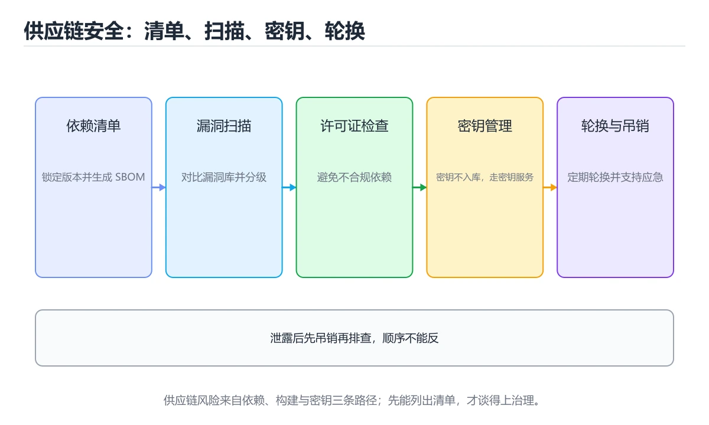
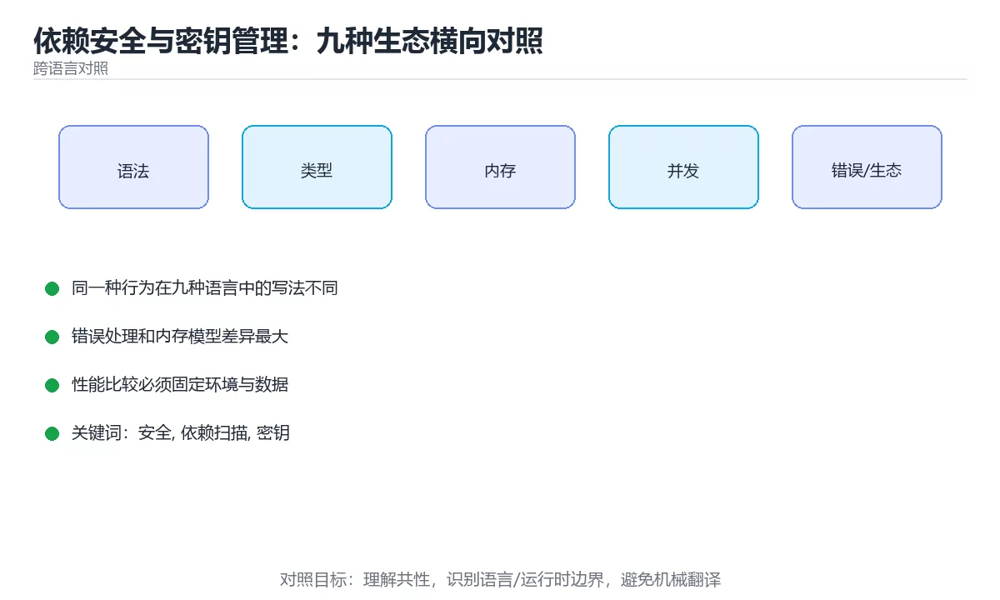

# 依赖安全与密钥管理：九种生态横向对照





> 内容更新时间：2026-10-03 · 学习阶段：进阶 · 预计用时：18 分钟

## 学习目标

- 能用自己的话解释「依赖安全与密钥管理：九种生态横向对照」解决了什么问题，而不是只背术语。
- 能说清 「安全」、「依赖扫描」、「密钥」、「供应链」 之间的关系，并分别举出一个例子。
- 能把本课知识放回「跨语言对照」的知识体系，说明它和相邻主题的边界。
- 能完成本课练习，并用验收标准检查自己的结果。

> 一句话摘要：各生态依赖扫描工具、供应链四类风险、密钥泄露处置顺序。

## 前置知识

- 先完成上一课《CI 流水线配置：九种生态横向对照》；如果已经掌握，可以直接用本课练习自测。
- 本课阶段：进阶。建议先掌握同一分类的基础课程，并能独立运行正文中的最小示例。
- 开始前先复习：安全、依赖扫描、密钥。
- 如果某一步看不懂，先记录具体卡点，完成练习后再回头读一遍。


## 一句话说清

供应链安全只做三件事：**及时知道依赖有漏洞、密钥不进代码、输入永远不可信**。
各生态的工具不同，但检查点完全一致。

## 各生态的依赖扫描工具

| 语言 | 依赖漏洞扫描 | 锁文件 | 密钥扫描 |
| --- | --- | --- | --- |
| Python | `pip-audit` / `safety` | `requirements.lock` / `uv.lock` | gitleaks / trufflehog |
| JavaScript | `npm audit` | `package-lock.json` | 同上 |
| TypeScript | `npm audit` | 同上 | 同上 |
| Java | OWASP Dependency-Check | 无（用 `dependencyManagement` 统一） | 同上 |
| C# | `dotnet list package --vulnerable` | `packages.lock.json` | 同上 |
| C++ | vcpkg 或 Conan 审计 | vcpkg baseline | 同上 |
| Go | `govulncheck` | `go.sum` | 同上 |
| Rust | `cargo audit` | `Cargo.lock` | 同上 |
| Shell | 无（依赖系统包） | 无 | 同上 |

```bash
# 各生态的最小命令集
pip-audit                              # Python
npm audit --audit-level=high           # JavaScript / TypeScript
mvn org.owasp:dependency-check-maven:check   # Java
dotnet list package --vulnerable       # C#
govulncheck ./...                      # Go
cargo audit                            # Rust
gitleaks detect --no-banner            # 通用密钥扫描
```

## 供应链风险的四种来源

```text
① 直接依赖有已知漏洞
   你在 package.json 里写的那一个

② 间接依赖（传递依赖）有漏洞
   你依赖的库又依赖了有问题的库 —— 最容易被忽略

③ 依赖被劫持或抢注
   包名相似（typosquatting）、维护者账号被盗

④ 构建链被污染
   镜像、脚本、CI 插件来源不可信
```

| 风险 | 防护手段 |
| --- | --- |
| 已知漏洞 | 定期扫描，高危设为 CI 门禁 |
| 传递依赖 | 扫描工具会覆盖，注意修复路径 |
| 抢注与劫持 | 固定版本、校验哈希、审查新增依赖 |
| 构建链污染 | 固定基础镜像版本、锁定 Action 版本 |

## 一张图看懂密钥管理

```text
❌ 错误做法                        ✅ 正确做法
─────────────────────────       ─────────────────────────
密钥写进代码                      代码只读环境变量
提交 .env 到仓库                  密钥存密钥管理服务
写进 Dockerfile                   构建时注入或运行时挂载
打印到日志                        脱敏后输出
所有环境共用一把                  按环境隔离，最小权限
从不轮换                          定期轮换 + 离职即吊销
```

```bash
# GitHub Actions：通过 Secrets 注入
env:
  DATABASE_URL: ${{ secrets.DATABASE_URL }}
  JWT_SECRET: ${{ secrets.JWT_SECRET }}

# 启动时校验，缺失立即失败
: "${DATABASE_URL:?缺少 DATABASE_URL}"
```

```python
# Python：启动时集中校验
import os

def require(name: str) -> str:
    value = os.environ.get(name)
    if not value:
        raise RuntimeError(f"缺少环境变量 {name}")
    return value

DATABASE_URL = require("DATABASE_URL")
```

```typescript
// TypeScript：用 zod 校验环境变量
import { z } from "zod";

const Env = z.object({
  DATABASE_URL: z.string().url(),
  JWT_SECRET: z.string().min(32),
});
export const env = Env.parse(process.env);
```

```go
// Go：启动即校验配置
func LoadConfig() (Config, error) {
    cfg := Config{
        DatabaseURL: os.Getenv("DATABASE_URL"),
        JWTSecret:   os.Getenv("JWT_SECRET"),
    }
    if cfg.DatabaseURL == "" {
        return cfg, errors.New("缺少 DATABASE_URL")
    }
    if len(cfg.JWTSecret) < 32 {
        return cfg, errors.New("JWT_SECRET 至少 32 个字符")
    }
    return cfg, nil
}
```

## 密钥泄露后的处置顺序

```text
1. 立即吊销并轮换（不要先想着删历史）
2. 评估影响面：这把密钥能访问什么
3. 排查使用痕迹与异常调用
4. 清理 Git 历史（filter-repo 或 BFG）
5. 加密钥扫描门禁，防止再犯
6. 补充监控告警（异常调用、用量突增）
```

**顺序很重要**：先轮换再清理历史，否则在被利用期间仍然有效。

## 输入校验：所有语言的共同底线

```text
永远不要相信这些输入
  · 用户表单与查询参数
  · 第三方接口返回
  · 消息队列里的消息
  · 配置文件与命令行参数
  · 文件名与路径
```

| 风险 | 防护 |
| --- | --- |
| SQL 注入 | 参数化查询，永不拼 SQL |
| 命令注入 | 参数数组传参，避免 shell 拼接 |
| 路径穿越 | 规范化后校验前缀 |
| XSS | 按输出上下文转义，配 CSP |
| 反序列化漏洞 | 校验 schema，禁用不安全反序列化 |

## 新手最容易踩的八个坑

| 坑 | 现象 | 正确做法 |
| --- | --- | --- |
| 只扫直接依赖 | 传递依赖漏洞漏掉 | 用覆盖全量依赖的扫描器 |
| 扫描告警无人处理 | 漏洞长期存在 | 高危设为 CI 门禁 |
| 密钥提交后才删 | 历史里仍在 | 立即轮换并清理历史 |
| 所有环境共用密钥 | 一处泄露全受影响 | 按环境隔离 |
| 日志打印完整令牌 | 泄露 | 脱敏输出 |
| 依赖不固定版本 | 上游发新版即被影响 | 固定版本并提交锁文件 |
| 盲目引入新依赖 | 供应链风险扩大 | 评估维护状态与体积 |
| 基础镜像用 latest | 构建不可复现 | 固定到精确版本 |

## 本课小结
- 供应链安全三件事：**扫依赖、护密钥、校验输入**。
- 密钥泄露的处置顺序是**先轮换、再清理、后加固**。
- 高危漏洞与密钥扫描应当成为 CI 门禁，而不是建议。

## 动手练习


> 本课练习重点：围绕「安全、依赖扫描、密钥」完成复述、实验和交付，每个结果都要能被别人检查。

用两种语言实现同一行为，再对比语法、错误、性能和生态差异。

### 练习 1：建立心智模型（10 分钟）

合上教程，用 3～5 句话回答：

1. 「依赖安全与密钥管理：九种生态横向对照」解决了什么问题？
2. 如果没有它，会出现什么具体后果？
3. 它和「依赖扫描」是什么关系？

**验收标准**：至少出现一个本课关键词，并写出一个反例、边界条件或失效场景。

### 练习 2：做一次可控实验（20 分钟）

从正文中选一个最小示例，完成以下操作：

1. 先预测修改一个参数、输入或步骤后的结果。
2. 再实际执行或逐步推演，记录真实结果。
3. 如果结果与预测不同，写出差异原因。

**验收标准**：留下「原例 → 改动 → 预测 → 结果 → 原因」五步记录。

### 练习 3：交付一个小结果（30 分钟）

选两种语言实现同一行为，列出语法、错误处理、性能和生态差异。

任务要求：

- 结果必须能被别人检查，不能只写“我已经理解了”。
- 至少覆盖「安全」和「依赖扫描」两个关键词。
- 写出 1 个仍然不确定的问题，以及下一步如何验证。

> 提示：时间有限时优先做练习 1 和练习 2；练习 3 可以拆成两次完成。


## 可运行练习

下面 3 个任务围绕“依赖安全与密钥管理：九种生态横向对照”展开，代码可以直接粘贴到 App 的离线沙箱里运行；如果示例会读取标准输入，请按代码注释在沙箱的 stdin 区域填入同样格式的数据。

### 任务 1：先跑通，再解释

```python
# Python：启动时集中校验
import os

def require(name: str) -> str:
    value = os.environ.get(name)
    if not value:
        raise RuntimeError(f"缺少环境变量 {name}")
    return value

DATABASE_URL = require("DATABASE_URL")
```

**预期输出**：运行后会输出与“依赖安全与密钥管理：九种生态横向对照”相关的关键结果；请重点核对输出行数、最后一个数值和异常提示。

**验收标准**：代码能正常运行；逐行解释每个变量的值如何变化，并指出哪一行决定了最终结果。

### 任务 2：只改一个条件

复制上面的代码，只修改一个输入、边界或参数（例如空值、最大值、循环次数、过滤条件），先写出你的预测，再实际运行。

**验收标准**：留下“原结果 → 改动 → 预测 → 实际结果 → 差异原因”五步记录；如果预测错误，要写出修正后的心智模型。

### 任务 3：迁移到自己的数据

用同一套思路处理一组你自己的数据或场景，保持输出格式与任务 1 一致。

**验收标准**：代码不少于 10 行，至少包含 1 个边界检查；把代码和运行结果保存到笔记或片段库。


## 故障现场

这一节把“依赖安全与密钥管理：九种生态横向对照”最常见的失败方式还原成现场记录，练习时按“症状 → 复现 → 定位 → 修复 → 预防”的顺序排查。

### 现场 1：“依赖安全与密钥管理：九种生态横向对照”的 安全 常规用例通过，但边界用例失败

**症状**：在“依赖安全与密钥管理：九种生态横向对照”的练习或生产场景里出现““依赖安全与密钥管理：九种生态横向对照”的 安全 常规用例通过，但边界用例失败”。

**复现**：准备一组最小输入，只保留触发““依赖安全与密钥管理：九种生态横向对照”的 安全 常规用例通过，但边界用例失败”的必要条件，连续运行两次确认结果稳定。

**定位**：围绕“安全 的前置条件与取值边界没有写进代码，默认值掩盖了空值和极值”检查调用链、输入数据和环境配置，先验证假设再改代码。

**修复**：为“依赖安全与密钥管理：九种生态横向对照”补一条空值或极值用例，把前置条件写成断言，并让失败信息直接指出是哪个输入越界

**预防**：把““依赖安全与密钥管理：九种生态横向对照”的 安全 常规用例通过，但边界用例失败”写成一条自动化用例，并在“依赖安全与密钥管理：九种生态横向对照”的验收清单里保留对应检查项。


### 现场 2：“依赖安全与密钥管理：九种生态横向对照”的 依赖扫描 结果在两次运行之间不一致

**症状**：在“依赖安全与密钥管理：九种生态横向对照”的练习或生产场景里出现““依赖安全与密钥管理：九种生态横向对照”的 依赖扫描 结果在两次运行之间不一致”。

**复现**：准备一组最小输入，只保留触发““依赖安全与密钥管理：九种生态横向对照”的 依赖扫描 结果在两次运行之间不一致”的必要条件，连续运行两次确认结果稳定。

**定位**：围绕“依赖扫描 依赖了当前版本、执行顺序或共享状态，单次运行无法暴露差异”检查调用链、输入数据和环境配置，先验证假设再改代码。

**修复**：固定“依赖安全与密钥管理：九种生态横向对照”使用的版本与随机种子，记录两次运行的完整输入和输出，再逐项消除非确定性来源

**预防**：把““依赖安全与密钥管理：九种生态横向对照”的 依赖扫描 结果在两次运行之间不一致”写成一条自动化用例，并在“依赖安全与密钥管理：九种生态横向对照”的验收清单里保留对应检查项。


### 现场 3：“依赖安全与密钥管理：九种生态横向对照”的验证只在开发机通过

**症状**：在“依赖安全与密钥管理：九种生态横向对照”的练习或生产场景里出现““依赖安全与密钥管理：九种生态横向对照”的验证只在开发机通过”。

**复现**：准备一组最小输入，只保留触发““依赖安全与密钥管理：九种生态横向对照”的验证只在开发机通过”的必要条件，连续运行两次确认结果稳定。

**定位**：围绕“环境版本、配置和输入规模与目标环境不同，安全 缺少可重复的验证记录”检查调用链、输入数据和环境配置，先验证假设再改代码。

**修复**：把“依赖安全与密钥管理：九种生态横向对照”的运行环境、输入样本和预期输出写成清单，并在另一套环境复跑同一条命令

**预防**：把““依赖安全与密钥管理：九种生态横向对照”的验证只在开发机通过”写成一条自动化用例，并在“依赖安全与密钥管理：九种生态横向对照”的验收清单里保留对应检查项。


## 深入补充：依赖安全与密钥管理：九种生态横向对照 的取舍与边界

### 一、把概念放回真实约束

学习“依赖安全与密钥管理：九种生态横向对照”时，最容易只记住结论而忽略前提。先写出三个约束：数据规模、时间预算、可接受的失败方式；再判断 安全 与 依赖扫描 在这些约束下是否仍然成立。只要约束改变，原来的最优解就可能变成错误解。

| 维度 | 安全 的典型写法 | 另一种语言的等价写法 | 迁移时最易踩的坑 |
| --- | --- | --- | --- |
| 错误处理 | 显式返回或抛出 | 异常或结果类型 | 错误被静默吞掉 |
| 并发模型 | 线程、协程或事件循环 | 运行时调度不同 | 共享状态与取消语义 |
| 依赖管理 | 官方包管理器 | 生态与锁文件不同 | 版本解析结果不一致 |

### 二、三个容易混淆的边界

1. **把“能跑”当成“正确”**：依赖安全与密钥管理：九种生态横向对照 的示例通过，只说明这条输入路径可用；还要用空值、极值和并发路径验证。
2. **把“平均值”当成“全部”**：安全 的指标好看，不代表尾部请求、冷启动或失败重试也好看。
3. **把“当前版本”当成“永久行为”**：依赖扫描 依赖的默认值、API 或性能特征都可能随版本变化，需要固定版本并保留回归用例。

### 三、一个生产场景

假设团队要在真实系统里使用“依赖安全与密钥管理：九种生态横向对照”：第一周先做小流量验证，记录 安全 的基线与异常；第二周扩大输入规模，观察 依赖扫描 是否成为瓶颈；第三周再做故障演练，主动注入超时、重复请求和依赖不可用，确认系统能降级、能重试、能恢复。每一步都要留下指标、日志和结论，而不是只留下“感觉更快了”。

### 四、自测清单

- 能否用一句话说出“依赖安全与密钥管理：九种生态横向对照”解决的核心问题与不适用场景？
- 能否画出 安全 的数据流或状态变化，并标出失败路径？
- 能否给出一个反例，证明某个看似合理的结论在边界条件下不成立？
- 能否写出一条可复现的验证命令，让别人独立得到相同结论？

### 五、跨语言迁移清单

在“依赖安全与密钥管理：九种生态横向对照”的迁移练习里，先列出 安全 在两种语言中的类型、错误处理、并发模型和内存管理差异；再用同一个输入各写一版最小实现，比较编译或运行时的错误信息。最后记录 依赖扫描 在两种语言里的性能与可读性差异，避免只凭语法熟悉度做选型。


## 考点精讲：把测验题还原成判断过程

本课有 5 个判断点。先自己作答，再看「判断依据」；如果结论正确但理由不完整，回到正文对应章节补足概念。

### 考点 1：发现密钥被提交到 Git 仓库后，第一步应该做什么？

- **正确判断**：立刻吊销并轮换密钥
- **判断依据**：正确答案是「立刻吊销并轮换密钥」，本课在「一句话说清」中说明：供应链安全只做三件事：及时知道依赖有漏洞、密钥不进代码、输入永远不可信。只要密钥还有效，泄露就可能被利用，必须优先让它失效。本课还在「本课小结」中说明：供应链安全三件事：扫依赖、护密钥、校验输入。本课还在「本课小结」中说明：高危漏洞与密钥扫描应当成为 CI 门禁，而不是建议。
- **迁移检查**：把题干里的一个条件换成边界值，原来的结论还成立吗？写出判断过程。

### 考点 2：供应链风险中，最容易被忽略的是？

- **正确判断**：间接依赖（传递依赖）中的已知漏洞
- **判断依据**：正确答案是「间接依赖（传递依赖）中的已知漏洞」，本课在「一句话说清」中说明：供应链安全只做三件事：及时知道依赖有漏洞、密钥不进代码、输入永远不可信。传递依赖不由你直接声明，容易被漏扫。本课还在「本课小结」中说明：供应链安全三件事：扫依赖、护密钥、校验输入。本课还在「本课小结」中说明：高危漏洞与密钥扫描应当成为 CI 门禁，而不是建议。
- **迁移检查**：如果给某个错误选项去掉一个限定词，它会不会变成正确？说明理由。

### 考点 3：关于密钥管理，下面哪种做法是正确的？

- **正确判断**：代码只读环境变量
- **判断依据**：正确答案是「代码只读环境变量」，本课在「本课小结」中说明：密钥泄露的处置顺序是先轮换、再清理、后加固。密钥外置加最小权限是标准实践。本课还在「密钥泄露后的处置顺序」中说明：顺序很重要：先轮换再清理历史，否则在被利用期间仍然有效。本课示例中还能看到 `密钥写进代码 代码只读环境变量` 这样的用法，说明该关键字在本课代码中承担实际功能。
- **迁移检查**：如果给某个错误选项去掉一个限定词，它会不会变成正确？说明理由。

### 考点 4：防止 SQL 注入最根本的做法是？

- **正确判断**：使用参数化查询
- **判断依据**：正确答案是「使用参数化查询」，这道题在问防止SQL注入最根本的做法是，判断时要把题干限定的输入、边界与目标逐项对齐。参数化查询从机制上消除注入可能。课程摘要指出各生态依赖扫描工具，供应链四类风险，密钥泄露处置顺序，本课要判断的正是防止SQL注入最根本的做法是。
- **迁移检查**：如果给某个错误选项去掉一个限定词，它会不会变成正确？说明理由。

### 考点 5：补全代码：「依赖安全与密钥管理：九种生态横向对照」示例中，下面这行代码缺少哪个关键字或函数名？请填入 ____。 `npm audit --audit-level=high # ____ / TypeScript`

- **正确判断**：JavaScript / javascript
- **判断依据**：正确答案是「JavaScript」，这道题在问补全代码：依赖安全与密钥管理：九种生态横向对照示例中…igh#____/TypeScript`，判断时要把题干限定的输入、边界与目标逐项对齐。本课示例中还能看到 `npm audit --audit-level=high # JavaScript / TypeScript` 这样的用法，说明该关键字在本课代码中承担实际功能。
- **迁移检查**：把答案换成另一种等价写法，是否仍然正确？说明依据。

### 补充自测（2 题）

1. 围绕“依赖安全与密钥管理：九种生态横向对照”中的 安全、依赖扫描、密钥，下列哪两项是本课强调的实践判断？
2. 下面这段 Python 代码复现了“依赖安全与密钥管理：九种生态横向对照”中 安全、依赖扫描、密钥 相关的一个常见故障，哪一项最准确地解释了问题？

这些题按“先定位概念、再排除边界错误、最后核对答案”的顺序作答；每题解析都给出了判断依据。


## 本课复习清单

离开本课前，逐项确认：

- [ ] 不看解析，能说出「发现密钥被提交到 Git 仓库后，第一步应该做什么？」的判断依据。
- [ ] 不看解析，能说出「供应链风险中，最容易被忽略的是？」的判断依据。
- [ ] 不看解析，能说出「关于密钥管理，下面哪种做法是正确的？」的判断依据。
- [ ] 不看解析，能说出「防止 SQL 注入最根本的做法是？」的判断依据。
- [ ] 不看解析，能说出「补全代码：「依赖安全与密钥管理：九种生态横向对照」示例中，下面这行代码缺少哪个关…」的判断依据。
- [ ] 至少运行一次本课示例，记录输入、输出和一个边界情况。
- [ ] 把本课最容易混淆的两个概念写成一句话对照。

| 复盘项 | 记录 |
| --- | --- |
| 已经能独立解释的考点 |  |
| 仍然说不清的概念 |  |
| 下一步验证动作 |  |

## 术语速查

把本课反复出现的术语集中放在一起。复习时先遮住右列，尝试用自己的话解释，再回到正文核对。

| 术语 | 本课语境 |
| --- | --- |
| `pip-audit` | \| Python \| `pip-audit` / `safety` \| `requirements.lock` / `uv.lock` \| gitleaks / trufflehog \| |
| `safety` | \| Python \| `pip-audit` / `safety` \| `requirements.lock` / `uv.lock` \| gitleaks / trufflehog \| |
| `requirements.lock` | \| Python \| `pip-audit` / `safety` \| `requirements.lock` / `uv.lock` \| gitleaks / trufflehog \| |
| `uv.lock` | \| Python \| `pip-audit` / `safety` \| `requirements.lock` / `uv.lock` \| gitleaks / trufflehog \| |
| `npm audit` | \| JavaScript \| `npm audit` \| `package-lock.json` \| 同上 \| |
| `package-lock.json` | \| JavaScript \| `npm audit` \| `package-lock.json` \| 同上 \| |
| `dependencyManagement` | \| Java \| OWASP Dependency-Check \| 无（用 `dependencyManagement` 统一） \| 同上 \| |
| `dotnet list package --vulnerable` | \| C# \| `dotnet list package --vulnerable` \| `packages.lock.json` \| 同上 \| |
| `packages.lock.json` | \| C# \| `dotnet list package --vulnerable` \| `packages.lock.json` \| 同上 \| |
| `govulncheck` | \| Go \| `govulncheck` \| `go.sum` \| 同上 \| |
| `go.sum` | \| Go \| `govulncheck` \| `go.sum` \| 同上 \| |
| `cargo audit` | \| Rust \| `cargo audit` \| `Cargo.lock` \| 同上 \| |

## 面试问答与自测

下面把本课考点换成面试追问。先口述自己的答案，
再对照参考回答检查是否遗漏了前提、边界或失败路径。

### 追问 1：发现密钥被提交到 Git 仓库后，第一步应该做什么？

**参考回答**：正确答案是「立刻吊销并轮换密钥」，本课在「一句话说清」中说明：供应链安全只做三件事：及时知道依赖有漏洞、密钥不进代码、输入永远不可信。只要密钥还有效，泄露就可能被利用，必须优先让它失效。本课还在「本课小结」中说明：供应链安全三件事：扫依赖、护密钥、校验输入。本课还在「本课小结」中说明：高危漏洞与密钥扫描应当成为 CI 门禁，而不是建议。

### 追问 2：供应链风险中，最容易被忽略的是？

**参考回答**：正确答案是「间接依赖（传递依赖）中的已知漏洞」，本课在「一句话说清」中说明：供应链安全只做三件事：及时知道依赖有漏洞、密钥不进代码、输入永远不可信。传递依赖不由你直接声明，容易被漏扫。本课还在「本课小结」中说明：供应链安全三件事：扫依赖、护密钥、校验输入。本课还在「本课小结」中说明：高危漏洞与密钥扫描应当成为 CI 门禁，而不是建议。

### 追问 3：关于密钥管理，下面哪种做法是正确的？

**参考回答**：正确答案是「代码只读环境变量」，本课在「本课小结」中说明：密钥泄露的处置顺序是先轮换、再清理、后加固。密钥外置加最小权限是标准实践。本课还在「密钥泄露后的处置顺序」中说明：顺序很重要：先轮换再清理历史，否则在被利用期间仍然有效。本课示例中还能看到 `密钥写进代码 代码只读环境变量` 这样的用法，说明该关键字在本课代码中承担实际功能。

### 追问 4：防止 SQL 注入最根本的做法是？

**参考回答**：正确答案是「使用参数化查询」，这道题在问防止SQL注入最根本的做法是，判断时要把题干限定的输入、边界与目标逐项对齐。参数化查询从机制上消除注入可能。课程摘要指出各生态依赖扫描工具，供应链四类风险，密钥泄露处置顺序，本课要判断的正是防止SQL注入最根本的做法是。

### 追问 5：补全代码：「依赖安全与密钥管理：九种生态横向对照」示例中，下面这行代码缺少哪个关键字或函数名？请填入 ____。 `npm audit --audit-level=high # ____ / TypeScript`

**参考回答**：正确答案是「JavaScript」，这道题在问补全代码：依赖安全与密钥管理：九种生态横向对照示例中…igh#____/TypeScript`，判断时要把题干限定的输入、边界与目标逐项对齐。本课示例中还能看到 `npm audit --audit-level=high # JavaScript / TypeScript` 这样的用法，说明该关键字在本课代码中承担实际功能。

## English Overview

**Title:** Dependency and Secret Security

**Summary:** Scanning tools, supply-chain risks and secret rotation order.

**Category:** Cross-Language Comparison  
**Level:** 进阶  
**Key terms:** 安全, 依赖扫描, 密钥, 供应链, 轮换

> The full tutorial is written in Chinese. This bilingual overview helps English readers identify the topic, scope and key terms before studying the detailed examples.

## 内容元数据

- 内容版本：v2.0
- 最后更新：2026-10-03
- 学习阶段：进阶
- 适用环境：九种主流语言生态横向对照
- 内容来源：内置结构化课程与工程实践整理
- 相关主题：安全、依赖扫描、密钥、供应链、轮换
- 质量版本：P0 测验标准 + P1 覆盖扩展 + P2 体验补全


## 参考资料与复核

- 最后复核：2026-10-04
- 下次复核：2027-04-04
- 复核范围：版本兼容、API 行为、安全建议与工程实践
- 来源性质：官方文档与标准；本课正文为离线教学重组，不复制原文

| 参考资料 | 本课用途 |
| --- | --- |
| [DevDocs](https://devdocs.io/) | 多语言 API 快速检索 |
| [官方语言文档](https://developer.mozilla.org/docs/Web) | 跨语言语义对照 |

> 本课主题：各生态依赖扫描工具、供应链四类风险、密钥泄露处置顺序。

> App 完全离线展示文字链接，不会自动联网；需要延伸阅读时可复制链接到浏览器。
