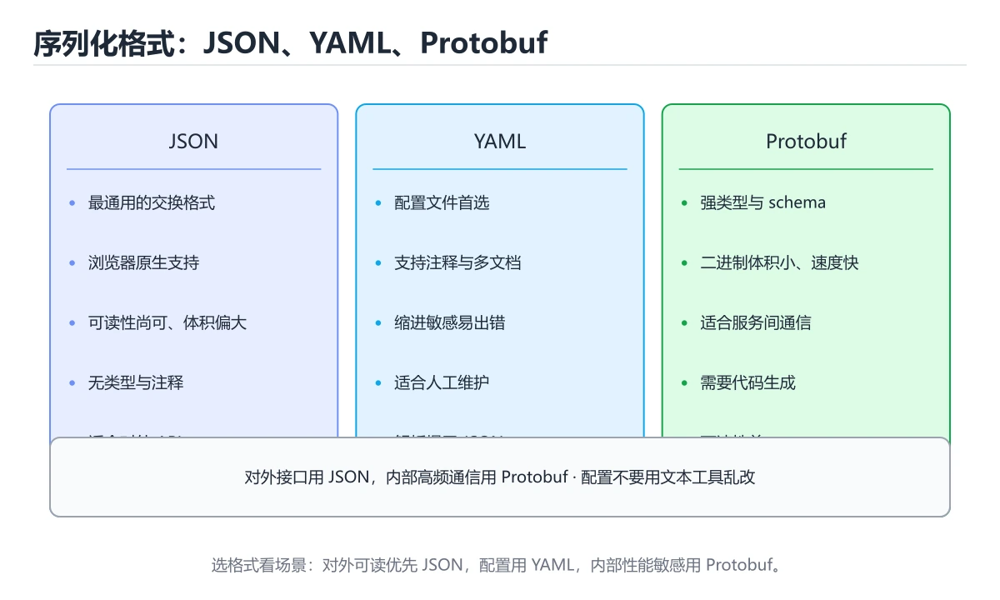
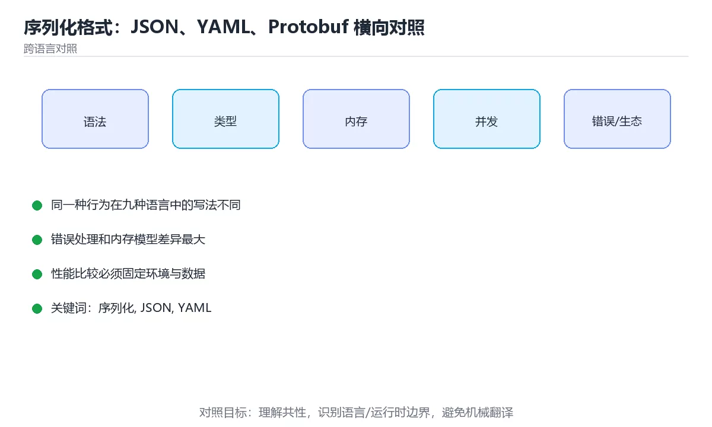

# 序列化格式：JSON、YAML、Protobuf 横向对照





> 内容更新时间：2026-10-03 · 学习阶段：进阶 · 预计用时：18 分钟

## 学习目标

- 能用自己的话解释「序列化格式：JSON、YAML、Protobuf 横向对照」解决了什么问题，而不是只背术语。
- 能说清 「序列化」、「JSON」、「YAML」、「Protobuf」 之间的关系，并分别举出一个例子。
- 能把本课知识放回「跨语言对照」的知识体系，说明它和相邻主题的边界。
- 能完成本课练习，并用验收标准检查自己的结果。

> 一句话摘要：四种格式对比、各语言写法、大整数与兼容性规则。

## 前置知识

- 先完成上一课《时间与时区：九种语言横向对照》；如果已经掌握，可以直接用本课练习自测。
- 本课阶段：进阶。建议先掌握同一分类的基础课程，并能独立运行正文中的最小示例。
- 开始前先复习：序列化、JSON、YAML。
- 如果某一步看不懂，先记录具体卡点，完成练习后再回头读一遍。


## 一句话说清

序列化解决「把内存里的数据变成可传输、可存储的字节」。
选格式只需回答三个问题：**给谁看、体积要求、是否强类型**。

## 四种主流格式对比

| 维度 | JSON | YAML | Protobuf | MessagePack |
| --- | --- | --- | --- | --- |
| 可读性 | 好 | 最好 | 差（二进制） | 差（二进制） |
| 体积 | 中 | 大 | **小** | 较小 |
| 解析速度 | 中 | 慢 | **快** | 快 |
| 强类型 | 否 | 否 | **是（schema）** | 否 |
| 支持注释 | 否 | 是 | 是（源码里） | 否 |
| 浏览器支持 | 原生 | 需库 | 需库 | 需库 |
| 典型用途 | API、配置 | 配置文件 | 服务间通信 | 缓存、消息 |

## JSON：最通用的交换格式

```json
{
  "id": 1,
  "name": "小明",
  "tags": ["a", "b"],
  "address": { "city": "上海" },
  "active": true,
  "score": null
}
```

| 规则 | 说明 |
| --- | --- |
| 键必须是字符串 | 且用双引号 |
| 值类型 | 对象、数组、字符串、数字、布尔、null |
| 不支持注释 | 需要注释就用 JSON5 或 YAML |
| 数字精度 | 大整数可能丢精度，需转字符串 |
| 无循环引用 | 有环的数据结构会报错 |

```text
JSON 的三个高频坑
  · 大整数超 2 的 53 次方时，JavaScript 会丢精度，改用字符串
  · 键顺序不保证（多数实现保留，但规范不要求）
  · 不支持 undefined、NaN、Infinity
```

## YAML：配置首选，但要小心缩进

```yaml
# 支持注释
server:
  host: 0.0.0.0
  port: 8080
features:
  - dark-mode
  - export
database:
  url: postgres://user:pass@db:5432/app
  pool: { min: 2, max: 10 }
```

| 优势 | 风险 |
| --- | --- |
| 可读性强，支持注释 | 缩进敏感，Tab 会报错 |
| 支持锚点与引用 | 类型推断诡异（裸写 `no` 会变成布尔） |
| 适合多层配置 | 复杂结构容易看错层级 |

```yaml
# 隐式类型的经典陷阱
country: NO          # 会被解析成布尔 false，不是字符串
version: 1.10        # 被解析成数字 1.1

# 正确写法
country: "NO"
version: "1.10"
```

## Protobuf：强类型加上小体积

```protobuf
syntax = "proto3";

message User {
  int64 id = 1;
  string name = 2;
  repeated string tags = 3;
  bool active = 4;
}
```

| 特性 | 说明 |
| --- | --- |
| 字段编号 | 发布后不可改；删除字段要用 `reserved` |
| 兼容性 | 新增字段向后兼容，改类型可能不兼容 |
| 体积 | 比 JSON 小 3 到 10 倍 |
| 可读性 | 需工具解码，不适合手工编辑 |
| 适用 | 服务间高频调用、移动端弱网 |

```text
兼容性规则
  可以：新增字段（用新编号）、删除字段并 reserved
  不可以：复用旧编号、改变已有字段的类型
```

## 各语言的序列化写法

```python
import json

with open("config.json", encoding="utf-8") as f:
    data = json.load(f)

with open("out.json", "w", encoding="utf-8") as f:
    json.dump(data, f, ensure_ascii=False, indent=2)

payload = {"id": str(1234567890123456789)}   # 大整数用字符串
```

```javascript
const data = JSON.parse(text);
const json = JSON.stringify(data, null, 2);
const big = JSON.parse('{"id":"1234567890123456789"}');   // 保持字符串
```

```java
import com.fasterxml.jackson.databind.ObjectMapper;

ObjectMapper mapper = new ObjectMapper();
User user = mapper.readValue(text, User.class);
String json = mapper.writerWithDefaultPrettyPrinter().writeValueAsString(user);

// @JsonIgnoreProperties(ignoreUnknown = true) 可避免上游加字段就崩
```

```csharp
using System.Text.Json;

var user = JsonSerializer.Deserialize<User>(text);
string json = JsonSerializer.Serialize(user, new JsonSerializerOptions
{
    WriteIndented = true,
    PropertyNamingPolicy = JsonNamingPolicy.CamelCase,
});
```

```go
import "encoding/json"

var user User
if err := json.Unmarshal(data, &user); err != nil {
    return fmt.Errorf("解析失败: %w", err)
}
out, err := json.Marshal(user)

// 严格模式：上游多传字段时直接报错
dec := json.NewDecoder(bytes.NewReader(data))
dec.DisallowUnknownFields()
err = dec.Decode(&user)
```

```rust
use serde::{Deserialize, Serialize};

#[derive(Serialize, Deserialize, Debug)]
struct User {
    id: u64,
    name: String,
    #[serde(default)]
    tags: Vec<String>,
}

let user: User = serde_json::from_str(text)?;
let json = serde_json::to_string_pretty(&user)?;
```

## 选择决策表

| 场景 | 推荐 |
| --- | --- |
| 对外 REST API | JSON |
| 配置文件 | YAML 或 TOML |
| 服务间高频通信 | Protobuf（gRPC） |
| 本地缓存 | MessagePack 或 Protobuf |
| 日志 | JSON（一行一条） |
| 数据导出给非技术人员 | CSV |

## 序列化的三条通用纪律

```text
1. 反序列化之后必须校验：格式正确不代表内容合法
2. 大整数用字符串传输，避免精度丢失
3. 兼容性优先：新增字段要有默认值，删除字段要保留编号
```

```typescript
// 类型断言不等于校验
const data = (await res.json()) as User;      // 危险

// 正确：解析后真的校验
const parsed = UserSchema.parse(await res.json());
```

## 新手最容易踩的八个坑

| 坑 | 现象 | 正确做法 |
| --- | --- | --- |
| 大整数用 JSON 数字 | 精度丢失 | 用字符串 |
| YAML 用 Tab 缩进 | 解析失败 | 统一空格 |
| YAML 裸写 NO 或 1.10 | 类型被隐式转换 | 加引号 |
| Protobuf 复用字段编号 | 线上数据错乱 | 用 `reserved` 保留 |
| 反序列化后不校验 | 脏数据进入业务 | 用 schema 校验 |
| 上游加字段就报错 | 兼容性差 | 忽略未知字段 |
| JSON 里塞注释 | 解析失败 | 改 JSON5 或 YAML |
| 用 JSON 传二进制 | 体积膨胀 | 用 base64 或二进制格式 |

## 本课小结
- **可读性优先选 JSON 或 YAML，性能与类型优先选 Protobuf**。
- 大整数与隐式类型是 JSON、YAML 最常见的两个坑。
- Protobuf 的生命线是**字段编号兼容性**，改之前先想清楚。

## 动手练习


> 本课练习重点：围绕「序列化、JSON、YAML」完成复述、实验和交付，每个结果都要能被别人检查。

用两种语言实现同一行为，再对比语法、错误、性能和生态差异。

### 练习 1：建立心智模型（10 分钟）

合上教程，用 3～5 句话回答：

1. 「序列化格式：JSON、YAML、Protobuf 横向对照」解决了什么问题？
2. 如果没有它，会出现什么具体后果？
3. 它和「JSON」是什么关系？

**验收标准**：至少出现一个本课关键词，并写出一个反例、边界条件或失效场景。

### 练习 2：做一次可控实验（20 分钟）

从正文中选一个最小示例，完成以下操作：

1. 先预测修改一个参数、输入或步骤后的结果。
2. 再实际执行或逐步推演，记录真实结果。
3. 如果结果与预测不同，写出差异原因。

**验收标准**：留下「原例 → 改动 → 预测 → 结果 → 原因」五步记录。

### 练习 3：交付一个小结果（30 分钟）

选两种语言实现同一行为，列出语法、错误处理、性能和生态差异。

任务要求：

- 结果必须能被别人检查，不能只写“我已经理解了”。
- 至少覆盖「序列化」和「JSON」两个关键词。
- 写出 1 个仍然不确定的问题，以及下一步如何验证。

> 提示：时间有限时优先做练习 1 和练习 2；练习 3 可以拆成两次完成。


## 考点精讲：把测验题还原成判断过程

本课有 5 个判断点。先自己作答，再看「判断依据」；如果结论正确但理由不完整，回到正文对应章节补足概念。

### 考点 1：服务间高频通信更推荐哪种格式，为什么？

- **正确判断**：Protobuf，因为体积小
- **判断依据**：正确答案是「Protobuf，因为体积小」，本课在「一句话说清」中说明：序列化解决「把内存里的数据变成可传输、可存储的字节」。Protobuf 在体积、速度与类型安全上都有优势，适合服务间通信。本课还在「本课小结」中说明：可读性优先选 JSON 或 YAML，性能与类型优先选 Protobuf。本课还在「本课小结」中说明：Protobuf 的生命线是字段编号兼容性，改之前先想清楚。
- **迁移检查**：遮住选项，只根据定义复述一次答案，再回来看哪个选项与复述一致。

### 考点 2：在 JavaScript 中处理超大整数 ID，正确做法是？

- **正确判断**：以字符串形式传输
- **判断依据**：正确答案是「以字符串形式传输」，本课在「本课小结」中说明：大整数与隐式类型是 JSON、YAML 最常见的两个坑。超过 2 的 53 次方后 JSON 数字会丢精度，字符串可完整保留。本课还在「一句话说清」中说明：序列化解决「把内存里的数据变成可传输、可存储的字节」。本课还在「本课小结」中说明：Protobuf 的生命线是字段编号兼容性，改之前先想清楚。
- **迁移检查**：遮住选项，只根据定义复述一次答案，再回来看哪个选项与复述一致。

### 考点 3：YAML 中裸写 no 会有什么问题？

- **正确判断**：被解析成布尔 false 而不是字符串
- **判断依据**：正确答案是「被解析成布尔 false 而不是字符串」，本课在「一句话说清」中说明：选格式只需回答三个问题：给谁看、体积要求、是否强类型。YAML 有隐式类型推断，no、yes、on、off 会被当成布尔值。课程摘要指出四种格式对比，各语言写法，大整数与兼容性规则，本课要判断的正是YAML中裸写no会有什么问题。
- **迁移检查**：如果给某个错误选项去掉一个限定词，它会不会变成正确？说明理由。

### 考点 4：Protobuf 中删除字段的正确做法是？

- **正确判断**：删除字段并用 reserved 保留编号
- **判断依据**：正确答案是「删除字段并用 reserved 保留编号」，这道题在问Protobuf中删除字段的正确做法是，判断时要把题干限定的输入、边界与目标逐项对齐。字段编号是兼容性的生命线，必须保留不复用。课程摘要指出四种格式对比，各语言写法，大整数与兼容性规则，本课要判断的正是Protobuf中删除字段的正确做法是。
- **迁移检查**：遮住选项，只根据定义复述一次答案，再回来看哪个选项与复述一致。

### 考点 5：补全代码：「序列化格式：JSON、YAML、Protobuf 横向对照」示例中，下面这行代码缺少哪个关键字或函数名？请填入 ____。 `· 大整数超 2 的 53 次方时，____ 会丢精度，改用字符串`

- **正确判断**：JavaScript / javascript
- **判断依据**：正确答案是「JavaScript」，本课在「本课小结」中说明：大整数与隐式类型是 JSON、YAML 最常见的两个坑。本课示例中还能看到 `· 大整数超 2 的 53 次方时，JavaScript 会丢精度，改用字符串` 这样的用法，说明该关键字在本课代码中承担实际功能。
- **迁移检查**：如果填成相近的另一个函数或关键字，程序会在哪一步出错？

## 本课复习清单

离开本课前，逐项确认：

- [ ] 不看解析，能说出「服务间高频通信更推荐哪种格式，为什么？」的判断依据。
- [ ] 不看解析，能说出「在 JavaScript 中处理超大整数 ID，正确做法是？」的判断依据。
- [ ] 不看解析，能说出「YAML 中裸写 no 会有什么问题？」的判断依据。
- [ ] 不看解析，能说出「Protobuf 中删除字段的正确做法是？」的判断依据。
- [ ] 不看解析，能说出「补全代码：「序列化格式：JSON、YAML、Protobuf 横向对照」示例中，…」的判断依据。
- [ ] 至少运行一次本课示例，记录输入、输出和一个边界情况。
- [ ] 把本课最容易混淆的两个概念写成一句话对照。

| 复盘项 | 记录 |
| --- | --- |
| 已经能独立解释的考点 |  |
| 仍然说不清的概念 |  |
| 下一步验证动作 |  |

## 术语速查

把本课反复出现的术语集中放在一起。复习时先遮住右列，尝试用自己的话解释，再回到正文核对。

| 术语 | 本课语境 |
| --- | --- |
| `no` | \| 支持锚点与引用 \| 类型推断诡异（裸写 `no` 会变成布尔） \| |
| `reserved` | \| 字段编号 \| 发布后不可改；删除字段要用 `reserved` \| |
| `序列化` | 本课围绕该主题展开，结合正文与代码示例理解它的适用边界。 |
| `JSON` | 本课围绕该主题展开，结合正文与代码示例理解它的适用边界。 |
| `YAML` | 本课围绕该主题展开，结合正文与代码示例理解它的适用边界。 |
| `Protobuf` | 本课围绕该主题展开，结合正文与代码示例理解它的适用边界。 |
| `兼容性` | 本课围绕该主题展开，结合正文与代码示例理解它的适用边界。 |

## 面试问答与自测

下面把本课考点换成面试追问。先口述自己的答案，
再对照参考回答检查是否遗漏了前提、边界或失败路径。

### 追问 1：服务间高频通信更推荐哪种格式，为什么？

**参考回答**：正确答案是「Protobuf，因为体积小」，本课在「一句话说清」中说明：序列化解决「把内存里的数据变成可传输、可存储的字节」。Protobuf 在体积、速度与类型安全上都有优势，适合服务间通信。本课还在「本课小结」中说明：可读性优先选 JSON 或 YAML，性能与类型优先选 Protobuf。本课还在「本课小结」中说明：Protobuf 的生命线是字段编号兼容性，改之前先想清楚。

### 追问 2：在 JavaScript 中处理超大整数 ID，正确做法是？

**参考回答**：正确答案是「以字符串形式传输」，本课在「本课小结」中说明：大整数与隐式类型是 JSON、YAML 最常见的两个坑。超过 2 的 53 次方后 JSON 数字会丢精度，字符串可完整保留。本课还在「一句话说清」中说明：序列化解决「把内存里的数据变成可传输、可存储的字节」。本课还在「本课小结」中说明：Protobuf 的生命线是字段编号兼容性，改之前先想清楚。

### 追问 3：YAML 中裸写 no 会有什么问题？

**参考回答**：正确答案是「被解析成布尔 false 而不是字符串」，本课在「一句话说清」中说明：选格式只需回答三个问题：给谁看、体积要求、是否强类型。YAML 有隐式类型推断，no、yes、on、off 会被当成布尔值。课程摘要指出四种格式对比，各语言写法，大整数与兼容性规则，本课要判断的正是YAML中裸写no会有什么问题。

### 追问 4：Protobuf 中删除字段的正确做法是？

**参考回答**：正确答案是「删除字段并用 reserved 保留编号」，这道题在问Protobuf中删除字段的正确做法是，判断时要把题干限定的输入、边界与目标逐项对齐。字段编号是兼容性的生命线，必须保留不复用。课程摘要指出四种格式对比，各语言写法，大整数与兼容性规则，本课要判断的正是Protobuf中删除字段的正确做法是。

### 追问 5：补全代码：「序列化格式：JSON、YAML、Protobuf 横向对照」示例中，下面这行代码缺少哪个关键字或函数名？请填入 ____。 `· 大整数超 2 的 53 次方时，____ 会丢精度，改用字符串`

**参考回答**：正确答案是「JavaScript」，本课在「本课小结」中说明：大整数与隐式类型是 JSON、YAML 最常见的两个坑。本课示例中还能看到 `· 大整数超 2 的 53 次方时，JavaScript 会丢精度，改用字符串` 这样的用法，说明该关键字在本课代码中承担实际功能。

## English Overview

**Title:** Serialization Formats

**Summary:** Format comparison, language snippets and compatibility rules.

**Category:** Cross-Language Comparison  
**Level:** 进阶  
**Key terms:** 序列化, JSON, YAML, Protobuf, 兼容性

> The full tutorial is written in Chinese. This bilingual overview helps English readers identify the topic, scope and key terms before studying the detailed examples.

## 内容元数据

- 内容版本：v2.0
- 最后更新：2026-10-03
- 学习阶段：进阶
- 适用环境：九种主流语言生态横向对照
- 内容来源：内置结构化课程与工程实践整理
- 相关主题：序列化、JSON、YAML、Protobuf、兼容性
- 质量版本：P0 测验标准 + P1 覆盖扩展 + P2 体验补全


## 参考资料与复核

- 最后复核：2026-10-04
- 下次复核：2027-04-04
- 复核范围：版本兼容、API 行为、安全建议与工程实践
- 来源性质：官方文档与标准；本课正文为离线教学重组，不复制原文

| 参考资料 | 本课用途 |
| --- | --- |
| [DevDocs](https://devdocs.io/) | 多语言 API 快速检索 |
| [官方语言文档](https://developer.mozilla.org/docs/Web) | 跨语言语义对照 |

> 本课主题：四种格式对比、各语言写法、大整数与兼容性规则。

> App 完全离线展示文字链接，不会自动联网；需要延伸阅读时可复制链接到浏览器。
