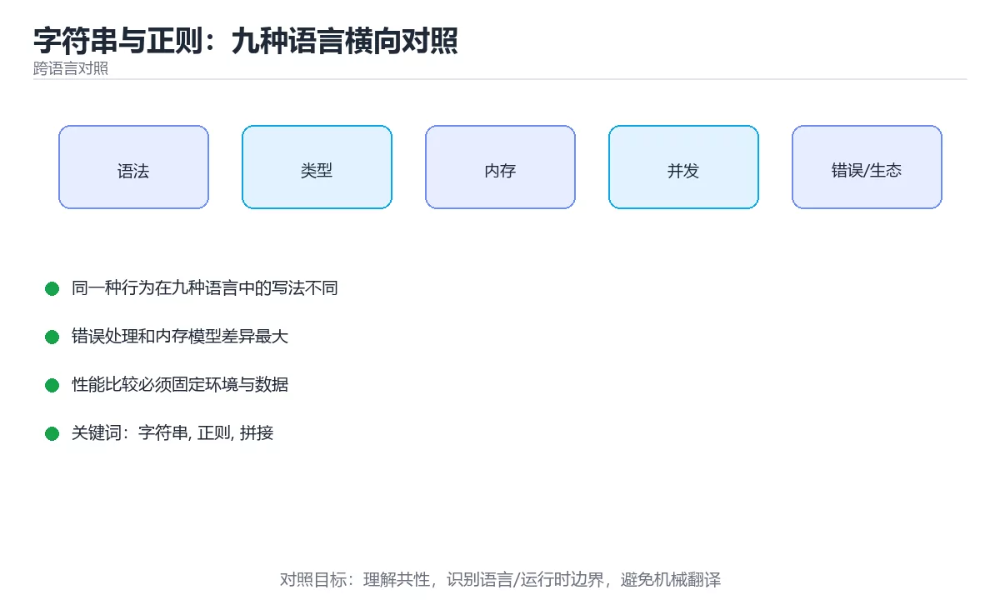

# 字符串与正则：九种语言横向对照



> 内容更新时间：2026-10-03 · 学习阶段：入门 · 预计用时：18 分钟

## 学习目标

- 能用自己的话解释「字符串与正则：九种语言横向对照」解决了什么问题，而不是只背术语。
- 能说清 「字符串」、「正则」、「拼接」、「编码」 之间的关系，并分别举出一个例子。
- 能把本课知识放回「跨语言对照」的知识体系，说明它和相邻主题的边界。
- 能完成本课练习，并用验收标准检查自己的结果。

> 一句话摘要：字符串可变性、四个基础操作、正则引擎差异与原始字符串写法。

## 前置知识

- 先完成上一课《命令行参数解析：九种语言横向对照》；如果已经掌握，可以直接用本课练习自测。
- 本课阶段：入门。只需要基本计算机操作，不要求编程经验。
- 开始前先复习：字符串、正则、拼接。
- 如果某一步看不懂，先记录具体卡点，完成练习后再回头读一遍。


## 一句话说清

字符串处理只有四类需求：**拼接、切分、替换、匹配**。
各语言的 API 名字不同，但「不可变 vs 可变」「正则语法差异」是两大共同坑点。

## 字符串可变性对照

| 语言 | 字符串可变 | 大量拼接的正确做法 |
| --- | --- | --- |
| Python | 不可变 | `"".join(parts)` |
| JavaScript | 不可变 | `parts.join("")` 或数组累积 |
| TypeScript | 不可变 | 同 JavaScript |
| Java | 不可变 | `StringBuilder` |
| C# | 不可变 | `StringBuilder` 或 `string.Join` |
| C++ | `std::string` 可变 | `+=` 或 `append`，注意预留容量 |
| Go | 不可变 | `strings.Builder` |
| Rust | 不可变 | `String::with_capacity` 加 `push_str` |
| Shell | 可变 | 变量拼接，大文本交给 `awk` |

```text
反例（多数语言里都很慢）
  for (item of items) result += item;      // 每次生成新字符串

正例
  收集到列表 → 一次 join
```

## 四个操作的写法对照

```python
text = "  Hello, World  "
text.strip()                       # 去首尾空白
text.lower().startswith("hello")   # 判断前缀
",".join(["a", "b"])               # 拼接
"a,b,c".split(",")                 # 切分
text.replace("World", "Python")    # 替换
```

```javascript
const text = "  Hello, World  ";
text.trim();
text.toLowerCase().startsWith("hello");
["a", "b"].join(",");
"a,b,c".split(",");
text.replace("World", "Python");        // 只替换第一处
text.replaceAll("l", "L");              // 替换全部
```

```java
String text = "  Hello, World  ";
text.strip();                           // Java 11+ 推荐
text.toLowerCase().startsWith("hello");
String.join(",", List.of("a", "b"));
"a,b,c".split(",");
text.replace("World", "Python");        // 全部替换
```

```csharp
var text = "  Hello, World  ";
text.Trim();
text.StartsWith("hello", StringComparison.OrdinalIgnoreCase);
string.Join(",", new[] { "a", "b" });
"a,b,c".Split(',');
text.Replace("World", "Python");
```

```go
import "strings"

text := "  Hello, World  "
strings.TrimSpace(text)
strings.HasPrefix(strings.ToLower(text), "hello")
strings.Join([]string{"a", "b"}, ",")
strings.Split("a,b,c", ",")
strings.ReplaceAll(text, "World", "Python")
```

```rust
let text = "  Hello, World  ";
text.trim();
text.to_lowercase().starts_with("hello");
["a", "b"].join(",");
"a,b,c".split(',').collect::<Vec<_>>();
text.replace("World", "Python");
```

```bash
text="  Hello, World  "
trimmed="$(echo "$text" | xargs)"          # 简单去空白
echo "${text,,}"                           # 转小写（bash 4+）
printf '%s\n' "a,b,c" | tr ',' '\n'        # 切分
echo "$text" | sed 's/World/Python/g'      # 替换
```

## 正则语法差异（重点）

| 需求 | 基础正则 | 扩展正则 | Perl 风格 |
| --- | --- | --- | --- |
| 一个或多个 | `a\+` | `a+` | `a+` |
| 数字 | `[0-9]` | `[0-9]` | `\d` |
| 单词字符 | `[A-Za-z0-9_]` | 同左 | `\w` |
| 非贪婪 | 不支持 | 部分支持 | `.*?` |
| 环视 | 不支持 | 不支持 | `(?=...)` |

```text
Python / JavaScript / Java / C#：使用各自的正则引擎
Go 的 regexp 与 Rust 的 regex 是 RE2 风格（不支持环视与反向引用）

Shell：
  grep                 → 基础正则
  grep -E / sed -E     → 扩展正则
  grep -P              → Perl 正则（GNU 专有）
```

```bash
# 从日志里提取用户 ID：三种写法
grep -oE 'user_id=[0-9]+' app.log          # 扩展正则
grep -oP '(?<=user_id=)\d+' app.log        # Perl 环视（GNU）
sed -E 's/.*user_id=([0-9]+).*/\1/' app.log
```

## 各语言的「原始字符串」写法

| 语言 | 原始字符串 | 说明 |
| --- | --- | --- |
| Python | `r"\d+"` | 推荐写正则时使用 |
| JavaScript | 无，需双反斜杠 | 或用 `String.raw` |
| Java | 无，需 `"\\d+"` | 反斜杠要转义 |
| C# | `@"\d+"` | 逐字字符串 |
| C++ | `R"(\d+)"` | 原始字符串字面量 |
| Go | 反引号包裹 | 不做转义解析 |
| Rust | `r"\d+"` | 原始字符串 |
| Shell | 单引号包裹 | 防止 shell 先展开 |

**写正则时优先用原始字符串**：少一层转义，少一半报错。

## 中文与编码的三个坑

```text
1. 长度不等于字节数：中文在 UTF-8 下通常占 3 字节
   别用字节长度做输入校验，要用字符数

2. 排序与比较：默认按码点，不等于拼音顺序
   需要本地化排序要用专门的排序库

3. 大小写转换：某些字符转换后长度会变化
   不要假设转换前后长度相同
```

```python
s = "中文"
print(len(s))            # 2（字符数）
print(len(s.encode()))   # 6（UTF-8 字节数）
```

## 新手最容易踩的八个坑

| 坑 | 现象 | 正确做法 |
| --- | --- | --- |
| 循环里拼接字符串 | 数据量大时极慢 | 用 Builder 或 join |
| 正则字符串没转义 | `\d` 变成普通字符 | 用原始字符串 |
| 用 `%` 或 `+` 拼 SQL | 注入风险 | 用参数化查询 |
| 以为 replace 替换全部 | 只换了一处 | 注意各语言语义差异 |
| 用字节长度校验中文 | 校验过严 | 用字符数 |
| split 结果含空串 | 首尾分隔符导致 | 过滤空串 |
| 大小写比较不归一化 | 判断失败 | 统一转换后再比较 |
| Shell 正则不加引号 | 被 shell 展开 | 正则一律加单引号 |

## 本课小结
- 字符串不可变的语言里，**拼接一定要用 Builder 或 join**。
- 正则的两大差异：**引擎语法**（是否支持 `\d`、环视）与**转义层级**（语言加 shell）。
- 处理中文时区分**字符数**与**字节数**。

## 动手练习


> 本课练习重点：围绕「字符串、正则、拼接」完成复述、实验和交付，每个结果都要能被别人检查。

用两种语言实现同一行为，再对比语法、错误、性能和生态差异。

### 练习 1：建立心智模型（10 分钟）

合上教程，用 3～5 句话回答：

1. 「字符串与正则：九种语言横向对照」解决了什么问题？
2. 如果没有它，会出现什么具体后果？
3. 它和「正则」是什么关系？

**验收标准**：至少出现一个本课关键词，并写出一个反例、边界条件或失效场景。

### 练习 2：做一次可控实验（20 分钟）

从正文中选一个最小示例，完成以下操作：

1. 先预测修改一个参数、输入或步骤后的结果。
2. 再实际执行或逐步推演，记录真实结果。
3. 如果结果与预测不同，写出差异原因。

**验收标准**：留下「原例 → 改动 → 预测 → 结果 → 原因」五步记录。

### 练习 3：交付一个小结果（30 分钟）

选两种语言实现同一行为，列出语法、错误处理、性能和生态差异。

任务要求：

- 结果必须能被别人检查，不能只写“我已经理解了”。
- 至少覆盖「字符串」和「正则」两个关键词。
- 写出 1 个仍然不确定的问题，以及下一步如何验证。

> 提示：时间有限时优先做练习 1 和练习 2；练习 3 可以拆成两次完成。


## 考点精讲：把测验题还原成判断过程

本课有 5 个判断点。先自己作答，再看「判断依据」；如果结论正确但理由不完整，回到正文对应章节补足概念。

### 考点 1：在 Java、Python、Go 这类字符串不可变的语言里，循环拼接字符串的推荐做法是？

- **正确判断**：收集到容器后用 Builder 或 join 一次生成
- **判断依据**：正确答案是「收集到容器后用 Builder 或 join 一次生成」，本课在「本课小结」中说明：字符串不可变的语言里，拼接一定要用 Builder 或 join。不可变字符串每次拼接都会产生新对象，累积后开销巨大。本课还在「各语言的「原始字符串」写法」中说明：写正则时优先用原始字符串：少一层转义，少一半报错。本课还在「一句话说清」中说明：各语言的 API 名字不同，但「不可变 vs 可变」「正则语法差异」是两大共同坑点。
- **迁移检查**：如果给某个错误选项去掉一个限定词，它会不会变成正确？说明理由。

### 考点 2：Go 与 Rust 的正则实现（RE2 风格）不支持下面哪项？

- **正确判断**：环视与反向引用
- **判断依据**：RE2 为了保证线性时间匹配，不支持环视与反向引用。「字符类 [0-9]」、「量词 + 与 」、「分组」都是它支持的基础能力。针对「Go 与 Rust 的正则实现（RE2 风格）不…」，本课在「各语言的「原始字符串」写法」中说明：写正则时优先用原始字符串：少一层转义，少一半报错。本课还在「一句话说清」中说明：字符串处理只有四类需求：拼接、切分、替换、匹配。本课还在「本课小结」中说明：正则的两大差异：引擎语法（是否支持 \d、环视）与转义层级（语言加 shell）。
- **迁移检查**：如果给某个错误选项去掉一个限定词，它会不会变成正确？说明理由。

### 考点 3：在 Python 里写正则时，为什么要加 r 前缀？

- **正确判断**：使用原始字符串
- **判断依据**：正确答案是「使用原始字符串」，本课在「一句话说清」中说明：字符串处理只有四类需求：拼接、切分、替换、匹配。原始字符串让反斜杠按字面传递，减少一层转义。本课还在「本课小结」中说明：字符串不可变的语言里，拼接一定要用 Builder 或 join。
- **迁移检查**：如果给某个错误选项去掉一个限定词，它会不会变成正确？说明理由。

### 考点 4：Python 中 len("中文") 与 len("中文".encode()) 的结果分别是？

- **正确判断**：2 与 6
- **判断依据**：正确答案是「2 与 6」，这道题在问Python中len("中文")与len("中文".encode())的结果分别是，判断时要把题干限定的输入、边界与目标逐项对齐。前者是字符数，后者是 UTF-8 字节数（每个汉字 3 字节）。课程摘要指出字符串可变性，四个基础操作，正则引擎差异与原始字符串写法，本课要判断的正是Python中len("中文")与len("中文".encode())的结果分别是。
- **迁移检查**：如果给某个错误选项去掉一个限定词，它会不会变成正确？说明理由。

### 考点 5：补全代码：「字符串与正则：九种语言横向对照」示例中，下面这行代码缺少哪个关键字或函数名？请填入 ____。 `text.____("World", "Python") # 替换`

- **正确判断**：replace
- **判断依据**：正确答案是「replace」，这道题在问补全代码：字符串与正则：九种语言横向对照示例中，下面…World","Python")#替换`，判断时要把题干限定的输入、边界与目标逐项对齐。本课示例中还能看到 `text.Replace("World", "Python");` 这样的用法，说明该关键字在本课代码中承担实际功能。
- **迁移检查**：把答案换成另一种等价写法，是否仍然正确？说明依据。

## 本课复习清单

离开本课前，逐项确认：

- [ ] 不看解析，能说出「在 Java、Python、Go 这类字符串不可变的语言里，循环拼接字符串的推荐…」的判断依据。
- [ ] 不看解析，能说出「Go 与 Rust 的正则实现（RE2 风格）不支持下面哪项？」的判断依据。
- [ ] 不看解析，能说出「在 Python 里写正则时，为什么要加 r 前缀？」的判断依据。
- [ ] 不看解析，能说出「Python 中 len("中文") 与 len("中文".encode()) …」的判断依据。
- [ ] 不看解析，能说出「补全代码：「字符串与正则：九种语言横向对照」示例中，下面这行代码缺少哪个关键字或…」的判断依据。
- [ ] 至少运行一次本课示例，记录输入、输出和一个边界情况。
- [ ] 把本课最容易混淆的两个概念写成一句话对照。

| 复盘项 | 记录 |
| --- | --- |
| 已经能独立解释的考点 |  |
| 仍然说不清的概念 |  |
| 下一步验证动作 |  |

## 术语速查

把本课反复出现的术语集中放在一起。复习时先遮住右列，尝试用自己的话解释，再回到正文核对。

| 术语 | 本课语境 |
| --- | --- |
| `"".join(parts)` | \| Python \| 不可变 \| `"".join(parts)` \| |
| `parts.join("")` | \| JavaScript \| 不可变 \| `parts.join("")` 或数组累积 \| |
| `StringBuilder` | \| Java \| 不可变 \| `StringBuilder` \| |
| `string.Join` | \| C# \| 不可变 \| `StringBuilder` 或 `string.Join` \| |
| `std::string` | \| C++ \| `std::string` 可变 \| `+=` 或 `append`，注意预留容量 \| |
| `+=` | \| C++ \| `std::string` 可变 \| `+=` 或 `append`，注意预留容量 \| |
| `append` | \| C++ \| `std::string` 可变 \| `+=` 或 `append`，注意预留容量 \| |
| `strings.Builder` | \| Go \| 不可变 \| `strings.Builder` \| |
| `String::with_capacity` | \| Rust \| 不可变 \| `String::with_capacity` 加 `push_str` \| |
| `push_str` | \| Rust \| 不可变 \| `String::with_capacity` 加 `push_str` \| |
| `awk` | \| Shell \| 可变 \| 变量拼接，大文本交给 `awk` \| |
| `a\+` | \| 一个或多个 \| `a\+` \| `a+` \| `a+` \| |

## 面试问答与自测

下面把本课考点换成面试追问。先口述自己的答案，
再对照参考回答检查是否遗漏了前提、边界或失败路径。

### 追问 1：在 Java、Python、Go 这类字符串不可变的语言里，循环拼接字符串的推荐做法是？

**参考回答**：正确答案是「收集到容器后用 Builder 或 join 一次生成」，本课在「本课小结」中说明：字符串不可变的语言里，拼接一定要用 Builder 或 join。不可变字符串每次拼接都会产生新对象，累积后开销巨大。本课还在「各语言的「原始字符串」写法」中说明：写正则时优先用原始字符串：少一层转义，少一半报错。本课还在「一句话说清」中说明：各语言的 API 名字不同，但「不可变 vs 可变」「正则语法差异」是两大共同坑点。

### 追问 2：Go 与 Rust 的正则实现（RE2 风格）不支持下面哪项？

**参考回答**：RE2 为了保证线性时间匹配，不支持环视与反向引用。「字符类 [0-9]」、「量词 + 与 」、「分组」都是它支持的基础能力。针对「Go 与 Rust 的正则实现（RE2 风格）不…」，本课在「各语言的「原始字符串」写法」中说明：写正则时优先用原始字符串：少一层转义，少一半报错。本课还在「一句话说清」中说明：字符串处理只有四类需求：拼接、切分、替换、匹配。本课还在「本课小结」中说明：正则的两大差异：引擎语法（是否支持 \d、环视）与转义层级（语言加 shell）。

### 追问 3：在 Python 里写正则时，为什么要加 r 前缀？

**参考回答**：正确答案是「使用原始字符串」，本课在「一句话说清」中说明：字符串处理只有四类需求：拼接、切分、替换、匹配。原始字符串让反斜杠按字面传递，减少一层转义。本课还在「本课小结」中说明：字符串不可变的语言里，拼接一定要用 Builder 或 join。

### 追问 4：Python 中 len("中文") 与 len("中文".encode()) 的结果分别是？

**参考回答**：正确答案是「2 与 6」，这道题在问Python中len("中文")与len("中文".encode())的结果分别是，判断时要把题干限定的输入、边界与目标逐项对齐。前者是字符数，后者是 UTF-8 字节数（每个汉字 3 字节）。课程摘要指出字符串可变性，四个基础操作，正则引擎差异与原始字符串写法，本课要判断的正是Python中len("中文")与len("中文".encode())的结果分别是。

### 追问 5：补全代码：「字符串与正则：九种语言横向对照」示例中，下面这行代码缺少哪个关键字或函数名？请填入 ____。 `text.____("World", "Python") # 替换`

**参考回答**：正确答案是「replace」，这道题在问补全代码：字符串与正则：九种语言横向对照示例中，下面…World","Python")#替换`，判断时要把题干限定的输入、边界与目标逐项对齐。本课示例中还能看到 `text.Replace("World", "Python");` 这样的用法，说明该关键字在本课代码中承担实际功能。

## English Overview

**Title:** Strings and Regex Across Languages

**Summary:** Mutability, basic operations, regex engines and raw strings.

**Category:** Cross-Language Comparison  
**Level:** 入门  
**Key terms:** 字符串, 正则, 拼接, 编码, 原始字符串

> The full tutorial is written in Chinese. This bilingual overview helps English readers identify the topic, scope and key terms before studying the detailed examples.

## 内容元数据

- 内容版本：v2.0
- 最后更新：2026-10-03
- 学习阶段：入门
- 适用环境：九种主流语言生态横向对照
- 内容来源：内置结构化课程与工程实践整理
- 相关主题：字符串、正则、拼接、编码、原始字符串
- 质量版本：P0 测验标准 + P1 覆盖扩展 + P2 体验补全


## 参考资料与复核

- 最后复核：2026-10-04
- 下次复核：2027-04-04
- 复核范围：版本兼容、API 行为、安全建议与工程实践
- 来源性质：官方文档与标准；本课正文为离线教学重组，不复制原文

| 参考资料 | 本课用途 |
| --- | --- |
| [DevDocs](https://devdocs.io/) | 多语言 API 快速检索 |
| [官方语言文档](https://developer.mozilla.org/docs/Web) | 跨语言语义对照 |

> 本课主题：字符串可变性、四个基础操作、正则引擎差异与原始字符串写法。

> App 完全离线展示文字链接，不会自动联网；需要延伸阅读时可复制链接到浏览器。
