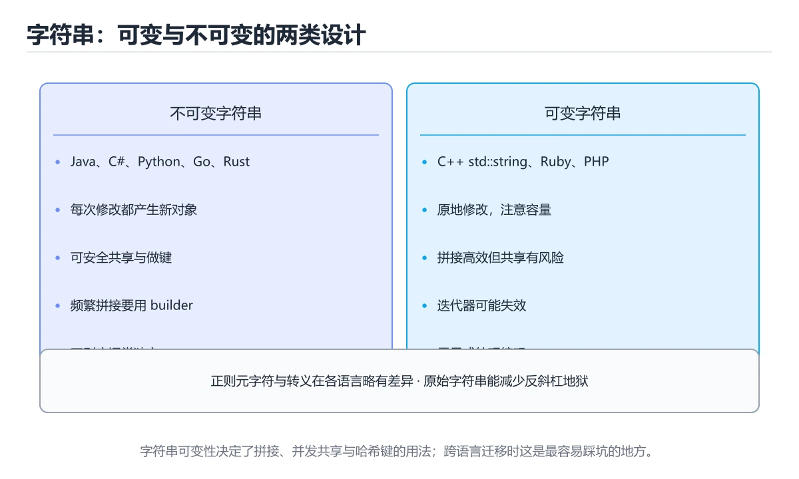

# 字符串与正则：九种语言横向对照




> 内容更新时间：2026-10-06 · 学习阶段：入门 · 预计用时：45 分钟

## 本节知识框架

**课程定位**：所属分类 `cross_language`（跨语言对照），课程主题 `字符串与正则：九种语言横向对照`，学习阶段 入门，建议用时 50 分钟。

本课主线：字符串可变性、四个基础操作、正则引擎差异与原始字符串写法。

**学完本课应当能够**
- 说清 `正则` 与 `原始字符串` 的含义与区别，并各举一个正例和一个反例。
- 用本课示例验证 `贪婪与懒惰匹配` 的行为，记录输入、输出与失败条件。
- 遇到「循环里拼接字符串」这类问题时，能说出触发条件与修复顺序。

### 从概念到验证的学习链条

1. `正则`：先掌握 字符串与正则：九种语言横向对照解决了什么问题，而不是只背术语，再用它解释 `原始字符串` 为什么会出现。
2. `原始字符串`：先掌握 写正则时优先用原始字符串：少一层转义，少一半报错，再用它解释 `贪婪与懒惰匹配` 为什么会出现。
3. `贪婪与懒惰匹配`：先掌握 量词默认尽可能多匹配，加问号后尽可能少匹配，决定 .* 这类写法的边界，再用它解释 `捕获组` 为什么会出现。
4. `捕获组`：先掌握 用括号把匹配的一部分单独取出来，在替换或后续逻辑里按序号引用，再用它解释 本课示例的观察结果 为什么会出现。

**先修与衔接**：本课是「跨语言对照」分类的第 6 课。先修内容：《命令行参数解析：九种语言横向对照》。《命令行参数解析：九种语言横向对照》里的 `参数解析`、`clap` 是本课的前提。相关或后续课程：《时间与时区：九种语言横向对照》。

### 完成判据

- **定义关**：不看正文也能说明 `正则` 是 字符串与正则：九种语言横向对照解决了什么问题，而不是只背术语，并指出一个反例。
- **机制关**：能按“输入 → 转换 → 输出 → 验证”复述 `字符串与正则：九种语言横向对照`，而不是只背结论。
- **示例关**：能运行或推演 `字符串与正则：九种语言横向对照` 的 `text` 示例，并说明一个真实出现的标识符或字面量。
- **证据关**：能指出 `字符串与正则：九种语言横向对照` 示例里的 出现字面量 `user_id=[0-9]+`，并说明它支持或反驳了本课的哪一条结论。
- **排错关**：能复现 循环里拼接字符串，记录现象并按 用 Builder 或 join 修复。
- **迁移关**：能把 `字符串`、`正则`、`拼接`、`编码` 放进一个与 `字符串与正则：九种语言横向对照` 不同的项目场景，并保持输入与验证条件可追踪。
- **复盘关**：学完 `字符串与正则：九种语言横向对照` 后，用一句话写下仍然不确定的结论，并列出下一次验证需要的输入、环境和成功判据。

### 复习清单

- [ ] 能不看正文复述本课核心术语，并指出一个边界或反例。
- [ ] 能运行或推演本课示例，记录输入、输出与失败现象。
- [ ] 能完成一次自测，并把错题对照错误表定位原因。

## 核心概念定义

| 术语 | 操作性定义 | 常见边界与风险 |
| --- | --- | --- |
| 正则 | 字符串与正则：九种语言横向对照解决了什么问题，而不是只背术语。 | 易错：`\d` 变成普通字符；正确做法是用原始字符串。 |
| 原始字符串 | 写正则时优先用原始字符串：少一层转义，少一半报错。 | 易错：`\d` 变成普通字符；正确做法是用原始字符串。 |
| 贪婪与懒惰匹配 | 量词默认尽可能多匹配，加问号后尽可能少匹配，决定 .* 这类写法的边界。 | 只在「量词默认尽可能多匹配，加问号后尽可能少匹配，决定 .* 这类写法的边界」这一前提下成立，换输入或换环境要重新验证。 |
| 捕获组 | 用括号把匹配的一部分单独取出来，在替换或后续逻辑里按序号引用。 | 越界、悬垂引用与释放顺序会破坏结论，必须在边界输入下复验。 |

## 原理与运行机制

### 机制总览

| 阶段 | 关注对象 | 失败时应检查 |
| --- | --- | --- |
| 输入 | 正则 | 类型、范围、编码、版本或前置状态是否满足定义。 |
| 处理 | 原始字符串 | 顺序、可见性、锁、路由、事务或调度规则是否被破坏。 |
| 输出 | 贪婪与懒惰匹配 | 结果是否可复现，错误是否被正确传播而不是被吞掉。 |

**教材衔接：一句话说清**

字符串处理只有四类需求：**拼接、切分、替换、匹配**。
各语言的 API 名字不同，但「不可变 vs 可变」「正则语法差异」是两大共同坑点。

**教材衔接：各语言的「原始字符串」写法**

| 语言 | 原始字符串 | 说明 |
| --- | --- | --- |
| Python | `r"\d+"` | 推荐写正则时使用 |
| JavaScript | 无，需双反斜杠 | 或用 `String.raw` |
| Java | 无，需 `"\\d+"` | 反斜杠要转义 |
| C# | `@"\d+"` | 逐字字符串 |
| C++ | `R"(\d+)"` | 原始字符串字面量 |
| Go | 反引号包裹 | 不做转义解析 |
| Rust | `r"\d+"` | 原始字符串 |
| Shell | 单引号包裹 | 防止 shell 先展开 |

**写正则时优先用原始字符串**：少一层转义，少一半报错。

### 机制拆解：每一步的输入、动作与输出

#### 1. `正则`
- 输入：`字符串`；本步把 字符串与正则：九种语言横向对照解决了什么问题，而不是只背术语 当作判断规则。
- 动作：围绕 `正则` 保留中间状态，并记录它与 `原始字符串` 的对应关系。
- 输出：`原始字符串`，它可以被下一段代码、测试或记录继续使用。
- `正则` 的失败条件：当正则字符串没转义时，会出现`\d` 变成普通字符。

#### 2. `原始字符串`
- 输入：`正则`；本步把 写正则时优先用原始字符串：少一层转义，少一半报错 当作判断规则。
- 动作：围绕 `原始字符串` 保留中间状态，并记录它与 `贪婪与懒惰匹配` 的对应关系。
- 输出：`贪婪与懒惰匹配`，它可以被下一段代码、测试或记录继续使用。
- `原始字符串` 的失败条件：当正则字符串没转义时，会出现`\d` 变成普通字符。

#### 3. `贪婪与懒惰匹配`
- 输入：`原始字符串`；本步把 量词默认尽可能多匹配，加问号后尽可能少匹配，决定 .* 这类写法的边界 当作判断规则。
- 动作：围绕 `贪婪与懒惰匹配` 保留中间状态，并记录它与 `捕获组` 的对应关系。
- 输出：`捕获组`，它可以被下一段代码、测试或记录继续使用。
- `贪婪与懒惰匹配` 的失败条件：只在「量词默认尽可能多匹配，加问号后尽可能少匹配，决定 .* 这类写法的边界」这一前提下成立，换输入或换环境要重新验证。

#### 4. `捕获组`
- 输入：`贪婪与懒惰匹配`；本步把 用括号把匹配的一部分单独取出来，在替换或后续逻辑里按序号引用 当作判断规则。
- 动作：围绕 `捕获组` 保留中间状态，并记录它与 `user_id=[0-9]+` 的对应关系。
- 输出：`user_id=[0-9]+`，它可以被下一段代码、测试或记录继续使用。
- `捕获组` 的失败条件：越界、悬垂引用与释放顺序会破坏结论，必须在边界输入下复验。

### 示例中的可观察事实

1. 出现字面量 `user_id=[0-9]+`；它对应的课程主题是 `字符串与正则：九种语言横向对照`。
2. 出现字面量 `(?<=user_id=)\d+`；它对应的课程主题是 `字符串与正则：九种语言横向对照`。

### 复现实验记录

- 环境：`字符串与正则：九种语言横向对照` 使用 `text` 示例，固定 `字符串`、`正则`、`拼接`、`编码` 作为第一组条件。
- 首轮输入：先确认 出现字面量 `user_id=[0-9]+`，预测 `正则` 会怎样变化。
- 基线观察：记录命令、输入、输出和错误原文，不用截图代替可复制的文本。
- 单变量修改：只改变 `字符串`，观察 `捕获组` 是否仍满足定义。
- 失败注入：复现 循环里拼接字符串，确认现象是 数据量大时极慢。
- 记录结论：把“修改前、修改后、预期变化、实际变化”写成四列表，这样复盘 `字符串与正则：九种语言横向对照` 时才能区分概念错误与实现错误。

## 典型应用场景

- **循环里拼接字符串**：典型现象是数据量大时极慢；正确做法是用 Builder 或 join。
- **正则字符串没转义**：典型现象是`\d` 变成普通字符；正确做法是用原始字符串。
- **用 `%` 或 `+` 拼 SQL**：典型现象是注入风险；正确做法是用参数化查询。
- **以为 replace 替换全部**：典型现象是只换了一处；正确做法是注意各语言语义差异。

### 最小验证场景

- 准备：保留 `text` 示例的原始输入，先记录 `字符串与正则：九种语言横向对照` 的基线输出和完整运行命令。
- 观察：先核对 出现字面量 `user_id=[0-9]+`，再改变一个与 `正则` 相关的条件。
- 判定：新结果与 `字符串与正则：九种语言横向对照` 的基线不同不等于错误；只有当差异破坏了 `正则` 的定义或错误表中的约束，才判定为失败。

### 选择与边界

- 使用 `正则` 时，先满足它的定义：字符串与正则：九种语言横向对照解决了什么问题，而不是只背术语；易错：`\d` 变成普通字符；正确做法是用原始字符串。
- 使用 `原始字符串` 时，先满足它的定义：写正则时优先用原始字符串：少一层转义，少一半报错；易错：`\d` 变成普通字符；正确做法是用原始字符串。
- 使用 `贪婪与懒惰匹配` 时，先满足它的定义：量词默认尽可能多匹配，加问号后尽可能少匹配，决定 .* 这类写法的边界；只在「量词默认尽可能多匹配，加问号后尽可能少匹配，决定 .* 这类写法的边界」这一前提下成立，换输入或换环境要重新验证。
- 使用 `捕获组` 时，先满足它的定义：用括号把匹配的一部分单独取出来，在替换或后续逻辑里按序号引用；越界、悬垂引用与释放顺序会破坏结论，必须在边界输入下复验。

## 代码/协议/SQL 示例

**教材衔接：正则语法差异（重点）**

| 需求 | 基础正则 | 扩展正则 | Perl 风格 |
| --- | --- | --- | --- |
| 一个或多个 | `a\+` | `a+` | `a+` |
| 数字 | `[0-9]` | `[0-9]` | `\d` |
| 单词字符 | `[A-Za-z0-9_]` | 同左 | `\w` |
| 非贪婪 | 不支持 | 部分支持 | `.*?` |
| 环视 | 不支持 | 不支持 | `(?=...)` |

```text
Python / JavaScript / Java / C#：使用各自的正则引擎
Go 的 regexp 与 Rust 的 regex 是 RE2 风格（不支持环视与反向引用）

Shell：
  grep                 → 基础正则
  grep -E / sed -E     → 扩展正则
  grep -P              → Perl 正则（GNU 专有）
```

```bash
# 从日志里提取用户 ID：三种写法
grep -oE 'user_id=[0-9]+' app.log          # 扩展正则
grep -oP '(?<=user_id=)\d+' app.log        # Perl 环视（GNU）
sed -E 's/.*user_id=([0-9]+).*/\1/' app.log
```

### 示例精读：先找证据，再改一个条件

1. 出现字面量 `user_id=[0-9]+`；它出现在 `字符串与正则：九种语言横向对照` 的示例中，阅读时先确认它前后各发生了什么。
2. 出现字面量 `(?<=user_id=)\d+`；它出现在 `字符串与正则：九种语言横向对照` 的示例中，阅读时先确认它前后各发生了什么。
- 在 `字符串与正则：九种语言横向对照` 中与 `正则` 对照：示例必须能支持 字符串与正则：九种语言横向对照解决了什么问题，而不是只背术语，否则说明这一段还缺少实现或验证步骤。
- 在 `字符串与正则：九种语言横向对照` 中与 `原始字符串` 对照：示例必须能支持 写正则时优先用原始字符串：少一层转义，少一半报错，否则说明这一段还缺少实现或验证步骤。
- 在 `字符串与正则：九种语言横向对照` 中与 `贪婪与懒惰匹配` 对照：示例必须能支持 量词默认尽可能多匹配，加问号后尽可能少匹配，决定 .* 这类写法的边界，否则说明这一段还缺少实现或验证步骤。
- 在 `字符串与正则：九种语言横向对照` 中与 `捕获组` 对照：示例必须能支持 用括号把匹配的一部分单独取出来，在替换或后续逻辑里按序号引用，否则说明这一段还缺少实现或验证步骤。

## 时间/空间复杂度或性能分析

**性能关注点（字符串与正则：九种语言横向对照）**：同一算法的实现差异体现在常数项与内存模型：用同一输入横向对比耗时与内存。

**本课特有开销（字符串与正则：九种语言横向对照 · 字符串）**：并发度提高后要观察是否出现拐点：延迟上升而吞吐不增，说明瓶颈已转移。

**测量方法**：以 `字符串与正则：九种语言横向对照` 的 `字符串` 场景为对象，固定输入跑一遍记录基线，再把规模或并发度提高一个数量级复测；两次结果的差值与波动范围才是结论依据。

### 需要控制的变量与记录项

- `字符串与正则：九种语言横向对照` 的 `字符串`：固定它的版本、输入范围和资源上限，分别记录速度、内存与失败率的变化。
- `字符串与正则：九种语言横向对照` 的 `正则`：固定它的版本、输入范围和资源上限，分别记录速度、内存与失败率的变化。
- `字符串与正则：九种语言横向对照` 的 `拼接`：固定它的版本、输入范围和资源上限，分别记录速度、内存与失败率的变化。
- `字符串与正则：九种语言横向对照` 的 `编码`：固定它的版本、输入范围和资源上限，分别记录速度、内存与失败率的变化。
- `字符串与正则：九种语言横向对照` 的 `原始字符串`：固定它的版本、输入范围和资源上限，分别记录速度、内存与失败率的变化。
- `字符串与正则：九种语言横向对照` 中 `正则` 的边界：易错：`\d` 变成普通字符；正确做法是用原始字符串。达到边界时不要外推，必须重新测量。
- `字符串与正则：九种语言横向对照` 中 `原始字符串` 的边界：易错：`\d` 变成普通字符；正确做法是用原始字符串。达到边界时不要外推，必须重新测量。
- `字符串与正则：九种语言横向对照` 中 `贪婪与懒惰匹配` 的边界：只在「量词默认尽可能多匹配，加问号后尽可能少匹配，决定 .* 这类写法的边界」这一前提下成立，换输入或换环境要重新验证。达到边界时不要外推，必须重新测量。
- `字符串与正则：九种语言横向对照` 中 `捕获组` 的边界：越界、悬垂引用与释放顺序会破坏结论，必须在边界输入下复验。达到边界时不要外推，必须重新测量。
- `字符串与正则：九种语言横向对照` 的代码证据：先验证 出现字面量 `user_id=[0-9]+`，再记录该路径的输入规模与耗时；只看代码行数不能推出复杂度。

## 常见误区与易错点

| 容易写错的做法 | 实际现象 | 原因与正确做法 |
| --- | --- | --- |
| 循环里拼接字符串 | 数据量大时极慢 | 用 Builder 或 join |
| 正则字符串没转义 | `\d` 变成普通字符 | 用原始字符串 |
| 用 `%` 或 `+` 拼 SQL | 注入风险 | 用参数化查询 |
| 以为 replace 替换全部 | 只换了一处 | 注意各语言语义差异 |
| 用字节长度校验中文 | 校验过严 | 用字符数 |
| split 结果含空串 | 首尾分隔符导致 | 过滤空串 |
| 大小写比较不归一化 | 判断失败 | 统一转换后再比较 |
| Shell 正则不加引号 | 被 shell 展开 | 正则一律加单引号 |
| Python | 不可变 | `"".join(parts)` |
| JavaScript | 不可变 | `parts.join("")` 或数组累积 |
| TypeScript | 不可变 | 同 JavaScript |
| Java | 不可变 | `StringBuilder` |
| C# | 不可变 | `StringBuilder` 或 `string.Join` |
| C++ | `std::string` 可变 | `+=` 或 `append`，注意预留容量 |
| Go | 不可变 | `strings.Builder` |
| Rust | 不可变 | `String::with_capacity` 加 `push_str` |
| Shell | 可变 | 变量拼接，大文本交给 `awk` |

### 现场 1：循环里拼接字符串

**症状**：数据量大时极慢。

**根因与修复**：用 Builder 或 join。

**自检**：在本课示例里复现「循环里拼接字符串」，改成用 Builder 或 join后重跑；如果症状消失且失败路径按预期变化，说明定位正确。

### 现场 2：正则字符串没转义

**症状**：`\d` 变成普通字符。

**根因与修复**：用原始字符串。

**自检**：在本课示例里复现「正则字符串没转义」，改成用原始字符串后重跑；如果症状消失且失败路径按预期变化，说明定位正确。

### 现场 3：用 `%` 或 `+` 拼 SQL

**症状**：注入风险。

**根因与修复**：用参数化查询。

**自检**：在本课示例里复现「用 `%` 或 `+` 拼 SQL」，改成用参数化查询后重跑；如果症状消失且失败路径按预期变化，说明定位正确。

### 现场 4：以为 replace 替换全部

**症状**：只换了一处。

**根因与修复**：注意各语言语义差异。

**自检**：在本课示例里复现「以为 replace 替换全部」，改成注意各语言语义差异后重跑；如果症状消失且失败路径按预期变化，说明定位正确。

### 现场 5：用字节长度校验中文

**症状**：校验过严。

**根因与修复**：用字符数。

**自检**：在本课示例里复现「用字节长度校验中文」，改成用字符数后重跑；如果症状消失且失败路径按预期变化，说明定位正确。

### 现场 6：split 结果含空串

**症状**：首尾分隔符导致。

**根因与修复**：过滤空串。

**自检**：在本课示例里复现「split 结果含空串」，改成过滤空串后重跑；如果症状消失且失败路径按预期变化，说明定位正确。

### 现场 7：大小写比较不归一化

**症状**：判断失败。

**根因与修复**：统一转换后再比较。

**自检**：在本课示例里复现「大小写比较不归一化」，改成统一转换后再比较后重跑；如果症状消失且失败路径按预期变化，说明定位正确。

### 现场 8：Shell 正则不加引号

**症状**：被 shell 展开。

**根因与修复**：正则一律加单引号。

**自检**：在本课示例里复现「Shell 正则不加引号」，改成正则一律加单引号后重跑；如果症状消失且失败路径按预期变化，说明定位正确。

### 现场 9：Python

**症状**：不可变。

**根因与修复**：`"".join(parts)`。

**自检**：在本课示例里复现「Python」，改成`"".join(parts)`后重跑；如果症状消失且失败路径按预期变化，说明定位正确。

## 与其他知识点的关系

**教材衔接：字符串可变性对照**

| 语言 | 字符串可变 | 大量拼接的正确做法 |
| --- | --- | --- |
| Python | 不可变 | `"".join(parts)` |
| JavaScript | 不可变 | `parts.join("")` 或数组累积 |
| TypeScript | 不可变 | 同 JavaScript |
| Java | 不可变 | `StringBuilder` |
| C# | 不可变 | `StringBuilder` 或 `string.Join` |
| C++ | `std::string` 可变 | `+=` 或 `append`，注意预留容量 |
| Go | 不可变 | `strings.Builder` |
| Rust | 不可变 | `String::with_capacity` 加 `push_str` |
| Shell | 可变 | 变量拼接，大文本交给 `awk` |

```text
反例（多数语言里都很慢）
  for (item of items) result += item;      // 每次生成新字符串

正例
  收集到列表 → 一次 join
```

**教材衔接：四个操作的写法对照**

```python
text = "  Hello, World  "
text.strip()                       # 去首尾空白
text.lower().startswith("hello")   # 判断前缀
",".join(["a", "b"])               # 拼接
"a,b,c".split(",")                 # 切分
text.replace("World", "Python")    # 替换
```

```javascript
const text = "  Hello, World  ";
text.trim();
text.toLowerCase().startsWith("hello");
["a", "b"].join(",");
"a,b,c".split(",");
text.replace("World", "Python");        // 只替换第一处
text.replaceAll("l", "L");              // 替换全部
```

```java
String text = "  Hello, World  ";
text.strip();                           // Java 11+ 推荐
text.toLowerCase().startsWith("hello");
String.join(",", List.of("a", "b"));
"a,b,c".split(",");
text.replace("World", "Python");        // 全部替换
```

```csharp
var text = "  Hello, World  ";
text.Trim();
text.StartsWith("hello", StringComparison.OrdinalIgnoreCase);
string.Join(",", new[] { "a", "b" });
"a,b,c".Split(',');
text.Replace("World", "Python");
```

```go
import "strings"

text := "  Hello, World  "
strings.TrimSpace(text)
strings.HasPrefix(strings.ToLower(text), "hello")
strings.Join([]string{"a", "b"}, ",")
strings.Split("a,b,c", ",")
strings.ReplaceAll(text, "World", "Python")
```

```rust
let text = "  Hello, World  ";
text.trim();
text.to_lowercase().starts_with("hello");
["a", "b"].join(",");
"a,b,c".split(',').collect::<Vec<_>>();
text.replace("World", "Python");
```

```bash
text="  Hello, World  "
trimmed="$(echo "$text" | xargs)"          # 简单去空白
echo "${text,,}"                           # 转小写（bash 4+）
printf '%s\n' "a,b,c" | tr ',' '\n'        # 切分
echo "$text" | sed 's/World/Python/g'      # 替换
```

**教材衔接：深入补充：字符串与正则：九种语言横向对照 的取舍与边界**

### 一、把概念放回真实约束

| 维度 | 字符串 的典型写法 | 另一种语言的等价写法 | 迁移时最易踩的坑 |
| --- | --- | --- | --- |
| 错误处理 | 显式返回或抛出 | 异常或结果类型 | 错误被静默吞掉 |
| 并发模型 | 线程、协程或事件循环 | 运行时调度不同 | 共享状态与取消语义 |
| 依赖管理 | 官方包管理器 | 生态与锁文件不同 | 版本解析结果不一致 |


### 五、跨语言迁移清单

在本课的迁移练习里，先列出 字符串 在两种语言中的类型、错误处理、并发模型和内存管理差异；再用同一个输入各写一版最小实现，比较编译或运行时的错误信息。最后记录 正则 在两种语言里的性能与可读性差异，避免只凭语法熟悉度做选型。

**教材衔接：复习与迁移**

### 概念复述

- 用一句话说明「字符串与正则：九种语言横向对照」解决什么问题：字符串可变性、四个基础操作、正则引擎差异与原始字符串写法。
- 写出字符串、正则、拼接之间的关系，并各举一个例子。
- 说出本课最容易混淆的两个概念，以及区分它们的判据。

### 正文逐节复核

- **一句话说清**：字符串处理只有四类需求：**拼接、切分、替换、匹配**。
- **深入补充：字符串与正则：九种语言横向对照 的取舍与边界**：学习字符串与正则：九种语言横向对照时，最容易只记住结论而忽略前提。


### 迁移练习

- **先修**：`命令行参数解析：九种语言横向对照`。本课默认这些内容已经掌握。
- **相关或后续**：`时间与时区：九种语言横向对照`。本课术语会在这些课程里继续使用。
- **术语归属**：`正则`、`原始字符串`、`贪婪与懒惰匹配` 的定义以本课「核心概念定义」为准，换到其他课程时先确认定义是否被改写。

### 先修与后续术语接口

- `命令行参数解析：九种语言横向对照`：两者通过本分类的学习顺序衔接，阅读时重点比较各自的输入与失败条件。
- `时间与时区：九种语言横向对照`：两者通过本分类的学习顺序衔接，阅读时重点比较各自的输入与失败条件。

### 容易混淆的相邻概念

- `正则` 与 `原始字符串`：前者强调 字符串与正则：九种语言横向对照解决了什么问题，而不是只背术语；后者强调 写正则时优先用原始字符串：少一层转义，少一半报错。判断时分别检查两条定义的适用范围，不要只看名称相似就互换。
- `原始字符串` 与 `贪婪与懒惰匹配`：前者强调 写正则时优先用原始字符串：少一层转义，少一半报错；后者强调 量词默认尽可能多匹配，加问号后尽可能少匹配，决定 .* 这类写法的边界。判断时分别检查两条定义的适用范围，不要只看名称相似就互换。
- `贪婪与懒惰匹配` 与 `捕获组`：前者强调 量词默认尽可能多匹配，加问号后尽可能少匹配，决定 .* 这类写法的边界；后者强调 用括号把匹配的一部分单独取出来，在替换或后续逻辑里按序号引用。判断时分别检查两条定义的适用范围，不要只看名称相似就互换。

## 自测题与参考答案

> 先独立作答，再对照参考答案；答案都能在本课正文、术语表或错误表里找到依据。

### 自测 1（概念复述）

不看正文，写出 `正则` 的操作性定义，并说明它与 `原始字符串` 的区别。

**参考答案**：字符串与正则：九种语言横向对照解决了什么问题，而不是只背术语。

`原始字符串` 的定位是：写正则时优先用原始字符串：少一层转义，少一半报错；两者的差别要从适用对象与失败模式上说明。

### 自测 2（排错）

本课错误表记录了「循环里拼接字符串」这类做法。请写出它会出现的现象、根因，以及修复顺序。

**参考答案**：现象是数据量大时极慢；正确做法是用 Builder 或 join。修复时先复现现象并保留证据，再改动一处假设重跑，确认现象消失。

### 自测 3（动手验证）

运行本课的 `text` 示例，改动其中一个输入后重新运行，记录输出与错误信息。

**参考答案**：正常输入下 `text` 示例应当复现正文给出的结果；改动输入后，如果结果改变或报错，先核对它是否满足 `字符串与正则：九种语言横向对照` 中`正则` 的适用范围，再检查错误表里是否有同类现象。

### 自测 4（代码阅读）

阅读本课开头的 `text` 示例，说明它体现了`正则` 的哪一条性质，并指出改动哪个输入会让这条性质不再成立。

**参考答案**：`正则` 的定义是 字符串与正则：九种语言横向对照解决了什么问题，而不是只背术语，示例正是在实现这条定义。改动与 `正则` 有关的一个输入后，如果结果不再符合 `字符串与正则：九种语言横向对照` 的正文描述，就说明该性质只在当前前提成立。

### 自测 5（迁移）

把 `字符串与正则：九种语言横向对照` 的方法迁移到自己的项目：围绕 `正则` 写出一个与错误表同类的风险点，并说明触发条件和检验方式。

**参考答案**：例如「Shell」，它会导致可变；检验方式是按变量拼接，大文本交给 `awk`改一处再复现，确认现象消失且没有引入新的失败分支。

### 自测 6（对比）

用一个表格对比 `正则` 与 `原始字符串`：各写一行适用场景、一行失败表现。

**参考答案**：`正则` 的定义是字符串与正则：九种语言横向对照解决了什么问题，而不是只背术语；`原始字符串` 的定义是写正则时优先用原始字符串：少一层转义，少一半报错。两者的失败表现分别对应本课错误表里与本术语相关的行。

### 自测 7（排错顺序）

面对「循环里拼接字符串」引发的问题，请把“复现 数据量大时极慢 → 保留证据 → 用 Builder 或 join → 回归验证”四步写成可执行的检查清单。

**参考答案**：第一步按数据量大时极慢复现；第二步记录输入、版本与完整报错；第三步按用 Builder 或 join只改一处；第四步重跑并确认失败路径也按预期变化。

### 自测 8（边界判断）

针对 `捕获组`，分别写出“可以使用”的条件和“结论不再成立”的条件。

**参考答案**：越界、悬垂引用与释放顺序会破坏结论，必须在边界输入下复验。 同时要把 `捕获组` 的定义 用括号把匹配的一部分单独取出来，在替换或后续逻辑里按序号引用 与实际输入逐项对照。

### 自测 9（机制重建）

不看正文，按输入、转换、输出、验证四段重建 `正则` → `原始字符串` → `贪婪与懒惰匹配` → `捕获组` 的作用链。

**参考答案**：起点是 `正则` 的定义 字符串与正则：九种语言横向对照解决了什么问题，而不是只背术语；中间每一步都保留可观察状态；终点由 `捕获组` 检查，失败时回到错误表定位第一个偏离定义的步骤。

### 自测 10（综合排错）

在 `字符串与正则：九种语言横向对照` 中，现象是 可变。请围绕 Shell 写出最小复现、关键证据、修复动作和回归验证，并说明为什么不能只凭一次运行下结论。

**参考答案**：先复现 Shell，记录输入与完整错误；再按 变量拼接，大文本交给 `awk` 只改一处。回归时同时跑正常路径和边界路径，只有两次结果都可解释，才把修复视为完成。

### 自测 11（一分钟复述）

用每分钟约 200 字的速度复述 `字符串与正则：九种语言横向对照`：先给主问题，再按顺序说出 `正则`、`原始字符串`、`贪婪与懒惰匹配`、`捕获组`，最后给一个失败案例。

**自评标准**：主问题必须对应 字符串可变性、四个基础操作、正则引擎差异与原始字符串写法；每个术语都要能接上一句定义或边界；失败案例必须写成可观察现象，不能用“可能有风险”代替证据。

## 术语速查

| 术语 | 一句话说明 |
| --- | --- |
| `正则` | 字符串与正则：九种语言横向对照解决了什么问题，而不是只背术语。 |
| `原始字符串` | 写正则时优先用原始字符串：少一层转义，少一半报错。 |
| `贪婪与懒惰匹配` | 量词默认尽可能多匹配，加问号后尽可能少匹配，决定 .* 这类写法的边界。 |
| `捕获组` | 用括号把匹配的一部分单独取出来，在替换或后续逻辑里按序号引用。 |

**术语关系**：`正则`（字符串与正则：九种语言横向对照解决了什么问题） → `原始字符串`（写正则时优先用原始字符串：少一层转义） → `贪婪与懒惰匹配`（量词默认尽可能多匹配） → `捕获组`（用括号把匹配的一部分单独取出来）。

## 考点精讲

`字符串与正则：九种语言横向对照` 的题库有 5 道题，下面逐题给出题干、正确项与判断依据：先自己作答，再核对正确项，最后回到正文对应小节复核。

### 考点 1：第 1 题

- **题目**：代码语言为 `python`，选自 `字符串与正则：九种语言横向对照` 的 `正则` 部分。课程问题为字符串可变性、四个基础操作、正则引擎差异与原始字符串写法。哪一项描述与代码一致？
- **正确项**：出现字面量 `(?<=user_id=)\d+`
- **判断依据**：这道题落在术语 `正则` 上：字符串与正则：九种语言横向对照解决了什么问题，而不是只背术语。复习时把 `正则` 的定义、适用边界和一个反例一起说清楚，再回到「核心概念定义」核对原文。

### 考点 2：第 2 题

- **题目**：围绕“字符串与正则：九种语言横向对照”中的 字符串、正则、拼接，下列哪两项是本课强调的实践判断？
- **正确项**：验证 正则 时要固定版本并覆盖边界输入，结论才可复现；学习 字符串 时要同时说明输入、输出和失败路径，不能只看正常流程
- **判断依据**：这道题落在术语 `正则` 上：字符串与正则：九种语言横向对照解决了什么问题，而不是只背术语。复习时把 `正则` 的定义、适用边界和一个反例一起说清楚，再回到「核心概念定义」核对原文。

### 考点 3：第 3 题

- **题目**：在 Python 里写正则时，为什么要加 r 前缀？
- **正确项**：使用原始字符串
- **判断依据**：这道题落在术语 `正则` 上：字符串与正则：九种语言横向对照解决了什么问题，而不是只背术语。若写成 Python 就会不可变，应按 `"".join(parts)` 处理。

### 考点 4：第 4 题

- **题目**：Python 中 len("中文") 与 len("中文".encode) 的结果分别是？
- **正确项**：2 与 6
- **判断依据**：这道题检验本课主问题：字符串可变性、四个基础操作、正则引擎差异与原始字符串写法。若写成 Python 就会不可变，应按 `"".join(parts)` 处理。

### 考点 5：第 5 题

- **题目**：填空：补齐下面这段术语说明中的空缺。课程 `字符串可变性、四个基础操作、正则引擎差异与原始字符串写法。`，这段说明是：`____`：量词默认尽可能多匹配，加问号后尽可能少匹配，决定 .* 这类写法的边界。空缺处应填哪个术语？
- **正确项**：贪婪与懒惰匹配
- **判断依据**：这道题落在术语 `正则` 上：字符串与正则：九种语言横向对照解决了什么问题，而不是只背术语。复习时把 `正则` 的定义、适用边界和一个反例一起说清楚，再回到「核心概念定义」核对原文。

### 考点 6：`正则`

- **要点**：字符串与正则：九种语言横向对照解决了什么问题，而不是只背术语。
- **正则 的边界**：易错：`\d` 变成普通字符；正确做法是用原始字符串。

### 考点 7：`原始字符串`

- **要点**：写正则时优先用原始字符串：少一层转义，少一半报错。
- **原始字符串 的边界**：易错：`\d` 变成普通字符；正确做法是用原始字符串。

### 考点 8：`贪婪与懒惰匹配`

- **要点**：量词默认尽可能多匹配，加问号后尽可能少匹配，决定 .* 这类写法的边界。
- **贪婪与懒惰匹配 的边界**：只在「量词默认尽可能多匹配，加问号后尽可能少匹配，决定 .* 这类写法的边界」这一前提下成立，换输入或换环境要重新验证。

### 考点 9：`捕获组`

- **要点**：用括号把匹配的一部分单独取出来，在替换或后续逻辑里按序号引用。
- **捕获组 的边界**：越界、悬垂引用与释放顺序会破坏结论，必须在边界输入下复验。

### 考点 10：排错——循环里拼接字符串

- **现象**：数据量大时极慢。
- **处理**：用 Builder 或 join。

### 考点 11：排错——正则字符串没转义

- **现象**：`\d` 变成普通字符。
- **处理**：用原始字符串。

### 考点 12：综合辨析——`正则` 与 `捕获组`

- **辨析点**：`正则` 的定义是 字符串与正则：九种语言横向对照解决了什么问题，而不是只背术语；`捕获组` 的定义是 用括号把匹配的一部分单独取出来，在替换或后续逻辑里按序号引用。
- **答题要求**：面对 `字符串与正则：九种语言横向对照` 的题目，先判断描述的是 `正则` 还是 `捕获组`，再归到对应定义，最后写出一个会让该定义失效的边界输入。

### 考点 13：排错评分点

- **现象分**：能写出 数据量大时极慢，而不是只写“程序有错”。
- **证据分**：保留触发 循环里拼接字符串 的输入、版本和错误原文。
- **修复分**：按 用 Builder 或 join 只改一处，并同时回归正常路径与边界路径。

## 内容元数据

- 内容版本：v2.0
- 最后更新：2026-10-06
- 学习阶段：入门
- 适用环境：九种主流语言生态横向对照
；本课聚焦 字符串。
- 内容来源：内置结构化课程与工程实践整理
- 相关主题：字符串、正则、拼接、编码、原始字符串
- 质量版本：P0 测验标准 + P1 覆盖扩展 + P2 体验补全

## 参考资料与复核

- 最后复核：2026-10-04
- 下次复核：2027-07-17
- 复核范围：版本兼容、API 行为、安全建议与工程实践
- 来源性质：官方文档、标准或权威教材；本课核对关键词：字符串、正则、拼接、编码、原始字符串。

| 参考资料 | 本课用途 |
| --- | --- |
| [DevDocs](https://devdocs.io/) | 多语言 API 快速检索 |
| [Programming Languages DB](https://pldb.io/) | 语言特性与生态对照 |
| [Compiler Explorer](https://godbolt.org/) | 不同编译器与汇编对照 |

| [本课术语索引：字符串与正则：九种语言横向对照](#核心概念定义) | 按本课输入、术语边界和错误表现逐项核对 |
> 「字符串与正则：九种语言横向对照」的链接用于离线阅读后的延伸核对；App 不会自动联网。