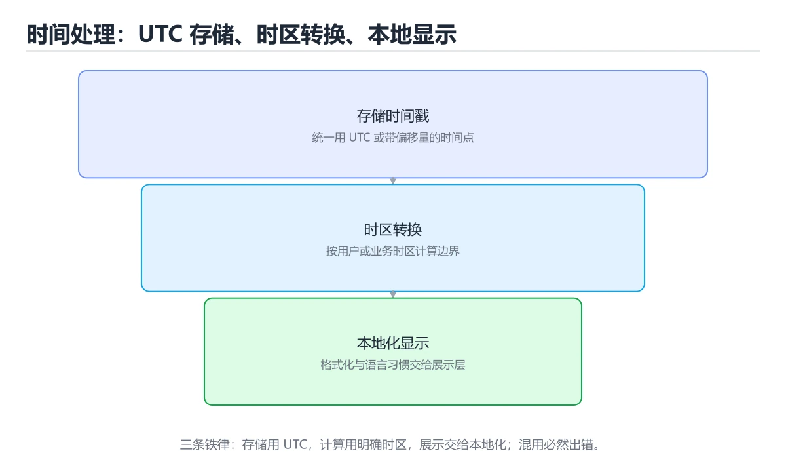
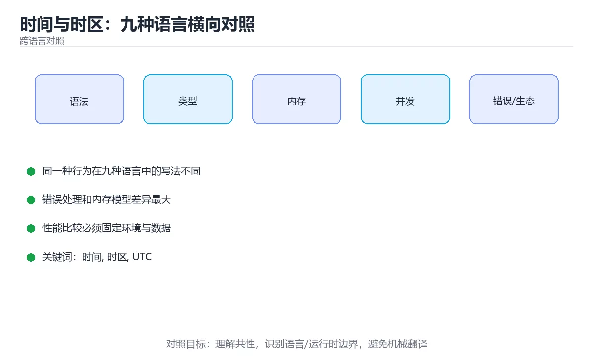

# 本课主题

> 内容更新时间：2026-10-03





## 学习目标

- 能用自己的话解释本课主题解决了什么问题，而不是只背术语。
- 能说清 「时间」、「时区」、「UTC」、「ISO 8601」 之间的关系，并分别举出一个例子。
- 能把本课知识放回「跨语言对照」的知识体系，说明它和相邻主题的边界。
- 能完成本课练习，并用验收标准检查自己的结果。

> 一句话摘要：时刻与本地时间、三条铁律、数据库字段选择与常见时区错误。

## 前置知识

- 先完成上一课《字符串与正则：九种语言横向对照》；如果已经掌握，可以直接用本课练习自测。
- 本课阶段：进阶。建议先掌握同一分类的基础课程，并能独立运行正文中的最小示例。
- 开始前先复习：时间、时区、UTC。
- 如果某一步看不懂，先记录具体卡点，完成练习后再回头读一遍。

## 一句话说清

时间处理只有三条铁律：
**存储用 UTC、传输用 ISO 8601、展示时才转本地时区**。
踩坑几乎都来自把「本地时间」当成「绝对时刻」。

## 四个必须分清的概念

```text
① 时刻 Instant：时间轴上的一个点，与时区无关
   例：2026-03-05T06:02:11Z

② 本地日期时间 LocalDateTime：墙上时钟读数，没有时区信息
   例：2026-03-05 14:02:11（不知道是哪个时区）

③ 时区 ZoneId：规则集合，如 Asia/Shanghai（含夏令时历史）

④ 偏移 Offset：某时刻相对 UTC 的差，如 +08:00

换算关系：时刻 = 本地日期时间 + 时区规则
```

**只存本地日期时间是事故的开始**：同一串数字在不同时区代表不同时刻。

## 各语言的主流时间类型

| 语言 | 时刻类型 | 带时区 | 格式化 |
| --- | --- | --- | --- |
| Python | `datetime`（带 tzinfo） | 显式传 `timezone.utc` | `isoformat` |
| JavaScript | `Date`（内部为毫秒时间戳） | 用 `Intl` 格式化 | `toISOString` |
| TypeScript | 同 JavaScript | 同上 | 同上 |
| Java | `Instant` / `ZonedDateTime` | `ZoneId` | `DateTimeFormatter` |
| C# | `DateTimeOffset` | 内建偏移 | `ToString("o")` |
| C++ | `chrono::system_clock` | C++20 起有 `zoned_time` | `std::format` |
| Go | `time.Time` | `time.Location` | `Format(time.RFC3339)` |
| Rust | `chrono::DateTime<Utc>` | `chrono-tz` | `to_rfc3339` |
| Shell | `date` | `TZ=` 环境变量 | `date -Iseconds` |

## 三条铁律的落地写法

```python
from datetime import datetime, timezone
from zoneinfo import ZoneInfo

now_utc = datetime.now(timezone.utc)              # 存储：始终用 UTC
print(now_utc.isoformat())

local = now_utc.astimezone(ZoneInfo("Asia/Shanghai"))   # 展示：转本地
print(local.strftime("%Y-%m-%d %H:%M"))

parsed = datetime.fromisoformat("2026-03-05T06:02:11+00:00")   # 解析
```

```javascript
const iso = new Date().toISOString();          // 存储：UTC 的 ISO 8601

const shown = new Intl.DateTimeFormat("zh-CN", {
  dateStyle: "medium",
  timeStyle: "short",
  timeZone: "Asia/Shanghai",
}).format(new Date(iso));                      // 展示：按用户时区

const parsed = new Date("2026-03-05T06:02:11Z");
```

```java
import java.time.*;
import java.time.format.DateTimeFormatter;

Instant now = Instant.now();                                   // 时刻
ZonedDateTime local = now.atZone(ZoneId.of("Asia/Shanghai"));
String text = DateTimeFormatter.ISO_INSTANT.format(now);
Instant parsed = Instant.parse("2026-03-05T06:02:11Z");
```

```csharp
var now = DateTimeOffset.UtcNow;
string iso = now.ToString("o");                                // 往返格式
var parsed = DateTimeOffset.Parse("2026-03-05T06:02:11+00:00");
var local = TimeZoneInfo.ConvertTimeBySystemTimeZoneId(parsed, "China Standard Time");
```

```go
now := time.Now().UTC()
text := now.Format(time.RFC3339)
parsed, _ := time.Parse(time.RFC3339, text)

loc, _ := time.LoadLocation("Asia/Shanghai")
fmt.Println(parsed.In(loc).Format("2006-01-02 15:04"))
```

```rust
use chrono::Utc;

let now = Utc::now();
let text = now.to_rfc3339();
let parsed = chrono::DateTime::parse_from_rfc3339(&text)?;
```

```bash
date -u +%Y-%m-%dT%H:%M:%SZ                 # 当前 UTC
TZ=Asia/Shanghai date '+%Y-%m-%d %H:%M'     # 指定时区展示
date -d "2026-03-05T06:02:11Z" +%s          # 解析为时间戳
```

## 五个高频场景的正确做法

| 场景 | 错误做法 | 正确做法 |
| --- | --- | --- |
| 记录创建时间 | 存本地时间字符串 | 存 UTC 时刻 |
| 展示给用户 | 后端按服务器时区格式化 | 前端按用户时区格式化 |
| 每日 0 点执行任务 | 用服务器时间 0 点 | 明确业务时区 |
| 计算相差几天 | 直接相减 | 转同一时区后按日历天计算 |
| 跨夏令时加一天 | 加 24 小时 | 按日历单位加一天 |

## 数据库里的时间字段

| 类型 | 是否带时区 | 建议 |
| --- | --- | --- |
| `TIMESTAMP WITH TIME ZONE` | 带 | **推荐** |
| `TIMESTAMP` / `DATETIME` | 不带 | 需约定全部存 UTC |
| 整数时间戳 | 隐含 UTC | 简单可靠，注意单位统一 |

```text
建议写进团队文档的统一约定
  · 数据库存 UTC
  · 接口传输 ISO 8601，带 Z 或偏移
  · 前端按用户时区渲染
  · 日志时间统一 UTC 并标注
```

## 新手最容易踩的八个坑

| 坑 | 现象 | 正确做法 |
| --- | --- | --- |
| 用本地时间存库 | 跨时区显示错乱 | 存 UTC |
| 时间戳单位混淆 | 相差 1000 倍 | 明确秒还是毫秒 |
| 字符串比较时间 | 跨格式失效 | 统一 ISO 8601 |
| 用固定 24 小时算一天 | 夏令时地区出错 | 用日历单位 |
| 服务器时区变更 | 历史数据解释变化 | 显式指定时区 |
| 忽略闰年 | 边界计算错误 | 用成熟的日期库 |
| 时区名写成缩写 | `CST` 有歧义 | 用 `Asia/Shanghai` |
| 前端直接显示后端字符串 | 用户看到服务器时间 | 前端按时区渲染 |

## 本课小结
- 记住换算关系：**时刻 = 本地日期时间 + 时区规则**。
- 三条铁律：**存 UTC、传 ISO 8601、展示时再转本地**。
- 涉及「天」的计算要用日历语义，而不是固定 24 小时。

## 动手练习

> 本课练习重点：围绕「时间、时区、UTC」完成复述、实验和交付，每个结果都要能被别人检查。

用两种语言实现同一行为，再对比语法、错误、性能和生态差异。

### 练习 1：建立心智模型（10 分钟）

合上教程，用 3～5 句话回答：

1. 本课主题解决了什么问题？
2. 如果没有它，会出现什么具体后果？
3. 它和「时区」是什么关系？

**验收标准**：至少出现一个本课关键词，并写出一个反例、边界条件或失效场景。

### 练习 2：做一次可控实验（20 分钟）

从正文中选一个最小示例，完成以下操作：

1. 先预测修改一个参数、输入或步骤后的结果。
2. 再实际执行或逐步推演，记录真实结果。
3. 如果结果与预测不同，写出差异原因。

**验收标准**：留下「原例 → 改动 → 预测 → 结果 → 原因」五步记录。

### 练习 3：交付一个小结果（30 分钟）

选两种语言实现同一行为，列出语法、错误处理、性能和生态差异。

任务要求：

- 结果必须能被别人检查，不能只写“我已经理解了”。
- 至少覆盖「时间」和「时区」两个关键词。
- 写出 1 个仍然不确定的问题，以及下一步如何验证。

> 提示：时间有限时优先做练习 1 和练习 2；练习 3 可以拆成两次完成。

## 可运行练习

### 任务 1：先跑通，再解释

```python
from datetime import datetime, timezone
from zoneinfo import ZoneInfo

now_utc = datetime.now(timezone.utc)              # 存储：始终用 UTC
print(now_utc.isoformat())

local = now_utc.astimezone(ZoneInfo("Asia/Shanghai"))   # 展示：转本地
print(local.strftime("%Y-%m-%d %H:%M"))

parsed = datetime.fromisoformat("2026-03-05T06:02:11+00:00")   # 解析
```

### 任务 2：只改一个条件

### 任务 3：迁移到自己的数据

用同一套思路处理一组你自己的数据或场景，保持输出格式与任务 1 一致。

## 故障现场

### 现场 1：本课的 时间 常规用例通过，但边界用例失败

**症状**：在本课的练习或生产场景里出现“本课的 时间 常规用例通过，但边界用例失败”。

**复现**：准备一组最小输入，只保留触发“本课的 时间 常规用例通过，但边界用例失败”的必要条件，连续运行两次确认结果稳定。

**定位**：围绕“时间 的前置条件与取值边界没有写进代码，默认值掩盖了空值和极值”检查调用链、输入数据和环境配置，先验证假设再改代码。

**预防**：把“本课的 时间 常规用例通过，但边界用例失败”写成一条自动化用例，并在本课的验收清单里保留对应检查项。

### 现场 2：本课的 时区 结果在两次运行之间不一致

**症状**：在本课的练习或生产场景里出现“本课的 时区 结果在两次运行之间不一致”。

**复现**：准备一组最小输入，只保留触发“本课的 时区 结果在两次运行之间不一致”的必要条件，连续运行两次确认结果稳定。

**定位**：围绕“时区 依赖了当前版本、执行顺序或共享状态，单次运行无法暴露差异”检查调用链、输入数据和环境配置，先验证假设再改代码。

**预防**：把“本课的 时区 结果在两次运行之间不一致”写成一条自动化用例，并在本课的验收清单里保留对应检查项。

### 现场 3：本课的验证只在开发机通过

**症状**：在本课的练习或生产场景里出现“本课的验证只在开发机通过”。

**定位**：围绕“环境版本、配置和输入规模与目标环境不同，时间 缺少可重复的验证记录”检查调用链、输入数据和环境配置，先验证假设再改代码。

## 深入补充：本课主题 的取舍与边界

### 一、把概念放回真实约束

学习本课主题时，最容易只记住结论而忽略前提。先写出三个约束：数据规模、时间预算、可接受的失败方式；再判断 时间 与 时区 在这些约束下是否仍然成立。只要约束改变，原来的最优解就可能变成错误解。

| 维度 | 时间 的典型写法 | 另一种语言的等价写法 | 迁移时最易踩的坑 |
| --- | --- | --- | --- |
| 错误处理 | 显式返回或抛出 | 异常或结果类型 | 错误被静默吞掉 |
| 并发模型 | 线程、协程或事件循环 | 运行时调度不同 | 共享状态与取消语义 |
| 依赖管理 | 官方包管理器 | 生态与锁文件不同 | 版本解析结果不一致 |

### 二、三个容易混淆的边界

2. **把“平均值”当成“全部”**：时间 的指标好看，不代表尾部请求、冷启动或失败重试也好看。
3. **把“当前版本”当成“永久行为”**：时区 依赖的默认值、API 或性能特征都可能随版本变化，需要固定版本并保留回归用例。

### 三、一个生产场景

假设团队要在真实系统里使用本课主题：第一周先做小流量验证，记录 时间 的基线与异常；第二周扩大输入规模，观察 时区 是否成为瓶颈；第三周再做故障演练，主动注入超时、重复请求和依赖不可用，确认系统能降级、能重试、能恢复。每一步都要留下指标、日志和结论，而不是只留下“感觉更快了”。

### 四、自测清单

- 能否用一句话说出本课主题解决的核心问题与不适用场景？
- 能否画出 时间 的数据流或状态变化，并标出失败路径？
- 能否给出一个反例，证明某个看似合理的结论在边界条件下不成立？
- 能否写出一条可复现的验证命令，让别人独立得到相同结论？

### 五、跨语言迁移清单

在本课的迁移练习里，先列出 时间 在两种语言中的类型、错误处理、并发模型和内存管理差异；再用同一个输入各写一版最小实现，比较编译或运行时的错误信息。最后记录 时区 在两种语言里的性能与可读性差异，避免只凭语法熟悉度做选型。

## 本课复习清单

离开本课前，逐项确认：

- [ ] 不看解析，能说出「时间处理的三条铁律是？」的判断依据。
- [ ] 不看解析，能说出「「时刻」与「本地日期时间」的关键区别是？」的判断依据。
- [ ] 不看解析，能说出「跨夏令时地区计算「明天同一时间」，正确做法是？」的判断依据。
- [ ] 不看解析，能说出「数据库里存时间，更推荐的做法是？」的判断依据。
- [ ] 不看解析，能说出「补全代码：本课主题示例中，下面这行代码缺少哪个关键字或函…」的判断依据。
- [ ] 至少运行一次本课示例，记录输入、输出和一个边界情况。
- [ ] 把本课最容易混淆的两个概念写成一句话对照。

| 复盘项 | 记录 |
| --- | --- |
| 已经能独立解释的考点 |  |
| 仍然说不清的概念 |  |
| 下一步验证动作 |  |

## 术语速查

| 术语 | 本课语境 |
| --- | --- |
| `datetime` | \| Python \| `datetime`（带 tzinfo） \| 显式传 `timezone.utc` \| `isoformat` \| |
| `timezone.utc` | \| Python \| `datetime`（带 tzinfo） \| 显式传 `timezone.utc` \| `isoformat` \| |
| `isoformat` | \| Python \| `datetime`（带 tzinfo） \| 显式传 `timezone.utc` \| `isoformat` \| |
| `Date` | \| JavaScript \| `Date`（内部为毫秒时间戳） \| 用 `Intl` 格式化 \| `toISOString` \| |
| `Intl` | \| JavaScript \| `Date`（内部为毫秒时间戳） \| 用 `Intl` 格式化 \| `toISOString` \| |
| `toISOString` | \| JavaScript \| `Date`（内部为毫秒时间戳） \| 用 `Intl` 格式化 \| `toISOString` \| |
| `Instant` | \| Java \| `Instant` / `ZonedDateTime` \| `ZoneId` \| `DateTimeFormatter` \| |
| `ZonedDateTime` | \| Java \| `Instant` / `ZonedDateTime` \| `ZoneId` \| `DateTimeFormatter` \| |
| `ZoneId` | \| Java \| `Instant` / `ZonedDateTime` \| `ZoneId` \| `DateTimeFormatter` \| |
| `DateTimeFormatter` | \| Java \| `Instant` / `ZonedDateTime` \| `ZoneId` \| `DateTimeFormatter` \| |
| `DateTimeOffset` | \| C# \| `DateTimeOffset` \| 内建偏移 \| `ToString("o")` \| |
| `ToString("o")` | \| C# \| `DateTimeOffset` \| 内建偏移 \| `ToString("o")` \| |

## 考点精讲

### 考点 1：围绕“时间与时区：九种语言横向对照”中的 时间、时区、UTC，下列哪两项是本课强调的实践判断？

- **判断依据**：正确答案包括「验证 时区 时要固定版本并覆盖边界输入，结论才可复现」、「学习 时间 时要同时说明输入、输出和失败路径，不能只看正常流程」。正确答案是验证 时区 时要固定版本并覆盖边界输入。本课把本课主题拆成概念、示例与故障现场三部分，因此判断 时间 时必须同时交代输入、输出和失败路径，这使“学习 时间 时要同时说明输入、输出和失败路径，不能只看正常流程”成立。在本课主题里，判断 时区 时要固定版本与边界输入，所以“验证 时区 时要固定版本并覆盖边界输入，结论才可复现”才可复现。

### 考点 2：下面这段 Python 代码复现了“时间与时区：九种语言横向对照”中 时间、时区、UTC 相关的一个常见故障，哪一项最准确地解释了问题？

- **判断依据**：本题应选「循环上界多走了 1 步，最后一次访问越界（cross_time_timezone 第 2 题）；应改成 range(len(data))」（cross_time_timezone 第 2 题）。本题应选循环上界多走了 1 步，最后一次访问越界（cross_time_timezone 第 2 题）。应改成 range(len(data))（cross_time_timezone 第 2 题）。本题应选循环上界多走了 1 步，最后一次访问越界（crosstimetimezone 第 2 题）。

### 考点 3：跨夏令时地区计算「明天同一时间」，正确做法是？

- **判断依据**：符合题干条件的是「按日历单位加一天」。夏令时切换当天可能只有 23 小时或 25 小时，必须用日历语义。正确的判断需要逐项核对定义、版本和适用条件（crosstimetimezone 第 3 题）。正确的判断需要逐项核对定义、版本和适用条件（cross_time_timezone 第 3 题）。

### 考点 4：数据库里存时间，更推荐的做法是？

- **判断依据**：结论应落在「统一存 UTC（带时区类型或整数时间戳）」。统一存 UTC 才能在任意时区正确还原与比较。这道题要求区分概念与边界，「统一存 UTC（带时区类型或整数时间戳）」只有在题干给出的前提下才成立，而「存本地时间字符串」、「按用户时区分别建表（仅部分场景成立）」缺少同一组条件。

### 考点 5：补全代码：「时间与时区：九种语言横向对照」示例中，下面这行代码缺少哪个关键字或函数名？请填入 ____。

`const shown = new Intl.____("zh-CN", {`

- **判断依据**：空格应填写「DateTimeFormat」、「datetimeformat」。判断这类题时，要把「DateTimeFormat 或 datetimeformat」放回题干限定的对象、输入和边界， 等说法虽然包含相关术语，但范围或前提与本题不一致。

## English Overview

**Title:** Time and Time Zones

**Summary:** Instants, wall-clock time, storage rules and timezone pitfalls.

**Category:** Cross-Language Comparison
**Level:** 进阶
**Key terms:** 时间, 时区, UTC, ISO 8601, 夏令时

## 内容元数据

- 内容版本：v2.0
- 最后更新：2026-10-03
- 学习阶段：进阶
- 适用环境：九种主流语言生态横向对照
- 内容来源：内置结构化课程与工程实践整理
- 相关主题：时间、时区、UTC、ISO 8601、夏令时
- 质量版本：P0 测验标准 + P1 覆盖扩展 + P2 体验补全


## 参考资料与复核

- 最后复核：2026-10-04
- 下次复核：2027-04-04
- 复核范围：版本兼容、API 行为、安全建议与工程实践
- 来源性质：官方文档、标准或权威教材；正文为离线教学重组

| 参考资料 | 本课用途 |
| --- | --- |
| [DevDocs](https://devdocs.io/) | 多语言 API 快速检索 |
| [Programming Languages DB](https://pldb.io/) | 语言特性与生态对照 |
| [Open Source Guides](https://opensource.guide/) | 跨语言协作与项目规范 |

> 「时间与时区：九种语言横向对照」的链接用于离线阅读后的延伸核对；App 不会自动联网。
