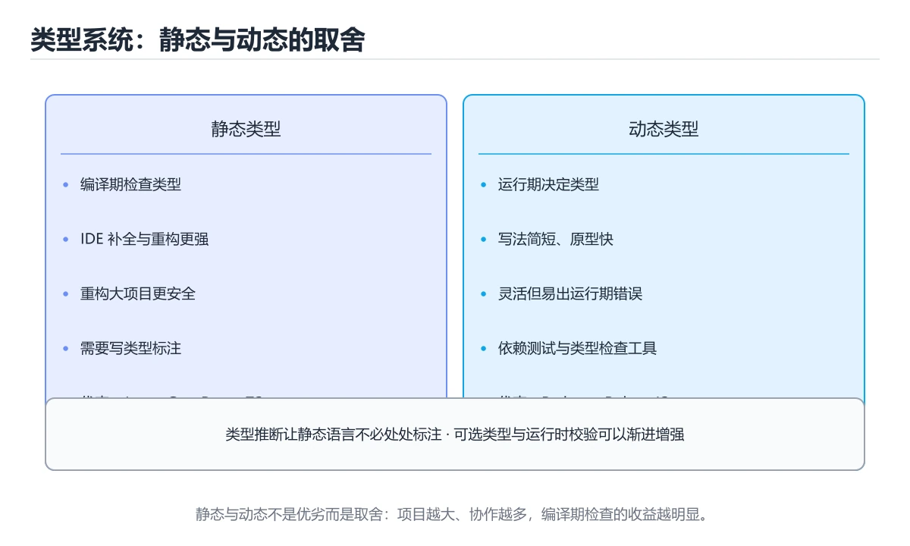

# 类型与变量：九种语言横向对照




> 内容更新时间：2026-10-06 · 学习阶段：入门 · 预计用时：55 分钟

## 本节知识框架

**课程定位**：所属分类为「跨语言对照」，课程主题为「类型与变量：九种语言横向对照」，学习阶段为「入门」，建议用时 55 分钟。

**本课要解决的主问题**：静态与动态、可变与不可变、空值表达的横向对照。

| 学习层次 | 要回答的问题 | 完成判据 |
| --- | --- | --- |
| 概念层 | 「类型与变量：九种语言横向对照」有哪些必须区分的对象与术语？ | 能用自己的话定义核心术语，并各举一个正例和一个反例。 |
| 机制层 | 这些对象按什么顺序发生作用，输入如何变成输出？ | 能画出或写出机制步骤，并说明每一步的失败条件。 |
| 应用层 | 什么场景适合使用「类型与变量：九种语言横向对照」，什么场景不适合？ | 能给出一个真实场景、一个最小示例和一个边界案例。 |
| 性能层 | 时间、空间、吞吐或延迟受哪些量影响？ | 能说出复杂度或性能瓶颈的证据来源；没有证据时明确写“材料未提供”。 |
| 复习层 | 怎样确认自己不是只记住了结论？ | 能独立完成本课自测，并把错误定位到概念、机制、示例或边界。 |

### 阅读路线

1. 先读「核心概念定义」，建立「类型系统」等对象的精确定义。
2. 再读「原理与运行机制」，把定义串成可重复的过程。
3. 用「代码/协议/SQL 示例」验证过程，并只改一个条件观察结果变化。
4. 最后检查性能、易错点、知识关系与自测题，形成可复习的证据链。

**前置知识**：《九种语言的第一个程序》

**学习位置**：本课位于《九种语言的第一个程序》之后；如果前一课的自测不能通过，应先回补再继续。

**后续衔接**：下一课《集合类型：九种语言横向对照》会继续使用本课术语，学完后建议立即完成一次自测。

**教材衔接：学习目标**

- 能用自己的话解释类型与变量：九种语言横向对照解决了什么问题，而不是只背术语。
- 能说清 「类型系统」、「变量」、「不可变」、「空值」 之间的关系，并分别举出一个例子。
- 能把 类型系统 放回「类型与变量：九种语言横向对照」的知识体系，说明它和 变量 的边界。
- 能完成本课练习，并用验收标准检查自己的结果。

> 一句话摘要：静态与动态、可变与不可变、空值表达的横向对照。

**教材衔接：前置知识**

- 先完成上一课《九种语言的第一个程序》；如果已经掌握，可以直接用本课练习自测。
- 本课阶段：入门。只需要基本计算机操作，不要求编程经验。
- 开始前先复习：类型系统、变量、不可变。
- 如果 一句话目标 这一步看不懂，先记录具体卡点，再用 TypeError 复现一遍。

**教材衔接：本课小结**

- **类型越严格，越早暴露问题**：Rust、Go、TypeScript 严格模式属于这一类。
- **类型越宽松，写得越快、坑也越多**：JavaScript、Shell 属于这一类。
- 判断一门语言对新手是否友好，可以先看它「字符串加数字」会发生什么。

## 核心概念定义

> 在阅读《类型与变量：九种语言横向对照》时，术语第一次出现先给操作性定义，再给边界；正文说法与这里冲突时，以定义和可复现示例为准。

| 术语 | 操作性定义 | 本课中的边界 |
| --- | --- | --- |
| 变量 | 类型与变量：九种语言横向对照解决了什么问题，而不是只背术语。 | 仅在「类型与变量：九种语言横向对照」明确给出的输入、版本与资源条件下成立。 |
| 不可变 | 对象创建后状态不再改变，更新时生成新对象，从而减少共享状态和并发错误。 | 仅在「类型与变量：九种语言横向对照」明确给出的输入、版本与资源条件下成立。 |
| 装箱与拆箱 | 值类型转成堆上对象再取回，每次都会分配或复制，是循环里常见的隐形开销。 | 仅在「类型与变量：九种语言横向对照」明确给出的输入、版本与资源条件下成立。 |
| 隐式转换 | 编译器自动完成的类型转换，可能静默丢精度或改变比较结果，跨类型运算时要显式写清。 | 仅在「类型与变量：九种语言横向对照」明确给出的输入、版本与资源条件下成立。 |

### 定义如何使用

在「类型与变量：九种语言横向对照」中判断一个说法是否成立，先确认它使用的是哪个对象的定义，再检查输入规模、运行环境与失败路径。定义不是口号，而是后续推导、代码示例和自测题共享的约束。

**教材衔接：变量声明对照**

| 语言 | 可变变量 | 不可变 | 类型标注 |
| --- | --- | --- | --- |
| Python | `x = 1` | 无语法强制（约定全大写） | 可选：`x: int = 1` |
| JavaScript | `let x = 1` | `const x = 1` | 无 |
| TypeScript | `let x: number = 1` | `const x: number = 1` | 有，编译期检查 |
| Java | `int x = 1;` | `final int x = 1;` | 必须写 |
| C# | `int x = 1;` | `const int X = 1;` | 必须写，可用 `var` 推断 |
| C++ | `int x = 1;` | `const int x = 1;` | 必须写，可用 `auto` 推断 |
| Go | `x := 1` | `const X = 1` | 可用 `:=` 推断 |
| Rust | `let mut x = 1;` | `let x = 1;`（默认不可变） | 可推断，函数签名必须写 |
| Shell | `x=1` | `readonly x=1` | 无类型概念 |

**教材衔接：类型系统的四个维度**

| 维度 | 说明 | 例子 |
| --- | --- | --- |
| 静态 / 动态 | 类型在编译期还是运行时确定 | Java 静态，Python 动态 |
| 强 / 弱 | 是否允许隐式跨类型转换 | Python 偏强，JavaScript 偏弱 |
| 显式 / 推断 | 是否必须手写类型 | Java 必须，Go 与 Rust 可推断 |
| 可变 / 不可变 | 默认能否重新赋值 | Rust 默认不可变，其它多默认可变 |

**教材衔接：补充：类型转换矩阵、装箱与类型推断**

### 隐式转换与显式转换对照

| 语言 | 是否允许隐式转换 | 显式转换写法 | 典型陷阱 |
| --- | --- | --- | --- |
| Python | 近似不允许（数字间除外） | `int(x)`、`str(x)` | `int("3.5")` 报错，要先 `float` |
| JavaScript | **大量隐式转换** | `Number(x)`、`String(x)` | `"1" + 1` 得到 `"11"` |
| TypeScript | 编译期拦截大部分 | `as`、`Number()` | 断言不改运行时数据 |
| Java | 小范围到大范围自动 | `(int) longValue` | 超范围强转会截断 |
| C# | 同上，另有 `checked` | `(int)longValue`、`Convert.ToInt32` | 溢出默认不报错 |
| C++ | 大量隐式（含构造转换） | `static_cast<int>(x)` | 类型提升导致重载选错 |
| Go | **不允许隐式数值转换** | `float64(n)` | 编译直接报错，最安全 |
| Rust | 不允许隐式转换 | `x as f64`、`From`/`Into` | `as` 会截断，需手动检查 |
| Shell | 一切皆字符串 | `$(( ))` 做算术 | 比较符号需区分字符串与数值 |

```text
安全排序（从严格到宽松）
  Rust / Go  >  Java / C# / TypeScript  >  C++  >  JavaScript / Shell
越严格的语言，越早暴露问题，但需要写更多转换代码
```

### 装箱与拆箱：包装类的开销

```java
// Java：基本类型与包装类之间的自动转换
Integer boxed = 42;          // 装箱：int → Integer（堆上对象）
int unboxed = boxed;         // 拆箱：Integer → int

Integer a = 127, b = 127;
System.out.println(a == b);  // true（-128~127 有缓存）
Integer c = 128, d = 128;
System.out.println(c == d);  // false（超出缓存，两个对象）
```

| 影响 | 说明 |
| --- | --- |
| 内存 | 每个包装对象有对象头开销 |
| 性能 | 频繁装箱在热路径上会显著变慢 |
| 空值 | 包装类可能为 `null`，拆箱会抛空指针 |

**建议**：热路径用基本类型；泛型与可空场景才用包装类，且比较一律用 `equals`。

### 类型推断：四种写法

| 语言 | 推断写法 | 推断时机 | 注意 |
| --- | --- | --- | --- |
| Java | `var list = new ArrayList<String>()` | 编译期 | 只能用于局部变量 |
| C# | `var user = new User()` | 编译期 | 不等于 `dynamic` |
| C++ | `auto p = std::make_unique<T>()` | 编译期 | 需要引用要写 `auto&` |
| Go | `n := 42` | 编译期 | 只能用在函数内 |
| Rust | `let x = 5;` | 编译期 | 默认 `i32`，需要时标注 |
| Kotlin | `val x = 5` | 编译期 | 与 `var` 区分可变性 |
| TypeScript | `const x = 5` | 编译期 | `as const` 可收窄为字面量 |

```text
推断的三个好处与一个风险
  好处：少写类型、重构时自动跟随、泛型调用更简洁
  风险：类型不明显时降低可读性

经验：局部变量用推断，函数签名与公共 API 写全类型
```

### 类型别名的三种用法

```typescript
// TypeScript
type UserId = string;                    // 语义化别名
type Result<T> = { ok: true; data: T } | { ok: false; error: string };
type Status = "pending" | "done";        // 联合字面量
```

```rust
// Rust：用 newtype 模式避免语义混淆
struct UserId(u64);
struct OrderId(u64);
// 两者不能互相赋值，编译器帮你挡住「把订单 ID 当用户 ID 用」
```

```go
// Go：类型别名 vs 新类型
type UserID = int64        // 别名：与 int64 完全等价
type OrderID int64         // 新类型：需要显式转换
```

### 类型检查发生在什么时候

| 语言 | 检查时机 | 运行时能否发现类型错误 |
| --- | --- | --- |
| TypeScript | 编译期（转译后类型消失） | 不能 |
| Java / C# | 编译期 + 运行时（反射、强转） | 能（ClassCastException） |
| Rust | 编译期 | 基本不能（类型擦除后仍安全） |
| Go | 编译期 + 运行时断言 | 能（类型断言失败） |
| Python / JavaScript | 运行时 | 能（TypeError） |

```text
结论：无论哪种语言，外部输入都要做运行时校验。
TypeScript 的 interface 不会帮你在运行时挡住脏数据。
```

### 自查清单

- [ ] 说得清自己常用语言的隐式转换规则
- [ ] 知道包装类比较必须用 equals
- [ ] 热路径避免频繁装箱
- [ ] 局部变量用推断，公共 API 写全类型
- [ ] 外部输入一律做运行时校验

**教材衔接：深入补充：类型与变量：九种语言横向对照 的取舍与边界**

### 一、把概念放回真实约束

学习类型与变量：九种语言横向对照时，最容易只记住结论而忽略前提。先写出三个约束：数据规模、时间预算、可接受的失败方式；再判断 类型系统 与 变量 在这些约束下是否仍然成立。只要约束改变，原来的最优解就可能变成错误解。

| 维度 | 类型系统 的典型写法 | 另一种语言的等价写法 | 迁移时最易踩的坑 |
| --- | --- | --- | --- |
| 错误处理 | 显式返回或抛出 | 异常或结果类型 | 错误被静默吞掉 |
| 并发模型 | 线程、协程或事件循环 | 运行时调度不同 | 共享状态与取消语义 |
| 依赖管理 | 官方包管理器 | 生态与锁文件不同 | 版本解析结果不一致 |

### 二、三个容易混淆的边界

1. 澄清输入与目标。先写清「类型与变量：九种语言横向对照」要解决的问题、合法输入范围和成功标准，再进入后续步骤。
2. **把“平均值”当成“全部”**：类型系统 的指标好看，不代表尾部请求、冷启动或失败重试也好看。
3. **把“当前版本”当成“永久行为”**：变量 依赖的默认值、API 或性能特征都可能随版本变化，需要固定版本并保留回归用例。

### 三、一个生产场景

假设团队要在真实系统里使用类型与变量：九种语言横向对照：第一周先做小流量验证，记录 类型系统 的基线与异常；第二周扩大输入规模，观察 变量 是否成为瓶颈；第三周再做故障演练，主动注入超时、重复请求和依赖不可用，确认系统能降级、能重试、能恢复。每一步都要留下指标、日志和结论，而不是只留下“感觉更快了”。

### 四、自测清单

- 能否用一句话说出类型与变量：九种语言横向对照解决的核心问题与不适用场景？
- 能否画出 类型系统 的数据流或状态变化，并标出失败路径？
- 构造一个 变量 的反例，证明「总是成立」的说法不成立。
- 能否写出一条可复现的验证命令，让别人独立得到相同结论？

### 五、跨语言迁移清单

在本课的迁移练习里，先列出 类型系统 在两种语言中的类型、错误处理、并发模型和内存管理差异；再用同一个输入各写一版最小实现，比较编译或运行时的错误信息。最后记录 变量 在两种语言里的性能与可读性差异，避免只凭语法熟悉度做选型。

## 原理与运行机制

### 机制总览

1. **建立输入**：把「变量」按本课定义整理成可观察、可重复的输入条件。
2. **执行转换**：围绕「不可变」执行本课的核心步骤；每一步都记录中间状态，避免只看最终输出。
3. **产生输出**：得到「装箱与拆箱」后，用正文示例或协议/SQL 结果核对输出是否符合预期。
4. **改变一个条件**：只替换一个边界条件或环境参数，观察「类型与变量：九种语言横向对照」的结论是否仍然成立。

| 阶段 | 关注对象 | 失败时应检查 |
| --- | --- | --- |
| 输入 | 变量 | 类型、范围、编码、版本或前置状态是否满足定义。 |
| 处理 | 不可变 | 顺序、可见性、锁、路由、事务或调度规则是否被破坏。 |
| 输出 | 装箱与拆箱 | 结果是否可复现，错误是否被正确传播而不是被吞掉。 |

本课的机制结论要用「类型与变量：九种语言横向对照」自己的示例验证。「类型与变量：九种语言横向对照」没有给出某个数量级、吞吐或内存数据时，本课把该判断标为“材料未提供”，不从相邻主题外推。

**教材衔接：一句话目标**

变量「怎么声明、能不能改、能不能换类型」，最能体现一门语言的性格。
本文把九种语言放在同一张表里对照。

**教材衔接：空值怎么表达**

| 语言 | 空值 | 检查方式 |
| --- | --- | --- |
| Python | `None` | `if x is None:` |
| JavaScript | `null` / `undefined` | `x == null` 或 `x === undefined` |
| TypeScript | 同 JavaScript，加 `strictNullChecks` | 用 `?.` 与 `??` |
| Java | `null` | `Optional` 或判空 |
| C# | `null`（可空引用类型） | `?.` 与 `??` |
| C++ | `nullptr` | 判空或 `std::optional` |
| Go | `nil`（仅指针、切片、map、接口等） | `if x == nil` |
| Rust | 没有 null，用 `Option<T>` | `match`、`?`、`unwrap_or` |
| Shell | 空字符串 `""` | `[[ -z "$x" ]]` |

**Rust 用类型系统消灭了空指针**：想表达「可能没有」，就必须用 `Option<T>`，编译器强制你处理。

## 典型应用场景

| 场景 | 典型输入或前提 | 期望产物 |
| --- | --- | --- |
| 学习验证 | 使用本课最小示例和 类型系统、变量 | 能复现正文结论，并解释每一步。 |
| 工程落地 | 把「类型与变量：九种语言横向对照」放入真实模块或服务边界 | 输出可观测、失败可定位、参数可配置。 |
| 故障排查 | 只改一个版本、规模、输入或依赖条件 | 能区分概念错误、实现错误和环境差异。 |

判断「类型与变量：九种语言横向对照」的场景是否成立，标准是能否写出输入、处理、输出和失败路径；材料中没有出现的数据在本课标注为“材料未提供”，不用推测替代证据。

## 代码/协议/SQL 示例

以下代码、协议或 SQL 片段来自《类型与变量：九种语言横向对照》原文，保留原有语言标记与上下文；先预测《类型与变量：九种语言横向对照》示例的输出，再按正文步骤运行或推演，示例依赖外部环境时同时记录版本与输入。

**教材衔接：数字与字符串的坑：九种语言对比**

```python
# Python：类型错误会直接抛异常
"1" + 1          # TypeError
"1" + str(1)     # "11"
int("1") + 1     # 2
```

```javascript
// JavaScript：会隐式转换，最容易踩坑
"1" + 1          // "11"（字符串拼接）
"1" - 1          // 0（转成数字）
Number("1") + 1  // 2
```

```typescript
// TypeScript：编译期就拦住
const a: number = 1;
// a + "1" 会被允许（结果为 string），但类型会变化
```

```java
// Java：字符串与数字相加会拼接，且顺序影响结果
System.out.println(1 + 2 + "a");   // "3a"
System.out.println("a" + 1 + 2);   // "a12"
```

```csharp
// C#：字符串插值是更安全的写法
Console.WriteLine($"{1 + 1}");      // "2"
```

```cpp
// C++：整数除法丢小数是最经典的坑
double a = 5 / 2;                  // 2.0，不是 2.5
double b = 5 / 2.0;                // 2.5
```

```go
// Go：类型严格，必须显式转换
var a int = 1
// var b float64 = a        // 编译错误
b := float64(a) + 1.5
```

```rust
// Rust：同样严格，整数与浮点不能混算
let a = 1i32;
let b = a as f64 + 1.5;
```

```bash
# Shell：一切皆字符串，需要算术时用 (( ))
a=1
b=$((a + 2))
echo "$b"                        # 3
echo "$a + 2"                    # 1 + 2（字符串）
```

## 时间/空间复杂度或性能分析

**复杂度证据**：「类型与变量：九种语言横向对照」的现有材料没有给出渐近时间或空间复杂度的明确结论，本课只做定性检查，不补写未经验证的 $O$ 记号。

| 维度 | 本课关注点 | 判断依据 |
| --- | --- | --- |
| 时间/延迟 | 「类型与变量：九种语言横向对照」的主要步骤是否会随输入规模、并发度或网络往返增长。 | 以正文复杂度、基准数据或可重复测量为准。 |
| 空间/内存 | 中间状态、缓存、副本、连接或索引是否随规模增长。 | 记录峰值内存与数据副本，不只看最终结果。 |
| 吞吐/资源 | 版本、调度、锁、IO、序列化或协议开销是否成为瓶颈。 | 固定环境做对照实验，改变一个变量。 |

评估「类型与变量：九种语言横向对照」时要区分“正确性成立”和“性能达标”两件事；材料没有给出基准时，本课只保留量级来源与测量方法，不写不可验证的绝对数字。

## 常见误区与易错点

> 复核《类型与变量：九种语言横向对照》的易错点时，优先保留原文的错误表、故障现场与排错路径；每条修正都要能用本课示例复验。

| 易错点 | 常见表现 | 正确做法 |
| --- | --- | --- |
| 只背结论 | 能复述「类型与变量：九种语言横向对照」的定义，却说不清输入、输出与边界。 | 回到机制步骤，用最小示例逐一验证。 |
| 混淆相邻概念 | 把本课对象与相邻主题的对象当成同一类。 | 先比较定义、资源归属、生命周期和失败模式。 |
| 忽略版本与环境 | 在开发机通过后直接外推到生产环境。 | 固定版本、输入和资源条件，再记录可复现结果。 |

**教材衔接：常见错误与排查**

> 说明：本表由《类型与变量：九种语言横向对照》的核心知识整理（2026-10-07），人工复核进度见 docs/content_review_batches.md。

| 易错点 | 容易踩的做法 | 正确结论 |
| --- | --- | --- |
| 用一门语言的类型规则套另一门 | 隐式转换与溢出行为完全不同 | 先查目标语言的数据模型与转换规则再迁移代码 |
| 忽略数值宽度与默认类型 | 整型溢出或浮点精度丢失 | 明确位宽与精度，必要时显式指定类型 |
| 把空值与缺失混为一谈 | 不同语言里空、未定义与默认值语义不同 | 明确区分空值、缺失与默认值，并在序列化时写清约定 |

**教材衔接：故障现场**

### 现场 1：用一门语言的类型规则套另一门

**症状**：在《类型与变量：九种语言横向对照》的复现场景中，隐式转换与溢出行为完全不同。

**根因**：当出现“用一门语言的类型规则套另一门”时，执行路径已经绕过了《类型与变量：九种语言横向对照》的关键约束，最终以“隐式转换与溢出行为完全不同”暴露出来；修复前必须先确认约束在哪里失效。

**修复**：针对《类型与变量：九种语言横向对照》的问题，先查目标语言的数据模型与转换规则再迁移代码。

**验证**：先在《类型与变量：九种语言横向对照》中记录“用一门语言的类型规则套另一门”留下的失败证据，再执行“先查目标语言的数据模型与转换规则再迁移代码”并重放；确认错误路径变为明确结果，且修复没有掩盖同类故障。

### 现场 2：忽略数值宽度与默认类型

**症状**：在《类型与变量：九种语言横向对照》的复现场景中，整型溢出或浮点精度丢失。

**根因**：触发点是把“忽略数值宽度与默认类型”当成安全做法。它没有满足《类型与变量：九种语言横向对照》要求的前提，因此先表现为“整型溢出或浮点精度丢失”；排查时先完整复现这一段，再核对输入、配置与依赖。

**修复**：针对《类型与变量：九种语言横向对照》的问题，明确位宽与精度，必要时显式指定类型。

**验证**：保留《类型与变量：九种语言横向对照》里触发“整型溢出或浮点精度丢失”的输入、版本和日志，按“明确位宽与精度，必要时显式指定类型”完成修改后原样重放；只有失败现象消失且相邻场景仍可解释，才保留改动。

### 现场 3：把空值与缺失混为一谈

**症状**：在《类型与变量：九种语言横向对照》的复现场景中，不同语言里空、未定义与默认值语义不同。

**根因**：“不同语言里空、未定义与默认值语义不同”只是表层结果。向上追溯会落到“把空值与缺失混为一谈”这一步，因为它省略了《类型与变量：九种语言横向对照》的约束，使实现行为和预期模型发生了偏离。

**修复**：针对《类型与变量：九种语言横向对照》的问题，明确区分空值、缺失与默认值，并在序列化时写清约定。

**验证**：先在《类型与变量：九种语言横向对照》中记录“把空值与缺失混为一谈”留下的失败证据，再执行“明确区分空值、缺失与默认值，并在序列化时写清约定”并重放；确认错误路径变为明确结果，且修复没有掩盖同类故障。

## 与其他知识点的关系

| 关系 | 课程 | 为什么 |
| --- | --- | --- |
| 先修 | 《九种语言的第一个程序》 | 本课会直接使用它的概念或操作前提。 |
| 关联 | 《集合类型：九种语言横向对照》 | 用于横向比较或把本课结论迁移到相邻主题。 |
| 前置顺序 | 《九种语言的第一个程序》 | 同分类中安排在本课之前，建议先完成其自测。 |
| 后续顺序 | 《集合类型：九种语言横向对照》 | 同分类中安排在本课之后，会继续使用本课术语。 |

把「类型与变量：九种语言横向对照」放回知识体系时，不只要记住“前面学过什么”，还要说明两个主题在输入、机制、资源边界和失败模式上的差异。这样才能把单课知识迁移到项目、排障和后续课程。

## 自测题与参考答案

> 先独立完成《类型与变量：九种语言横向对照》的自测，再核对答案与解析。答案必须能在本课正文或示例中找到依据，不能只凭语感。

### 自测 1

按“类型与变量：九种语言横向对照”中 类型系统、变量、不可变 的实践顺序，把四个步骤排成从准备到复盘的合理顺序。

A. 写出最小示例并核对 变量 的基线结果
B. 只改一个变量，记录边界与失败路径的变化
C. 固定版本与证据，把“类型与变量：九种语言横向对照”的结论写成可复现记录
D. 先明确 类型系统 的输入、输出与约束

**参考答案**：先明确 类型系统 的输入、输出与约束 → 写出最小示例并核对 变量 的基线结果 → 只改一个变量，记录边界与失败路径的变化 → 固定版本与证据，把“类型与变量：九种语言横向对照”的结论写成可复现记录

**解析**：在「类型与变量：九种语言横向对照」里，在本课的练习里，顺序应当是：先明确 类型系统 的输入、输出与约束 → 写出最小示例并核对 变量 的基线结果 → 只改一个变量，记录边界与失败路径的变化 → 固定版本与证据，把本课的结论写成可复现记录。这个顺序把 类型系统 的输入、输出和约束放在最前面，在类型与变量：九种语言横向对照里避免概念没对齐就开始调参。第二步用 变量 建立可核对的基线，在类型与变量：九种语言横向对照里第三步才允许改变一个变量并观察失败路径。

### 自测 2

在 JavaScript 中，表达式 "1" + 1 的结果是？

A. 抛出类型错误
B. undefined
C. 2
D. "11"

**参考答案**："11"

**解析**：加号在 JavaScript 中遇到字符串就执行拼接，因此结果是字符串 "11"。作答时，先用类型系统建立输入与输出的基线，再把"11"代入边界条件核对，结论才能复现。在「类型与变量：九种语言横向对照」里判断这道题，要把类型系统、变量、不可变的条件、过程与失败路径逐项对齐，换成“在 JavaScript 中”这个场景，只有满足前提的结论才成立。

### 自测 3

阅读「类型与变量：九种语言横向对照」的代码片段，下面哪项判断是正确的？

```python
# Python：类型错误会直接抛异常
"1" + 1          # TypeError
"1" + str(1)     # "11"
int("1") + 1     # 2
```

A. Go
B. Rust
C. JavaScript
D. Python

**参考答案**：Rust

**解析**：Rust 的 let 默认不可变，必须写 let mut 才能修改。这道题的关键在「类型与变量：九种语言横向对照」的类型系统、变量、不可变：先确认题干“阅读类型与变量”问的是哪一步，再排除偷换前提的选项。把“Rust”代回「类型与变量：九种语言横向对照」里“阅读类型与变量”的例子核对，条件一旦改变，结论就要用类型系统、变量、不可变重新推导。

**教材衔接：动手练习**

> 本课练习重点：围绕「类型系统、变量、不可变」完成复述、实验和交付，每个结果都要能被别人检查。

用两种语言实现同一行为，再对比语法、错误、性能和生态差异。

### 练习 1：建立心智模型（10 分钟）

合上教程，用 3～5 句话回答：

1. 类型与变量：九种语言横向对照解决了什么问题？
2. 如果没有它，会出现什么具体后果？
3. 它和「变量」是什么关系？

验收标准：说明 类型系统 与 变量 的分工，并写出一个失效场景。

### 练习 2：做一次可控实验（20 分钟）

从正文中选一个最小示例，完成以下操作：

1. 先预测修改一个参数、输入或步骤后的结果。
2. 再实际执行或逐步推演，记录真实结果。
3. 如果结果与预测不同，写出差异原因。

**验收标准**：先在「一句话目标」里找一个可运行的最小输入，再按五步法记录类型系统的影响；预测与结果不一致时补写被忽略的前提。

### 练习 3：交付一个小结果（30 分钟）

选两种语言实现 类型系统 的同一行为，列出语法、错误处理与生态差异。

任务要求：

- 结果必须能被别人检查，不能只写“我已经理解了”。
- 至少覆盖「类型系统」和「变量」两个关键词。
- 写出 1 个仍然不确定的问题，以及下一步如何验证。

> 提示：时间有限时优先做练习 1 和练习 2；练习 3 可以拆成两次完成。

**教材衔接：可运行练习**

### 任务 1：先跑通，再解释

```bash
# Shell：一切皆字符串，需要算术时用 (( ))
a=1
b=$((a + 2))
echo "$b"                        # 3
echo "$a + 2"                    # 1 + 2（字符串）
```

**预期输出**：$a + 2

### 任务 2：只改一个条件

把「类型与变量：九种语言横向对照」的最小示例复制一份，只改一个条件再跑一次：

- 改动点：把 变量 换成边界值，其他输入保持原样。
- 预测：先写下「类型与变量：九种语言横向对照」在改动后的输出或错误信息，再运行。
- 记录：对照改动前后的结果，指出差异出在哪一步。
- 验收：换回原条件能复现原结果，改动只影响类型系统。

### 任务 3：迁移到自己的数据

用同一套思路处理一组你自己的 类型系统 数据，保持输出格式与任务 1 一致。

**教材衔接：本课复习清单**

离开本课前，逐项确认：

- [ ] 不看解析，能说出「哪门语言的变量默认不可变，需要显式加关键字才能修改？」的判断依据。
- [ ] 不看解析，能说出「在 JavaScript 中，表达式 "1" + 1 的结果是？」的判断依据。
- [ ] 不看解析，能说出「哪门语言用类型系统彻底消灭了空指针？」的判断依据。
- [ ] 不看解析，能说出「关于整数除法，下面哪个说法正确？」的判断依据。
- [ ] 用 类型系统 构造一个正常输入和一个边界输入，分别记录输出与判断依据。
- [ ] 把本课最容易混淆的两个概念写成一句话对照。

| 复盘项 | 记录 |
| --- | --- |
| 已经能独立解释的考点 |  |
| 仍然说不清的概念 |  |
| 下一步验证动作 |  |

**教材衔接：复习与自测**

- [ ] 能说清「一句话目标」的结论，并说出它的适用边界。
- [ ] 能用自己的话复述「变量声明对照」，并各举一个正例和反例。
- [ ] 能解释「类型系统的四个维度」里最容易混淆的两个概念。
- [ ] 能不看正文写出「数字与字符串的坑：九种语言对比」的关键步骤。
- [ ] 能用一句话说明「空值怎么表达」解决什么问题。
- [ ] 能把「隐式转换与显式转换对照」的判断标准套到一个新例子上。

---

## 术语速查

| 术语 | 一句话说明 |
| --- | --- |
| `变量` | 类型与变量：九种语言横向对照解决了什么问题，而不是只背术语。 |
| `不可变` | 对象创建后状态不再改变，更新时生成新对象，从而减少共享状态和并发错误。 |
| `装箱与拆箱` | 值类型转成堆上对象再取回，每次都会分配或复制，是循环里常见的隐形开销。 |
| `隐式转换` | 编译器自动完成的类型转换，可能静默丢精度或改变比较结果，跨类型运算时要显式写清。 |

## 考点精讲

### 考点 1：顺序排列·类型系统

- **题目**：按“类型与变量：九种语言横向对照”中 类型系统、变量、不可变 的实践顺序，把四个步骤排成从准备到复盘的合理顺序。
- **判断依据**：在「类型与变量：九种语言横向对照」里，在本课的练习里，顺序应当是：先明确 类型系统 的输入、输出与约束 → 写出最小示例并核对 变量 的基线结果 → 只改一个变量，记录边界与失败路径的变化 → 固定版本与证据，把本课的结论写成可复现记录。这个顺序把 类型系统 的输入、输出和约束放在最前面，在类型与变量：九种语言横向对照里避免概念没对齐就开始调参。第二步用 变量 建立可核对的基线，在类型与变量：九种语言横向对照里第三步才允许改变一个变量并观察失败路径。

### 考点 2：概念判断·类型系统

- **题目**：在 JavaScript 中，表达式 "1" + 1 的结果是？
- **判断依据**：加号在 JavaScript 中遇到字符串就执行拼接，因此结果是字符串 "11"。作答时，先用类型系统建立输入与输出的基线，再把"11"代入边界条件核对，结论才能复现。在「类型与变量：九种语言横向对照」里判断这道题，要把类型系统、变量、不可变的条件、过程与失败路径逐项对齐，换成“在 JavaScript 中”这个场景，只有满足前提的结论才成立。

### 考点 3：概念判断·类型系统

- **题目**：哪门语言用类型系统彻底消灭了空指针？
- **判断依据**：Rust 没有 null，要表达「可能没有」必须使用 Option<T>，编译器强制处理所有分支。「Java」、「C#」、「C++」都保留了 null 或 nullptr，需要开发者自觉判空，只是 C# 通过可空引用类型提供了额外警告。“哪门语言用类型系统彻底消灭了空指针”与「类型与变量：九种语言横向对照」的术语表相呼应，只有符合类型系统、变量、不可变约束的“Rust”才是正文支持的结论。

### 考点 4：概念判断·类型系统

- **题目**：关于整数除法，下面哪个说法正确？
- **判断依据**：在「类型与变量：九种语言横向对照」里，结论应落在「C++，Java，Go」。多数静态类型语言在两个整数相除时执行整除，结果被截断。在「类型与变量：九种语言横向对照」里，这道题要求区分概念与边界，「C++，Java，Go」只有在题干给出的前提下才成立，而「所有语言的 5 / 2 都等于 2.5」、「只有 Python 会丢小数」缺少同一组条件。

### 考点 5：排错·类型系统

- **题目**：阅读「类型与变量：九种语言横向对照」的代码片段，下面哪项判断是正确的？
- **判断依据**：Rust 的 let 默认不可变，必须写 let mut 才能修改。这道题的关键在「类型与变量：九种语言横向对照」的类型系统、变量、不可变：先确认题干“阅读类型与变量”问的是哪一步，再排除偷换前提的选项。把“Rust”代回「类型与变量：九种语言横向对照」里“阅读类型与变量”的例子核对，条件一旦改变，结论就要用类型系统、变量、不可变重新推导。

### 考点 6：多选辨析·类型系统

- **题目**：关于「类型与变量：九种语言横向对照」，下列哪些说法是正确的？（多选）
- **判断依据**：在「类型与变量：九种语言横向对照」里，"11"。本课的两个判断点可以互相印证：Rust 的 let 默认不可变，必须写 let mut 才能修改。静态与动态、可变与不可变、空值表达的横向对照。“类型与变量”与「类型与变量：九种语言横向对照」的术语表相呼应，只有符合类型系统、变量、不可变约束的“"11"”才是正文支持的结论。

## English Overview

**Title:** Types and Variables Across Languages

**Summary:** Static vs dynamic typing, mutability and null handling compared.

**Category:** Cross-Language Comparison
**Level:** 入门
**Key terms:** 类型系统, 变量, 不可变, 空值, 类型推断

## 内容元数据

- 内容版本：v2.0
- 最后更新：2026-10-06
- 学习阶段：入门
- 适用环境：九种主流语言生态横向对照
；本课聚焦 类型系统。
- 内容来源：内置结构化课程与工程实践整理
- 相关主题：类型系统、变量、不可变、空值、类型推断
- 质量版本：P0 测验标准 + P1 覆盖扩展 + P2 体验补全

## 参考资料与复核

- 最后复核：2026-10-04
- 下次复核：2027-07-17
- 复核范围：版本兼容、API 行为、安全建议与工程实践
- 来源性质：官方文档、标准或权威教材；正文为离线教学重组

| 参考资料 | 本课用途 |
| --- | --- |
| [DevDocs](https://devdocs.io/) | 多语言 API 快速检索 |
| [Exercism](https://exercism.org/docs) | 多语言练习与反馈 |
| [Rosetta Code](https://rosettacode.org/wiki/Rosetta_Code) | 同一任务的跨语言实现 |

> 「类型与变量：九种语言横向对照」的链接用于离线阅读后的延伸核对；App 不会自动联网。
