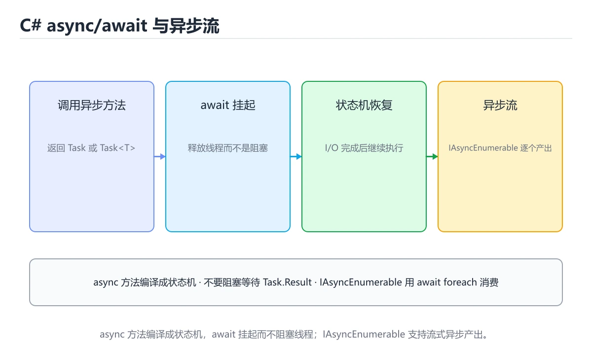
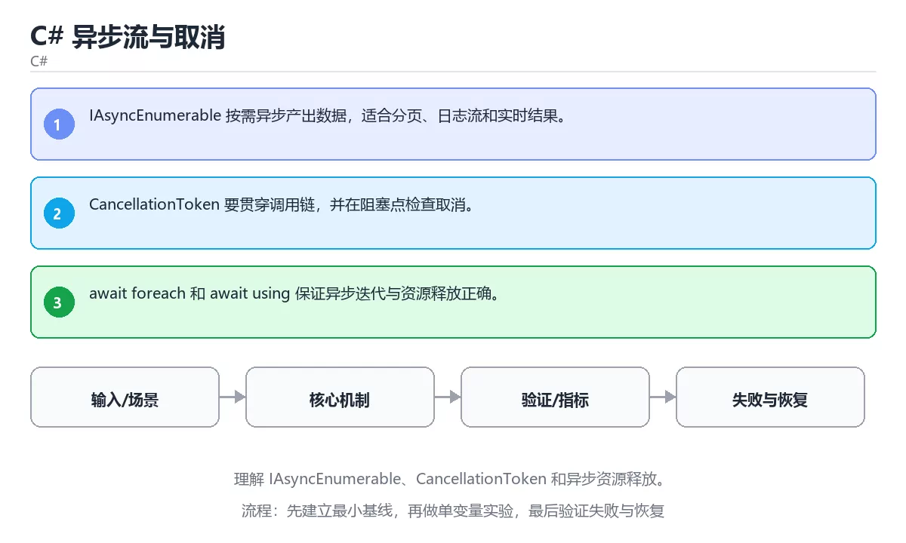

# C# 异步流与取消

> 内容更新时间：2026-10-06 · 学习阶段：高级 · 预计用时：35 分钟





## 学习目标

- 能用自己的话解释：IAsyncEnumerable 按需异步产出数据，适合分页、日志流和实时结果。
- 能用自己的话解释：CancellationToken 要贯穿调用链，并在阻塞点检查取消。
- 能用自己的话解释：await foreach 和 await using 保证异步迭代与资源释放正确。
- 能把本课知识放回「C#」，并完成练习与测验。

## 前置知识

- 具备本分类的前置知识，能跑通「C# 异步流与取消」的示例并解释输出。
- 本课关键词：IAsyncEnumerable、CancellationToken、异步流、取消。
- 遇到不熟悉的术语先记录问题，完成练习后再回读。

## 核心知识

### 1. IAsyncEnumerable 按需异步产出数据，适合分页、日志流和实时结果。

- 关键做法：先用 IAsyncEnumerable 建立 IAsyncEnumerable 的基线，再逐步加入边界与失败条件。
- 验证标准：IAsyncEnumerable 的输出能被他人复现，边界输入有对应用例。

### 2. CancellationToken 要贯穿调用链，并在阻塞点检查取消。

把这条结论放回「C# 异步流与取消」的完整流程里展开：

- 正文依据：能用自己的话解释：IAsyncEnumerable 按需异步产出数据，适合分页、日志流和实时结果。
- 落地检查：把「2. CancellationToken 要贯穿调用链，并在阻塞点检查取消。」改写成一条可执行的核对项，逐条验证输入、超时与失败路径。

### 3. await foreach 和 await using 保证异步迭代与资源释放正确。

把这条结论放回「C# 异步流与取消」的完整流程里展开：

- 正文依据：能用自己的话解释：CancellationToken 要贯穿调用链，并在阻塞点检查取消。
- 落地检查：把「3. await foreach 和 await using 保证异步迭代与资源释放正确。」改写成一条可执行的核对项，逐条验证输入、超时与失败路径。

## 关键流程

```text
输入 → 校验 → 核心处理 → 验证 → 记录指标 → 失败恢复
```

## 实践路径

1. 用一句话复述本课要解决的问题。
2. 跑通正文中的最小示例并记录基线。
3. 只改变一个输入或参数，预测并验证结果。
4. 补一个失败路径，记录错误、恢复和指标。
5. 把结论写成可复现的笔记或测试。

## 常见错误与排查

> 说明：本表由《C# 异步流与取消》的核心知识整理（2026-10-07），人工复核进度见 docs/content_review_batches.md。

| 易错点 | 容易踩的做法 | 正确结论 |
| --- | --- | --- |
| 用 async void 代替 async Task | 异常无法被捕获，调用方也无法等待 | 除事件处理器外一律返回 Task 或 ValueTask |
| 忘记传递取消令牌 | 客户端断开后后台任务还在继续跑 | 把 CancellationToken 一路传到最底层调用 |
| 异步流里阻塞等待 | 线程被占用，吞吐明显下降 | 用 await foreach 与异步 API，避免 Result 和 Wait |

## 动手练习

1. 合上教程，用 3～5 句话解释C# 异步流与取消。
2. 从正文选一个例子，改变一个条件并预测结果。
3. 设计一个失败场景，写出止损与恢复步骤。

**验收标准**：留下输入、命令、输出、差异和下一步问题。

## 本课小结

- 本课围绕 IAsyncEnumerable、CancellationToken、异步流、取消 展开，复习时重点核对它们的输入、输出和失败路径。
- 把还不确定的 IAsyncEnumerable 行为写成一条可执行验证，再进入下一课。


## 可运行练习

本节围绕C# 异步流与取消安排 3 个可交付任务，每个任务都要求留下可以复查的记录。

### 任务 1：用自己的话画出结构

不看书，用一张图说清「C# 异步流与取消」的结构，画完再对照骨架：

- 主干：核心知识 → 交付物 → 验收标准 → 复盘
- 连接线：在每条边上标出输入、输出与失败路径。
- 自检：能否用一句话说明IAsyncEnumerable与CancellationToken的关系？

### 任务 2：做一次对比实验

**验收标准**：两个方案至少在一个输入上给出不同结果；把差异归因到IAsyncEnumerable，而不是笼统地写「性能更好」。

### 任务 3：迁移到自己的场景

**验收标准**：换一个人按你的记录重跑 IAsyncEnumerable，能得到相同输出；得不到就补写缺失的前提。

## 故障现场

### 现场 1：用 async void 代替 async Task

**症状**：在《C# 异步流与取消》的复现场景中，异常无法被捕获，调用方也无法等待。

**根因**：触发点是把“用 async void 代替 async Task”当成安全做法。它没有满足《C# 异步流与取消》要求的前提，因此先表现为“异常无法被捕获，调用方也无法等待”；排查时先完整复现这一段，再核对输入、配置与依赖。

**修复**：针对《C# 异步流与取消》的问题，除事件处理器外一律返回 Task 或 ValueTask。

**验证**：在《C# 异步流与取消》中按“除事件处理器外一律返回 Task 或 ValueTask”调整后，从“用 async void 代替 async Task”的触发条件重放同一条路径，确认“异常无法被捕获，调用方也无法等待”不再出现，并补一个相邻边界用例检查没有引入新问题。

### 现场 2：忘记传递取消令牌

**症状**：在《C# 异步流与取消》的复现场景中，客户端断开后后台任务还在继续跑。

**根因**：触发点是把“忘记传递取消令牌”当成安全做法。它没有满足《C# 异步流与取消》要求的前提，因此先表现为“客户端断开后后台任务还在继续跑”；排查时先完整复现这一段，再核对输入、配置与依赖。

**修复**：针对《C# 异步流与取消》的问题，把 CancellationToken 一路传到最底层调用。

**验证**：保留《C# 异步流与取消》里触发“客户端断开后后台任务还在继续跑”的输入、版本和日志，按“把 CancellationToken 一路传到最底层调用”完成修改后原样重放；只有失败现象消失且相邻场景仍可解释，才保留改动。

### 现场 3：异步流里阻塞等待

**症状**：在《C# 异步流与取消》的复现场景中，线程被占用，吞吐明显下降。

**根因**：“线程被占用，吞吐明显下降”只是表层结果。向上追溯会落到“异步流里阻塞等待”这一步，因为它省略了《C# 异步流与取消》的约束，使实现行为和预期模型发生了偏离。

**修复**：针对《C# 异步流与取消》的问题，用 await foreach 与异步 API，避免 Result 和 Wait。

**验证**：在《C# 异步流与取消》中按“用 await foreach 与异步 API，避免 Result 和 Wait”调整后，从“异步流里阻塞等待”的触发条件重放同一条路径，确认“线程被占用，吞吐明显下降”不再出现，并补一个相邻边界用例检查没有引入新问题。

## 版本与时效

- C# 版本随 SDK 演进，升级前把 CancellationToken 的兼容性纳入检查清单。
- 主构造函数与集合表达式会影响 IAsyncEnumerable 的写法，升级时先小范围替换。
- 升级前确认 IAsyncEnumerable 的兼容范围，把不可回退的改动单独拆成一次提交。
- 官方说明：https://learn.microsoft.com/dotnet/core/whats-new/

### 升级检查清单

- 先固定当前版本，跑通全部示例与测验，再升级工具链。
- 一次只改一个版本条件，把 IAsyncEnumerable 相关的差异单独记成一条结论。
- 升级后重点回归 IAsyncEnumerable 的默认值、警告信息与错误格式。
- 升级后把 IAsyncEnumerable 的实测版本写进「内容元数据」，再更新复核日期。

## 本课复习清单


离开本课前，逐项确认：

- [ ] 不看解析，能说出「关于「IAsyncEnumerable 按需异步产出数据，适合分页、日志流和实时结果。」，下列说法正确的是？」的判断依据。
- [ ] 不看解析，能说出「围绕“C# 异步流与取消”中的 IAsyncEnumerable、CancellationToken、异步流，下列哪两项是本课强调的实践判断？」的判断依据。
- [ ] 不看解析，能说出「阅读「C# 异步流与取消」正文里的这段 C# 代码，下面哪一项判断是正确的？」的判断依据。
- [ ] 至少运行一次《C# 异步流与取消》的示例，记录输入、输出和一个边界情况。
- [ ] 把本课最容易混淆的两个概念写成一句话对照。

| 复盘项 | 记录 |
| --- | --- |
| 已经能独立解释的考点 |  |
| 仍然说不清的概念 |  |
| 下一步验证动作 |  |

## 复习与自测

逐节自检：能说清 IAsyncEnumerable 的输入、输出与失败路径才算通过，否则回到原文。

### 核心知识

自检：这一节与相邻主题的边界在哪里？

### 动手练习

自检：如果去掉这一节里的一个前提，结论会怎样变化？

### 最小可运行示例

```csharp
async IAsyncEnumerable<int> Countdown(int from)
{
    for (int i = from; i > 0; i--)
    {
        await Task.Delay(10);
        yield return i;
    }
}

await foreach (var value in Countdown(3))
```

自检：把这一节讲给没学过的人，最需要强调哪一点？

### 预期输出

```text
3
2
1
```

### 验证步骤

制造一次错误输入，记录错误信息与修复方式。
### 追问 1：关于「IAsyncEnumerable 按需异步产出数据，适合分页、日志流和实时结果。」，下列说法正确的是？

- 先写下判断，再对照：IAsyncEnumerable 按需异步产出数据，适合分页、日志流和实时结果。
- 检查点：CancellationToken 的结论依赖哪一个隐含前提？

### 追问 2：关于「CancellationToken 要贯穿调用链，并在阻塞点检查取消。」，下列说法正确的是？

- 先写下判断，再对照：CancellationToken 要贯穿调用链，并在阻塞点检查取消。

## 术语速查

| 术语 | 一句话说明 |
| --- | --- |
| `IAsyncEnumerable` | C# 中按需异步产生多个值的流式接口，可配合 await foreach。 |
| `CancellationToken` | 用一句话说明「C# 异步流与取消」解决什么问题：理解 IAsyncEnumerable、CancellationToken 和异步资源释放。 |
| `异步流` | 按时间依次产出多个值的数据序列，消费者可以逐项等待和处理。 |
| `取消` | 在任务不再需要时停止协程、请求或后台工作并释放资源。 |

## 零基础精讲：把C# 异步流与取消真正讲透

### 先建立一个直觉

本课的摘要可以当作一张地图：理解 IAsyncEnumerable、CancellationToken 和异步资源释放。

### 逐步拆解

1. 澄清输入与目标。先写清「C# 异步流与取消」要解决的问题、合法输入范围和成功标准，再进入后续步骤。
2. 描述处理过程。把「IAsyncEnumerable、CancellationToken、异步流、取消」映射到具体步骤，每步都要求能单独验证。
3. 定义输出。明确 IAsyncEnumerable 与 CancellationToken 各自的产物，以及失败时留下什么证据。
4. 制造一次CancellationToken的失败输入，确认错误出现在「核心知识」的哪一步，并写下恢复后如何验证状态已回到一致。
5. 把「核心知识」里的最小示例抄成 IAsyncEnumerable 一行的输入，先手算结果再执行，确认两者一致。

### 把正文串成一条执行链

- **1. IAsyncEnumerable 按需异步产出数据，适合分页、日志流和实时结果。**：在「C# 异步流与取消」里，「1. IAsyncEnumerable 按需异步产出数据，适合分页、日志流和实时结果。」这一步要先写清输入与预期，再记录实际结果和差异；结果不符时回到对应小节核对前提。
- **2. CancellationToken 要贯穿调用链，并在阻塞点检查取消。**：在「C# 异步流与取消」里，「2. CancellationToken 要贯穿调用链，并在阻塞点检查取消。」这一步要先写清输入与预期，再记录实际结果和差异；结果不符时回到对应小节核对前提。
- **3. await foreach 和 await using 保证异步迭代与资源释放正确。**：在「C# 异步流与取消」里，「3. await foreach 和 await using 保证异步迭代与资源释放正确。」这一步要先写清输入与预期，再记录实际结果和差异；结果不符时回到对应小节核对前提。
- **考点 1：关于「IAsyncEnumerable 按需异步产出数据，适合分页、日志流和实时结果。」，下列说法正确的是？**：先独立作答，再回到本课对应小节核对判断依据；答错时记录是哪一个前提被忽略。
- **考点 2：围绕“C# 异步流与取消”中的 IAsyncEnumerable、CancellationToken、异步流，下列哪两项是本课强调的实践判断？**：先独立作答，再回到本课对应小节核对判断依据；答错时记录是哪一个前提被忽略。
- **考点 3：核心知识 的代码阅读题**：先独立作答，再回到本课正文核对 IAsyncEnumerable 的执行路径；答错时记录是哪一个前提被忽略。

### 从测验反推易错点

**检查点 1：关于「IAsyncEnumerable 按需异步产出数据，适合分页、日志流和实时结果。」，下列说法正确的是？**

- 参考判断：IAsyncEnumerable 按需异步产出数据，适合分页、日志流和实时结果。
- 自问：如果去掉题干里的一个限定词，结论还成立吗？

**检查点 2：关于「CancellationToken 要贯穿调用链，并在阻塞点检查取消。」，下列说法正确的是？**

- 参考判断：CancellationToken 要贯穿调用链，并在阻塞点检查取消。

**检查点 3：关于「await foreach 和 await using 保证异步迭代与资源释放正确。」，下列说法正确的是？**

- 参考判断：await foreach 和 await using 保证异步迭代与资源释放正确。

**检查点 4：本课的核心学习目标是什么？**

- 参考判断：理解 IAsyncEnumerable

- 参考判断：IAsyncEnumerable、iasyncenumerable

### 工程排错顺序

| 先查什么 | 要得到的证据 | 判断标准 |
| --- | --- | --- |
| 输入与前提是否满足 | 日志、输入样例、测试或指标 | 能复现并解释，才算定位 |
| 核心步骤是否产生了预期中间结果 | 日志、输入样例、测试或指标 | 能复现并解释，才算定位 |
| 失败路径是否可观测、可恢复 | 日志、输入样例、测试或指标 | 能复现并解释，才算定位 |
| 资源、权限与成本是否在预算内 | 日志、输入样例、测试或指标 | 能复现并解释，才算定位 |

### 变式训练

1. 把 IAsyncEnumerable 放进一个只有单机、没有额外依赖的小项目，先保证正确再扩展。
2. 把 IAsyncEnumerable 的输入规模扩大十倍，记录时间、内存和失败路径，找出第一个瓶颈。
3. 让 IAsyncEnumerable 的外部依赖超时，确认系统能回滚或补偿，而不是留下脏数据。
5. 故意跳过 CancellationToken 的检查再运行，比较与正常流程的差异，并说明这个检查挡住的到底是哪一类失败。
6. 在低带宽或低算力条件下重跑 CancellationToken，记录降级路径是否仍然可用。

### 本课自测

- [ ] 能用一句话解释「IAsyncEnumerable」在本课中的角色与边界。
- [ ] 能举出一个正常例子和一个失败例子。
- [ ] 能说出最小验证步骤，以及需要记录的证据。
- [ ] 能用一句话解释「CancellationToken」在本课中的角色与边界。
- [ ] 能用一句话解释「异步流」在本课中的角色与边界。
- [ ] 能用一句话解释「取消」在本课中的角色与边界。

### 迁移案例库

下面用不同约束重复同一套方法，每轮只改变 IAsyncEnumerable 的一个取值并记录结论。

#### 迁移案例 1：围绕「IAsyncEnumerable」做一次小实验

**目标**：在不改变课程主体的前提下，验证C# 异步流与取消中的一个关键判断。

**步骤**：
1. 复述当前方案对「IAsyncEnumerable」的假设，写成一句可证伪的话。
2. 设计一个正常输入和一个边界输入，分别预测输出。
3. 运行或逐步演算，记录实际输出、耗时和失败信息。
4. 只调整一个参数，比较前后差异并解释原因。
5. 补充一条测试或复习卡，确保下次能更快复现。

**验收**：迁移过程要留下 IAsyncEnumerable 的可运行记录，并说明CancellationToken在新场景下是否仍然成立。

#### 迁移案例 2：围绕「CancellationToken」做一次小实验

**步骤**：
1. 复述当前方案对「CancellationToken」的假设，写成一句可证伪的话。

#### 迁移案例 3：围绕「异步流」做一次小实验

**步骤**：
1. 复述当前方案对「异步流」的假设，写成一句可证伪的话。

#### 迁移案例 4：围绕「取消」做一次小实验

**步骤**：
1. 复述当前方案对「取消」的假设，写成一句可证伪的话。

#### 迁移案例 5：围绕「IAsyncEnumerable」做一次小实验

**步骤**：

#### 迁移案例 6：围绕「CancellationToken」做一次小实验

**步骤**：

#### 迁移案例 7：围绕「异步流」做一次小实验

**步骤**：

#### 迁移案例 8：围绕「取消」做一次小实验

**步骤**：

#### 迁移案例 9：围绕「IAsyncEnumerable」做一次小实验

**步骤**：

#### 迁移案例 10：围绕「CancellationToken」做一次小实验

**步骤**：

#### 迁移案例 11：围绕「异步流」做一次小实验

**步骤**：

#### 迁移案例 12：围绕「取消」做一次小实验

**步骤**：

#### 迁移案例 13：围绕「IAsyncEnumerable」做一次小实验

**步骤**：

#### 迁移案例 14：围绕「CancellationToken」做一次小实验

**步骤**：

#### 迁移案例 15：围绕「异步流」做一次小实验

**步骤**：

#### 迁移案例 16：围绕「取消」做一次小实验

**步骤**：

<!-- p0-depth-v2:end -->

## 考点精讲

### 考点 1：概念判断·IAsyncEnumerable

- **题目**：关于「IAsyncEnumerable 按需异步产出数据，适合分页、日志流和实时结果。」，下列说法正确的是？
- **判断依据**：在「C# 异步流与取消」里，IAsyncEnumerable 按需异步产出数据，适合分页、日志流和实时结果。在「C# 异步流与取消」里，只要小数据能跑通，大规模和异常情况也一定正确。回到「C# 异步流与取消」的正文示例，用“关于IAsyncEnumerable”走一遍IAsyncEnumerable、CancellationToken、异步流的完整流程，能复现的结论才可以保留。

### 考点 2：多选辨析·IAsyncEnumerable

- **题目**：围绕“C# 异步流与取消”中的 IAsyncEnumerable、CancellationToken、异步流，下列哪两项是本课强调的实践判断？
- **判断依据**：本课把C# 异步流与取消拆成概念、示例与故障现场三部分，因此判断 IAsyncEnumerable 时必须同时交代输入、输出和失败路径，这使“学习 IAsyncEnumerable 时要同时说明输入、输出和失败路径，不能只看正常流程”成立。在C# 异步流与取消里，判断 CancellationToken 时要固定版本与边界输入，所以“验证 CancellationToken 时要固定版本并覆盖边界输入，结论才可复现”才可复现。

### 考点 3：代码补全·IAsyncEnumerable

- **题目**：阅读「C# 异步流与取消」正文里的这段 C# 代码，下面哪一项判断是正确的？
- **判断依据**：在「C# 异步流与取消」里，这段代码把主要逻辑封装在函数或方法里，需要被调用才会执行。这段代码出自「C# 异步流与取消」的正文示例，围绕IAsyncEnumerable、CancellationToken、异步流展开；把输入或边界换成空值、极值或失败情况后，结论要以「C# 异步流与取消」的实际运行结果为准。

### 考点 4：概念判断·IAsyncEnumerable

- **题目**：「C# 异步流与取消」的核心学习目标是什么？
- **判断依据**：在「C# 异步流与取消」里，这道题要求区分概念与边界，理解 IAsyncEnumerable只有在题干给出的前提下才成立，而只要小数据能跑通，大规模和异常情况也一定正确。在「C# 异步流与取消」里，这道题要求区分概念与边界，「理解 IAsyncEnumerable」只有在题干给出的前提下才成立，而「只要小数据能跑通，大规模和异常情况也一定正确。

### 考点 5：填空·IAsyncEnumerable

- **题目**：补全代码：「C# 异步流与取消」示例中，下面这行代码缺少哪个关键字或函数名？请填入 ____。 `async ____<int> Countdown(int from)`
- **判断依据**：空格应填写「IAsyncEnumerable」、「iasyncenumerable」。在「C# 异步流与取消」里判断这道题，要把IAsyncEnumerable、CancellationToken、异步流的条件、过程与失败路径逐项对齐，换成“补全代码”这个场景，只有满足前提的结论才成立。

### 考点 6：顺序排列·IAsyncEnumerable

- **题目**：按照「C# 异步流与取消」从概念到实践的讲解顺序排列下列主题。
- **判断依据**：结合IAsyncEnumerable、CancellationToken来看，正确的执行顺序是「核心知识 → 关键流程 → 实践路径 → 常见误区」。本课围绕理解 IAsyncEnumerable、CancellationToken 和异步资源释放。这道题的关键在「C# 异步流与取消」的IAsyncEnumerable、CancellationToken、异步流：先确认题干“按照C 异步流与取消从概念到实践的讲”问的是哪一步，再排除偷换前提的选项。

## English Overview

**Title:** C# Async Streams and Cancellation

**Summary:** Learn IAsyncEnumerable, CancellationToken and async disposal.

**Category:** C#
**Level:** 高级
**Key terms:** IAsyncEnumerable, CancellationToken, 异步流, 取消

## 内容元数据

- 内容版本：v2.0
- 最后更新：2026-10-06
- 学习阶段：高级
- 适用环境：.NET 9 / C# 13；本课聚焦 IAsyncEnumerable。
- 内容来源：内置结构化课程与工程实践整理
- 相关主题：IAsyncEnumerable、CancellationToken、异步流、取消
- 质量版本：P0 测验标准 + P1 覆盖扩展 + P2 体验补全

## 最小可运行示例

先用 IAsyncEnumerable 跑通最小示例，然后只改一个与 IAsyncEnumerable 相关的取值：

```csharp
async IAsyncEnumerable<int> Countdown(int from)
{
    for (int i = from; i > 0; i--)
    {
        await Task.Delay(10);
        yield return i;
    }
}

await foreach (var value in Countdown(3))
{
    Console.WriteLine(value);
}
```

## 预期输出

```text
3
2
1
```

## 验证步骤

1. 记录运行环境、命令和真实输出。
2. 修改一个输入，先写预测再运行。
4. 把结论写回本课笔记或测试用例。

## 参考资料与复核

- 最后复核：2026-10-04
- 下次复核：2027-03-17
- 复核范围：版本兼容、API 行为、安全建议与工程实践
- 来源性质：官方文档、标准或权威教材；正文为离线教学重组

| 参考资料 | 本课用途 |
| --- | --- |
| [C# 异步编程](https://learn.microsoft.com/dotnet/csharp/asynchronous-programming/) | async/await 与取消 |
| [Blazor 文档](https://learn.microsoft.com/aspnet/core/blazor/) | 组件、状态与交互 |
| [dotnet CLI](https://learn.microsoft.com/dotnet/core/tools/) | 构建、运行与发布命令 |

> 「C# 异步流与取消」的链接用于离线阅读后的延伸核对；App 不会自动联网。

## 复习与迁移

复习目标：把「C# 异步流与取消」的判断标准放回可复现的例子里。先自己作答，再对照依据；如果结论正确但理由不完整，回到正文补足前提。

### 概念复述

- 用一句话说明「C# 异步流与取消」解决什么问题：理解 IAsyncEnumerable、CancellationToken 和异步资源释放。
- 写出IAsyncEnumerable、CancellationToken、异步流之间的关系，并各举一个例子。
- 说出本课最容易混淆的两个概念，以及区分它们的判据。

### 正文逐节复核

- **实践任务**：本节围绕C# 异步流与取消安排 3 个可交付任务，每个任务都要求留下可以复查的记录。
- **零基础精讲：把C# 异步流与取消真正讲透**：本课的摘要可以当作一张地图：理解 IAsyncEnumerable、CancellationToken 和异步资源释放。

### 测验回顾

1. 关于「IAsyncEnumerable 按需异步产出数据，适合分页、日志流和实时结果。」，下列说法正确的是？
   - 依据：在「C# 异步流与取消」里，IAsyncEnumerable 按需异步产出数据，适合分页、日志流和实时结果。在「C# 异步流与取消」里，只要小数据能跑通，大规模和异常情况也一定正确。回到「C# 异步流与取消」的正文示例，用“关于IAsyncEnumerable”走一遍IAsyncEnumerable、CancellationToken、异步流的完整流程，能复现的结论才可以保留。
2. 围绕“C# 异步流与取消”中的 IAsyncEnumerable、CancellationToken、异步流，下列哪两项是本课强调的实践判断？
   - 依据：本课把C# 异步流与取消拆成概念、示例与故障现场三部分，因此判断 IAsyncEnumerable 时必须同时交代输入、输出和失败路径，这使“学习 IAsyncEnumerable 时要同时说明输入、输出和失败路径，不能只看正常流程”成立。在C# 异步流与取消里，判断 CancellationToken 时要固定版本与边界输入，所以“验证 CancellationToken 时要固定版本并覆盖边界输入，结论才可复现”才可复现。
3. 阅读「C# 异步流与取消」正文里的这段 C# 代码，下面哪一项判断是正确的？
   - 依据：在「C# 异步流与取消」里，这段代码把主要逻辑封装在函数或方法里，需要被调用才会执行。这段代码出自「C# 异步流与取消」的正文示例，围绕IAsyncEnumerable、CancellationToken、异步流展开；把输入或边界换成空值、极值或失败情况后，结论要以「C# 异步流与取消」的实际运行结果为准。
4. 「C# 异步流与取消」的核心学习目标是什么？
   - 依据：在「C# 异步流与取消」里，这道题要求区分概念与边界，理解 IAsyncEnumerable只有在题干给出的前提下才成立，而只要小数据能跑通，大规模和异常情况也一定正确。在「C# 异步流与取消」里，这道题要求区分概念与边界，「理解 IAsyncEnumerable」只有在题干给出的前提下才成立，而「只要小数据能跑通，大规模和异常情况也一定正确。
5. 补全代码：「C# 异步流与取消」示例中，下面这行代码缺少哪个关键字或函数名？请填入 ____。

`async ____<int> Countdown(int from)`
   - 依据：空格应填写「IAsyncEnumerable」、「iasyncenumerable」。在「C# 异步流与取消」里判断这道题，要把IAsyncEnumerable、CancellationToken、异步流的条件、过程与失败路径逐项对齐，换成“补全代码”这个场景，只有满足前提的结论才成立。
1. 按照「C# 异步流与取消」从概念到实践的讲解顺序排列下列主题。
   - 依据：结合IAsyncEnumerable、CancellationToken来看，正确的执行顺序是「核心知识 → 关键流程 → 实践路径 → 常见误区」。本课围绕理解 IAsyncEnumerable、CancellationToken 和异步资源释放。这道题的关键在「C# 异步流与取消」的IAsyncEnumerable、CancellationToken、异步流：先确认题干“按照C 异步流与取消从概念到实践的讲”问的是哪一步，再排除偷换前提的选项。

### 迁移练习

把「C# 异步流与取消」的结论迁移到相邻主题，每次迁移都写清预测与证据：

1. 换输入：用IAsyncEnumerable处理一组你自己的数据，对比教材示例的结果差异。
2. 换失败条件：制造一个CancellationToken相关的错误，说明如何从错误信息定位根因。
3. 换规模：把数据量或并发度提高一个数量级，说明「C# 异步流与取消」的结论是否仍成立。
