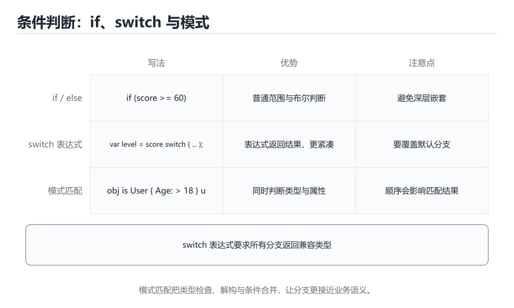
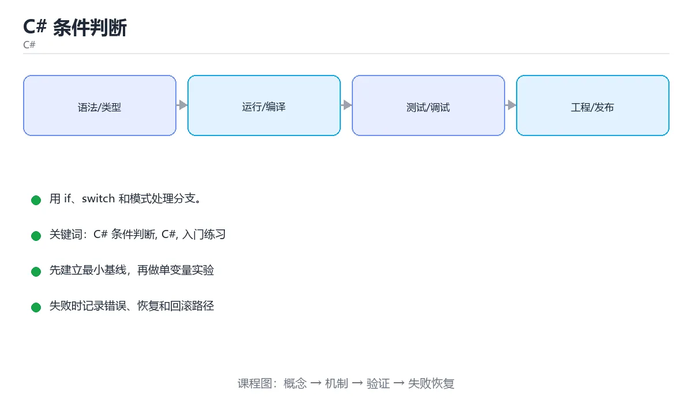

# C# 条件判断





> 内容更新时间：2026-10-03 · 学习阶段：入门 · 预计用时：15 分钟

## 学习目标

- 先认识「C# 条件判断」需要的工具、输入和输出。
- 按步骤运行最小示例，并记录结果与错误。
- 用一个边界输入验证自己是否真正掌握。

## 前置知识

- 会进行基本的文件或命令行操作。
- 不需要预先掌握「C#」的高级知识。

## 一句话入门

用 if、switch 和模式处理分支。

## 最小示例

```csharp
int temperature = 31;
Console.WriteLine(temperature > 30 ? "hot" : "normal");
```

## 预期输出

```text
hot
```

## 常见错误

- 输入转换失败没有处理，运行时抛出 FormatException。
- 复制命令时遗漏空格、引号或必要参数。

## 动手练习

1. 原样运行最小示例，保存命令和输出。
2. 把数字 2 改成 10，预测并验证新结果。
3. 制造一个错误输入，写出错误信息和修复方法。

## 本课小结

- 入门阶段先保证能运行、能观察、能解释，再追求复杂功能。
- 每次只改一个变量，记录预测与实际结果。
- 遇到错误先看第一条错误信息，再回到最小示例。


## C# 布尔条件与短路

C# 的条件表达式必须是 `bool` 类型，整数不能隐式转换为布尔值。`&&` 和 `||` 会短路求值，`&` 和 `|` 对布尔值逐项求值，二者在副作用和性能上不同。判断对象是否为空时优先使用 `is null` 或 `is not null`，它不会被自定义的 `==` 运算符重载影响。`?.` 和 `??` 可以安全访问可空成员并提供默认值，减少层层嵌套。

模式匹配让条件表达更清晰。类型模式可以同时判断类型并声明变量，属性模式可以检查对象属性，关系模式可以表达范围，逻辑模式可以组合 `and`、`or`、`not`。例如 `if (input is string { Length: > 0 } text)` 同时完成了类型检查、非空和长度判断，后续代码可以直接使用 `text`。模式匹配适合把复杂条件提取成可读的声明式表达。

`switch` 语句适合多分支控制流，C# 8 之后还可以使用 `switch` 表达式直接产生值。`switch` 表达式的分支使用模式而不是传统的常量标签，未匹配时会抛异常，因此要提供兜底分支。传统的 `case` 不允许意外贯穿，必须显式 `goto case` 才能跳转，这比 C/C++ 更安全。

## switch 表达式、null 与可空判断

可空引用类型是编译期分析工具，不是运行时保证。启用后，编译器会提示可能为空的引用，但外部数据、反射和旧代码仍可能传入 null。公共方法应校验参数，边界层应把 JSON、数据库和用户输入转换为非空或显式失败。不要把 `!` 空宽容运算符当作修复手段，它只是关闭警告，不会改变运行时行为。

条件分支要覆盖默认路径和异常输入。对于解析、转换和外部调用，优先使用 `TryParse`、`TryGetValue` 等返回布尔值的模式，避免用异常处理正常失败。捕获异常时只捕获能处理的类型，并保留上下文；不要捕获所有异常后静默返回默认值，否则问题会推迟到更难定位的位置。

验证条件逻辑时，为每个分支准备输入，覆盖 null、空字符串、边界数值和类型不匹配；使用模式匹配时还要验证变量声明的作用域。对 switch 表达式检查所有可能值都有匹配或兜底分支。开启可空引用类型和代码分析器，把警告当作设计反馈，而不是噪音。

## 代码实验：把示例跑成证据

这一节不引入新语法，而是把「C# 条件判断」的最小示例变成可以复现、可以对照的实验。每次只改变一个条件，先写预测，再运行，最后解释差异。

### 实验一：建立基线

```csharp
int temperature = 31;
Console.WriteLine(temperature > 30 ? "hot" : "normal");
```

先原样运行上面的代码，记录命令、完整输出和退出状态。然后把输出与正文的预期输出逐字对照，不要用“看起来差不多”代替核对；空格、大小写、换行和错误流向都可能暴露环境差异。

### 实验二：只改一个输入

从代码中选一个会影响结果的字面量、参数或输入，把它替换成边界值：数值可尝试 0、1、最大值和最小值，字符串可尝试空串和超长文本，集合可尝试空集合、单元素和重复元素。先写出预测，再运行并记录实际结果。

### 实验三：制造一个可控错误

把变量声明成不兼容的类型，或者删除一个必要的分号。记录编译器给出的类型错误与位置，修复后确认输出没有变化。

| 实验 | 改动 | 预测 | 实际 | 结论 |
| --- | --- | --- | --- | --- |
| 基线 | 保持原样 |  |  |  |
| 边界 |  |  |  |  |
| 失败 |  |  |  |  |

### 实验四：用三句话复述

1. 输入是什么，哪些输入属于合法范围，哪些属于边界或非法范围？
2. 程序按什么顺序处理输入，在哪一步产生了状态变化或副作用？
3. 输出如何验证，失败时第一条可观察证据是什么？

## 实践任务

本节围绕“C# 条件判断”安排 3 个可交付任务，每个任务都要求留下可以复查的记录。

### 任务 1：用自己的话画出结构

合上教程，用 5 句话说明“C# 条件判断”解决什么问题、输入是什么、输出是什么、失败时会怎样、与相邻概念的边界在哪里。画一张流程图或状态图，把每个节点标注成“输入 / 处理 / 输出 / 失败路径”之一。

**验收标准**：图里至少有 5 个节点和 1 条失败路径；每个节点都能在正文中找到依据。

### 任务 2：做一次对比实验

从正文里选两个差异最小的方案，列成 4 列表格：方案、前提、代价、适用边界。然后只改变一个条件（数据规模、并发度、精度或资源上限），记录结果变化。

**验收标准**：表格里两个方案的结论不能完全一样；写下“在什么条件下应该换方案”。

### 任务 3：迁移到自己的场景

把“C# 条件判断”的核心方法用到你熟悉的一个真实场景，写出一份 300 字以内的实施记录：目标、步骤、验证方式、仍然不确定的问题。

**验收标准**：至少有一个可复现的命令、代码片段或数据样例；结论能被别人独立检查。


## 故障现场

这一节把“C# 条件判断”最常见的失败方式还原成现场记录，练习时按“症状 → 复现 → 定位 → 修复 → 预防”的顺序排查。

### 现场 1：“C# 条件判断”的 C# 条件判断 常规用例通过，但边界用例失败

**症状**：在“C# 条件判断”的练习或生产场景里出现““C# 条件判断”的 C# 条件判断 常规用例通过，但边界用例失败”。

**复现**：准备一组最小输入，只保留触发““C# 条件判断”的 C# 条件判断 常规用例通过，但边界用例失败”的必要条件，连续运行两次确认结果稳定。

**定位**：围绕“C# 条件判断 的前置条件与取值边界没有写进代码，默认值掩盖了空值和极值”检查调用链、输入数据和环境配置，先验证假设再改代码。

**修复**：为“C# 条件判断”补一条空值或极值用例，把前置条件写成断言，并让失败信息直接指出是哪个输入越界

**预防**：把““C# 条件判断”的 C# 条件判断 常规用例通过，但边界用例失败”写成一条自动化用例，并在“C# 条件判断”的验收清单里保留对应检查项。


### 现场 2：“C# 条件判断”的 C# 结果在两次运行之间不一致

**症状**：在“C# 条件判断”的练习或生产场景里出现““C# 条件判断”的 C# 结果在两次运行之间不一致”。

**复现**：准备一组最小输入，只保留触发““C# 条件判断”的 C# 结果在两次运行之间不一致”的必要条件，连续运行两次确认结果稳定。

**定位**：围绕“C# 依赖了当前版本、执行顺序或共享状态，单次运行无法暴露差异”检查调用链、输入数据和环境配置，先验证假设再改代码。

**修复**：固定“C# 条件判断”使用的版本与随机种子，记录两次运行的完整输入和输出，再逐项消除非确定性来源

**预防**：把““C# 条件判断”的 C# 结果在两次运行之间不一致”写成一条自动化用例，并在“C# 条件判断”的验收清单里保留对应检查项。


### 现场 3：“C# 条件判断”的验证只在开发机通过

**症状**：在“C# 条件判断”的练习或生产场景里出现““C# 条件判断”的验证只在开发机通过”。

**复现**：准备一组最小输入，只保留触发““C# 条件判断”的验证只在开发机通过”的必要条件，连续运行两次确认结果稳定。

**定位**：围绕“环境版本、配置和输入规模与目标环境不同，C# 条件判断 缺少可重复的验证记录”检查调用链、输入数据和环境配置，先验证假设再改代码。

**修复**：把“C# 条件判断”的运行环境、输入样本和预期输出写成清单，并在另一套环境复跑同一条命令

**预防**：把““C# 条件判断”的验证只在开发机通过”写成一条自动化用例，并在“C# 条件判断”的验收清单里保留对应检查项。


## 版本与时效

这一节记录“C# 条件判断”涉及的版本基线与升级检查点，避免把某个版本的默认行为当成永久结论。

- .NET 10 是当前 LTS 主线，C# 版本随 SDK 一起演进
- 主构造函数、集合表达式、模式匹配与 AOT/裁剪是升级重点
- 升级前检查 NuGet 依赖、序列化行为与运行时标识
- 官方说明：https://learn.microsoft.com/dotnet/core/whats-new/

### 升级检查清单

- 先固定当前版本，跑通全部示例与测验，再升级工具链。
- 只改一个版本变量，记录编译、测试、性能与产物体积的变化。
- 重点回归默认值、弃用警告、序列化格式、并发语义和错误信息。
- 升级完成后更新本课的“最后复核 / 下次复核”日期与版本说明。


## 考点精讲：把测验题还原成判断过程

本课有 5 个判断点。先自己作答，再看「判断依据」；如果结论正确但理由不完整，回到正文对应章节补足概念。

### 考点 1：C# 中判断两个字符串内容是否相同，推荐使用哪个方法？

- **正确判断**：使用 == 或 string.Equals，它们比较字符内容
- **判断依据**：正确答案是「使用 == 或 string.Equals，它们比较字符内容」，本课在「switch 表达式、null 与可空判断」中说明：验证条件逻辑时，为每个分支准备输入，覆盖 null、空字符串、边界数值和类型不匹配。C# 为字符串重载了 == 运算符，比较的是字符序列内容，因此与 Java 的行为不同。本课还在「C# 布尔条件与短路」中说明：C# 的条件表达式必须是 bool 类型，整数不能隐式转换为布尔值。
- **迁移检查**：如果给某个错误选项去掉一个限定词，它会不会变成正确？说明理由。

### 考点 2：C# 的 switch 语句中，case 结束后的 break 是否可以省略？

- **正确判断**：不能省略，每个非空 case 必须以跳转语句结束
- **判断依据**：正确答案是「不能省略，每个非空 case 必须以跳转语句结束」，本课在「switch 表达式、null 与可空判断」中说明：启用后，编译器会提示可能为空的引用，但外部数据、反射和旧代码仍可能传入 null。C# 不允许隐式穿透，每个包含语句的 case 必须用 break、return、throw 或 goto 结束，否则编译报错。本课还在「C# 布尔条件与短路」中说明：switch 语句适合多分支控制流，C# 8 之后还可以使用 switch 表达式直接产生值。
- **迁移检查**：如果给某个错误选项去掉一个限定词，它会不会变成正确？说明理由。

### 考点 3：C# 中可空引用类型（如 string?）提示了什么？

- **正确判断**：该变量可能为 null
- **判断依据**：正确答案是「该变量可能为 null」，本课在「switch 表达式、null 与可空判断」中说明：可空引用类型是编译期分析工具，不是运行时保证。在启用可空上下文后，string 表示不应为 null，string? 表示可能为 null，编译器据此给出警告并帮助发现潜在的空引用。本课还在「switch 表达式、null 与可空判断」中说明：开启可空引用类型和代码分析器，把警告当作设计反馈，而不是噪音。
- **迁移检查**：遮住选项，只根据定义复述一次答案，再回来看哪个选项与复述一致。

### 考点 4：C# 示例中 temperature 为 31，控制台会输出什么？

- **正确判断**：hot，三目运算符在条件成立时返回前一个值
- **判断依据**：正确答案是「hot，三目运算符在条件成立时返回前一个值」，本课在「C# 布尔条件与短路」中说明：判断对象是否为空时优先使用 is null 或 is not null，它不会被自定义的 == 运算符重载影响。31 > 30 成立，三目运算符返回字符串 "hot"，Console.WriteLine 把它输出为一行 hot。本课还在「C# 布尔条件与短路」中说明：switch 表达式的分支使用模式而不是传统的常量标签，未匹配时会抛异常，因此要提供兜底分支。
- **迁移检查**：把题干里的一个条件换成边界值，原来的结论还成立吗？写出判断过程。

### 考点 5：填空：「C# 条件判断」术语速查中，表示「C# 的条件表达式必须是 `____` 类型，整数不能隐式转换为布尔值。`&&` 和 `||` 会短路求值，`&` 和 `|` 对布尔值逐项求值，二者在副作用和性能上不同。判断对象是否为空时优先使用 `is null` 或 `is not …」的术语是什么？

- **正确判断**：bool
- **判断依据**：正确答案是「bool」，本课在「C# 布尔条件与短路」中说明：&& 和 || 会短路求值，& 和 | 对布尔值逐项求值，二者在副作用和性能上不同。本课还在「C# 布尔条件与短路」中说明：C# 的条件表达式必须是 bool 类型，整数不能隐式转换为布尔值。本课还在「C# 布尔条件与短路」中说明：判断对象是否为空时优先使用 is null 或 is not null，它不会被自定义的 == 运算符重载影响。
- **迁移检查**：把答案换成另一种等价写法，是否仍然正确？说明依据。

### 补充考点 1：阅读「C# 条件判断」的代码片段，下面哪项判断是正确的？

- **正确判断**：使用 == 或 string.Equals，它们比较字符内容
- **判断依据**：正确答案是「使用 == 或 string.Equals，它们比较字符内容」。这段代码来自「C# 条件判断」的示例，判断时先看输入与输出，再检查条件、循环和边界。正确答案是「使用 == 或 string.Equals，它们比较字符内容」，本课在「switch 表达式、null 与可空判断」中说明：验证条件逻辑时，为每个分支准备输入，覆盖 null、空字符串、边…在「C# 条件判断」中，如果只改一个条件，输出通常会随之改变，因此不能脱离代码前提作答。

### 补充自测（1 题）

1. 围绕“C# 条件判断”中的 C# 条件判断、C#、入门练习，下列哪两项是本课强调的实践判断？

这些题按“先定位概念、再排除边界错误、最后核对答案”的顺序作答；每题解析都给出了判断依据。


## 本课复习清单

离开本课前，逐项确认：

- [ ] 不看解析，能说出「C# 中判断两个字符串内容是否相同，推荐使用哪个方法？」的判断依据。
- [ ] 不看解析，能说出「C# 的 switch 语句中，case 结束后的 break 是否可以省略？」的判断依据。
- [ ] 不看解析，能说出「C# 中可空引用类型（如 string?）提示了什么？」的判断依据。
- [ ] 不看解析，能说出「C# 示例中 temperature 为 31，控制台会输出什么？」的判断依据。
- [ ] 不看解析，能说出「填空：「C# 条件判断」术语速查中，表示「C# 的条件表达式必须是 `____`…」的判断依据。
- [ ] 至少运行一次本课示例，记录输入、输出和一个边界情况。
- [ ] 把本课最容易混淆的两个概念写成一句话对照。

| 复盘项 | 记录 |
| --- | --- |
| 已经能独立解释的考点 |  |
| 仍然说不清的概念 |  |
| 下一步验证动作 |  |

## 逐节复习与自检

下面按正文顺序回顾每一节，并给出一个自检问题；说不清的地方回到原章节补课。

### 最小示例

```csharp
int temperature = 31;
Console.WriteLine(temperature > 30 ? "hot" : "normal");
```

自检：这一节与相邻主题的边界在哪里？

### 预期输出

```text
hot
```

自检：这一节与相邻主题的边界在哪里？

### 常见错误

输入转换失败没有处理，运行时抛出 FormatException。

自检：把这一节讲给没学过的人，最需要强调哪一点？

### 动手练习

把数字 2 改成 10，预测并验证新结果。制造一个错误输入，写出错误信息和修复方法。

自检：如果去掉这一节里的一个前提，结论会怎样变化？

### C# 布尔条件与短路

C# 的条件表达式必须是 `bool` 类型，整数不能隐式转换为布尔值。`&&` 和 `||` 会短路求值，`&` 和 `|` 对布尔值逐项求值，二者在副作用和性能上不同。

自检：这一节最常见的失败方式是什么？第一条可观察证据是什么？

### switch 表达式、null 与可空判断

可空引用类型是编译期分析工具，不是运行时保证。启用后，编译器会提示可能为空的引用，但外部数据、反射和旧代码仍可能传入 null。

自检：这一节的关键输入与输出分别是什么？

## 术语速查

把本课反复出现的术语集中放在一起。复习时先遮住右列，尝试用自己的话解释，再回到正文核对。

| 术语 | 本课语境 |
| --- | --- |
| `bool` | C# 的条件表达式必须是 `bool` 类型，整数不能隐式转换为布尔值。`&&` 和 `\|\|` 会短路求值，`&` 和 `\|` 对布尔值逐项求值，二者在副作用和性能上不同。判断对象是否为空时优先使用 `is nul… |
| `&&` | C# 的条件表达式必须是 `bool` 类型，整数不能隐式转换为布尔值。`&&` 和 `\|\|` 会短路求值，`&` 和 `\|` 对布尔值逐项求值，二者在副作用和性能上不同。判断对象是否为空时优先使用 `is nul… |
| `||` | C# 的条件表达式必须是 `bool` 类型，整数不能隐式转换为布尔值。`&&` 和 `\|\|` 会短路求值，`&` 和 `\|` 对布尔值逐项求值，二者在副作用和性能上不同。判断对象是否为空时优先使用 `is nul… |
| `和` | C# 的条件表达式必须是 `bool` 类型，整数不能隐式转换为布尔值。`&&` 和 `\|\|` 会短路求值，`&` 和 `\|` 对布尔值逐项求值，二者在副作用和性能上不同。判断对象是否为空时优先使用 `is nul… |
| `is null` | C# 的条件表达式必须是 `bool` 类型，整数不能隐式转换为布尔值。`&&` 和 `\|\|` 会短路求值，`&` 和 `\|` 对布尔值逐项求值，二者在副作用和性能上不同。判断对象是否为空时优先使用 `is nul… |
| `is not null` | C# 的条件表达式必须是 `bool` 类型，整数不能隐式转换为布尔值。`&&` 和 `\|\|` 会短路求值，`&` 和 `\|` 对布尔值逐项求值，二者在副作用和性能上不同。判断对象是否为空时优先使用 `is nul… |
| `==` | C# 的条件表达式必须是 `bool` 类型，整数不能隐式转换为布尔值。`&&` 和 `\|\|` 会短路求值，`&` 和 `\|` 对布尔值逐项求值，二者在副作用和性能上不同。判断对象是否为空时优先使用 `is nul… |
| `?.` | C# 的条件表达式必须是 `bool` 类型，整数不能隐式转换为布尔值。`&&` 和 `\|\|` 会短路求值，`&` 和 `\|` 对布尔值逐项求值，二者在副作用和性能上不同。判断对象是否为空时优先使用 `is nul… |
| `??` | C# 的条件表达式必须是 `bool` 类型，整数不能隐式转换为布尔值。`&&` 和 `\|\|` 会短路求值，`&` 和 `\|` 对布尔值逐项求值，二者在副作用和性能上不同。判断对象是否为空时优先使用 `is nul… |
| `and` | 模式匹配让条件表达更清晰。类型模式可以同时判断类型并声明变量，属性模式可以检查对象属性，关系模式可以表达范围，逻辑模式可以组合 `and`、`or`、`not`。例如 `if (input is string { Len… |
| `or` | 模式匹配让条件表达更清晰。类型模式可以同时判断类型并声明变量，属性模式可以检查对象属性，关系模式可以表达范围，逻辑模式可以组合 `and`、`or`、`not`。例如 `if (input is string { Len… |
| `not` | 模式匹配让条件表达更清晰。类型模式可以同时判断类型并声明变量，属性模式可以检查对象属性，关系模式可以表达范围，逻辑模式可以组合 `and`、`or`、`not`。例如 `if (input is string { Len… |

## 面试问答与自测

下面把本课考点换成面试追问。先口述自己的答案，
再对照参考回答检查是否遗漏了前提、边界或失败路径。

### 追问 1：C# 中判断两个字符串内容是否相同，推荐使用哪个方法？

**参考回答**：正确答案是「使用 == 或 string.Equals，它们比较字符内容」，本课在「switch 表达式、null 与可空判断」中说明：验证条件逻辑时，为每个分支准备输入，覆盖 null、空字符串、边界数值和类型不匹配。C# 为字符串重载了 == 运算符，比较的是字符序列内容，因此与 Java 的行为不同。本课还在「C# 布尔条件与短路」中说明：C# 的条件表达式必须是 bool 类型，整数不能隐式转换为布尔值。

### 追问 2：C# 的 switch 语句中，case 结束后的 break 是否可以省略？

**参考回答**：正确答案是「不能省略，每个非空 case 必须以跳转语句结束」，本课在「switch 表达式、null 与可空判断」中说明：启用后，编译器会提示可能为空的引用，但外部数据、反射和旧代码仍可能传入 null。C# 不允许隐式穿透，每个包含语句的 case 必须用 break、return、throw 或 goto 结束，否则编译报错。本课还在「C# 布尔条件与短路」中说明：switch 语句适合多分支控制流，C# 8 之后还可以使用 switch 表达式直接产生值。

### 追问 3：C# 中可空引用类型（如 string?）提示了什么？

**参考回答**：正确答案是「该变量可能为 null」，本课在「switch 表达式、null 与可空判断」中说明：可空引用类型是编译期分析工具，不是运行时保证。在启用可空上下文后，string 表示不应为 null，string? 表示可能为 null，编译器据此给出警告并帮助发现潜在的空引用。本课还在「switch 表达式、null 与可空判断」中说明：开启可空引用类型和代码分析器，把警告当作设计反馈，而不是噪音。

### 追问 4：C# 示例中 temperature 为 31，控制台会输出什么？

**参考回答**：正确答案是「hot，三目运算符在条件成立时返回前一个值」，本课在「C# 布尔条件与短路」中说明：判断对象是否为空时优先使用 is null 或 is not null，它不会被自定义的 == 运算符重载影响。31 > 30 成立，三目运算符返回字符串 "hot"，Console.WriteLine 把它输出为一行 hot。本课还在「C# 布尔条件与短路」中说明：switch 表达式的分支使用模式而不是传统的常量标签，未匹配时会抛异常，因此要提供兜底分支。

### 追问 5：填空：「C# 条件判断」术语速查中，表示「C# 的条件表达式必须是 `____` 类型，整数不能隐式转换为布尔值。`&&` 和 `||` 会短路求值，`&` 和 `|` 对布尔值逐项求值，二者在副作用和性能上不同。判断对象是否为空时优先使用 `is null` 或 `is not …」的术语是什么？

**参考回答**：正确答案是「bool」，本课在「C# 布尔条件与短路」中说明：&& 和 || 会短路求值，& 和 | 对布尔值逐项求值，二者在副作用和性能上不同。本课还在「C# 布尔条件与短路」中说明：C# 的条件表达式必须是 bool 类型，整数不能隐式转换为布尔值。本课还在「C# 布尔条件与短路」中说明：判断对象是否为空时优先使用 is null 或 is not null，它不会被自定义的 == 运算符重载影响。

## English Overview

**Title:** C# Conditionals

**Summary:** Handle branches with if and switch.

**Category:** C#  
**Level:** 入门  
**Key terms:** C# 条件判断, C#, 入门练习

> The full tutorial is written in Chinese. This bilingual overview helps English readers identify the topic, scope and key terms before studying the detailed examples.

## 内容元数据

- 内容版本：v2.0
- 最后更新：2026-10-03
- 学习阶段：入门
- 适用环境：.NET 9 / C# 13
- 内容来源：内置结构化课程与工程实践整理
- 相关主题：C# 条件判断、C#、入门练习
- 质量版本：P0 测验标准 + P1 覆盖扩展 + P2 体验补全


## 参考资料与复核

- 最后复核：2026-10-04
- 下次复核：2027-04-04
- 复核范围：版本兼容、API 行为、安全建议与工程实践
- 来源性质：官方文档与标准；本课正文为离线教学重组，不复制原文

| 参考资料 | 本课用途 |
| --- | --- |
| [C# 官方指南](https://learn.microsoft.com/dotnet/csharp/) | 语言、异步与模式匹配 |
| [.NET 文档](https://learn.microsoft.com/dotnet/) | 运行时、GC 与发布 |

> 本课主题：用 if、switch 和模式处理分支。

> App 完全离线展示文字链接，不会自动联网；需要延伸阅读时可复制链接到浏览器。

<!-- code-practice:v1:start -->

## 代码练习（6 题）

下面题目与课程测验同源：覆盖代码输出、排错与场景判断。建议先自己写出答案，再到「测验」里核对成绩。

### 练习 1 · 代码输出

在 C# 课程“C# 条件判断”的条件实验里，这段代码运行后输出什么？

```csharp
using System;

class Program {
    static void Main() {
        int total = 0;
        for (int i = 1; i <= 4; i++) {
            total += i;
        }
        Console.WriteLine(total);
    }
}
```

- A. 10
- B. 11
- C. 9
- D. 20

**参考答案**：A. 10
**参考输出**：`10`

**解析**

在 C# 课程“C# 条件判断”的条件代码实验里，程序先完成赋值、循环或函数调用，再把结果写到标准输出，因此正确结果是 10。
判断 C# 课程“C# 条件判断”的代码输出时，要把“源码写了什么”和“运行时实际打印什么”分开；变量值和循环边界都会直接改变最终结果。
把 10 当作基线后，可以只改一个输入或一个边界，再观察 C# 课程“C# 条件判断”的输出如何变化，这就是验证掌握程度的方法。

### 练习 2 · 代码输出

在 C# 课程“C# 条件判断”的集合实验里，这段代码运行后输出什么？

```csharp
using System;

class Program {
    static void Main() {
        int x = 6;
        Console.WriteLine(x);
    }
}
```

- A. 5
- B. 6
- C. 7
- D. 12

**参考答案**：B. 6
**参考输出**：`6`

**解析**

在 C# 课程“C# 条件判断”的集合代码实验里，程序先完成赋值、循环或函数调用，再把结果写到标准输出，因此正确结果是 6。
判断 C# 课程“C# 条件判断”的代码输出时，要把“源码写了什么”和“运行时实际打印什么”分开；变量值和循环边界都会直接改变最终结果。
把 6 当作基线后，可以只改一个输入或一个边界，再观察 C# 课程“C# 条件判断”的输出如何变化，这就是验证掌握程度的方法。

### 练习 3 · 代码输出

在 C# 课程“C# 条件判断”的错误处理实验里，这段代码运行后输出什么？

```csharp
using System;

class Program {
    static int DoubleValue(int value) => value * 2;

    static void Main() {
        Console.WriteLine(DoubleValue(4));
    }
}
```

- A. 9
- B. 8
- C. 7
- D. 16

**参考答案**：B. 8
**参考输出**：`8`

**解析**

在 C# 课程“C# 条件判断”的错误处理代码实验里，程序先完成赋值、循环或函数调用，再把结果写到标准输出，因此正确结果是 8。
判断 C# 课程“C# 条件判断”的代码输出时，要把“源码写了什么”和“运行时实际打印什么”分开；变量值和循环边界都会直接改变最终结果。
把 8 当作基线后，可以只改一个输入或一个边界，再观察 C# 课程“C# 条件判断”的输出如何变化，这就是验证掌握程度的方法。

### 练习 4 · 代码排错

C# 课程“C# 条件判断”的下面这段代码无法运行，最可能的修复是什么？

```csharp
using System;

class Program {
    static void Main() {
        int x = 6
        Console.WriteLine(x);
    }
}
```

- A. 在 int x = 6 这一行末尾补上分号
- B. 把输出语句整段删除，代码就会自动修复
- C. 重新安装运行时并清空所有缓存
- D. 把变量名改成另一个单词即可

**参考答案**：A. 在 int x = 6 这一行末尾补上分号

**解析**

C# 课程“C# 条件判断”里的这段代码无法通过编译或解析，关键原因是缺少了必要语法结构，正确修复是在 int x = 6 这一行末尾补上分号。
在 C# 课程“C# 条件判断”中，错误信息通常会指出出错行和期望符号；先读第一条错误，再检查这一行的括号、冒号、分号或花括号。
修复后还要重新运行 C# 课程“C# 条件判断”的最小示例，确认输出恢复，并记录这次问题属于语法错误而不是逻辑错误。

### 练习 5 · 代码排错

C# 课程“C# 条件判断”的这段代码结果偏小，应该怎样修改？

```csharp
using System;

class Program {
    static void Main() {
        int total = 0;
        for (int i = 1; i < 4; i++) {
            total += i;
        }
        Console.WriteLine(total);
    }
}
```

- A. 把累加操作改成减法操作
- B. 把输出语句移到循环体内部
- C. 把循环变量从 1 改成 0，其余保持不变
- D. 把循环条件 i < 4 改成 i <= 4

**参考答案**：D. 把循环条件 i < 4 改成 i <= 4
**修复后输出**：`10`

**解析**

C# 课程“C# 条件判断”里的循环边界少算了最后一项，当前输出是 6，而完整求和应为 10。
正确修复是把循环条件 i < 4 改成 i <= 4；这类错误属于边界问题，代码能运行但结果偏离，所以比语法错误更隐蔽。
验证 C# 课程“C# 条件判断”时至少选择首项、中间值和末尾值三个输入，比较手算结果与程序输出，才能发现类似偏差。

### 练习 6 · 概念判断

在 C# 课程“C# 条件判断”的学习或项目场景中，哪种做法最有助于得到可验证、可迁移的结果？

- A. 先围绕「C# 条件判断」写最小可运行示例，再用边界输入验证“C# 条件判断”的结果
- B. 只背下「C# 条件判断」的结论，遇到新输入时凭感觉修改代码
- C. 一次改完所有变量和依赖，再统一观察是否报错
- D. 跳过错误信息，直接复制另一段代码直到能运行

**参考答案**：A. 先围绕「C# 条件判断」写最小可运行示例，再用边界输入验证“C# 条件判断”的结果

**解析**

在 C# 课程“C# 条件判断”里，C# 条件判断不是孤立的名词，而是一组可以用输入、过程、输出和边界验证的行为。
对 C# 课程“C# 条件判断”来说，先写最小可运行示例，再逐步增加边界输入，能把“感觉会了”转化成可以重复的证据。
如果只背结论或一次改很多变量，出错时就无法判断是哪一步破坏了 C# 课程“C# 条件判断”的预期；先把变化隔离出来才容易定位。

<!-- code-practice:v1:end -->
