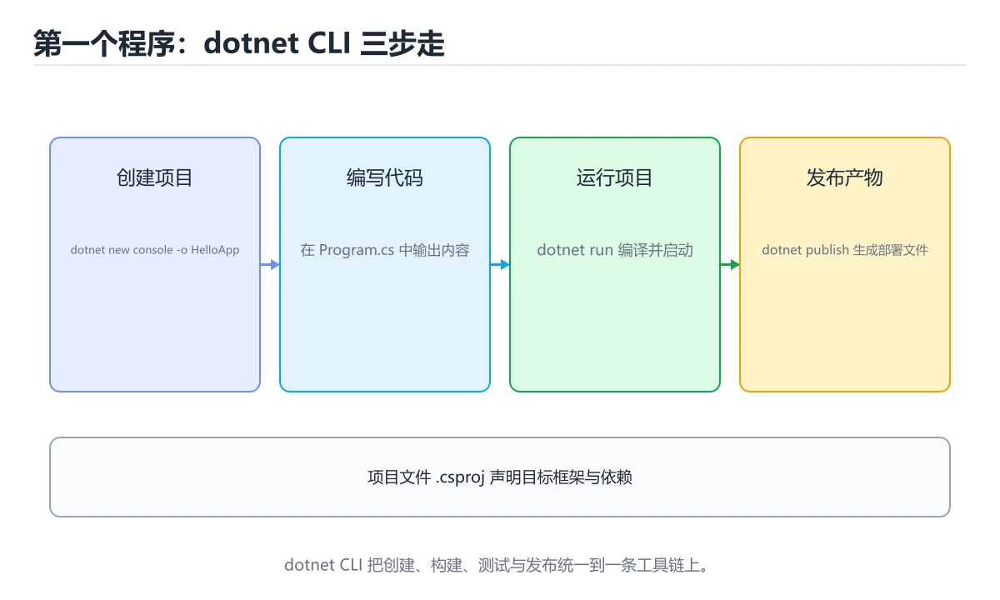

# 本课主题

> 内容更新时间：2026-10-03




## 学习目标

- 先认识本课主题需要的工具、输入和输出。
- 按步骤运行最小示例，并记录结果与错误。
- 用一个边界输入验证自己是否真正掌握。

## 前置知识

- 会进行基本的文件或命令行操作。
- 不需要预先掌握「C#」的高级知识。

## 一句话入门

创建控制台项目并运行第一条输出。

## 最小示例

```csharp
Console.WriteLine("hello from C#");
```

## 预期输出

```text
hello from C#
```

## 常见错误

- 输入转换失败没有处理，运行时抛出 FormatException。
- 复制命令时遗漏空格、引号或必要参数。

## 动手练习

1. 原样运行最小示例，保存命令和输出。
2. 把数字 2 改成 10，预测并验证新结果。
3. 制造一个错误输入，写出错误信息和修复方法。

## 本课小结

- 入门阶段先保证能运行、能观察、能解释，再追求复杂功能。
- 每次只改一个变量，记录预测与实际结果。
- 遇到错误先看第一条错误信息，再回到最小示例。

## 代码实验：把示例跑成证据

### 实验一：建立基线

```csharp
Console.WriteLine("hello from C#");
```

### 实验二：只改一个输入

### 实验三：制造一个可控错误

把变量声明成不兼容的类型，或者删除一个必要的分号。记录编译器给出的类型错误与位置，修复后确认输出没有变化。

| 实验 | 改动 | 预测 | 实际 | 结论 |
| --- | --- | --- | --- | --- |
| 基线 | 保持原样 |  |  |  |
| 边界 |  |  |  |  |
| 失败 |  |  |  |  |

### 实验四：用三句话复述

1. 输入是什么，哪些输入属于合法范围，哪些属于边界或非法范围？
2. 程序按什么顺序处理输入，在哪一步产生了状态变化或副作用？
3. 输出如何验证，失败时第一条可观察证据是什么？

## C# 与 .NET 基础机制速览

### 编译、CLR 与程序集

C# 代码先编译成中间语言和元数据，运行时由 CLR 通过即时编译或提前编译转换为机器码。程序集是部署和版本控制的基本单位，包含类型、方法和资源。命名空间只负责组织名字，不决定物理文件位置。`dotnet new` 创建项目，`dotnet build` 编译，`dotnet run` 运行，`dotnet test` 执行测试，理解工具链能快速定位“编译失败”和“运行失败”。

### 类型、值与引用

C# 类型分为值类型和引用类型。结构体、枚举和大多数基元类型是值类型，赋值时复制内容；类、数组、委托和字符串是引用类型，赋值时复制引用。装箱把值类型转成对象，拆箱再转回来，频繁发生会增加分配和复制成本。`var` 只是让编译器推断类型，不会变成动态类型；`dynamic` 才把类型检查推迟到运行时。

### 方法、重载与参数

方法可以有重载、可选参数、命名参数、`params` 可变参数和扩展方法。重载根据参数列表选择，返回类型不参与。`ref`、`out`、`in` 控制参数的传递方式：`ref` 可读可写，`out` 必须在方法内赋值，`in` 只读引用。局部函数和 lambda 可以捕获外部变量，但要注意闭包生命周期和循环变量捕获。异步方法返回 `Task` 或 `Task<T>`，调用方通常使用 `await`。

### 集合、LINQ 与可空性

`List<T>`、`Dictionary<TKey,TValue>`、`HashSet<T>` 是最常用的泛型集合。LINQ 提供筛选、投影、分组、连接和聚合，延迟执行意味着查询只有在枚举时才真正运行；重复枚举可能重复计算或看到数据变化。可空引用类型在编译期提示可能的 null，公共方法仍要校验参数，边界层要把外部数据转换成有效对象。

### 资源管理与并发

实现 `IDisposable` 的对象应使用 `using` 或 `await using` 及时释放文件句柄、连接和锁。异常只用于异常情况，不要用异常处理正常分支。异步代码不要阻塞等待 `.Result` 或 `.Wait()`，否则可能造成线程池饥饿和死锁。并发集合、`lock`、`SemaphoreSlim` 和 `Channel` 各有适用场景，选择时要看清读写比例、公平性和取消需求。

## 本课自测清单与错误对照

本课测验以直接定义和步骤判断为主。请把每个错误选项改写成一句反例，
说明它在哪个输入、边界或前提变化下会失败。

### 完成标准

- [ ] 能用具体输入复现最小示例，并逐行解释输入、处理与输出。
- [ ] 能只改一个值完成边界实验，并让预测与实际结果一致。
- [ ] 能制造一个可控错误，读出第一条错误信息并完成修复。
- [ ] 能不看书说出本课至少两个易错点和对应的验证方法。

### 复盘记录

| 项目 | 记录 |
| --- | --- |
| 学到的核心机制 |  |
| 仍然不确定的问题 |  |
| 下一步验证动作 |  |

## 实践任务

本节围绕本课主题安排 3 个可交付任务，每个任务都要求留下可以复查的记录。

### 任务 1：用自己的话画出结构

### 任务 2：做一次对比实验

**验收标准**：表格里两个方案的结论不能完全一样；写下“在什么条件下应该换方案”。

### 任务 3：迁移到自己的场景

**验收标准**：至少有一个可复现的命令、代码片段或数据样例；结论能被别人独立检查。

## 故障现场

### 现场 1：本课的 本课主题 常规用例通过，但边界用例失败

### 现场 2：本课的 C# 结果在两次运行之间不一致

**症状**：在本课的练习或生产场景里出现“本课的 C# 结果在两次运行之间不一致”。

**复现**：准备一组最小输入，只保留触发“本课的 C# 结果在两次运行之间不一致”的必要条件，连续运行两次确认结果稳定。

**定位**：围绕“C# 依赖了当前版本、执行顺序或共享状态，单次运行无法暴露差异”检查调用链、输入数据和环境配置，先验证假设再改代码。

**预防**：把“本课的 C# 结果在两次运行之间不一致”写成一条自动化用例，并在本课的验收清单里保留对应检查项。

### 现场 3：本课的验证只在开发机通过

**症状**：在本课的练习或生产场景里出现“本课的验证只在开发机通过”。

## 版本与时效

- .NET 10 是当前 LTS 主线，C# 版本随 SDK 一起演进
- 主构造函数、集合表达式、模式匹配与 AOT/裁剪是升级重点
- 升级前检查 NuGet 依赖、序列化行为与运行时标识
- 官方说明：https://learn.microsoft.com/dotnet/core/whats-new/

### 升级检查清单

- 先固定当前版本，跑通全部示例与测验，再升级工具链。
- 只改一个版本变量，记录编译、测试、性能与产物体积的变化。
- 重点回归默认值、弃用警告、序列化格式、并发语义和错误信息。
- 升级完成后更新本课的“最后复核 / 下次复核”日期与版本说明。

## 本课复习清单

离开本课前，逐项确认：

- [ ] 不看解析，能说出「创建并运行一个最小 C# 控制台项目，常见流程是？」的判断依据。
- [ ] 不看解析，能说出「Console.WriteLine("hello from C#") 的行为是？」的判断依据。
- [ ] 不看解析，能说出「C# 中 using System; 这类指令的作用是？」的判断依据。
- [ ] 不看解析，能说出「.NET 程序通常先编译成什么形式再运行？」的判断依据。
- [ ] 不看解析，能说出「填空：本课主题术语速查中，表示「C# 代码先编译成中间…」的判断依据。
- [ ] 至少运行一次本课示例，记录输入、输出和一个边界情况。
- [ ] 把本课最容易混淆的两个概念写成一句话对照。

| 复盘项 | 记录 |
| --- | --- |
| 已经能独立解释的考点 |  |
| 仍然说不清的概念 |  |
| 下一步验证动作 |  |

## 逐节复习与自检

下面按正文顺序回顾每一节，并给出一个自检问题；说不清的地方回到原章节补课。

### 最小示例

```csharp
Console.WriteLine("hello from C#");
```

自检：这一节与相邻主题的边界在哪里？

### 预期输出

```text
hello from C#
```

### 常见错误

自检：把这一节讲给没学过的人，最需要强调哪一点？

### 动手练习

自检：如果去掉这一节里的一个前提，结论会怎样变化？

## 术语速查

| 术语 | 本课语境 |
| --- | --- |
| `dotnet new` | C# 代码先编译成中间语言和元数据，运行时由 CLR 通过即时编译或提前编译转换为机器码。程序集是部署和版本控制的基本单位，包含类型、方法和资源。命名空间只负责组织名字，不决定物理文件位置。`dotnet new` 创建… |
| `dotnet build` | C# 代码先编译成中间语言和元数据，运行时由 CLR 通过即时编译或提前编译转换为机器码。程序集是部署和版本控制的基本单位，包含类型、方法和资源。命名空间只负责组织名字，不决定物理文件位置。`dotnet new` 创建… |
| `dotnet run` | C# 代码先编译成中间语言和元数据，运行时由 CLR 通过即时编译或提前编译转换为机器码。程序集是部署和版本控制的基本单位，包含类型、方法和资源。命名空间只负责组织名字，不决定物理文件位置。`dotnet new` 创建… |
| `dotnet test` | C# 代码先编译成中间语言和元数据，运行时由 CLR 通过即时编译或提前编译转换为机器码。程序集是部署和版本控制的基本单位，包含类型、方法和资源。命名空间只负责组织名字，不决定物理文件位置。`dotnet new` 创建… |
| `var` | C# 类型分为值类型和引用类型。结构体、枚举和大多数基元类型是值类型，赋值时复制内容；类、数组、委托和字符串是引用类型，赋值时复制引用。装箱把值类型转成对象，拆箱再转回来，频繁发生会增加分配和复制成本。`var` 只是让… |
| `dynamic` | C# 类型分为值类型和引用类型。结构体、枚举和大多数基元类型是值类型，赋值时复制内容；类、数组、委托和字符串是引用类型，赋值时复制引用。装箱把值类型转成对象，拆箱再转回来，频繁发生会增加分配和复制成本。`var` 只是让… |
| `params` | 方法可以有重载、可选参数、命名参数、`params` 可变参数和扩展方法。重载根据参数列表选择，返回类型不参与。`ref`、`out`、`in` 控制参数的传递方式：`ref` 可读可写，`out` 必须在方法内赋值，`… |
| `ref` | 方法可以有重载、可选参数、命名参数、`params` 可变参数和扩展方法。重载根据参数列表选择，返回类型不参与。`ref`、`out`、`in` 控制参数的传递方式：`ref` 可读可写，`out` 必须在方法内赋值，`… |
| `out` | 方法可以有重载、可选参数、命名参数、`params` 可变参数和扩展方法。重载根据参数列表选择，返回类型不参与。`ref`、`out`、`in` 控制参数的传递方式：`ref` 可读可写，`out` 必须在方法内赋值，`… |
| `in` | 方法可以有重载、可选参数、命名参数、`params` 可变参数和扩展方法。重载根据参数列表选择，返回类型不参与。`ref`、`out`、`in` 控制参数的传递方式：`ref` 可读可写，`out` 必须在方法内赋值，`… |
| `Task` | 方法可以有重载、可选参数、命名参数、`params` 可变参数和扩展方法。重载根据参数列表选择，返回类型不参与。`ref`、`out`、`in` 控制参数的传递方式：`ref` 可读可写，`out` 必须在方法内赋值，`… |
| `Task<T>` | 方法可以有重载、可选参数、命名参数、`params` 可变参数和扩展方法。重载根据参数列表选择，返回类型不参与。`ref`、`out`、`in` 控制参数的传递方式：`ref` 可读可写，`out` 必须在方法内赋值，`… |

## 考点精讲

### 考点 1：围绕“C# 与 .NET 第一个程序”中的 C# 与 .NET 第一个程序、C#、入门练习，下列哪两项是本课强调的实践判断？

- **判断依据**：正确答案包括「学习 C# 与 .NET 第一个程序 时要同时说明输入、输出和失败路径，不能只看正常流程」、「验证 C# 时要固定版本并覆盖边界输入，结论才可复现」。正确答案是学习 本课主题 时要同时说明输入、输出和失败路径（csharpdotnetfirst 第 1 题）。

### 考点 2：Console.WriteLine("hello from C#") 的行为是？

- **判断依据**：本题应选「把文本写到控制台并换行，Write 则不换行」。Console.WriteLine 输出内容后换行，Console.Write 输出后光标停在行尾，二者都写到标准输出，不会自动写到文件或环境变量。解题的关键不是记住孤立术语，而是确认「把文本写到控制台并换行，Write 则不换行」是否完整覆盖题干的输入、输出和失败路径，并排除「把文本写入项目目录下的日志文件」、「把文本追加到系统环境变量中」这类相邻概念。

### 考点 3：下面这段 C# 代码复现了“C# 与 .NET 第一个程序”中 C# 与 .NET 第一个程序、C#、入门练习 相关的一个常见故障，哪一项最准确地解释了问题？

- **判断依据**：符合题干条件的是「foreach 期间修改集合会抛出 InvalidOperationException，应遍历副本或使用 RemoveAll」。符合题干条件的是foreach 期间修改集合会抛出 InvalidOperationException，应遍历副本或使用 RemoveAll。C# 与 .NET 第一个程序 的修改与遍历发生了冲突。在这个复现里，要让 C# 的结果稳定，可以遍历 items.ToList() 副本，或使用 items.RemoveAll(item => item % 2 == 0)。

### 考点 4：.NET 程序通常先编译成什么形式再运行？

- **判断依据**：结论应落在「编译成中间语言 IL，由运行时即时编译后执行」。C# 编译器把源码编译成中间语言 IL 并打包成程序集，运行时在加载方法时把 IL 即时编译成机器码，这带来了跨平台与运行时优化能力。.NET 程序通常先编译成什么形式再运行。这道题要求区分概念与边界，「编译成中间语言 IL，由运行时即时编译后执行」只有在题干给出的前提下才成立，而「直接编译成某个 CPU 架构的机器码后原样运行」、「转换成 HTML 页面，由浏览器负责执行」缺少同一组条件。

### 考点 5：填空：「C# 与 .NET 第一个程序」术语速查中，表示「C# 代码先编译成中间语言和元数据，运行时由 CLR 通过即时编译或提前编译转换为机器码。程序集是部署和版本控制的基本单位，包含类型、方法和资源。命名空间只负责组织名字，不决定物理文件位置。`____` 创建项目，`dotnet…」的术语是什么？

- **判断依据**：创建项目，dotnet…的术语是什么。围绕 填空：C# 与 .NET 第一个程序术语速查中，表示C# 代码… 作答时，先用C# 与 .NET 第一个程序建立输入与输出的基线，再把dotnet new代入边界条件核对，结论才能复现。判断这类题时，要把「dotnet new」放回题干限定的对象、输入和边界， 等说法虽然包含相关术语，但范围或前提与本题不一致。

## English Overview

**Title:** First C# and .NET Program

**Summary:** Create a console project and run it.

**Category:** C#
**Level:** 入门
**Key terms:** 本课主题, C#, 入门练习

## 内容元数据

- 内容版本：v2.0
- 最后更新：2026-10-03
- 学习阶段：入门
- 适用环境：.NET 9 / C# 13
- 内容来源：内置结构化课程与工程实践整理
- 相关主题：本课主题、C#、入门练习
- 质量版本：P0 测验标准 + P1 覆盖扩展 + P2 体验补全


## 参考资料与复核

- 最后复核：2026-10-04
- 下次复核：2027-04-04
- 复核范围：版本兼容、API 行为、安全建议与工程实践
- 来源性质：官方文档、标准或权威教材；正文为离线教学重组

| 参考资料 | 本课用途 |
| --- | --- |
| [.NET 文档](https://learn.microsoft.com/dotnet/) | 运行时、库与工具链 |
| [C# 指南](https://learn.microsoft.com/dotnet/csharp/) | 语言语法与类型系统 |
| [EF Core 文档](https://learn.microsoft.com/ef/core/) | ORM、迁移与并发 |

> 「C# 与 .NET 第一个程序」的链接用于离线阅读后的延伸核对；App 不会自动联网。

## 复习与迁移

- 围绕「围绕本课主题中的 本课主题、C#、入门练习，下列哪两项是本课强调的实践判断…」做迁移时，先记录输入、边界和预期，再观察本课主题对结果的影响，并用「学习 本课主题 时要同时说明输入、输出和失败路径，不能只看正常…」解释正常与失败路径。
- 把C#放进最小实验：固定版本和输入，只改变一个条件，记录输出差异，并说明「把文本写到控制台并换行，Write 则不换行」在什么前提下成立。
- 复习「下面这段 C# 代码复现了本课主题中 本课主题、C#、入门练习 相关的一个…」时，不要只背结论；用入门练习的边界值复现一次，再把现象、原因和修复写成三步记录。
- 如果把本课主题换成空值、极值或并发输入，「编译成中间语言 IL，由运行时即时编译后执行」是否仍然成立？写出验证命令和观察到的结果。
- 围绕「填空：本课主题术语速查中，表示「C# 代码先编译成中间语言和元数据，运行时由 CLR 通过即时编…」做迁移时，先记录输入、边界和预期，再观察C#对结果的影响，并用「dotnet new」解释正常与失败路径。
- 把入门练习放进最小实验：固定版本和输入，只改变一个条件，记录输出差异，并说明「学习 本课主题 时要同时说明输入、输出和失败路径，不能只看正常…」在什么前提下成立。
- 复习「Console.WriteLine("hello from C#") 的行为是？」时，不要只背结论；用本课主题的边界值复现一次，再把现象、原因和修复写成三步记录。
- 如果把C#换成空值、极值或并发输入，「foreach 期间修改集合会抛出 InvalidOperationExceptio…」是否仍然成立？写出验证命令和观察到的结果。
- 围绕「.NET 程序通常先编译成什么形式再运行？」做迁移时，先记录输入、边界和预期，再观察入门练习对结果的影响，并用「编译成中间语言 IL，由运行时即时编译后执行」解释正常与失败路径。
- 把本课主题放进最小实验：固定版本和输入，只改变一个条件，记录输出差异，并说明「dotnet new」在什么前提下成立。
- 复习「围绕本课主题中的 本课主题、C#、入门练习，下列哪两项是本课强调的实践判断…」时，不要只背结论；用C#的边界值复现一次，再把现象、原因和修复写成三步记录。

<!-- p0p1-review:start -->
## 复习与迁移

- 围绕「围绕本课主题中的 本课主题、C#、入门练习，下列哪两项是本课强调的实践判断？」做迁移时，先记录输入、边界和预期，再观察本课主题对结果的影响，并用「学习 本课主题 时要同时说明输入、输出和失败路径，不能只看正常流程；验证 C# 时要…」解释正常与失败路径。
- 把C#放进最小实验：固定版本和输入，只改变一个条件，记录输出差异，并说明「把文本写到控制台并换行，Write 则不换行」在什么前提下成立。
- 复习「下面这段 C# 代码复现了本课主题中 本课主题、C#、入门练习 相关的一个常见故障，哪一项最准确…」时，不要只背结论；用入门练习的边界值复现一次，再把现象、原因和修复写成三步记录。
- 如果把本课主题换成空值、极值或并发输入，「编译成中间语言 IL，由运行时即时编译后执行」是否仍然成立？写出验证命令和观察到的结果。
- 围绕「填空：本课主题术语速查中，表示「C# 代码先编译成中间语言和元数据，运行时由 CLR 通过即时编…」做迁移时，先记录输入、边界和预期，再观察C#对结果的影响，并用「dotnet new」解释正常与失败路径。
- 把入门练习放进最小实验：固定版本和输入，只改变一个条件，记录输出差异，并说明「学习 本课主题 时要同时说明输入、输出和失败路径，不能只看正常流程；验证 C# 时要…」在什么前提下成立。
- 复习「Console.WriteLine("hello from C#") 的行为是？」时，不要只背结论；用本课主题的边界值复现一次，再把现象、原因和修复写成三步记录。
- 如果把C#换成空值、极值或并发输入，「foreach 期间修改集合会抛出 InvalidOperationExceptio…」是否仍然成立？写出验证命令和观察到的结果。
- 围绕「.NET 程序通常先编译成什么形式再运行？」做迁移时，先记录输入、边界和预期，再观察入门练习对结果的影响，并用「编译成中间语言 IL，由运行时即时编译后执行」解释正常与失败路径。
- 把本课主题放进最小实验：固定版本和输入，只改变一个条件，记录输出差异，并说明「dotnet new」在什么前提下成立。
- 复习「围绕本课主题中的 本课主题、C#、入门练习，下列哪两项是本课强调的实践判断？」时，不要只背结论；用C#的边界值复现一次，再把现象、原因和修复写成三步记录。
- 如果把入门练习换成空值、极值或并发输入，「把文本写到控制台并换行，Write 则不换行」是否仍然成立？写出验证命令和观察到的结果。
- 围绕「下面这段 C# 代码复现了本课主题中 本课主题、C#、入门练习 相关的一个常见故障，哪一项最准确…」做迁移时，先记录输入、边界和预期，再观察本课主题对结果的影响，并用「foreach 期间修改集合会抛出 InvalidOperationExceptio…」解释正常与失败路径。
- 把C#放进最小实验：固定版本和输入，只改变一个条件，记录输出差异，并说明「编译成中间语言 IL，由运行时即时编译后执行」在什么前提下成立。
- 复习「填空：本课主题术语速查中，表示「C# 代码先编译成中间语言和元数据，运行时由 CLR 通过即时编…」时，不要只背结论；用入门练习的边界值复现一次，再把现象、原因和修复写成三步记录。
- 如果把本课主题换成空值、极值或并发输入，「学习 本课主题 时要同时说明输入、输出和失败路径，不能只看正常流程；验证 C# 时要…」是否仍然成立？写出验证命令和观察到的结果。
- 围绕「Console.WriteLine("hello from C#") 的行为是？」做迁移时，先记录输入、边界和预期，再观察C#对结果的影响，并用「把文本写到控制台并换行，Write 则不换行」解释正常与失败路径。
<!-- p0p1-review:end -->
