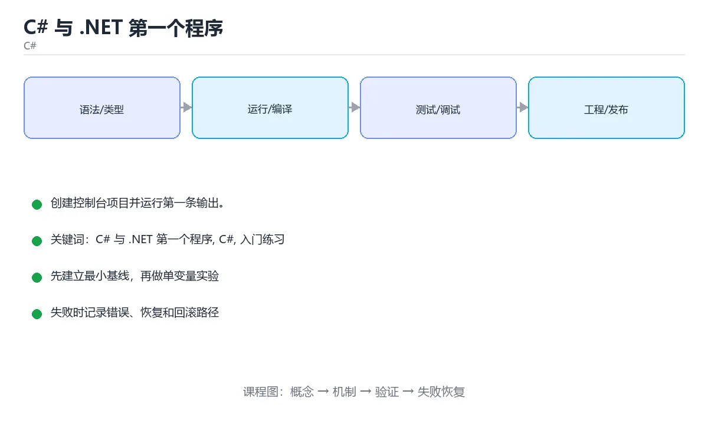

# C# 与 .NET 第一个程序



> 内容更新时间：2026-10-03 · 学习阶段：入门 · 预计用时：15 分钟

## 学习目标

- 先认识「C# 与 .NET 第一个程序」需要的工具、输入和输出。
- 按步骤运行最小示例，并记录结果与错误。
- 用一个边界输入验证自己是否真正掌握。

## 前置知识

- 会进行基本的文件或命令行操作。
- 不需要预先掌握「C#」的高级知识。

## 一句话入门

创建控制台项目并运行第一条输出。

## 最小示例

```csharp
Console.WriteLine("hello from C#");
```

## 预期输出

```text
hello from C#
```

## 常见错误

- 输入转换失败没有处理，运行时抛出 FormatException。
- 复制命令时遗漏空格、引号或必要参数。

## 动手练习

1. 原样运行最小示例，保存命令和输出。
2. 把数字 2 改成 10，预测并验证新结果。
3. 制造一个错误输入，写出错误信息和修复方法。

## 本课小结

- 入门阶段先保证能运行、能观察、能解释，再追求复杂功能。
- 每次只改一个变量，记录预测与实际结果。
- 遇到错误先看第一条错误信息，再回到最小示例。


## 代码实验：把示例跑成证据

这一节不引入新语法，而是把「C# 与 .NET 第一个程序」的最小示例变成可以复现、可以对照的实验。每次只改变一个条件，先写预测，再运行，最后解释差异。

### 实验一：建立基线

```csharp
Console.WriteLine("hello from C#");
```

先原样运行上面的代码，记录命令、完整输出和退出状态。然后把输出与正文的预期输出逐字对照，不要用“看起来差不多”代替核对；空格、大小写、换行和错误流向都可能暴露环境差异。

### 实验二：只改一个输入

从代码中选一个会影响结果的字面量、参数或输入，把它替换成边界值：数值可尝试 0、1、最大值和最小值，字符串可尝试空串和超长文本，集合可尝试空集合、单元素和重复元素。先写出预测，再运行并记录实际结果。

### 实验三：制造一个可控错误

把变量声明成不兼容的类型，或者删除一个必要的分号。记录编译器给出的类型错误与位置，修复后确认输出没有变化。

| 实验 | 改动 | 预测 | 实际 | 结论 |
| --- | --- | --- | --- | --- |
| 基线 | 保持原样 |  |  |  |
| 边界 |  |  |  |  |
| 失败 |  |  |  |  |

### 实验四：用三句话复述

1. 输入是什么，哪些输入属于合法范围，哪些属于边界或非法范围？
2. 程序按什么顺序处理输入，在哪一步产生了状态变化或副作用？
3. 输出如何验证，失败时第一条可观察证据是什么？

## C# 与 .NET 基础机制速览

### 编译、CLR 与程序集

C# 代码先编译成中间语言和元数据，运行时由 CLR 通过即时编译或提前编译转换为机器码。程序集是部署和版本控制的基本单位，包含类型、方法和资源。命名空间只负责组织名字，不决定物理文件位置。`dotnet new` 创建项目，`dotnet build` 编译，`dotnet run` 运行，`dotnet test` 执行测试，理解工具链能快速定位“编译失败”和“运行失败”。

### 类型、值与引用

C# 类型分为值类型和引用类型。结构体、枚举和大多数基元类型是值类型，赋值时复制内容；类、数组、委托和字符串是引用类型，赋值时复制引用。装箱把值类型转成对象，拆箱再转回来，频繁发生会增加分配和复制成本。`var` 只是让编译器推断类型，不会变成动态类型；`dynamic` 才把类型检查推迟到运行时。

### 方法、重载与参数

方法可以有重载、可选参数、命名参数、`params` 可变参数和扩展方法。重载根据参数列表选择，返回类型不参与。`ref`、`out`、`in` 控制参数的传递方式：`ref` 可读可写，`out` 必须在方法内赋值，`in` 只读引用。局部函数和 lambda 可以捕获外部变量，但要注意闭包生命周期和循环变量捕获。异步方法返回 `Task` 或 `Task<T>`，调用方通常使用 `await`。

### 集合、LINQ 与可空性

`List<T>`、`Dictionary<TKey,TValue>`、`HashSet<T>` 是最常用的泛型集合。LINQ 提供筛选、投影、分组、连接和聚合，延迟执行意味着查询只有在枚举时才真正运行；重复枚举可能重复计算或看到数据变化。可空引用类型在编译期提示可能的 null，公共方法仍要校验参数，边界层要把外部数据转换成有效对象。

### 资源管理与并发

实现 `IDisposable` 的对象应使用 `using` 或 `await using` 及时释放文件句柄、连接和锁。异常只用于异常情况，不要用异常处理正常分支。异步代码不要阻塞等待 `.Result` 或 `.Wait()`，否则可能造成线程池饥饿和死锁。并发集合、`lock`、`SemaphoreSlim` 和 `Channel` 各有适用场景，选择时要看清读写比例、公平性和取消需求。

## 本课自测清单与错误对照

下面把「C# 与 .NET 第一个程序」最容易混淆的选项集中起来。不要只记正确答案，要能说明错误选项在什么条件下看似合理、又为什么不能满足题干。

本课测验以直接定义和步骤判断为主。请把每个错误选项改写成一句反例，
说明它在哪个输入、边界或前提变化下会失败。

### 完成标准

- [ ] 能用具体输入复现最小示例，并逐行解释输入、处理与输出。
- [ ] 能只改一个值完成边界实验，并让预测与实际结果一致。
- [ ] 能制造一个可控错误，读出第一条错误信息并完成修复。
- [ ] 能不看书说出本课至少两个易错点和对应的验证方法。

### 复盘记录

| 项目 | 记录 |
| --- | --- |
| 学到的核心机制 |  |
| 仍然不确定的问题 |  |
| 下一步验证动作 |  |


## 考点精讲：把测验题还原成判断过程

本课有 4 个判断点。先自己作答，再看「判断依据」；如果结论正确但理由不完整，回到正文对应章节补足概念。

### 考点 1：创建并运行一个最小 C# 控制台项目，常见流程是？

- **正确判断**：用 dotnet new console 生成项目
- **判断依据**：dotnet new console 生成包含项目文件与 Program.cs 的最小工程，dotnet run 会先编译再运行；也可以先 dotnet build 再执行生成物。C# 运行在 .NET 上，不需要 JDK，源文件也不能靠改扩展名变成可执行文件。理解 SDK、项目文件与运行时的分工，是排查环境问题的起点。
- **迁移检查**：遮住选项，只根据定义复述一次答案，再回来看哪个选项与复述一致。

### 考点 2：Console.WriteLine("hello from C#") 的行为是？

- **正确判断**：把文本写到控制台并换行，Write 则不换行
- **判断依据**：Console.WriteLine 输出内容后换行，Console.Write 输出后光标停在行尾，二者都写到标准输出，不会自动写到文件或环境变量。正式运行时输出依然存在，只是常常改用日志框架来分级管理。示例中已隐含 using System，因此可以直接写 Console 而无需完整限定名。
- **迁移检查**：如果给某个错误选项去掉一个限定词，它会不会变成正确？说明理由。

### 考点 3：C# 中 using System; 这类指令的作用是？

- **正确判断**：引入命名空间，让代码可以直接使用其中的类型名
- **判断依据**：using 指令把命名空间引入当前文件的作用域，于是可以写 Console 而不用写完整限定名 System.Console；它不会改变编译平台，也不是复制代码。现代项目还可以启用隐式 using 由 SDK 统一引入常用命名空间。命名空间用于组织类型并避免命名冲突，是理解 .NET 类库结构的基础。
- **迁移检查**：把题干里的一个条件换成边界值，原来的结论还成立吗？写出判断过程。

### 考点 4：.NET 程序通常先编译成什么形式再运行？

- **正确判断**：编译成中间语言 IL，由运行时即时编译后执行
- **判断依据**：C# 编译器把源码编译成中间语言 IL 并打包成程序集，运行时在加载方法时把 IL 即时编译成机器码，这带来了跨平台与运行时优化能力。发布时也可以选择提前编译（AOT）以缩短启动时间。理解 IL 与运行时的分工，能解释为什么目标机器需要安装对应版本的 .NET 运行时。
- **迁移检查**：遮住选项，只根据定义复述一次答案，再回来看哪个选项与复述一致。

## 本课复习清单

离开本课前，逐项确认：

- [ ] 不看解析，能说出「创建并运行一个最小 C# 控制台项目，常见流程是？」的判断依据。
- [ ] 不看解析，能说出「Console.WriteLine("hello from C#") 的行为是？」的判断依据。
- [ ] 不看解析，能说出「C# 中 using System; 这类指令的作用是？」的判断依据。
- [ ] 不看解析，能说出「.NET 程序通常先编译成什么形式再运行？」的判断依据。
- [ ] 至少运行一次本课示例，记录输入、输出和一个边界情况。
- [ ] 把本课最容易混淆的两个概念写成一句话对照。

| 复盘项 | 记录 |
| --- | --- |
| 已经能独立解释的考点 |  |
| 仍然说不清的概念 |  |
| 下一步验证动作 |  |

## 逐节复习与自检

下面按正文顺序回顾每一节，并给出一个自检问题；说不清的地方回到原章节补课。

### 最小示例

```csharp
Console.WriteLine("hello from C#");
```

自检：这一节与相邻主题的边界在哪里？

### 预期输出

```text
hello from C#
```

自检：这一节与相邻主题的边界在哪里？

### 常见错误

输入转换失败没有处理，运行时抛出 FormatException。

自检：把这一节讲给没学过的人，最需要强调哪一点？

### 动手练习

把数字 2 改成 10，预测并验证新结果。制造一个错误输入，写出错误信息和修复方法。

自检：如果去掉这一节里的一个前提，结论会怎样变化？

## 术语速查

| 术语 | 本课语境 |
| --- | --- |
| `dotnet new` | C# 代码先编译成中间语言和元数据，运行时由 CLR 通过即时编译或提前编译转换为机器码。程序集是部署和版本控制的基本单位，包含类型、方法和资源。命名空间只负责组织名字，不决定物理文件位置。`dotnet new` 创建项目，`dotnet… |
| `dotnet build` | C# 代码先编译成中间语言和元数据，运行时由 CLR 通过即时编译或提前编译转换为机器码。程序集是部署和版本控制的基本单位，包含类型、方法和资源。命名空间只负责组织名字，不决定物理文件位置。`dotnet new` 创建项目，`dotnet… |
| `dotnet run` | C# 代码先编译成中间语言和元数据，运行时由 CLR 通过即时编译或提前编译转换为机器码。程序集是部署和版本控制的基本单位，包含类型、方法和资源。命名空间只负责组织名字，不决定物理文件位置。`dotnet new` 创建项目，`dotnet… |
| `dotnet test` | C# 代码先编译成中间语言和元数据，运行时由 CLR 通过即时编译或提前编译转换为机器码。程序集是部署和版本控制的基本单位，包含类型、方法和资源。命名空间只负责组织名字，不决定物理文件位置。`dotnet new` 创建项目，`dotnet… |
| `var` | C# 类型分为值类型和引用类型。结构体、枚举和大多数基元类型是值类型，赋值时复制内容；类、数组、委托和字符串是引用类型，赋值时复制引用。装箱把值类型转成对象，拆箱再转回来，频繁发生会增加分配和复制成本。`var` 只是让编译器推断类型，不会… |
| `dynamic` | C# 类型分为值类型和引用类型。结构体、枚举和大多数基元类型是值类型，赋值时复制内容；类、数组、委托和字符串是引用类型，赋值时复制引用。装箱把值类型转成对象，拆箱再转回来，频繁发生会增加分配和复制成本。`var` 只是让编译器推断类型，不会… |
| `params` | 方法可以有重载、可选参数、命名参数、`params` 可变参数和扩展方法。重载根据参数列表选择，返回类型不参与。`ref`、`out`、`in` 控制参数的传递方式：`ref` 可读可写，`out` 必须在方法内赋值，`in` 只读引用。局… |
| `ref` | 方法可以有重载、可选参数、命名参数、`params` 可变参数和扩展方法。重载根据参数列表选择，返回类型不参与。`ref`、`out`、`in` 控制参数的传递方式：`ref` 可读可写，`out` 必须在方法内赋值，`in` 只读引用。局… |
| `out` | 方法可以有重载、可选参数、命名参数、`params` 可变参数和扩展方法。重载根据参数列表选择，返回类型不参与。`ref`、`out`、`in` 控制参数的传递方式：`ref` 可读可写，`out` 必须在方法内赋值，`in` 只读引用。局… |
| `in` | 方法可以有重载、可选参数、命名参数、`params` 可变参数和扩展方法。重载根据参数列表选择，返回类型不参与。`ref`、`out`、`in` 控制参数的传递方式：`ref` 可读可写，`out` 必须在方法内赋值，`in` 只读引用。局… |
| `Task` | 方法可以有重载、可选参数、命名参数、`params` 可变参数和扩展方法。重载根据参数列表选择，返回类型不参与。`ref`、`out`、`in` 控制参数的传递方式：`ref` 可读可写，`out` 必须在方法内赋值，`in` 只读引用。局… |
| `Task<T>` | 方法可以有重载、可选参数、命名参数、`params` 可变参数和扩展方法。重载根据参数列表选择，返回类型不参与。`ref`、`out`、`in` 控制参数的传递方式：`ref` 可读可写，`out` 必须在方法内赋值，`in` 只读引用。局… |

## English Overview

**Title:** First C# and .NET Program

**Summary:** Create a console project and run it.

**Category:** C#  
**Level:** 入门  
**Key terms:** C# 与 .NET 第一个程序, C#, 入门练习

> The full tutorial is written in Chinese. This bilingual overview helps English readers identify the topic, scope and key terms before studying the detailed examples.

## 内容元数据

- 内容版本：v2.0
- 最后更新：2026-10-03
- 学习阶段：入门
- 适用环境：.NET 9 / C# 13
- 内容来源：内置结构化课程与工程实践整理
- 相关主题：C# 与 .NET 第一个程序、C#、入门练习
- 质量版本：P0 测验标准 + P1 覆盖扩展 + P2 体验补全


## 参考资料与复核

- 最后复核：2026-10-04
- 下次复核：2027-04-04
- 复核范围：版本兼容、API 行为、安全建议与工程实践
- 来源性质：官方文档与标准；本课正文为离线教学重组，不复制原文

| 参考资料 | 本课用途 |
| --- | --- |
| [C# 官方指南](https://learn.microsoft.com/dotnet/csharp/) | 语言、异步与模式匹配 |
| [.NET 文档](https://learn.microsoft.com/dotnet/) | 运行时、GC 与发布 |

> 本课主题：创建控制台项目并运行第一条输出。

> App 完全离线展示文字链接，不会自动联网；需要延伸阅读时可复制链接到浏览器。
