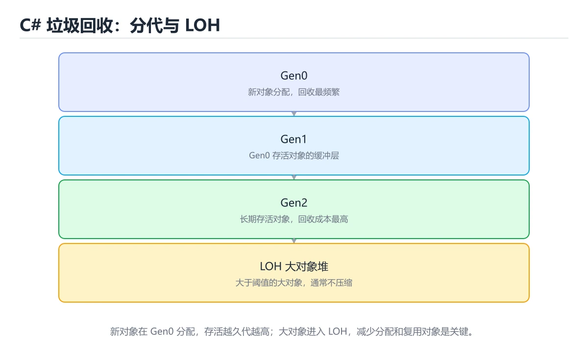
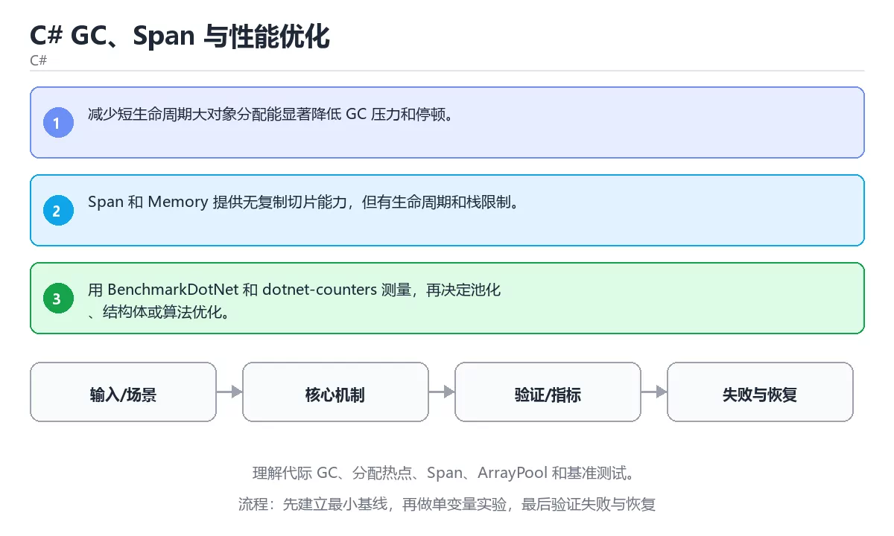

# 本课主题

> 内容更新时间：2026-10-03





## 学习目标

- 能用自己的话解释：减少短生命周期大对象分配能显著降低 GC 压力和停顿。
- 能用自己的话解释：Span 和 Memory 提供无复制切片能力，但有生命周期和栈限制。
- 能用自己的话解释：用 BenchmarkDotNet 和 dotnet-counters 测量，再决定池化、结构体或算法优化。
- 能把本课知识放回「C#」，并完成练习与测验。

## 前置知识

- 已完成「C#」的基础课程，能运行正文中的最小示例。
- 本课关键词：GC、Span、ArrayPool、BenchmarkDotNet。
- 遇到不熟悉的术语先记录问题，完成练习后再回读。

## 核心知识

### 1. 减少短生命周期大对象分配能显著降低 GC 压力和停顿。

- 关键做法：先用最小示例建立基线，再逐步加入边界、失败和性能条件。
- 验证标准：结果可复现、错误可解释、边界有测试、失败能恢复。

### 2. Span 和 Memory 提供无复制切片能力，但有生命周期和栈限制。

### 3. 用 BenchmarkDotNet 和 dotnet-counters 测量，再决定池化、结构体或算法优化。

## 关键流程

```text
输入 → 校验 → 核心处理 → 验证 → 记录指标 → 失败恢复
```

## 实践路径

1. 用一句话复述本课要解决的问题。
2. 跑通正文中的最小示例并记录基线。
3. 只改变一个输入或参数，预测并验证结果。
4. 补一个失败路径，记录错误、恢复和指标。
5. 把结论写成可复现的笔记或测试。

## 常见误区

| 误区 | 后果 | 修正 |
| --- | --- | --- |
| 只记术语不做实验 | 遇到真实问题无法判断 | 用最小输入跑通并记录结果 |
| 只测正常路径 | 边界和故障上线才暴露 | 补空值、极值和依赖失败 |
| 没有基线就优化 | 无法证明改进有效 | 先测量再修改 |
| 忽略成本与安全 | 性能和风险失控 | 同时记录资源、权限与失败代价 |

## 动手练习

1. 合上教程，用 3～5 句话解释本课主题。
2. 从正文选一个例子，改变一个条件并预测结果。
3. 设计一个失败场景，写出止损与恢复步骤。

**验收标准**：留下输入、命令、输出、差异和下一步问题。

## 本课小结

- 本课属于「C#」，核心关键词是 GC、Span、ArrayPool、BenchmarkDotNet。
- 先保证正确与可复现，再讨论性能和扩展。
- 完成练习和测验后，把仍然不确定的问题写成下一轮验证清单。

> 本课由 P1 内容扩展生成，重点补充原有课程缺失的主题与工程边界。

## 实践任务

本节围绕本课主题安排 3 个可交付任务，每个任务都要求留下可以复查的记录。

### 任务 1：用自己的话画出结构

### 任务 2：做一次对比实验

**验收标准**：表格里两个方案的结论不能完全一样；写下“在什么条件下应该换方案”。

### 任务 3：迁移到自己的场景

**验收标准**：至少有一个可复现的命令、代码片段或数据样例；结论能被别人独立检查。

## 故障现场

### 现场 1：本课的 GC 常规用例通过，但边界用例失败

**症状**：在本课的练习或生产场景里出现“本课的 GC 常规用例通过，但边界用例失败”。

**复现**：准备一组最小输入，只保留触发“本课的 GC 常规用例通过，但边界用例失败”的必要条件，连续运行两次确认结果稳定。

**定位**：围绕“GC 的前置条件与取值边界没有写进代码，默认值掩盖了空值和极值”检查调用链、输入数据和环境配置，先验证假设再改代码。

**预防**：把“本课的 GC 常规用例通过，但边界用例失败”写成一条自动化用例，并在本课的验收清单里保留对应检查项。

### 现场 2：本课的 Span 结果在两次运行之间不一致

**症状**：在本课的练习或生产场景里出现“本课的 Span 结果在两次运行之间不一致”。

**复现**：准备一组最小输入，只保留触发“本课的 Span 结果在两次运行之间不一致”的必要条件，连续运行两次确认结果稳定。

**定位**：围绕“Span 依赖了当前版本、执行顺序或共享状态，单次运行无法暴露差异”检查调用链、输入数据和环境配置，先验证假设再改代码。

**预防**：把“本课的 Span 结果在两次运行之间不一致”写成一条自动化用例，并在本课的验收清单里保留对应检查项。

### 现场 3：本课的验证只在开发机通过

**症状**：在本课的练习或生产场景里出现“本课的验证只在开发机通过”。

**定位**：围绕“环境版本、配置和输入规模与目标环境不同，GC 缺少可重复的验证记录”检查调用链、输入数据和环境配置，先验证假设再改代码。

## 版本与时效

- .NET 10 是当前 LTS 主线，C# 版本随 SDK 一起演进
- 主构造函数、集合表达式、模式匹配与 AOT/裁剪是升级重点
- 升级前检查 NuGet 依赖、序列化行为与运行时标识
- 官方说明：https://learn.microsoft.com/dotnet/core/whats-new/

### 升级检查清单

- 先固定当前版本，跑通全部示例与测验，再升级工具链。
- 只改一个版本变量，记录编译、测试、性能与产物体积的变化。
- 重点回归默认值、弃用警告、序列化格式、并发语义和错误信息。
- 升级完成后更新本课的“最后复核 / 下次复核”日期与版本说明。

## 本课复习清单

离开本课前，逐项确认：

- [ ] 不看解析，能说出「关于「减少短生命周期大对象分配能显著降低 …」，下列说法正确的是？」的判断依据。
- [ ] 不看解析，能说出「关于「Span 和 Memory 提供无复…」，下列说法正确的是？」的判断依据。
- [ ] 不看解析，能说出「关于「用 BenchmarkDotNet …」，下列说法正确的是？」的判断依据。
- [ ] 不看解析，能说出「本课的核心学习目标是什么？」的判断依据。
- [ ] 至少运行一次本课示例，记录输入、输出和一个边界情况。
- [ ] 把本课最容易混淆的两个概念写成一句话对照。

| 复盘项 | 记录 |
| --- | --- |
| 已经能独立解释的考点 |  |
| 仍然说不清的概念 |  |
| 下一步验证动作 |  |

## 逐节复习与自检

下面按正文顺序回顾每一节，并给出一个自检问题；说不清的地方回到原章节补课。

### 核心知识

自检：这一节与相邻主题的边界在哪里？

### 动手练习

自检：如果去掉这一节里的一个前提，结论会怎样变化？

### 最小可运行示例

```csharp
Span<int> values = stackalloc int[4];
for (int i = 0; i < values.Length; i++)
{
    values[i] = i * i;
}
Console.WriteLine(string.Join(",", values.ToArray()));
```

自检：把这一节讲给没学过的人，最需要强调哪一点？

### 预期输出

```text
0,1,4,9
```

### 验证步骤

制造一次错误输入，记录错误信息与修复方式。

## 易错点回顾

- **关于「减少短生命周期大对象分配能显著降低 …」，下列说法正确的是？**：正确答案是「减少短生命周期大对象分配能显著降低 GC 压力和停顿。
- **关于「Span 和 Memory 提供无复…」，下列说法正确的是？**：正确答案是「Span 和 Memory 提供无复制切片能力，但有生命周期和栈限制。
- **本课的核心学习目标是什么？**：正确答案是「理解代际 GC、分配热点、Span、ArrayPool 和基准测试。

## 术语速查

| 术语 | 本课语境 |
| --- | --- |
| `GC` | 本课围绕该主题展开，结合正文与代码示例理解它的适用边界。 |
| `Span` | 本课围绕该主题展开，结合正文与代码示例理解它的适用边界。 |
| `ArrayPool` | 本课围绕该主题展开，结合正文与代码示例理解它的适用边界。 |
| `BenchmarkDotNet` | 本课围绕该主题展开，结合正文与代码示例理解它的适用边界。 |

## 深度拓展与实战

这一节把正文里的定义、代码和失败模式串成一条可操作的复习路线。

### 机制拆解

- **1. 减少短生命周期大对象分配能显著降低 GC 压力和停顿。**：1. 减少短生命周期大对象分配能显著降低 GC 压力和停顿
- **2. Span 和 Memory 提供无复制切片能力，但有生命周期和栈限制。**：2. Span 和 Memory 提供无复制切片能力，但有生命周期和栈限制
- **3. 用 BenchmarkDotNet 和 dotnet-counters 测量，再决定池化、结构体或算法优化。**：3. 用 BenchmarkDotNet 和 dotnet-counters 测量，再决定池化、结构体或算法优化
- **考点 1：关于「减少短生命周期大对象分配能显著降低 …」，下列说法正确的是？**：考点 1：关于「减少短生命周期大对象分配能显著降低 …」，下列说法正确的是
- **考点 2：关于「Span 和 Memory 提供无复…」，下列说法正确的是？**：考点 2：关于「Span 和 Memory 提供无复…」，下列说法正确的是

### 边界条件与常见反例

### 工程检查表

- [ ] 能否用自己的话说明本课主题解决什么问题，以及它不负责什么？
- [ ] 能否指出最小可运行示例的输入、输出和一条失败路径？
- [ ] 能否解释本课关键词在真实项目中的边界与取舍？
- [ ] 能否把本课方法迁移到另一个相近问题，并说明需要改什么？

### 迁移练习

1. 保持正文示例不变，写出它的输入、处理步骤和预期输出。
2. 只改变一个条件，预测结果并说明依据；再运行或手算验证。
3. 结合GC、Span、ArrayPool、BenchmarkDotNet，写出一个真实项目中的使用场景。
4. 写下一个反例，说明它在什么条件下会使朴素做法失效。

## 考点精讲

### 考点 1：关于「减少短生命周期大对象分配能显著降低 …」，下列说法正确的是？

- **判断依据**：正确答案是「减少短生命周期大对象分配能显著降低 GC 压力和停顿」。正确答案是减少短生命周期大对象分配能显著降低 GC 压力和停顿。判断这类题时，要把减少短生命周期大对象分配能显著降低 GC 压力和停顿。判断这类题时，要把「减少短生命周期大对象分配能显著降低 GC 压力和停顿。」放回题干限定的对象、输入和边界，「record 提供值相等和简洁语法，with 可创建修改…」、「IAsyncEnumerable 按需异步产出数据，适合…」 等说法虽然包含相关术语，但范围或前提与本题不一致。

### 考点 2：关于「Span 和 Memory 提供无复…」，下列说法正确的是？

- **判断依据**：本题应选「Span 和 Memory 提供无复制切片能力，但有生命周期和栈限制」。本题应选Span 和 Memory 提供无复制切片能力，但有生命周期和栈限制。正确答案是Span 和 Memory 提供无复制切片能力，但有生命周期和栈限制。解题的关键不是记住孤立术语，而是确认Span 和 Memory 提供无复制切片能力，但有生命周期和栈限制。

### 考点 3：下面这段 C# 代码复现了“C# GC、Span 与性能优化”中 GC、Span、ArrayPool 相关的一个常见故障，哪一项最准确地解释了问题？

- **判断依据**：符合题干条件的是「foreach 期间修改集合会抛出 InvalidOperationException，应遍历副本或使用 RemoveAll」。符合题干条件的是foreach 期间修改集合会抛出 InvalidOperationException，应遍历副本或使用 RemoveAll。在这个复现里，GC 的修改与遍历发生了冲突。在这个复现里，要让 Span 的结果稳定，可以遍历 items.ToList() 副本，或使用 items.RemoveAll(item => item % 2 == 0)。

### 考点 4：「C# GC、Span 与性能优化」的核心学习目标是什么？

- **判断依据**：结论应落在「理解代际 GC、分配热点、Span、ArrayPool 和基准测试」。结论应落在理解代际 GC、分配热点、Span、ArrayPool 和基准测试。正确答案是理解代际 GC、分配热点、Span、ArrayPool 和基准测试。这道题要求区分概念与边界，理解代际 GC、分配热点、Span、ArrayPool 和基准测试。

### 考点 5：以下哪些术语与「C# GC、Span 与性能优化」直接相关？（多选）

- **判断依据**：正确答案包括「GC」、「Span」。Span放回题干限定的对象、输入和边界，GC、entrypoint 等说法虽然包含相关术语，但范围或前提与本题不一致。围绕 以下哪些术语与本课主题直接相关（csharpgcperformance 第 5 题）。（多选） 作答时，先用GC建立输入与输出的基线，再把GC。

### 考点 6：按照「C# GC、Span 与性能优化」从概念到实践的讲解顺序排列下列主题。

- **判断依据**：结合GC、Span来看，正确的执行顺序是「核心知识 → 关键流程 → 实践路径 → 常见误区」。本课围绕理解代际 GC、分配热点、Span、ArrayPool 和基准测试。结合GC、Span来看，解题的关键不是记住孤立术语，而是确认「核心知识 → 关键流程 → 实践路径 → 常见误区」是否完整覆盖题干的输入、输出和失败路径，并排除「核心知识」、「关键流程」这类相邻概念。

## English Overview

**Title:** C# GC, Span and Performance

**Summary:** Learn generational GC, allocations, Span, ArrayPool and benchmarking.

**Category:** C#
**Level:** 高级
**Key terms:** GC, Span, ArrayPool, BenchmarkDotNet

## 内容元数据

- 内容版本：v2.0
- 最后更新：2026-10-03
- 学习阶段：高级
- 适用环境：.NET 9 / C# 13
- 内容来源：内置结构化课程与工程实践整理
- 相关主题：GC、Span、ArrayPool、BenchmarkDotNet
- 质量版本：P0 测验标准 + P1 覆盖扩展 + P2 体验补全

## 最小可运行示例

下面示例用于验证本课的最小输入、处理和输出。先原样运行，再只修改一个值：

```csharp
Span<int> values = stackalloc int[4];
for (int i = 0; i < values.Length; i++)
{
    values[i] = i * i;
}
Console.WriteLine(string.Join(",", values.ToArray()));
```

## 预期输出

```text
0,1,4,9
```

## 验证步骤

1. 记录运行环境、命令和真实输出。
2. 修改一个输入，先写预测再运行。
4. 把结论写回本课笔记或测试用例。


## 参考资料与复核

- 最后复核：2026-10-04
- 下次复核：2027-04-04
- 复核范围：版本兼容、API 行为、安全建议与工程实践
- 来源性质：官方文档、标准或权威教材；正文为离线教学重组

| 参考资料 | 本课用途 |
| --- | --- |
| [.NET GC 文档](https://learn.microsoft.com/dotnet/standard/garbage-collection/) | 垃圾回收与内存 |
| [C# 指南](https://learn.microsoft.com/dotnet/csharp/) | 语言语法与类型系统 |
| [EF Core 文档](https://learn.microsoft.com/ef/core/) | ORM、迁移与并发 |

> 「C# GC、Span 与性能优化」的链接用于离线阅读后的延伸核对；App 不会自动联网。

## 复习与迁移

- 围绕「关于「减少短生命周期大对象分配能显著降低 …」，下列说法正确的是？」做迁移时，先记录输入、边界和预期，再观察GC对结果的影响，并用「减少短生命周期大对象分配能显著降低 GC 压力和停顿。」解释正常与失败路径。
- 把Span放进最小实验：固定版本和输入，只改变一个条件，记录输出差异，并说明「Span 和 Memory 提供无复制切片能力，但有生命周期和栈限制。」在什么前提下成立。
- 复习「下面这段 C# 代码复现了本课主题中 GC、Span、ArrayPool 相关的一个常见故障，哪…」时，不要只背结论；用ArrayPool的边界值复现一次，再把现象、原因和修复写成三步记录。
- 如果把BenchmarkDotNet换成空值、极值或并发输入，「理解代际 GC、分配热点、Span、ArrayPool 和基准测试。」是否仍然成立？写出验证命令和观察到的结果。
- 围绕「以下哪些术语与本课主题直接相关？（多选）」做迁移时，先记录输入、边界和预期，再观察GC对结果的影响，并用「GC；Span」解释正常与失败路径。
- 把Span放进最小实验：固定版本和输入，只改变一个条件，记录输出差异，并说明「核心知识 → 关键流程 → 实践路径 → 常见误区」在什么前提下成立。
- 复习「关于「减少短生命周期大对象分配能显著降低 …」，下列说法正确的是？」时，不要只背结论；用ArrayPool的边界值复现一次，再把现象、原因和修复写成三步记录。
- 如果把BenchmarkDotNet换成空值、极值或并发输入，「Span 和 Memory 提供无复制切片能力，但有生命周期和栈限制。」是否仍然成立？写出验证命令和观察到的结果。
- 围绕「下面这段 C# 代码复现了本课主题中 GC、Span、ArrayPool 相关的一个常见故障，哪…」做迁移时，先记录输入、边界和预期，再观察GC对结果的影响，并用「foreach 期间修改集合会抛出 InvalidOperationExceptio…」解释正常与失败路径。
- 把Span放进最小实验：固定版本和输入，只改变一个条件，记录输出差异，并说明「理解代际 GC、分配热点、Span、ArrayPool 和基准测试。」在什么前提下成立。
- 复习「以下哪些术语与本课主题直接相关？（多选）」时，不要只背结论；用ArrayPool的边界值复现一次，再把现象、原因和修复写成三步记录。
- 如果把BenchmarkDotNet换成空值、极值或并发输入，「核心知识 → 关键流程 → 实践路径 → 常见误区」是否仍然成立？写出验证命令和观察到的结果。

<!-- p0p1-review:start -->
## 复习与迁移

- 围绕「关于「减少短生命周期大对象分配能显著降低 …」，下列说法正确的是？」做迁移时，先记录输入、边界和预期，再观察GC对结果的影响，并用「减少短生命周期大对象分配能显著降低 GC 压力和停顿。」解释正常与失败路径。
- 把Span放进最小实验：固定版本和输入，只改变一个条件，记录输出差异，并说明「Span 和 Memory 提供无复制切片能力，但有生命周期和栈限制。」在什么前提下成立。
- 复习「下面这段 C# 代码复现了本课主题中 GC、Span、ArrayPool 相关的一个常见故障，哪…」时，不要只背结论；用ArrayPool的边界值复现一次，再把现象、原因和修复写成三步记录。
- 如果把BenchmarkDotNet换成空值、极值或并发输入，「理解代际 GC、分配热点、Span、ArrayPool 和基准测试。」是否仍然成立？写出验证命令和观察到的结果。
- 围绕「以下哪些术语与本课主题直接相关？（多选）」做迁移时，先记录输入、边界和预期，再观察GC对结果的影响，并用「GC；Span」解释正常与失败路径。
- 把Span放进最小实验：固定版本和输入，只改变一个条件，记录输出差异，并说明「核心知识 → 关键流程 → 实践路径 → 常见误区」在什么前提下成立。
- 复习「关于「减少短生命周期大对象分配能显著降低 …」，下列说法正确的是？」时，不要只背结论；用ArrayPool的边界值复现一次，再把现象、原因和修复写成三步记录。
- 如果把BenchmarkDotNet换成空值、极值或并发输入，「Span 和 Memory 提供无复制切片能力，但有生命周期和栈限制。」是否仍然成立？写出验证命令和观察到的结果。
- 围绕「下面这段 C# 代码复现了本课主题中 GC、Span、ArrayPool 相关的一个常见故障，哪…」做迁移时，先记录输入、边界和预期，再观察GC对结果的影响，并用「foreach 期间修改集合会抛出 InvalidOperationExceptio…」解释正常与失败路径。
- 把Span放进最小实验：固定版本和输入，只改变一个条件，记录输出差异，并说明「理解代际 GC、分配热点、Span、ArrayPool 和基准测试。」在什么前提下成立。
- 复习「以下哪些术语与本课主题直接相关？（多选）」时，不要只背结论；用ArrayPool的边界值复现一次，再把现象、原因和修复写成三步记录。
- 如果把BenchmarkDotNet换成空值、极值或并发输入，「核心知识 → 关键流程 → 实践路径 → 常见误区」是否仍然成立？写出验证命令和观察到的结果。
- 围绕「关于「减少短生命周期大对象分配能显著降低 …」，下列说法正确的是？」做迁移时，先记录输入、边界和预期，再观察GC对结果的影响，并用「减少短生命周期大对象分配能显著降低 GC 压力和停顿。」解释正常与失败路径。
- 把Span放进最小实验：固定版本和输入，只改变一个条件，记录输出差异，并说明「Span 和 Memory 提供无复制切片能力，但有生命周期和栈限制。」在什么前提下成立。
- 复习「下面这段 C# 代码复现了本课主题中 GC、Span、ArrayPool 相关的一个常见故障，哪…」时，不要只背结论；用ArrayPool的边界值复现一次，再把现象、原因和修复写成三步记录。
- 如果把BenchmarkDotNet换成空值、极值或并发输入，「理解代际 GC、分配热点、Span、ArrayPool 和基准测试。」是否仍然成立？写出验证命令和观察到的结果。
- 围绕「以下哪些术语与本课主题直接相关？（多选）」做迁移时，先记录输入、边界和预期，再观察GC对结果的影响，并用「GC；Span」解释正常与失败路径。
- 把Span放进最小实验：固定版本和输入，只改变一个条件，记录输出差异，并说明「核心知识 → 关键流程 → 实践路径 → 常见误区」在什么前提下成立。
- 复习「关于「减少短生命周期大对象分配能显著降低 …」，下列说法正确的是？」时，不要只背结论；用ArrayPool的边界值复现一次，再把现象、原因和修复写成三步记录。
- 如果把BenchmarkDotNet换成空值、极值或并发输入，「Span 和 Memory 提供无复制切片能力，但有生命周期和栈限制。」是否仍然成立？写出验证命令和观察到的结果。
<!-- p0p1-review:end -->
