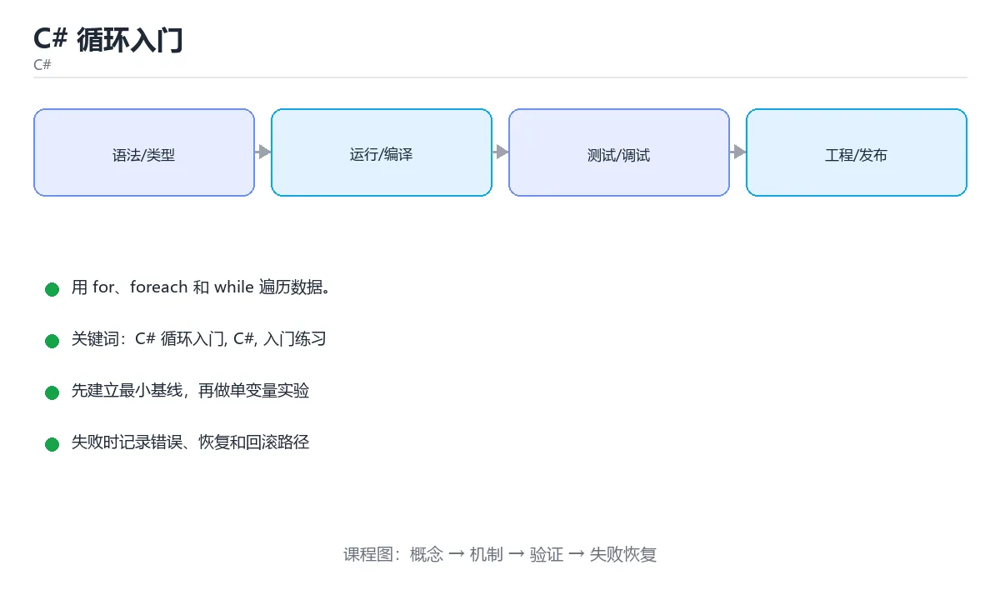

# C# 循环入门



> 内容更新时间：2026-10-03 · 学习阶段：入门 · 预计用时：15 分钟

## 学习目标

- 先认识「C# 循环入门」需要的工具、输入和输出。
- 按步骤运行最小示例，并记录结果与错误。
- 用一个边界输入验证自己是否真正掌握。

## 前置知识

- 会进行基本的文件或命令行操作。
- 不需要预先掌握「C#」的高级知识。

## 一句话入门

用 for、foreach 和 while 遍历数据。

## 最小示例

```csharp
int total = 0;
for (int i = 1; i <= 5; i++)
{
    total += i;
}
Console.WriteLine($"total={total}");
```

## 预期输出

```text
total=15
```

## 常见错误

- 输入转换失败没有处理，运行时抛出 FormatException。
- 复制命令时遗漏空格、引号或必要参数。

## 动手练习

1. 原样运行最小示例，保存命令和输出。
2. 把数字 2 改成 10，预测并验证新结果。
3. 制造一个错误输入，写出错误信息和修复方法。

## 本课小结

- 入门阶段先保证能运行、能观察、能解释，再追求复杂功能。
- 每次只改一个变量，记录预测与实际结果。
- 遇到错误先看第一条错误信息，再回到最小示例。


## for、foreach、while 与 do-while

C# 的 `for` 适合已知次数或需要下标的循环，`foreach` 适合遍历实现 `IEnumerable` 的集合，`while` 先判断条件，`do-while` 至少执行一次。`foreach` 内部使用枚举器，集合在遍历期间被修改通常会抛出 `InvalidOperationException`；需要同时删除元素时，应倒序使用 `for`、先收集待删除项再处理，或使用支持并发修改的专用集合。

循环变量的作用域和闭包捕获也要注意。在循环中创建 lambda 时，C# 5 之后 `foreach` 的迭代变量每轮是独立变量，但 `for` 的循环变量仍然是同一个变量；如果异步任务或委托延迟执行，捕获的值可能全部是最后一次迭代的值。需要在循环内复制到局部变量，或把逻辑提取成方法。

`break` 退出循环，`continue` 进入下一轮，`return` 直接离开方法。深层嵌套循环可以用 `goto` 跳出，但更好的做法是把搜索逻辑提取成返回结果的方法。LINQ 可以把筛选、映射和聚合写成声明式链式调用，适合表达“做什么”；性能敏感或需要复杂控制流时，普通循环通常更直观、分配更少。

## 集合修改、性能与提前退出

循环体里频繁分配对象、拼接字符串或查询集合会放大性能问题。字符串拼接应使用 `StringBuilder`，集合容量可预估时使用带初始容量的构造函数，避免多次扩容。`Count()` 对某些集合可能遍历全部元素，而 `Count` 属性是 O(1)；在循环条件里调用高成本查询会重复计算，应提前保存结果。

异常不应作为正常循环退出手段。能在循环内判断的条件就直接判断，只有真正的异常情况才抛出或捕获。异步循环使用 `await foreach` 时，要注意取消令牌、异常传播和背压；没有取消支持的长时间循环会让请求无法及时结束。

验证循环时覆盖零次、一次、边界次数、集合为空、集合在遍历中被修改和提前退出。对于性能相关代码，先测量再优化，用基准测试区分分配、CPU 和 I/O 瓶颈。循环的正确性、可读性和资源消耗要一起看，不能只追求少写几行。

## 代码实验：把示例跑成证据

这一节不引入新语法，而是把「C# 循环入门」的最小示例变成可以复现、可以对照的实验。每次只改变一个条件，先写预测，再运行，最后解释差异。

### 实验一：建立基线

```csharp
int total = 0;
for (int i = 1; i <= 5; i++)
{
    total += i;
}
Console.WriteLine($"total={total}");
```

先原样运行上面的代码，记录命令、完整输出和退出状态。然后把输出与正文的预期输出逐字对照，不要用“看起来差不多”代替核对；空格、大小写、换行和错误流向都可能暴露环境差异。

### 实验二：只改一个输入

从代码中选一个会影响结果的字面量、参数或输入，把它替换成边界值：数值可尝试 0、1、最大值和最小值，字符串可尝试空串和超长文本，集合可尝试空集合、单元素和重复元素。先写出预测，再运行并记录实际结果。

### 实验三：制造一个可控错误

把变量声明成不兼容的类型，或者删除一个必要的分号。记录编译器给出的类型错误与位置，修复后确认输出没有变化。

| 实验 | 改动 | 预测 | 实际 | 结论 |
| --- | --- | --- | --- | --- |
| 基线 | 保持原样 |  |  |  |
| 边界 |  |  |  |  |
| 失败 |  |  |  |  |

### 实验四：用三句话复述

1. 输入是什么，哪些输入属于合法范围，哪些属于边界或非法范围？
2. 程序按什么顺序处理输入，在哪一步产生了状态变化或副作用？
3. 输出如何验证，失败时第一条可观察证据是什么？

## 考点精讲：把测验题还原成判断过程

本课有 4 个判断点。先自己作答，再看「判断依据」；如果结论正确但理由不完整，回到正文对应章节补足概念。

### 考点 1：C# 的 foreach 循环适合什么场景？

- **正确判断**：依次访问集合或数组中的每个元素，不需要下标
- **判断依据**：正确答案是「依次访问集合或数组中的每个元素，不需要下标」，本课在「for、foreach、while 与 do-while」中说明：C# 的 for 适合已知次数或需要下标的循环，foreach 适合遍历实现 IEnumerable 的集合，while 先判断条件，do-while 至少执行一次。foreach 让编译器通过迭代器依次取出元素，代码简洁且不易越界，适合只读遍历。本课还在「for、foreach、while 与 do-while」中说明：在循环中创建 lambda 时，C# 5 之后 foreach 的迭代变量每轮是独立变量，但 for 的循环变量仍然是同一个变量。
- **迁移检查**：把题干里的一个条件换成边界值，原来的结论还成立吗？写出判断过程。

### 考点 2：在循环中使用 break 与 continue 的区别是？

- **正确判断**：break 结束整个循环，continue 直接开始下一轮迭代
- **判断依据**：正确答案是「break 结束整个循环，continue 直接开始下一轮迭代」，本课在「for、foreach、while 与 do-while」中说明：break 退出循环，continue 进入下一轮，return 直接离开方法。break 让控制流离开当前循环。本课还在「for、foreach、while 与 do-while」中说明：在循环中创建 lambda 时，C# 5 之后 foreach 的迭代变量每轮是独立变量，但 for 的循环变量仍然是同一个变量。
- **迁移检查**：把题干里的一个条件换成边界值，原来的结论还成立吗？写出判断过程。

### 考点 3：需要一段「至少执行一次、之后再判断条件」的逻辑，应使用？

- **正确判断**：do-while 循环，条件写在循环体之后
- **判断依据**：正确答案是「do-while 循环，条件写在循环体之后」，本课在「for、foreach、while 与 do-while」中说明：C# 的 for 适合已知次数或需要下标的循环，foreach 适合遍历实现 IEnumerable 的集合，while 先判断条件，do-while 至少执行一次。do-while 先执行循环体再判断条件，因此循环体至少运行一次，适合「先尝试、再决定是否重试」的流程。本课还在「集合修改、性能与提前退出」中说明：能在循环内判断的条件就直接判断，只有真正的异常情况才抛出或捕获。
- **迁移检查**：遮住选项，只根据定义复述一次答案，再回来看哪个选项与复述一致。

### 考点 4：阅读下面的 C# 代码，输出是什么？

- **正确判断**：参考输出：012
- **判断依据**：循环变量从 0 开始，只要小于 3 就继续，因此依次执行 i=0、1、2，循环结束时 i 变成 3 但不再进入循环体。Console.Write 不换行，所以三个数字连续输出为 012。针对「阅读下面的 C# 代码，输出是什么，」，本课在「for、foreach、while 与 do-while」中说明：需要在循环内复制到局部变量，或把逻辑提取成方法。本课还在「for、foreach、while 与 do-while」中说明：深层嵌套循环可以用 goto 跳出，但更好的做法是把搜索逻辑提取成返回结果的方法。
- **迁移检查**：把输出与正文预期逐字对照，找出最容易忽略的字符差异。

## 本课复习清单

离开本课前，逐项确认：

- [ ] 不看解析，能说出「C# 的 foreach 循环适合什么场景？」的判断依据。
- [ ] 不看解析，能说出「在循环中使用 break 与 continue 的区别是？」的判断依据。
- [ ] 不看解析，能说出「需要一段「至少执行一次、之后再判断条件」的逻辑，应使用？」的判断依据。
- [ ] 不看解析，能说出「阅读下面的 C# 代码，输出是什么？」的判断依据。
- [ ] 至少运行一次本课示例，记录输入、输出和一个边界情况。
- [ ] 把本课最容易混淆的两个概念写成一句话对照。

| 复盘项 | 记录 |
| --- | --- |
| 已经能独立解释的考点 |  |
| 仍然说不清的概念 |  |
| 下一步验证动作 |  |

## 逐节复习与自检

下面按正文顺序回顾每一节，并给出一个自检问题；说不清的地方回到原章节补课。

### 一句话入门

用 for、foreach 和 while 遍历数据。

自检：这一节的关键输入与输出分别是什么？

### 最小示例

```csharp
int total = 0;
for (int i = 1; i <= 5; i++)
{
    total += i;
}
Console.WriteLine($"total={total}");
```

自检：这一节与相邻主题的边界在哪里？

### 预期输出

```text
total=15
```

自检：这一节与相邻主题的边界在哪里？

### 常见错误

输入转换失败没有处理，运行时抛出 FormatException。

自检：把这一节讲给没学过的人，最需要强调哪一点？

### 动手练习

把数字 2 改成 10，预测并验证新结果。制造一个错误输入，写出错误信息和修复方法。

自检：如果去掉这一节里的一个前提，结论会怎样变化？

### for、foreach、while 与 do-while

C# 的 `for` 适合已知次数或需要下标的循环，`foreach` 适合遍历实现 `IEnumerable` 的集合，`while` 先判断条件，`do-while` 至少执行一次。`foreach` 内部使用枚举器，集合在遍历期间被修改通常会抛出 `InvalidOperationException`；需要同时删除元素时，应倒序使用 `for`、先收集待删除项再处理，或使用支持并发修改的专用集合。

自检：把这一节讲给没学过的人，最需要强调哪一点？

### 集合修改、性能与提前退出

循环体里频繁分配对象、拼接字符串或查询集合会放大性能问题。字符串拼接应使用 `StringBuilder`，集合容量可预估时使用带初始容量的构造函数，避免多次扩容。

自检：用自己的话复述这一节，并举一个反例。

## 术语速查

把本课反复出现的术语集中放在一起。复习时先遮住右列，尝试用自己的话解释，再回到正文核对。

| 术语 | 本课语境 |
| --- | --- |
| `for` | C# 的 `for` 适合已知次数或需要下标的循环，`foreach` 适合遍历实现 `IEnumerable` 的集合，`while` 先判断条件，`do-while` 至少执行一次。`foreach` 内部使用枚举器… |
| `foreach` | C# 的 `for` 适合已知次数或需要下标的循环，`foreach` 适合遍历实现 `IEnumerable` 的集合，`while` 先判断条件，`do-while` 至少执行一次。`foreach` 内部使用枚举器… |
| `IEnumerable` | C# 的 `for` 适合已知次数或需要下标的循环，`foreach` 适合遍历实现 `IEnumerable` 的集合，`while` 先判断条件，`do-while` 至少执行一次。`foreach` 内部使用枚举器… |
| `while` | C# 的 `for` 适合已知次数或需要下标的循环，`foreach` 适合遍历实现 `IEnumerable` 的集合，`while` 先判断条件，`do-while` 至少执行一次。`foreach` 内部使用枚举器… |
| `do-while` | C# 的 `for` 适合已知次数或需要下标的循环，`foreach` 适合遍历实现 `IEnumerable` 的集合，`while` 先判断条件，`do-while` 至少执行一次。`foreach` 内部使用枚举器… |
| `InvalidOperationException` | C# 的 `for` 适合已知次数或需要下标的循环，`foreach` 适合遍历实现 `IEnumerable` 的集合，`while` 先判断条件，`do-while` 至少执行一次。`foreach` 内部使用枚举器… |
| `break` | `break` 退出循环，`continue` 进入下一轮，`return` 直接离开方法。深层嵌套循环可以用 `goto` 跳出，但更好的做法是把搜索逻辑提取成返回结果的方法。LINQ 可以把筛选、映射和聚合写成声明式… |
| `continue` | `break` 退出循环，`continue` 进入下一轮，`return` 直接离开方法。深层嵌套循环可以用 `goto` 跳出，但更好的做法是把搜索逻辑提取成返回结果的方法。LINQ 可以把筛选、映射和聚合写成声明式… |
| `return` | `break` 退出循环，`continue` 进入下一轮，`return` 直接离开方法。深层嵌套循环可以用 `goto` 跳出，但更好的做法是把搜索逻辑提取成返回结果的方法。LINQ 可以把筛选、映射和聚合写成声明式… |
| `goto` | `break` 退出循环，`continue` 进入下一轮，`return` 直接离开方法。深层嵌套循环可以用 `goto` 跳出，但更好的做法是把搜索逻辑提取成返回结果的方法。LINQ 可以把筛选、映射和聚合写成声明式… |
| `StringBuilder` | 循环体里频繁分配对象、拼接字符串或查询集合会放大性能问题。字符串拼接应使用 `StringBuilder`，集合容量可预估时使用带初始容量的构造函数，避免多次扩容。`Count()` 对某些集合可能遍历全部元素，而 `C… |
| `Count()` | 循环体里频繁分配对象、拼接字符串或查询集合会放大性能问题。字符串拼接应使用 `StringBuilder`，集合容量可预估时使用带初始容量的构造函数，避免多次扩容。`Count()` 对某些集合可能遍历全部元素，而 `C… |

## 面试问答与自测

下面把本课考点换成面试追问。先口述自己的答案，
再对照参考回答检查是否遗漏了前提、边界或失败路径。

### 追问 1：C# 的 foreach 循环适合什么场景？

**参考回答**：正确答案是「依次访问集合或数组中的每个元素，不需要下标」，本课在「for、foreach、while 与 do-while」中说明：C# 的 for 适合已知次数或需要下标的循环，foreach 适合遍历实现 IEnumerable 的集合，while 先判断条件，do-while 至少执行一次。foreach 让编译器通过迭代器依次取出元素，代码简洁且不易越界，适合只读遍历。本课还在「for、foreach、while 与 do-while」中说明：在循环中创建 lambda 时，C# 5 之后 foreach 的迭代变量每轮是独立变量，但 for 的循环变量仍然是同一个变量。

### 追问 2：在循环中使用 break 与 continue 的区别是？

**参考回答**：正确答案是「break 结束整个循环，continue 直接开始下一轮迭代」，本课在「for、foreach、while 与 do-while」中说明：break 退出循环，continue 进入下一轮，return 直接离开方法。break 让控制流离开当前循环。本课还在「for、foreach、while 与 do-while」中说明：在循环中创建 lambda 时，C# 5 之后 foreach 的迭代变量每轮是独立变量，但 for 的循环变量仍然是同一个变量。

### 追问 3：需要一段「至少执行一次、之后再判断条件」的逻辑，应使用？

**参考回答**：正确答案是「do-while 循环，条件写在循环体之后」，本课在「for、foreach、while 与 do-while」中说明：C# 的 for 适合已知次数或需要下标的循环，foreach 适合遍历实现 IEnumerable 的集合，while 先判断条件，do-while 至少执行一次。do-while 先执行循环体再判断条件，因此循环体至少运行一次，适合「先尝试、再决定是否重试」的流程。本课还在「集合修改、性能与提前退出」中说明：能在循环内判断的条件就直接判断，只有真正的异常情况才抛出或捕获。

### 追问 4：阅读下面的 C# 代码，输出是什么？

**参考回答**：循环变量从 0 开始，只要小于 3 就继续，因此依次执行 i=0、1、2，循环结束时 i 变成 3 但不再进入循环体。Console.Write 不换行，所以三个数字连续输出为 012。针对「阅读下面的 C# 代码，输出是什么，」，本课在「for、foreach、while 与 do-while」中说明：需要在循环内复制到局部变量，或把逻辑提取成方法。本课还在「for、foreach、while 与 do-while」中说明：深层嵌套循环可以用 goto 跳出，但更好的做法是把搜索逻辑提取成返回结果的方法。

## English Overview

**Title:** C# Loops

**Summary:** Iterate with for, foreach and while.

**Category:** C#  
**Level:** 入门  
**Key terms:** C# 循环入门, C#, 入门练习

> The full tutorial is written in Chinese. This bilingual overview helps English readers identify the topic, scope and key terms before studying the detailed examples.

## 内容元数据

- 内容版本：v2.0
- 最后更新：2026-10-03
- 学习阶段：入门
- 适用环境：.NET 9 / C# 13
- 内容来源：内置结构化课程与工程实践整理
- 相关主题：C# 循环入门、C#、入门练习
- 质量版本：P0 测验标准 + P1 覆盖扩展 + P2 体验补全


## 参考资料与复核

- 最后复核：2026-10-04
- 下次复核：2027-04-04
- 复核范围：版本兼容、API 行为、安全建议与工程实践
- 来源性质：官方文档与标准；本课正文为离线教学重组，不复制原文

| 参考资料 | 本课用途 |
| --- | --- |
| [C# 官方指南](https://learn.microsoft.com/dotnet/csharp/) | 语言、异步与模式匹配 |
| [.NET 文档](https://learn.microsoft.com/dotnet/) | 运行时、GC 与发布 |

> 本课主题：用 for、foreach 和 while 遍历数据。

> App 完全离线展示文字链接，不会自动联网；需要延伸阅读时可复制链接到浏览器。
