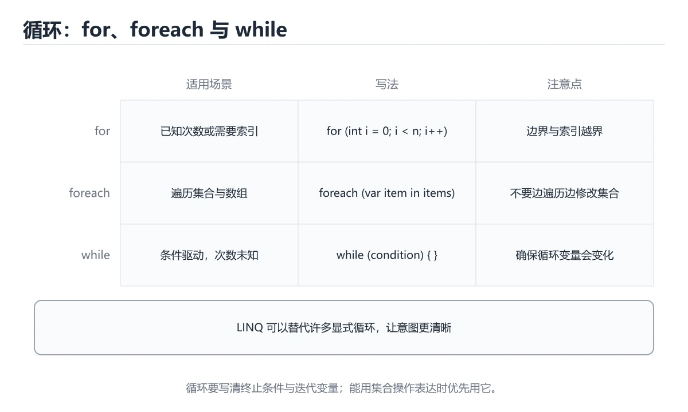

# C# 循环入门

> 内容更新时间：2026-10-06




## 学习目标

- 先认识C# 循环入门需要的工具、输入和输出。
- 按步骤运行最小示例，并记录结果与错误。
- 用一个边界输入验证自己是否真正掌握。

## 前置知识

- 会进行基本的文件或命令行操作。
- 不需要预先掌握「C#」的高级知识。

## 一句话入门

用 for、foreach 和 while 遍历数据。

## 最小示例

```csharp
int total = 0;
for (int i = 1; i <= 5; i++)
{
    total += i;
}
Console.WriteLine($"total={total}");
```

## 预期输出

```text
total=15
```

## 常见错误

- 输入转换失败没有处理，运行时抛出 FormatException。
- 复制命令时遗漏空格、引号或必要参数。

## 动手练习

1. 原样运行最小示例，保存命令和输出。
2. 把数字 2 改成 10，预测并验证新结果。
3. 制造一个错误输入，写出错误信息和修复方法。

## 本课小结

- 入门阶段先保证能运行、能观察、能解释，再追求复杂功能。
- 每次只改一个变量，记录预测与实际结果。
- 遇到错误先看第一条错误信息，再回到最小示例。

## for、foreach、while 与 do-while

C# 的 `for` 适合已知次数或需要下标的循环，`foreach` 适合遍历实现 `IEnumerable` 的集合，`while` 先判断条件，`do-while` 至少执行一次。`foreach` 内部使用枚举器，集合在遍历期间被修改通常会抛出 `InvalidOperationException`；需要同时删除元素时，应倒序使用 `for`、先收集待删除项再处理，或使用支持并发修改的专用集合。

循环变量的作用域和闭包捕获也要注意。在循环中创建 lambda 时，C# 5 之后 `foreach` 的迭代变量每轮是独立变量，但 `for` 的循环变量仍然是同一个变量；如果异步任务或委托延迟执行，捕获的值可能全部是最后一次迭代的值。需要在循环内复制到局部变量，或把逻辑提取成方法。

`break` 退出循环，`continue` 进入下一轮，`return` 直接离开方法。深层嵌套循环可以用 `goto` 跳出，但更好的做法是把搜索逻辑提取成返回结果的方法。LINQ 可以把筛选、映射和聚合写成声明式链式调用，适合表达“做什么”；性能敏感或需要复杂控制流时，普通循环通常更直观、分配更少。

## 集合修改、性能与提前退出

循环体里频繁分配对象、拼接字符串或查询集合会放大性能问题。字符串拼接应使用 `StringBuilder`，集合容量可预估时使用带初始容量的构造函数，避免多次扩容。`Count()` 对某些集合可能遍历全部元素，而 `Count` 属性是 O(1)；在循环条件里调用高成本查询会重复计算，应提前保存结果。

异常不应作为正常循环退出手段。能在循环内判断的条件就直接判断，只有真正的异常情况才抛出或捕获。异步循环使用 `await foreach` 时，要注意取消令牌、异常传播和背压；没有取消支持的长时间循环会让请求无法及时结束。

验证循环时覆盖零次、一次、边界次数、集合为空、集合在遍历中被修改和提前退出。对于性能相关代码，先测量再优化，用基准测试区分分配、CPU 和 I/O 瓶颈。循环的正确性、可读性和资源消耗要一起看，不能只追求少写几行。

## 代码实验：把示例跑成证据

### 实验一：建立基线

```csharp
int total = 0;
for (int i = 1; i <= 5; i++)
{
    total += i;
}
Console.WriteLine($"total={total}");
```

### 实验二：只改一个输入

沿用「C# 循环入门」的最小示例做一次单变量实验：

| 实验 | 改动 | 预测 | 实际 | 结论 |
| --- | --- | --- | --- | --- |
| 基线 | 保持「C# 循环入门」示例原样 |  |  |  |
| 边界 | 把C# 循环入门换成空值或极值 |  |  |  |
| 失败 | 给C#传入非法输入 |  |  |  |

做完后用一句话写出「C# 循环入门」的结论：输入怎么变，结果才怎么变。

### 实验三：制造一个可控错误

把变量声明成不兼容的类型，或者删除一个必要的分号。记录编译器给出的类型错误与位置，修复后确认输出没有变化。

| 实验 | 改动 | 预测 | 实际 | 结论 |
| --- | --- | --- | --- | --- |
| 基线 | 保持原样 |  |  |  |
| 边界 |  |  |  |  |
| 失败 |  |  |  |  |

### 实验四：用三句话复述

1. 输入是什么，哪些输入属于合法范围，哪些属于边界或非法范围？
2. 程序按什么顺序处理输入，在哪一步产生了状态变化或副作用？
3. 输出如何验证，失败时第一条可观察证据是什么？

## 实践任务

本节围绕C# 循环入门安排 3 个可交付任务，每个任务都要求留下可以复查的记录。

### 任务 1：用自己的话画出结构

不看书，用一张图说清「C# 循环入门」的结构，画完再对照骨架：

- 主干：一句话入门 → 最小示例 → 预期输出 → 常见错误
- 连接线：在每条边上标出输入、输出与失败路径。
- 自检：能否用一句话说明C# 循环入门与C#的关系？

### 任务 2：做一次对比实验

**验收标准**：表格里两个方案的结论不能完全一样；写下“在什么条件下应该换方案”。

### 任务 3：迁移到自己的场景

**验收标准**：至少有一个可复现的命令、代码片段或数据样例；结论能被别人独立检查。

## 故障现场

### 现场 1：本课的 C# 循环入门 常规用例通过，但边界用例失败

把这条结论放回「C# 循环入门」的完整流程里展开：

- 正文依据：复现：准备一组最小输入，只保留触发“本课的 C# 结果在两次运行之间不一致”的必要条件，连续运行两次确认结果稳定。
- 落地检查：把「现场 1：本课的 C# 循环入门 常规用例通过，但边界用例失败」改写成一条可执行的核对项，逐条验证输入、超时与失败路径。

### 现场 2：本课的 C# 结果在两次运行之间不一致

**症状**：在本课的练习或生产场景里出现“本课的 C# 结果在两次运行之间不一致”。

**复现**：准备一组最小输入，只保留触发“本课的 C# 结果在两次运行之间不一致”的必要条件，连续运行两次确认结果稳定。

**定位**：围绕“C# 依赖了当前版本、执行顺序或共享状态，单次运行无法暴露差异”检查调用链、输入数据和环境配置，先验证假设再改代码。

**预防**：把“本课的 C# 结果在两次运行之间不一致”写成一条自动化用例，并在本课的验收清单里保留对应检查项。

### 现场 3：本课的验证只在开发机通过

**症状**：在本课的练习或生产场景里出现“本课的验证只在开发机通过”。

## 版本与时效

- .NET 10 是当前 LTS 主线，C# 版本随 SDK 一起演进
- 主构造函数、集合表达式、模式匹配与 AOT/裁剪是升级重点
- 升级前检查 NuGet 依赖、序列化行为与运行时标识
- 官方说明：https://learn.microsoft.com/dotnet/core/whats-new/

### 升级检查清单

- 先固定当前版本，跑通全部示例与测验，再升级工具链。
- 只改一个版本变量，记录编译、测试、性能与产物体积的变化。
- 重点回归默认值、弃用警告、序列化格式、并发语义和错误信息。
- 升级完成后更新本课的“最后复核 / 下次复核”日期与版本说明。

## 本课复习清单

离开本课前，逐项确认：

- [ ] 不看解析，能说出「C# 的 foreach 循环适合什么场景？」的判断依据。
- [ ] 不看解析，能说出「在循环中使用 break 与 continue 的区别是？」的判断依据。
- [ ] 不看解析，能说出「需要一段「至少执行一次、之后再判断条件」的逻辑，应使用？」的判断依据。
- [ ] 不看解析，能说出「阅读下面的 C# 代码，输出是什么？」的判断依据。
- [ ] 至少运行一次本课示例，记录输入、输出和一个边界情况。
- [ ] 把本课最容易混淆的两个概念写成一句话对照。

| 复盘项 | 记录 |
| --- | --- |
| 已经能独立解释的考点 |  |
| 仍然说不清的概念 |  |
| 下一步验证动作 |  |

## 逐节复习与自检

下面按正文顺序回顾每一节，并给出一个自检问题；说不清的地方回到原章节补课。

### 一句话入门

自检：这一节的关键输入与输出分别是什么？

### 最小示例

```csharp
int total = 0;
for (int i = 1; i <= 5; i++)
{
    total += i;
}
Console.WriteLine($"total={total}");
```

自检：这一节与相邻主题的边界在哪里？

### 预期输出

```text
total=15
```

### 常见错误

自检：把这一节讲给没学过的人，最需要强调哪一点？

### 动手练习

自检：如果去掉这一节里的一个前提，结论会怎样变化？

### for、foreach、while 与 do-while

把这条结论放回「C# 循环入门」的完整流程里展开：

- 正文依据：定位：围绕“C# 依赖了当前版本、执行顺序或共享状态，单次运行无法暴露差异”检查调用链、输入数据和环境配置，先验证假设再改代码。
- 落地检查：把「for、foreach、while 与 do-while」改写成一条可执行的核对项，逐条验证输入、超时与失败路径。

### 集合修改、性能与提前退出

循环体里频繁分配对象、拼接字符串或查询集合会放大性能问题。字符串拼接应使用 `StringBuilder`，集合容量可预估时使用带初始容量的构造函数，避免多次扩容。

自检：用自己的话复述这一节，并举一个反例。

## 术语速查

把「C# 循环入门」里反复出现的术语集中放在一起。复习时先遮住右列，尝试用自己的话解释，再回到正文核对。

| 术语 | 本课语境 |
| --- | --- |
| `C#` | 定位：围绕“C# 依赖了当前版本、执行顺序或共享状态，单次运行无法暴露差异”检查调用链、输入数据和环境配置，先验证假设再改代码。 |
| `入门练习` | 按“C# 循环入门”中 C# 循环入门、C#、入门练习 的实践顺序，把四个步骤排成从准备到复盘的合理顺序。 |

## 考点精讲

### 考点 1：多选辨析·C# 循环入门

- **题目**：围绕“C# 循环入门”中的 C# 循环入门、C#、入门练习，下列哪两项是本课强调的实践判断？
- **判断依据**：在「C# 循环入门」里，题干的正确项是验证 C# 时要固定版本并覆盖边界输入，结论才可复现。学习 C# 循环入门 时要同时说明输入、输出和失败路径，不能只看正常流程。把“验证 C# 时要固定版本并覆盖边界输入”代回「C# 循环入门」里“围绕C 循环入门中的 C 循环入门、C、入门练习”的例子核对，条件一旦改变，结论就要用C# 循环入门、C#、入门练习重新推导。

### 考点 2：顺序排列·C# 循环入门

- **题目**：按“C# 循环入门”中 C# 循环入门、C#、入门练习 的实践顺序，把四个步骤排成从准备到复盘的合理顺序。
- **判断依据**：题干的正确项是先明确 C# 循环入门 的输入、输出与约束。这个顺序把 C# 循环入门 的输入、输出和约束放在最前面，在C# 循环入门里避免概念没对齐就开始调参。第二步用 C# 建立可核对的基线，在C# 循环入门里第三步才允许改变一个变量并观察失败路径。这道题的关键在C# 循环入门、C#、入门练习：先确认题干“循环入门中”问的是哪一步，再排除偷换前提的选项。

### 考点 3：概念判断·至少执行一次、之后再判断条件

- **题目**：需要一段「至少执行一次、之后再判断条件」的逻辑，应使用？
- **判断依据**：在「C# 循环入门」里，do-while 循环，条件写在循环体之后。do-while 先执行循环体再判断条件，因此循环体至少运行一次，适合「先尝试、再决定是否重试」的流程。这道题的关键在「C# 循环入门」的C# 循环入门、C#、入门练习：先确认题干“需要一段至少执行一次、之后再判断条件”问的是哪一步，再排除偷换前提的选项。

### 考点 4：代码补全·C# 循环入门

- **题目**：阅读下面的 C# 代码，输出是什么？
- **判断依据**：循环变量从 0 开始，只要小于 3 就继续，因此依次执行 i=0、1、2，循环结束时 i 变成 3 但不再进入循环体。Console.Write 不换行，所以三个数字连续输出为 012。这道题要求区分概念与边界，「012」只有在题干给出的前提下才成立，而「123」、「0 1 2 分三行」缺少同一组条件。这道题的关键在「C# 循环入门」的C# 循环入门、C#、入门练习：先确认题干“阅读下面的 C 代码”问的是哪一步，再排除偷换前提的选项。

### 考点 5：填空·C# 循环入门

- **题目**：补全代码：要求循环体至少执行一次再判断条件，应写成 ____ { ... } while (cond); 结构。
- **判断依据**：do-while 会先执行一次循环体，之后再判断条件是否继续，因此循环体至少执行一次。C# 循环入门 的正文对比了 for、foreach、while 与 do-while：while 在入口先判断条件，条件一开始就不成立时一次也不执行；do-while 适合先执行再验证的场景，例如反复读取输入直到满足要求。

## English Overview

**Title:** C# Loops

**Summary:** Iterate with for, foreach and while.

**Category:** C#
**Level:** 入门
**Key terms:** C# 循环入门, C#, 入门练习

## 内容元数据

- 内容版本：v2.0
- 最后更新：2026-10-06
- 学习阶段：入门
- 适用环境：.NET 9 / C# 13
- 内容来源：内置结构化课程与工程实践整理
- 相关主题：C# 循环入门、C#、入门练习
- 质量版本：P0 测验标准 + P1 覆盖扩展 + P2 体验补全

## 参考资料与复核

- 最后复核：2026-10-04
- 下次复核：2027-04-04
- 复核范围：版本兼容、API 行为、安全建议与工程实践
- 来源性质：官方文档、标准或权威教材；正文为离线教学重组

| 参考资料 | 本课用途 |
| --- | --- |
| [C# 指南](https://learn.microsoft.com/dotnet/csharp/) | 语言语法与类型系统 |
| [.NET 测试文档](https://learn.microsoft.com/dotnet/core/testing/) | 单元测试与集成测试 |
| [dotnet CLI](https://learn.microsoft.com/dotnet/core/tools/) | 构建、运行与发布命令 |

> 「C# 循环入门」的链接用于离线阅读后的延伸核对；App 不会自动联网。

## 复习与迁移

复习目标：把「C# 循环入门」的判断标准放回可复现的例子里。先自己作答，再对照依据；如果结论正确但理由不完整，回到正文补足前提。

### 概念复述

- 用一句话说明「C# 循环入门」解决什么问题：用 for、foreach 和 while 遍历数据。
- 写出C# 循环入门、C#、入门练习之间的关系，并各举一个例子。
- 说出本课最容易混淆的两个概念，以及区分它们的判据。

### 正文逐节复核

- **for、foreach、while 与 do-while**：C# 的 `for` 适合已知次数或需要下标的循环，`foreach` 适合遍历实现 `IEnumerable` 的集合，`while` 先判断条件，`do-while` 至少执行一次。
- **实践任务**：本节围绕C# 循环入门安排 3 个可交付任务，每个任务都要求留下可以复查的记录。

### 测验回顾

1. 围绕“C# 循环入门”中的 C# 循环入门、C#、入门练习，下列哪两项是本课强调的实践判断？
   - 依据：在「C# 循环入门」里，题干的正确项是验证 C# 时要固定版本并覆盖边界输入，结论才可复现。学习 C# 循环入门 时要同时说明输入、输出和失败路径，不能只看正常流程。把“验证 C# 时要固定版本并覆盖边界输入”代回「C# 循环入门」里“围绕C 循环入门中的 C 循环入门、C、入门练习”的例子核对，条件一旦改变，结论就要用C# 循环入门、C#、入门练习重新推导。
2. 按“C# 循环入门”中 C# 循环入门、C#、入门练习 的实践顺序，把四个步骤排成从准备到复盘的合理顺序。
   - 依据：题干的正确项是先明确 C# 循环入门 的输入、输出与约束。这个顺序把 C# 循环入门 的输入、输出和约束放在最前面，在C# 循环入门里避免概念没对齐就开始调参。第二步用 C# 建立可核对的基线，在C# 循环入门里第三步才允许改变一个变量并观察失败路径。这道题的关键在C# 循环入门、C#、入门练习：先确认题干“循环入门中”问的是哪一步，再排除偷换前提的选项。
3. 需要一段「至少执行一次、之后再判断条件」的逻辑，应使用？
   - 依据：在「C# 循环入门」里，do-while 循环，条件写在循环体之后。do-while 先执行循环体再判断条件，因此循环体至少运行一次，适合「先尝试、再决定是否重试」的流程。这道题的关键在「C# 循环入门」的C# 循环入门、C#、入门练习：先确认题干“需要一段至少执行一次、之后再判断条件”问的是哪一步，再排除偷换前提的选项。
4. 阅读下面的 C# 代码，输出是什么？
   - 依据：循环变量从 0 开始，只要小于 3 就继续，因此依次执行 i=0、1、2，循环结束时 i 变成 3 但不再进入循环体。Console.Write 不换行，所以三个数字连续输出为 012。这道题要求区分概念与边界，「012」只有在题干给出的前提下才成立，而「123」、「0 1 2 分三行」缺少同一组条件。这道题的关键在「C# 循环入门」的C# 循环入门、C#、入门练习：先确认题干“阅读下面的 C 代码”问的是哪一步，再排除偷换前提的选项。

### 迁移练习

把「C# 循环入门」的结论迁移到相邻主题，每次迁移都写清预测与证据：

1. 换输入：用C# 循环入门处理一组你自己的数据，对比教材示例的结果差异。
2. 换失败条件：制造一个C#相关的错误，说明如何从错误信息定位根因。
3. 换规模：把数据量或并发度提高一个数量级，说明「C# 循环入门」的结论是否仍成立。

## 工程化精练：决策、失败与验证

这一章把「C# 循环入门」从“看懂”推进到“能判断、能验证、能排错”。所有判断都围绕C# 循环入门、C#与入门练习展开，并与前文的示例、测验和失败现场互相对照。

### 一、C# 循环入门 的判断算法

| 步骤 | 要回答的问题 | 判断依据 | 记录什么 |
| --- | --- | --- | --- |
| 1. 定目标 | 「C# 循环入门」这一步要解决什么问题？ | 把C# 循环入门的目标写成一句可验证的结论 | 输入、约束、成功标准 |
| 2. 找边界 | C#在什么条件下失效？ | 先列空值、极值、重复和失败路径 | 反例与触发条件 |
| 3. 跑基线 | 原始示例的真实输出是什么？ | 命令、版本和环境必须可复现 | 命令、输出、耗时 |
| 4. 只改一处 | 把入门练习换成另一种取值会怎样？ | 预测写在运行之前 | 预测与实际的差异 |
| 5. 回写结论 | 结论能否被他人复现？ | 把判断写成清单或测试 | 结论、证据、遗留问题 |

这张表的用法不是从上到下浏览，而是每次只填一行：先用「C# 循环入门」前文的示例验证第 3 行，再故意破坏一个条件验证第 2 行。当你能在不看解析的情况下说出C# 循环入门的判断依据，才算真正掌握本课。

- 先从C# 循环入门入手：把它写成“输入是什么、输出是什么、哪一步最容易出错”。如果这三句话中有一句说不清，说明对「C# 循环入门」的理解还停留在术语层面，需要回到正文的最小示例重新观察一次。

- 再把C#当成对照实验的变量：固定其他条件，只改变它的取值，记录输出是否变化。结论“变”或“不变”都要写出理由，并说明这个理由能否被他人独立复现。

- 针对入门练习做一次失败演练：故意给出空值、极值或错误类型，观察「C# 循环入门」的报错位置和处理方式。错误信息只是入口，真正要定位的是哪一层假设被破坏。

- 把「C# 循环入门」的结论压缩成一条可执行清单：先检查输入，再检查版本与环境，然后跑最小用例，最后才扩大规模。顺序颠倒会让排错范围成倍增加。

- 如果结论依赖时间或规模，就把数据量提高一个数量级再跑一次。在「C# 循环入门」里，小样本成立不代表大样本成立，复杂度、资源占用和失败率都要重新记录。

- 如果结论依赖并发或共享状态，就固定输入并连续运行多次。结果不一致时，优先怀疑「C# 循环入门」中C# 循环入门相关步骤的隐藏状态，而不是先改代码。

- 把「C# 循环入门」的判断写成测试：一个正常用例、一个边界用例、一个失败用例。测试通过只是起点，还要确认失败用例确实以预期方式失败。

- 把本课与相邻主题连起来：C# 循环入门解决的是“怎么做”，C#回答“什么时候不适用”。两者都答得出来，迁移才算完成。

> 第 2 轮复核「C# 循环入门」：把上面的结论逐条改写为可验证的问题，并记录仍不确定的部分。

- 先从C# 循环入门入手：把它写成“输入是什么、输出是什么、哪一步最容易出错”。如果这三句话中有一句说不清，说明对「C# 循环入门」的理解还停留在术语层面，需要回到正文的最小示例重新观察一次。

- 再把C#当成对照实验的变量：固定其他条件，只改变它的取值，记录输出是否变化。结论“变”或“不变”都要写出理由，并说明这个理由能否被他人独立复现。

- 针对入门练习做一次失败演练：故意给出空值、极值或错误类型，观察「C# 循环入门」的报错位置和处理方式。错误信息只是入口，真正要定位的是哪一层假设被破坏。

- 把「C# 循环入门」的结论压缩成一条可执行清单：先检查输入，再检查版本与环境，然后跑最小用例，最后才扩大规模。顺序颠倒会让排错范围成倍增加。

- 如果结论依赖时间或规模，就把数据量提高一个数量级再跑一次。在「C# 循环入门」里，小样本成立不代表大样本成立，复杂度、资源占用和失败率都要重新记录。

- 如果结论依赖并发或共享状态，就固定输入并连续运行多次。结果不一致时，优先怀疑「C# 循环入门」中C# 循环入门相关步骤的隐藏状态，而不是先改代码。

- 把「C# 循环入门」的判断写成测试：一个正常用例、一个边界用例、一个失败用例。测试通过只是起点，还要确认失败用例确实以预期方式失败。

- 把本课与相邻主题连起来：C# 循环入门解决的是“怎么做”，C#回答“什么时候不适用”。两者都答得出来，迁移才算完成。

> 第 3 轮复核「C# 循环入门」：把上面的结论逐条改写为可验证的问题，并记录仍不确定的部分。

- 先从C# 循环入门入手：把它写成“输入是什么、输出是什么、哪一步最容易出错”。如果这三句话中有一句说不清，说明对「C# 循环入门」的理解还停留在术语层面，需要回到正文的最小示例重新观察一次。

- 再把C#当成对照实验的变量：固定其他条件，只改变它的取值，记录输出是否变化。结论“变”或“不变”都要写出理由，并说明这个理由能否被他人独立复现。

- 针对入门练习做一次失败演练：故意给出空值、极值或错误类型，观察「C# 循环入门」的报错位置和处理方式。错误信息只是入口，真正要定位的是哪一层假设被破坏。

- 把「C# 循环入门」的结论压缩成一条可执行清单：先检查输入，再检查版本与环境，然后跑最小用例，最后才扩大规模。顺序颠倒会让排错范围成倍增加。

- 如果结论依赖时间或规模，就把数据量提高一个数量级再跑一次。在「C# 循环入门」里，小样本成立不代表大样本成立，复杂度、资源占用和失败率都要重新记录。

- 如果结论依赖并发或共享状态，就固定输入并连续运行多次。结果不一致时，优先怀疑「C# 循环入门」中C# 循环入门相关步骤的隐藏状态，而不是先改代码。

- 把「C# 循环入门」的判断写成测试：一个正常用例、一个边界用例、一个失败用例。测试通过只是起点，还要确认失败用例确实以预期方式失败。

- 把本课与相邻主题连起来：C# 循环入门解决的是“怎么做”，C#回答“什么时候不适用”。两者都答得出来，迁移才算完成。

> 第 4 轮复核「C# 循环入门」：把上面的结论逐条改写为可验证的问题，并记录仍不确定的部分。

- 先从C# 循环入门入手：把它写成“输入是什么、输出是什么、哪一步最容易出错”。如果这三句话中有一句说不清，说明对「C# 循环入门」的理解还停留在术语层面，需要回到正文的最小示例重新观察一次。

- 再把C#当成对照实验的变量：固定其他条件，只改变它的取值，记录输出是否变化。结论“变”或“不变”都要写出理由，并说明这个理由能否被他人独立复现。

- 针对入门练习做一次失败演练：故意给出空值、极值或错误类型，观察「C# 循环入门」的报错位置和处理方式。错误信息只是入口，真正要定位的是哪一层假设被破坏。

- 把「C# 循环入门」的结论压缩成一条可执行清单：先检查输入，再检查版本与环境，然后跑最小用例，最后才扩大规模。顺序颠倒会让排错范围成倍增加。

- 如果结论依赖时间或规模，就把数据量提高一个数量级再跑一次。在「C# 循环入门」里，小样本成立不代表大样本成立，复杂度、资源占用和失败率都要重新记录。

- 如果结论依赖并发或共享状态，就固定输入并连续运行多次。结果不一致时，优先怀疑「C# 循环入门」中C# 循环入门相关步骤的隐藏状态，而不是先改代码。

- 把「C# 循环入门」的判断写成测试：一个正常用例、一个边界用例、一个失败用例。测试通过只是起点，还要确认失败用例确实以预期方式失败。

- 把本课与相邻主题连起来：C# 循环入门解决的是“怎么做”，C#回答“什么时候不适用”。两者都答得出来，迁移才算完成。

> 第 5 轮复核「C# 循环入门」：把上面的结论逐条改写为可验证的问题，并记录仍不确定的部分。

- 先从C# 循环入门入手：把它写成“输入是什么、输出是什么、哪一步最容易出错”。如果这三句话中有一句说不清，说明对「C# 循环入门」的理解还停留在术语层面，需要回到正文的最小示例重新观察一次。

- 再把C#当成对照实验的变量：固定其他条件，只改变它的取值，记录输出是否变化。结论“变”或“不变”都要写出理由，并说明这个理由能否被他人独立复现。

- 针对入门练习做一次失败演练：故意给出空值、极值或错误类型，观察「C# 循环入门」的报错位置和处理方式。错误信息只是入口，真正要定位的是哪一层假设被破坏。

- 把「C# 循环入门」的结论压缩成一条可执行清单：先检查输入，再检查版本与环境，然后跑最小用例，最后才扩大规模。顺序颠倒会让排错范围成倍增加。

- 如果结论依赖时间或规模，就把数据量提高一个数量级再跑一次。在「C# 循环入门」里，小样本成立不代表大样本成立，复杂度、资源占用和失败率都要重新记录。

- 如果结论依赖并发或共享状态，就固定输入并连续运行多次。结果不一致时，优先怀疑「C# 循环入门」中C# 循环入门相关步骤的隐藏状态，而不是先改代码。

- 把「C# 循环入门」的判断写成测试：一个正常用例、一个边界用例、一个失败用例。测试通过只是起点，还要确认失败用例确实以预期方式失败。

- 把本课与相邻主题连起来：C# 循环入门解决的是“怎么做”，C#回答“什么时候不适用”。两者都答得出来，迁移才算完成。

> 第 6 轮复核「C# 循环入门」：把上面的结论逐条改写为可验证的问题，并记录仍不确定的部分。

- 先从C# 循环入门入手：把它写成“输入是什么、输出是什么、哪一步最容易出错”。如果这三句话中有一句说不清，说明对「C# 循环入门」的理解还停留在术语层面，需要回到正文的最小示例重新观察一次。

- 再把C#当成对照实验的变量：固定其他条件，只改变它的取值，记录输出是否变化。结论“变”或“不变”都要写出理由，并说明这个理由能否被他人独立复现。

- 针对入门练习做一次失败演练：故意给出空值、极值或错误类型，观察「C# 循环入门」的报错位置和处理方式。错误信息只是入口，真正要定位的是哪一层假设被破坏。

- 把「C# 循环入门」的结论压缩成一条可执行清单：先检查输入，再检查版本与环境，然后跑最小用例，最后才扩大规模。顺序颠倒会让排错范围成倍增加。

- 如果结论依赖时间或规模，就把数据量提高一个数量级再跑一次。在「C# 循环入门」里，小样本成立不代表大样本成立，复杂度、资源占用和失败率都要重新记录。

- 如果结论依赖并发或共享状态，就固定输入并连续运行多次。结果不一致时，优先怀疑「C# 循环入门」中C# 循环入门相关步骤的隐藏状态，而不是先改代码。

- 把「C# 循环入门」的判断写成测试：一个正常用例、一个边界用例、一个失败用例。测试通过只是起点，还要确认失败用例确实以预期方式失败。

- 把本课与相邻主题连起来：C# 循环入门解决的是“怎么做”，C#回答“什么时候不适用”。两者都答得出来，迁移才算完成。

> 第 7 轮复核「C# 循环入门」：把上面的结论逐条改写为可验证的问题，并记录仍不确定的部分。

### 二、C# 循环入门 的机制拆解与自测

把本课考点还原成可回答的问题，再逐题写出依据：

**问题 1**：围绕“C# 循环入门”中的 C# 循环入门、C#、入门练习，下列哪两项是本课强调的实践判断？

- 关联术语：C# 循环入门
- 判断依据：验证 C# 时要固定版本并覆盖边界输入，结论才可复现
- 追问：如果把C# 循环入门的条件换成边界值，这个结论是否仍然成立？

**问题 2**：按“C# 循环入门”中 C# 循环入门、C#、入门练习 的实践顺序，把四个步骤排成从准备到复盘的合理顺序。

- 关联术语：C#
- 判断依据：先明确 C# 循环入门 的输入、输出与约束
- 追问：如果把C#的条件换成边界值，这个结论是否仍然成立？

**问题 3**：需要一段「至少执行一次、之后再判断条件」的逻辑，应使用？

- 关联术语：入门练习
- 判断依据：do-while 循环，条件写在循环体之后
- 追问：如果把入门练习的条件换成边界值，这个结论是否仍然成立？

**问题 4**：阅读下面的 C# 代码，输出是什么？

- 关联术语：C# 循环入门
- 判断依据：回到「C# 循环入门」正文对应小节，先用最小示例验证再下结论。
- 追问：如果把C# 循环入门的条件换成边界值，这个结论是否仍然成立？

### 三、失败模式与修复顺序

| 失败信号 | 常见根因 | 先做什么 | 修复后如何确认 |
| --- | --- | --- | --- |
| 「C# 循环入门」中 C# 循环入门 相关步骤报错 | 输入、版本或前置条件与示例不一致 | 保留第一条错误信息，回到最小输入 | 用验证 C# 时要固定版本并覆盖边界输入，结论才可复现复跑，确认输出可复现 |
| 「C# 循环入门」中 C# 相关步骤报错 | 输入、版本或前置条件与示例不一致 | 保留第一条错误信息，回到最小输入 | 用先明确 C# 循环入门 的输入、输出与约束复跑，确认输出可复现 |
| 「C# 循环入门」中 入门练习 相关步骤报错 | 输入、版本或前置条件与示例不一致 | 保留第一条错误信息，回到最小输入 | 用do-while 循环，条件写在循环体之后复跑，确认输出可复现 |
| 结果在两次运行之间不一致 | 隐藏状态、并发或环境差异 | 固定版本与输入，记录随机因素 | 连续运行三次得到同一结论 |
| 单次结果正确但规模一大就失效 | 只测了正常路径，没有覆盖边界 | 把数据量或并发度提高一个数量级 | 记录边界值、耗时与失败率 |

排错顺序固定为：先复现，再缩小输入，然后只改一个条件，最后把结论写成回归用例。对「C# 循环入门」来说，任何不能复现的“修好了”都不算完成。

### 四、离开本课前的验证清单

| 检查项 | 通过标准 | 证据 |
| --- | --- | --- |
| 能复述 | 用三句话说明「C# 循环入门」解决什么问题、边界在哪 | 不看解析写出的结论 |
| 能运行 | 最小示例在本机跑通 | 命令、输出与版本 |
| 能改条件 | 只改一个输入并解释差异 | 预测与实际的对照 |
| 能排错 | 至少制造并修复一个失败 | 错误信息与修复步骤 |
| 能迁移 | 把C# 循环入门、C#、入门练习用到新场景 | 一个自选练习的结论 |

完成标准：能不看解析说清「C# 循环入门」全部自测题的依据，并且至少有一条C# 循环入门相关的结论经过真实运行验证。如果某一步只停留在“感觉懂了”，就把它写成下一轮针对「C# 循环入门」的最小验证任务。

### 五、把结论写成可检查的证据

学习「C# 循环入门」时，最容易出现的情况是“听过、看懂了，但换一个输入就说不清”。下面把C# 循环入门与C#放进一条可检查的证据链：每一句结论都要能回答“从哪里来、在什么条件下成立、失败时怎么发现”。

| 证据类型 | 本课要求 | 不合格的表现 |
| --- | --- | --- |
| 概念证据 | 用一句话说明C# 循环入门的定义与适用场景 | 只背术语，说不出它解决什么问题 |
| 运行证据 | 能复现「C# 循环入门」的最小示例 | 输出与记录对不上，或换机器就不一致 |
| 对照证据 | 只改一个条件，说明差异来自哪里 | 一次改多个变量，无法归因 |
| 失败证据 | 故意制造错误并记录恢复步骤 | 只测正常路径，失败时靠猜 |
| 迁移证据 | 把C#用到自选场景 | 换一个例子就完全套不上 |

举例：验证 C# 时要固定版本并覆盖边界输入，结论才可复现。把这个结论代回「C# 循环入门」的正文，找出它对应的输入、处理步骤与输出；再换掉其中一个条件，观察结论是否仍然成立。能完成这一步，才说明这条知识已经从“记忆”变成“可用的判断”。

最后留一个自检问题：如果只能保留三条笔记，你会写下哪三句？把答案限定为「C# 循环入门」中的可验证结论，并给每条结论配一个反例。这三句加上对应反例，就是本课最值得带入后续课程的复习材料。
