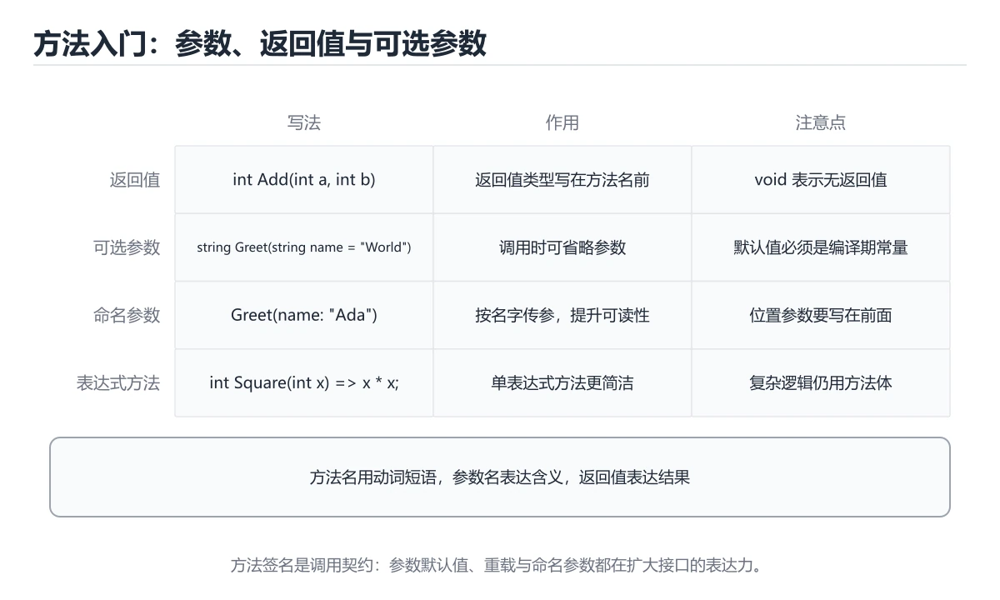
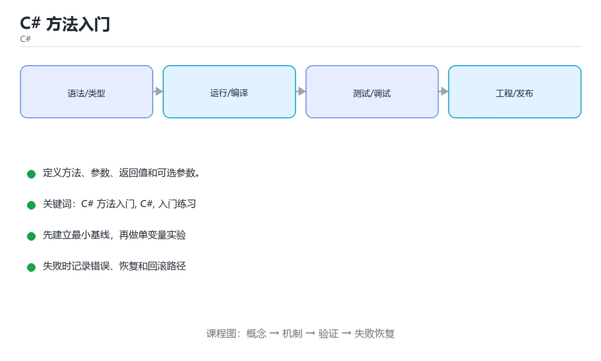

# C# 方法入门

> 内容更新时间：2026-10-06 · 学习阶段：基础 · 预计用时：35 分钟





## 本节知识框架

**课程定位**：所属分类 `csharp`（C#），课程主题 `C# 方法入门`，学习阶段 基础，建议用时 55 分钟。

本课主线：定义方法、参数、返回值和可选参数。

**学完本课应当能够**
- 说清 `方法签名` 与 `参数与返回值` 的含义与区别，并各举一个正例和一个反例。
- 用本课示例验证 `void` 的行为，记录输入、输出与失败条件。
- 遇到「可选参数与重载混用」这类问题时，能说出触发条件与修复顺序。

### 从概念到验证的学习链条

1. `方法签名`：先掌握 方法名加参数列表构成签名，是重载区分的依据，再用它解释 `参数与返回值` 为什么会出现。
2. `参数与返回值`：先掌握 参数是输入，return 交回结果，类型必须匹配，再用它解释 `void` 为什么会出现。
3. `void`：先掌握 表示方法不返回值，再用它解释 `方法重载` 为什么会出现。
4. `方法重载`：先掌握 同一个类里同名方法通过参数列表不同来区分，再用它解释 `可选参数与命名参数` 为什么会出现。
5. `可选参数与命名参数`：先掌握 带默认值的参数可以省略，也可以按名字指定实参，再用它解释 `程序集` 为什么会出现。
6. `程序集`：先掌握 程序集是部署和版本控制的基本单位，包含类型、方法和资源，再用它解释 本课示例的观察结果 为什么会出现。

**先修与衔接**：本课是「C#」分类的第 5 课。先修内容：《C# 循环入门》。《C# 循环入门》里的 `for 循环`、`foreach` 是本课的前提。

### 完成判据

- **定义关**：不看正文也能说明 `方法签名` 是 方法名加参数列表构成签名，是重载区分的依据，并指出一个反例。
- **机制关**：能按“输入 → 转换 → 输出 → 验证”复述 `C# 方法入门`，而不是只背结论。
- **示例关**：能运行或推演 `C# 方法入门` 的 `csharp` 示例，并说明一个真实出现的标识符或字面量。
- **证据关**：能指出 `C# 方法入门` 示例里的 调用了 `Square()`，并说明它支持或反驳了本课的哪一条结论。
- **排错关**：能复现 可选参数与重载混用，记录现象并按 控制重载数量，避免可选参数与多重载叠加 修复。
- **迁移关**：能把 `C# 方法入门`、`C#`、`入门练习` 放进一个与 `C# 方法入门` 不同的项目场景，并保持输入与验证条件可追踪。
- **复盘关**：学完 `C# 方法入门` 后，用一句话写下仍然不确定的结论，并列出下一次验证需要的输入、环境和成功判据。

### 复习清单

- [ ] 能不看正文复述本课核心术语，并指出一个边界或反例。
- [ ] 能运行或推演本课示例，记录输入、输出与失败现象。
- [ ] 能完成一次自测，并把错题对照错误表定位原因。

## 核心概念定义

| 术语 | 操作性定义 | 常见边界与风险 |
| --- | --- | --- |
| 方法签名 | 方法名加参数列表构成签名，是重载区分的依据。 | 结果依赖数据分布、模型版本与算力预算，换数据集或换硬件都要重新评估。 |
| 参数与返回值 | 参数是输入，return 交回结果，类型必须匹配。 | 静态检查只在编译期成立，运行期输入仍需校验。 |
| void | 表示方法不返回值。 | 只在「表示方法不返回值」这一前提下成立，换输入或换环境要重新验证。 |
| 方法重载 | 同一个类里同名方法通过参数列表不同来区分。 | 结果依赖数据分布、模型版本与算力预算，换数据集或换硬件都要重新评估。 |
| 可选参数与命名参数 | 带默认值的参数可以省略，也可以按名字指定实参。 | 结果依赖数据分布、模型版本与算力预算，换数据集或换硬件都要重新评估。 |
| 程序集 | 程序集是部署和版本控制的基本单位，包含类型、方法和资源 | 不同版本与依赖组合的行为可能不同，升级或换环境前要按官方变更说明重新验证。 |

## 原理与运行机制

### 机制总览

**教材衔接：一句话入门**

定义方法、参数、返回值和可选参数。

**教材衔接：C# 与 .NET 基础机制速览**

### 编译、CLR 与程序集

C# 代码先编译成中间语言和元数据，运行时由 CLR 通过即时编译或提前编译转换为机器码。程序集是部署和版本控制的基本单位，包含类型、方法和资源。命名空间只负责组织名字，不决定物理文件位置。`dotnet new` 创建项目，`dotnet build` 编译，`dotnet run` 运行，`dotnet test` 执行测试，理解工具链能快速定位“编译失败”和“运行失败”。

### 类型、值与引用

C# 类型分为值类型和引用类型。结构体、枚举和大多数基元类型是值类型，赋值时复制内容；类、数组、委托和字符串是引用类型，赋值时复制引用。装箱把值类型转成对象，拆箱再转回来，频繁发生会增加分配和复制成本。`var` 只是让编译器推断类型，不会变成动态类型；`dynamic` 才把类型检查推迟到运行时。

### 方法、重载与参数

方法可以有重载、可选参数、命名参数、`params` 可变参数和扩展方法。重载根据参数列表选择，返回类型不参与。`ref`、`out`、`in` 控制参数的传递方式：`ref` 可读可写，`out` 必须在方法内赋值，`in` 只读引用。局部函数和 lambda 可以捕获外部变量，但要注意闭包生命周期和循环变量捕获。异步方法返回 `Task` 或 `Task<T>`，调用方通常使用 `await`。

### 集合、LINQ 与可空性

`List<T>`、`Dictionary<TKey,TValue>`、`HashSet<T>` 是最常用的泛型集合。LINQ 提供筛选、投影、分组、连接和聚合，延迟执行意味着查询只有在枚举时才真正运行；重复枚举可能重复计算或看到数据变化。可空引用类型在编译期提示可能的 null，公共方法仍要校验参数，边界层要把外部数据转换成有效对象。

### 资源管理与并发

实现 `IDisposable` 的对象应使用 `using` 或 `await using` 及时释放文件句柄、连接和锁。异常只用于异常情况，不要用异常处理正常分支。异步代码不要阻塞等待 `.Result` 或 `.Wait()`，否则可能造成线程池饥饿和死锁。并发集合、`lock`、`SemaphoreSlim` 和 `Channel` 各有适用场景，选择时要看清读写比例、公平性和取消需求。

**教材衔接：版本与时效**

- 先确认 SDK 版本，再决定 WriteLine 是否可以使用新语法或新 API。
- 升级重点在语法与裁剪行为；先为 C# 补一组回归用例。
- 升级前先用 WriteLine 建立基线：记录版本、命令和输出，升级后只比较这些可观察量。
- 官方说明：https://learn.microsoft.com/dotnet/core/whats-new/

### 升级检查清单

- 先固定当前版本，跑通全部示例与测验，再升级工具链。
- 升级时只动一个依赖版本，用 WriteLine 记录构建与运行结果。
- 先回归 C# 方法入门 与 C# 的默认行为和错误信息，再扩大测试范围。
- 升级完成后更新本课「最后复核 / 下次复核」日期，并记录 C# 方法入门 的版本变化。

### 机制拆解：每一步的输入、动作与输出

#### 1. `方法签名`
- 输入：`C# 方法入门`；本步把 方法名加参数列表构成签名，是重载区分的依据 当作判断规则。
- 动作：围绕 `方法签名` 保留中间状态，并记录它与 `参数与返回值` 的对应关系。
- 输出：`参数与返回值`，它可以被下一段代码、测试或记录继续使用。
- `方法签名` 的失败条件：结果依赖数据分布、模型版本与算力预算，换数据集或换硬件都要重新评估。

#### 2. `参数与返回值`
- 输入：`方法签名`；本步把 参数是输入，return 交回结果，类型必须匹配 当作判断规则。
- 动作：围绕 `参数与返回值` 保留中间状态，并记录它与 `void` 的对应关系。
- 输出：`void`，它可以被下一段代码、测试或记录继续使用。
- `参数与返回值` 的失败条件：静态检查只在编译期成立，运行期输入仍需校验。

#### 3. `void`
- 输入：`参数与返回值`；本步把 表示方法不返回值 当作判断规则。
- 动作：围绕 `void` 保留中间状态，并记录它与 `方法重载` 的对应关系。
- 输出：`方法重载`，它可以被下一段代码、测试或记录继续使用。
- `void` 的失败条件：只在「表示方法不返回值」这一前提下成立，换输入或换环境要重新验证。

#### 4. `方法重载`
- 输入：`void`；本步把 同一个类里同名方法通过参数列表不同来区分 当作判断规则。
- 动作：围绕 `方法重载` 保留中间状态，并记录它与 `可选参数与命名参数` 的对应关系。
- 输出：`可选参数与命名参数`，它可以被下一段代码、测试或记录继续使用。
- `方法重载` 的失败条件：结果依赖数据分布、模型版本与算力预算，换数据集或换硬件都要重新评估。

#### 5. `可选参数与命名参数`
- 输入：`方法重载`；本步把 带默认值的参数可以省略，也可以按名字指定实参 当作判断规则。
- 动作：围绕 `可选参数与命名参数` 保留中间状态，并记录它与 `程序集` 的对应关系。
- 输出：`程序集`，它可以被下一段代码、测试或记录继续使用。
- `可选参数与命名参数` 的失败条件：结果依赖数据分布、模型版本与算力预算，换数据集或换硬件都要重新评估。

#### 6. `程序集`
- 输入：`可选参数与命名参数`；本步把 程序集是部署和版本控制的基本单位，包含类型、方法和资源 当作判断规则。
- 动作：围绕 `程序集` 保留中间状态，并记录它与 `Square` 的对应关系。
- 输出：`Square`，它可以被下一段代码、测试或记录继续使用。
- `程序集` 的失败条件：不同版本与依赖组合的行为可能不同，升级或换环境前要按官方变更说明重新验证。

### 示例中的可观察事实

1. 调用了 `Square()`；它对应的课程主题是 `C# 方法入门`。
2. 调用了 `WriteLine()`；它对应的课程主题是 `C# 方法入门`。
3. 调用了 `square()`；它对应的课程主题是 `C# 方法入门`。
4. 出现字面量 `square(7)={Square(7)}`；它对应的课程主题是 `C# 方法入门`。

### 复现实验记录

- 环境：`C# 方法入门` 使用 `csharp` 示例，固定 `C# 方法入门`、`C#`、`入门练习` 作为第一组条件。
- 首轮输入：先确认 调用了 `Square()`，预测 `方法签名` 会怎样变化。
- 基线观察：记录命令、输入、输出和错误原文，不用截图代替可复制的文本。
- 单变量修改：只改变 `C# 方法入门`，观察 `程序集` 是否仍满足定义。
- 失败注入：复现 可选参数与重载混用，确认现象是 调用方解析到意料之外的方法。
- 记录结论：把“修改前、修改后、预期变化、实际变化”写成四列表，这样复盘 `C# 方法入门` 时才能区分概念错误与实现错误。

## 典型应用场景

**课程内置实验入口**：`sandbox:csharp`，用于动手验证《C# 方法入门》的机制；实验结论不替代概念定义与复杂度分析。

**教材衔接：代码实验：把示例跑成证据**

### 实验一：建立基线

```csharp
static int Square(int n) => n * n;

Console.WriteLine($"square(7)={Square(7)}");
```

### 实验二：只改一个输入

沿用「C# 方法入门」的最小示例做一次单变量实验：

做完后用一句话写出「C# 方法入门」的结论：输入怎么变，结果才怎么变。

### 实验三：制造一个可控错误

删掉 C# 相关的一处必要写法，观察错误在哪一层出现，再恢复代码确认基线仍然可运行。

### 实验四：用三句话复述

1. C# 方法入门 的输入是什么，哪些取值合法，哪些属于边界或非法范围？
2. WriteLine 的执行顺序里，哪一步会写数据或产生外部副作用？
3. 输出如何验证，失败时第一条可观察证据是什么？

- **可选参数与重载混用**：典型现象是调用方解析到意料之外的方法；正确做法是控制重载数量，避免可选参数与多重载叠加。
- **可能返回空值却不声明**：典型现象是调用方空引用异常；正确做法是用可空引用类型标注，并在签名与文档里写清。
- **顺手修改传入的引用对象**：典型现象是调用方状态被意外改变；正确做法是明确方法是否允许副作用，必要时传入不可变副本。

### 最小验证场景

- 准备：保留 `csharp` 示例的原始输入，先记录 `C# 方法入门` 的基线输出和完整运行命令。
- 观察：先核对 调用了 `Square()`，再改变一个与 `方法签名` 相关的条件。
- 判定：新结果与 `C# 方法入门` 的基线不同不等于错误；只有当差异破坏了 `方法签名` 的定义或错误表中的约束，才判定为失败。

### 选择与边界

- 使用 `方法签名` 时，先满足它的定义：方法名加参数列表构成签名，是重载区分的依据；结果依赖数据分布、模型版本与算力预算，换数据集或换硬件都要重新评估。
- 使用 `参数与返回值` 时，先满足它的定义：参数是输入，return 交回结果，类型必须匹配；静态检查只在编译期成立，运行期输入仍需校验。
- 使用 `void` 时，先满足它的定义：表示方法不返回值；只在「表示方法不返回值」这一前提下成立，换输入或换环境要重新验证。
- 使用 `方法重载` 时，先满足它的定义：同一个类里同名方法通过参数列表不同来区分；结果依赖数据分布、模型版本与算力预算，换数据集或换硬件都要重新评估。
- 使用 `可选参数与命名参数` 时，先满足它的定义：带默认值的参数可以省略，也可以按名字指定实参；结果依赖数据分布、模型版本与算力预算，换数据集或换硬件都要重新评估。

## 代码/协议/SQL 示例

### 最小可验证示例

**教材衔接：最小示例**

**教材衔接：预期输出**

```text
square(7)=49
```

**教材衔接：零基础通俗讲：C# 方法入门**

### 一句话说清它是什么

方法把逻辑封装在类里面，通过参数接收数据、通过返回值交出结果；C# 的方法名习惯用大驼峰命名。

### 用生活比喻理解

方法像公司里的标准工序：输入原料、按流程加工、交出成品。工序只维护一份，谁需要就调用一次，不必重复写。

### 完整可运行代码

```csharp
using System;

class Program
{
    static int Add(int a, int b)
    {
        return a + b;
    }

    static void PrintResult(int value)
    {
        Console.WriteLine($"结果是 {value}");
    }

    static void Main()
    {
        PrintResult(Add(3, 4));
        PrintResult(Add(10, 20));
    }
}
```

### 逐行拆开看

- `static int Add(int a, int b)` 定义静态方法，返回 int，接收两个 int 参数。
- `return a + b;` 计算并结束方法，把结果交给调用者。
- `static void PrintResult(int value)` 返回类型是 void，只负责输出。
- 方法必须写在类里面，Main 也是类的一个方法。
- 在 Main 中调用 `Add(3, 4)`，实参按顺序复制给形参。
- C# 的参数默认按值传递，用 ref 或 out 才能把修改带回调用方。

### 把程序跑一遍

- `Add(3, 4)` 进入方法体算出 7 并返回。
- 7 作为实参传给 PrintResult，输出「结果是 7」。
- 第二次调用 `Add(10, 20)` 得到 30，输出「结果是 30」。
- Main 执行完，进程正常退出。

### 新手最容易踩的坑

- 方法名用小写开头：C# 不强制，但大驼峰是官方命名规范，评审时会被指出。
- 非静态方法直接在 Main 里调用：需要先创建实例，否则编译报错。
- 有返回值的方法漏掉 return：编译器会直接报错，所有路径都必须有返回。
- 以为按值传递能改基本类型参数：需要改就用 ref 或 out。
- 只改返回类型做重载：重载必须参数列表不同，只改返回类型算重复定义。

### 动手练一练

- 增加一个 `static int Multiply(int a, int b)` 并调用打印。
- 写一个带 string 参数的方法，输出问候语。
- 把 Add 的返回类型改成 void，观察调用处的编译错误。

### 本课速查卡

把下面八行抄进自己的笔记，复习时只看这一页就能回忆整课：

| 复习项 | 本课要点 |
| --- | --- |
| 核心结论 | 方法把逻辑封装在类里面，通过参数接收数据、通过返回值交出结果；C# 的方法名习惯用大驼峰命名。 |
| 最少要写的代码 | `using System;` |
| 正确做法 | `Add(3, 4)` 进入方法体算出 7 并返回。 |
| 最常见的错误 | 方法名用小写开头：C# 不强制，但大驼峰是官方命名规范，评审时会被指出。 |
| 出错先查什么 | 先读第一条报错信息，再回到最小示例只改一个地方 |
| 怎么确认学会了 | 增加一个 `static int Multiply(int a, int b)` 并调用打印。 |
| 和别的知识点的关系 | 本课打下的语法与思维方式会被后面每一课反复用到 |
| 接下来做什么 | 合上教程，凭记忆把上面的最小代码重写一遍再运行 |

**运行方式**：运行 `C# 方法入门` 的示例时，用 `dotnet run` 运行；先确认 SDK 版本与项目文件一致。

### 示例精读：先找证据，再改一个条件

1. 调用了 `Square()`；它出现在 `C# 方法入门` 的示例中，阅读时先确认它前后各发生了什么。
2. 调用了 `WriteLine()`；它出现在 `C# 方法入门` 的示例中，阅读时先确认它前后各发生了什么。
3. 调用了 `square()`；它出现在 `C# 方法入门` 的示例中，阅读时先确认它前后各发生了什么。
4. 出现字面量 `square(7)={Square(7)}`；它出现在 `C# 方法入门` 的示例中，阅读时先确认它前后各发生了什么。
- 在 `C# 方法入门` 中与 `方法签名` 对照：示例必须能支持 方法名加参数列表构成签名，是重载区分的依据，否则说明这一段还缺少实现或验证步骤。
- 在 `C# 方法入门` 中与 `参数与返回值` 对照：示例必须能支持 参数是输入，return 交回结果，类型必须匹配，否则说明这一段还缺少实现或验证步骤。
- 在 `C# 方法入门` 中与 `void` 对照：示例必须能支持 表示方法不返回值，否则说明这一段还缺少实现或验证步骤。
- 在 `C# 方法入门` 中与 `方法重载` 对照：示例必须能支持 同一个类里同名方法通过参数列表不同来区分，否则说明这一段还缺少实现或验证步骤。

## 时间/空间复杂度或性能分析

**性能关注点（C# 方法入门）**：GC 与异步调度影响开销：记录吞吐、延迟与分配速率。

**本课特有开销（C# 方法入门 · C# 方法入门）**：小文件看元数据开销，大文件看吞吐，两者要分别测量。

**测量方法**：以 `C# 方法入门` 的 `C# 方法入门` 场景为对象，固定输入跑一遍记录基线，再把规模或并发度提高一个数量级复测；两次结果的差值与波动范围才是结论依据。

### 需要控制的变量与记录项

- `C# 方法入门` 的 `C# 方法入门`：固定它的版本、输入范围和资源上限，分别记录速度、内存与失败率的变化。
- `C# 方法入门` 的 `C#`：固定它的版本、输入范围和资源上限，分别记录速度、内存与失败率的变化。
- `C# 方法入门` 的 `入门练习`：固定它的版本、输入范围和资源上限，分别记录速度、内存与失败率的变化。
- `C# 方法入门` 中 `方法签名` 的边界：结果依赖数据分布、模型版本与算力预算，换数据集或换硬件都要重新评估。达到边界时不要外推，必须重新测量。
- `C# 方法入门` 中 `参数与返回值` 的边界：静态检查只在编译期成立，运行期输入仍需校验。达到边界时不要外推，必须重新测量。
- `C# 方法入门` 中 `void` 的边界：只在「表示方法不返回值」这一前提下成立，换输入或换环境要重新验证。达到边界时不要外推，必须重新测量。
- `C# 方法入门` 中 `方法重载` 的边界：结果依赖数据分布、模型版本与算力预算，换数据集或换硬件都要重新评估。达到边界时不要外推，必须重新测量。
- `C# 方法入门` 中 `可选参数与命名参数` 的边界：结果依赖数据分布、模型版本与算力预算，换数据集或换硬件都要重新评估。达到边界时不要外推，必须重新测量。
- `C# 方法入门` 的代码证据：先验证 调用了 `Square()`，再记录该路径的输入规模与耗时；只看代码行数不能推出复杂度。

## 常见误区与易错点

| 容易写错的做法 | 实际现象 | 原因与正确做法 |
| --- | --- | --- |
| 可选参数与重载混用 | 调用方解析到意料之外的方法。 | 控制重载数量，避免可选参数与多重载叠加。 |
| 可能返回空值却不声明 | 调用方空引用异常。 | 用可空引用类型标注，并在签名与文档里写清。 |
| 顺手修改传入的引用对象 | 调用方状态被意外改变。 | 明确方法是否允许副作用，必要时传入不可变副本。 |

### 现场 1：可选参数与重载混用

**症状**：调用方解析到意料之外的方法。

**根因与修复**：控制重载数量，避免可选参数与多重载叠加。

**自检**：在本课示例里复现「可选参数与重载混用」，改成控制重载数量，避免可选参数与多重载叠加后重跑；如果症状消失且失败路径按预期变化，说明定位正确。

### 现场 2：可能返回空值却不声明

**症状**：调用方空引用异常。

**根因与修复**：用可空引用类型标注，并在签名与文档里写清。

**自检**：在本课示例里复现「可能返回空值却不声明」，改成用可空引用类型标注，并在签名与文档里写清后重跑；如果症状消失且失败路径按预期变化，说明定位正确。

### 现场 3：顺手修改传入的引用对象

**症状**：调用方状态被意外改变。

**根因与修复**：明确方法是否允许副作用，必要时传入不可变副本。

**自检**：在本课示例里复现「顺手修改传入的引用对象」，改成明确方法是否允许副作用，必要时传入不可变副本后重跑；如果症状消失且失败路径按预期变化，说明定位正确。

## 与其他知识点的关系

**教材衔接：复习与迁移**

### 概念复述

- 用一句话说明「C# 方法入门」解决什么问题：定义方法、参数、返回值和可选参数。
- 写出C# 方法入门、C#、入门练习之间的关系，并各举一个例子。
- 说出本课最容易混淆的两个概念，以及区分它们的判据。

### 正文逐节复核

- **C# 与 .NET 基础机制速览**：C# 代码先编译成中间语言和元数据，运行时由 CLR 通过即时编译或提前编译转换为机器码。
- **实践任务**：本节围绕C# 方法入门安排 3 个可交付任务，每个任务都要求留下可以复查的记录。


### 迁移练习

把「C# 方法入门」的结论迁移到相邻主题，每次迁移都写清预测与证据：

- **先修**：`C# 循环入门`。本课默认这些内容已经掌握。
- **术语归属**：`方法签名`、`参数与返回值`、`void` 的定义以本课「核心概念定义」为准，换到其他课程时先确认定义是否被改写。
- 同一分类的《C# 与 .NET 第一个程序》也涉及 `C#`；两课衔接时先确认这个术语的定义是否一致。
- 同一分类的《C# 变量与输入》也涉及 `C#`；两课衔接时先确认这个术语的定义是否一致。

### 先修与后续术语接口

- `C# 循环入门`：共同关键词 `C#`、`入门练习`。

### 容易混淆的相邻概念

- `方法签名` 与 `参数与返回值`：前者强调 方法名加参数列表构成签名，是重载区分的依据；后者强调 参数是输入，return 交回结果，类型必须匹配。判断时分别检查两条定义的适用范围，不要只看名称相似就互换。
- `参数与返回值` 与 `void`：前者强调 参数是输入，return 交回结果，类型必须匹配；后者强调 表示方法不返回值。判断时分别检查两条定义的适用范围，不要只看名称相似就互换。
- `void` 与 `方法重载`：前者强调 表示方法不返回值；后者强调 同一个类里同名方法通过参数列表不同来区分。判断时分别检查两条定义的适用范围，不要只看名称相似就互换。
- `方法重载` 与 `可选参数与命名参数`：前者强调 同一个类里同名方法通过参数列表不同来区分；后者强调 带默认值的参数可以省略，也可以按名字指定实参。判断时分别检查两条定义的适用范围，不要只看名称相似就互换。
- `可选参数与命名参数` 与 `程序集`：前者强调 带默认值的参数可以省略，也可以按名字指定实参；后者强调 程序集是部署和版本控制的基本单位，包含类型、方法和资源。判断时分别检查两条定义的适用范围，不要只看名称相似就互换。

## 自测题与参考答案

> 先独立作答，再对照参考答案；答案都能在本课正文、术语表或错误表里找到依据。

### 自测 1（概念复述）

不看正文，写出 `方法签名` 的操作性定义，并说明它与 `参数与返回值` 的区别。

**参考答案**：方法名加参数列表构成签名，是重载区分的依据。

`参数与返回值` 的定位是：参数是输入，return 交回结果，类型必须匹配；两者的差别要从适用对象与失败模式上说明。

### 自测 2（排错）

本课错误表记录了「可选参数与重载混用」这类做法。请写出它会出现的现象、根因，以及修复顺序。

**参考答案**：现象是调用方解析到意料之外的方法；正确做法是控制重载数量，避免可选参数与多重载叠加。修复时先复现现象并保留证据，再改动一处假设重跑，确认现象消失。

### 自测 3（动手验证）

运行本课的 `csharp` 示例，把其中的 `"square(7)={Square(7)}"` 换成一个边界值后重新运行，记录输出与错误信息。

**参考答案**：正常输入下 `csharp` 示例应当复现正文给出的结果；把 `"square(7)={Square(7)}"` 换成边界值后，如果结果改变或报错，先核对它是否满足 `C# 方法入门` 中`方法签名` 的适用范围，再检查错误表里是否有同类现象。

### 自测 4（代码阅读）

阅读本课开头的 `csharp` 示例，说明它体现了`方法签名` 的哪一条性质，并指出改动哪个输入会让这条性质不再成立。

**参考答案**：`方法签名` 的定义是 方法名加参数列表构成签名，是重载区分的依据，示例正是在实现这条定义。改动与 `方法签名` 有关的一个输入后，如果结果不再符合 `C# 方法入门` 的正文描述，就说明该性质只在当前前提成立。

### 自测 5（迁移）

把 `C# 方法入门` 的方法迁移到自己的项目：围绕 `方法签名` 写出一个与错误表同类的风险点，并说明触发条件和检验方式。

**参考答案**：例如「顺手修改传入的引用对象」，它会导致调用方状态被意外改变；检验方式是按明确方法是否允许副作用，必要时传入不可变副本改一处再复现，确认现象消失且没有引入新的失败分支。

### 自测 6（对比）

用一个表格对比 `方法签名` 与 `参数与返回值`：各写一行适用场景、一行失败表现。

**参考答案**：`方法签名` 的定义是方法名加参数列表构成签名，是重载区分的依据；`参数与返回值` 的定义是参数是输入，return 交回结果，类型必须匹配。两者的失败表现分别对应本课错误表里与本术语相关的行。

### 自测 7（排错顺序）

面对「可选参数与重载混用」引发的问题，请把“复现 调用方解析到意料之外的方法 → 保留证据 → 控制重载数量，避免可选参数与多重载叠加 → 回归验证”四步写成可执行的检查清单。

**参考答案**：第一步按调用方解析到意料之外的方法复现；第二步记录输入、版本与完整报错；第三步按控制重载数量，避免可选参数与多重载叠加只改一处；第四步重跑并确认失败路径也按预期变化。

### 自测 8（边界判断）

针对 `程序集`，分别写出“可以使用”的条件和“结论不再成立”的条件。

**参考答案**：不同版本与依赖组合的行为可能不同，升级或换环境前要按官方变更说明重新验证。 同时要把 `程序集` 的定义 程序集是部署和版本控制的基本单位，包含类型、方法和资源 与实际输入逐项对照。

### 自测 9（机制重建）

不看正文，按输入、转换、输出、验证四段重建 `方法签名` → `参数与返回值` → `void` → `方法重载` 的作用链。

**参考答案**：起点是 `方法签名` 的定义 方法名加参数列表构成签名，是重载区分的依据；中间每一步都保留可观察状态；终点由 `程序集` 检查，失败时回到错误表定位第一个偏离定义的步骤。

### 自测 10（综合排错）

在 `C# 方法入门` 中，现象是 调用方状态被意外改变。请围绕 顺手修改传入的引用对象 写出最小复现、关键证据、修复动作和回归验证，并说明为什么不能只凭一次运行下结论。

**参考答案**：先复现 顺手修改传入的引用对象，记录输入与完整错误；再按 明确方法是否允许副作用，必要时传入不可变副本 只改一处。回归时同时跑正常路径和边界路径，只有两次结果都可解释，才把修复视为完成。

### 自测 11（一分钟复述）

用每分钟约 200 字的速度复述 `C# 方法入门`：先给主问题，再按顺序说出 `方法签名`、`参数与返回值`、`void`、`方法重载`，最后给一个失败案例。

**自评标准**：主问题必须对应 定义方法、参数、返回值和可选参数；每个术语都要能接上一句定义或边界；失败案例必须写成可观察现象，不能用“可能有风险”代替证据。

## 术语速查

| 术语 | 一句话说明 |
| --- | --- |
| `方法签名` | 方法名加参数列表构成签名，是重载区分的依据。 |
| `参数与返回值` | 参数是输入，return 交回结果，类型必须匹配。 |
| `void` | 表示方法不返回值。 |
| `方法重载` | 同一个类里同名方法通过参数列表不同来区分。 |
| `可选参数与命名参数` | 带默认值的参数可以省略，也可以按名字指定实参。 |
| `程序集` | 程序集是部署和版本控制的基本单位，包含类型、方法和资源。 |

**术语关系**：`方法签名`（方法名加参数列表构成签名） → `参数与返回值`（参数是输入） → `void`（表示方法不返回值） → `方法重载`（同一个类里同名方法通过参数列表不同来区分）。

## 考点精讲

`C# 方法入门` 的题库有 5 道题，下面逐题给出题干、正确项与判断依据：先自己作答，再核对正确项，最后回到正文对应小节复核。

### 考点 1：第 1 题

- **题目**：`C# 方法入门` 的示例代码用于验证 `方法签名`，其背景是定义方法、参数、返回值和可选参数。代码的真实内容是下面哪一项？
- **正确项**：调用了 `Square()`
- **判断依据**：这道题落在术语 `方法签名` 上：方法名加参数列表构成签名，是重载区分的依据。复习时把 `方法签名` 的定义、适用边界和一个反例一起说清楚，再回到「核心概念定义」核对原文。

### 考点 2：第 2 题

- **题目**：C# 方法的可选参数是如何实现的？
- **正确项**：在参数声明处给出默认值
- **判断依据**：这道题检验本课主问题：定义方法、参数、返回值和可选参数。复习时先复述本课主问题，再举一个会让结论失效的输入。

### 考点 3：第 3 题

- **题目**：C# 中按值传递引用类型参数时，函数内部修改对象属性会怎样？
- **正确项**：实参对象与形参指向同一对象，属性修改对外可见
- **判断依据**：这道题检验本课主问题：定义方法、参数、返回值和可选参数。复习时先复述本课主问题，再举一个会让结论失效的输入。

### 考点 4：第 4 题

- **题目**：围绕“C# 方法入门”中的 C# 方法入门、C#、入门练习，下列哪两项是本课强调的实践判断？
- **正确项**：验证 C# 时要固定版本并覆盖边界输入，结论才可复现；学习 C# 方法入门 时要同时说明输入、输出和失败路径，不能只看正常流程
- **判断依据**：这道题检验本课主问题：定义方法、参数、返回值和可选参数。复习时先复述本课主问题，再举一个会让结论失效的输入。

### 考点 5：第 5 题

- **题目**：填空：补齐下面这段术语说明中的空缺。课程 `定义方法、参数、返回值和可选参数。`，这段说明是：`____`是部署和版本控制的基本单位，包含类型、方法和资源。空缺处应填哪个术语？
- **正确项**：程序集
- **判断依据**：这道题落在术语 `程序集` 上：程序集是部署和版本控制的基本单位，包含类型、方法和资源。复习时把 `程序集` 的定义、适用边界和一个反例一起说清楚，再回到「核心概念定义」核对原文。

### 考点 6：`方法签名`

- **要点**：方法名加参数列表构成签名，是重载区分的依据。
- **方法签名 的边界**：结果依赖数据分布、模型版本与算力预算，换数据集或换硬件都要重新评估。

### 考点 7：`参数与返回值`

- **要点**：参数是输入，return 交回结果，类型必须匹配。
- **参数与返回值 的边界**：静态检查只在编译期成立，运行期输入仍需校验。

### 考点 8：`void`

- **要点**：表示方法不返回值。
- **void 的边界**：只在「表示方法不返回值」这一前提下成立，换输入或换环境要重新验证。

### 考点 9：`方法重载`

- **要点**：同一个类里同名方法通过参数列表不同来区分。
- **方法重载 的边界**：结果依赖数据分布、模型版本与算力预算，换数据集或换硬件都要重新评估。

### 考点 10：`可选参数与命名参数`

- **要点**：带默认值的参数可以省略，也可以按名字指定实参。
- **可选参数与命名参数 的边界**：结果依赖数据分布、模型版本与算力预算，换数据集或换硬件都要重新评估。

### 考点 11：`程序集`

- **要点**：程序集是部署和版本控制的基本单位，包含类型、方法和资源
- **程序集 的边界**：不同版本与依赖组合的行为可能不同，升级或换环境前要按官方变更说明重新验证。

### 考点 12：排错——可选参数与重载混用

- **现象**：调用方解析到意料之外的方法。
- **处理**：控制重载数量，避免可选参数与多重载叠加。

### 考点 13：排错——可能返回空值却不声明

- **现象**：调用方空引用异常。
- **处理**：用可空引用类型标注，并在签名与文档里写清。

### 考点 14：综合辨析——`方法签名` 与 `程序集`

- **辨析点**：`方法签名` 的定义是 方法名加参数列表构成签名，是重载区分的依据；`程序集` 的定义是 程序集是部署和版本控制的基本单位，包含类型、方法和资源。
- **答题要求**：面对 `C# 方法入门` 的题目，先判断描述的是 `方法签名` 还是 `程序集`，再归到对应定义，最后写出一个会让该定义失效的边界输入。

### 考点 15：排错评分点

- **现象分**：能写出 调用方解析到意料之外的方法，而不是只写“程序有错”。
- **证据分**：保留触发 可选参数与重载混用 的输入、版本和错误原文。
- **修复分**：按 控制重载数量，避免可选参数与多重载叠加 只改一处，并同时回归正常路径与边界路径。

## 内容元数据

- 内容版本：v2.0
- 最后更新：2026-10-06
- 学习阶段：基础
- 适用环境：.NET 9 / C# 13；本课聚焦 C# 方法入门。
- 内容来源：内置结构化课程与工程实践整理
- 相关主题：C# 方法入门、C#、入门练习
- 质量版本：P0 测验标准 + P1 覆盖扩展 + P2 体验补全

## 参考资料与复核

- 最后复核：2026-10-04
- 下次复核：2027-03-10
- 复核范围：版本兼容、API 行为、安全建议与工程实践
- 来源性质：官方文档、标准或权威教材；本课核对关键词：C# 方法入门、C#、入门练习。

| 参考资料 | 本课用途 |
| --- | --- |
| [C# 指南](https://learn.microsoft.com/dotnet/csharp/) | 语言语法与类型系统 |
| [.NET 测试文档](https://learn.microsoft.com/dotnet/core/testing/) | 单元测试与集成测试 |
| [C# 异步编程](https://learn.microsoft.com/dotnet/csharp/asynchronous-programming/) | async/await 与取消 |

| [本课术语索引：C# 方法入门](#核心概念定义) | 按本课输入、术语边界和错误表现逐项核对 |
> 「C# 方法入门」的链接用于离线阅读后的延伸核对；App 不会自动联网。