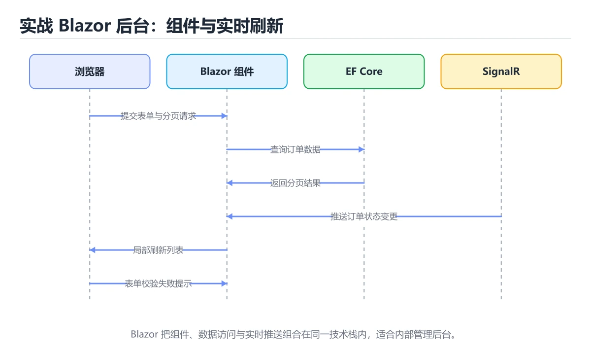
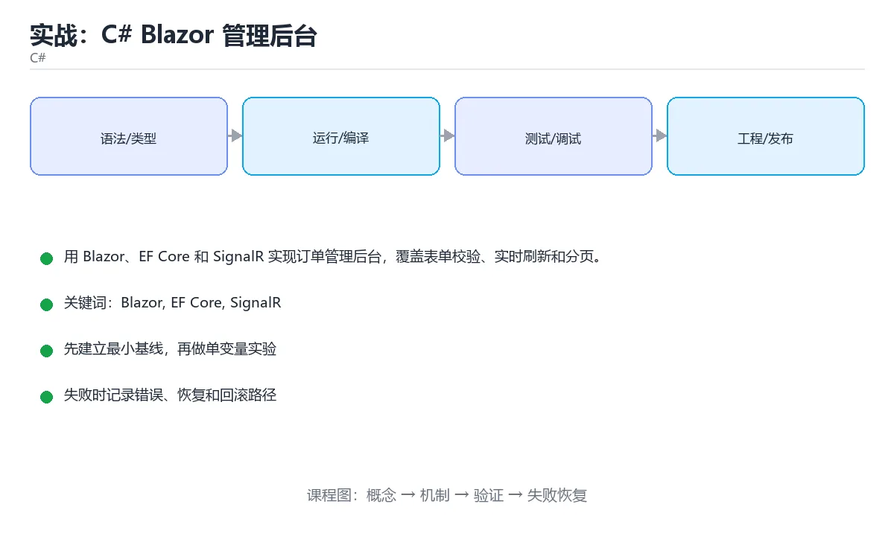

# 实战：C# Blazor 管理后台





> 内容更新时间：2026-10-06 · 学习阶段：高级 · 预计用时：60 分钟

## 本节知识框架

**课程定位**：所属分类 `csharp`（C#），课程主题 `实战：C# Blazor 管理后台`，学习阶段 高级，建议用时 70 分钟。

本课主线：用 Blazor、EF Core 和 SignalR 实现订单管理后台，覆盖表单校验、实时刷新和分页。

**学完本课应当能够**
- 说清 `Blazor` 与 `表单校验` 的含义与区别，并各举一个正例和一个反例。
- 用本课示例验证 `EF Core` 的行为，记录输入、输出与失败条件。
- 遇到「在组件里直接写 SQL」这类问题时，能说出触发条件与修复顺序。

### 从概念到验证的学习链条

1. `Blazor`：先掌握 用 C# 与 Razor 组件构建 Web UI 的框架，可选服务端渲染或 WebAssembly 在浏览器里运行，再用它解释 `表单校验` 为什么会出现。
2. `表单校验`：先掌握 用 Blazor、EF Core 和 SignalR 实现订单管理后台，覆盖表单校验、实时刷新和分页，再用它解释 `EF Core` 为什么会出现。
3. `EF Core`：先掌握 .NET 的对象关系映射框架，用 DbContext 跟踪实体并把 LINQ 翻译成 SQL，再用它解释 `SignalR` 为什么会出现。
4. `SignalR`：先掌握 在服务端与浏览器之间维持长连接的实时通信库，用来推送订单状态变化，再用它解释 本课示例的观察结果 为什么会出现。

**先修与衔接**：本课是「C#」分类的第 16 课。先修内容：《实战：C# 库存管理 CLI》。《实战：C# 库存管理 CLI》里的 `.NET`、`System.CommandLine` 是本课的前提。相关或后续课程：《C# Record、模式匹配与不可变数据》。

### 完成判据

- **定义关**：不看正文也能说明 `Blazor` 是 用 C# 与 Razor 组件构建 Web UI 的框架，可选服务端渲染或 WebAssembly 在浏览器里运行，并指出一个反例。
- **机制关**：能按“输入 → 转换 → 输出 → 验证”复述 `实战：C# Blazor 管理后台`，而不是只背结论。
- **示例关**：能运行或推演 `实战：C# Blazor 管理后台` 的 `text` 示例，并说明一个真实出现的标识符或字面量。
- **证据关**：能从 `实战：C# Blazor 管理后台` 的示例写出一个输入、处理、输出三元组，并说明它支持或反驳了本课的哪一条结论。
- **排错关**：能复现 在组件里直接写 SQL，记录现象并按 通过服务层访问数据 修复。
- **迁移关**：能把 `Blazor`、`EF Core`、`SignalR`、`表单校验` 放进一个与 `实战：C# Blazor 管理后台` 不同的项目场景，并保持输入与验证条件可追踪。
- **复盘关**：学完 `实战：C# Blazor 管理后台` 后，用一句话写下仍然不确定的结论，并列出下一次验证需要的输入、环境和成功判据。

### 复习清单

- [ ] 能不看正文复述本课核心术语，并指出一个边界或反例。
- [ ] 能运行或推演本课示例，记录输入、输出与失败现象。
- [ ] 能完成一次自测，并把错题对照错误表定位原因。

## 核心概念定义

| 术语 | 操作性定义 | 常见边界与风险 |
| --- | --- | --- |
| Blazor | 用 C# 与 Razor 组件构建 Web UI 的框架，可选服务端渲染或 WebAssembly 在浏览器里运行。 | 只在「用 C# 与 Razor 组件构建 Web UI 的框架，可选服务端渲染或 WebAssembly 在浏览器里运行」这一前提下成立，换输入或换环境要重新验证。 |
| 表单校验 | 用 Blazor、EF Core 和 SignalR 实现订单管理后台，覆盖表单校验、实时刷新和分页。 | 缓存与状态残留会让结果过期，先明确失效策略再判断正确性。 |
| EF Core | .NET 的对象关系映射框架，用 DbContext 跟踪实体并把 LINQ 翻译成 SQL。 | 索引命中与数据分布决定实际开销，判断前先看执行计划而不是只看结果是否正确。 |
| SignalR | 在服务端与浏览器之间维持长连接的实时通信库，用来推送订单状态变化。 | 缓存与状态残留会让结果过期，先明确失效策略再判断正确性。 |

## 原理与运行机制

### 机制总览

**教材衔接：技术栈**

- .NET 9
- Blazor
- EF Core
- SignalR
- xUnit

**教材衔接：架构与数据流**

- IOrderService 的读取接口必须写清过滤条件与分页，不能默认全量返回。
- IOrderService 的写入要以幂等键为准，失败后能补偿或安全重试。
- 外部调用要设置超时、重试上限和降级策略。
- 每个关键阶段都要留下日志、指标或测试证据。

**教材衔接：功能范围**

- [ ] 订单列表分页和搜索
- [ ] 订单详情编辑
- [ ] 状态变更实时通知
- [ ] 权限校验和错误提示

**教材衔接：实施步骤**

### 步骤 1：建立订单实体和 DbContext

- 先列出 IOrderService 这一步的输入、输出与中间产物，再动手实现。
- 为 EF Core 补一个最小用例，明确通过标准再扩展规模。
- 出错时先记录 EF Core 的错误信息与回滚结果，再决定是否重试。
- 证据留存：保留命令、输出、日志或截图，方便评审与复盘。

### 步骤 2：实现分页查询服务

- 定位：这一节说明步骤 2：实现分页查询服务在「实战：C# Blazor 管理后台」知识体系里的位置。
- 要点：本课涉及：Blazor、EF Core、SignalR、表单校验、实时刷新。
- 自检：能否用一个最小例子解释步骤 2：实现分页查询服务？

### 步骤 3：创建列表与详情组件

- 定位：这一节说明步骤 3：创建列表与详情组件在「实战：C# Blazor 管理后台」知识体系里的位置。
- 要点：客服团队需要一个内部后台查看和更新订单状态。列表要支持分页和搜索，订单变化要实时刷新，表单必须做服务端校验。
- 自检：能否用一个最小例子解释步骤 3：创建列表与详情组件？

### 步骤 4：加入编辑表单和服务端校验

- 定位：这一节说明步骤 4：加入编辑表单和服务端校验在「实战：C# Blazor 管理后台」知识体系里的位置。
- 要点：一句话摘要：用 Blazor、EF Core 和 SignalR 实现订单管理后台，覆盖表单校验、实时刷新和分页。
- 自检：能否用一个最小例子解释步骤 4：加入编辑表单和服务端校验？

### 步骤 5：接入 SignalR 推送

- 定位：这一节说明步骤 5：接入 SignalR 推送在「实战：C# Blazor 管理后台」知识体系里的位置。
- 检查点：用空值、极值和依赖失败各跑一次《实战：C# Blazor 管理后台》，确认边界行为与正文一致。
- 自检：能否用一个最小例子解释步骤 5：接入 SignalR 推送？

### 步骤 6：用集成测试和浏览器验证

- 定位：这一节说明步骤 6：用集成测试和浏览器验证在「实战：C# Blazor 管理后台」知识体系里的位置。
- 检查点：用空值、极值和依赖失败各跑一次《实战：C# Blazor 管理后台》，确认边界行为与正文一致。
- 自检：能否用一个最小例子解释步骤 6：用集成测试和浏览器验证？

**教材衔接：建议目录结构**

**教材衔接：质量门禁**

- [ ] 格式化和静态检查通过，不遗留明显警告。
- [ ] 测试分层：核心规则用单元测试，EF Core 的边界用集成测试。
- [ ] 错误响应不泄露堆栈、SQL 和密钥。
- [ ] 配置来自环境变量或配置文件，不硬编码敏感信息。
- [ ] README 写清启动、测试、配置和回滚步骤。

**教材衔接：安全、成本与可观测性**

- 权限遵循最小授权：Blazor 用到的数据库账号、云资源和令牌都不能使用管理员默认权限。
- IOrderService 的参数先校验再使用，错误响应里不出现堆栈或 SQL。
- 密钥通过环境变量或密钥管理服务注入，并记录轮换方式。
- IOrderService 的并发度要有上限，并在达到上限时给出可解释的拒绝。
- 为 IOrderService 建立四个指标：吞吐、错误率、尾延迟和资源占用。
- 把 EF Core 的日志与指标对齐到同一时间轴，便于事后复盘。

**教材衔接：扩展任务**

- 增加角色权限和操作审计
- 支持导出报表
- 用容器部署并加入健康检查

**教材衔接：实施记录与复盘**

每完成一步，记录以下内容：

1. 本步的输入、命令和输出是什么？
2. 遇到的最小失败是什么，如何定位和修复？
3. 哪个假设被验证或推翻？
4. 下一步的风险是什么，如何回滚？
5. 规模扩大 10 倍后，EF Core 会先成为瓶颈还是先暴露一致性风险？

**教材衔接：完成标准**

- [ ] 能从干净环境按 README 启动项目。
- [ ] 自动化测试覆盖 EF Core 的核心规则，并验证一次错误处理。
- [ ] 能演示一次错误、一次恢复和一次回滚。
- [ ] 有一份资源或性能基线，能说明瓶颈在哪里。
- [ ] 能说清一个尚未解决的问题和下一步验证方法。

**教材衔接：版本与时效**

- 先确认 SDK 版本，再决定 IOrderService 是否可以使用新语法或新 API。
- 若使用 AOT 或裁剪，IOrderService 的反射与动态加载路径需要重点验证。
- 升级前先用 IOrderService 建立基线：记录版本、命令和输出，升级后只比较这些可观察量。
- 官方说明：https://learn.microsoft.com/dotnet/core/whats-new/

### 升级检查清单

- 先固定当前版本，跑通全部示例与测验，再升级工具链。
- 升级时只动一个依赖版本，用 IOrderService 记录构建与运行结果。
- 回归范围锁定 IOrderService 的默认行为，并确认弃用警告是否出现在构建输出里。
- 升级完成后更新本课「最后复核 / 下次复核」日期，并记录 Blazor 的版本变化。

**教材衔接：交付评审：评分表、决策记录与证据链**


### 四、「实战：C# Blazor 管理后台」的验收指标

| 指标 | 目标值 | 测量方式 | 不达标时的动作 |
| --- | --- | --- | --- |
| | 延迟 | 记录 P50/P95/P99 | 用固定数据集逐步增加并发 | P99 持续上升或超时率增加 | | 用本课正文给出的阈值，没有就写实测基线 | 固定环境重复三次取中位数 | 回到对应小节定位，先修原因再重测 |
| | 存储 | 记录数据增长与索引大小 | 导入 10 倍数据并观察查询 | 磁盘、连接或锁等待成为瓶颈 | | 用本课正文给出的阈值，没有就写实测基线 | 固定环境重复三次取中位数 | 回到对应小节定位，先修原因再重测 |

### 五、评审记录模板

| 记录项 | 填写要求 |
| --- | --- |
| 项目标识 | `csharp_project_blazor_admin` |
| 本次范围 | 说明这一轮交付了「实战：C# Blazor 管理后台」的哪些部分 |
| 未完成项 | 列出与 Blazor 相关但本轮未做的内容 |
| 证据位置 | 指向 evidence/ 目录下的具体文件 |
| 风险与回滚 | 写清剩余风险、回滚步骤和验证方式 |
| 结论 | 通过 / 有条件通过 / 不通过，三者选一 |

### 机制拆解：每一步的输入、动作与输出

#### 1. `Blazor`
- 输入：`Blazor`；本步把 用 C# 与 Razor 组件构建 Web UI 的框架，可选服务端渲染或 WebAssembly 在浏览器里运行 当作判断规则。
- 动作：围绕 `Blazor` 保留中间状态，并记录它与 `表单校验` 的对应关系。
- 输出：`表单校验`，它可以被下一段代码、测试或记录继续使用。
- `Blazor` 的失败条件：只在「用 C# 与 Razor 组件构建 Web UI 的框架，可选服务端渲染或 WebAssembly 在浏览器里运行」这一前提下成立，换输入或换环境要重新验证。

#### 2. `表单校验`
- 输入：`Blazor`；本步把 用 Blazor、EF Core 和 SignalR 实现订单管理后台，覆盖表单校验、实时刷新和分页 当作判断规则。
- 动作：围绕 `表单校验` 保留中间状态，并记录它与 `EF Core` 的对应关系。
- 输出：`EF Core`，它可以被下一段代码、测试或记录继续使用。
- `表单校验` 的失败条件：缓存与状态残留会让结果过期，先明确失效策略再判断正确性。

#### 3. `EF Core`
- 输入：`表单校验`；本步把 .NET 的对象关系映射框架，用 DbContext 跟踪实体并把 LINQ 翻译成 SQL 当作判断规则。
- 动作：围绕 `EF Core` 保留中间状态，并记录它与 `SignalR` 的对应关系。
- 输出：`SignalR`，它可以被下一段代码、测试或记录继续使用。
- `EF Core` 的失败条件：索引命中与数据分布决定实际开销，判断前先看执行计划而不是只看结果是否正确。

#### 4. `SignalR`
- 输入：`EF Core`；本步把 在服务端与浏览器之间维持长连接的实时通信库，用来推送订单状态变化 当作判断规则。
- 动作：围绕 `SignalR` 保留中间状态，并记录它与 `本课示例的最终结果` 的对应关系。
- 输出：`本课示例的最终结果`，它可以被下一段代码、测试或记录继续使用。
- `SignalR` 的失败条件：缓存与状态残留会让结果过期，先明确失效策略再判断正确性。

### 复现实验记录

- 环境：`实战：C# Blazor 管理后台` 使用 `text` 示例，固定 `Blazor`、`EF Core`、`SignalR`、`表单校验` 作为第一组条件。
- 首轮输入：从示例中的第一个输入开始，预测 `Blazor` 会怎样变化。
- 基线观察：记录命令、输入、输出和错误原文，不用截图代替可复制的文本。
- 单变量修改：只改变 `Blazor`，观察 `SignalR` 是否仍满足定义。
- 失败注入：复现 在组件里直接写 SQL，确认现象是 耦合难测。
- 记录结论：把“修改前、修改后、预期变化、实际变化”写成四列表，这样复盘 `实战：C# Blazor 管理后台` 时才能区分概念错误与实现错误。

## 典型应用场景

**课程内置实验入口**：`sandbox:csharp`，用于动手验证《实战：C# Blazor 管理后台》的机制；实验结论不替代概念定义与复杂度分析。

**教材衔接：项目背景**

客服团队需要一个内部后台查看和更新订单状态。列表要支持分页和搜索，订单变化要实时刷新，表单必须做服务端校验。

一句话摘要：用 Blazor、EF Core 和 SignalR 实现订单管理后台，覆盖表单校验、实时刷新和分页。

**教材衔接：项目专属规格：实战：C# Blazor 管理后台**

### 核心场景

用 Blazor、EF Core 和 SignalR 实现订单管理后台，覆盖表单校验、实时刷新和分页。 项目目标是把「Blazor、EF Core、SignalR、表单校验、实时刷新」落实为可运行、可测试、可回滚的交付物。


### 验收场景

1. 正常路径：最小输入得到预期输出，并留下日志与指标。
2. 边界路径：EF Core 在重复提交与超长输入下不产生额外副作用。
3. 失败路径：依赖超时或不可用时能快速失败、重试或降级。
4. 幂等路径：同一请求执行两次不会产生重复副作用。
5. 回滚路径：Blazor 回滚后数据一致，且能说明恢复时间和影响范围。

**教材衔接：项目交付物**

### 建议仓库结构

```text
src/App/
src/Domain/
tests/App.Tests/
App.sln
README.md
```


### 验收数据

```json
{
  "project": "csharp_project_blazor_admin",
  "scenario": "Blazor的正常路径",
  "input": {"case": "normal", "value": "IOrderService"},
  "expected": {"ok": true, "checks": ["Blazor可复现", "EF Core有记录"]},
  "failure_case": {"case": "EF Core越界或缺失", "error": "validation_error"},
  "idempotency_key": "csharp_project_blazor_admin-001"
}
```

### 复盘模板

- **在组件里直接写 SQL**：典型现象是耦合难测；正确做法是通过服务层访问数据。
- **忽略并发更新**：典型现象是后写覆盖先写；正确做法是使用并发令牌或版本号。
- **只做前端校验**：典型现象是绕过浏览器可提交非法数据；正确做法是服务端再次校验。
- **实时推送无重连**：典型现象是断线后页面过期；正确做法是加入连接状态和重新加载。

### 最小验证场景

- 准备：保留 `text` 示例的原始输入，先记录 `实战：C# Blazor 管理后台` 的基线输出和完整运行命令。
- 判定：新结果与 `实战：C# Blazor 管理后台` 的基线不同不等于错误；只有当差异破坏了 `Blazor` 的定义或错误表中的约束，才判定为失败。

### 选择与边界

- 使用 `Blazor` 时，先满足它的定义：用 C# 与 Razor 组件构建 Web UI 的框架，可选服务端渲染或 WebAssembly 在浏览器里运行；只在「用 C# 与 Razor 组件构建 Web UI 的框架，可选服务端渲染或 WebAssembly 在浏览器里运行」这一前提下成立，换输入或换环境要重新验证。
- 使用 `表单校验` 时，先满足它的定义：用 Blazor、EF Core 和 SignalR 实现订单管理后台，覆盖表单校验、实时刷新和分页；缓存与状态残留会让结果过期，先明确失效策略再判断正确性。
- 使用 `EF Core` 时，先满足它的定义：.NET 的对象关系映射框架，用 DbContext 跟踪实体并把 LINQ 翻译成 SQL；索引命中与数据分布决定实际开销，判断前先看执行计划而不是只看结果是否正确。
- 使用 `SignalR` 时，先满足它的定义：在服务端与浏览器之间维持长连接的实时通信库，用来推送订单状态变化；缓存与状态残留会让结果过期，先明确失效策略再判断正确性。

## 代码/协议/SQL 示例

### 最小可验证示例

**教材衔接：示例数据与边界**

**教材衔接：关键代码**

```csharp
@page "/orders"
@inject IOrderService Orders

<h3>Orders</h3>
@if (items is null) { <p>Loading...</p> }
else {
  <ul>@foreach (var item in items) { <li>@item.Id - @item.Status</li> }</ul>
}

@code {
  private IReadOnlyList<Order>? items;
  protected override async Task OnInitializedAsync() => items = await Orders.PageAsync(1, 20);
}
```

**教材衔接：验证命令与预期输出**

**教材衔接：测试与验收**

- 非法状态更新不会写入数据库
- 分页边界返回空列表而不是异常
- SignalR 推送后页面状态更新


### 示例精读：先找证据，再改一个条件

- 在 `实战：C# Blazor 管理后台` 中与 `Blazor` 对照：示例必须能支持 用 C# 与 Razor 组件构建 Web UI 的框架，可选服务端渲染或 WebAssembly 在浏览器里运行，否则说明这一段还缺少实现或验证步骤。
- 在 `实战：C# Blazor 管理后台` 中与 `表单校验` 对照：示例必须能支持 用 Blazor、EF Core 和 SignalR 实现订单管理后台，覆盖表单校验、实时刷新和分页，否则说明这一段还缺少实现或验证步骤。
- 在 `实战：C# Blazor 管理后台` 中与 `EF Core` 对照：示例必须能支持 .NET 的对象关系映射框架，用 DbContext 跟踪实体并把 LINQ 翻译成 SQL，否则说明这一段还缺少实现或验证步骤。
- 在 `实战：C# Blazor 管理后台` 中与 `SignalR` 对照：示例必须能支持 在服务端与浏览器之间维持长连接的实时通信库，用来推送订单状态变化，否则说明这一段还缺少实现或验证步骤。
- `实战：C# Blazor 管理后台` 的示例没有抽取到函数调用或字面量；按行记录输入、控制流和输出，避免只背代码外形。

## 时间/空间复杂度或性能分析

**性能关注点（实战：C# Blazor 管理后台）**：GC 与异步调度影响开销：记录吞吐、延迟与分配速率。

**本课特有开销（实战：C# Blazor 管理后台 · Blazor）**：并发度提高后要观察是否出现拐点：延迟上升而吞吐不增，说明瓶颈已转移。

**测量方法**：以 `实战：C# Blazor 管理后台` 的 `Blazor` 场景为对象，固定输入跑一遍记录基线，再把规模或并发度提高一个数量级复测；两次结果的差值与波动范围才是结论依据。

### 需要控制的变量与记录项

- `实战：C# Blazor 管理后台` 的 `Blazor`：固定它的版本、输入范围和资源上限，分别记录速度、内存与失败率的变化。
- `实战：C# Blazor 管理后台` 的 `EF Core`：固定它的版本、输入范围和资源上限，分别记录速度、内存与失败率的变化。
- `实战：C# Blazor 管理后台` 的 `SignalR`：固定它的版本、输入范围和资源上限，分别记录速度、内存与失败率的变化。
- `实战：C# Blazor 管理后台` 的 `表单校验`：固定它的版本、输入范围和资源上限，分别记录速度、内存与失败率的变化。
- `实战：C# Blazor 管理后台` 的 `实时刷新`：固定它的版本、输入范围和资源上限，分别记录速度、内存与失败率的变化。
- `实战：C# Blazor 管理后台` 中 `Blazor` 的边界：只在「用 C# 与 Razor 组件构建 Web UI 的框架，可选服务端渲染或 WebAssembly 在浏览器里运行」这一前提下成立，换输入或换环境要重新验证。达到边界时不要外推，必须重新测量。
- `实战：C# Blazor 管理后台` 中 `表单校验` 的边界：缓存与状态残留会让结果过期，先明确失效策略再判断正确性。达到边界时不要外推，必须重新测量。
- `实战：C# Blazor 管理后台` 中 `EF Core` 的边界：索引命中与数据分布决定实际开销，判断前先看执行计划而不是只看结果是否正确。达到边界时不要外推，必须重新测量。
- `实战：C# Blazor 管理后台` 中 `SignalR` 的边界：缓存与状态残留会让结果过期，先明确失效策略再判断正确性。达到边界时不要外推，必须重新测量。

## 常见误区与易错点

| 容易写错的做法 | 实际现象 | 原因与正确做法 |
| --- | --- | --- |
| 在组件里直接写 SQL | 耦合难测 | 通过服务层访问数据 |
| 忽略并发更新 | 后写覆盖先写 | 使用并发令牌或版本号 |
| 只做前端校验 | 绕过浏览器可提交非法数据 | 服务端再次校验 |
| 实时推送无重连 | 断线后页面过期 | 加入连接状态和重新加载 |

### 现场 1：在组件里直接写 SQL

**症状**：耦合难测。

**根因与修复**：通过服务层访问数据。

**自检**：在本课示例里复现「在组件里直接写 SQL」，改成通过服务层访问数据后重跑；如果症状消失且失败路径按预期变化，说明定位正确。

### 现场 2：忽略并发更新

**症状**：后写覆盖先写。

**根因与修复**：使用并发令牌或版本号。

**自检**：在本课示例里复现「忽略并发更新」，改成使用并发令牌或版本号后重跑；如果症状消失且失败路径按预期变化，说明定位正确。

### 现场 3：只做前端校验

**症状**：绕过浏览器可提交非法数据。

**根因与修复**：服务端再次校验。

**自检**：在本课示例里复现「只做前端校验」，改成服务端再次校验后重跑；如果症状消失且失败路径按预期变化，说明定位正确。

### 现场 4：实时推送无重连

**症状**：断线后页面过期。

**根因与修复**：加入连接状态和重新加载。

**自检**：在本课示例里复现「实时推送无重连」，改成加入连接状态和重新加载后重跑；如果症状消失且失败路径按预期变化，说明定位正确。

## 与其他知识点的关系

**教材衔接：复习与迁移**

### 概念复述

- 用一句话说明「实战：C# Blazor 管理后台」解决什么问题：用 Blazor、EF Core 和 SignalR 实现订单管理后台，覆盖表单校验、实时刷新和分页。
- 写出Blazor、EF Core、SignalR之间的关系，并各举一个例子。
- 说出本课最容易混淆的两个概念，以及区分它们的判据。

### 正文逐节复核

- **项目背景**：一句话摘要：用 Blazor、EF Core 和 SignalR 实现订单管理后台，覆盖表单校验、实时刷新和分页。
- **项目专属规格：实战：C# Blazor 管理后台**：用 Blazor、EF Core 和 SignalR 实现订单管理后台，覆盖表单校验、实时刷新和分页。


### 迁移练习

- **先修**：`实战：C# 库存管理 CLI`。本课默认这些内容已经掌握。
- **相关或后续**：`C# Record、模式匹配与不可变数据`。本课术语会在这些课程里继续使用。
- **术语归属**：`Blazor`、`表单校验`、`EF Core` 的定义以本课「核心概念定义」为准，换到其他课程时先确认定义是否被改写。
- 同一分类的《生态、测试与 Web 开发》也涉及 `EF Core`；两课衔接时先确认这个术语的定义是否一致。
- 同一分类的《实战：Web API + EF Core》也涉及 `EF Core`；两课衔接时先确认这个术语的定义是否一致。

### 先修与后续术语接口

- `实战：C# 库存管理 CLI`：两者通过本分类的学习顺序衔接，阅读时重点比较各自的输入与失败条件。
- `C# Record、模式匹配与不可变数据`：两者通过本分类的学习顺序衔接，阅读时重点比较各自的输入与失败条件。

### 容易混淆的相邻概念

- `Blazor` 与 `表单校验`：前者强调 用 C# 与 Razor 组件构建 Web UI 的框架，可选服务端渲染或 WebAssembly 在浏览器里运行；后者强调 用 Blazor、EF Core 和 SignalR 实现订单管理后台，覆盖表单校验、实时刷新和分页。判断时分别检查两条定义的适用范围，不要只看名称相似就互换。
- `表单校验` 与 `EF Core`：前者强调 用 Blazor、EF Core 和 SignalR 实现订单管理后台，覆盖表单校验、实时刷新和分页；后者强调 .NET 的对象关系映射框架，用 DbContext 跟踪实体并把 LINQ 翻译成 SQL。判断时分别检查两条定义的适用范围，不要只看名称相似就互换。
- `EF Core` 与 `SignalR`：前者强调 .NET 的对象关系映射框架，用 DbContext 跟踪实体并把 LINQ 翻译成 SQL；后者强调 在服务端与浏览器之间维持长连接的实时通信库，用来推送订单状态变化。判断时分别检查两条定义的适用范围，不要只看名称相似就互换。

## 自测题与参考答案

> 先独立作答，再对照参考答案；答案都能在本课正文、术语表或错误表里找到依据。

### 自测 1（概念复述）

不看正文，写出 `Blazor` 的操作性定义，并说明它与 `表单校验` 的区别。

**参考答案**：用 C# 与 Razor 组件构建 Web UI 的框架，可选服务端渲染或 WebAssembly 在浏览器里运行。

`表单校验` 的定位是：用 Blazor、EF Core 和 SignalR 实现订单管理后台，覆盖表单校验、实时刷新和分页；两者的差别要从适用对象与失败模式上说明。

### 自测 2（排错）

本课错误表记录了「在组件里直接写 SQL」这类做法。请写出它会出现的现象、根因，以及修复顺序。

**参考答案**：现象是耦合难测；正确做法是通过服务层访问数据。修复时先复现现象并保留证据，再改动一处假设重跑，确认现象消失。

### 自测 3（动手验证）

运行本课的 `text` 示例，改动其中一个输入后重新运行，记录输出与错误信息。

**参考答案**：正常输入下 `text` 示例应当复现正文给出的结果；改动输入后，如果结果改变或报错，先核对它是否满足 `实战：C# Blazor 管理后台` 中`Blazor` 的适用范围，再检查错误表里是否有同类现象。

### 自测 4（代码阅读）

阅读本课开头的 `text` 示例，说明它体现了`Blazor` 的哪一条性质，并指出改动哪个输入会让这条性质不再成立。

**参考答案**：`Blazor` 的定义是 用 C# 与 Razor 组件构建 Web UI 的框架，可选服务端渲染或 WebAssembly 在浏览器里运行，示例正是在实现这条定义。改动与 `Blazor` 有关的一个输入后，如果结果不再符合 `实战：C# Blazor 管理后台` 的正文描述，就说明该性质只在当前前提成立。

### 自测 5（迁移）

把 `实战：C# Blazor 管理后台` 的方法迁移到自己的项目：围绕 `Blazor` 写出一个与错误表同类的风险点，并说明触发条件和检验方式。

**参考答案**：例如「实时推送无重连」，它会导致断线后页面过期；检验方式是按加入连接状态和重新加载改一处再复现，确认现象消失且没有引入新的失败分支。

### 自测 6（对比）

用一个表格对比 `Blazor` 与 `表单校验`：各写一行适用场景、一行失败表现。

**参考答案**：`Blazor` 的定义是用 C# 与 Razor 组件构建 Web UI 的框架，可选服务端渲染或 WebAssembly 在浏览器里运行；`表单校验` 的定义是用 Blazor、EF Core 和 SignalR 实现订单管理后台，覆盖表单校验、实时刷新和分页。两者的失败表现分别对应本课错误表里与本术语相关的行。

### 自测 7（排错顺序）

面对「在组件里直接写 SQL」引发的问题，请把“复现 耦合难测 → 保留证据 → 通过服务层访问数据 → 回归验证”四步写成可执行的检查清单。

**参考答案**：第一步按耦合难测复现；第二步记录输入、版本与完整报错；第三步按通过服务层访问数据只改一处；第四步重跑并确认失败路径也按预期变化。

### 自测 8（边界判断）

针对 `SignalR`，分别写出“可以使用”的条件和“结论不再成立”的条件。

**参考答案**：缓存与状态残留会让结果过期，先明确失效策略再判断正确性。 同时要把 `SignalR` 的定义 在服务端与浏览器之间维持长连接的实时通信库，用来推送订单状态变化 与实际输入逐项对照。

### 自测 9（机制重建）

不看正文，按输入、转换、输出、验证四段重建 `Blazor` → `表单校验` → `EF Core` → `SignalR` 的作用链。

**参考答案**：起点是 `Blazor` 的定义 用 C# 与 Razor 组件构建 Web UI 的框架，可选服务端渲染或 WebAssembly 在浏览器里运行；中间每一步都保留可观察状态；终点由 `SignalR` 检查，失败时回到错误表定位第一个偏离定义的步骤。

### 自测 10（综合排错）

在 `实战：C# Blazor 管理后台` 中，现象是 断线后页面过期。请围绕 实时推送无重连 写出最小复现、关键证据、修复动作和回归验证，并说明为什么不能只凭一次运行下结论。

**参考答案**：先复现 实时推送无重连，记录输入与完整错误；再按 加入连接状态和重新加载 只改一处。回归时同时跑正常路径和边界路径，只有两次结果都可解释，才把修复视为完成。

### 自测 11（一分钟复述）

用每分钟约 200 字的速度复述 `实战：C# Blazor 管理后台`：先给主问题，再按顺序说出 `Blazor`、`表单校验`、`EF Core`、`SignalR`，最后给一个失败案例。

**自评标准**：主问题必须对应 用 Blazor、EF Core 和 SignalR 实现订单管理后台，覆盖表单校验、实时刷新和分页；每个术语都要能接上一句定义或边界；失败案例必须写成可观察现象，不能用“可能有风险”代替证据。

## 术语速查

| 术语 | 一句话说明 |
| --- | --- |
| `Blazor` | 用 C# 与 Razor 组件构建 Web UI 的框架，可选服务端渲染或 WebAssembly 在浏览器里运行。 |
| `表单校验` | 用 Blazor、EF Core 和 SignalR 实现订单管理后台，覆盖表单校验、实时刷新和分页。 |
| `EF Core` | .NET 的对象关系映射框架，用 DbContext 跟踪实体并把 LINQ 翻译成 SQL。 |
| `SignalR` | 在服务端与浏览器之间维持长连接的实时通信库，用来推送订单状态变化。 |

**术语关系**：`Blazor`（用 C# 与 Razor 组件构建 Web UI 的框架） → `表单校验`（用 Blazor、EF Core 和 SignalR 实现订单管理后台） → `EF Core`（.NET 的对象关系映射框架） → `SignalR`（在服务端与浏览器之间维持长连接的实时通信库）。

## 考点精讲

`实战：C# Blazor 管理后台` 的题库有 6 道题，下面逐题给出题干、正确项与判断依据：先自己作答，再核对正确项，最后回到正文对应小节复核。

### 考点 1：第 1 题

- **题目**：EF Core 分页推荐使用什么？
- **正确项**：Skip/Take 加稳定排序
- **判断依据**：这道题落在术语 `EF Core` 上：.NET 的对象关系映射框架，用 DbContext 跟踪实体并把 LINQ 翻译成 SQL。复习时把 `EF Core` 的定义、适用边界和一个反例一起说清楚，再回到「核心概念定义」核对原文。

### 考点 2：第 2 题

- **题目**：并发更新冲突如何避免静默覆盖？
- **正确项**：使用并发令牌
- **判断依据**：这道题检验本课主问题：用 Blazor、EF Core 和 SignalR 实现订单管理后台，覆盖表单校验、实时刷新和分页。复习时先复述本课主问题，再举一个会让结论失效的输入。

### 考点 3：第 3 题

- **题目**：为什么前端校验不能替代服务端校验？
- **正确项**：请求可以绕过前端
- **判断依据**：这道题检验本课主问题：用 Blazor、EF Core 和 SignalR 实现订单管理后台，覆盖表单校验、实时刷新和分页。复习时先复述本课主问题，再举一个会让结论失效的输入。

### 考点 4：第 4 题

- **题目**：按“实战：C# Blazor 管理后台”中 Blazor、EF Core、SignalR 的实践顺序，把四个步骤排成从准备到复盘的合理顺序。
- **正确项**：先明确 Blazor 的输入、输出与约束 → 写出最小示例并核对 EF Core 的基线结果 → 只改一个变量，记录边界与失败路径的变化 → 固定版本与证据，把“实战：C# Blazor 管理后台”的结论写成可复现记录
- **判断依据**：这道题落在术语 `Blazor` 上：用 C# 与 Razor 组件构建 Web UI 的框架，可选服务端渲染或 WebAssembly 在浏览器里运行。复习时把 `Blazor` 的定义、适用边界和一个反例一起说清楚，再回到「核心概念定义」核对原文。

### 考点 5：第 5 题

- **题目**：两个客服同时编辑同一订单时，EF Core 并发令牌会怎样？
- **正确项**：版本不匹配时更新失败并提示重试
- **判断依据**：这道题落在术语 `EF Core` 上：.NET 的对象关系映射框架，用 DbContext 跟踪实体并把 LINQ 翻译成 SQL。复习时把 `EF Core` 的定义、适用边界和一个反例一起说清楚，再回到「核心概念定义」核对原文。

### 考点 6：第 6 题

- **题目**：关于 `Blazor`，下列哪些说法与 `实战：C# Blazor 管理后台` 的正文一致？判断时以用 Blazor、EF Core 和 SignalR 实现订单管理后台，覆盖表单校验、实时刷新和分页。为主线。（多选）
- **正确项**：使用并发令牌；Skip/Take 加稳定排序
- **判断依据**：这道题落在术语 `Blazor` 上：用 C# 与 Razor 组件构建 Web UI 的框架，可选服务端渲染或 WebAssembly 在浏览器里运行。复习时把 `Blazor` 的定义、适用边界和一个反例一起说清楚，再回到「核心概念定义」核对原文。

### 考点 7：`Blazor`

- **要点**：用 C# 与 Razor 组件构建 Web UI 的框架，可选服务端渲染或 WebAssembly 在浏览器里运行。
- **Blazor 的边界**：只在「用 C# 与 Razor 组件构建 Web UI 的框架，可选服务端渲染或 WebAssembly 在浏览器里运行」这一前提下成立，换输入或换环境要重新验证。

### 考点 8：`表单校验`

- **要点**：用 Blazor、EF Core 和 SignalR 实现订单管理后台，覆盖表单校验、实时刷新和分页。
- **表单校验 的边界**：缓存与状态残留会让结果过期，先明确失效策略再判断正确性。

### 考点 9：`EF Core`

- **要点**：.NET 的对象关系映射框架，用 DbContext 跟踪实体并把 LINQ 翻译成 SQL。
- **EF Core 的边界**：索引命中与数据分布决定实际开销，判断前先看执行计划而不是只看结果是否正确。

### 考点 10：`SignalR`

- **要点**：在服务端与浏览器之间维持长连接的实时通信库，用来推送订单状态变化。
- **SignalR 的边界**：缓存与状态残留会让结果过期，先明确失效策略再判断正确性。

### 考点 11：排错——在组件里直接写 SQL

- **现象**：耦合难测。
- **处理**：通过服务层访问数据。

### 考点 12：排错——忽略并发更新

- **现象**：后写覆盖先写。
- **处理**：使用并发令牌或版本号。

### 考点 13：综合辨析——`Blazor` 与 `SignalR`

- **辨析点**：`Blazor` 的定义是 用 C# 与 Razor 组件构建 Web UI 的框架，可选服务端渲染或 WebAssembly 在浏览器里运行；`SignalR` 的定义是 在服务端与浏览器之间维持长连接的实时通信库，用来推送订单状态变化。
- **答题要求**：面对 `实战：C# Blazor 管理后台` 的题目，先判断描述的是 `Blazor` 还是 `SignalR`，再归到对应定义，最后写出一个会让该定义失效的边界输入。

### 考点 14：排错评分点

- **现象分**：能写出 耦合难测，而不是只写“程序有错”。
- **证据分**：保留触发 在组件里直接写 SQL 的输入、版本和错误原文。
- **修复分**：按 通过服务层访问数据 只改一处，并同时回归正常路径与边界路径。

## 内容元数据

- 内容版本：v2.0
- 最后更新：2026-10-06
- 学习阶段：高级
- 适用环境：.NET 9 / C# 13；本课聚焦 Blazor。
- 内容来源：内置结构化课程与工程实践整理
- 相关主题：Blazor、EF Core、SignalR、表单校验、实时刷新
- 质量版本：P0 测验标准 + P1 覆盖扩展 + P2 体验补全

## 参考资料与复核

- 最后复核：2026-10-04
- 下次复核：2027-03-10
- 复核范围：版本兼容、API 行为、安全建议与工程实践
- 来源性质：官方文档、标准或权威教材；本课核对关键词：Blazor、EF Core、SignalR、表单校验、实时刷新。

| 参考资料 | 本课用途 |
| --- | --- |
| [Blazor 文档](https://learn.microsoft.com/aspnet/core/blazor/) | 组件、状态与交互 |
| [ASP.NET Core 文档](https://learn.microsoft.com/aspnet/core/) | Web API 与中间件 |
| [LINQ 文档](https://learn.microsoft.com/dotnet/csharp/linq/) | 查询、延迟执行与投影 |

| [本课术语索引：实战：C# Blazor 管理后台](#核心概念定义) | 按本课输入、术语边界和错误表现逐项核对 |
> 「实战：C# Blazor 管理后台」的链接用于离线阅读后的延伸核对；App 不会自动联网。