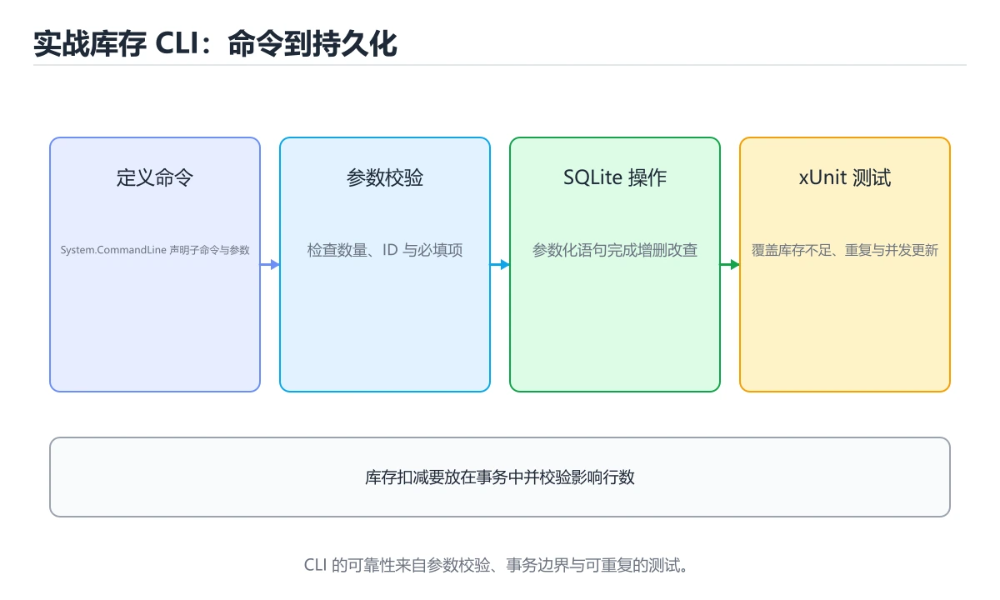
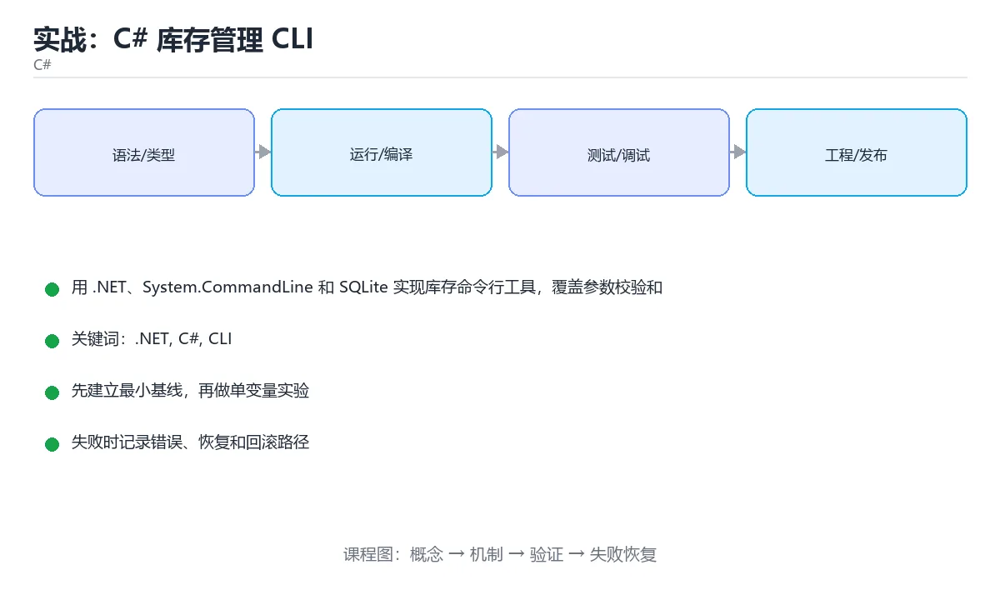

# 实战：C# 库存管理 CLI





> 内容更新时间：2026-10-06 · 学习阶段：高级 · 预计用时：60 分钟

## 本节知识框架

**课程定位**：所属分类 `csharp`（C#），课程主题 `实战：C# 库存管理 CLI`，学习阶段 高级，建议用时 70 分钟。

本课主线：用 .NET、System.CommandLine 和 SQLite 实现库存命令行工具，覆盖参数校验和 xUnit 测试。

**学完本课应当能够**
- 说清 `.NET` 与 `System.CommandLine` 的含义与区别，并各举一个正例和一个反例。
- 用本课示例验证 `xUnit` 的行为，记录输入、输出与失败条件。
- 遇到「业务逻辑写在入口方法里」这类问题时，能说出触发条件与修复顺序。

### 从概念到验证的学习链条

1. `.NET`：先掌握 微软的跨平台运行时与开发平台：C# 编译成 IL，由 CLR 加载并 JIT 执行，再用它解释 `System.CommandLine` 为什么会出现。
2. `System.CommandLine`：先掌握 .NET 的命令行解析库，用命令、选项与参数描述定义 CLI 的行为，再用它解释 `xUnit` 为什么会出现。
3. `xUnit`：先掌握 .NET 生态常用的单元测试框架，用事实与理论特性组织用例并输出断言结果，再用它解释 `参数校验` 为什么会出现。
4. `参数校验`：先掌握 在命令入口检查参数组合与取值范围，不合格时给出用法提示并以非 0 退出码结束，再用它解释 `SQLite` 为什么会出现。
5. `SQLite`：先掌握 单文件嵌入式关系数据库，无需独立服务进程，通过 C API 直接读写，适合本地存储，再用它解释 本课示例的观察结果 为什么会出现。

**先修与衔接**：本课是「C#」分类的第 15 课。先修内容：《实战：Web API + EF Core》。《实战：Web API + EF Core》里的 `dotnet ef migrations add Init`、`UseExceptionHandler` 是本课的前提。相关或后续课程：《实战：C# Blazor 管理后台》、《实战：C++ 任务数据库 CLI》。

### 完成判据

- **定义关**：不看正文也能说明 `.NET` 是 微软的跨平台运行时与开发平台：C# 编译成 IL，由 CLR 加载并 JIT 执行，并指出一个反例。
- **机制关**：能按“输入 → 转换 → 输出 → 验证”复述 `实战：C# 库存管理 CLI`，而不是只背结论。
- **示例关**：能运行或推演 `实战：C# 库存管理 CLI` 的 `text` 示例，并说明一个真实出现的标识符或字面量。
- **证据关**：能从 `实战：C# 库存管理 CLI` 的示例写出一个输入、处理、输出三元组，并说明它支持或反驳了本课的哪一条结论。
- **排错关**：能复现 业务逻辑写在入口方法里，记录现象并按 拆出服务层与仓储层，入口只负责参数解析与输出 修复。
- **迁移关**：能把 `.NET`、`C#`、`CLI`、`SQLite` 放进一个与 `实战：C# 库存管理 CLI` 不同的项目场景，并保持输入与验证条件可追踪。
- **复盘关**：学完 `实战：C# 库存管理 CLI` 后，用一句话写下仍然不确定的结论，并列出下一次验证需要的输入、环境和成功判据。

### 复习清单

- [ ] 能不看正文复述本课核心术语，并指出一个边界或反例。
- [ ] 能运行或推演本课示例，记录输入、输出与失败现象。
- [ ] 能完成一次自测，并把错题对照错误表定位原因。

## 核心概念定义

| 术语 | 操作性定义 | 常见边界与风险 |
| --- | --- | --- |
| .NET | 微软的跨平台运行时与开发平台：C# 编译成 IL，由 CLR 加载并 JIT 执行。 | 静态检查只在编译期成立，运行期输入仍需校验。 |
| System.CommandLine | .NET 的命令行解析库，用命令、选项与参数描述定义 CLI 的行为。 | 结果依赖数据分布、模型版本与算力预算，换数据集或换硬件都要重新评估。 |
| xUnit | .NET 生态常用的单元测试框架，用事实与理论特性组织用例并输出断言结果。 | 只在「.NET 生态常用的单元测试框架，用事实与理论特性组织用例并输出断言结果」这一前提下成立，换输入或换环境要重新验证。 |
| 参数校验 | 在命令入口检查参数组合与取值范围，不合格时给出用法提示并以非 0 退出码结束。 | 结果依赖数据分布、模型版本与算力预算，换数据集或换硬件都要重新评估。 |
| SQLite | 单文件嵌入式关系数据库，无需独立服务进程，通过 C API 直接读写，适合本地存储 | 不同版本与依赖组合的行为可能不同，升级或换环境前要按官方变更说明重新验证。 |

## 原理与运行机制

### 机制总览

**教材衔接：技术栈**

- .NET 9
- C# 13
- System.CommandLine
- SQLite
- xUnit

**教材衔接：架构与数据流**

- SetHandler 的读取接口必须写清过滤条件与分页，不能默认全量返回。
- 写入 C# 前先定义事务范围，跨服务时改用可补偿流程。
- 外部调用要设置超时、重试上限和降级策略。
- 每个关键阶段都要留下日志、指标或测试证据。

**教材衔接：功能范围**

- [ ] 添加或更新商品
- [ ] 入库与出库
- [ ] 按关键字查询
- [ ] 输出低库存列表

**教材衔接：实施步骤**

### 步骤 1：定义商品和库存变动模型

- 输入与产出：先写清 .NET 依赖的配置、数据和最终产物，再开始编码。
- 用一条最小输入验证 SetHandler，断言输出符合预期。
- 出错时先记录 C# 的错误信息与回滚结果，再决定是否重试。
- 证据留存：保留命令、输出、日志或截图，方便评审与复盘。

### 步骤 2：实现 SQLite 数据库初始化

- 定位：这一节说明步骤 2：实现 SQLite 数据库初始化在「实战：C# 库存管理 CLI」知识体系里的位置。
- 要点：本课涉及：.NET、C#、CLI、SQLite、xUnit。
- 自检：能否用一个最小例子解释步骤 2：实现 SQLite 数据库初始化？

### 步骤 3：接入命令行解析

「实战：C# 库存管理 CLI」的「步骤 3：接入命令行解析」一节补全如下：

- 定位：这一节说明步骤 3：接入命令行解析在「实战：C# 库存管理 CLI」知识体系里的位置。
- 要点：一句话摘要：用 .NET、System.CommandLine 和 SQLite 实现库存命令行工具，覆盖参数校验和 xUnit 测试。
- 自检：能否用一个最小例子解释步骤 3：接入命令行解析？

### 步骤 4：实现入库出库业务规则

- 定位：这一节说明步骤 4：实现入库出库业务规则在「实战：C# 库存管理 CLI」知识体系里的位置。
- 检查点：用空值、极值和依赖失败各跑一次《实战：C# 库存管理 CLI》，确认边界行为与正文一致。
- 自检：能否用一个最小例子解释步骤 4：实现入库出库业务规则？

### 步骤 5：补 xUnit 单元与集成测试

- 定位：这一节说明步骤 5：补 xUnit 单元与集成测试在「实战：C# 库存管理 CLI」知识体系里的位置。
- 检查点：用空值、极值和依赖失败各跑一次《实战：C# 库存管理 CLI》，确认边界行为与正文一致。
- 自检：能否用一个最小例子解释步骤 5：补 xUnit 单元与集成测试？

### 步骤 6：打印帮助和稳定退出码

- 定位：这一节说明步骤 6：打印帮助和稳定退出码在「实战：C# 库存管理 CLI」知识体系里的位置。
- 检查点：在《实战：C# 库存管理 CLI》中用最小输入复现问题，逐项核对版本、边界和失败路径后再修改。
- 自检：能否用一个最小例子解释步骤 6：打印帮助和稳定退出码？

**教材衔接：建议目录结构**

**教材衔接：质量门禁**

- [ ] 格式化和静态检查通过，不遗留明显警告。
- [ ] 单元测试覆盖 .NET 的核心规则，集成测试覆盖数据库或外部边界。
- [ ] 错误响应不泄露堆栈、SQL 和密钥。
- [ ] 配置来自环境变量或配置文件，不硬编码敏感信息。
- [ ] README 写清启动、测试、配置和回滚步骤。

**教材衔接：安全、成本与可观测性**

- SetHandler 的运行身份只保留完成任务所需的权限，越权请求应当被拒绝。
- 把 C# 的输入约束写成白名单，并统一错误结构。
- 密钥通过环境变量或密钥管理服务注入，并记录轮换方式。
- 为 .NET 涉及的连接、线程或协程、队列与网络请求设置上限，避免资源耗尽。
- 为 SetHandler 建立四个指标：吞吐、错误率、尾延迟和资源占用。
- 把 C# 的日志与指标对齐到同一时间轴，便于事后复盘。

**教材衔接：扩展任务**

- 加入导出 CSV
- 支持多仓库和调拨
- 打包为单文件可执行程序

**教材衔接：实施记录与复盘**

每完成一步，记录以下内容：

1. 本步的输入、命令和输出是什么？
2. 遇到的最小失败是什么，如何定位和修复？
3. 哪个假设被验证或推翻？
4. 下一步的风险是什么，如何回滚？
5. 如果 .NET 的数据量或并发扩大 10 倍，最先出现的瓶颈在哪里？

**教材衔接：完成标准**

- [ ] 能从干净环境按 README 启动项目。
- [ ] 至少 3 条 .NET 相关自动化测试通过，其中一条覆盖失败路径。
- [ ] 能演示一次错误、一次恢复和一次回滚。
- [ ] 有一份资源或性能基线，能说明瓶颈在哪里。
- [ ] 能说清一个尚未解决的问题和下一步验证方法。

**教材衔接：版本与时效**

- 先确认 SDK 版本，再决定 SetHandler 是否可以使用新语法或新 API。
- 升级重点在语法与裁剪行为；先为 C# 补一组回归用例。
- 升级前确认 .NET 的兼容范围，把不可回退的改动单独拆成一次提交。
- 官方说明：https://learn.microsoft.com/dotnet/core/whats-new/

### 升级检查清单

- 先固定当前版本，跑通全部示例与测验，再升级工具链。
- 升级时只动一个依赖版本，用 SetHandler 记录构建与运行结果。
- 先回归 .NET 与 C# 的默认行为和错误信息，再扩大测试范围。
- 升级完成后更新本课「最后复核 / 下次复核」日期，并记录 .NET 的版本变化。

**教材衔接：交付评审：评分表、决策记录与证据链**


### 四、「实战：C# 库存管理 CLI」的验收指标

| 指标 | 目标值 | 测量方式 | 不达标时的动作 |
| --- | --- | --- | --- |
| | 延迟 | 记录 P50/P95/P99 | 用固定数据集逐步增加并发 | P99 持续上升或超时率增加 | | 用本课正文给出的阈值，没有就写实测基线 | 固定环境重复三次取中位数 | 回到对应小节定位，先修原因再重测 |
| | 存储 | 记录数据增长与索引大小 | 导入 10 倍数据并观察查询 | 磁盘、连接或锁等待成为瓶颈 | | 用本课正文给出的阈值，没有就写实测基线 | 固定环境重复三次取中位数 | 回到对应小节定位，先修原因再重测 |

### 五、评审记录模板

| 记录项 | 填写要求 |
| --- | --- |
| 项目标识 | `csharp_project_inventory_cli` |
| 本次范围 | 说明这一轮交付了「实战：C# 库存管理 CLI」的哪些部分 |
| 未完成项 | 列出与 .NET 相关但本轮未做的内容 |
| 证据位置 | 指向 evidence/ 目录下的具体文件 |
| 风险与回滚 | 写清剩余风险、回滚步骤和验证方式 |
| 结论 | 通过 / 有条件通过 / 不通过，三者选一 |

### 机制拆解：每一步的输入、动作与输出

#### 1. `.NET`
- 输入：`.NET`；本步把 微软的跨平台运行时与开发平台：C# 编译成 IL，由 CLR 加载并 JIT 执行 当作判断规则。
- 动作：围绕 `.NET` 保留中间状态，并记录它与 `System.CommandLine` 的对应关系。
- 输出：`System.CommandLine`，它可以被下一段代码、测试或记录继续使用。
- `.NET` 的失败条件：静态检查只在编译期成立，运行期输入仍需校验。

#### 2. `System.CommandLine`
- 输入：`.NET`；本步把 .NET 的命令行解析库，用命令、选项与参数描述定义 CLI 的行为 当作判断规则。
- 动作：围绕 `System.CommandLine` 保留中间状态，并记录它与 `xUnit` 的对应关系。
- 输出：`xUnit`，它可以被下一段代码、测试或记录继续使用。
- `System.CommandLine` 的失败条件：结果依赖数据分布、模型版本与算力预算，换数据集或换硬件都要重新评估。

#### 3. `xUnit`
- 输入：`System.CommandLine`；本步把 .NET 生态常用的单元测试框架，用事实与理论特性组织用例并输出断言结果 当作判断规则。
- 动作：围绕 `xUnit` 保留中间状态，并记录它与 `参数校验` 的对应关系。
- 输出：`参数校验`，它可以被下一段代码、测试或记录继续使用。
- `xUnit` 的失败条件：只在「.NET 生态常用的单元测试框架，用事实与理论特性组织用例并输出断言结果」这一前提下成立，换输入或换环境要重新验证。

#### 4. `参数校验`
- 输入：`xUnit`；本步把 在命令入口检查参数组合与取值范围，不合格时给出用法提示并以非 0 退出码结束 当作判断规则。
- 动作：围绕 `参数校验` 保留中间状态，并记录它与 `SQLite` 的对应关系。
- 输出：`SQLite`，它可以被下一段代码、测试或记录继续使用。
- `参数校验` 的失败条件：结果依赖数据分布、模型版本与算力预算，换数据集或换硬件都要重新评估。

#### 5. `SQLite`
- 输入：`参数校验`；本步把 单文件嵌入式关系数据库，无需独立服务进程，通过 C API 直接读写，适合本地存储 当作判断规则。
- 动作：围绕 `SQLite` 保留中间状态，并记录它与 `本课示例的最终结果` 的对应关系。
- 输出：`本课示例的最终结果`，它可以被下一段代码、测试或记录继续使用。
- `SQLite` 的失败条件：不同版本与依赖组合的行为可能不同，升级或换环境前要按官方变更说明重新验证。

### 复现实验记录

- 环境：`实战：C# 库存管理 CLI` 使用 `text` 示例，固定 `.NET`、`C#`、`CLI`、`SQLite` 作为第一组条件。
- 首轮输入：从示例中的第一个输入开始，预测 `.NET` 会怎样变化。
- 基线观察：记录命令、输入、输出和错误原文，不用截图代替可复制的文本。
- 单变量修改：只改变 `.NET`，观察 `SQLite` 是否仍满足定义。
- 失败注入：复现 业务逻辑写在入口方法里，确认现象是 无法单元测试，参数一变就要重写。
- 记录结论：把“修改前、修改后、预期变化、实际变化”写成四列表，这样复盘 `实战：C# 库存管理 CLI` 时才能区分概念错误与实现错误。

## 典型应用场景

**课程内置实验入口**：`sandbox:csharp`，用于动手验证《实战：C# 库存管理 CLI》的机制；实验结论不替代概念定义与复杂度分析。

**教材衔接：项目背景**

小型仓库需要一个跨平台命令行工具，支持商品入库、出库、查询和低库存提醒，并能在 CI 中自动测试。

一句话摘要：用 .NET、System.CommandLine 和 SQLite 实现库存命令行工具，覆盖参数校验和 xUnit 测试。

**教材衔接：项目专属规格：实战：C# 库存管理 CLI**

### 核心场景

用 .NET、System.CommandLine 和 SQLite 实现库存命令行工具，覆盖参数校验和 xUnit 测试。 项目目标是把「.NET、C#、CLI、SQLite、xUnit」落实为可运行、可测试、可回滚的交付物。


### 验收场景

1. 正常路径：最小输入得到预期输出，并留下日志与指标。
2. 边界路径：C# 在重复提交与超长输入下不产生额外副作用。
3. 失败路径：依赖超时或不可用时能快速失败、重试或降级。
4. 幂等路径：同一请求执行两次不会产生重复副作用。
5. 回滚路径：.NET 回滚后数据一致，且能说明恢复时间和影响范围。

**教材衔接：项目交付物**

### 建议仓库结构

```text
src/App/
src/Domain/
tests/App.Tests/
App.sln
README.md
```


### 验收数据

```json
{
  "project": "csharp_project_inventory_cli",
  "scenario": ".NET的正常路径",
  "input": {"case": "normal", "value": "SetHandler"},
  "expected": {"ok": true, "checks": [".NET可复现", "C#有记录"]},
  "failure_case": {"case": "C#越界或缺失", "error": "validation_error"},
  "idempotency_key": "csharp_project_inventory_cli-001"
}
```

### 复盘模板

- **业务逻辑写在入口方法里**：典型现象是无法单元测试，参数一变就要重写；正确做法是拆出服务层与仓储层，入口只负责参数解析与输出。
- **文件读写不考虑并发与损坏**：典型现象是多个实例同时写会丢数据；正确做法是先写临时文件再原子重命名，并加文件锁。
- **异常直接终止进程**：典型现象是用户看不到可操作的信息；正确做法是入口统一捕获，输出可读错误并返回非零退出码。

### 最小验证场景

- 准备：保留 `text` 示例的原始输入，先记录 `实战：C# 库存管理 CLI` 的基线输出和完整运行命令。
- 判定：新结果与 `实战：C# 库存管理 CLI` 的基线不同不等于错误；只有当差异破坏了 `.NET` 的定义或错误表中的约束，才判定为失败。

### 选择与边界

- 使用 `.NET` 时，先满足它的定义：微软的跨平台运行时与开发平台：C# 编译成 IL，由 CLR 加载并 JIT 执行；静态检查只在编译期成立，运行期输入仍需校验。
- 使用 `System.CommandLine` 时，先满足它的定义：.NET 的命令行解析库，用命令、选项与参数描述定义 CLI 的行为；结果依赖数据分布、模型版本与算力预算，换数据集或换硬件都要重新评估。
- 使用 `xUnit` 时，先满足它的定义：.NET 生态常用的单元测试框架，用事实与理论特性组织用例并输出断言结果；只在「.NET 生态常用的单元测试框架，用事实与理论特性组织用例并输出断言结果」这一前提下成立，换输入或换环境要重新验证。
- 使用 `参数校验` 时，先满足它的定义：在命令入口检查参数组合与取值范围，不合格时给出用法提示并以非 0 退出码结束；结果依赖数据分布、模型版本与算力预算，换数据集或换硬件都要重新评估。
- 使用 `SQLite` 时，先满足它的定义：单文件嵌入式关系数据库，无需独立服务进程，通过 C API 直接读写，适合本地存储；不同版本与依赖组合的行为可能不同，升级或换环境前要按官方变更说明重新验证。

## 代码/协议/SQL 示例

### 最小可验证示例

**教材衔接：示例数据与边界**

**教材衔接：关键代码**

```csharp
using System.CommandLine;

var root = new RootCommand("inventory");
var add = new Command("add", "add stock");
var sku = new Argument<string>("sku");
add.Add(sku);
add.SetHandler((string value) => Console.WriteLine($"added {value}"), sku);
root.AddCommand(add);
return await root.InvokeAsync(args);
```

**教材衔接：验证命令与预期输出**

**教材衔接：测试与验收**

- 出库数量超过库存时返回失败
- 同一商品入库两次会累加库存
- 未知命令返回非零退出码


### 示例精读：先找证据，再改一个条件

- 在 `实战：C# 库存管理 CLI` 中与 `.NET` 对照：示例必须能支持 微软的跨平台运行时与开发平台：C# 编译成 IL，由 CLR 加载并 JIT 执行，否则说明这一段还缺少实现或验证步骤。
- 在 `实战：C# 库存管理 CLI` 中与 `System.CommandLine` 对照：示例必须能支持 .NET 的命令行解析库，用命令、选项与参数描述定义 CLI 的行为，否则说明这一段还缺少实现或验证步骤。
- 在 `实战：C# 库存管理 CLI` 中与 `xUnit` 对照：示例必须能支持 .NET 生态常用的单元测试框架，用事实与理论特性组织用例并输出断言结果，否则说明这一段还缺少实现或验证步骤。
- 在 `实战：C# 库存管理 CLI` 中与 `参数校验` 对照：示例必须能支持 在命令入口检查参数组合与取值范围，不合格时给出用法提示并以非 0 退出码结束，否则说明这一段还缺少实现或验证步骤。
- `实战：C# 库存管理 CLI` 的示例没有抽取到函数调用或字面量；按行记录输入、控制流和输出，避免只背代码外形。

## 时间/空间复杂度或性能分析

**性能关注点（实战：C# 库存管理 CLI）**：GC 与异步调度影响开销：记录吞吐、延迟与分配速率。

**本课特有开销（实战：C# 库存管理 CLI · .NET）**：并发度提高后要观察是否出现拐点：延迟上升而吞吐不增，说明瓶颈已转移。

**测量方法**：以 `实战：C# 库存管理 CLI` 的 `.NET` 场景为对象，固定输入跑一遍记录基线，再把规模或并发度提高一个数量级复测；两次结果的差值与波动范围才是结论依据。

### 需要控制的变量与记录项

- `实战：C# 库存管理 CLI` 的 `.NET`：固定它的版本、输入范围和资源上限，分别记录速度、内存与失败率的变化。
- `实战：C# 库存管理 CLI` 的 `C#`：固定它的版本、输入范围和资源上限，分别记录速度、内存与失败率的变化。
- `实战：C# 库存管理 CLI` 的 `CLI`：固定它的版本、输入范围和资源上限，分别记录速度、内存与失败率的变化。
- `实战：C# 库存管理 CLI` 的 `SQLite`：固定它的版本、输入范围和资源上限，分别记录速度、内存与失败率的变化。
- `实战：C# 库存管理 CLI` 的 `xUnit`：固定它的版本、输入范围和资源上限，分别记录速度、内存与失败率的变化。
- `实战：C# 库存管理 CLI` 中 `.NET` 的边界：静态检查只在编译期成立，运行期输入仍需校验。达到边界时不要外推，必须重新测量。
- `实战：C# 库存管理 CLI` 中 `System.CommandLine` 的边界：结果依赖数据分布、模型版本与算力预算，换数据集或换硬件都要重新评估。达到边界时不要外推，必须重新测量。
- `实战：C# 库存管理 CLI` 中 `xUnit` 的边界：只在「.NET 生态常用的单元测试框架，用事实与理论特性组织用例并输出断言结果」这一前提下成立，换输入或换环境要重新验证。达到边界时不要外推，必须重新测量。
- `实战：C# 库存管理 CLI` 中 `参数校验` 的边界：结果依赖数据分布、模型版本与算力预算，换数据集或换硬件都要重新评估。达到边界时不要外推，必须重新测量。
- `实战：C# 库存管理 CLI` 中 `SQLite` 的边界：不同版本与依赖组合的行为可能不同，升级或换环境前要按官方变更说明重新验证。达到边界时不要外推，必须重新测量。

## 常见误区与易错点

| 容易写错的做法 | 实际现象 | 原因与正确做法 |
| --- | --- | --- |
| 业务逻辑写在入口方法里 | 无法单元测试，参数一变就要重写。 | 拆出服务层与仓储层，入口只负责参数解析与输出。 |
| 文件读写不考虑并发与损坏 | 多个实例同时写会丢数据。 | 先写临时文件再原子重命名，并加文件锁。 |
| 异常直接终止进程 | 用户看不到可操作的信息。 | 入口统一捕获，输出可读错误并返回非零退出码。 |

### 现场 1：业务逻辑写在入口方法里

**症状**：无法单元测试，参数一变就要重写。

**根因与修复**：拆出服务层与仓储层，入口只负责参数解析与输出。

**自检**：在本课示例里复现「业务逻辑写在入口方法里」，改成拆出服务层与仓储层，入口只负责参数解析与输出后重跑；如果症状消失且失败路径按预期变化，说明定位正确。

### 现场 2：文件读写不考虑并发与损坏

**症状**：多个实例同时写会丢数据。

**根因与修复**：先写临时文件再原子重命名，并加文件锁。

**自检**：在本课示例里复现「文件读写不考虑并发与损坏」，改成先写临时文件再原子重命名，并加文件锁后重跑；如果症状消失且失败路径按预期变化，说明定位正确。

### 现场 3：异常直接终止进程

**症状**：用户看不到可操作的信息。

**根因与修复**：入口统一捕获，输出可读错误并返回非零退出码。

**自检**：在本课示例里复现「异常直接终止进程」，改成入口统一捕获，输出可读错误并返回非零退出码后重跑；如果症状消失且失败路径按预期变化，说明定位正确。

## 与其他知识点的关系

**教材衔接：复习与迁移**

### 概念复述

- 用一句话说明「实战：C# 库存管理 CLI」解决什么问题：用 .NET、System.CommandLine 和 SQLite 实现库存命令行工具，覆盖参数校验和 xUnit 测试。
- 写出.NET、C#、CLI之间的关系，并各举一个例子。
- 说出本课最容易混淆的两个概念，以及区分它们的判据。

### 正文逐节复核

- **项目背景**：一句话摘要：用 .NET、System.CommandLine 和 SQLite 实现库存命令行工具，覆盖参数校验和 xUnit 测试。
- **项目专属规格：实战：C# 库存管理 CLI**：用 .NET、System.CommandLine 和 SQLite 实现库存命令行工具，覆盖参数校验和 xUnit 测试。


### 迁移练习

- **先修**：`实战：Web API + EF Core`。本课默认这些内容已经掌握。
- **相关或后续**：`实战：C# Blazor 管理后台`、`实战：C++ 任务数据库 CLI`。本课术语会在这些课程里继续使用。
- **术语归属**：`.NET`、`System.CommandLine`、`xUnit` 的定义以本课「核心概念定义」为准，换到其他课程时先确认定义是否被改写。
- 同一分类的《C# 与 .NET 第一个程序》也涉及 `C#`；两课衔接时先确认这个术语的定义是否一致。
- 同一分类的《C# 变量与输入》也涉及 `C#`；两课衔接时先确认这个术语的定义是否一致。

### 先修与后续术语接口

- `实战：C++ 任务数据库 CLI`：共享术语 `SQLite`，共同关键词 `SQLite`、`CLI`。
- `实战：Web API + EF Core`：共同关键词 `xUnit`。
- `实战：C# Blazor 管理后台`：两者通过本分类的学习顺序衔接，阅读时重点比较各自的输入与失败条件。

### 容易混淆的相邻概念

- `.NET` 与 `System.CommandLine`：前者强调 微软的跨平台运行时与开发平台：C# 编译成 IL，由 CLR 加载并 JIT 执行；后者强调 .NET 的命令行解析库，用命令、选项与参数描述定义 CLI 的行为。判断时分别检查两条定义的适用范围，不要只看名称相似就互换。
- `System.CommandLine` 与 `xUnit`：前者强调 .NET 的命令行解析库，用命令、选项与参数描述定义 CLI 的行为；后者强调 .NET 生态常用的单元测试框架，用事实与理论特性组织用例并输出断言结果。判断时分别检查两条定义的适用范围，不要只看名称相似就互换。
- `xUnit` 与 `参数校验`：前者强调 .NET 生态常用的单元测试框架，用事实与理论特性组织用例并输出断言结果；后者强调 在命令入口检查参数组合与取值范围，不合格时给出用法提示并以非 0 退出码结束。判断时分别检查两条定义的适用范围，不要只看名称相似就互换。
- `参数校验` 与 `SQLite`：前者强调 在命令入口检查参数组合与取值范围，不合格时给出用法提示并以非 0 退出码结束；后者强调 单文件嵌入式关系数据库，无需独立服务进程，通过 C API 直接读写，适合本地存储。判断时分别检查两条定义的适用范围，不要只看名称相似就互换。

## 自测题与参考答案

> 先独立作答，再对照参考答案；答案都能在本课正文、术语表或错误表里找到依据。

### 自测 1（概念复述）

不看正文，写出 `.NET` 的操作性定义，并说明它与 `System.CommandLine` 的区别。

**参考答案**：微软的跨平台运行时与开发平台：C# 编译成 IL，由 CLR 加载并 JIT 执行。

`System.CommandLine` 的定位是：.NET 的命令行解析库，用命令、选项与参数描述定义 CLI 的行为；两者的差别要从适用对象与失败模式上说明。

### 自测 2（排错）

本课错误表记录了「业务逻辑写在入口方法里」这类做法。请写出它会出现的现象、根因，以及修复顺序。

**参考答案**：现象是无法单元测试，参数一变就要重写；正确做法是拆出服务层与仓储层，入口只负责参数解析与输出。修复时先复现现象并保留证据，再改动一处假设重跑，确认现象消失。

### 自测 3（动手验证）

运行本课的 `text` 示例，改动其中一个输入后重新运行，记录输出与错误信息。

**参考答案**：正常输入下 `text` 示例应当复现正文给出的结果；改动输入后，如果结果改变或报错，先核对它是否满足 `实战：C# 库存管理 CLI` 中`.NET` 的适用范围，再检查错误表里是否有同类现象。

### 自测 4（代码阅读）

阅读本课开头的 `text` 示例，说明它体现了`.NET` 的哪一条性质，并指出改动哪个输入会让这条性质不再成立。

**参考答案**：`.NET` 的定义是 微软的跨平台运行时与开发平台：C# 编译成 IL，由 CLR 加载并 JIT 执行，示例正是在实现这条定义。改动与 `.NET` 有关的一个输入后，如果结果不再符合 `实战：C# 库存管理 CLI` 的正文描述，就说明该性质只在当前前提成立。

### 自测 5（迁移）

把 `实战：C# 库存管理 CLI` 的方法迁移到自己的项目：围绕 `.NET` 写出一个与错误表同类的风险点，并说明触发条件和检验方式。

**参考答案**：例如「异常直接终止进程」，它会导致用户看不到可操作的信息；检验方式是按入口统一捕获，输出可读错误并返回非零退出码改一处再复现，确认现象消失且没有引入新的失败分支。

### 自测 6（对比）

用一个表格对比 `.NET` 与 `System.CommandLine`：各写一行适用场景、一行失败表现。

**参考答案**：`.NET` 的定义是微软的跨平台运行时与开发平台：C# 编译成 IL，由 CLR 加载并 JIT 执行；`System.CommandLine` 的定义是.NET 的命令行解析库，用命令、选项与参数描述定义 CLI 的行为。两者的失败表现分别对应本课错误表里与本术语相关的行。

### 自测 7（排错顺序）

面对「业务逻辑写在入口方法里」引发的问题，请把“复现 无法单元测试，参数一变就要重写 → 保留证据 → 拆出服务层与仓储层，入口只负责参数解析与输出 → 回归验证”四步写成可执行的检查清单。

**参考答案**：第一步按无法单元测试，参数一变就要重写复现；第二步记录输入、版本与完整报错；第三步按拆出服务层与仓储层，入口只负责参数解析与输出只改一处；第四步重跑并确认失败路径也按预期变化。

### 自测 8（边界判断）

针对 `SQLite`，分别写出“可以使用”的条件和“结论不再成立”的条件。

**参考答案**：不同版本与依赖组合的行为可能不同，升级或换环境前要按官方变更说明重新验证。 同时要把 `SQLite` 的定义 单文件嵌入式关系数据库，无需独立服务进程，通过 C API 直接读写，适合本地存储 与实际输入逐项对照。

### 自测 9（机制重建）

不看正文，按输入、转换、输出、验证四段重建 `.NET` → `System.CommandLine` → `xUnit` → `参数校验` 的作用链。

**参考答案**：起点是 `.NET` 的定义 微软的跨平台运行时与开发平台：C# 编译成 IL，由 CLR 加载并 JIT 执行；中间每一步都保留可观察状态；终点由 `SQLite` 检查，失败时回到错误表定位第一个偏离定义的步骤。

### 自测 10（综合排错）

在 `实战：C# 库存管理 CLI` 中，现象是 用户看不到可操作的信息。请围绕 异常直接终止进程 写出最小复现、关键证据、修复动作和回归验证，并说明为什么不能只凭一次运行下结论。

**参考答案**：先复现 异常直接终止进程，记录输入与完整错误；再按 入口统一捕获，输出可读错误并返回非零退出码 只改一处。回归时同时跑正常路径和边界路径，只有两次结果都可解释，才把修复视为完成。

### 自测 11（一分钟复述）

用每分钟约 200 字的速度复述 `实战：C# 库存管理 CLI`：先给主问题，再按顺序说出 `.NET`、`System.CommandLine`、`xUnit`、`参数校验`，最后给一个失败案例。

**自评标准**：主问题必须对应 用 .NET、System.CommandLine 和 SQLite 实现库存命令行工具，覆盖参数校验和 xUnit 测试；每个术语都要能接上一句定义或边界；失败案例必须写成可观察现象，不能用“可能有风险”代替证据。

## 术语速查

| 术语 | 一句话说明 |
| --- | --- |
| `.NET` | 微软的跨平台运行时与开发平台：C# 编译成 IL，由 CLR 加载并 JIT 执行。 |
| `System.CommandLine` | .NET 的命令行解析库，用命令、选项与参数描述定义 CLI 的行为。 |
| `xUnit` | .NET 生态常用的单元测试框架，用事实与理论特性组织用例并输出断言结果。 |
| `参数校验` | 在命令入口检查参数组合与取值范围，不合格时给出用法提示并以非 0 退出码结束。 |
| `SQLite` | 单文件嵌入式关系数据库，无需独立服务进程，通过 C API 直接读写，适合本地存储。 |

**术语关系**：`.NET`（微软的跨平台运行时与开发平台：C# 编译成 IL） → `System.CommandLine`（.NET 的命令行解析库） → `xUnit`（.NET 生态常用的单元测试框架） → `参数校验`（在命令入口检查参数组合与取值范围）。

## 考点精讲

`实战：C# 库存管理 CLI` 的题库有 6 道题，下面逐题给出题干、正确项与判断依据：先自己作答，再核对正确项，最后回到正文对应小节复核。

### 考点 1：第 1 题

- **题目**：阅读 `实战：C# 库存管理 CLI` 的 `.NET` 示例。它服务于用 .NET、System.CommandLine 和 SQLite 实现库存命令行工具，覆盖参数校验和 xUnit 测试。代码中实际包含下列哪一项？
- **正确项**：代码里出现了 `System.CommandLine` 这个名字
- **判断依据**：这道题落在术语 `.NET` 上：微软的跨平台运行时与开发平台：C# 编译成 IL，由 CLR 加载并 JIT 执行。复习时把 `.NET` 的定义、适用边界和一个反例一起说清楚，再回到「核心概念定义」核对原文。

### 考点 2：第 2 题

- **题目**：库存扣减为什么要在一个事务里？
- **正确项**：避免部分写入
- **判断依据**：这道题检验本课主问题：用 .NET、System.CommandLine 和 SQLite 实现库存命令行工具，覆盖参数校验和 xUnit 测试。复习时先复述本课主问题，再举一个会让结论失效的输入。

### 考点 3：第 3 题

- **题目**：C# 中哪种类型适合金额？
- **正确项**：decimal
- **判断依据**：这道题检验本课主问题：用 .NET、System.CommandLine 和 SQLite 实现库存命令行工具，覆盖参数校验和 xUnit 测试。复习时先复述本课主问题，再举一个会让结论失效的输入。

### 考点 4：第 4 题

- **题目**：围绕“实战：C# 库存管理 CLI”中的 .NET、C#、CLI，下列哪两项是本课强调的实践判断？
- **正确项**：验证 C# 时要固定版本并覆盖边界输入，结论才可复现；学习 .NET 时要同时说明输入、输出和失败路径，不能只看正常流程
- **判断依据**：这道题落在术语 `.NET` 上：微软的跨平台运行时与开发平台：C# 编译成 IL，由 CLR 加载并 JIT 执行。复习时把 `.NET` 的定义、适用边界和一个反例一起说清楚，再回到「核心概念定义」核对原文。

### 考点 5：第 5 题

- **题目**：未知命令最适合返回什么？
- **正确项**：非零并提示帮助
- **判断依据**：这道题检验本课主问题：用 .NET、System.CommandLine 和 SQLite 实现库存命令行工具，覆盖参数校验和 xUnit 测试。复习时先复述本课主问题，再举一个会让结论失效的输入。

### 考点 6：第 6 题

- **题目**：填空：补齐下面这段术语说明中的空缺。课程 `用 .NET、System.CommandLine 和 SQLite 实现库存命令行工具，覆盖参数校验和 xUnit 测试。`，这段说明是：`____`：.NET 的命令行解析库，用命令、选项与参数描述定义 CLI 的行为。空缺处应填哪个术语？
- **正确项**：System.CommandLine
- **判断依据**：这道题落在术语 `.NET` 上：微软的跨平台运行时与开发平台：C# 编译成 IL，由 CLR 加载并 JIT 执行。复习时把 `.NET` 的定义、适用边界和一个反例一起说清楚，再回到「核心概念定义」核对原文。

### 考点 7：`.NET`

- **要点**：微软的跨平台运行时与开发平台：C# 编译成 IL，由 CLR 加载并 JIT 执行。
- **.NET 的边界**：静态检查只在编译期成立，运行期输入仍需校验。

### 考点 8：`System.CommandLine`

- **要点**：.NET 的命令行解析库，用命令、选项与参数描述定义 CLI 的行为。
- **System.CommandLine 的边界**：结果依赖数据分布、模型版本与算力预算，换数据集或换硬件都要重新评估。

### 考点 9：`xUnit`

- **要点**：.NET 生态常用的单元测试框架，用事实与理论特性组织用例并输出断言结果。
- **xUnit 的边界**：只在「.NET 生态常用的单元测试框架，用事实与理论特性组织用例并输出断言结果」这一前提下成立，换输入或换环境要重新验证。

### 考点 10：`参数校验`

- **要点**：在命令入口检查参数组合与取值范围，不合格时给出用法提示并以非 0 退出码结束。
- **参数校验 的边界**：结果依赖数据分布、模型版本与算力预算，换数据集或换硬件都要重新评估。

### 考点 11：`SQLite`

- **要点**：单文件嵌入式关系数据库，无需独立服务进程，通过 C API 直接读写，适合本地存储
- **SQLite 的边界**：不同版本与依赖组合的行为可能不同，升级或换环境前要按官方变更说明重新验证。

### 考点 12：排错——业务逻辑写在入口方法里

- **现象**：无法单元测试，参数一变就要重写。
- **处理**：拆出服务层与仓储层，入口只负责参数解析与输出。

### 考点 13：排错——文件读写不考虑并发与损坏

- **现象**：多个实例同时写会丢数据。
- **处理**：先写临时文件再原子重命名，并加文件锁。

### 考点 14：综合辨析——`.NET` 与 `SQLite`

- **辨析点**：`.NET` 的定义是 微软的跨平台运行时与开发平台：C# 编译成 IL，由 CLR 加载并 JIT 执行；`SQLite` 的定义是 单文件嵌入式关系数据库，无需独立服务进程，通过 C API 直接读写，适合本地存储。
- **答题要求**：面对 `实战：C# 库存管理 CLI` 的题目，先判断描述的是 `.NET` 还是 `SQLite`，再归到对应定义，最后写出一个会让该定义失效的边界输入。

### 考点 15：排错评分点

- **现象分**：能写出 无法单元测试，参数一变就要重写，而不是只写“程序有错”。
- **证据分**：保留触发 业务逻辑写在入口方法里 的输入、版本和错误原文。
- **修复分**：按 拆出服务层与仓储层，入口只负责参数解析与输出 只改一处，并同时回归正常路径与边界路径。

## 内容元数据

- 内容版本：v2.0
- 最后更新：2026-10-06
- 学习阶段：高级
- 适用环境：.NET 9 / C# 13；本课聚焦 .NET。
- 内容来源：内置结构化课程与工程实践整理
- 相关主题：.NET、C#、CLI、SQLite、xUnit
- 质量版本：P0 测验标准 + P1 覆盖扩展 + P2 体验补全

## 参考资料与复核

- 最后复核：2026-10-04
- 下次复核：2027-03-10
- 复核范围：版本兼容、API 行为、安全建议与工程实践
- 来源性质：官方文档、标准或权威教材；本课核对关键词：.NET、C#、CLI、SQLite、xUnit。

| 参考资料 | 本课用途 |
| --- | --- |
| [.NET 文档](https://learn.microsoft.com/dotnet/) | 运行时、库与工具链 |
| [Blazor 文档](https://learn.microsoft.com/aspnet/core/blazor/) | 组件、状态与交互 |
| [.NET GC 文档](https://learn.microsoft.com/dotnet/standard/garbage-collection/) | 垃圾回收与内存 |

| [本课术语索引：实战：C# 库存管理 CLI](#核心概念定义) | 按本课输入、术语边界和错误表现逐项核对 |
> 「实战：C# 库存管理 CLI」的链接用于离线阅读后的延伸核对；App 不会自动联网。