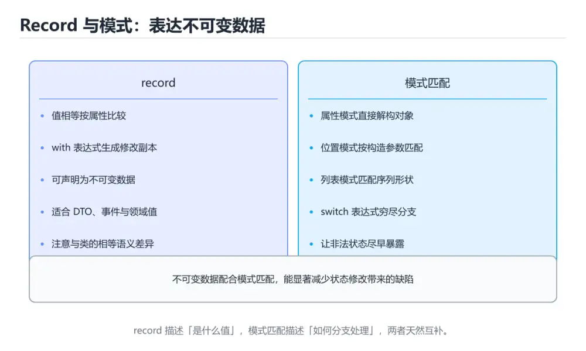

# C# Record、模式匹配与不可变数据

> 内容更新时间：2026-10-06 · 学习阶段：高级 · 预计用时：30 分钟




## 学习目标

- 能用自己的话解释：record 提供值相等和简洁语法，with 可创建修改部分属性的副本。
- 能用自己的话解释：模式匹配支持类型、属性、位置和关系模式，让分支表达更清晰。
- 能用自己的话解释：不可变数据减少共享修改，但要注意集合深层不可变与复制成本。
- 能把本课知识放回「C#」，并完成练习与测验。

## 前置知识

- 已完成「C#」的基础课程，能运行正文中的最小示例。
- 本课关键词：record、模式匹配、不可变、with。
- 遇到不熟悉的术语先记录问题，完成练习后再回读。

## 核心知识

### 1. record 提供值相等和简洁语法，with 可创建修改部分属性的副本。

- 关键做法：先用最小示例建立基线，再逐步加入边界、失败和性能条件。
- 验证标准：结果可复现、错误可解释、边界有测试、失败能恢复。

### 2. 模式匹配支持类型、属性、位置和关系模式，让分支表达更清晰。

把这条结论放回「C# Record、模式匹配与不可变数据」的完整流程里展开：

- 正文依据：能用自己的话解释：record 提供值相等和简洁语法，with 可创建修改部分属性的副本。
- 落地检查：把「2. 模式匹配支持类型、属性、位置和关系模式，让分支表达更清晰。」改写成一条可执行的核对项，逐条验证输入、超时与失败路径。

### 3. 不可变数据减少共享修改，但要注意集合深层不可变与复制成本。

把这条结论放回「C# Record、模式匹配与不可变数据」的完整流程里展开：

- 正文依据：能用自己的话解释：模式匹配支持类型、属性、位置和关系模式，让分支表达更清晰。
- 落地检查：把「3. 不可变数据减少共享修改，但要注意集合深层不可变与复制成本。」改写成一条可执行的核对项，逐条验证输入、超时与失败路径。

## 关键流程

```text
输入 → 校验 → 核心处理 → 验证 → 记录指标 → 失败恢复
```

## 实践路径

1. 用一句话复述本课要解决的问题。
2. 跑通正文中的最小示例并记录基线。
3. 只改变一个输入或参数，预测并验证结果。
4. 补一个失败路径，记录错误、恢复和指标。
5. 把结论写成可复现的笔记或测试。

## 常见错误与排查

| 误区 | 后果 | 修正 |
| --- | --- | --- |
| 只记术语不做实验 | 遇到真实问题无法判断 | 用最小输入跑通并记录结果 |
| 只测正常路径 | 边界和故障上线才暴露 | 补空值、极值和依赖失败 |
| 没有基线就优化 | 无法证明改进有效 | 先测量再修改 |
| 忽略成本与安全 | 性能和风险失控 | 同时记录资源、权限与失败代价 |
- **关于，下列说法正确的是？**：正确答案是「record 提供值相等和简洁语法，with 可创建修改部分属性的副本。
- **关于，下列说法正确的是？**：正确答案是「模式匹配支持类型、属性、位置和关系模式，让分支表达更清晰。
- **关于，下列说法正确的是？**：正确答案是「不可变数据减少共享修改，但要注意集合深层不可变与复制成本。
- **本课的核心学习目标是什么？**：正确答案是「用 record、with、模式匹配和不可变集合表达领域数据。

## 动手练习

1. 合上教程，用 3～5 句话解释C# Record、模式匹配与不可变数据。
2. 从正文选一个例子，改变一个条件并预测结果。
3. 设计一个失败场景，写出止损与恢复步骤。

**验收标准**：留下输入、命令、输出、差异和下一步问题。

## 本课小结

- 本课属于「C#」，核心关键词是 record、模式匹配、不可变、with。
- 先保证正确与可复现，再讨论性能和扩展。
- 完成练习和测验后，把仍然不确定的问题写成下一轮验证清单。

> 本课由 P1 内容扩展生成，重点补充原有课程缺失的主题与工程边界。

## 可运行练习

本节围绕C# Record、模式匹配与不可变数据安排 3 个可交付任务，每个任务都要求留下可以复查的记录。

### 任务 1：用自己的话画出结构

不看书，用一张图说清「C# Record、模式匹配与不可变数据」的结构，画完再对照骨架：

- 主干：核心知识 → 关键流程 → 实践路径 → 常见误区
- 连接线：在每条边上标出输入、输出与失败路径。
- 自检：能否用一句话说明record与模式匹配的关系？

### 任务 2：做一次对比实验

**验收标准**：表格里两个方案的结论不能完全一样；写下“在什么条件下应该换方案”。

### 任务 3：迁移到自己的场景

**验收标准**：至少有一个可复现的命令、代码片段或数据样例；结论能被别人独立检查。

## 故障现场

### 现场 1：本课的 record 常规用例通过，但边界用例失败

**症状**：在本课的练习或生产场景里出现“本课的 record 常规用例通过，但边界用例失败”。

**复现**：准备一组最小输入，只保留触发“本课的 record 常规用例通过，但边界用例失败”的必要条件，连续运行两次确认结果稳定。

**定位**：围绕“record 的前置条件与取值边界没有写进代码，默认值掩盖了空值和极值”检查调用链、输入数据和环境配置，先验证假设再改代码。

**预防**：把“本课的 record 常规用例通过，但边界用例失败”写成一条自动化用例，并在本课的验收清单里保留对应检查项。

### 现场 2：本课的 模式匹配 结果在两次运行之间不一致

**症状**：在本课的练习或生产场景里出现“本课的 模式匹配 结果在两次运行之间不一致”。

**复现**：准备一组最小输入，只保留触发“本课的 模式匹配 结果在两次运行之间不一致”的必要条件，连续运行两次确认结果稳定。

**定位**：围绕“模式匹配 依赖了当前版本、执行顺序或共享状态，单次运行无法暴露差异”检查调用链、输入数据和环境配置，先验证假设再改代码。

**预防**：把“本课的 模式匹配 结果在两次运行之间不一致”写成一条自动化用例，并在本课的验收清单里保留对应检查项。

### 现场 3：本课的验证只在开发机通过

**症状**：在本课的练习或生产场景里出现“本课的验证只在开发机通过”。

**定位**：围绕“环境版本、配置和输入规模与目标环境不同，record 缺少可重复的验证记录”检查调用链、输入数据和环境配置，先验证假设再改代码。

## 版本与时效

- .NET 10 是当前 LTS 主线，C# 版本随 SDK 一起演进
- 主构造函数、集合表达式、模式匹配与 AOT/裁剪是升级重点
- 升级前检查 NuGet 依赖、序列化行为与运行时标识
- 官方说明：https://learn.microsoft.com/dotnet/core/whats-new/

### 升级检查清单

- 先固定当前版本，跑通全部示例与测验，再升级工具链。
- 只改一个版本变量，记录编译、测试、性能与产物体积的变化。
- 重点回归默认值、弃用警告、序列化格式、并发语义和错误信息。
- 升级完成后更新本课的“最后复核 / 下次复核”日期与版本说明。

## 本课复习清单

离开本课前，逐项确认：

- [ ] 不看解析，能说出「关于，下列说法正确的是？」的判断依据。
- [ ] 不看解析，能说出「本课的核心学习目标是什么？」的判断依据。
- [ ] 至少运行一次本课示例，记录输入、输出和一个边界情况。
- [ ] 把本课最容易混淆的两个概念写成一句话对照。

| 复盘项 | 记录 |
| --- | --- |
| 已经能独立解释的考点 |  |
| 仍然说不清的概念 |  |
| 下一步验证动作 |  |

## 复习与自测

下面按正文顺序回顾每一节，并给出一个自检问题；说不清的地方回到原章节补课。

### 核心知识

自检：这一节与相邻主题的边界在哪里？

### 动手练习

自检：如果去掉这一节里的一个前提，结论会怎样变化？

### 最小可运行示例

```csharp
record Point(int X, int Y);

var point = new Point(2, 3);
var label = point switch
{
    (0, 0) => "origin",
    (_, 0) => "x-axis",
    _ => "plane",
};
Console.WriteLine($"{point} -> {label}");
```

自检：把这一节讲给没学过的人，最需要强调哪一点？

### 预期输出

```text
Point { X = 2, Y = 3 } -> plane
```

### 验证步骤

制造一次错误输入，记录错误信息与修复方式。

## 术语速查

| 术语 | 一句话说明 |
| --- | --- |
| `record` | 围绕“环境版本、配置和输入规模与目标环境不同，record 缺少可重复的验证记录”检查调用链、输入数据和环境配置，先验证假设再改代码。 |
| `模式匹配` | 围绕“模式匹配 依赖了当前版本、执行顺序或共享状态，单次运行无法暴露差异”检查调用链、输入数据和环境配置，先验证假设再改代码。 |
| `不可变` | 结合record、模式匹配、不可变、with，写出一个真实项目中的使用场景。 |
| `with` | Summary: Use records, with, pattern matching and immutable collections.。 |

## 深度拓展与实战

这一节把正文里的定义、代码和失败模式串成一条可操作的复习路线。

### 机制拆解

- **1. record 提供值相等和简洁语法，with 可创建修改部分属性的副本。**：在「C# Record、模式匹配与不可变数据」里，「1. record 提供值相等和简洁语法，with 可创建修改部分属性的副本。」这一步要先写清输入与预期，再记录实际结果和差异；结果不符时回到对应小节核对前提。
- **2. 模式匹配支持类型、属性、位置和关系模式，让分支表达更清晰。**：在「C# Record、模式匹配与不可变数据」里，「2. 模式匹配支持类型、属性、位置和关系模式，让分支表达更清晰。」这一步要先写清输入与预期，再记录实际结果和差异；结果不符时回到对应小节核对前提。
- **3. 不可变数据减少共享修改，但要注意集合深层不可变与复制成本。**：在「C# Record、模式匹配与不可变数据」里，「3. 不可变数据减少共享修改，但要注意集合深层不可变与复制成本。」这一步要先写清输入与预期，再记录实际结果和差异；结果不符时回到对应小节核对前提。
- **考点 1：关于，下列说法正确的是？**：针对「C# Record、模式匹配与不可变数据」，先自问「关于，下列说法正确的是」；作答后回到对应考点核对判断依据。
- **考点 2：关于，下列说法正确的是？**：针对「C# Record、模式匹配与不可变数据」，先自问「关于，下列说法正确的是」；作答后回到对应考点核对判断依据。

### 边界条件与常见反例

「C# Record、模式匹配与不可变数据」的边界不只包括最大最小值，还要覆盖空、重复和失败：

| 条件 | 常见反例 | 处理方式 |
| --- | --- | --- |
| 空输入 | record 没有任何取值 | 先判空，给出明确错误而不是继续执行 |
| 边界值 | 模式匹配 取最小或最大 | 用最小值、最大值和越界值各跑一次 |
| 重复执行 | 同一输入被执行两次 | 保证结果可重复，必要时加锁或去重 |
| 失败路径 | record 相关步骤报错 | 保留原始错误，确认回滚或重试行为 |

### 工程检查表

- [ ] 能否用自己的话说明C# Record、模式匹配与不可变数据解决什么问题，以及它不负责什么？
- [ ] 能否指出最小可运行示例的输入、输出和一条失败路径？
- [ ] 能否解释本课关键词在真实项目中的边界与取舍？
- [ ] 能否把本课方法迁移到另一个相近问题，并说明需要改什么？

### 迁移练习

1. 保持正文示例不变，写出它的输入、处理步骤和预期输出。
2. 只改变一个条件，预测结果并说明依据；再运行或手算验证。
3. 结合record、模式匹配、不可变、with，写出一个真实项目中的使用场景。
4. 写下一个反例，说明它在什么条件下会使朴素做法失效。

## 考点精讲

### 考点 1：概念判断·record

- **题目**：关于「record 提供值相等和简洁语法，with 可创建修改部分属性的副本。」，下列说法正确的是？
- **判断依据**：在「C# Record、模式匹配与不可变数据」里，record 提供值相等和简洁语法，with 可创建修改部分属性的副本。「C# Record、模式匹配与不可变数据」要求先交代record、模式匹配、不可变的前提再下结论，所以“record 提供值相等和简洁语法”只在题干“record 提供值相等和简洁语法”给定的条件下成立。

### 考点 2：概念判断·record

- **题目**：关于「模式匹配支持类型、属性、位置和关系模式，让分支表达更清晰。」，下列说法正确的是？
- **判断依据**：在「C# Record、模式匹配与不可变数据」里，模式匹配支持类型、属性、位置和关系模式，让分支表达更清晰。在「C# Record、模式匹配与不可变数据」里判断这道题，要把record、模式匹配、不可变的条件、过程与失败路径逐项对齐，换成“关于模式匹配支持类型、属性、位置和关”这个场景，只有满足前提的结论才成立。

### 考点 3：代码补全·record

- **题目**：下面这段 C# 代码摘自「C# Record、模式匹配与不可变数据」的正文示例。关于这段代码，下面哪一项说法与实际内容相符？
- **判断依据**：在「C# Record、模式匹配与不可变数据」里，这段代码包含条件分支，不同输入会走不同的执行路径。这段代码出自「C# Record、模式匹配与不可变数据」的正文示例，围绕record、模式匹配、不可变展开；把输入或边界换成空值、极值或失败情况后，结论要以「C# Record、模式匹配与不可变数据」的实际运行结果为准。

### 考点 4：概念判断·record

- **题目**：「C# Record、模式匹配与不可变数据」的核心学习目标是什么？
- **判断依据**：在「C# Record、模式匹配与不可变数据」里，结论应落在「用 record、with、模式匹配和不可变集合表达领域数据」。在「C# Record、模式匹配与不可变数据」里，结论应落在用 record、with、模式匹配和不可变集合表达领域数据。在「C# Record、模式匹配与不可变数据」里，这道题要求区分概念与边界，用 record、with、模式匹配和不可变集合表达领域数据。

### 考点 5：多选辨析·record

- **题目**：以下哪些术语与「C# Record、模式匹配与不可变数据」直接相关？（多选）
- **判断依据**：在「C# Record、模式匹配与不可变数据」里，record。这道题的关键在「C# Record、模式匹配与不可变数据」的record、模式匹配、不可变：先确认题干“以下哪些术语与C Record、模式”问的是哪一步，再排除偷换前提的选项。

### 考点 6：顺序排列·record

- **题目**：按照「C# Record、模式匹配与不可变数据」从概念到实践的讲解顺序排列下列主题。
- **判断依据**：结合record、模式匹配来看，正确的执行顺序是「核心知识 → 关键流程 → 实践路径 → 常见误区」。本课围绕用 record、with、模式匹配和不可变集合表达领域数据。在「C# Record、模式匹配与不可变数据」里判断这道题，要把record、模式匹配、不可变的条件、过程与失败路径逐项对齐，换成“按照C Record、模式匹配与不可”这个场景，只有满足前提的结论才成立。

## English Overview

**Title:** C# Records, Pattern Matching and Immutable Data

**Summary:** Use records, with, pattern matching and immutable collections.

**Category:** C#
**Level:** 高级
**Key terms:** record, 模式匹配, 不可变, with

## 内容元数据

- 内容版本：v2.0
- 最后更新：2026-10-06
- 学习阶段：高级
- 适用环境：.NET 9 / C# 13
- 内容来源：内置结构化课程与工程实践整理
- 相关主题：record、模式匹配、不可变、with
- 质量版本：P0 测验标准 + P1 覆盖扩展 + P2 体验补全

## 最小可运行示例

下面示例用于验证本课的最小输入、处理和输出。先原样运行，再只修改一个值：

```csharp
record Point(int X, int Y);

var point = new Point(2, 3);
var label = point switch
{
    (0, 0) => "origin",
    (_, 0) => "x-axis",
    _ => "plane",
};
Console.WriteLine($"{point} -> {label}");
```

## 预期输出

```text
Point { X = 2, Y = 3 } -> plane
```

## 验证步骤

1. 记录运行环境、命令和真实输出。
2. 修改一个输入，先写预测再运行。
4. 把结论写回本课笔记或测试用例。

## 参考资料与复核

- 最后复核：2026-10-04
- 下次复核：2027-04-04
- 复核范围：版本兼容、API 行为、安全建议与工程实践
- 来源性质：官方文档、标准或权威教材；正文为离线教学重组

| 参考资料 | 本课用途 |
| --- | --- |
| [C# 指南](https://learn.microsoft.com/dotnet/csharp/) | 语言语法与类型系统 |
| [Blazor 文档](https://learn.microsoft.com/aspnet/core/blazor/) | 组件、状态与交互 |
| [dotnet CLI](https://learn.microsoft.com/dotnet/core/tools/) | 构建、运行与发布命令 |

> 「C# Record、模式匹配与不可变数据」的链接用于离线阅读后的延伸核对；App 不会自动联网。

## 复习与迁移

复习目标：把「C# Record、模式匹配与不可变数据」的判断标准放回可复现的例子里。先自己作答，再对照依据；如果结论正确但理由不完整，回到正文补足前提。

### 概念复述

- 用一句话说明「C# Record、模式匹配与不可变数据」解决什么问题：用 record、with、模式匹配和不可变集合表达领域数据。
- 写出record、模式匹配、不可变之间的关系，并各举一个例子。
- 说出本课最容易混淆的两个概念，以及区分它们的判据。

### 正文逐节复核

- **实践任务**：本节围绕C# Record、模式匹配与不可变数据安排 3 个可交付任务，每个任务都要求留下可以复查的记录。

### 测验回顾

1. 关于「record 提供值相等和简洁语法，with 可创建修改部分属性的副本。」，下列说法正确的是？
   - 依据：在「C# Record、模式匹配与不可变数据」里，record 提供值相等和简洁语法，with 可创建修改部分属性的副本。「C# Record、模式匹配与不可变数据」要求先交代record、模式匹配、不可变的前提再下结论，所以“record 提供值相等和简洁语法”只在题干“record 提供值相等和简洁语法”给定的条件下成立。
2. 关于「模式匹配支持类型、属性、位置和关系模式，让分支表达更清晰。」，下列说法正确的是？
   - 依据：在「C# Record、模式匹配与不可变数据」里，模式匹配支持类型、属性、位置和关系模式，让分支表达更清晰。在「C# Record、模式匹配与不可变数据」里判断这道题，要把record、模式匹配、不可变的条件、过程与失败路径逐项对齐，换成“关于模式匹配支持类型、属性、位置和关”这个场景，只有满足前提的结论才成立。
3. 下面这段 C# 代码摘自「C# Record、模式匹配与不可变数据」的正文示例。关于这段代码，下面哪一项说法与实际内容相符？
   - 依据：在「C# Record、模式匹配与不可变数据」里，这段代码包含条件分支，不同输入会走不同的执行路径。这段代码出自「C# Record、模式匹配与不可变数据」的正文示例，围绕record、模式匹配、不可变展开；把输入或边界换成空值、极值或失败情况后，结论要以「C# Record、模式匹配与不可变数据」的实际运行结果为准。
4. 「C# Record、模式匹配与不可变数据」的核心学习目标是什么？
   - 依据：在「C# Record、模式匹配与不可变数据」里，结论应落在「用 record、with、模式匹配和不可变集合表达领域数据」。在「C# Record、模式匹配与不可变数据」里，结论应落在用 record、with、模式匹配和不可变集合表达领域数据。在「C# Record、模式匹配与不可变数据」里，这道题要求区分概念与边界，用 record、with、模式匹配和不可变集合表达领域数据。
5. 以下哪些术语与「C# Record、模式匹配与不可变数据」直接相关？（多选）
   - 依据：在「C# Record、模式匹配与不可变数据」里，record。这道题的关键在「C# Record、模式匹配与不可变数据」的record、模式匹配、不可变：先确认题干“以下哪些术语与C Record、模式”问的是哪一步，再排除偷换前提的选项。
6. 按照「C# Record、模式匹配与不可变数据」从概念到实践的讲解顺序排列下列主题。
   - 依据：结合record、模式匹配来看，正确的执行顺序是「核心知识 → 关键流程 → 实践路径 → 常见误区」。本课围绕用 record、with、模式匹配和不可变集合表达领域数据。在「C# Record、模式匹配与不可变数据」里判断这道题，要把record、模式匹配、不可变的条件、过程与失败路径逐项对齐，换成“按照C Record、模式匹配与不可”这个场景，只有满足前提的结论才成立。

### 迁移练习

把「C# Record、模式匹配与不可变数据」的结论迁移到相邻主题，每次迁移都写清预测与证据：

1. 换输入：用record处理一组你自己的数据，对比教材示例的结果差异。
2. 换失败条件：制造一个模式匹配相关的错误，说明如何从错误信息定位根因。
3. 换规模：把数据量或并发度提高一个数量级，说明「C# Record、模式匹配与不可变数据」的结论是否仍成立。
