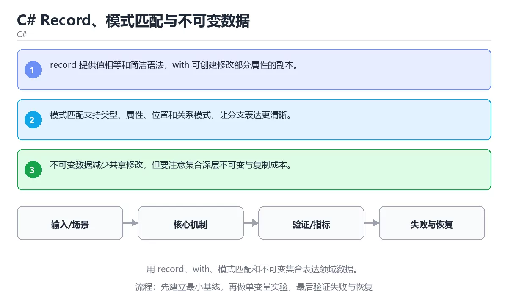

# C# Record、模式匹配与不可变数据



> 内容更新时间：2026-10-03 · 学习阶段：高级 · 预计用时：24 分钟

## 学习目标

- 能用自己的话解释：record 提供值相等和简洁语法，with 可创建修改部分属性的副本。
- 能用自己的话解释：模式匹配支持类型、属性、位置和关系模式，让分支表达更清晰。
- 能用自己的话解释：不可变数据减少共享修改，但要注意集合深层不可变与复制成本。
- 能把本课知识放回「C#」，并完成练习与测验。

## 前置知识

- 已完成「C#」的基础课程，能运行正文中的最小示例。
- 本课关键词：record、模式匹配、不可变、with。
- 遇到不熟悉的术语先记录问题，完成练习后再回读。

## 核心知识

### 1. record 提供值相等和简洁语法，with 可创建修改部分属性的副本。

- 它解决的问题：把「record 提供值相等和简洁语法，with 可创建修改部分属性的副本。」放回真实场景，说明不做它会带来什么后果。
- 关键做法：先用最小示例建立基线，再逐步加入边界、失败和性能条件。
- 验证标准：结果可复现、错误可解释、边界有测试、失败能恢复。

### 2. 模式匹配支持类型、属性、位置和关系模式，让分支表达更清晰。

- 它解决的问题：把「模式匹配支持类型、属性、位置和关系模式，让分支表达更清晰。」放回真实场景，说明不做它会带来什么后果。
- 关键做法：先用最小示例建立基线，再逐步加入边界、失败和性能条件。
- 验证标准：结果可复现、错误可解释、边界有测试、失败能恢复。

### 3. 不可变数据减少共享修改，但要注意集合深层不可变与复制成本。

- 它解决的问题：把「不可变数据减少共享修改，但要注意集合深层不可变与复制成本。」放回真实场景，说明不做它会带来什么后果。
- 关键做法：先用最小示例建立基线，再逐步加入边界、失败和性能条件。
- 验证标准：结果可复现、错误可解释、边界有测试、失败能恢复。

## 关键流程

```text
输入 → 校验 → 核心处理 → 验证 → 记录指标 → 失败恢复
```

## 实践路径

1. 用一句话复述本课要解决的问题。
2. 跑通正文中的最小示例并记录基线。
3. 只改变一个输入或参数，预测并验证结果。
4. 补一个失败路径，记录错误、恢复和指标。
5. 把结论写成可复现的笔记或测试。

## 常见误区

| 误区 | 后果 | 修正 |
| --- | --- | --- |
| 只记术语不做实验 | 遇到真实问题无法判断 | 用最小输入跑通并记录结果 |
| 只测正常路径 | 边界和故障上线才暴露 | 补空值、极值和依赖失败 |
| 没有基线就优化 | 无法证明改进有效 | 先测量再修改 |
| 忽略成本与安全 | 性能和风险失控 | 同时记录资源、权限与失败代价 |

## 动手练习

1. 合上教程，用 3～5 句话解释「C# Record、模式匹配与不可变数据」。
2. 从正文选一个例子，改变一个条件并预测结果。
3. 设计一个失败场景，写出止损与恢复步骤。

**验收标准**：留下输入、命令、输出、差异和下一步问题。

## 本课小结

- 本课属于「C#」，核心关键词是 record、模式匹配、不可变、with。
- 先保证正确与可复现，再讨论性能和扩展。
- 完成练习和测验后，把仍然不确定的问题写成下一轮验证清单。

> 本课由 P1 内容扩展生成，重点补充原有课程缺失的主题与工程边界。


## 考点精讲：把测验题还原成判断过程

本课有 5 个判断点。先自己作答，再看「判断依据」；如果结论正确但理由不完整，回到正文对应章节补足概念。

### 考点 1：关于「record 提供值相等和简洁语法 …」，下列说法正确的是？

- **正确判断**：record 提供值相等和简洁语法，with 可创建修改部分属性的副本。
- **判断依据**：正确答案是「record 提供值相等和简洁语法，with 可创建修改部分属性的副本。」，本课在「核心知识」中说明：它解决的问题：把不可变数据减少共享修改，但要注意集合深层不可变与复制成本。，本课在「核心知识」中说明：它解决的问题：把record 提供值相等和简洁语法，with 可创建修改部分属性的副本。，本课在「本课小结」中说明：本课属于「C#」，核心关键词是 record、模式匹配、不可变、with。
- **迁移检查**：遮住选项，只根据定义复述一次答案，再回来看哪个选项与复述一致。

### 考点 2：关于「模式匹配支持类型、属性、位置和关系模…」，下列说法正确的是？

- **正确判断**：模式匹配支持类型、属性、位置和关系模式，让分支表达更清晰。
- **判断依据**：正确答案是「模式匹配支持类型、属性、位置和关系模式，让分支表达更清晰。」，本课在「核心知识」中说明：它解决的问题：把不可变数据减少共享修改，但要注意集合深层不可变与复制成本。，本课在「核心知识」中说明：它解决的问题：把模式匹配支持类型、属性、位置和关系模式，让分支表达更清晰。，本课在「本课小结」中说明：本课属于「C#」，核心关键词是 record、模式匹配、不可变、with。
- **迁移检查**：如果给某个错误选项去掉一个限定词，它会不会变成正确？说明理由。

### 考点 3：关于「不可变数据减少共享修改 但要注意集合…」，下列说法正确的是？

- **正确判断**：不可变数据减少共享修改，但要注意集合深层不可变与复制成本。
- **判断依据**：正确答案是「不可变数据减少共享修改，但要注意集合深层不可变与复制成本。」，本课在「本课小结」中说明：本课属于「C#」，核心关键词是 record、模式匹配、不可变、with。，本课在核心知识中说明：它解决的问题：把record 提供值相等和简洁语法，with 可创建修改部分属性的副本。本课还在「核心知识」中说明：它解决的问题：把模式匹配支持类型、属性、位置和关系模式，让分支表达更清晰。
- **迁移检查**：如果给某个错误选项去掉一个限定词，它会不会变成正确？说明理由。

### 考点 4：「C# Record、模式匹配与不可变数据」的核心学习目标是什么？

- **正确判断**：用 record、with、模式匹配和不可变集合表达领域数据。
- **判断依据**：正确答案是「用 record、with、模式匹配和不可变集合表达领域数据。」，本课在「本课小结」中说明：本课属于「C#」，核心关键词是 record、模式匹配、不可变、with。本课还在核心知识中说明：它解决的问题：把模式匹配支持类型、属性、位置和关系模式，让分支表达更清晰。本课还在「核心知识」中说明：它解决的问题：把record 提供值相等和简洁语法，with 可创建修改部分属性的副本。
- **迁移检查**：遮住选项，只根据定义复述一次答案，再回来看哪个选项与复述一致。

### 考点 5：以下哪些术语与「C# Record、模式匹配与不可变数据」直接相关？（多选）

- **正确判断**：record、模式匹配
- **判断依据**：正确答案是「record、模式匹配」，本课在「核心知识」中说明：它解决的问题：把模式匹配支持类型、属性、位置和关系模式，让分支表达更清晰。本课还在「核心知识」中说明：它解决的问题：把record 提供值相等和简洁语法，with 可创建修改部分属性的副本。
- **迁移检查**：把其中一个正确项换成它的反例，判断结论会怎样变化。

## 本课复习清单

离开本课前，逐项确认：

- [ ] 不看解析，能说出「关于「record 提供值相等和简洁语法 …」，下列说法正确的是？」的判断依据。
- [ ] 不看解析，能说出「关于「模式匹配支持类型、属性、位置和关系模…」，下列说法正确的是？」的判断依据。
- [ ] 不看解析，能说出「关于「不可变数据减少共享修改 但要注意集合…」，下列说法正确的是？」的判断依据。
- [ ] 不看解析，能说出「「C# Record、模式匹配与不可变数据」的核心学习目标是什么？」的判断依据。
- [ ] 不看解析，能说出「以下哪些术语与「C# Record、模式匹配与不可变数据」直接相关？（多选）」的判断依据。
- [ ] 至少运行一次本课示例，记录输入、输出和一个边界情况。
- [ ] 把本课最容易混淆的两个概念写成一句话对照。

| 复盘项 | 记录 |
| --- | --- |
| 已经能独立解释的考点 |  |
| 仍然说不清的概念 |  |
| 下一步验证动作 |  |

## 逐节复习与自检

下面按正文顺序回顾每一节，并给出一个自检问题；说不清的地方回到原章节补课。

### 核心知识

」放回真实场景，说明不做它会带来什么后果。关键做法：先用最小示例建立基线，再逐步加入边界、失败和性能条件。

自检：这一节与相邻主题的边界在哪里？

### 动手练习

合上教程，用 3～5 句话解释「C# Record、模式匹配与不可变数据」。从正文选一个例子，改变一个条件并预测结果。

自检：如果去掉这一节里的一个前提，结论会怎样变化？

### 最小可运行示例

```csharp
record Point(int X, int Y);

var point = new Point(2, 3);
var label = point switch
{
    (0, 0) => "origin",
    (_, 0) => "x-axis",
    _ => "plane",
};
Console.WriteLine($"{point} -> {label}");
```

自检：把这一节讲给没学过的人，最需要强调哪一点？

### 预期输出

```text
Point { X = 2, Y = 3 } -> plane
```

自检：这一节与相邻主题的边界在哪里？

### 验证步骤

制造一次错误输入，记录错误信息与修复方式。

自检：如果去掉这一节里的一个前提，结论会怎样变化？

## 易错点回顾

下面把本课最容易判断错的地方集中成一张清单，复习时先自己回答，再对照解析补全理由。

- **关于「record 提供值相等和简洁语法 …」，下列说法正确的是？**：正确答案是「record 提供值相等和简洁语法，with 可创建修改部分属性的副本。
- **关于「模式匹配支持类型、属性、位置和关系模…」，下列说法正确的是？**：正确答案是「模式匹配支持类型、属性、位置和关系模式，让分支表达更清晰。
- **关于「不可变数据减少共享修改 但要注意集合…」，下列说法正确的是？**：正确答案是「不可变数据减少共享修改，但要注意集合深层不可变与复制成本。
- **「C# Record、模式匹配与不可变数据」的核心学习目标是什么？**：正确答案是「用 record、with、模式匹配和不可变集合表达领域数据。
- **以下哪些术语与「C# Record、模式匹配与不可变数据」直接相关？（多…**：正确答案是「record、模式匹配」，本课在「核心知识」中说明：它解决的问题：把模式匹配支持类型、属性、位置和关系模式，让分支表达更清晰。

## English Overview

**Title:** C# Records, Pattern Matching and Immutable Data

**Summary:** Use records, with, pattern matching and immutable collections.

**Category:** C#  
**Level:** 高级  
**Key terms:** record, 模式匹配, 不可变, with

> The full tutorial is written in Chinese. This bilingual overview helps English readers identify the topic, scope and key terms before studying the detailed examples.

## 内容元数据

- 内容版本：v2.0
- 最后更新：2026-10-03
- 学习阶段：高级
- 适用环境：.NET 9 / C# 13
- 内容来源：内置结构化课程与工程实践整理
- 相关主题：record、模式匹配、不可变、with
- 质量版本：P0 测验标准 + P1 覆盖扩展 + P2 体验补全


## 最小可运行示例

下面示例用于验证「C# Record、模式匹配与不可变数据」的最小输入、处理和输出。先原样运行，再只修改一个值：

```csharp
record Point(int X, int Y);

var point = new Point(2, 3);
var label = point switch
{
    (0, 0) => "origin",
    (_, 0) => "x-axis",
    _ => "plane",
};
Console.WriteLine($"{point} -> {label}");
```

## 预期输出

```text
Point { X = 2, Y = 3 } -> plane
```

## 验证步骤

1. 记录运行环境、命令和真实输出。
2. 修改一个输入，先写预测再运行。
3. 制造一次错误输入，记录错误信息与修复方式。
4. 把结论写回本课笔记或测试用例。


## 参考资料与复核

- 最后复核：2026-10-04
- 下次复核：2027-04-04
- 复核范围：版本兼容、API 行为、安全建议与工程实践
- 来源性质：官方文档与标准；本课正文为离线教学重组，不复制原文

| 参考资料 | 本课用途 |
| --- | --- |
| [C# 官方指南](https://learn.microsoft.com/dotnet/csharp/) | 语言、异步与模式匹配 |
| [.NET 文档](https://learn.microsoft.com/dotnet/) | 运行时、GC 与发布 |

> 本课主题：用 record、with、模式匹配和不可变集合表达领域数据。

> App 完全离线展示文字链接，不会自动联网；需要延伸阅读时可复制链接到浏览器。

