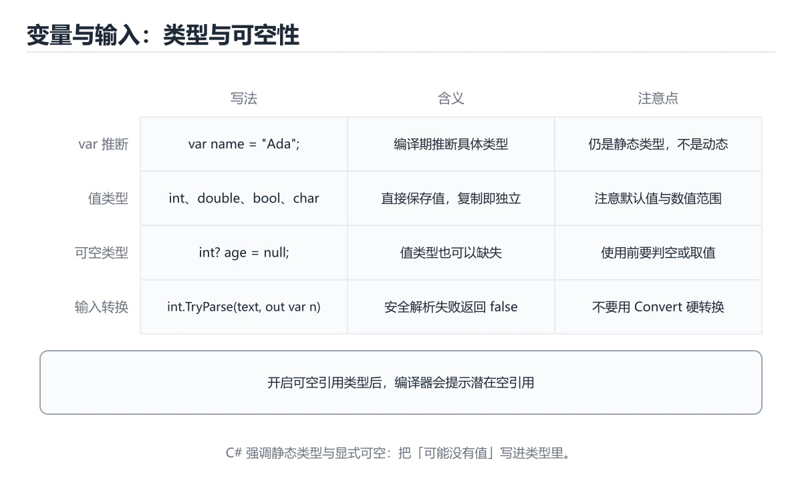
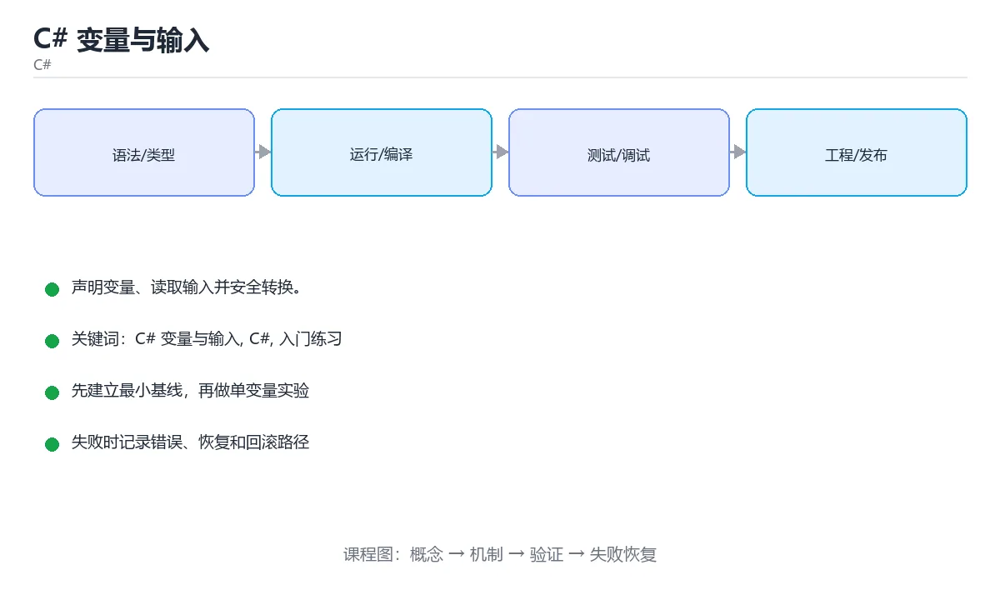

# C# 变量与输入

> 内容更新时间：2026-10-03





## 学习目标

- 先认识C# 变量与输入需要的工具、输入和输出。
- 按步骤运行最小示例，并记录结果与错误。
- 用一个边界输入验证自己是否真正掌握。

## 前置知识

- 会进行基本的文件或命令行操作。
- 不需要预先掌握「C#」的高级知识。

## 一句话入门

声明变量、读取输入并安全转换。

## 最小示例

```csharp
var name = "Ada";
int year = 1815;
Console.WriteLine($"{name} born in {year}");
```

## 预期输出

```text
Ada born in 1815
```

## 常见错误

- 输入转换失败没有处理，运行时抛出 FormatException。
- 复制命令时遗漏空格、引号或必要参数。

## 动手练习

1. 原样运行最小示例，保存命令和输出。
2. 把数字 2 改成 10，预测并验证新结果。
3. 制造一个错误输入，写出错误信息和修复方法。

## 本课小结

- 入门阶段先保证能运行、能观察、能解释，再追求复杂功能。
- 每次只改一个变量，记录预测与实际结果。
- 遇到错误先看第一条错误信息，再回到最小示例。

## 代码实验：把示例跑成证据

### 实验一：建立基线

```csharp
var name = "Ada";
int year = 1815;
Console.WriteLine($"{name} born in {year}");
```

### 实验二：只改一个输入

### 实验三：制造一个可控错误

把变量声明成不兼容的类型，或者删除一个必要的分号。记录编译器给出的类型错误与位置，修复后确认输出没有变化。

| 实验 | 改动 | 预测 | 实际 | 结论 |
| --- | --- | --- | --- | --- |
| 基线 | 保持原样 |  |  |  |
| 边界 |  |  |  |  |
| 失败 |  |  |  |  |

### 实验四：用三句话复述

1. 输入是什么，哪些输入属于合法范围，哪些属于边界或非法范围？
2. 程序按什么顺序处理输入，在哪一步产生了状态变化或副作用？
3. 输出如何验证，失败时第一条可观察证据是什么？

## C# 与 .NET 基础机制速览

### 编译、CLR 与程序集

C# 代码先编译成中间语言和元数据，运行时由 CLR 通过即时编译或提前编译转换为机器码。程序集是部署和版本控制的基本单位，包含类型、方法和资源。命名空间只负责组织名字，不决定物理文件位置。`dotnet new` 创建项目，`dotnet build` 编译，`dotnet run` 运行，`dotnet test` 执行测试，理解工具链能快速定位“编译失败”和“运行失败”。

### 类型、值与引用

C# 类型分为值类型和引用类型。结构体、枚举和大多数基元类型是值类型，赋值时复制内容；类、数组、委托和字符串是引用类型，赋值时复制引用。装箱把值类型转成对象，拆箱再转回来，频繁发生会增加分配和复制成本。`var` 只是让编译器推断类型，不会变成动态类型；`dynamic` 才把类型检查推迟到运行时。

### 方法、重载与参数

方法可以有重载、可选参数、命名参数、`params` 可变参数和扩展方法。重载根据参数列表选择，返回类型不参与。`ref`、`out`、`in` 控制参数的传递方式：`ref` 可读可写，`out` 必须在方法内赋值，`in` 只读引用。局部函数和 lambda 可以捕获外部变量，但要注意闭包生命周期和循环变量捕获。异步方法返回 `Task` 或 `Task<T>`，调用方通常使用 `await`。

### 集合、LINQ 与可空性

`List<T>`、`Dictionary<TKey,TValue>`、`HashSet<T>` 是最常用的泛型集合。LINQ 提供筛选、投影、分组、连接和聚合，延迟执行意味着查询只有在枚举时才真正运行；重复枚举可能重复计算或看到数据变化。可空引用类型在编译期提示可能的 null，公共方法仍要校验参数，边界层要把外部数据转换成有效对象。

### 资源管理与并发

实现 `IDisposable` 的对象应使用 `using` 或 `await using` 及时释放文件句柄、连接和锁。异常只用于异常情况，不要用异常处理正常分支。异步代码不要阻塞等待 `.Result` 或 `.Wait()`，否则可能造成线程池饥饿和死锁。并发集合、`lock`、`SemaphoreSlim` 和 `Channel` 各有适用场景，选择时要看清读写比例、公平性和取消需求。

## 本课自测清单与错误对照

本课测验以直接定义和步骤判断为主。请把每个错误选项改写成一句反例，
说明它在哪个输入、边界或前提变化下会失败。

### 完成标准

- [ ] 能用具体输入复现最小示例，并逐行解释输入、处理与输出。
- [ ] 能只改一个值完成边界实验，并让预测与实际结果一致。
- [ ] 能制造一个可控错误，读出第一条错误信息并完成修复。
- [ ] 能不看书说出本课至少两个易错点和对应的验证方法。

### 复盘记录

| 项目 | 记录 |
| --- | --- |
| 学到的核心机制 |  |
| 仍然不确定的问题 |  |
| 下一步验证动作 |  |

## 实践任务

本节围绕C# 变量与输入安排 3 个可交付任务，每个任务都要求留下可以复查的记录。

### 任务 1：用自己的话画出结构

### 任务 2：做一次对比实验

**验收标准**：表格里两个方案的结论不能完全一样；写下“在什么条件下应该换方案”。

### 任务 3：迁移到自己的场景

**验收标准**：至少有一个可复现的命令、代码片段或数据样例；结论能被别人独立检查。

## 故障现场

### 现场 1：本课的 C# 变量与输入 常规用例通过，但边界用例失败

### 现场 2：本课的 C# 结果在两次运行之间不一致

**症状**：在本课的练习或生产场景里出现“本课的 C# 结果在两次运行之间不一致”。

**复现**：准备一组最小输入，只保留触发“本课的 C# 结果在两次运行之间不一致”的必要条件，连续运行两次确认结果稳定。

**定位**：围绕“C# 依赖了当前版本、执行顺序或共享状态，单次运行无法暴露差异”检查调用链、输入数据和环境配置，先验证假设再改代码。

**预防**：把“本课的 C# 结果在两次运行之间不一致”写成一条自动化用例，并在本课的验收清单里保留对应检查项。

### 现场 3：本课的验证只在开发机通过

**症状**：在本课的练习或生产场景里出现“本课的验证只在开发机通过”。

## 版本与时效

- .NET 10 是当前 LTS 主线，C# 版本随 SDK 一起演进
- 主构造函数、集合表达式、模式匹配与 AOT/裁剪是升级重点
- 升级前检查 NuGet 依赖、序列化行为与运行时标识
- 官方说明：https://learn.microsoft.com/dotnet/core/whats-new/

### 升级检查清单

- 先固定当前版本，跑通全部示例与测验，再升级工具链。
- 只改一个版本变量，记录编译、测试、性能与产物体积的变化。
- 重点回归默认值、弃用警告、序列化格式、并发语义和错误信息。
- 升级完成后更新本课的“最后复核 / 下次复核”日期与版本说明。

## 本课复习清单

离开本课前，逐项确认：

- [ ] 不看解析，能说出「用 var 声明变量时，类型是如何确定的？」的判断依据。
- [ ] 不看解析，能说出「把用户输入的文本转换成整数，较安全的做法是？」的判断依据。
- [ ] 不看解析，能说出「字符串插值 $"{name} born in {year}" 的特点是？」的判断依据。
- [ ] 不看解析，能说出「补全代码：Console.____() 从控制台读取一行文本。」的判断依据。
- [ ] 至少运行一次本课示例，记录输入、输出和一个边界情况。
- [ ] 把本课最容易混淆的两个概念写成一句话对照。

| 复盘项 | 记录 |
| --- | --- |
| 已经能独立解释的考点 |  |
| 仍然说不清的概念 |  |
| 下一步验证动作 |  |

## 逐节复习与自检

下面按正文顺序回顾每一节，并给出一个自检问题；说不清的地方回到原章节补课。

### 最小示例

```csharp
var name = "Ada";
int year = 1815;
Console.WriteLine($"{name} born in {year}");
```

自检：这一节与相邻主题的边界在哪里？

### 预期输出

```text
Ada born in 1815
```

### 常见错误

自检：把这一节讲给没学过的人，最需要强调哪一点？

### 动手练习

自检：如果去掉这一节里的一个前提，结论会怎样变化？

## 术语速查

把「C# 变量与输入」里反复出现的术语集中放在一起。复习时先遮住右列，尝试用自己的话解释，再回到正文核对。

| 术语 | 本课语境 |
| --- | --- |
| `[C# 变量与输入, C#, 入门练习][index]` | 在「C# 变量与输入」里理解它的定义、输入和输出。 |
| `[C# 变量与输入, C#, 入门练习][index]` | 本课用它说明边界条件与失败路径。 |
| `[C# 变量与输入, C#, 入门练习][index]` | 结合「C# 变量与输入」的正文示例确认它的适用条件。 |

## 零基础精讲：把C# 变量与输入真正讲透

### 先建立一个直觉

本课的摘要可以当作一张地图：声明变量、读取输入并安全转换。

### 逐步拆解

2. 描述处理过程。把「C# 变量与输入、C#、入门练习」映射到具体步骤，每步都要求能单独验证。
3. 定义输出。输出不仅包括正常结果，还包括错误码、日志、指标和资源释放状态。
4. 找出一条失败路径。让错误尽早暴露，并说明重试、降级、回滚或人工处理的边界。
5. 用一个小例子贯穿全过程。先手算或预测结果，再运行代码或实验，最后解释差异。

### 把正文串成一条执行链

- **实验一：建立基线**：先原样运行上面的代码，记录命令、完整输出和退出状态
- **实验三：制造一个可控错误**：实验三：制造一个可控错误
- **编译、CLR 与程序集**：C# 代码先编译成中间语言和元数据，运行时由 CLR 通过即时编译或提前编译转换为机器码
- **类型、值与引用**：C# 类型分为值类型和引用类型

### 从测验反推易错点

**检查点 1：用 var 声明变量时，类型是如何确定的？**

- 参考判断：编译器根据初始化表达式推断类型，之后不再改变
- 解析：正确答案是「编译器根据初始化表达式推断类型，之后不再改变」，这道题在问用var声明变量时，类型是如何确定的，判断时要把题干限定的输入、边界与目标逐项对齐。var 只是让编译器推断静态类型，例如 var name = "Ada" 推断为 string，之后不能再赋值为整数。
- 自问：如果去掉题干里的一个限定词，结论还成立吗？

**检查点 2：把用户输入的文本转换成整数，较安全的做法是？**

- 参考判断：使用 int.TryParse，并检查返回值判断是否成功
- 解析：正确答案是「使用 int.TryParse，并检查返回值判断是否成功」，这道题在问把用户输入的文本转换成整数，较安全的做法是，判断时要把题干限定的输入、边界与目标逐项对齐。int.TryParse 在转换失败时返回 false 而不抛异常，适合处理不可信的用户输入。

**检查点 3：字符串插值 $"{name} born in {year}" 的特点是？**

- 参考判断：在字符串中直接嵌入表达式，运行时求值并格式化
- 解析：正确答案是「在字符串中直接嵌入表达式，运行时求值并格式化」，这道题在问字符串插值$"{name}bornin{year}"的特点是，判断时要把题干限定的输入、边界与目标逐项对齐。前缀 $ 的插值字符串允许在花括号里写变量或表达式，编译器会生成相应的格式化代码，数字等类型会自动调用其格式化逻辑。

**检查点 4：补全代码：Console.____() 从控制台读取一行文本。**

- 参考判断：ReadLine

**检查点 5：阅读本课的代码片段，下面哪项判断是正确的？**

- 解析：正确答案是「编译器根据初始化表达式推断类型，之后不再改变」。这段代码来自本课的示例，判断时先看输入与输出，再检查条件、循环和边界。正确答案是「编译器根据初始化表达式推断类型，之后不再改变」，这道题在问用var声明变量时，类型是如何确定的，判断时要把题干限定的输入、边界与目标逐项对齐。var 只是让编译器推断静态类型，例如 在本课中，如果只改一个条件，输出通常会随之改变，因此不能脱离代码前提作答。

### 工程排错顺序

| 先查什么 | 要得到的证据 | 判断标准 |
| --- | --- | --- |
| 输入与前提是否满足 | 日志、输入样例、测试或指标 | 能复现并解释，才算定位 |
| 核心步骤是否产生了预期中间结果 | 日志、输入样例、测试或指标 | 能复现并解释，才算定位 |
| 失败路径是否可观测、可恢复 | 日志、输入样例、测试或指标 | 能复现并解释，才算定位 |
| 资源、权限与成本是否在预算内 | 日志、输入样例、测试或指标 | 能复现并解释，才算定位 |

### 变式训练

1. 把它放进一个只有单机、没有额外依赖的小项目，先保证正确，再考虑扩展。
2. 把输入规模扩大十倍，记录时间、内存和失败路径，找出第一个真正瓶颈。
3. 制造一次依赖超时或错误输入，要求系统给出可解释错误并且不留下半完成状态。
5. 删掉一个看似必要的步骤，观察哪个测试或指标先失败，用证据说明它为什么必要。
6. 把方案切换到低资源设备，重新评估默认参数、超时和降级策略。

### 本课自测

- [ ] 能用一句话解释C# 变量与输入在本课中的角色与边界。
- [ ] 能举出一个正常例子和一个失败例子。
- [ ] 能说出最小验证步骤，以及需要记录的证据。
- [ ] 能用一句话解释「C#」在本课中的角色与边界。
- [ ] 能用一句话解释「入门练习」在本课中的角色与边界。

### 迁移案例库

下面用不同约束重复同一套方法。每完成一轮，都把结论写进笔记，并只改变一个变量。

#### 迁移案例 1：围绕C# 变量与输入做一次小实验

**目标**：在不改变课程主体的前提下，验证C# 变量与输入中的一个关键判断。

**步骤**：
1. 复述当前方案对本课的假设，写成一句可证伪的话。
2. 设计一个正常输入和一个边界输入，分别预测输出。
3. 运行或逐步演算，记录实际输出、耗时和失败信息。
4. 只调整一个参数，比较前后差异并解释原因。
5. 补充一条测试或复习卡，确保下次能更快复现。

**验收**：结论有证据、差异可解释、失败可恢复；如果做不到，说明还需要缩小问题范围。

#### 迁移案例 2：围绕「C#」做一次小实验

**步骤**：
1. 复述当前方案对「C#」的假设，写成一句可证伪的话。

#### 迁移案例 3：围绕「入门练习」做一次小实验

**步骤**：
1. 复述当前方案对「入门练习」的假设，写成一句可证伪的话。

#### 迁移案例 4：围绕C# 变量与输入做一次小实验

**步骤**：

#### 迁移案例 5：围绕「C#」做一次小实验

**步骤**：

#### 迁移案例 6：围绕「入门练习」做一次小实验

**步骤**：

#### 迁移案例 7：围绕C# 变量与输入做一次小实验

**步骤**：

#### 迁移案例 8：围绕「C#」做一次小实验

**步骤**：

#### 迁移案例 9：围绕「入门练习」做一次小实验

**步骤**：

#### 迁移案例 10：围绕C# 变量与输入做一次小实验

**步骤**：

#### 迁移案例 11：围绕「C#」做一次小实验

**步骤**：

#### 迁移案例 12：围绕「入门练习」做一次小实验

**步骤**：

#### 迁移案例 13：围绕C# 变量与输入做一次小实验

**步骤**：

#### 迁移案例 14：围绕「C#」做一次小实验

**步骤**：

#### 迁移案例 15：围绕「入门练习」做一次小实验

**步骤**：

#### 迁移案例 16：围绕C# 变量与输入做一次小实验

**步骤**：

<!-- p0-depth-v2:end -->

## 考点精讲

### 考点 1：围绕“C# 变量与输入”中的 C# 变量与输入、C#、入门练习，下列哪两项是本课强调的实践判断？

- **判断依据**：在「C# 变量与输入」里，学习 C# 变量与输入 时要同时说明输入、输出和失败路径，不能只看正常流程；在「C# 变量与输入」里，验证 C# 时要固定版本并覆盖边界输入，结论才可复现。「C# 变量与输入」要求先交代C# 变量与输入、C#、入门练习的前提再下结论，所以“学习 C# 变量与输入 时要同时说明输入”只在题干“围绕C 变量与输入中的 C 变量与输入、C、入门练习”给定的条件下成立。

### 考点 2：把用户输入的文本转换成整数，较安全的做法是？

- **判断依据**：在「C# 变量与输入」里，使用 int.TryParse，并检查返回值判断是否成功。int.TryParse 在转换失败时返回 false 而不抛异常，适合处理不可信的用户输入。这道题的关键在「C# 变量与输入」的C# 变量与输入、C#、入门练习：先确认题干“把用户输入的文本转换成整数”问的是哪一步，再排除偷换前提的选项。

### 考点 3：字符串插值 $"{name} born in {year}" 的特点是？

- **判断依据**：在「C# 变量与输入」里，在字符串中直接嵌入表达式，运行时求值并格式化。前缀 $ 的插值字符串允许在花括号里写变量或表达式，编译器会生成相应的格式化代码，数字等类型会自动调用其格式化逻辑。「C# 变量与输入」要求先交代C# 变量与输入、C#、入门练习的前提再下结论，所以“在字符串中直接嵌入表达式”只在题干“字符串插值 $"{name} born in {year}"”给定的条件下成立。

### 考点 4：补全代码：Console.____ 从控制台读取一行文本。

- **判断依据**：C# 的 Console.ReadLine 会读取用户输入的一整行并返回 string。如果输入流已经结束则可能返回 null，因此可空类型和空值检查很重要。这道题要求区分概念与边界，「ReadLine」只有在题干给出的前提下才成立，而缺少同一组条件。这道题的关键在「C# 变量与输入」的C# 变量与输入、C#、入门练习：先确认题干“补全代码”问的是哪一步，再排除偷换前提的选项。

### 考点 5：阅读「C# 变量与输入」的代码片段，下面哪项判断是正确的？

- **判断依据**：在「C# 变量与输入」里，编译器根据初始化表达式推断类型，之后不再改变。回到「C# 变量与输入」的正文示例，用“阅读C 变量与输入的代码片段”走一遍C# 变量与输入、C#、入门练习的完整流程，能复现的结论才可以保留。回到「C# 变量与输入」的正文示例，用“变量与输入的代码片段”走一遍C# 变量与输入、C#、入门练习的完整流程，能复现的结论才可以保留。

## English Overview

**Title:** C# Variables and Input

**Summary:** Declare variables, read input and convert safely.

**Category:** C#
**Level:** 入门
**Key terms:** C# 变量与输入, C#, 入门练习

## 内容元数据

- 内容版本：v2.0
- 最后更新：2026-10-03
- 学习阶段：入门
- 适用环境：.NET 9 / C# 13
- 内容来源：内置结构化课程与工程实践整理
- 相关主题：C# 变量与输入、C#、入门练习
- 质量版本：P0 测验标准 + P1 覆盖扩展 + P2 体验补全

## 参考资料与复核

- 最后复核：2026-10-04
- 下次复核：2027-04-04
- 复核范围：版本兼容、API 行为、安全建议与工程实践
- 来源性质：官方文档、标准或权威教材；正文为离线教学重组

| 参考资料 | 本课用途 |
| --- | --- |
| [C# 指南](https://learn.microsoft.com/dotnet/csharp/) | 语言语法与类型系统 |
| [.NET 测试文档](https://learn.microsoft.com/dotnet/core/testing/) | 单元测试与集成测试 |
| [ASP.NET Core 文档](https://learn.microsoft.com/aspnet/core/) | Web API 与中间件 |

> 「C# 变量与输入」的链接用于离线阅读后的延伸核对；App 不会自动联网。

## 复习与迁移

复习目标：把「C# 变量与输入」的判断标准放回可复现的例子里。先自己作答，再对照依据；如果结论正确但理由不完整，回到正文补足前提。

### 概念复述

- 用一句话说明「C# 变量与输入」解决什么问题：声明变量、读取输入并安全转换。
- 写出C# 变量与输入、C#、入门练习之间的关系，并各举一个例子。
- 说出本课最容易混淆的两个概念，以及区分它们的判据。

### 正文逐节复核

- **C# 与 .NET 基础机制速览**：C# 代码先编译成中间语言和元数据，运行时由 CLR 通过即时编译或提前编译转换为机器码。
- **实践任务**：本节围绕C# 变量与输入安排 3 个可交付任务，每个任务都要求留下可以复查的记录。

### 测验回顾

1. 围绕“C# 变量与输入”中的 C# 变量与输入、C#、入门练习，下列哪两项是本课强调的实践判断？
   - 依据：在「C# 变量与输入」里，学习 C# 变量与输入 时要同时说明输入、输出和失败路径，不能只看正常流程；在「C# 变量与输入」里，验证 C# 时要固定版本并覆盖边界输入，结论才可复现。「C# 变量与输入」要求先交代C# 变量与输入、C#、入门练习的前提再下结论，所以“学习 C# 变量与输入 时要同时说明输入”只在题干“围绕C 变量与输入中的 C 变量与输入、C、入门练习”给定的条件下成立。
2. 把用户输入的文本转换成整数，较安全的做法是？
   - 依据：在「C# 变量与输入」里，使用 int.TryParse，并检查返回值判断是否成功。int.TryParse 在转换失败时返回 false 而不抛异常，适合处理不可信的用户输入。这道题的关键在「C# 变量与输入」的C# 变量与输入、C#、入门练习：先确认题干“把用户输入的文本转换成整数”问的是哪一步，再排除偷换前提的选项。
3. 字符串插值 $"{name} born in {year}" 的特点是？
   - 依据：在「C# 变量与输入」里，在字符串中直接嵌入表达式，运行时求值并格式化。前缀 $ 的插值字符串允许在花括号里写变量或表达式，编译器会生成相应的格式化代码，数字等类型会自动调用其格式化逻辑。「C# 变量与输入」要求先交代C# 变量与输入、C#、入门练习的前提再下结论，所以“在字符串中直接嵌入表达式”只在题干“字符串插值 $"{name} born in {year}"”给定的条件下成立。
4. 补全代码：Console.____ 从控制台读取一行文本。
   - 依据：C# 的 Console.ReadLine 会读取用户输入的一整行并返回 string。如果输入流已经结束则可能返回 null，因此可空类型和空值检查很重要。这道题要求区分概念与边界，「ReadLine」只有在题干给出的前提下才成立，而缺少同一组条件。这道题的关键在「C# 变量与输入」的C# 变量与输入、C#、入门练习：先确认题干“补全代码”问的是哪一步，再排除偷换前提的选项。
5. 阅读「C# 变量与输入」的代码片段，下面哪项判断是正确的？
   - 依据：在「C# 变量与输入」里，编译器根据初始化表达式推断类型，之后不再改变。回到「C# 变量与输入」的正文示例，用“阅读C 变量与输入的代码片段”走一遍C# 变量与输入、C#、入门练习的完整流程，能复现的结论才可以保留。回到「C# 变量与输入」的正文示例，用“变量与输入的代码片段”走一遍C# 变量与输入、C#、入门练习的完整流程，能复现的结论才可以保留。

### 迁移练习
