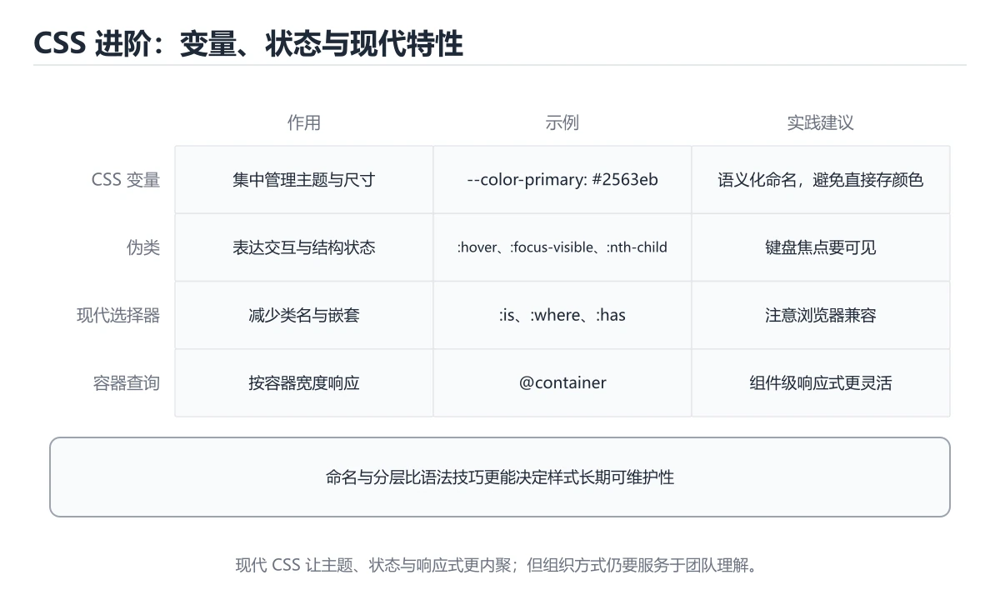
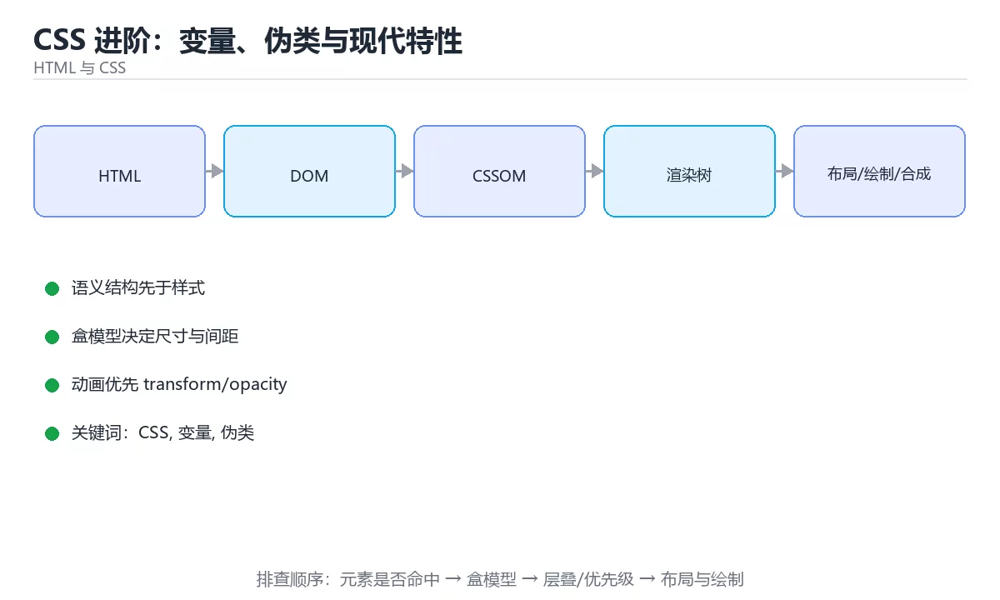

# CSS 进阶：变量、伪类与现代特性





> 内容更新时间：2026-10-03 · 学习阶段：进阶 · 预计用时：15 分钟

## 学习目标

- 能用自己的话解释「CSS 进阶：变量、伪类与现代特性」解决了什么问题，而不是只背术语。
- 能说清 「CSS」、「变量」、「伪类」、「嵌套」 之间的关系，并分别举出一个例子。
- 能把本课知识放回「HTML 与 CSS」的知识体系，说明它和相邻主题的边界。
- 能完成本课练习，并用验收标准检查自己的结果。

> 一句话摘要：CSS 变量做主题、伪类状态、现代特性与命名组织。

## 前置知识

- 先完成上一课《浏览器渲染与 CSS 动画》；如果已经掌握，可以直接用本课练习自测。
- 本课阶段：进阶。建议先掌握同一分类的基础课程，并能独立运行正文中的最小示例。
- 开始前先复习：CSS、变量、伪类。
- 如果某一步看不懂，先记录具体卡点，完成练习后再回头读一遍。


## CSS 变量（自定义属性）

```text
:root { --brand: #6c8ff8; --radius: 6px; }
.card { background: var(--brand); border-radius: var(--radius); }
@media (prefers-color-scheme: dark) { :root { --brand: #93b4ff; } }
```

变量的价值在**主题化与统一令牌**：颜色、间距、圆角、层级集中定义，深色模式只需覆盖变量值。局部变量可随作用域覆盖，实现组件级定制。

## 伪类与伪元素实战

`:focus-visible` 只在键盘聚焦时显示描边（鼠标点击不显示），是兼顾可访问性与美观的标准做法；`:nth-child(2n)` 做斑马纹；`:has()` 让父元素根据子元素状态变化（如"输入框有值时高亮标签"）；`::before/::after` 配合 content 实现装饰与提示。

## 过渡与动画

`transition: transform .2s ease, opacity .2s ease` 覆盖属性、时长与缓动；`@keyframes` 定义多阶段动画；缓动优先用 `ease-out`（进入）与 `ease-in`（离开）。避免对 `width/height/top/left` 做动画（触发回流），改用 `transform`。

## 现代 CSS 特性

| 特性 | 作用 |
| --- | --- |
| 嵌套（nesting） | 原生支持 `.card { & .title { } }` |
| `@container` | 组件按自身宽度响应，而非视口 |
| `:is()` / `:where()` | 简化选择器并控制特异性 |
| `color-mix()` / `oklch()` | 颜色混合与感知均匀色彩空间 |
| `aspect-ratio` | 固定宽高比，替代 padding hack |
| `gap` | Flex 与 Grid 通用间距 |

## 命名与组织

BEM（block__element--modifier）语法显式，适合多人协作；原子化 CSS（Tailwind）把样式写在标记上，减少命名负担但需要构建工具。无论哪种，关键是**避免深层嵌套与全局副作用**。

## 变量与主题的实际写法

设计令牌分层：全局令牌（颜色、间距、圆角、阴影）定义在根选择器；组件令牌由全局令牌派生（如 `--card-padding: var(--space-4)`）。主题切换只需覆盖全局层，组件不用改。

| 用途 | 写法要点 |
| --- | --- |
| 定义令牌 | 在 :root 下集中声明，命名用语义（--color-primary 而非 --blue） |
| 局部覆盖 | 在组件作用域重定义同名变量，实现局部定制 |
| 深色模式 | 用 prefers-color-scheme 媒体查询或给根元素加 data-theme 属性 |
| 带默认值 | var(--x, fallback) 保证变量缺失时不崩样式 |
| 与 JS 交互 | 用 style.setProperty 动态改变量值，避免大量改样式 |

两个常见坑：变量**不做类型校验**（写错值只会在使用处静默失效，需靠 DevTools 检查）；变量参与计算要用 `calc()` 包裹，否则单位拼接可能出错。

## 动画性能与可访问性检查

| 检查项 | 标准 | 说明 |
| --- | --- | --- |
| 动画属性 | 只用 transform/opacity | 避免 width/height/top/left 触发回流 |
| 时长 | 150~300ms | 超过 400ms 会觉得迟钝 |
| 缓动 | 进入 ease-out、离开 ease-in | 符合物理直觉 |
| 图层提升 | 慎用 will-change | 滥用会占用显存，动画结束应移除 |
| 减弱动效 | 尊重 prefers-reduced-motion | 前庭功能障碍用户需要 |
| 焦点可见 | 保留 :focus-visible 样式 | 移除轮廓会让键盘用户迷失 |

验证方式：Chrome DevTools 的 Performance 面板录制动画过程，检查是否有 Layout/Paint 任务；Rendering 面板勾选 Paint flashing，只应看到目标区域的绿色闪烁。若整屏闪烁，说明动画引发了不必要的重绘。

## 本课小结
CSS 进阶的三条主线：**变量做主题、伪类做状态、现代特性替代 hack**；能用原生能力解决就不要引入额外抽象。


## 现代特性速查

| 特性 | 作用 | 示例 |
| --- | --- | --- |
| 自定义属性 | 主题变量与运行时切换 | `--brand: #2563eb` |
| `:is()` / `:where()` | 简化选择器，`where` 零特异性 | `:is(h1, h2, h3)` |
| `:has()` | 父级按子元素状态匹配 | `.card:has(img)` |
| `:focus-visible` | 键盘聚焦才显示样式 | 焦点可访问性 |
| `@layer` | 显式层叠顺序 | 第三方与自有样式分层 |
| `clamp()` | 弹性取值 | 流体字号 |
| `color-mix()` | 颜色混合 | 生成悬停色 |
| 容器查询 | 组件按自身宽度适配 | `@container (min-width: 30rem)` |
| 逻辑属性 | 支持书写方向 | `margin-inline`、`padding-block` |
| `scroll-snap` | 滚动吸附 | 轮播与长图 |

```css
/* 主题变量：一套变量支持浅色与深色 */
:root {
  --brand: #2563eb;
  --surface: #ffffff;
  --text: #111827;
  --radius: 8px;
  --space: clamp(0.75rem, 2vw, 1.5rem);
}

@media (prefers-color-scheme: dark) {
  :root {
    --brand: #60a5fa;
    --surface: #0f172a;
    --text: #e5e7eb;
  }
}

/* 用层管理优先级：重置 < 基础 < 组件 < 工具类 */
@layer reset, base, components, utilities;

@layer components {
  .card {
    background: var(--surface);
    color: var(--text);
    border-radius: var(--radius);
    padding: var(--space);
    transition: transform 160ms ease;
  }

  .card:hover {
    transform: translateY(-2px);
  }

  /* 只在包含图片时加额外内边距：父级选择更精准 */
  .card:has(img) {
    padding: 0;
  }
}

/* 容器查询：组件按自身可用宽度切换布局 */
@container (min-width: 30rem) {
  .card-body {
    display: grid;
    grid-template-columns: 1fr 1fr;
    gap: var(--space);
  }
}

/* 键盘聚焦可见，鼠标点击不显示描边 */
.card:focus-visible {
  outline: 2px solid var(--brand);
  outline-offset: 2px;
}
```

## 变量与层叠速查

| 场景 | 做法 |
| --- | --- |
| 主题色 | 定义在 `:root`，组件只引用变量 |
| 组件局部变量 | 定义在组件选择器上，可被覆盖 |
| 变量兜底 | `var(--brand, #2563eb)` |
| 覆盖顺序 | 用 `@layer` 声明层顺序 |
| 降低特异性 | 用 `:where()` 包裹 |
| 深色模式 | `prefers-color-scheme` 覆盖变量 |
| 用户主题切换 | 通过 `data-theme` 属性覆盖变量 |

## 常见错误对照表

| 容易踩的做法 | 实际现象 | 原因与正确做法 |
| --- | --- | --- |
| 到处用 `!important` | 无法维护 | 用 `@layer` 与 `:where()` |
| 变量定义在组件内却期望全局 | 取不到值 | 全局放 `:root` |
| 忘记变量兜底 | 值未定义时样式崩 | `var(--x, fallback)` |
| 用 `:has()` 做重逻辑 | 性能与兼容问题 | 用于局部状态样式，注意浏览器支持 |
| 深色模式只改背景 | 对比度不足 | 同时调整文字、边框与状态色 |
| 容器查询未声明容器 | 不生效 | 父级加 `container-type: inline-size` |
| 用 `px` 写所有间距 | 不随字号缩放 | 与 `rem`/`clamp` 混用 |
| 忽略颜色对比度 | 无障碍不达标 | 正文对比度至少 4.5:1 |
| 依赖最新特性不做回退 | 老浏览器布局崩 | 用 `@supports` 或渐进增强 |
| 变量命名混乱 | 难以维护 | 用统一的语义命名 |

## 自测清单

- [ ] 主题通过 CSS 变量管理，支持深色模式切换。
- [ ] 用 `@layer` 与 `:where()` 控制层叠而非加 `!important`。
- [ ] 会用 `:has()`、容器查询等现代特性做局部适配。
- [ ] 文字与背景对比度满足无障碍要求。
- [ ] 新特性有回退或渐进增强方案。

## 动手练习


> 本课练习重点：围绕「CSS、变量、伪类」完成复述、实验和交付，每个结果都要能被别人检查。

先写最小语义结构，再调整布局与样式，最后检查键盘、窄屏和对比度。

### 练习 1：建立心智模型（10 分钟）

合上教程，用 3～5 句话回答：

1. 「CSS 进阶：变量、伪类与现代特性」解决了什么问题？
2. 如果没有它，会出现什么具体后果？
3. 它和「变量」是什么关系？

**验收标准**：至少出现一个本课关键词，并写出一个反例、边界条件或失效场景。

### 练习 2：做一次可控实验（20 分钟）

从正文中选一个最小示例，完成以下操作：

1. 先预测修改一个参数、输入或步骤后的结果。
2. 再实际执行或逐步推演，记录真实结果。
3. 如果结果与预测不同，写出差异原因。

**验收标准**：留下「原例 → 改动 → 预测 → 结果 → 原因」五步记录。

### 练习 3：交付一个小结果（30 分钟）

做一个只有标题、卡片和按钮的最小页面，并用浏览器设备模式检查窄屏。

任务要求：

- 结果必须能被别人检查，不能只写“我已经理解了”。
- 至少覆盖「CSS」和「变量」两个关键词。
- 写出 1 个仍然不确定的问题，以及下一步如何验证。

> 提示：时间有限时优先做练习 1 和练习 2；练习 3 可以拆成两次完成。


## 考点精讲：把测验题还原成判断过程

本课有 6 个判断点。先自己作答，再看「判断依据」；如果结论正确但理由不完整，回到正文对应章节补足概念。

### 考点 1：使用 :focus-visible 的好处是？

- **正确判断**：只在键盘聚焦时显示
- **判断依据**：正确答案是「只在键盘聚焦时显示」，本课在「伪类与伪元素实战」中说明：:focus-visible 只在键盘聚焦时显示描边（鼠标点击不显示），是兼顾可访问性与美观的标准做法。鼠标点击不显示，键盘用户仍能看到焦点位置。本课还在「本课小结」中说明：CSS 进阶的三条主线：变量做主题、伪类做状态、现代特性替代 hack。本课还在「CSS 变量（自定义属性）」中说明：变量的价值在主题化与统一令牌：颜色、间距、圆角、层级集中定义，深色模式只需覆盖变量值。
- **迁移检查**：遮住选项，只根据定义复述一次答案，再回来看哪个选项与复述一致。

### 考点 2：CSS 变量最核心的价值是？

- **正确判断**：集中管理设计令牌并支持主题切换
- **判断依据**：正确答案是「集中管理设计令牌并支持主题切换」，本课在「变量与主题的实际写法」中说明：设计令牌分层：全局令牌（颜色、间距、圆角、阴影）定义在根选择器。深色模式只需覆盖变量值，无需改组件样式。本课还在「本课小结」中说明：CSS 进阶的三条主线：变量做主题、伪类做状态、现代特性替代 hack。本课还在「CSS 变量（自定义属性）」中说明：变量的价值在主题化与统一令牌：颜色、间距、圆角、层级集中定义，深色模式只需覆盖变量值。
- **迁移检查**：把题干里的一个条件换成边界值，原来的结论还成立吗？写出判断过程。

### 考点 3：:has() 选择器的作用是？

- **正确判断**：根据子元素状态选择父元素
- **判断依据**：正确答案是「根据子元素状态选择父元素」，本课在「伪类与伪元素实战」中说明：:has() 让父元素根据子元素状态变化（如"输入框有值时高亮标签"）。例如表单有值时高亮标签，以前必须靠 JS 实现。本课还在「命名与组织」中说明：无论哪种，关键是避免深层嵌套与全局副作用。本课还在「变量与主题的实际写法」中说明：设计令牌分层：全局令牌（颜色、间距、圆角、阴影）定义在根选择器。
- **迁移检查**：把题干里的一个条件换成边界值，原来的结论还成立吗？写出判断过程。

### 考点 4：@layer 的主要作用是？

- **正确判断**：显式声明样式层叠顺序
- **判断依据**：正确答案是「显式声明样式层叠顺序」，本课在「命名与组织」中说明：原子化 CSS（Tailwind）把样式写在标记上，减少命名负担但需要构建工具。@layer 定义层叠层，后声明的层优先级更高，便于组织第三方与自有样式。本课还在「伪类与伪元素实战」中说明：::before/::after 配合 content 实现装饰与提示。本课还在「命名与组织」中说明：BEM（blockelement--modifier）语法显式，适合多人协作。
- **迁移检查**：把题干里的一个条件换成边界值，原来的结论还成立吗？写出判断过程。

### 考点 5：clamp(1rem, 2.5vw, 2rem) 的含义是？

- **正确判断**：在 1rem 与 2rem 之间按 2.5vw 弹性取值
- **判断依据**：正确答案是「在 1rem 与 2rem 之间按 2.5vw 弹性取值」，本课在「变量与主题的实际写法」中说明：两个常见坑：变量不做类型校验（写错值只会在使用处静默失效，需靠 DevTools 检查）。clamp(最小值, 首选值, 最大值) 用于流体排版，兼顾小屏与超大屏的可读性。本课还在「变量与主题的实际写法」中说明：变量参与计算要用 calc() 包裹，否则单位拼接可能出错。
- **迁移检查**：如果给某个错误选项去掉一个限定词，它会不会变成正确？说明理由。

### 考点 6：补全代码：「CSS 进阶：变量、伪类与现代特性」示例中，下面这行代码缺少哪个关键字或函数名？请填入 ____。 `____: transform 160ms ease;`

- **正确判断**：transition
- **判断依据**：正确答案是「transition」，本课在「过渡与动画」中说明：transition: transform .2s ease, opacity .2s ease 覆盖属性、时长与缓动。本课还在「过渡与动画」中说明：缓动优先用 ease-out（进入）与 ease-in（离开）。本课还在「过渡与动画」中说明：避免对 width/height/top/left 做动画（触发回流），改用 transform。
- **迁移检查**：把答案换成另一种等价写法，是否仍然正确？说明依据。

## 本课复习清单

离开本课前，逐项确认：

- [ ] 不看解析，能说出「使用 :focus-visible 的好处是？」的判断依据。
- [ ] 不看解析，能说出「CSS 变量最核心的价值是？」的判断依据。
- [ ] 不看解析，能说出「:has() 选择器的作用是？」的判断依据。
- [ ] 不看解析，能说出「@layer 的主要作用是？」的判断依据。
- [ ] 不看解析，能说出「clamp(1rem, 2.5vw, 2rem) 的含义是？」的判断依据。
- [ ] 不看解析，能说出「补全代码：「CSS 进阶：变量、伪类与现代特性」示例中，下面这行代码缺少哪个关键…」的判断依据。
- [ ] 至少运行一次本课示例，记录输入、输出和一个边界情况。
- [ ] 把本课最容易混淆的两个概念写成一句话对照。

| 复盘项 | 记录 |
| --- | --- |
| 已经能独立解释的考点 |  |
| 仍然说不清的概念 |  |
| 下一步验证动作 |  |

## 术语速查

把本课反复出现的术语集中放在一起。复习时先遮住右列，尝试用自己的话解释，再回到正文核对。

| 术语 | 本课语境 |
| --- | --- |
| `:focus-visible` | `:focus-visible` 只在键盘聚焦时显示描边（鼠标点击不显示），是兼顾可访问性与美观的标准做法；`:nth-child(2n)` 做斑马纹；`:has()` 让父元素根据子元素状态变化（如"输入框有值时高亮标… |
| `:nth-child(2n)` | `:focus-visible` 只在键盘聚焦时显示描边（鼠标点击不显示），是兼顾可访问性与美观的标准做法；`:nth-child(2n)` 做斑马纹；`:has()` 让父元素根据子元素状态变化（如"输入框有值时高亮标… |
| `:has()` | `:focus-visible` 只在键盘聚焦时显示描边（鼠标点击不显示），是兼顾可访问性与美观的标准做法；`:nth-child(2n)` 做斑马纹；`:has()` 让父元素根据子元素状态变化（如"输入框有值时高亮标… |
| `::before/::after` | `:focus-visible` 只在键盘聚焦时显示描边（鼠标点击不显示），是兼顾可访问性与美观的标准做法；`:nth-child(2n)` 做斑马纹；`:has()` 让父元素根据子元素状态变化（如"输入框有值时高亮标… |
| `覆盖属性、时长与缓动；` | `transition: transform .2s ease, opacity .2s ease` 覆盖属性、时长与缓动；`@keyframes` 定义多阶段动画；缓动优先用 `ease-out`（进入）与 `ease… |
| `定义多阶段动画；缓动优先用` | `transition: transform .2s ease, opacity .2s ease` 覆盖属性、时长与缓动；`@keyframes` 定义多阶段动画；缓动优先用 `ease-out`（进入）与 `ease… |
| `（进入）与` | `transition: transform .2s ease, opacity .2s ease` 覆盖属性、时长与缓动；`@keyframes` 定义多阶段动画；缓动优先用 `ease-out`（进入）与 `ease… |
| `（离开）。避免对` | `transition: transform .2s ease, opacity .2s ease` 覆盖属性、时长与缓动；`@keyframes` 定义多阶段动画；缓动优先用 `ease-out`（进入）与 `ease… |
| `做动画（触发回流），改用` | `transition: transform .2s ease, opacity .2s ease` 覆盖属性、时长与缓动；`@keyframes` 定义多阶段动画；缓动优先用 `ease-out`（进入）与 `ease… |
| `.card { & .title { } }` | \| 嵌套（nesting） \| 原生支持 `.card { & .title { } }` \| |
| `@container` | \| `@container` \| 组件按自身宽度响应，而非视口 \| |
| `:is()` | \| `:is()` / `:where()` \| 简化选择器并控制特异性 \| |

## 面试问答与自测

下面把本课考点换成面试追问。先口述自己的答案，
再对照参考回答检查是否遗漏了前提、边界或失败路径。

### 追问 1：使用 :focus-visible 的好处是？

**参考回答**：正确答案是「只在键盘聚焦时显示」，本课在「伪类与伪元素实战」中说明：:focus-visible 只在键盘聚焦时显示描边（鼠标点击不显示），是兼顾可访问性与美观的标准做法。鼠标点击不显示，键盘用户仍能看到焦点位置。本课还在「本课小结」中说明：CSS 进阶的三条主线：变量做主题、伪类做状态、现代特性替代 hack。本课还在「CSS 变量（自定义属性）」中说明：变量的价值在主题化与统一令牌：颜色、间距、圆角、层级集中定义，深色模式只需覆盖变量值。

### 追问 2：CSS 变量最核心的价值是？

**参考回答**：正确答案是「集中管理设计令牌并支持主题切换」，本课在「变量与主题的实际写法」中说明：设计令牌分层：全局令牌（颜色、间距、圆角、阴影）定义在根选择器。深色模式只需覆盖变量值，无需改组件样式。本课还在「本课小结」中说明：CSS 进阶的三条主线：变量做主题、伪类做状态、现代特性替代 hack。本课还在「CSS 变量（自定义属性）」中说明：变量的价值在主题化与统一令牌：颜色、间距、圆角、层级集中定义，深色模式只需覆盖变量值。

### 追问 3：:has() 选择器的作用是？

**参考回答**：正确答案是「根据子元素状态选择父元素」，本课在「伪类与伪元素实战」中说明：:has() 让父元素根据子元素状态变化（如"输入框有值时高亮标签"）。例如表单有值时高亮标签，以前必须靠 JS 实现。本课还在「命名与组织」中说明：无论哪种，关键是避免深层嵌套与全局副作用。本课还在「变量与主题的实际写法」中说明：设计令牌分层：全局令牌（颜色、间距、圆角、阴影）定义在根选择器。

### 追问 4：@layer 的主要作用是？

**参考回答**：正确答案是「显式声明样式层叠顺序」，本课在「命名与组织」中说明：原子化 CSS（Tailwind）把样式写在标记上，减少命名负担但需要构建工具。@layer 定义层叠层，后声明的层优先级更高，便于组织第三方与自有样式。本课还在「伪类与伪元素实战」中说明：::before/::after 配合 content 实现装饰与提示。本课还在「命名与组织」中说明：BEM（blockelement--modifier）语法显式，适合多人协作。

### 追问 5：clamp(1rem, 2.5vw, 2rem) 的含义是？

**参考回答**：正确答案是「在 1rem 与 2rem 之间按 2.5vw 弹性取值」，本课在「变量与主题的实际写法」中说明：两个常见坑：变量不做类型校验（写错值只会在使用处静默失效，需靠 DevTools 检查）。clamp(最小值, 首选值, 最大值) 用于流体排版，兼顾小屏与超大屏的可读性。本课还在「变量与主题的实际写法」中说明：变量参与计算要用 calc() 包裹，否则单位拼接可能出错。

## English Overview

**Title:** Advanced CSS

**Summary:** Variables, pseudo-classes and modern features.

**Category:** HTML & CSS  
**Level:** 进阶  
**Key terms:** CSS, 变量, 伪类, 嵌套, 容器查询

> The full tutorial is written in Chinese. This bilingual overview helps English readers identify the topic, scope and key terms before studying the detailed examples.

## 内容元数据

- 内容版本：v2.0
- 最后更新：2026-10-03
- 学习阶段：进阶
- 适用环境：现代浏览器（Chrome/Firefox/Safari）
- 内容来源：内置结构化课程与工程实践整理
- 相关主题：CSS、变量、伪类、嵌套、容器查询
- 质量版本：P0 测验标准 + P1 覆盖扩展 + P2 体验补全


## 参考资料与复核

- 最后复核：2026-10-04
- 下次复核：2027-04-04
- 复核范围：版本兼容、API 行为、安全建议与工程实践
- 来源性质：官方文档与标准；本课正文为离线教学重组，不复制原文

| 参考资料 | 本课用途 |
| --- | --- |
| [MDN Web Docs](https://developer.mozilla.org/docs/Web) | HTML、CSS 与浏览器行为 |
| [W3C Standards](https://www.w3.org/TR/) | Web 标准与可访问性规范 |

> 本课主题：CSS 变量做主题、伪类状态、现代特性与命名组织。

> App 完全离线展示文字链接，不会自动联网；需要延伸阅读时可复制链接到浏览器。
