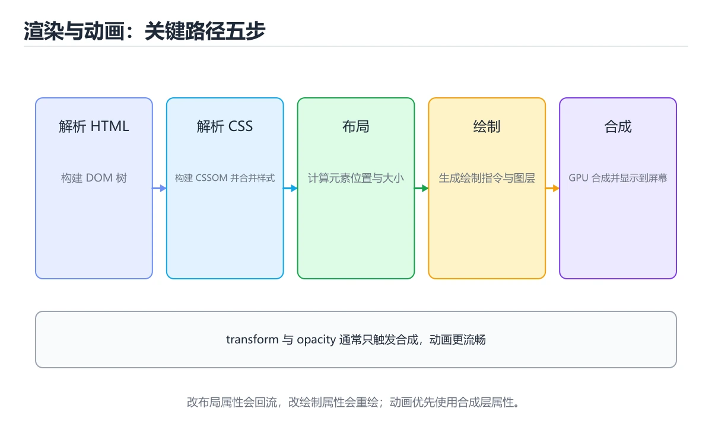

# 浏览器渲染与 CSS 动画




> 内容更新时间：2026-10-06 · 学习阶段：基础 · 预计用时：40 分钟

## 本节知识框架

**课程定位**：所属分类为「HTML 与 CSS」，课程主题为「浏览器渲染与 CSS 动画」，学习阶段为「基础」，建议用时 40 分钟。

**本课要解决的主问题**：关键渲染路径、回流与重绘、动画方式与性能指标。

| 学习层次 | 要回答的问题 | 完成判据 |
| --- | --- | --- |
| 概念层 | 「浏览器渲染与 CSS 动画」有哪些必须区分的对象与术语？ | 能用自己的话定义核心术语，并各举一个正例和一个反例。 |
| 机制层 | 这些对象按什么顺序发生作用，输入如何变成输出？ | 能画出或写出机制步骤，并说明每一步的失败条件。 |
| 应用层 | 什么场景适合使用「浏览器渲染与 CSS 动画」，什么场景不适合？ | 能给出一个真实场景、一个最小示例和一个边界案例。 |
| 性能层 | 时间、空间、吞吐或延迟受哪些量影响？ | 能说出复杂度或性能瓶颈的证据来源；没有证据时明确写“材料未提供”。 |
| 复习层 | 怎样确认自己不是只记住了结论？ | 能独立完成本课自测，并把错误定位到概念、机制、示例或边界。 |

### 阅读路线

1. 先读「核心概念定义」，建立「渲染」等对象的精确定义。
2. 再读「原理与运行机制」，把定义串成可重复的过程。
3. 用「代码/协议/SQL 示例」验证过程，并只改一个条件观察结果变化。
4. 最后检查性能、易错点、知识关系与自测题，形成可复习的证据链。

**前置知识**：《CSS 布局：Flex、Grid 与响应式》

**学习位置**：本课位于《CSS 选择器入门》之后；如果前一课的自测不能通过，应先回补再继续。

**后续衔接**：下一课《CSS 进阶：变量、伪类与现代特性》会继续使用本课术语，学完后建议立即完成一次自测。

**教材衔接：学习目标**

- 能用自己的话解释浏览器渲染与 CSS 动画解决了什么问题，而不是只背术语。
- 能说清 「渲染」、「回流」、「重绘」、「动画」 之间的关系，并分别举出一个例子。
- 能把 渲染 放回「浏览器渲染与 CSS 动画」的知识体系，说明它和 回流 的边界。
- 能完成本课练习，并用验收标准检查自己的结果。

> 一句话摘要：关键渲染路径、回流与重绘、动画方式与性能指标。

**教材衔接：前置知识**

- 先完成上一课《CSS 布局：Flex、Grid 与响应式》；如果已经掌握，可以直接用本课练习自测。
- 本课阶段：基础。建议先完成「CSS 布局：Flex、Grid 与响应式」，或确认自己能独立跑通正文里的 translateY 示例。
- 开始前先复习：渲染、回流、重绘。
- 看不懂就直接缩小例子：只保留 渲染 相关的两行输入，跑通后再加回其余部分。

**教材衔接：本课小结**

渲染性能的核心是**少触发回流、多用合成层**：结构改动批量化、动画只碰 transform/opacity、关键指标用 LCP/INP/CLS 衡量。

## 核心概念定义

> 阅读约定：本课先给「浏览器渲染与 CSS 动画」相关术语的操作性定义与适用边界；正文里的口语化说法与定义冲突时，以定义和可复现示例为准。

| 术语 | 操作性定义 | 本课中的边界 |
| --- | --- | --- |
| defer | JS 若在解析中同步执行会阻塞渲染，因此脚本用 defer/async，关键 CSS 内联，非关键资源懒加载。 | 仅在「浏览器渲染与 CSS 动画」明确给出的输入、版本与资源条件下成立。 |
| transform | 优化原则：批量修改 DOM（用 DocumentFragment 或一次性改 class）、避免在循环里读写布局属性（强制同步布局）、动画优先用 transform 与 opacity。 | 仅在「浏览器渲染与 CSS 动画」明确给出的输入、版本与资源条件下成立。 |
| 渲染 | 浏览器渲染把 HTML/CSS 转成像素，动画性能取决于是否触发重排、重绘或合成。 | 仅在「浏览器渲染与 CSS 动画」明确给出的输入、版本与资源条件下成立。 |
| 动画 | 用 transition 或 @keyframes 描述属性随时间变化；只动 transform 与 opacity 才能留在合成层。 | 仅在「浏览器渲染与 CSS 动画」明确给出的输入、版本与资源条件下成立。 |

### 定义如何使用

在「浏览器渲染与 CSS 动画」中判断一个说法是否成立，先确认它使用的是哪个对象的定义，再检查输入规模、运行环境与失败路径。定义不是口号，而是后续推导、代码示例和自测题共享的约束。

## 原理与运行机制

### 机制总览

1. **建立输入**：把「defer」按本课定义整理成可观察、可重复的输入条件。
2. **执行转换**：围绕「transform」执行本课的核心步骤；每一步都记录中间状态，避免只看最终输出。
3. **产生输出**：得到「渲染」后，用正文示例或协议/SQL 结果核对输出是否符合预期。
4. **改变一个条件**：只替换一个边界条件或环境参数，观察「浏览器渲染与 CSS 动画」的结论是否仍然成立。

| 阶段 | 关注对象 | 失败时应检查 |
| --- | --- | --- |
| 输入 | defer | 类型、范围、编码、版本或前置状态是否满足定义。 |
| 处理 | transform | 顺序、可见性、锁、路由、事务或调度规则是否被破坏。 |
| 输出 | 渲染 | 结果是否可复现，错误是否被正确传播而不是被吞掉。 |

本课的机制结论要用「浏览器渲染与 CSS 动画」自己的示例验证。「浏览器渲染与 CSS 动画」没有给出某个数量级、吞吐或内存数据时，本课把该判断标为“材料未提供”，不从相邻主题外推。

**教材衔接：回流与重绘**

| 类型 | 触发 | 代价 |
| --- | --- | --- |
| 回流（reflow） | 改变几何属性（宽高、位置、字体） | 高，需要重新布局 |
| 重绘（repaint） | 改变外观（颜色、阴影） | 中 |
| 仅合成 | transform / opacity | 低，可走 GPU |

优化原则：批量修改 DOM（用 DocumentFragment 或一次性改 class）、避免在循环里读写布局属性（强制同步布局）、动画优先用 `transform` 与 `opacity`。

**教材衔接：动画实现方式**

| 方式 | 特点 |
| --- | --- |
| CSS transition | 状态切换的补间，最简单 |
| CSS animation + @keyframes | 多阶段循环动画 |
| Web Animations API | JS 控制、可暂停与时间轴 |
| requestAnimationFrame | 逐帧 JS 动画，与刷新率同步 |

要点：尊重用户偏好 `@media (prefers-reduced-motion: reduce)`；动画时长 150~300ms 体感最自然；用 `will-change` 提前提升图层，但不要滥用（显存开销）。

**教材衔接：关键渲染路径速查**

| 阶段 | 触发条件 | 代价 |
| --- | --- | --- |
| 解析 HTML 建 DOM | 首次或结构变化 | 高 |
| 样式计算 | 选择器匹配、变量变化 | 中 |
| 布局（Reflow） | 几何属性变化 | 高 |
| 绘制（Paint） | 颜色、阴影、背景变化 | 中 |
| 合成（Composite） | 图层变换、透明度 | 低 |

优化原则：**优先只触发合成的属性（`transform`、`opacity`），避免频繁触发布局。**

**教材衔接：布局稳定性速查**

| 问题 | 原因 | 解决 |
| --- | --- | --- |
| 布局偏移（CLS） | 图片、广告、字体加载后尺寸变化 | 预留宽高、`aspect-ratio`、`font-display` |
| 图片抖动 | 未设置尺寸 | 写 `width`/`height` 或用 `aspect-ratio` |
| 字体闪烁 | 字体文件较晚加载 | `font-display: swap` 并预加载关键字体 |
| 滚动条跳动 | 内容高度变化 | 预留占位或固定容器高度 |
| 长任务卡顿 | 主线程被占用 | 拆分任务、用 `requestIdleCallback` |

## 典型应用场景

| 场景 | 典型输入或前提 | 期望产物 |
| --- | --- | --- |
| 学习验证 | 使用本课最小示例和 渲染、回流 | 能复现正文结论，并解释每一步。 |
| 工程落地 | 把「浏览器渲染与 CSS 动画」放入真实模块或服务边界 | 输出可观测、失败可定位、参数可配置。 |
| 故障排查 | 只改一个版本、规模、输入或依赖条件 | 能区分概念错误、实现错误和环境差异。 |

判断「浏览器渲染与 CSS 动画」的场景是否成立，标准是能否写出输入、处理、输出和失败路径；材料中没有出现的数据在本课标注为“材料未提供”，不用推测替代证据。

## 代码/协议/SQL 示例

### 最小可验证示例

下面保留《浏览器渲染与 CSS 动画》原文中的最小示例。先预测《浏览器渲染与 CSS 动画》示例的输出，再按正文步骤运行或推演；示例依赖外部环境时，同时记录版本与输入。

```text
HTML → DOM 树；CSS → CSSOM 树 → 合成渲染树 → 布局(Layout) → 绘制(Paint) → 合成(Composite)
```

**教材衔接：关键渲染路径**

```text
HTML → DOM 树；CSS → CSSOM 树 → 合成渲染树 → 布局(Layout) → 绘制(Paint) → 合成(Composite)
```

JS 若在解析中同步执行会阻塞渲染，因此脚本用 `defer`/`async`，关键 CSS 内联，非关键资源懒加载。

**教材衔接：动画方式速查**

| 方式 | 性能 | 适用 |
| --- | --- | --- |
| CSS 过渡与动画 | 高（可走合成） | 大多数交互动画 |
| Web Animations API | 高 | 需要 JS 控制的动画 |
| JS 改样式逐帧 | 低 | 尽量不用 |
| `requestAnimationFrame` | 中 | 需要逐帧计算的场景 |
| SVG 动画 | 中 | 图标与矢量图形 |

```css
/* 只动画 transform 与 opacity：不触发布局与绘制 */
.card {
  transition: transform 200ms ease, box-shadow 200ms ease;
  will-change: transform;         /* 只在动画期间使用 */
}

.card:hover {
  transform: translateY(-4px);
}

/* 入场动画：避免使用 top/left/margin */
@keyframes slide-in {
  from {
    opacity: 0;
    transform: translateY(12px);
  }
  to {
    opacity: 1;
    transform: translateY(0);
  }
}

.list-item {
  animation: slide-in 220ms ease-out both;
}

/* 尊重用户的减少动效偏好 */
@media (prefers-reduced-motion: reduce) {
  *,
  *::before,
  *::after {
    animation-duration: 0.01ms !important;
    animation-iteration-count: 1 !important;
    transition-duration: 0.01ms !important;
  }
}
```

**教材衔接：深入补充：浏览器渲染与 CSS 动画**

前面已经建立了基本概念。这一节换一个角度，把浏览器渲染与 CSS 动画放进真实工程里，
重点回答三件事：渲染 为什么存在、内部如何运转、什么时候会失效。

### 一、核心模型

浏览器渲染把 HTML/CSS 转成像素，动画性能取决于是否触发重排、重绘或合成；优先使用 transform 和 opacity，避免在动画中频繁读写布局属性。

```text
HTML 解析 → DOM → CSSOM → 渲染树 → 布局 → 绘制 → 合成 → 屏幕
```

### 二、关键机制拆解

1. 布局计算元素几何位置，改变宽高、边距、字体等会触发布局。
2. 绘制填充像素，改变颜色、阴影和背景会触发重绘。
3. 合成把图层交给 GPU 合并，transform 和 opacity 通常只触发合成。
4. will-change 和图层提升要谨慎使用，过多图层会占用显存并增加合成成本。
5. requestAnimationFrame 与浏览器刷新同步，适合逐帧动画；setInterval 容易丢帧。
6. 强制同步布局会在读取 offsetHeight 等属性时立即计算布局，导致抖动。
7. 动画要尊重 prefers-reduced-motion，为敏感用户提供减少动态效果。

### 三、对照表：抓住容易混淆的边界

| 维度 | 一侧 | 另一侧 |
| --- | --- | --- |
| 重排 | 重新计算布局 | 代价最高，影响范围大 |
| 重绘 | 重新绘制像素 | 比布局便宜但仍有成本 |
| 合成 | GPU 合并图层 | 适合 transform 和 opacity |
| 强制同步布局 | 脚本读写交错触发即时布局 | 会造成严重性能抖动 |

### 四、工作示例

实现元素移动时使用 `transform: translateX()`，而不是修改 `left`。前者通常走合成层，后者每帧触发布局和绘制，移动端更容易掉帧。

### 五、常见误区与失效边界

| 错误做法或假设 | 后果 | 正确做法 |
| --- | --- | --- |
| 动画 width/left/top | 每帧重排 | 改用 transform 和 opacity |
| 读取布局后立即写入 | 强制同步布局 | 先批量读，再批量写 |
| 滥用 will-change | 显存暴涨 | 只在动画前临时提升并移除 |
| 忽略低端设备 | 桌面流畅、手机卡顿 | 在真实设备上用性能面板测量 |

### 六、场景推演

列表滚动出现白屏和掉帧。分析发现滚动监听中不断读取位置并修改样式，导致强制同步布局。改为使用 IntersectionObserver 和 transform 后，帧率恢复稳定。

### 七、自测问答

**Q1：重排和重绘有什么区别？**

重排重新计算布局，重绘重新画像素，前者代价更高。

**Q2：为什么 transform 动画更流畅？**

它通常只触发合成，不引起布局和重绘。

**Q3：什么是强制同步布局？**

脚本读取布局属性时浏览器被迫立即计算，打断渲染流水线。

**Q4：为什么动画要支持 reduced motion？**

部分用户对动态效果敏感，系统设置应被尊重。

### 八、小项目：把知识变成可检查的产出

实现同一个移动动画的三种版本：修改 left、修改 transform、使用 Web Animations API；用性能面板记录帧率、布局次数和绘制时间，并给出移动端结论。

### 九、适用边界

渲染优化改善浏览器绘制和合成，不改变 DOM 规模和脚本逻辑。复杂页面仍需先减少节点、事件监听和不必要的状态更新。

### 十、完成检查清单

- [ ] 能描述渲染流水线
- [ ] 能区分重排、重绘和合成
- [ ] 能避免强制同步布局
- [ ] 能正确使用 transform 与 will-change
- [ ] 能测量真实设备的动画帧率

### 十一、复习顺序

1. 不看资料讲清「浏览器渲染与 CSS 动画」的核心模型，并各举一个正例和反例。
2. 再对照表逐行解释容易混淆的概念，每个概念补一个反例。
3. 跟着工作示例做一遍，改变一个条件并预测结果。
4. 用自测问答检查理解，错题回到对应小节重新阅读。
5. 把 回流 的实现、测试与复盘整理成一份可提交的产物。

> 复习不是重读一遍，而是离开原文重新产出：复述、改写、验证、复盘。

## 时间/空间复杂度或性能分析

**复杂度证据**：「浏览器渲染与 CSS 动画」的现有材料没有给出渐近时间或空间复杂度的明确结论，本课只做定性检查，不补写未经验证的 $O$ 记号。

| 维度 | 本课关注点 | 判断依据 |
| --- | --- | --- |
| 时间/延迟 | 「浏览器渲染与 CSS 动画」的主要步骤是否会随输入规模、并发度或网络往返增长。 | 以正文复杂度、基准数据或可重复测量为准。 |
| 空间/内存 | 中间状态、缓存、副本、连接或索引是否随规模增长。 | 记录峰值内存与数据副本，不只看最终结果。 |
| 吞吐/资源 | 版本、调度、锁、IO、序列化或协议开销是否成为瓶颈。 | 固定环境做对照实验，改变一个变量。 |

评估「浏览器渲染与 CSS 动画」时要区分“正确性成立”和“性能达标”两件事；材料没有给出基准时，本课只保留量级来源与测量方法，不写不可验证的绝对数字。

**教材衔接：页面性能指标**

首次内容绘制 FCP、最大内容绘制 LCP（< 2.5s）、首次输入延迟 INP（< 200ms）、累积布局偏移 CLS（< 0.1）。用 Lighthouse 与 Chrome Performance 面板定位长任务与布局抖动。

## 常见误区与易错点

> 复核《浏览器渲染与 CSS 动画》的易错点时，优先保留原文的错误表、故障现场与排错路径；每条修正都要能用本课示例复验。

| 易错点 | 常见表现 | 正确做法 |
| --- | --- | --- |
| 只背结论 | 能复述「浏览器渲染与 CSS 动画」的定义，却说不清输入、输出与边界。 | 回到机制步骤，用最小示例逐一验证。 |
| 混淆相邻概念 | 把本课对象与相邻主题的对象当成同一类。 | 先比较定义、资源归属、生命周期和失败模式。 |
| 忽略版本与环境 | 在开发机通过后直接外推到生产环境。 | 固定版本、输入和资源条件，再记录可复现结果。 |

**教材衔接：常见错误与排查**

| 容易踩的做法 | 实际现象 | 原因与正确做法 |
| --- | --- | --- |
| 用 `top`/`left` 做动画 | 每帧触发布局，掉帧 | 改用 `transform` |
| 用 `margin` 做位移动画 | 触发布局 | 用 `transform: translate` |
| 长期挂着 `will-change` | 图层过多、显存占用高 | 只在动画前后开启 |
| 图片不设尺寸 | 布局偏移 | 预留宽高或用 `aspect-ratio` |
| 动画不尊重减少动效 | 眩晕用户不适 | 用 `prefers-reduced-motion` |
| 每秒读取 `offsetHeight` | 强制同步布局 | 缓存测量结果、批量读写分离 |
| 频繁改大量 DOM 样式 | 重排重绘刷屏 | 用类切换或 `transform` |
| 忽略合成层数量 | 内存占用升高 | 控制图层数量 |
| 动画时长过长 | 感觉迟钝 | 交互反馈控制在 150 到 300 毫秒 |
| 只在桌面测性能 | 移动端掉帧 | 在低端设备与降频场景实测 |

**教材衔接：故障现场**

### 现场 1：用 top/left 做动画

**症状**：在《浏览器渲染与 CSS 动画》的复现场景中，每帧触发布局，掉帧。

**根因**：“每帧触发布局，掉帧”只是表层结果。向上追溯会落到“用 top/left 做动画”这一步，因为它省略了《浏览器渲染与 CSS 动画》的约束，使实现行为和预期模型发生了偏离。

**修复**：针对《浏览器渲染与 CSS 动画》的问题，改用 transform。

**验证**：先在《浏览器渲染与 CSS 动画》中记录“用 top/left 做动画”留下的失败证据，再执行“改用 transform”并重放；确认错误路径变为明确结果，且修复没有掩盖同类故障。

### 现场 2：长期挂着 will-change

**症状**：在《浏览器渲染与 CSS 动画》的复现场景中，图层过多、显存占用高。

**根因**：触发点是把“长期挂着 will-change”当成安全做法。它没有满足《浏览器渲染与 CSS 动画》要求的前提，因此先表现为“图层过多、显存占用高”；排查时先完整复现这一段，再核对输入、配置与依赖。

**修复**：针对《浏览器渲染与 CSS 动画》的问题，只在动画前后开启。

**验证**：先在《浏览器渲染与 CSS 动画》中记录“长期挂着 will-change”留下的失败证据，再执行“只在动画前后开启”并重放；确认错误路径变为明确结果，且修复没有掩盖同类故障。

### 现场 3：动画不尊重减少动效

**症状**：在《浏览器渲染与 CSS 动画》的复现场景中，眩晕用户不适。

**根因**：当出现“动画不尊重减少动效”时，执行路径已经绕过了《浏览器渲染与 CSS 动画》的关键约束，最终以“眩晕用户不适”暴露出来；修复前必须先确认约束在哪里失效。

**修复**：针对《浏览器渲染与 CSS 动画》的问题，用 prefers-reduced-motion。

**验证**：在《浏览器渲染与 CSS 动画》中按“用 prefers-reduced-motion”调整后，从“动画不尊重减少动效”的触发条件重放同一条路径，确认“眩晕用户不适”不再出现，并补一个相邻边界用例检查没有引入新问题。

## 与其他知识点的关系

| 关系 | 课程 | 为什么 |
| --- | --- | --- |
| 先修 | 《CSS 布局：Flex、Grid 与响应式》 | 本课会直接使用它的概念或操作前提。 |
| 关联 | 《CSS 进阶：变量、伪类与现代特性》 | 用于横向比较或把本课结论迁移到相邻主题。 |
| 前置顺序 | 《CSS 选择器入门》 | 同分类中安排在本课之前，建议先完成其自测。 |
| 后续顺序 | 《CSS 进阶：变量、伪类与现代特性》 | 同分类中安排在本课之后，会继续使用本课术语。 |

把「浏览器渲染与 CSS 动画」放回知识体系时，不只要记住“前面学过什么”，还要说明两个主题在输入、机制、资源边界和失败模式上的差异。这样才能把单课知识迁移到项目、排障和后续课程。

**教材衔接：属性代价对照**

| 属性 | 触发布局 | 触发绘制 | 仅合成 |
| --- | --- | --- | --- |
| `width`、`height`、`margin`、`top` | 是 | 是 | 否 |
| `color`、`background-color`、`box-shadow` | 否 | 是 | 否 |
| `transform`、`opacity`、`filter` | 否 | 可能 | 是 |
| `will-change` | 否 | 否 | 提示提升图层 |

## 自测题与参考答案

> 先独立作答《浏览器渲染与 CSS 动画》的自测题，再对照答案与解析；每处判断都要能在本课正文或示例中找到依据。

### 自测 1

围绕“浏览器渲染与 CSS 动画”中的 渲染、回流、重绘，下列哪两项是本课强调的实践判断？

A. 只要 渲染 的常规示例通过，就可以跳过边界与异常路径
B. 验证 回流 时要固定版本并覆盖边界输入，结论才可复现
C. 把 回流 的单次运行结果当成所有版本和规模都成立
D. 学习 渲染 时要同时说明输入、输出和失败路径，不能只看正常流程

**参考答案**：验证 回流 时要固定版本并覆盖边界输入，结论才可复现；学习 渲染 时要同时说明输入、输出和失败路径，不能只看正常流程

**解析**：本课把浏览器渲染与 CSS 动画拆成概念、示例与故障现场三部分，因此判断 渲染 时必须同时交代输入、输出和失败路径，这使“学习 渲染 时要同时说明输入、输出和失败路径，不能只看正常流程”成立。在浏览器渲染与 CSS 动画里，判断 回流 时要固定版本与边界输入，所以“验证 回流 时要固定版本并覆盖边界输入，结论才可复现”才可复现。

### 自测 2

下面这段代码摘自「浏览器渲染与 CSS 动画」的正文示例。关于这段代码，下面哪一项说法与实际内容相符？

```css
/* 只动画 transform 与 opacity：不触发布局与绘制 */
.card {
  transition: transform 200ms ease, box-shadow 200ms ease;
  will-change: transform;         /* 只在动画期间使用 */
}

.card:hover {
  transform: translateY(-4px);
}

/* 入场动画：避免使用 top/left/margin */
@keyframes slide-in {
  from {
    opacity: 0;
    transform: translateY(12px);
  }
  to {
    opacity: 1;
    transform: translateY(0);
  }
}

.list-item {
  animation: slide-in 220ms ease-out both;
}

/* 尊重用户的减少动效偏好 */
@media (prefers-reduced-motion: reduce) {
  *,
  *::before,
  *::after {
    animation-duration: 0.01ms !important;
    animation-iteration-count: 1 !important;
    transition-duration: 0.01ms !important;
  }
}
```

A. 这段代码只做静态声明，没有循环、分支或可观察输出。
B. 这段代码把主要逻辑封装在函数或方法里，需要被调用才会执行。
C. 这段代码会读取外部输入，结果依赖传入的数据。
D. 这段代码会产生可观察的输出，运行后能看到结果。

**参考答案**：这段代码把主要逻辑封装在函数或方法里，需要被调用才会执行。

**解析**：题干的正确项是这段代码把主要逻辑封装在函数或方法里，需要被调用才会执行，在「浏览器渲染与 CSS 动画」里封装边界决定渲染从哪一步开始生效。这段代码出自「浏览器渲染与 CSS 动画」的正文示例，围绕渲染、回流、重绘展开；把输入或边界换成空值、极值或失败情况后，结论要以「浏览器渲染与 CSS 动画」的实际运行结果为准。回到「浏览器渲染与 CSS 动画」的正文示例，用“下面这段代码摘自浏览器渲染与 C”走一遍渲染、回流、重绘的完整流程，能复现的结论才可以保留。

### 自测 3

让脚本不阻塞 HTML 解析，应使用？

A. 同步 script
B. eval
C. defer 或 async
D. 行内 script

**参考答案**：defer 或 async

**解析**：在「浏览器渲染与 CSS 动画」里，defer 或 async。defer 保持顺序，async 不保证顺序。在「浏览器渲染与 CSS 动画」里判断这道题，要把渲染、回流、重绘的条件、过程与失败路径逐项对齐，换成“让脚本不阻塞 HTML 解析”这个场景，只有满足前提的结论才成立。

**教材衔接：复习与自测**

- [ ] 知道哪些属性触发布局、绘制与合成。
- [ ] 动画优先使用 `transform` 与 `opacity`。
- [ ] 图片与媒体容器预留尺寸，避免 CLS。
- [ ] 尊重 `prefers-reduced-motion`。
- [ ] 用性能面板确认没有强制同步布局与长任务。

**教材衔接：动手练习**

> 本课练习重点：围绕「渲染、回流、重绘」完成复述、实验和交付，每个结果都要能被别人检查。

先写 渲染 的最小语义结构，再调整样式，最后检查键盘、窄屏与对比度。

### 练习 1：建立心智模型（10 分钟）

合上教程，用 3～5 句话回答：

1. 浏览器渲染与 CSS 动画解决了什么问题？
2. 如果没有它，会出现什么具体后果？
3. 它和「回流」是什么关系？

验收标准：回答里必须出现 渲染，并写出一个让结论失效的边界条件。

### 练习 2：做一次可控实验（20 分钟）

从正文中选一个最小示例，完成以下操作：

1. 先预测修改一个参数、输入或步骤后的结果。
2. 再实际执行或逐步推演，记录真实结果。
3. 如果结果与预测不同，写出差异原因。

**验收标准**：五步记录要写进笔记——原例是 translateY，改动落在渲染上，结论必须能被他人在同一环境里复现。

### 练习 3：交付一个小结果（30 分钟）

用最少的结构演示 translateY，再在窄屏下确认没有溢出。

任务要求：

- 结果必须能被别人检查，不能只写“我已经理解了”。
- 至少覆盖「渲染」和「回流」两个关键词。
- 写出 1 个仍然不确定的问题，以及下一步如何验证。

> 提示：时间有限时优先做练习 1 和练习 2；练习 3 可以拆成两次完成。

**教材衔接：可运行练习**

本节围绕浏览器渲染与 CSS 动画安排 3 个可交付任务，每个任务都要求留下可以复查的记录。

### 任务 1：用自己的话画出结构

不看书，用一张图说清「浏览器渲染与 CSS 动画」的结构，画完再对照骨架：

- 主干：关键渲染路径 → 回流与重绘 → 动画实现方式 → 页面性能指标
- 连接线：在每条边上标出输入、输出与失败路径。
- 自检：能否用一句话说明渲染与回流的关系？

### 任务 2：做一次对比实验

**验收标准**：用 translateY 做一次真实对照，结论要说明在「浏览器渲染与 CSS 动画」的哪个前提下成立。

### 任务 3：迁移到自己的场景

**验收标准**：结论要附带 translateY 的可复现记录，并说明 渲染 在「关键渲染路径」里的位置。

**教材衔接：本课复习清单**

离开本课前，逐项确认：

- [ ] 不看解析，能说出「下列哪个属性变化最容易触发回流？」的判断依据。
- [ ] 不看解析，能说出「LCP（最大内容绘制）的良好阈值是？」的判断依据。
- [ ] 不看解析，能说出「让脚本不阻塞 HTML 解析，应使用？」的判断依据。
- [ ] 不看解析，能说出「用 transform 和 opacity 做动画性能更好的原因是？」的判断依据。
- [ ] 不看解析，能说出「will-change 使用不当的主要风险是？」的判断依据。
- [ ] 至少运行一次 translateY 的示例，记录输入、输出和 渲染 的边界情况。
- [ ] 把本课最容易混淆的两个概念写成一句话对照。

| 复盘项 | 记录 |
| --- | --- |
| 已经能独立解释的考点 |  |
| 仍然说不清的概念 |  |
| 下一步验证动作 |  |

---

## 术语速查

| 术语 | 一句话说明 |
| --- | --- |
| `defer` | JS 若在解析中同步执行会阻塞渲染，因此脚本用 `defer`/`async`，关键 CSS 内联，非关键资源懒加载。 |
| `transform` | 优化原则：批量修改 DOM（用 DocumentFragment 或一次性改 class）、避免在循环里读写布局属性（强制同步布局）、动画优先用 `transform` 与 `opacity`。 |
| `渲染` | 浏览器渲染把 HTML/CSS 转成像素，动画性能取决于是否触发重排、重绘或合成。 |
| `动画` | 用 transition 或 @keyframes 描述属性随时间变化；只动 transform 与 opacity 才能留在合成层。 |

## 考点精讲

### 考点 1：多选辨析·渲染

- **题目**：围绕“浏览器渲染与 CSS 动画”中的 渲染、回流、重绘，下列哪两项是本课强调的实践判断？
- **判断依据**：本课把浏览器渲染与 CSS 动画拆成概念、示例与故障现场三部分，因此判断 渲染 时必须同时交代输入、输出和失败路径，这使“学习 渲染 时要同时说明输入、输出和失败路径，不能只看正常流程”成立。在浏览器渲染与 CSS 动画里，判断 回流 时要固定版本与边界输入，所以“验证 回流 时要固定版本并覆盖边界输入，结论才可复现”才可复现。

### 考点 2：代码补全·渲染

- **题目**：下面这段代码摘自「浏览器渲染与 CSS 动画」的正文示例。关于这段代码，下面哪一项说法与实际内容相符？
- **判断依据**：题干的正确项是这段代码把主要逻辑封装在函数或方法里，需要被调用才会执行，在「浏览器渲染与 CSS 动画」里封装边界决定渲染从哪一步开始生效。这段代码出自「浏览器渲染与 CSS 动画」的正文示例，围绕渲染、回流、重绘展开；把输入或边界换成空值、极值或失败情况后，结论要以「浏览器渲染与 CSS 动画」的实际运行结果为准。回到「浏览器渲染与 CSS 动画」的正文示例，用“下面这段代码摘自浏览器渲染与 C”走一遍渲染、回流、重绘的完整流程，能复现的结论才可以保留。

### 考点 3：概念判断·渲染

- **题目**：让脚本不阻塞 HTML 解析，应使用？
- **判断依据**：在「浏览器渲染与 CSS 动画」里，defer 或 async。defer 保持顺序，async 不保证顺序。在「浏览器渲染与 CSS 动画」里判断这道题，要把渲染、回流、重绘的条件、过程与失败路径逐项对齐，换成“让脚本不阻塞 HTML 解析”这个场景，只有满足前提的结论才成立。

### 考点 4：概念判断·渲染

- **题目**：用 transform 和 opacity 做动画性能更好的原因是？
- **判断依据**：在「浏览器渲染与 CSS 动画」里，结论应落在「只需合成层处理，通常不触发布局与重绘」。合成阶段动画跳过 layout/paint，是 60fps 动画的首选属性。在「浏览器渲染与 CSS 动画」里，这道题要求区分概念与边界，「只需合成层处理，通常不触发布局与重绘」只有在题干给出的前提下才成立，而「浏览器对这两个属性做了特殊解析」、「它们会自动开启硬件解码」缺少同一组条件。

### 考点 5：概念判断·渲染

- **题目**：will-change 使用不当的主要风险是？
- **判断依据**：在「浏览器渲染与 CSS 动画」里，滥用会创建大量合成层。will-change 应只在动画前后短时间使用，长期挂在元素上是常见的性能反模式。这道题的关键在「浏览器渲染与 CSS 动画」的渲染、回流、重绘：先确认题干“will-change 使用不当的主”问的是哪一步，再排除偷换前提的选项。

### 考点 6：填空·渲染

- **题目**：补全代码：「浏览器渲染与 CSS 动画」示例中，下面这行代码缺少哪个关键字或函数名？请填入 ____。 `____: transform 200ms ease, box-shadow 200ms ease;`
- **判断依据**：在「浏览器渲染与 CSS 动画」里，transition。这道题的关键在「浏览器渲染与 CSS 动画」的渲染、回流、重绘：先确认题干“补全代码”问的是哪一步，再排除偷换前提的选项。回到渲染、回流、重绘本身再看一遍：只有“transition”与题干“浏览器渲染与”的前提一致，结论才成立。

## English Overview

**Title:** Rendering & Animation

**Summary:** Render path, reflow, animation and web vitals.

**Category:** HTML & CSS
**Level:** 基础
**Key terms:** 渲染, 回流, 重绘, 动画, LCP, CLS

## 内容元数据

- 内容版本：v2.0
- 最后更新：2026-10-06
- 学习阶段：基础
- 适用环境：现代浏览器（Chrome/Firefox/Safari）
；本课聚焦 渲染。
- 内容来源：内置结构化课程与工程实践整理
- 相关主题：渲染、回流、重绘、动画、LCP、CLS
- 质量版本：P0 测验标准 + P1 覆盖扩展 + P2 体验补全

## 参考资料与复核

- 最后复核：2026-10-04
- 下次复核：2027-08-17
- 复核范围：版本兼容、API 行为、安全建议与工程实践
- 来源性质：官方文档、标准或权威教材；正文为离线教学重组

| 参考资料 | 本课用途 |
| --- | --- |
| [MDN CSS](https://developer.mozilla.org/docs/Web/CSS) | CSS 布局、选择器与动画 |
| [web.dev 学习平台](https://web.dev/learn/) | 现代 Web 性能与最佳实践 |
| [MDN 无障碍](https://developer.mozilla.org/docs/Web/Accessibility) | 可访问性与语义 |

> 「浏览器渲染与 CSS 动画」的链接用于离线阅读后的延伸核对；App 不会自动联网。
