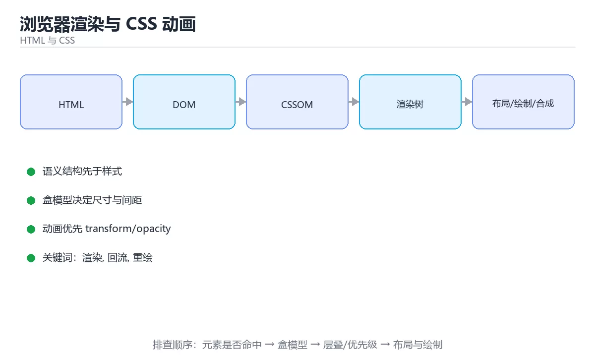

# 浏览器渲染与 CSS 动画



> 内容更新时间：2026-10-03 · 学习阶段：基础 · 预计用时：16 分钟

## 学习目标

- 能用自己的话解释「浏览器渲染与 CSS 动画」解决了什么问题，而不是只背术语。
- 能说清 「渲染」、「回流」、「重绘」、「动画」 之间的关系，并分别举出一个例子。
- 能把本课知识放回「HTML 与 CSS」的知识体系，说明它和相邻主题的边界。
- 能完成本课练习，并用验收标准检查自己的结果。

> 一句话摘要：关键渲染路径、回流与重绘、动画方式与性能指标。

## 前置知识

- 先完成上一课《CSS 布局：Flex、Grid 与响应式》；如果已经掌握，可以直接用本课练习自测。
- 本课阶段：基础。建议会读写简单代码或命令，并理解变量、输入输出等基本概念。
- 开始前先复习：渲染、回流、重绘。
- 如果某一步看不懂，先记录具体卡点，完成练习后再回头读一遍。


## 关键渲染路径

```text
HTML → DOM 树；CSS → CSSOM 树 → 合成渲染树 → 布局(Layout) → 绘制(Paint) → 合成(Composite)
```

JS 若在解析中同步执行会阻塞渲染，因此脚本用 `defer`/`async`，关键 CSS 内联，非关键资源懒加载。

## 回流与重绘

| 类型 | 触发 | 代价 |
| --- | --- | --- |
| 回流（reflow） | 改变几何属性（宽高、位置、字体） | 高，需要重新布局 |
| 重绘（repaint） | 改变外观（颜色、阴影） | 中 |
| 仅合成 | transform / opacity | 低，可走 GPU |

优化原则：批量修改 DOM（用 DocumentFragment 或一次性改 class）、避免在循环里读写布局属性（强制同步布局）、动画优先用 `transform` 与 `opacity`。

## 动画实现方式

| 方式 | 特点 |
| --- | --- |
| CSS transition | 状态切换的补间，最简单 |
| CSS animation + @keyframes | 多阶段循环动画 |
| Web Animations API | JS 控制、可暂停与时间轴 |
| requestAnimationFrame | 逐帧 JS 动画，与刷新率同步 |

要点：尊重用户偏好 `@media (prefers-reduced-motion: reduce)`；动画时长 150~300ms 体感最自然；用 `will-change` 提前提升图层，但不要滥用（显存开销）。

## 页面性能指标

首次内容绘制 FCP、最大内容绘制 LCP（< 2.5s）、首次输入延迟 INP（< 200ms）、累积布局偏移 CLS（< 0.1）。用 Lighthouse 与 Chrome Performance 面板定位长任务与布局抖动。

## 本课小结
渲染性能的核心是**少触发回流、多用合成层**：结构改动批量化、动画只碰 transform/opacity、关键指标用 LCP/INP/CLS 衡量。

<!-- appendix:v1 -->

## 关键渲染路径速查

| 阶段 | 触发条件 | 代价 |
| --- | --- | --- |
| 解析 HTML 建 DOM | 首次或结构变化 | 高 |
| 样式计算 | 选择器匹配、变量变化 | 中 |
| 布局（Reflow） | 几何属性变化 | 高 |
| 绘制（Paint） | 颜色、阴影、背景变化 | 中 |
| 合成（Composite） | 图层变换、透明度 | 低 |

优化原则：**优先只触发合成的属性（`transform`、`opacity`），避免频繁触发布局。**

## 属性代价对照

| 属性 | 触发布局 | 触发绘制 | 仅合成 |
| --- | --- | --- | --- |
| `width`、`height`、`margin`、`top` | 是 | 是 | 否 |
| `color`、`background-color`、`box-shadow` | 否 | 是 | 否 |
| `transform`、`opacity`、`filter` | 否 | 可能 | 是 |
| `will-change` | 否 | 否 | 提示提升图层 |

## 动画方式速查

| 方式 | 性能 | 适用 |
| --- | --- | --- |
| CSS 过渡与动画 | 高（可走合成） | 大多数交互动画 |
| Web Animations API | 高 | 需要 JS 控制的动画 |
| JS 改样式逐帧 | 低 | 尽量不用 |
| `requestAnimationFrame` | 中 | 需要逐帧计算的场景 |
| SVG 动画 | 中 | 图标与矢量图形 |

```css
/* 只动画 transform 与 opacity：不触发布局与绘制 */
.card {
  transition: transform 200ms ease, box-shadow 200ms ease;
  will-change: transform;         /* 只在动画期间使用 */
}

.card:hover {
  transform: translateY(-4px);
}

/* 入场动画：避免使用 top/left/margin */
@keyframes slide-in {
  from {
    opacity: 0;
    transform: translateY(12px);
  }
  to {
    opacity: 1;
    transform: translateY(0);
  }
}

.list-item {
  animation: slide-in 220ms ease-out both;
}

/* 尊重用户的减少动效偏好 */
@media (prefers-reduced-motion: reduce) {
  *,
  *::before,
  *::after {
    animation-duration: 0.01ms !important;
    animation-iteration-count: 1 !important;
    transition-duration: 0.01ms !important;
  }
}
```

## 布局稳定性速查

| 问题 | 原因 | 解决 |
| --- | --- | --- |
| 布局偏移（CLS） | 图片、广告、字体加载后尺寸变化 | 预留宽高、`aspect-ratio`、`font-display` |
| 图片抖动 | 未设置尺寸 | 写 `width`/`height` 或用 `aspect-ratio` |
| 字体闪烁 | 字体文件较晚加载 | `font-display: swap` 并预加载关键字体 |
| 滚动条跳动 | 内容高度变化 | 预留占位或固定容器高度 |
| 长任务卡顿 | 主线程被占用 | 拆分任务、用 `requestIdleCallback` |

## 常见错误对照表

| 容易踩的做法 | 实际现象 | 原因与正确做法 |
| --- | --- | --- |
| 用 `top`/`left` 做动画 | 每帧触发布局，掉帧 | 改用 `transform` |
| 用 `margin` 做位移动画 | 触发布局 | 用 `transform: translate` |
| 长期挂着 `will-change` | 图层过多、显存占用高 | 只在动画前后开启 |
| 图片不设尺寸 | 布局偏移 | 预留宽高或用 `aspect-ratio` |
| 动画不尊重减少动效 | 眩晕用户不适 | 用 `prefers-reduced-motion` |
| 每秒读取 `offsetHeight` | 强制同步布局 | 缓存测量结果、批量读写分离 |
| 频繁改大量 DOM 样式 | 重排重绘刷屏 | 用类切换或 `transform` |
| 忽略合成层数量 | 内存占用升高 | 控制图层数量 |
| 动画时长过长 | 感觉迟钝 | 交互反馈控制在 150 到 300 毫秒 |
| 只在桌面测性能 | 移动端掉帧 | 在低端设备与降频场景实测 |

## 自测清单

- [ ] 知道哪些属性触发布局、绘制与合成。
- [ ] 动画优先使用 `transform` 与 `opacity`。
- [ ] 图片与媒体容器预留尺寸，避免 CLS。
- [ ] 尊重 `prefers-reduced-motion`。
- [ ] 用性能面板确认没有强制同步布局与长任务。

## 动手练习

<!-- practice-diversified:v1 -->

> 本课练习重点：围绕「渲染、回流、重绘」完成复述、实验和交付，每个结果都要能被别人检查。

先写最小语义结构，再调整布局与样式，最后检查键盘、窄屏和对比度。

### 练习 1：建立心智模型（10 分钟）

合上教程，用 3～5 句话回答：

1. 「浏览器渲染与 CSS 动画」解决了什么问题？
2. 如果没有它，会出现什么具体后果？
3. 它和「回流」是什么关系？

**验收标准**：至少出现一个本课关键词，并写出一个反例、边界条件或失效场景。

### 练习 2：做一次可控实验（20 分钟）

从正文中选一个最小示例，完成以下操作：

1. 先预测修改一个参数、输入或步骤后的结果。
2. 再实际执行或逐步推演，记录真实结果。
3. 如果结果与预测不同，写出差异原因。

**验收标准**：留下「原例 → 改动 → 预测 → 结果 → 原因」五步记录。

### 练习 3：交付一个小结果（30 分钟）

做一个只有标题、卡片和按钮的最小页面，并用浏览器设备模式检查窄屏。

任务要求：

- 结果必须能被别人检查，不能只写“我已经理解了”。
- 至少覆盖「渲染」和「回流」两个关键词。
- 写出 1 个仍然不确定的问题，以及下一步如何验证。

> 提示：时间有限时优先做练习 1 和练习 2；练习 3 可以拆成两次完成。

<!-- scaffold:v1 -->

<!-- deep-dive:v1 -->

## 深入补充：浏览器渲染与 CSS 动画

前面已经建立了基本概念。这一节换一个角度，把「浏览器渲染与 CSS 动画」放进真实工程里，
重点回答三件事：它为什么存在、内部如何运转、什么时候会失效。

### 一、核心模型

浏览器渲染把 HTML/CSS 转成像素，动画性能取决于是否触发重排、重绘或合成；优先使用 transform 和 opacity，避免在动画中频繁读写布局属性。

```text
HTML 解析 → DOM → CSSOM → 渲染树 → 布局 → 绘制 → 合成 → 屏幕
```

### 二、关键机制拆解

1. 布局计算元素几何位置，改变宽高、边距、字体等会触发布局。
2. 绘制填充像素，改变颜色、阴影和背景会触发重绘。
3. 合成把图层交给 GPU 合并，transform 和 opacity 通常只触发合成。
4. will-change 和图层提升要谨慎使用，过多图层会占用显存并增加合成成本。
5. requestAnimationFrame 与浏览器刷新同步，适合逐帧动画；setInterval 容易丢帧。
6. 强制同步布局会在读取 offsetHeight 等属性时立即计算布局，导致抖动。
7. 动画要尊重 prefers-reduced-motion，为敏感用户提供减少动态效果。

### 三、对照表：抓住容易混淆的边界

| 维度 | 一侧 | 另一侧 |
| --- | --- | --- |
| 重排 | 重新计算布局 | 代价最高，影响范围大 |
| 重绘 | 重新绘制像素 | 比布局便宜但仍有成本 |
| 合成 | GPU 合并图层 | 适合 transform 和 opacity |
| 强制同步布局 | 脚本读写交错触发即时布局 | 会造成严重性能抖动 |

### 四、工作示例

实现元素移动时使用 `transform: translateX()`，而不是修改 `left`。前者通常走合成层，后者每帧触发布局和绘制，移动端更容易掉帧。

### 五、常见误区与失效边界

| 错误做法或假设 | 后果 | 正确做法 |
| --- | --- | --- |
| 动画 width/left/top | 每帧重排 | 改用 transform 和 opacity |
| 读取布局后立即写入 | 强制同步布局 | 先批量读，再批量写 |
| 滥用 will-change | 显存暴涨 | 只在动画前临时提升并移除 |
| 忽略低端设备 | 桌面流畅、手机卡顿 | 在真实设备上用性能面板测量 |

### 六、场景推演

列表滚动出现白屏和掉帧。分析发现滚动监听中不断读取位置并修改样式，导致强制同步布局。改为使用 IntersectionObserver 和 transform 后，帧率恢复稳定。

### 七、自测问答

**Q1：重排和重绘有什么区别？**

重排重新计算布局，重绘重新画像素，前者代价更高。

**Q2：为什么 transform 动画更流畅？**

它通常只触发合成，不引起布局和重绘。

**Q3：什么是强制同步布局？**

脚本读取布局属性时浏览器被迫立即计算，打断渲染流水线。

**Q4：为什么动画要支持 reduced motion？**

部分用户对动态效果敏感，系统设置应被尊重。

### 八、小项目：把知识变成可检查的产出

实现同一个移动动画的三种版本：修改 left、修改 transform、使用 Web Animations API；用性能面板记录帧率、布局次数和绘制时间，并给出移动端结论。

### 九、适用边界

渲染优化改善浏览器绘制和合成，不改变 DOM 规模和脚本逻辑。复杂页面仍需先减少节点、事件监听和不必要的状态更新。

### 十、完成检查清单

- [ ] 能描述渲染流水线
- [ ] 能区分重排、重绘和合成
- [ ] 能避免强制同步布局
- [ ] 能正确使用 transform 与 will-change
- [ ] 能测量真实设备的动画帧率

### 十一、复习顺序

1. 先不看资料复述“核心模型”，确认能说出它解决的三个问题。
2. 再对照表逐行解释容易混淆的概念，每个概念补一个反例。
3. 跟着工作示例做一遍，改变一个条件并预测结果。
4. 用自测问答检查理解，错题回到对应小节重新阅读。
5. 最后完成小项目，把结果、失败记录和复查清单整理成一份可提交产物。

> 复习不是重读一遍，而是离开原文重新产出：复述、改写、验证、复盘。

<!-- p2-enrichment:v1 -->

## English Overview

**Title:** Rendering & Animation

**Summary:** Render path, reflow, animation and web vitals.

**Category:** HTML & CSS  
**Level:** 基础  
**Key terms:** 渲染, 回流, 重绘, 动画, LCP, CLS

> The full tutorial is written in Chinese. This bilingual overview helps English readers identify the topic, scope and key terms before studying the detailed examples.

## 内容元数据

- 内容版本：v2.0
- 最后更新：2026-10-03
- 学习阶段：基础
- 适用环境：现代浏览器（Chrome/Firefox/Safari）
- 内容来源：内置结构化课程与工程实践整理
- 相关主题：渲染、回流、重绘、动画、LCP、CLS
- 质量版本：P0 测验标准 + P1 覆盖扩展 + P2 体验补全

<!-- p2-references:v1 -->

## 参考资料与复核

- 最后复核：2026-10-04
- 下次复核：2027-04-04
- 复核范围：版本兼容、API 行为、安全建议与工程实践
- 来源性质：官方文档与标准；本课正文为离线教学重组，不复制原文

| 参考资料 | 本课用途 |
| --- | --- |
| [MDN Web Docs](https://developer.mozilla.org/docs/Web) | HTML、CSS 与浏览器行为 |
| [W3C Standards](https://www.w3.org/TR/) | Web 标准与可访问性规范 |

> 本课主题：关键渲染路径、回流与重绘、动画方式与性能指标。

> App 完全离线展示文字链接，不会自动联网；需要延伸阅读时可复制链接到浏览器。

