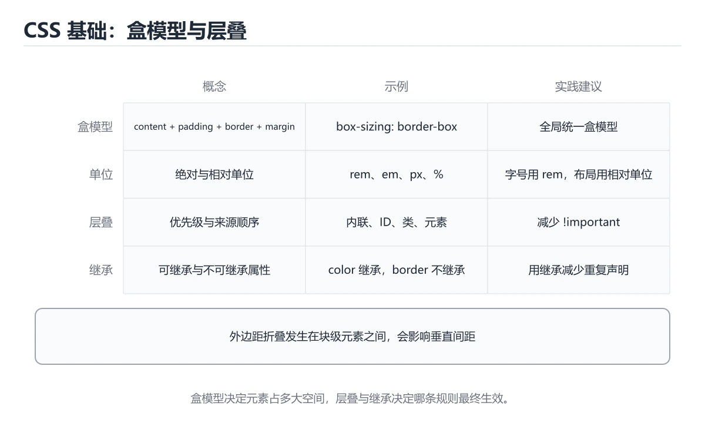
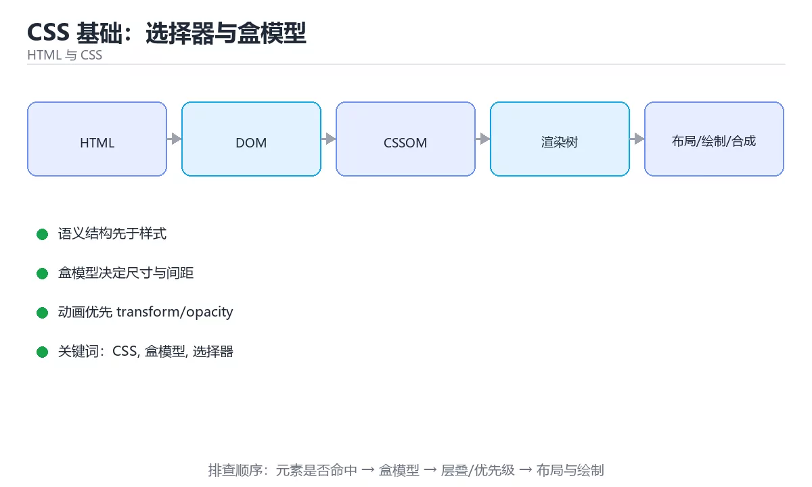

# CSS 基础：选择器与盒模型

> 内容更新时间：2026-10-06 · 学习阶段：入门 · 预计用时：40 分钟





## 本节知识框架

**课程定位**：所属分类 `html_css`（HTML 与 CSS），课程主题 `CSS 基础：选择器与盒模型`，学习阶段 入门，建议用时 40 分钟。

本课主线：选择器与特异性、盒模型、单位与层叠继承。

**学完本课应当能够**
- 说清 `CSS` 与 `盒模型` 的含义与区别，并各举一个正例和一个反例。
- 用本课示例验证 `选择器` 的行为，记录输入、输出与失败条件。
- 遇到「不设 `box-sizing`」这类问题时，能说出触发条件与修复顺序。

### 从概念到验证的学习链条

1. `CSS`：先掌握 CSS 基础的三件事：选择器定位元素、盒模型决定占位、层叠规则决定生效值；先把 border-box 与 CSS 变量用起来，后面的布局与主题会顺很多，再用它解释 `盒模型` 为什么会出现。
2. `盒模型`：先掌握 元素占据的空间 = content + padding + border + margin，再用它解释 `选择器` 为什么会出现。
3. `选择器`：先掌握 用于匹配 HTML 元素并决定样式或查询范围的表达式，再用它解释 `层叠` 为什么会出现。
4. `层叠`：先掌握 CSS 根据来源、优先级和出现顺序决定多条规则最终生效结果，再用它解释 `单位` 为什么会出现。
5. `单位`：先掌握 量度中约定的基准，换算错误会把不同尺度的数据混在一起，再用它解释 本课示例的观察结果 为什么会出现。

**先修与衔接**：本课是「HTML 与 CSS」分类的第 3 课。先修内容：《HTML 基础与语义化》。《HTML 基础与语义化》里的 `HTML`、`语义化` 是本课的前提。相关或后续课程：《CSS 布局：Flex、Grid 与响应式》。

### 完成判据

- **定义关**：不看正文也能说明 `CSS` 是 CSS 基础的三件事：选择器定位元素、盒模型决定占位、层叠规则决定生效值，先把 border-box 与 CSS 变量用起来，后面的布局与主题会顺很多，并指出一个反例。
- **机制关**：能按“输入 → 转换 → 输出 → 验证”复述 `CSS 基础：选择器与盒模型`，而不是只背结论。
- **示例关**：能运行或推演 `CSS 基础：选择器与盒模型` 的 `text` 示例，并说明一个真实出现的标识符或字面量。
- **证据关**：能指出 `CSS 基础：选择器与盒模型` 示例里的 调用了 `clamp()`，并说明它支持或反驳了本课的哪一条结论。
- **排错关**：能复现 不设 `box-sizing`，记录现象并按 全局设 `border-box` 修复。
- **迁移关**：能把 `CSS`、`盒模型`、`选择器`、`层叠` 放进一个与 `CSS 基础：选择器与盒模型` 不同的项目场景，并保持输入与验证条件可追踪。
- **复盘关**：学完 `CSS 基础：选择器与盒模型` 后，用一句话写下仍然不确定的结论，并列出下一次验证需要的输入、环境和成功判据。

### 复习清单

- [ ] 能不看正文复述本课核心术语，并指出一个边界或反例。
- [ ] 能运行或推演本课示例，记录输入、输出与失败现象。
- [ ] 能完成一次自测，并把错题对照错误表定位原因。

## 核心概念定义

| 术语 | 操作性定义 | 常见边界与风险 |
| --- | --- | --- |
| CSS | CSS 基础的三件事：选择器定位元素、盒模型决定占位、层叠规则决定生效值；先把 border-box 与 CSS 变量用起来，后面的布局与主题会顺很多。 | 结果依赖数据分布、模型版本与算力预算，换数据集或换硬件都要重新评估。 |
| 盒模型 | 元素占据的空间 = content + padding + border + margin。 | 只在「元素占据的空间 = content + padding + border + margin」这一前提下成立，换输入或换环境要重新验证。 |
| 选择器 | 用于匹配 HTML 元素并决定样式或查询范围的表达式。 | 易错：一处结构变更全站样式崩；正确做法是用类名。 |
| 层叠 | CSS 根据来源、优先级和出现顺序决定多条规则最终生效结果。 | 只在「CSS 根据来源、优先级和出现顺序决定多条规则最终生效结果」这一前提下成立，换输入或换环境要重新验证。 |
| 单位 | 量度中约定的基准，换算错误会把不同尺度的数据混在一起。 | 结论随输入规模变化，小规模成立不代表大规模成立，需要重新测量。 |
| content-box（默认） | 200 + 40 + 4 = 244px | 只在「200 + 40 + 4 = 244px」这一前提下成立，换输入或换环境要重新验证。 |
| border-box | 200px | 易错：宽度计算总是超出预期；正确做法是全局设 `border-box`。 |
| content-box | 宽高只含内容，padding 与 border 额外增加 | 只在「宽高只含内容，padding 与 border 额外增加」这一前提下成立，换输入或换环境要重新验证。 |
| border-box | 宽高包含 padding 与 border（推荐全局设置） | 易错：宽度计算总是超出预期；正确做法是全局设 `border-box`。 |
| margin 塌陷 | 相邻块级元素的垂直外边距会合并 | 只在「相邻块级元素的垂直外边距会合并」这一前提下成立，换输入或换环境要重新验证。 |
| px | 绝对单位 | 易错：用户放大字号无效；正确做法是用 `rem` 与系统字号。 |
| rem | 相对根字号，适合整体缩放 | 易错：用户放大字号无效；正确做法是用 `rem` 与系统字号。 |
| em | 相对当前字号，嵌套会累乘 | 易错：用户放大字号无效；正确做法是用 `rem` 与系统字号。 |
| % | 相对父元素对应尺寸 | 只在「相对父元素对应尺寸」这一前提下成立，换输入或换环境要重新验证。 |
| vw / vh | 相对视口（注意移动端地址栏变化） | 只在「相对视口（注意移动端地址栏变化）」这一前提下成立，换输入或换环境要重新验证。 |
| clamp() | 在最小与最大之间弹性取值 | 只在「在最小与最大之间弹性取值」这一前提下成立，换输入或换环境要重新验证。 |

## 原理与运行机制

### 机制总览

**教材衔接：引入方式与优先级**

行内样式 > ID 选择器 > 类/属性/伪类 > 标签/伪元素。实际项目应避免行内样式与 `!important`，用类选择器配合低特异性写法。

**教材衔接：选择器**

| 选择器 | 示例 |
| --- | --- |
| 类 / ID | `.card` / `#app` |
| 属性 | `input[type="text"]` |
| 伪类 | `:hover`、`:focus-visible`、`:nth-child(2n)` |
| 伪元素 | `::before`、`::after`、`::placeholder` |
| 组合 | 后代（空格）、子代（>）、相邻（+）、通用兄弟（~） |

**教材衔接：单位与颜色**

绝对单位 px；相对单位 %、em（相对父级字号）、rem（相对根字号，推荐用于字号与间距）、vw/vh、ch。颜色支持 hex、rgb/rgba、hsl/hsla（调亮度更直观）、`color-mix()`；现代写法可直接用 `oklch()`。

**教材衔接：层叠与继承**

冲突时按「来源与重要性 → 特异性 → 书写顺序」决定。可继承属性（color、font、line-height）会向下传递；不可继承（width、margin）不会。用 CSS 变量集中管理设计令牌（颜色、间距、圆角）。

**教材衔接：选择器特异性计算**

特异性用 (a, b, c) 三位表示：a = ID 数量，b = 类/属性/伪类数量，c = 标签/伪元素数量。逐位比较，大者胜；相同则后写的胜。

| 选择器 | 特异性 | 说明 |
| --- | --- | --- |
| `div` | 0,0,1 | 标签 |
| `.card` | 0,1,0 | 类 |
| `.card .title` | 0,2,0 | 两个类 |
| `#app .card` | 1,1,0 | ID + 类，ID 权重更高 |
| `a:hover` | 0,1,1 | 伪类算作 b |
| `div[data-x="1"]` | 0,1,1 | 属性算作 b |

实践建议：把样式写在单一类选择器上（0,1,0），避免多层嵌套与 ID 选择器，这样后续覆盖时不必动用 `!important`。收到"样式不生效"的报障时，第一步用 DevTools 看是哪条规则胜出、被谁覆盖，而不是直接加 `!important`。

**教材衔接：选择器特异性速查**

| 选择器 | 特异性 | 说明 |
| --- | --- | --- |
| 行内样式 | 1,0,0,0 | 最高（除 `!important`） |
| `#id` | 0,1,0,0 | 尽量少用 |
| `.class`、`[attr]`、`:hover` | 0,0,1,0 | 日常主力 |
| 元素、伪元素 | 0,0,0,1 | 低特异性 |
| `*`、组合器 | 0,0,0,0 | 无特异性 |
| `!important` | 覆盖一切 | 只作最后手段 |

规则：**优先用类选择器，保持特异性扁平**，避免为了覆盖而不断加权重。

**教材衔接：层叠与继承速查**

| 因素 | 优先级 |
| --- | --- |
| 来源与重要性 | 用户 `!important` 大于作者 `!important` |
| 层（`@layer`） | 后声明的层优先 |
| 特异性 | 高者优先 |
| 出现顺序 | 同特异性时后出现者优先 |

可继承属性：`color`、`font-*`、`line-height`、`visibility`、`cursor` 等；`margin`、`padding`、`border`、`width` 默认不继承。

### 机制拆解：每一步的输入、动作与输出

#### 1. `CSS`
- 输入：`CSS`；本步把 CSS 基础的三件事：选择器定位元素、盒模型决定占位、层叠规则决定生效值；先把 border-box 与 CSS 变量用起来，后面的布局与主题会顺很多 当作判断规则。
- 动作：围绕 `CSS` 保留中间状态，并记录它与 `盒模型` 的对应关系。
- 输出：`盒模型`，它可以被下一段代码、测试或记录继续使用。
- `CSS` 的失败条件：结果依赖数据分布、模型版本与算力预算，换数据集或换硬件都要重新评估。

#### 2. `盒模型`
- 输入：`CSS`；本步把 元素占据的空间 = content + padding + border + margin 当作判断规则。
- 动作：围绕 `盒模型` 保留中间状态，并记录它与 `选择器` 的对应关系。
- 输出：`选择器`，它可以被下一段代码、测试或记录继续使用。
- `盒模型` 的失败条件：只在「元素占据的空间 = content + padding + border + margin」这一前提下成立，换输入或换环境要重新验证。

#### 3. `选择器`
- 输入：`盒模型`；本步把 用于匹配 HTML 元素并决定样式或查询范围的表达式 当作判断规则。
- 动作：围绕 `选择器` 保留中间状态，并记录它与 `层叠` 的对应关系。
- 输出：`层叠`，它可以被下一段代码、测试或记录继续使用。
- `选择器` 的失败条件：当依赖元素选择器时，会出现一处结构变更全站样式崩。

#### 4. `层叠`
- 输入：`选择器`；本步把 CSS 根据来源、优先级和出现顺序决定多条规则最终生效结果 当作判断规则。
- 动作：围绕 `层叠` 保留中间状态，并记录它与 `单位` 的对应关系。
- 输出：`单位`，它可以被下一段代码、测试或记录继续使用。
- `层叠` 的失败条件：只在「CSS 根据来源、优先级和出现顺序决定多条规则最终生效结果」这一前提下成立，换输入或换环境要重新验证。

#### 5. `单位`
- 输入：`层叠`；本步把 量度中约定的基准，换算错误会把不同尺度的数据混在一起 当作判断规则。
- 动作：围绕 `单位` 保留中间状态，并记录它与 `clamp` 的对应关系。
- 输出：`clamp`，它可以被下一段代码、测试或记录继续使用。
- `单位` 的失败条件：结论随输入规模变化，小规模成立不代表大规模成立，需要重新测量。

### 示例中的可观察事实

1. 调用了 `clamp()`；它对应的课程主题是 `CSS 基础：选择器与盒模型`。
2. 出现字面量 `Segoe UI`；它对应的课程主题是 `CSS 基础：选择器与盒模型`。

### 复现实验记录

- 环境：`CSS 基础：选择器与盒模型` 使用 `text` 示例，固定 `CSS`、`盒模型`、`选择器`、`层叠` 作为第一组条件。
- 首轮输入：先确认 调用了 `clamp()`，预测 `CSS` 会怎样变化。
- 基线观察：记录命令、输入、输出和错误原文，不用截图代替可复制的文本。
- 单变量修改：只改变 `CSS`，观察 `单位` 是否仍满足定义。
- 失败注入：复现 不设 `box-sizing`，确认现象是 宽度计算总是超出预期。
- 记录结论：把“修改前、修改后、预期变化、实际变化”写成四列表，这样复盘 `CSS 基础：选择器与盒模型` 时才能区分概念错误与实现错误。

## 典型应用场景

- **不设 `box-sizing`**：典型现象是宽度计算总是超出预期；正确做法是全局设 `border-box`。
- **用 `!important` 解决覆盖**：典型现象是特异性战争；正确做法是降低特异性或用层。
- **用 `px` 设所有字号**：典型现象是用户放大字号无效；正确做法是用 `rem` 与系统字号。
- **给 `html` 设固定 `font-size: 62.5%`**：典型现象是影响可访问性；正确做法是用 `100%` 并按需换算。

### 最小验证场景

- 准备：保留 `text` 示例的原始输入，先记录 `CSS 基础：选择器与盒模型` 的基线输出和完整运行命令。
- 观察：先核对 调用了 `clamp()`，再改变一个与 `CSS` 相关的条件。
- 判定：新结果与 `CSS 基础：选择器与盒模型` 的基线不同不等于错误；只有当差异破坏了 `CSS` 的定义或错误表中的约束，才判定为失败。

### 选择与边界

- 使用 `CSS` 时，先满足它的定义：CSS 基础的三件事：选择器定位元素、盒模型决定占位、层叠规则决定生效值；先把 border-box 与 CSS 变量用起来，后面的布局与主题会顺很多；结果依赖数据分布、模型版本与算力预算，换数据集或换硬件都要重新评估。
- 使用 `盒模型` 时，先满足它的定义：元素占据的空间 = content + padding + border + margin；只在「元素占据的空间 = content + padding + border + margin」这一前提下成立，换输入或换环境要重新验证。
- 使用 `选择器` 时，先满足它的定义：用于匹配 HTML 元素并决定样式或查询范围的表达式；易错：一处结构变更全站样式崩；正确做法是用类名。
- 使用 `层叠` 时，先满足它的定义：CSS 根据来源、优先级和出现顺序决定多条规则最终生效结果；只在「CSS 根据来源、优先级和出现顺序决定多条规则最终生效结果」这一前提下成立，换输入或换环境要重新验证。
- 使用 `单位` 时，先满足它的定义：量度中约定的基准，换算错误会把不同尺度的数据混在一起；结论随输入规模变化，小规模成立不代表大规模成立，需要重新测量。

## 代码/协议/SQL 示例

### 最小可验证示例

```text
*, *::before, *::after { box-sizing: border-box; }
```

**教材衔接：原文最小示例**

```text
*, *::before, *::after { box-sizing: border-box; }
```

```css
/* 现代基础重置：统一盒模型并尊重系统字号 */
*,
*::before,
*::after {
  box-sizing: border-box;
}

html {
  font-size: 100%;          /* 尊重用户浏览器设置 */
  line-height: 1.5;
  -webkit-text-size-adjust: 100%;
}

body {
  margin: 0;
  font-family: system-ui, -apple-system, "Segoe UI", sans-serif;
  color: #1f2937;
  background: #ffffff;
}

img,
svg,
video {
  max-width: 100%;
  height: auto;
  display: block;
}

/* 用 clamp 做流体排版，避免正文字号随视口无限放大 */
article {
  max-width: 68ch;
  margin-inline: auto;
  padding-inline: clamp(1rem, 4vw, 2.5rem);
}

h1 {
  font-size: clamp(1.75rem, 1.2rem + 2vw, 2.75rem);
  line-height: 1.25;
}

/* 焦点可见：鼠标点击不显示，键盘操作必须显示 */
button:focus-visible,
a:focus-visible {
  outline: 2px solid #2563eb;
  outline-offset: 2px;
}
```

### 示例精读：先找证据，再改一个条件

1. 调用了 `clamp()`；它出现在 `CSS 基础：选择器与盒模型` 的示例中，阅读时先确认它前后各发生了什么。
2. 出现字面量 `Segoe UI`；它出现在 `CSS 基础：选择器与盒模型` 的示例中，阅读时先确认它前后各发生了什么。
- 在 `CSS 基础：选择器与盒模型` 中与 `CSS` 对照：示例必须能支持 CSS 基础的三件事：选择器定位元素、盒模型决定占位、层叠规则决定生效值；先把 border-box 与 CSS 变量用起来，后面的布局与主题会顺很多，否则说明这一段还缺少实现或验证步骤。
- 在 `CSS 基础：选择器与盒模型` 中与 `盒模型` 对照：示例必须能支持 元素占据的空间 = content + padding + border + margin，否则说明这一段还缺少实现或验证步骤。
- 在 `CSS 基础：选择器与盒模型` 中与 `选择器` 对照：示例必须能支持 用于匹配 HTML 元素并决定样式或查询范围的表达式，否则说明这一段还缺少实现或验证步骤。
- 在 `CSS 基础：选择器与盒模型` 中与 `层叠` 对照：示例必须能支持 CSS 根据来源、优先级和出现顺序决定多条规则最终生效结果，否则说明这一段还缺少实现或验证步骤。

## 时间/空间复杂度或性能分析

**性能关注点（CSS 基础：选择器与盒模型）**：浏览器渲染是关键路径：关注首屏时间、重排与重绘次数、资源体积。

**测量方法**：以 `CSS 基础：选择器与盒模型` 的 `CSS` 场景为对象，固定输入跑一遍记录基线，再把规模或并发度提高一个数量级复测；两次结果的差值与波动范围才是结论依据。

### 需要控制的变量与记录项

- `CSS 基础：选择器与盒模型` 的 `CSS`：固定它的版本、输入范围和资源上限，分别记录速度、内存与失败率的变化。
- `CSS 基础：选择器与盒模型` 的 `盒模型`：固定它的版本、输入范围和资源上限，分别记录速度、内存与失败率的变化。
- `CSS 基础：选择器与盒模型` 的 `选择器`：固定它的版本、输入范围和资源上限，分别记录速度、内存与失败率的变化。
- `CSS 基础：选择器与盒模型` 的 `层叠`：固定它的版本、输入范围和资源上限，分别记录速度、内存与失败率的变化。
- `CSS 基础：选择器与盒模型` 的 `单位`：固定它的版本、输入范围和资源上限，分别记录速度、内存与失败率的变化。
- `CSS 基础：选择器与盒模型` 中 `CSS` 的边界：结果依赖数据分布、模型版本与算力预算，换数据集或换硬件都要重新评估。达到边界时不要外推，必须重新测量。
- `CSS 基础：选择器与盒模型` 中 `盒模型` 的边界：只在「元素占据的空间 = content + padding + border + margin」这一前提下成立，换输入或换环境要重新验证。达到边界时不要外推，必须重新测量。
- `CSS 基础：选择器与盒模型` 中 `选择器` 的边界：易错：一处结构变更全站样式崩；正确做法是用类名。达到边界时不要外推，必须重新测量。
- `CSS 基础：选择器与盒模型` 中 `层叠` 的边界：只在「CSS 根据来源、优先级和出现顺序决定多条规则最终生效结果」这一前提下成立，换输入或换环境要重新验证。达到边界时不要外推，必须重新测量。
- `CSS 基础：选择器与盒模型` 中 `单位` 的边界：结论随输入规模变化，小规模成立不代表大规模成立，需要重新测量。达到边界时不要外推，必须重新测量。
- `CSS 基础：选择器与盒模型` 的代码证据：先验证 调用了 `clamp()`，再记录该路径的输入规模与耗时；只看代码行数不能推出复杂度。

## 常见误区与易错点

| 容易写错的做法 | 实际现象 | 原因与正确做法 |
| --- | --- | --- |
| 不设 `box-sizing` | 宽度计算总是超出预期 | 全局设 `border-box` |
| 用 `!important` 解决覆盖 | 特异性战争 | 降低特异性或用层 |
| 用 `px` 设所有字号 | 用户放大字号无效 | 用 `rem` 与系统字号 |
| 给 `html` 设固定 `font-size: 62.5%` | 影响可访问性 | 用 `100%` 并按需换算 |
| 用 `em` 层层嵌套 | 字号被累乘放大 | 改用 `rem` |
| 忘记移动端图片自适应 | 图片溢出 | 全局 `max-width: 100%` |
| 用 `height: 100vh` 做移动端满屏 | 地址栏导致跳动 | 用 `100dvh` 或 `min-height` |
| 去掉 `outline` | 键盘不可用 | 用 `:focus-visible` 自定义 |
| 依赖元素选择器 | 一处结构变更全站样式崩 | 用类名 |
| 内联样式写业务样式 | 无法复用与覆盖 | 交给样式表与类 |
| 不设 box-sizing | 宽度计算总是超出预期。 | 全局设 border-box。 |
| 用 px 设所有字号 | 用户放大字号无效。 | 用 rem 与系统字号。 |
| 给 html 设固定 font-size: 62.5% | 影响可访问性。 | 用 100% 并按需换算。 |

### 现场 1：不设 `box-sizing`

**症状**：宽度计算总是超出预期。

**根因与修复**：全局设 `border-box`。

**自检**：在本课示例里复现「不设 `box-sizing`」，改成全局设 `border-box`后重跑；如果症状消失且失败路径按预期变化，说明定位正确。

### 现场 2：用 `!important` 解决覆盖

**症状**：特异性战争。

**根因与修复**：降低特异性或用层。

**自检**：在本课示例里复现「用 `!important` 解决覆盖」，改成降低特异性或用层后重跑；如果症状消失且失败路径按预期变化，说明定位正确。

### 现场 3：用 `px` 设所有字号

**症状**：用户放大字号无效。

**根因与修复**：用 `rem` 与系统字号。

**自检**：在本课示例里复现「用 `px` 设所有字号」，改成用 `rem` 与系统字号后重跑；如果症状消失且失败路径按预期变化，说明定位正确。

### 现场 4：给 `html` 设固定 `font-size: 62.5%`

**症状**：影响可访问性。

**根因与修复**：用 `100%` 并按需换算。

**自检**：在本课示例里复现「给 `html` 设固定 `font-size: 62.5%`」，改成用 `100%` 并按需换算后重跑；如果症状消失且失败路径按预期变化，说明定位正确。

### 现场 5：用 `em` 层层嵌套

**症状**：字号被累乘放大。

**根因与修复**：改用 `rem`。

**自检**：在本课示例里复现「用 `em` 层层嵌套」，改成改用 `rem`后重跑；如果症状消失且失败路径按预期变化，说明定位正确。

### 现场 6：忘记移动端图片自适应

**症状**：图片溢出。

**根因与修复**：全局 `max-width: 100%`。

**自检**：在本课示例里复现「忘记移动端图片自适应」，改成全局 `max-width: 100%`后重跑；如果症状消失且失败路径按预期变化，说明定位正确。

### 现场 7：用 `height: 100vh` 做移动端满屏

**症状**：地址栏导致跳动。

**根因与修复**：用 `100dvh` 或 `min-height`。

**自检**：在本课示例里复现「用 `height: 100vh` 做移动端满屏」，改成用 `100dvh` 或 `min-height`后重跑；如果症状消失且失败路径按预期变化，说明定位正确。

### 现场 8：去掉 `outline`

**症状**：键盘不可用。

**根因与修复**：用 `:focus-visible` 自定义。

**自检**：在本课示例里复现「去掉 `outline`」，改成用 `:focus-visible` 自定义后重跑；如果症状消失且失败路径按预期变化，说明定位正确。

### 现场 9：依赖元素选择器

**症状**：一处结构变更全站样式崩。

**根因与修复**：用类名。

**自检**：在本课示例里复现「依赖元素选择器」，改成用类名后重跑；如果症状消失且失败路径按预期变化，说明定位正确。

## 与其他知识点的关系

**教材衔接：复习与迁移**

### 概念复述

- 用一句话说明「CSS 基础：选择器与盒模型」解决什么问题：选择器与特异性、盒模型、单位与层叠继承。
- 写出CSS、盒模型、选择器之间的关系，并各举一个例子。
- 说出本课最容易混淆的两个概念，以及区分它们的判据。

### 正文逐节复核

- **引入方式与优先级**：行内样式 > ID 选择器 > 类/属性/伪类 > 标签/伪元素。
- **单位与颜色**：绝对单位 px；相对单位 %、em（相对父级字号）、rem（相对根字号，推荐用于字号与间距）、vw/vh、ch。
- **盒模型与单位实例**：单位选择经验：字号与间距用 rem（跟随根字号，利于无障碍缩放）；行高用无单位数值（相对自身字号）；视口相关尺寸用 vw/vh 或 dvh；只有边框、发丝线用 px。
- **选择器特异性计算**：实践建议：把样式写在单一类选择器上（0,1,0），避免多层嵌套与 ID 选择器，这样后续覆盖时不必动用 `!
- **选择器特异性速查**：规则：**优先用类选择器，保持特异性扁平**，避免为了覆盖而不断加权重。
- **实践任务**：本节围绕CSS 基础：选择器与盒模型安排 3 个可交付任务，每个任务都要求留下可以复查的记录。


### 迁移练习

- **先修**：`HTML 基础与语义化`。本课默认这些内容已经掌握。
- **相关或后续**：`CSS 布局：Flex、Grid 与响应式`。本课术语会在这些课程里继续使用。
- **术语归属**：`CSS`、`盒模型`、`选择器` 的定义以本课「核心概念定义」为准，换到其他课程时先确认定义是否被改写。
- 同一分类的《CSS 布局：Flex、Grid 与响应式》也涉及 `CSS`；两课衔接时先确认这个术语的定义是否一致。
- 同一分类的《CSS 进阶：变量、伪类与现代特性》也涉及 `CSS`；两课衔接时先确认这个术语的定义是否一致。

### 先修与后续术语接口

- `HTML 基础与语义化`：两者通过本分类的学习顺序衔接，阅读时重点比较各自的输入与失败条件。
- `CSS 布局：Flex、Grid 与响应式`：共享术语 `CSS`，共同关键词 `CSS`。

### 容易混淆的相邻概念

- `CSS` 与 `盒模型`：前者强调 CSS 基础的三件事：选择器定位元素、盒模型决定占位、层叠规则决定生效值；先把 border-box 与 CSS 变量用起来，后面的布局与主题会顺很多；后者强调 元素占据的空间 = content + padding + border + margin。判断时分别检查两条定义的适用范围，不要只看名称相似就互换。
- `盒模型` 与 `选择器`：前者强调 元素占据的空间 = content + padding + border + margin；后者强调 用于匹配 HTML 元素并决定样式或查询范围的表达式。判断时分别检查两条定义的适用范围，不要只看名称相似就互换。
- `选择器` 与 `层叠`：前者强调 用于匹配 HTML 元素并决定样式或查询范围的表达式；后者强调 CSS 根据来源、优先级和出现顺序决定多条规则最终生效结果。判断时分别检查两条定义的适用范围，不要只看名称相似就互换。
- `层叠` 与 `单位`：前者强调 CSS 根据来源、优先级和出现顺序决定多条规则最终生效结果；后者强调 量度中约定的基准，换算错误会把不同尺度的数据混在一起。判断时分别检查两条定义的适用范围，不要只看名称相似就互换。

## 自测题与参考答案

> 先独立作答，再对照参考答案；答案都能在本课正文、术语表或错误表里找到依据。

### 自测 1（概念复述）

不看正文，写出 `CSS` 的操作性定义，并说明它与 `盒模型` 的区别。

**参考答案**：CSS 基础的三件事：选择器定位元素、盒模型决定占位、层叠规则决定生效值；先把 border-box 与 CSS 变量用起来，后面的布局与主题会顺很多。

`盒模型` 的定位是：元素占据的空间 = content + padding + border + margin；两者的差别要从适用对象与失败模式上说明。

### 自测 2（排错）

本课错误表记录了「不设 `box-sizing`」这类做法。请写出它会出现的现象、根因，以及修复顺序。

**参考答案**：现象是宽度计算总是超出预期；正确做法是全局设 `border-box`。修复时先复现现象并保留证据，再改动一处假设重跑，确认现象消失。

### 自测 3（动手验证）

运行本课的 `text` 示例，改动其中一个输入后重新运行，记录输出与错误信息。

**参考答案**：正常输入下 `text` 示例应当复现正文给出的结果；改动输入后，如果结果改变或报错，先核对它是否满足 `CSS 基础：选择器与盒模型` 中`CSS` 的适用范围，再检查错误表里是否有同类现象。

### 自测 4（代码阅读）

阅读本课开头的 `text` 示例，说明它体现了`CSS` 的哪一条性质，并指出改动哪个输入会让这条性质不再成立。

**参考答案**：`CSS` 的定义是 CSS 基础的三件事：选择器定位元素、盒模型决定占位、层叠规则决定生效值，先把 border-box 与 CSS 变量用起来，后面的布局与主题会顺很多，示例正是在实现这条定义。改动与 `CSS` 有关的一个输入后，如果结果不再符合 `CSS 基础：选择器与盒模型` 的正文描述，就说明该性质只在当前前提成立。

### 自测 5（迁移）

把 `CSS 基础：选择器与盒模型` 的方法迁移到自己的项目：围绕 `CSS` 写出一个与错误表同类的风险点，并说明触发条件和检验方式。

**参考答案**：例如「给 html 设固定 font-size: 62.5%」，它会导致影响可访问性；检验方式是按用 100% 并按需换算改一处再复现，确认现象消失且没有引入新的失败分支。

### 自测 6（对比）

用一个表格对比 `CSS` 与 `盒模型`：各写一行适用场景、一行失败表现。

**参考答案**：`CSS` 的定义是CSS 基础的三件事：选择器定位元素、盒模型决定占位、层叠规则决定生效值；先把 border-box 与 CSS 变量用起来，后面的布局与主题会顺很多；`盒模型` 的定义是元素占据的空间 = content + padding + border + margin。两者的失败表现分别对应本课错误表里与本术语相关的行。

### 自测 7（排错顺序）

面对「不设 `box-sizing`」引发的问题，请把“复现 宽度计算总是超出预期 → 保留证据 → 全局设 `border-box` → 回归验证”四步写成可执行的检查清单。

**参考答案**：第一步按宽度计算总是超出预期复现；第二步记录输入、版本与完整报错；第三步按全局设 `border-box`只改一处；第四步重跑并确认失败路径也按预期变化。

### 自测 8（边界判断）

针对 `单位`，分别写出“可以使用”的条件和“结论不再成立”的条件。

**参考答案**：结论随输入规模变化，小规模成立不代表大规模成立，需要重新测量。 同时要把 `单位` 的定义 量度中约定的基准，换算错误会把不同尺度的数据混在一起 与实际输入逐项对照。

### 自测 9（机制重建）

不看正文，按输入、转换、输出、验证四段重建 `CSS` → `盒模型` → `选择器` → `层叠` 的作用链。

**参考答案**：起点是 `CSS` 的定义 CSS 基础的三件事：选择器定位元素、盒模型决定占位、层叠规则决定生效值；先把 border-box 与 CSS 变量用起来，后面的布局与主题会顺很多；中间每一步都保留可观察状态；终点由 `单位` 检查，失败时回到错误表定位第一个偏离定义的步骤。

### 自测 10（综合排错）

在 `CSS 基础：选择器与盒模型` 中，现象是 影响可访问性。请围绕 给 html 设固定 font-size: 62.5% 写出最小复现、关键证据、修复动作和回归验证，并说明为什么不能只凭一次运行下结论。

**参考答案**：先复现 给 html 设固定 font-size: 62.5%，记录输入与完整错误；再按 用 100% 并按需换算 只改一处。回归时同时跑正常路径和边界路径，只有两次结果都可解释，才把修复视为完成。

### 自测 11（一分钟复述）

用每分钟约 200 字的速度复述 `CSS 基础：选择器与盒模型`：先给主问题，再按顺序说出 `CSS`、`盒模型`、`选择器`、`层叠`，最后给一个失败案例。

**自评标准**：主问题必须对应 选择器与特异性、盒模型、单位与层叠继承；每个术语都要能接上一句定义或边界；失败案例必须写成可观察现象，不能用“可能有风险”代替证据。

## 术语速查

| 术语 | 一句话说明 |
| --- | --- |
| `CSS` | CSS 基础的三件事：选择器定位元素、盒模型决定占位、层叠规则决定生效值；先把 border-box 与 CSS 变量用起来，后面的布局与主题会顺很多。 |
| `盒模型` | 元素占据的空间 = content + padding + border + margin。 |
| `选择器` | 用于匹配 HTML 元素并决定样式或查询范围的表达式。 |
| `层叠` | CSS 根据来源、优先级和出现顺序决定多条规则最终生效结果。 |
| `单位` | 量度中约定的基准，换算错误会把不同尺度的数据混在一起。 |

**术语关系**：`CSS`（CSS 基础的三件事：选择器定位元素、盒模型决定占位、层叠规则决定生效值） → `盒模型`（元素占据的空间 = content + padding + border + margin） → `选择器`（用于匹配 HTML 元素并决定样式或查询范围的表达式） → `层叠`（CSS 根据来源、优先级和出现顺序决定多条规则最终生效结果）。

## 考点精讲

`CSS 基础：选择器与盒模型` 的题库有 6 道题，下面逐题给出题干、正确项与判断依据：先自己作答，再核对正确项，最后回到正文对应小节复核。

### 考点 1：第 1 题

- **题目**：围绕“CSS 基础：选择器与盒模型”中的 CSS、盒模型、选择器，下列哪两项是本课强调的实践判断？
- **正确项**：学习 CSS 时要同时说明输入、输出和失败路径，不能只看正常流程；验证 盒模型 时要固定版本并覆盖边界输入，结论才可复现
- **判断依据**：这道题落在术语 `CSS` 上：CSS 基础的三件事：选择器定位元素、盒模型决定占位、层叠规则决定生效值，先把 border-box 与 CSS 变量用起来，后面的布局与主题会顺很多。复习时把 `CSS` 的定义、适用边界和一个反例一起说清楚，再回到「核心概念定义」核对原文。

### 考点 2：第 2 题

- **题目**：rem 相对什么计算？
- **正确项**：根元素字号
- **判断依据**：这道题检验本课主问题：选择器与特异性、盒模型、单位与层叠继承。复习时先复述本课主问题，再举一个会让结论失效的输入。

### 考点 3：第 3 题

- **题目**：阅读 `CSS 基础：选择器与盒模型` 的 `CSS` 示例。它服务于选择器与特异性、盒模型、单位与层叠继承。代码中实际包含下列哪一项？
- **正确项**：出现字面量 `Segoe UI`
- **判断依据**：这道题落在术语 `CSS` 上：CSS 基础的三件事：选择器定位元素、盒模型决定占位、层叠规则决定生效值，先把 border-box 与 CSS 变量用起来，后面的布局与主题会顺很多。复习时把 `CSS` 的定义、适用边界和一个反例一起说清楚，再回到「核心概念定义」核对原文。

### 考点 4：第 4 题

- **题目**：margin: 10px 20px 表示？
- **正确项**：上下 10px、左右 20px
- **判断依据**：这道题检验本课主问题：选择器与特异性、盒模型、单位与层叠继承。复习时先复述本课主问题，再举一个会让结论失效的输入。

### 考点 5：第 5 题

- **题目**：下面哪组属性默认会被子元素继承？
- **正确项**：color、font-size
- **判断依据**：这道题检验本课主问题：选择器与特异性、盒模型、单位与层叠继承。复习时先复述本课主问题，再举一个会让结论失效的输入。

### 考点 6：第 6 题

- **题目**：下面几项都与 `CSS` 有关，请按 `CSS 基础：选择器与盒模型` 的正文顺序排列；该课主线是选择器与特异性、盒模型、单位与层叠继承。
- **正确项**：引入方式与优先级 → 选择器 → 盒模型 → 单位与颜色
- **判断依据**：这道题落在术语 `CSS` 上：CSS 基础的三件事：选择器定位元素、盒模型决定占位、层叠规则决定生效值，先把 border-box 与 CSS 变量用起来，后面的布局与主题会顺很多。复习时把 `CSS` 的定义、适用边界和一个反例一起说清楚，再回到「核心概念定义」核对原文。

### 考点 7：`CSS`

- **要点**：CSS 基础的三件事：选择器定位元素、盒模型决定占位、层叠规则决定生效值；先把 border-box 与 CSS 变量用起来，后面的布局与主题会顺很多。
- **CSS 的边界**：结果依赖数据分布、模型版本与算力预算，换数据集或换硬件都要重新评估。

### 考点 8：`盒模型`

- **要点**：元素占据的空间 = content + padding + border + margin。
- **盒模型 的边界**：只在「元素占据的空间 = content + padding + border + margin」这一前提下成立，换输入或换环境要重新验证。

### 考点 9：`选择器`

- **要点**：用于匹配 HTML 元素并决定样式或查询范围的表达式。
- **选择器 的边界**：易错：一处结构变更全站样式崩；正确做法是用类名。

### 考点 10：`层叠`

- **要点**：CSS 根据来源、优先级和出现顺序决定多条规则最终生效结果。
- **层叠 的边界**：只在「CSS 根据来源、优先级和出现顺序决定多条规则最终生效结果」这一前提下成立，换输入或换环境要重新验证。

### 考点 11：`单位`

- **要点**：量度中约定的基准，换算错误会把不同尺度的数据混在一起。
- **单位 的边界**：结论随输入规模变化，小规模成立不代表大规模成立，需要重新测量。

### 考点 12：排错——不设 `box-sizing`

- **现象**：宽度计算总是超出预期。
- **处理**：全局设 `border-box`。

### 考点 13：排错——用 `!important` 解决覆盖

- **现象**：特异性战争。
- **处理**：降低特异性或用层。

### 考点 14：综合辨析——`CSS` 与 `单位`

- **辨析点**：`CSS` 的定义是 CSS 基础的三件事：选择器定位元素、盒模型决定占位、层叠规则决定生效值；先把 border-box 与 CSS 变量用起来，后面的布局与主题会顺很多；`单位` 的定义是 量度中约定的基准，换算错误会把不同尺度的数据混在一起。
- **答题要求**：面对 `CSS 基础：选择器与盒模型` 的题目，先判断描述的是 `CSS` 还是 `单位`，再归到对应定义，最后写出一个会让该定义失效的边界输入。

### 考点 15：排错评分点

- **现象分**：能写出 宽度计算总是超出预期，而不是只写“程序有错”。
- **证据分**：保留触发 不设 `box-sizing` 的输入、版本和错误原文。
- **修复分**：按 全局设 `border-box` 只改一处，并同时回归正常路径与边界路径。

## 内容元数据

- 内容版本：v2.0
- 最后更新：2026-10-06
- 学习阶段：入门
- 适用环境：现代浏览器（Chrome/Firefox/Safari）；本课聚焦 CSS。
- 内容来源：内置结构化课程与工程实践整理
- 相关主题：CSS、盒模型、选择器、层叠、单位
- 质量版本：P0 测验标准 + P1 覆盖扩展 + P2 体验补全

## 参考资料与复核

- 最后复核：2026-10-04
- 下次复核：2027-08-17
- 复核范围：版本兼容、API 行为、安全建议与工程实践
- 来源性质：官方文档、标准或权威教材；本课核对关键词：CSS、盒模型、选择器、层叠、单位。

| 参考资料 | 本课用途 |
| --- | --- |
| [MDN CSS](https://developer.mozilla.org/docs/Web/CSS) | CSS 布局、选择器与动画 |
| [MDN DOM](https://developer.mozilla.org/docs/Web/API/Document_Object_Model) | DOM 树与浏览器 API |
| [MDN HTML](https://developer.mozilla.org/docs/Web/HTML) | HTML 语义与文档结构 |

| [本课术语索引：CSS 基础：选择器与盒模型](#核心概念定义) | 按本课输入、术语边界和错误表现逐项核对 |
> 「CSS 基础：选择器与盒模型」的链接用于离线阅读后的延伸核对；App 不会自动联网。