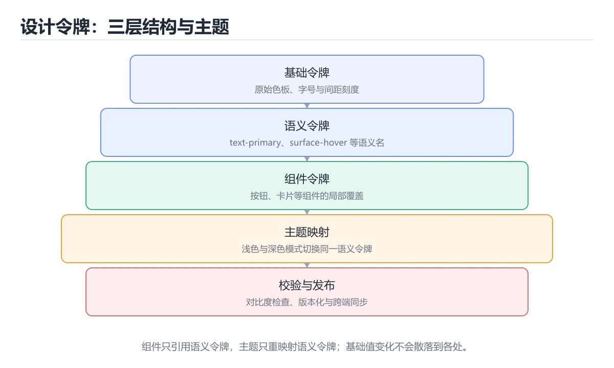
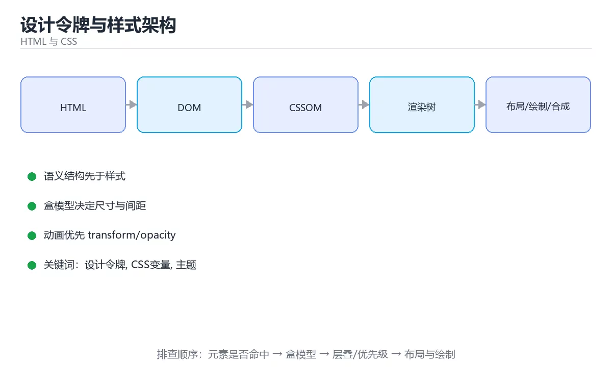

# 设计令牌与样式架构

> 内容更新时间：2026-10-06 · 学习阶段：进阶 · 预计用时：40 分钟





## 本节知识框架

**课程定位**：所属分类为「HTML 与 CSS」，课程主题为「设计令牌与样式架构」，学习阶段为「进阶」，建议用时 40 分钟。

**本课要解决的主问题**：令牌三层结构、命名约定与对比度自动校验。

| 学习层次 | 要回答的问题 | 完成判据 |
| --- | --- | --- |
| 概念层 | 「设计令牌与样式架构」有哪些必须区分的对象与术语？ | 能用自己的话定义核心术语，并各举一个正例和一个反例。 |
| 机制层 | 这些对象按什么顺序发生作用，输入如何变成输出？ | 能画出或写出机制步骤，并说明每一步的失败条件。 |
| 应用层 | 什么场景适合使用「设计令牌与样式架构」，什么场景不适合？ | 能给出一个真实场景、一个最小示例和一个边界案例。 |
| 性能层 | 时间、空间、吞吐或延迟受哪些量影响？ | 能说出复杂度或性能瓶颈的证据来源；没有证据时明确写“材料未提供”。 |
| 复习层 | 怎样确认自己不是只记住了结论？ | 能独立完成本课自测，并把错误定位到概念、机制、示例或边界。 |

### 阅读路线

1. 先读「核心概念定义」，建立「设计令牌」等对象的精确定义。
2. 再读「原理与运行机制」，把定义串成可重复的过程。
3. 用「代码/协议/SQL 示例」验证过程，并只改一个条件观察结果变化。
4. 最后检查性能、易错点、知识关系与自测题，形成可复习的证据链。

**前置知识**：没有硬性先修课；仍建议先具备本分类的基础阅读与操作能力。

**学习位置**：本课位于《CSS 进阶：变量、伪类与现代特性》之后；如果前一课的自测不能通过，应先回补再继续。

**后续衔接**：下一课《可访问性与 ARIA 实战》会继续使用本课术语，学完后建议立即完成一次自测。

**教材衔接：学习目标**

- 能用自己的话解释设计令牌与样式架构解决了什么问题，而不是只背术语。
- 能说清 「设计令牌」、「CSS变量」、「主题」、「设计系统」 之间的关系，并分别举出一个例子。
- 能把 设计令牌 放回「设计令牌与样式架构」的知识体系，说明它和 CSS变量 的边界。
- 能完成本课练习，并用验收标准检查自己的结果。

> 一句话摘要：令牌三层结构、命名约定与对比度自动校验。

**教材衔接：前置知识**

- 先完成上一课《前端性能优化实战》；如果已经掌握，可以直接用本课练习自测。
- 本课阶段：进阶。建议先掌握同一分类的基础课程，并能独立运行正文里的 primary 示例。
- 开始前先复习：设计令牌、CSS变量、主题。
- 卡在 设计令牌 上时不要跳过：把输入、预期和实际输出写成三行，再回头读正文。

**教材衔接：本课小结**

- 核心问题：设计令牌与样式架构不是孤立术语，而是在「HTML 与 CSS」中解决一类具体问题。
- 关键关系：先分清「设计令牌」与「CSS变量」的职责，再理解「主题」的适用边界。
- 判断标准：能解释 设计令牌 的正常场景、边界条件和失败场景，才算真正掌握。
- 下一步：把 primary 的实验结论记成三句话，然后进入测验。

## 核心概念定义

> 阅读约定：本课先给「设计令牌与样式架构」相关术语的操作性定义与适用边界；正文里的口语化说法与定义冲突时，以定义和可复现示例为准。

| 术语 | 操作性定义 | 本课中的边界 |
| --- | --- | --- |
| 设计令牌 | 把颜色、间距、字体等设计决策命名为可复用变量的系统。 | 仅在「设计令牌与样式架构」明确给出的输入、版本与资源条件下成立。 |
| 原始令牌 | 与业务无关的基础色阶和尺寸刻度，只描述可用的原始值。 | 仅在「设计令牌与样式架构」明确给出的输入、版本与资源条件下成立。 |
| 语义令牌 | 表达用途的令牌，如主色或表面色，主题切换时映射到不同原始令牌。 | 仅在「设计令牌与样式架构」明确给出的输入、版本与资源条件下成立。 |
| 组件令牌 | 只服务某个组件内部结构的变量，如按钮内边距或卡片圆角。 | 仅在「设计令牌与样式架构」明确给出的输入、版本与资源条件下成立。 |

### 定义如何使用

在「设计令牌与样式架构」中判断一个说法是否成立，先确认它使用的是哪个对象的定义，再检查输入规模、运行环境与失败路径。定义不是口号，而是后续推导、代码示例和自测题共享的约束。

## 原理与运行机制

### 机制总览

1. **建立输入**：把「设计令牌」按本课定义整理成可观察、可重复的输入条件。
2. **执行转换**：围绕「原始令牌」执行本课的核心步骤；每一步都记录中间状态，避免只看最终输出。
3. **产生输出**：得到「语义令牌」后，用正文示例或协议/SQL 结果核对输出是否符合预期。
4. **改变一个条件**：只替换一个边界条件或环境参数，观察「设计令牌与样式架构」的结论是否仍然成立。

| 阶段 | 关注对象 | 失败时应检查 |
| --- | --- | --- |
| 输入 | 设计令牌 | 类型、范围、编码、版本或前置状态是否满足定义。 |
| 处理 | 原始令牌 | 顺序、可见性、锁、路由、事务或调度规则是否被破坏。 |
| 输出 | 语义令牌 | 结果是否可复现，错误是否被正确传播而不是被吞掉。 |

本课的机制结论要用「设计令牌与样式架构」自己的示例验证。「设计令牌与样式架构」没有给出某个数量级、吞吐或内存数据时，本课把该判断标为“材料未提供”，不从相邻主题外推。

**教材衔接：什么是设计令牌**

设计令牌（Design Token）是把颜色、间距、字号、圆角、阴影等**设计决策**抽成命名变量，让设计与代码共享同一套事实来源。它的价值不是「少写几行 CSS」，而是：改一处、全站一致、可被工具校验。

**教材衔接：命名约定速查**

| 类别 | 命名模式 | 示例 |
| --- | --- | --- |
| 颜色 | `--color-{用途}` | `--color-danger` |
| 背景 | `--color-surface` / `--color-bg` | `--color-bg-raised` |
| 间距 | `--space-{刻度}` | `--space-4` |
| 字号 | `--font-size-{尺寸}` | `--font-size-lg` |
| 圆角 | `--radius-{尺寸}` | `--radius-md` |
| 层级 | `--z-{用途}` | `--z-modal`、`--z-toast` |
| 动效 | `--duration-{速度}` / `--ease-{类型}` | `--duration-fast` |

**教材衔接：与设计工具协作**

设计侧与代码侧共享同一份令牌 JSON，构建时生成 CSS 变量与多端常量（如 Flutter、Android、iOS），避免「设计稿改了、代码没跟上」。

```python
import json

TOKENS = {
    "color": {
        "primary": "#2563eb",
        "surface": "#ffffff",
        "text": "#0f172a",
    },
    "space": {"sm": "0.5rem", "md": "1rem", "lg": "1.5rem"},
    "radius": {"sm": "4px", "md": "8px"},
}

def flatten(prefix: str, node: dict) -> list:
    """把嵌套令牌拍平成 CSS 变量列表，便于生成样式表。"""
    items = []
    for key, value in node.items():
        name = f"{prefix}-{key}" if prefix else key
        if isinstance(value, dict):
            items.extend(flatten(name, value))
        else:
            items.append((name, value))
    return items

def to_css(tokens: dict) -> str:
    lines = [":root {"]
    for name, value in flatten("", tokens):
        lines.append(f"  --{name}: {value};")
    lines.append("}")
    return "\n".join(lines)

def validate_contrast(foreground: str, background: str) -> float:
    """对比度检查：正文需达到 4.5:1，大字号需 3:1。"""
    def luminance(hex_color: str) -> float:
        raw = hex_color.lstrip("#")
        channels = [int(raw[i:i + 2], 16) / 255 for i in (0, 2, 4)]
        adjusted = [(c / 12.92 if c <= 0.03928 else ((c + 0.055) / 1.055) ** 2.4)
                    for c in channels]
        return 0.2126 * adjusted[0] + 0.7152 * adjusted[1] + 0.0722 * adjusted[2]

    l1, l2 = luminance(foreground), luminance(background)
    lighter, darker = max(l1, l2), min(l1, l2)
    return round((lighter + 0.05) / (darker + 0.05), 2)

print(to_css(TOKENS).splitlines()[1])
print(validate_contrast("#0f172a", "#ffffff"), validate_contrast("#94a3b8", "#ffffff"))
```

## 典型应用场景

| 场景 | 典型输入或前提 | 期望产物 |
| --- | --- | --- |
| 学习验证 | 使用本课最小示例和 设计令牌、CSS变量 | 能复现正文结论，并解释每一步。 |
| 工程落地 | 把「设计令牌与样式架构」放入真实模块或服务边界 | 输出可观测、失败可定位、参数可配置。 |
| 故障排查 | 只改一个版本、规模、输入或依赖条件 | 能区分概念错误、实现错误和环境差异。 |

判断「设计令牌与样式架构」的场景是否成立，标准是能否写出输入、处理、输出和失败路径；材料中没有出现的数据在本课标注为“材料未提供”，不用推测替代证据。

## 代码/协议/SQL 示例

### 最小可验证示例

下面保留《设计令牌与样式架构》原文中的最小示例。先预测《设计令牌与样式架构》示例的输出，再按正文步骤运行或推演；示例依赖外部环境时，同时记录版本与输入。

```css
:root {
  /* 1. 原始令牌：完整色阶与刻度 */
  --blue-500: #3b82f6;
  --blue-600: #2563eb;
  --gray-100: #f1f5f9;
  --gray-900: #0f172a;
  --white: #ffffff;

  --space-1: 0.25rem;
  --space-2: 0.5rem;
  --space-4: 1rem;
  --space-6: 1.5rem;

  --radius-sm: 4px;
  --radius-md: 8px;
  --font-size-sm: 0.875rem;
  --font-size-md: 1rem;
  --font-size-lg: 1.25rem;

  /* 2. 语义令牌：表达用途 */
  --color-primary: var(--blue-600);
  --color-primary-hover: var(--blue-500);
  --color-surface: var(--white);
  --color-text: var(--gray-900);
  --color-muted: var(--gray-100);
  --space-inline: var(--space-4);
}

@media (prefers-color-scheme: dark) {
  :root {
    /* 只改映射，不改组件 */
    --color-surface: #0b1220;
    --color-text: #e5e7eb;
    --color-muted: #1e293b;
  }
}

/* 3. 组件令牌：组件内部细节 */
.btn {
  --button-padding-x: var(--space-4);
  --button-padding-y: var(--space-2);

  display: inline-flex;
  gap: var(--space-2);
  padding: var(--button-padding-y) var(--button-padding-x);
  border-radius: var(--radius-md);
  background: var(--color-primary);
  color: var(--white);
  font-size: var(--font-size-md);
  transition: background 160ms ease;
}

.btn:hover {
  background: var(--color-primary-hover);
}
```

**教材衔接：令牌分层速查**

| 层 | 作用 | 示例 |
| --- | --- | --- |
| 原始令牌 | 与业务无关的调色板与刻度 | `--blue-600: #2563eb` |
| 语义令牌 | 表达用途，随主题切换 | `--color-primary`、`--color-surface` |
| 组件令牌 | 组件内部专用 | `--button-padding-x` |

原则：**组件只引用语义令牌，语义令牌引用原始令牌。** 这样换主题只需改语义层映射。

```css
:root {
  /* 1. 原始令牌：完整色阶与刻度 */
  --blue-500: #3b82f6;
  --blue-600: #2563eb;
  --gray-100: #f1f5f9;
  --gray-900: #0f172a;
  --white: #ffffff;

  --space-1: 0.25rem;
  --space-2: 0.5rem;
  --space-4: 1rem;
  --space-6: 1.5rem;

  --radius-sm: 4px;
  --radius-md: 8px;
  --font-size-sm: 0.875rem;
  --font-size-md: 1rem;
  --font-size-lg: 1.25rem;

  /* 2. 语义令牌：表达用途 */
  --color-primary: var(--blue-600);
  --color-primary-hover: var(--blue-500);
  --color-surface: var(--white);
  --color-text: var(--gray-900);
  --color-muted: var(--gray-100);
  --space-inline: var(--space-4);
}

@media (prefers-color-scheme: dark) {
  :root {
    /* 只改映射，不改组件 */
    --color-surface: #0b1220;
    --color-text: #e5e7eb;
    --color-muted: #1e293b;
  }
}

/* 3. 组件令牌：组件内部细节 */
.btn {
  --button-padding-x: var(--space-4);
  --button-padding-y: var(--space-2);

  display: inline-flex;
  gap: var(--space-2);
  padding: var(--button-padding-y) var(--button-padding-x);
  border-radius: var(--radius-md);
  background: var(--color-primary);
  color: var(--white);
  font-size: var(--font-size-md);
  transition: background 160ms ease;
}

.btn:hover {
  background: var(--color-primary-hover);
}
```

## 时间/空间复杂度或性能分析

**复杂度证据**：「设计令牌与样式架构」的现有材料没有给出渐近时间或空间复杂度的明确结论，本课只做定性检查，不补写未经验证的 $O$ 记号。

| 维度 | 本课关注点 | 判断依据 |
| --- | --- | --- |
| 时间/延迟 | 「设计令牌与样式架构」的主要步骤是否会随输入规模、并发度或网络往返增长。 | 以正文复杂度、基准数据或可重复测量为准。 |
| 空间/内存 | 中间状态、缓存、副本、连接或索引是否随规模增长。 | 记录峰值内存与数据副本，不只看最终结果。 |
| 吞吐/资源 | 版本、调度、锁、IO、序列化或协议开销是否成为瓶颈。 | 固定环境做对照实验，改变一个变量。 |

评估「设计令牌与样式架构」时要区分“正确性成立”和“性能达标”两件事；材料没有给出基准时，本课只保留量级来源与测量方法，不写不可验证的绝对数字。

## 常见误区与易错点

> 复核《设计令牌与样式架构》的易错点时，优先保留原文的错误表、故障现场与排错路径；每条修正都要能用本课示例复验。

| 易错点 | 常见表现 | 正确做法 |
| --- | --- | --- |
| 只背结论 | 能复述「设计令牌与样式架构」的定义，却说不清输入、输出与边界。 | 回到机制步骤，用最小示例逐一验证。 |
| 混淆相邻概念 | 把本课对象与相邻主题的对象当成同一类。 | 先比较定义、资源归属、生命周期和失败模式。 |
| 忽略版本与环境 | 在开发机通过后直接外推到生产环境。 | 固定版本、输入和资源条件，再记录可复现结果。 |

**教材衔接：常见错误与排查**

| 容易踩的做法 | 实际现象 | 原因与正确做法 |
| --- | --- | --- |
| 组件里写死颜色值 | 换主题要改几十个文件 | 组件只引用语义令牌 |
| 只有原始令牌没有语义层 | 深色模式要逐条覆盖 | 增加语义层做映射 |
| 令牌命名按外观（`--blue`） | 换品牌色后名字含义错乱 | 按用途命名（`--color-primary`） |
| 令牌层级混用 | 组件直接引用原始令牌 | 约定「组件只引用语义令牌」 |
| 设计侧与代码侧各维护一套 | 数值不一致 | 共享令牌 JSON 并自动生成 |
| 忘记对比度校验 | 深色模式下文字看不清 | 自动化检查对比度 |
| 令牌数量爆炸 | 无人知道该用哪个 | 保持刻度收敛，定期合并 |

**教材衔接：故障现场**

### 现场 1：组件里写死颜色值

**症状**：在《设计令牌与样式架构》的复现场景中，换主题要改几十个文件。

**根因**：触发点是把“组件里写死颜色值”当成安全做法。它没有满足《设计令牌与样式架构》要求的前提，因此先表现为“换主题要改几十个文件”；排查时先完整复现这一段，再核对输入、配置与依赖。

**修复**：针对《设计令牌与样式架构》的问题，组件只引用语义令牌。

**验证**：在《设计令牌与样式架构》中按“组件只引用语义令牌”调整后，从“组件里写死颜色值”的触发条件重放同一条路径，确认“换主题要改几十个文件”不再出现，并补一个相邻边界用例检查没有引入新问题。

### 现场 2：只有原始令牌没有语义层

**症状**：在《设计令牌与样式架构》的复现场景中，深色模式要逐条覆盖。

**根因**：触发点是把“只有原始令牌没有语义层”当成安全做法。它没有满足《设计令牌与样式架构》要求的前提，因此先表现为“深色模式要逐条覆盖”；排查时先完整复现这一段，再核对输入、配置与依赖。

**修复**：针对《设计令牌与样式架构》的问题，增加语义层做映射。

**验证**：在《设计令牌与样式架构》中按“增加语义层做映射”调整后，从“只有原始令牌没有语义层”的触发条件重放同一条路径，确认“深色模式要逐条覆盖”不再出现，并补一个相邻边界用例检查没有引入新问题。

### 现场 3：令牌命名按外观（--blue）

**症状**：在《设计令牌与样式架构》的复现场景中，换品牌色后名字含义错乱。

**根因**：触发点是把“令牌命名按外观（--blue）”当成安全做法。它没有满足《设计令牌与样式架构》要求的前提，因此先表现为“换品牌色后名字含义错乱”；排查时先完整复现这一段，再核对输入、配置与依赖。

**修复**：针对《设计令牌与样式架构》的问题，按用途命名（--color-primary）。

**验证**：先在《设计令牌与样式架构》中记录“令牌命名按外观（--blue）”留下的失败证据，再执行“按用途命名（--color-primary）”并重放；确认错误路径变为明确结果，且修复没有掩盖同类故障。

## 与其他知识点的关系

| 关系 | 课程 | 为什么 |
| --- | --- | --- |
| 关联 | 《可访问性与 ARIA 实战》 | 用于横向比较或把本课结论迁移到相邻主题。 |
| 前置顺序 | 《CSS 进阶：变量、伪类与现代特性》 | 同分类中安排在本课之前，建议先完成其自测。 |
| 后续顺序 | 《可访问性与 ARIA 实战》 | 同分类中安排在本课之后，会继续使用本课术语。 |

把「设计令牌与样式架构」放回知识体系时，不只要记住“前面学过什么”，还要说明两个主题在输入、机制、资源边界和失败模式上的差异。这样才能把单课知识迁移到项目、排障和后续课程。

## 自测题与参考答案

> 先独立作答《设计令牌与样式架构》的自测题，再对照答案与解析；每处判断都要能在本课正文或示例中找到依据。

### 自测 1

设计令牌分三层时，组件应该引用哪一层？

A. 任意一层都可以
B. 三层都不用，直接写死
C. 原始令牌，直接写色值最直观
D. 语义令牌

**参考答案**：语义令牌

**解析**：组件引用语义令牌（如 --color-primary），换主题时只改语义层到原始层的映射，组件无需改动。在「设计令牌与样式架构」里，「三层都不用，直接写死」让主题切换要改遍所有组件。“设计令牌分三层时”与「设计令牌与样式架构」的术语表相呼应，只有符合设计令牌、CSS变量、主题约束的“语义令牌”才是正文支持的结论。

### 自测 2

围绕“设计令牌与样式架构”中的 设计令牌、CSS变量、主题，下列哪两项是本课强调的实践判断？

A. 只要 设计令牌 的常规示例通过，就可以跳过边界与异常路径
B. 验证 CSS变量 时要固定版本并覆盖边界输入，结论才可复现
C. 把 CSS变量 的单次运行结果当成所有版本和规模都成立
D. 学习 设计令牌 时要同时说明输入、输出和失败路径，不能只看正常流程

**参考答案**：验证 CSS变量 时要固定版本并覆盖边界输入，结论才可复现；学习 设计令牌 时要同时说明输入、输出和失败路径，不能只看正常流程

**解析**：本课把设计令牌与样式架构拆成概念、示例与故障现场三部分，因此判断 设计令牌 时必须同时交代输入、输出和失败路径，这使“学习 设计令牌 时要同时说明输入、输出和失败路径，不能只看正常流程”成立。在设计令牌与样式架构里，判断 CSS变量 时要固定版本与边界输入，所以“验证 CSS变量 时要固定版本并覆盖边界输入，结论才可复现”才可复现。

### 自测 3

阅读这段设计令牌定义，下面哪项判断是正确的？

```css
:root {
  --blue-500: #3b82f6;              /* 原始令牌：只有取值 */
  --color-primary: var(--blue-500); /* 语义令牌：表达用途 */
  --button-bg: var(--color-primary);/* 组件令牌：只被组件消费 */
}

.button {
  background: var(--button-bg);
}
```

A. 组件里直接写 #3b82f6 更好，引用变量只会让样式更难读
B. 三层令牌只是命名习惯，切换主题时仍要逐个组件替换颜色
C. 原始令牌提供取值，语义令牌表达用途，组件只消费语义令牌，换肤时只改一处映射
D. 语义令牌必须写在组件样式文件里，放在 :root 作用域会失效

**参考答案**：原始令牌提供取值，语义令牌表达用途，组件只消费语义令牌，换肤时只改一处映射

**解析**：正确判断是原始令牌提供取值，语义令牌表达用途，组件只消费语义令牌，换肤时只改一处映射。设计令牌把「取值」与「用途」分层：--blue-500 这类色阶属于原始层，--color-primary 表达语义，组件只引用组件令牌。这样切换主题只改映射关系，不必在每个组件里替换硬编码色值；把语义令牌散落到组件文件里会破坏这层约定，也让对比度校验难以集中进行。

**教材衔接：复习与自测**

- [ ] 令牌分原始、语义、组件三层。
- [ ] 组件不写死颜色与尺寸，只引用语义令牌。
- [ ] 深色模式通过改语义层映射实现。
- [ ] 令牌与设计工具共享同一份数据源。
- [ ] 有对比度自动校验。

**教材衔接：动手练习**

> 本课练习重点：围绕「设计令牌、CSS变量、主题」完成复述、实验和交付，每个结果都要能被别人检查。

先写 设计令牌 的最小语义结构，再调整样式，最后检查键盘、窄屏与对比度。

### 练习 1：建立心智模型（10 分钟）

合上教程，用 3～5 句话回答：

1. 设计令牌与样式架构解决了什么问题？
2. 如果没有它，会出现什么具体后果？
3. 它和「CSS变量」是什么关系？

验收标准：用自己的话解释 设计令牌，并给出一个它不成立的反例。

### 练习 2：做一次可控实验（20 分钟）

从正文中选一个最小示例，完成以下操作：

1. 先预测修改一个参数、输入或步骤后的结果。
2. 再实际执行或逐步推演，记录真实结果。
3. 如果结果与预测不同，写出差异原因。

**验收标准**：用 primary 复现原例后，把CSS变量改成边界值，五步记录缺一不可，其中「原因」一栏要写明「设计令牌与样式架构」里哪条规则被触发。

### 练习 3：交付一个小结果（30 分钟）

用最少的结构演示 primary，再在窄屏下确认没有溢出。

任务要求：

- 结果必须能被别人检查，不能只写“我已经理解了”。
- 至少覆盖「设计令牌」和「CSS变量」两个关键词。
- 写出 1 个仍然不确定的问题，以及下一步如何验证。

> 提示：时间有限时优先做练习 1 和练习 2；练习 3 可以拆成两次完成。

**教材衔接：可运行练习**

### 任务 1：先跑通，再解释

```python
import json

TOKENS = {
    "color": {
        "primary": "#2563eb",
        "surface": "#ffffff",
        "text": "#0f172a",
    },
    "space": {"sm": "0.5rem", "md": "1rem", "lg": "1.5rem"},
    "radius": {"sm": "4px", "md": "8px"},
}

def flatten(prefix: str, node: dict) -> list:
    """把嵌套令牌拍平成 CSS 变量列表，便于生成样式表。"""
    items = []
    for key, value in node.items():
        name = f"{prefix}-{key}" if prefix else key
        if isinstance(value, dict):
            items.extend(flatten(name, value))
        else:
            items.append((name, value))
    return items

def to_css(tokens: dict) -> str:
    lines = [":root {"]
    for name, value in flatten("", tokens):
        lines.append(f"  --{name}: {value};")
    lines.append("}")
    return "\n".join(lines)

def validate_contrast(foreground: str, background: str) -> float:
    """对比度检查：正文需达到 4.5:1，大字号需 3:1。"""
    def luminance(hex_color: str) -> float:
        raw = hex_color.lstrip("#")
        channels = [int(raw[i:i + 2], 16) / 255 for i in (0, 2, 4)]
        adjusted = [(c / 12.92 if c <= 0.03928 else ((c + 0.055) / 1.055) ** 2.4)
                    for c in channels]
        return 0.2126 * adjusted[0] + 0.7152 * adjusted[1] + 0.0722 * adjusted[2]

    l1, l2 = luminance(foreground), luminance(background)
    lighter, darker = max(l1, l2), min(l1, l2)
    return round((lighter + 0.05) / (darker + 0.05), 2)

print(to_css(TOKENS).splitlines()[1])
print(validate_contrast("#0f172a", "#ffffff"), validate_contrast("#94a3b8", "#ffffff"))
```

### 任务 2：只改一个条件

把「设计令牌与样式架构」的最小示例复制一份，只改一个条件再跑一次：

- 改动点：把 CSS变量 换成边界值，其他输入保持原样。
- 预测：先写下「设计令牌与样式架构」在改动后的输出或错误信息，再运行。
- 记录：对照改动前后的结果，指出差异出在哪一步。
- 验收：换回原条件能复现原结果，改动只影响设计令牌。

### 任务 3：迁移到自己的数据

用同一套思路处理一组你自己的 设计令牌 数据，保持输出格式与任务 1 一致。

**教材衔接：本课复习清单**

离开本课前，逐项确认：

- [ ] 不看解析，能说出「设计令牌分三层时，组件应该引用哪一层？」的判断依据。
- [ ] 不看解析，能说出「深色模式在令牌体系里应该怎么实现？」的判断依据。
- [ ] 不看解析，能说出「令牌命名按用途还是按外观更好？」的判断依据。
- [ ] 不看解析，能说出「检验文字在背景上是否可读，应使用什么指标？」的判断依据。
- [ ] 不看解析，能说出「设计侧与代码侧各维护一套颜色值会带来什么问题？」的判断依据。
- [ ] 跑通「设计令牌与样式架构」的最小示例，并记录一次失败输入的处理方式。
- [ ] 把本课最容易混淆的两个概念写成一句话对照。

| 复盘项 | 记录 |
| --- | --- |
| 已经能独立解释的考点 |  |
| 仍然说不清的概念 |  |
| 下一步验证动作 |  |

---

## 术语速查

| 术语 | 一句话说明 |
| --- | --- |
| `设计令牌` | 把颜色、间距、字体等设计决策命名为可复用变量的系统。 |
| `原始令牌` | 与业务无关的基础色阶和尺寸刻度，只描述可用的原始值。 |
| `语义令牌` | 表达用途的令牌，如主色或表面色，主题切换时映射到不同原始令牌。 |
| `组件令牌` | 只服务某个组件内部结构的变量，如按钮内边距或卡片圆角。 |

## 考点精讲

### 考点 1：概念判断·设计令牌

- **题目**：设计令牌分三层时，组件应该引用哪一层？
- **判断依据**：组件引用语义令牌（如 --color-primary），换主题时只改语义层到原始层的映射，组件无需改动。在「设计令牌与样式架构」里，「三层都不用，直接写死」让主题切换要改遍所有组件。“设计令牌分三层时”与「设计令牌与样式架构」的术语表相呼应，只有符合设计令牌、CSS变量、主题约束的“语义令牌”才是正文支持的结论。

### 考点 2：概念判断·设计令牌

- **题目**：深色模式在令牌体系里应该怎么实现？
- **判断依据**：在「设计令牌与样式架构」里，只改语义层的映射，组件代码不动。深色模式本质是同一套语义令牌换一组取值，组件层完全不用变。在「设计令牌与样式架构」里判断这道题，要把设计令牌、CSS变量、主题的条件、过程与失败路径逐项对齐，换成“深色模式在令牌体系里应该怎么实现”这个场景，只有满足前提的结论才成立。

### 考点 3：多选辨析·设计令牌

- **题目**：围绕“设计令牌与样式架构”中的 设计令牌、CSS变量、主题，下列哪两项是本课强调的实践判断？
- **判断依据**：本课把设计令牌与样式架构拆成概念、示例与故障现场三部分，因此判断 设计令牌 时必须同时交代输入、输出和失败路径，这使“学习 设计令牌 时要同时说明输入、输出和失败路径，不能只看正常流程”成立。在设计令牌与样式架构里，判断 CSS变量 时要固定版本与边界输入，所以“验证 CSS变量 时要固定版本并覆盖边界输入，结论才可复现”才可复现。

### 考点 4：代码阅读·令牌分层

- **题目**：阅读这段设计令牌定义，下面哪项判断是正确的？
- **正确判断**：原始令牌提供取值，语义令牌表达用途，组件只消费语义令牌，换肤时只改一处映射
- **判断依据**：正确判断是原始令牌提供取值，语义令牌表达用途，组件只消费语义令牌，换肤时只改一处映射。设计令牌把「取值」与「用途」分层：--blue-500 这类色阶属于原始层，--color-primary 表达语义，组件只引用组件令牌。这样切换主题只改映射关系，不必在每个组件里替换硬编码色值；把语义令牌散落到组件文件里会破坏这层约定，也让对比度校验难以集中进行。

### 考点 5：概念判断·设计令牌

- **题目**：设计侧与代码侧各维护一套颜色值会带来什么问题？
- **判断依据**：在「设计令牌与样式架构」里，数值逐渐不一致。两套事实来源必然漂移，正确做法是共享同一份令牌数据并自动生成各端产物。「设计令牌与样式架构」要求先交代设计令牌、CSS变量、主题的前提再下结论，所以“数值逐渐不一致”只在题干“设计侧与代码侧各维护一套颜色值会带来什么问题”给定的条件下成立。

### 考点 6：填空·设计令牌

- **题目**：补全代码：「设计令牌与样式架构」示例中，下面这行代码缺少哪个关键字或函数名？请填入 ____。 `--color-____: var(--blue-600);`
- **判断依据**：在「设计令牌与样式架构」里，primary。这道题的关键在「设计令牌与样式架构」的设计令牌、CSS变量、主题：先确认题干“补全代码”问的是哪一步，再排除偷换前提的选项。回到设计令牌、CSS变量、主题本身再看一遍：只有“primary”与题干“primary”的前提一致，结论才成立。

## English Overview

**Title:** Design Tokens

**Summary:** Token layers, naming conventions and contrast validation.

**Category:** HTML & CSS
**Level:** 进阶
**Key terms:** 设计令牌, CSS变量, 主题, 设计系统, 对比度

## 内容元数据

- 内容版本：v2.0
- 最后更新：2026-10-06
- 学习阶段：进阶
- 适用环境：现代浏览器（Chrome/Firefox/Safari）
；本课聚焦 设计令牌。
- 内容来源：内置结构化课程与工程实践整理
- 相关主题：设计令牌、CSS变量、主题、设计系统、对比度
- 质量版本：P0 测验标准 + P1 覆盖扩展 + P2 体验补全

## 参考资料与复核

- 最后复核：2026-10-04
- 下次复核：2027-08-17
- 复核范围：版本兼容、API 行为、安全建议与工程实践
- 来源性质：官方文档、标准或权威教材；正文为离线教学重组

| 参考资料 | 本课用途 |
| --- | --- |
| [MDN CSS](https://developer.mozilla.org/docs/Web/CSS) | CSS 布局、选择器与动画 |
| [MDN HTML](https://developer.mozilla.org/docs/Web/HTML) | HTML 语义与文档结构 |
| [MDN 无障碍](https://developer.mozilla.org/docs/Web/Accessibility) | 可访问性与语义 |

> 「设计令牌与样式架构」的链接用于离线阅读后的延伸核对；App 不会自动联网。
