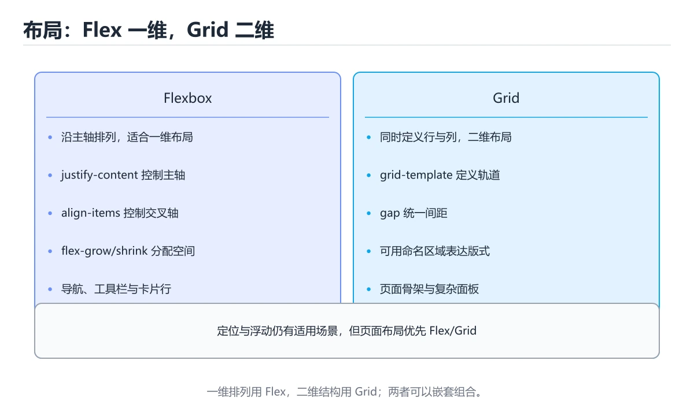
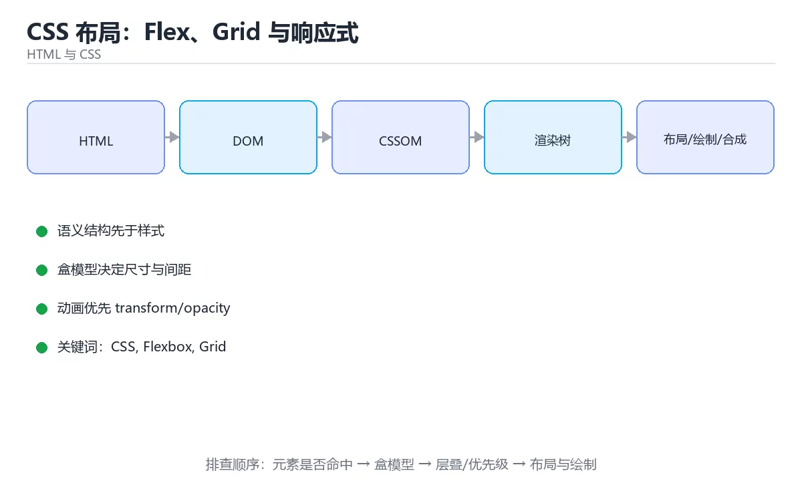

# CSS 布局：Flex、Grid 与响应式





> 内容更新时间：2026-10-06 · 学习阶段：入门 · 预计用时：16 分钟

## 学习目标

- 能用自己的话解释CSS 布局：Flex、Grid 与响应式解决了什么问题，而不是只背术语。
- 能说清 「CSS」、「Flexbox」、「Grid」、「响应式」 之间的关系，并分别举出一个例子。
- 能把本课知识放回「HTML 与 CSS」的知识体系，说明它和相邻主题的边界。
- 能完成本课练习，并用验收标准检查自己的结果。

> 一句话摘要：一维 Flex、二维 Grid、定位与移动优先响应式。

## 前置知识

- 先完成上一课《CSS 基础：选择器与盒模型》；如果已经掌握，可以直接用本课练习自测。
- 本课阶段：入门。只需要基本计算机操作，不要求编程经验。
- 开始前先复习：CSS、Flexbox、Grid。
- 如果某一步看不懂，先记录具体卡点，完成练习后再回头读一遍。

## Flexbox：一维布局

适用：导航栏、按钮组、卡片内元素对齐。核心是主轴与交叉轴：

| 属性 | 作用 |
| --- | --- |
| `display: flex` | 开启弹性布局 |
| `flex-direction` | 主轴方向（row/column） |
| `justify-content` | 主轴对齐（center/space-between） |
| `align-items` | 交叉轴对齐 |
| `flex: 1` | 可伸缩占据剩余空间 |
| `gap` | 子项间距（不再用 margin 拼） |

## Grid：二维布局

适用：整页骨架、卡片网格、对齐复杂的表单。`grid-template-columns: repeat(auto-fill, minmax(280px, 1fr))` 一行实现响应式卡片网格；`grid-template-areas` 让页面骨架像画图一样可读。

## 定位与层叠上下文

| 值 | 参照物 | 典型用途 |
| --- | --- | --- |
| static | 正常流 | 默认 |
| relative | 自身原位置 | 微调、作为绝对定位参照 |
| absolute | 最近的非 static 祖先 | 角标、下拉菜单 |
| fixed | 视口 | 悬浮按钮 |
| sticky | 最近滚动容器 | 吸顶导航 |

`z-index` 只在定位元素或层叠上下文中生效；父元素创建了层叠上下文（transform、opacity < 1、filter）会限制子元素层级的比较范围。

## 响应式

1. 移动优先：先写小屏样式，再用 `@media (min-width: 768px)` 增强。
2. 优先用流式布局（%、fr、minmax、clamp）而非写多套断点。
3. `clamp(1rem, 2.5vw, 1.5rem)` 实现字号平滑缩放。
4. 用容器查询 `@container` 让组件按自身宽度适配，而不是按视口。

## 常见坑

1. 忘记 `box-sizing: border-box` 导致宽度计算出错。
2. 用 float 做布局（应用 Flex/Grid）。
3. 固定高度写死导致内容溢出，改用 `min-height`。
4. 移动端 100vh 受地址栏影响，用 `100dvh`。

## 布局问题的定位方法

| 现象 | 常见原因 | 处理 |
| --- | --- | --- |
| 子元素溢出父容器 | 子元素有固定宽度/内容过长 | 用 min-width:0 配合 flex 子项，或 overflow-wrap 断词 |
| 高度塌陷（父容器高度为 0） | 子元素浮动未清除 | 用 Grid/Flex 替代 float，或给父元素 display: flow-root |
| 移动端出现横向滚动条 | 固定宽度、100vw 加滚动条、负边距 | 用 max-width:100%、padding 代替负边距 |
| 元素被遮挡 | z-index 无效（父级创建了层叠上下文） | 调整层级或避免在父级用 transform/opacity |
| sticky 不生效 | 祖先有 overflow 隐藏、未设置 top | 去掉祖先 overflow 或改结构，设置 top/bottom |

调试手段：浏览器 DevTools 的盒子高亮能直接看到 padding/border/margin；Flex/Grid 面板可视化对齐线；用 `outline: 1px solid red` 快速定位溢出元素（比 border 不影响布局）。

## 本课小结
布局选择口诀：**一维用 Flex、二维用 Grid、悬浮用定位、适配用响应式**；配合 gap 与 CSS 变量，现代 CSS 已很少需要 hack。

## Flex 与 Grid 选择速查

| 需求 | 首选 | 关键属性 |
| --- | --- | --- |
| 一维排列（导航、按钮组） | Flex | `display: flex`、`gap`、`justify-content` |
| 二维网格（卡片墙） | Grid | `grid-template-columns`、`gap` |
| 居中单个元素 | Flex 或 Grid | `place-items: center` |
| 侧栏 + 主内容 | Grid | `grid-template-columns: 260px 1fr` |
| 自动响应卡片 | Grid | `repeat(auto-fit, minmax(240px, 1fr))` |
| 竖向自适应铺满 | Flex | `flex-direction: column`、`flex: 1` |

## 常用属性速查

| 属性 | 作用 |
| --- | --- |
| `flex: 1` | 按比例分配剩余空间 |
| `flex-shrink: 0` | 禁止被压缩（图标、按钮） |
| `min-width: 0` | 让 Flex 子项能正确收缩（解决溢出） |
| `align-items` | 交叉轴对齐 |
| `justify-content` | 主轴对齐 |
| `gap` | 只作用于项目之间，不留首尾间距 |
| `grid-auto-flow: dense` | 填补空洞（注意视觉顺序） |
| `position: sticky` | 滚动到阈值后固定 |
| `inset` | `top/right/bottom/left` 简写 |
| `aspect-ratio` | 固定宽高比 |

```css
/* 侧栏布局：小屏堆叠，大屏两列 */
.layout {
  display: grid;
  gap: 1.5rem;
  grid-template-columns: 1fr;
}

@media (min-width: 900px) {
  .layout {
    grid-template-columns: minmax(220px, 280px) 1fr;
    align-items: start;
  }
}

/* 卡片墙：自动决定列数，最小 240px */
.cards {
  display: grid;
  gap: 1rem;
  grid-template-columns: repeat(auto-fit, minmax(240px, 1fr));
}

/* 导航栏：左标题右按钮，中间自动撑开 */
.toolbar {
  display: flex;
  align-items: center;
  gap: 0.75rem;
}

.toolbar .title {
  flex: 1;
  min-width: 0;               /* 关键：允许文字截断而不是溢出 */
  overflow: hidden;
  text-overflow: ellipsis;
  white-space: nowrap;
}

/* 固定宽高比的媒体容器，避免布局偏移 */
.thumb {
  aspect-ratio: 16 / 9;
  overflow: hidden;
  border-radius: 8px;
}

.thumb img {
  width: 100%;
  height: 100%;
  object-fit: cover;
}
```

## 响应式速查

| 手段 | 适用 |
| --- | --- |
| 媒体查询 `@media` | 断点式布局调整 |
| 容器查询 `@container` | 组件级自适应 |
| `clamp()` | 字号与间距流体变化 |
| `auto-fit` / `auto-fill` | 网格自动列数 |
| `min()` / `max()` | 宽度上限与最小值 |
| 逻辑属性 `margin-inline` | 支持书写方向（RTL） |

移动优先：先写单列基础样式，再用 `min-width` 断点逐步增强。

## 常见错误对照表

| 容易踩的做法 | 实际现象 | 原因与正确做法 |
| --- | --- | --- |
| Flex 子项溢出却不加 `min-width: 0` | 文字撑破容器 | Flex 项默认 `min-width: auto` |
| 用 `margin` 控制列表间距 | 首尾多余间距 | 用 `gap` |
| 用 `absolute` 做常规布局 | 响应式困难 | 优先 Flex 或 Grid |
| 固定像素宽度 | 小屏溢出 | 用 `max-width` 与相对单位 |
| `position: absolute` 找不到参照 | 定位到视口 | 父级设 `position: relative` |
| `z-index` 乱加 | 层级冲突 | 明确层叠上下文与顺序 |
| 忽略安全区域 | 内容被刘海遮挡 | 用 `env(safe-area-inset-*)` |
| 断点过多 | 维护困难 | 用容器查询与自适应网格减少断点 |
| 用 `vh` 做移动端满屏 | 地址栏导致跳动 | 用 `dvh` 或 `svh` |
| 用 `float` 做布局 | 需要清除浮动 | 用 Flex 或 Grid |

## 自测清单

- [ ] 能按一维或二维需求选择 Flex 与 Grid。
- [ ] 会用 `gap`、`min-width: 0`、`aspect-ratio` 解决常见问题。
- [ ] 移动优先，断点用 `min-width` 逐步增强。
- [ ] 固定格式容器有稳定尺寸，避免布局偏移。
- [ ] 不使用 `float` 与大量 `absolute` 做常规布局。

## 动手练习

> 本课练习重点：围绕「CSS、Flexbox、Grid」完成复述、实验和交付，每个结果都要能被别人检查。

先写最小语义结构，再调整布局与样式，最后检查键盘、窄屏和对比度。

### 练习 1：建立心智模型（10 分钟）

合上教程，用 3～5 句话回答：

1. CSS 布局：Flex、Grid 与响应式解决了什么问题？
2. 如果没有它，会出现什么具体后果？
3. 它和「Flexbox」是什么关系？

**验收标准**：至少出现一个本课关键词，并写出一个反例、边界条件或失效场景。

### 练习 2：做一次可控实验（20 分钟）

从正文中选一个最小示例，完成以下操作：

1. 先预测修改一个参数、输入或步骤后的结果。
2. 再实际执行或逐步推演，记录真实结果。
3. 如果结果与预测不同，写出差异原因。

**验收标准**：留下「原例 → 改动 → 预测 → 结果 → 原因」五步记录。

### 练习 3：交付一个小结果（30 分钟）

做一个只有标题、卡片和按钮的最小页面，并用浏览器设备模式检查窄屏。

任务要求：

- 结果必须能被别人检查，不能只写“我已经理解了”。
- 至少覆盖「CSS」和「Flexbox」两个关键词。
- 写出 1 个仍然不确定的问题，以及下一步如何验证。

> 提示：时间有限时优先做练习 1 和练习 2；练习 3 可以拆成两次完成。

## 实践任务

本节围绕CSS 布局：Flex、Grid 与响应式安排 3 个可交付任务，每个任务都要求留下可以复查的记录。

### 任务 1：用自己的话画出结构

不看书，用一张图说清「CSS 布局：Flex、Grid 与响应式」的结构，画完再对照骨架：

- 主干：Flexbox：一维布局 → Grid：二维布局 → 定位与层叠上下文 → 响应式
- 连接线：在每条边上标出输入、输出与失败路径。
- 自检：能否用一句话说明CSS与Flexbox的关系？

### 任务 2：做一次对比实验

**验收标准**：表格里两个方案的结论不能完全一样；写下“在什么条件下应该换方案”。

### 任务 3：迁移到自己的场景

**验收标准**：至少有一个可复现的命令、代码片段或数据样例；结论能被别人独立检查。

## 故障现场

### 现场 1：本课的 CSS 常规用例通过，但边界用例失败

**症状**：在本课的练习或生产场景里出现“本课的 CSS 常规用例通过，但边界用例失败”。

**复现**：准备一组最小输入，只保留触发“本课的 CSS 常规用例通过，但边界用例失败”的必要条件，连续运行两次确认结果稳定。

**定位**：围绕“CSS 的前置条件与取值边界没有写进代码，默认值掩盖了空值和极值”检查调用链、输入数据和环境配置，先验证假设再改代码。

**预防**：把“本课的 CSS 常规用例通过，但边界用例失败”写成一条自动化用例，并在本课的验收清单里保留对应检查项。

### 现场 2：本课的 Flexbox 结果在两次运行之间不一致

**症状**：在本课的练习或生产场景里出现“本课的 Flexbox 结果在两次运行之间不一致”。

**复现**：准备一组最小输入，只保留触发“本课的 Flexbox 结果在两次运行之间不一致”的必要条件，连续运行两次确认结果稳定。

**定位**：围绕“Flexbox 依赖了当前版本、执行顺序或共享状态，单次运行无法暴露差异”检查调用链、输入数据和环境配置，先验证假设再改代码。

**预防**：把“本课的 Flexbox 结果在两次运行之间不一致”写成一条自动化用例，并在本课的验收清单里保留对应检查项。

### 现场 3：本课的验证只在开发机通过

**症状**：在本课的练习或生产场景里出现“本课的验证只在开发机通过”。

**定位**：围绕“环境版本、配置和输入规模与目标环境不同，CSS 缺少可重复的验证记录”检查调用链、输入数据和环境配置，先验证假设再改代码。

## 本课复习清单

离开本课前，逐项确认：

- [ ] 不看解析，能说出「导航栏、按钮组这类一维排列优先用？」的判断依据。
- [ ] 不看解析，能说出「一行实现响应式卡片网格的写法是？」的判断依据。
- [ ] 不看解析，能说出「做动画时应优先修改哪些属性？」的判断依据。
- [ ] 不看解析，能说出「position: absolute 的元素相对于谁定位？」的判断依据。
- [ ] 不看解析，能说出「Flex/Grid 中 gap 相比用 margin 控制间距的优势是？」的判断依据。
- [ ] 不看解析，能说出的判断依据。
- [ ] 至少运行一次本课示例，记录输入、输出和一个边界情况。
- [ ] 把本课最容易混淆的两个概念写成一句话对照。

| 复盘项 | 记录 |
| --- | --- |
| 已经能独立解释的考点 |  |
| 仍然说不清的概念 |  |
| 下一步验证动作 |  |

## 术语速查

把「CSS 布局：Flex、Grid 与响应式」里反复出现的术语集中放在一起。复习时先遮住右列，尝试用自己的话解释，再回到正文核对。

| 术语 | 本课语境 |
| --- | --- |
| `CSS` | 布局选择口诀：一维用 Flex、二维用 Grid、悬浮用定位、适配用响应式；配合 gap 与 CSS 变量，现代 CSS 已很少需要 hack。 |
| `Flexbox` | 围绕“Flexbox 依赖了当前版本、执行顺序或共享状态，单次运行无法暴露差异”检查调用链、输入数据和环境配置，先验证假设再改代码。 |
| `Grid` | 调试手段：浏览器 DevTools 的盒子高亮能直接看到 padding/border/margin；Flex/Grid 面板可视化对齐线；用 outline: 1px solid red 快速定位溢出元素（比 border 不影响布局）。 |
| `响应式` | Flexbox：一维布局 → Grid：二维布局 → 定位与层叠上下文 → 响应式。 |
| `定位` | 它在「CSS 布局：Flex、Grid 与响应式」里是理解「定位」的关键术语，用来解释定义、适用条件与失败路径；它与CSS、Flexbox共同决定这一节的判断边界。复习时回到正文示例核对输入、输出和验证方式。 |

## 考点精讲

### 考点 1：概念判断·CSS

- **题目**：导航栏、按钮组这类一维排列优先用？
- **判断依据**：Flex 处理一维对齐与分配剩余空间最简单。作答时，先用CSS建立输入与输出的基线，再把Flexbox代入边界条件核对，结论才能复现。这道题的关键在「CSS 布局：Flex、Grid 与响应式」的CSS、Flexbox、Grid：先确认题干“导航栏、按钮组这类一维排列优先用”问的是哪一步，再排除偷换前提的选项。

### 考点 2：多选辨析·CSS

- **题目**：围绕“CSS 布局：Flex、Grid 与响应式”中的 CSS、Flexbox、Grid，下列哪两项是本课强调的实践判断？
- **判断依据**：本课把CSS 布局：Flex、Grid 与响应式拆成概念、示例与故障现场三部分，因此判断 CSS 时必须同时交代输入、输出和失败路径，这使“学习 CSS 时要同时说明输入、输出和失败路径，不能只看正常流程”成立。在CSS 布局：Flex、Grid 与响应式里，判断 Flexbox 时要固定版本与边界输入，所以“验证 Flexbox 时要固定版本并覆盖边界输入，结论才可复现”才可复现。

### 考点 3：概念判断·CSS

- **题目**：做动画时应优先修改哪些属性？
- **判断依据**：在「CSS 布局：Flex、Grid 与响应式」里，作答时，先用CSS建立输入与输出的基线，再把transform 和 opacity代入边界条件核对，结论才能复现。「CSS 布局：Flex、Grid 与响应式」要求先交代CSS、Flexbox、Grid的前提再下结论，所以“transform 和 opacity”只在题干“做动画时应优先修改哪些属性”给定的条件下成立。

### 考点 4：代码补全·CSS

- **题目**：这段代码代码是「CSS 布局：Flex、Grid 与响应式」的示例片段，下面哪一项描述与它一致？
- **判断依据**：在「CSS 布局：Flex、Grid 与响应式」里，这段代码把主要逻辑封装在函数或方法里，需要被调用才会执行。这段代码出自「CSS 布局：Flex、Grid 与响应式」的正文示例，围绕CSS、Flexbox、Grid展开；把输入或边界换成空值、极值或失败情况后，结论要以「CSS 布局：Flex、Grid 与响应式」的实际运行结果为准。

### 考点 5：概念判断·CSS

- **题目**：Flex/Grid 中 gap 相比用 margin 控制间距的优势是？
- **判断依据**：在「CSS 布局：Flex、Grid 与响应式」里，只作用于项目之间。gap 只计算项目之间的间隔，省去 :last-child 之类的边界处理。回到「CSS 布局：Flex、Grid 与响应式」的正文示例，用“Flex/Grid 中 gap 相比”走一遍CSS、Flexbox、Grid的完整流程，能复现的结论才可以保留。

### 考点 6：顺序排列·CSS

- **题目**：按照「CSS 布局：Flex、Grid 与响应式」从概念到实践的讲解顺序排列下列主题。
- **判断依据**：在「CSS 布局：Flex、Grid 与响应式」里，正确的执行顺序是「Flexbox：一维布局」 → 「Grid：二维布局」 → 「定位与层叠上下文」 → 「响应式」。在「CSS 布局：Flex、Grid 与响应式」里，在本课中，正确顺序是：1. Flexbox：一维布局 → 2. Grid：二维布局 → 3. 定位与层叠上下文 → 4. 响应式。

## English Overview

**Title:** Flex, Grid & Responsive

**Summary:** Flex, Grid, positioning and responsive design.

**Category:** HTML & CSS
**Level:** 入门
**Key terms:** CSS, Flexbox, Grid, 响应式, 定位

## 内容元数据

- 内容版本：v2.0
- 最后更新：2026-10-06
- 学习阶段：入门
- 适用环境：现代浏览器（Chrome/Firefox/Safari）
- 内容来源：内置结构化课程与工程实践整理
- 相关主题：CSS、Flexbox、Grid、响应式、定位
- 质量版本：P0 测验标准 + P1 覆盖扩展 + P2 体验补全

## 参考资料与复核

- 最后复核：2026-10-04
- 下次复核：2027-04-04
- 复核范围：版本兼容、API 行为、安全建议与工程实践
- 来源性质：官方文档、标准或权威教材；正文为离线教学重组

| 参考资料 | 本课用途 |
| --- | --- |
| [MDN CSS](https://developer.mozilla.org/docs/Web/CSS) | CSS 布局、选择器与动画 |
| [MDN HTTP](https://developer.mozilla.org/docs/Web/HTTP) | HTTP 语义与缓存 |
| [MDN 无障碍](https://developer.mozilla.org/docs/Web/Accessibility) | 可访问性与语义 |

> 「CSS 布局：Flex、Grid 与响应式」的链接用于离线阅读后的延伸核对；App 不会自动联网。

## 代码对照与验证

这一节用三组对照把 `display`、`position` 与响应式断点串起来：先看默认流式布局，
再逐条替换属性，最后观察盒模型与定位的变化。

### 对照一：Flex 与 Grid 解决不同问题

```css
.row {
  display: flex;
  gap: 12px;
  align-items: center;
}

.grid {
  display: grid;
  grid-template-columns: repeat(auto-fit, minmax(180px, 1fr));
  gap: 16px;
}
```

Flex 适合一维排列，Grid 适合二维网格。用 `auto-fit` 搭配 `minmax` 可以在容器
变窄时自动减少列数，不需要额外媒体查询。

### 对照二：盒模型与 `box-sizing`

```css
.card {
  box-sizing: border-box;
  width: 100%;
  padding: 16px;
  border: 1px solid #d0d7de;
}
```

默认的 `content-box` 会让 `width` 再加上内边距和边框，从而撑破父容器；
`border-box` 把内边距和边框算进宽度，是布局可预测的前提。

### 对照三：定位与层叠上下文

```css
.toolbar {
  position: sticky;
  top: 0;
  z-index: 10;
  background: #ffffff;
}

.badge {
  position: absolute;
  top: 8px;
  right: 8px;
}
```

`sticky` 在滚动到阈值前表现为相对定位，之后固定在容器内；`absolute` 则相对最近的
定位祖先定位，因此父元素通常需要 `position: relative`。

### 验证清单

| 检查项 | 通过标准 |
| --- | --- |
| 一维排列 | 用 Flex 实现且间距由 `gap` 控制，没有用 margin 堆叠 |
| 二维网格 | 用 Grid 实现，窗口变窄时列数自动变化 |
| 盒模型 | 设置 `border-box` 后，加内边距不会撑破容器 |
| 定位 | `absolute` 元素相对预期的父元素定位，`z-index` 生效 |

## 复习与迁移

复习目标：把「CSS 布局：Flex、Grid 与响应式」的判断标准放回可复现的例子里。先自己作答，再对照依据；如果结论正确但理由不完整，回到正文补足前提。

### 概念复述

- 用一句话说明「CSS 布局：Flex、Grid 与响应式」解决什么问题：一维 Flex、二维 Grid、定位与移动优先响应式。
- 写出CSS、Flexbox、Grid之间的关系，并各举一个例子。
- 说出本课最容易混淆的两个概念，以及区分它们的判据。

### 正文逐节复核

- **定位与层叠上下文**：`z-index` 只在定位元素或层叠上下文中生效；父元素创建了层叠上下文（transform、opacity < 1、filter）会限制子元素层级的比较范围。
- **布局问题的定位方法**：调试手段：浏览器 DevTools 的盒子高亮能直接看到 padding/border/margin；Flex/Grid 面板可视化对齐线；用 `outline: 1px solid red` 快速定位溢出元素（比 border 不影响布局。
- **实践任务**：本节围绕CSS 布局：Flex、Grid 与响应式安排 3 个可交付任务，每个任务都要求留下可以复查的记录。

### 测验回顾

1. 导航栏、按钮组这类一维排列优先用？
   - 依据：Flex 处理一维对齐与分配剩余空间最简单。作答时，先用CSS建立输入与输出的基线，再把Flexbox代入边界条件核对，结论才能复现。这道题的关键在「CSS 布局：Flex、Grid 与响应式」的CSS、Flexbox、Grid：先确认题干“导航栏、按钮组这类一维排列优先用”问的是哪一步，再排除偷换前提的选项。
2. 围绕“CSS 布局：Flex、Grid 与响应式”中的 CSS、Flexbox、Grid，下列哪两项是本课强调的实践判断？
   - 依据：本课把CSS 布局：Flex、Grid 与响应式拆成概念、示例与故障现场三部分，因此判断 CSS 时必须同时交代输入、输出和失败路径，这使“学习 CSS 时要同时说明输入、输出和失败路径，不能只看正常流程”成立。在CSS 布局：Flex、Grid 与响应式里，判断 Flexbox 时要固定版本与边界输入，所以“验证 Flexbox 时要固定版本并覆盖边界输入，结论才可复现”才可复现。
3. 做动画时应优先修改哪些属性？
   - 依据：在「CSS 布局：Flex、Grid 与响应式」里，作答时，先用CSS建立输入与输出的基线，再把transform 和 opacity代入边界条件核对，结论才能复现。「CSS 布局：Flex、Grid 与响应式」要求先交代CSS、Flexbox、Grid的前提再下结论，所以“transform 和 opacity”只在题干“做动画时应优先修改哪些属性”给定的条件下成立。
4. 这段代码代码是「CSS 布局：Flex、Grid 与响应式」的示例片段，下面哪一项描述与它一致？
   - 依据：在「CSS 布局：Flex、Grid 与响应式」里，这段代码把主要逻辑封装在函数或方法里，需要被调用才会执行。这段代码出自「CSS 布局：Flex、Grid 与响应式」的正文示例，围绕CSS、Flexbox、Grid展开；把输入或边界换成空值、极值或失败情况后，结论要以「CSS 布局：Flex、Grid 与响应式」的实际运行结果为准。
5. Flex/Grid 中 gap 相比用 margin 控制间距的优势是？
   - 依据：在「CSS 布局：Flex、Grid 与响应式」里，只作用于项目之间。gap 只计算项目之间的间隔，省去 :last-child 之类的边界处理。回到「CSS 布局：Flex、Grid 与响应式」的正文示例，用“Flex/Grid 中 gap 相比”走一遍CSS、Flexbox、Grid的完整流程，能复现的结论才可以保留。
6. 按照「CSS 布局：Flex、Grid 与响应式」从概念到实践的讲解顺序排列下列主题。
   - 依据：在「CSS 布局：Flex、Grid 与响应式」里，正确的执行顺序是「Flexbox：一维布局」 → 「Grid：二维布局」 → 「定位与层叠上下文」 → 「响应式」。在「CSS 布局：Flex、Grid 与响应式」里，在本课中，正确顺序是：1. Flexbox：一维布局 → 2. Grid：二维布局 → 3. 定位与层叠上下文 → 4. 响应式。

### 迁移练习

把「CSS 布局：Flex、Grid 与响应式」的结论迁移到相邻主题，每次迁移都写清预测与证据：

1. 换输入：用CSS处理一组你自己的数据，对比教材示例的结果差异。
2. 换失败条件：制造一个Flexbox相关的错误，说明如何从错误信息定位根因。
3. 换规模：把数据量或并发度提高一个数量级，说明「CSS 布局：Flex、Grid 与响应式」的结论是否仍成立。
