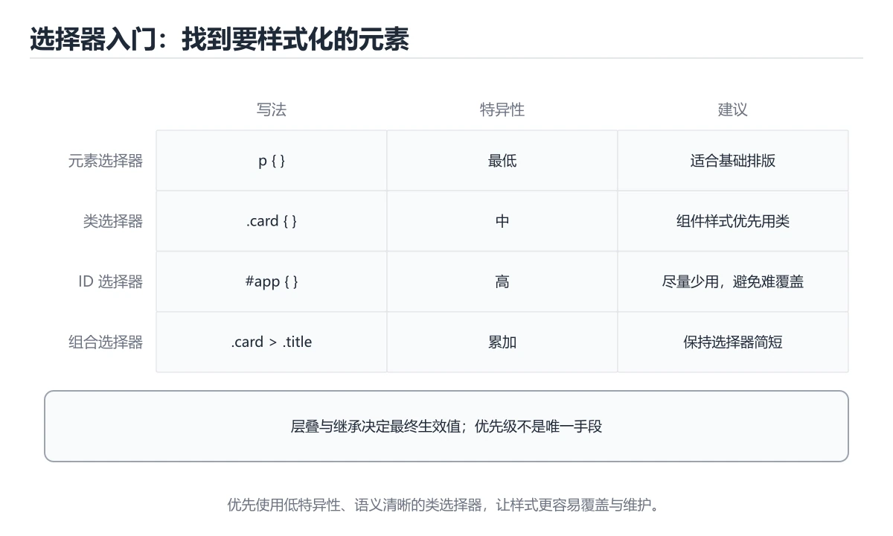
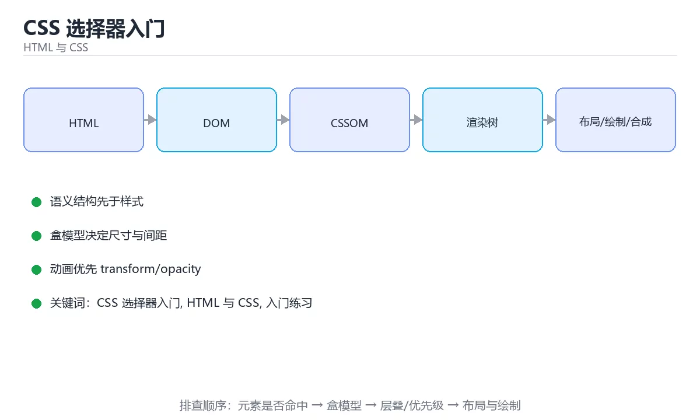

# CSS 选择器入门

> 内容更新时间：2026-10-03





## 学习目标

- 先认识CSS 选择器入门需要的工具、输入和输出。
- 按步骤运行最小示例，并记录结果与错误。
- 用一个边界输入验证自己是否真正掌握。

## 前置知识

- 会进行基本的文件或命令行操作。
- 不需要预先掌握「HTML 与 CSS」的高级知识。

## 一句话入门

用元素、类、ID 和组合选择器定位样式。

## 最小示例

```html
<style>
  .notice { color: #0b57d0; font-weight: 600; }
</style>
<p class="notice">保存成功</p>
```

## 预期输出

```text
浏览器渲染为蓝色加粗文字：保存成功
```

## 常见错误

- 输入或环境与示例不一致，导致结果不符合预期。
- 复制命令时遗漏空格、引号或必要参数。

## 动手练习

1. 原样运行最小示例，保存命令和输出。
2. 把数字 2 改成 10，预测并验证新结果。
3. 制造一个错误输入，写出错误信息和修复方法。

## 本课小结

- 入门阶段先保证能运行、能观察、能解释，再追求复杂功能。
- 每次只改一个变量，记录预测与实际结果。
- 遇到错误先看第一条错误信息，再回到最小示例。

## 选择器、级联与优先级

CSS 选择器用于定位元素，元素选择器匹配标签名，类选择器匹配一组元素，ID 选择器匹配唯一元素，后代选择器匹配任意层级的后代，子选择器只匹配直接子元素。属性选择器和伪类选择器能表达状态与结构，例如 `input[type="email"]`、`:hover`、`:focus-visible`、`:nth-child()`。选择器越具体，越容易命中预期元素，也越容易造成后续覆盖困难。

多个规则命中同一元素时，浏览器按来源、优先级、作用域和出现顺序决定最终值。优先级通常用四元组近似表示：内联样式、ID、类/属性/伪类、元素/伪元素。通配符和继承不增加优先级。`!important` 会提升声明级别，但它不是解决冲突的常规手段，过度使用会让样式难以推理。优先调整选择器结构和加载顺序，而不是不断叠加权重。

级联还包含继承和初始值。字体、颜色等属性会从父元素继承，宽度、边距等通常不会。`inherit`、`initial`、`unset` 和 `revert` 可以显式控制取值，但要理解它们的差异。CSS 变量适合保存设计令牌，例如颜色、间距和圆角，但变量本身也有作用域和回退值。

## 布局层面的选择器实践

大型项目通常使用命名约定降低选择器耦合，例如 BEM 的块、元素、修饰符结构。避免使用依赖 DOM 深度的长选择器，因为结构调整会让样式失效；也避免用 ID 作为主要样式钩子，因为它难以复用且优先级过高。组件样式应尽量局部化，公共样式使用统一变量或工具类。

交互状态要覆盖 `:hover`、`:focus-visible`、`:active` 和禁用状态。移动端没有可靠悬停，因此不能把关键操作只放在悬停里。焦点样式不要用 `outline: none` 直接移除，除非提供更清晰的替代。动画优先使用 `transform` 和 `opacity`，它们通常不触发布局重排；频繁改变宽高、位置或阴影可能造成性能问题。

验证 CSS 时，用开发者工具查看“计算样式”和“样式来源”，确认命中规则与优先级；改变窗口宽度检查响应式断点；用键盘检查焦点顺序；用对比度工具检查文本可读性。选择器写法只是入口，最终要验证的是级联结果、布局行为和可访问性。

## 代码实验：把示例跑成证据

### 实验一：建立基线

```html
<style>
  .notice { color: #0b57d0; font-weight: 600; }
</style>
<p class="notice">保存成功</p>
```

### 实验二：只改一个输入

### 实验三：制造一个可控错误

删掉一个闭合标签、把类名写错，或者让选择器优先级被另一条规则覆盖。用开发者工具确认实际命中的元素和计算样式。

| 实验 | 改动 | 预测 | 实际 | 结论 |
| --- | --- | --- | --- | --- |
| 基线 | 保持原样 |  |  |  |
| 边界 |  |  |  |  |
| 失败 |  |  |  |  |

### 实验四：用三句话复述

1. 输入是什么，哪些输入属于合法范围，哪些属于边界或非法范围？
2. 程序按什么顺序处理输入，在哪一步产生了状态变化或副作用？
3. 输出如何验证，失败时第一条可观察证据是什么？

## 实践任务

本节围绕CSS 选择器入门安排 3 个可交付任务，每个任务都要求留下可以复查的记录。

### 任务 1：用自己的话画出结构

### 任务 2：做一次对比实验

**验收标准**：表格里两个方案的结论不能完全一样；写下“在什么条件下应该换方案”。

### 任务 3：迁移到自己的场景

**验收标准**：至少有一个可复现的命令、代码片段或数据样例；结论能被别人独立检查。

## 故障现场

### 现场 1：本课的 CSS 选择器入门 常规用例通过，但边界用例失败

### 现场 2：本课的 HTML 与 CSS 结果在两次运行之间不一致

**症状**：在本课的练习或生产场景里出现“本课的 HTML 与 CSS 结果在两次运行之间不一致”。

**复现**：准备一组最小输入，只保留触发“本课的 HTML 与 CSS 结果在两次运行之间不一致”的必要条件，连续运行两次确认结果稳定。

**定位**：围绕“HTML 与 CSS 依赖了当前版本、执行顺序或共享状态，单次运行无法暴露差异”检查调用链、输入数据和环境配置，先验证假设再改代码。

**预防**：把“本课的 HTML 与 CSS 结果在两次运行之间不一致”写成一条自动化用例，并在本课的验收清单里保留对应检查项。

### 现场 3：本课的验证只在开发机通过

**症状**：在本课的练习或生产场景里出现“本课的验证只在开发机通过”。

## 本课复习清单

离开本课前，逐项确认：

- [ ] 不看解析，能说出的判断依据。
- [ ] 不看解析，能说出「下列写法的优先级从高到低排列，正确的是？」的判断依据。
- [ ] 不看解析，能说出「选择器 .card p 与 .card > p 的区别是？」的判断依据。
- [ ] 不看解析，能说出「本课最小示例把「保存成功」渲染成什么效果？」的判断依据。
- [ ] 不看解析，能说出「填空：CSS 选择器入门术语速查中，表示的判断依据。
- [ ] 至少运行一次本课示例，记录输入、输出和一个边界情况。
- [ ] 把本课最容易混淆的两个概念写成一句话对照。

| 复盘项 | 记录 |
| --- | --- |
| 已经能独立解释的考点 |  |
| 仍然说不清的概念 |  |
| 下一步验证动作 |  |

## 逐节复习与自检

下面按正文顺序回顾每一节，并给出一个自检问题；说不清的地方回到原章节补课。

### 最小示例

```html
<style>
  .notice { color: #0b57d0; font-weight: 600; }
</style>
<p class="notice">保存成功</p>
```

自检：这一节与相邻主题的边界在哪里？

### 预期输出

```text
浏览器渲染为蓝色加粗文字：保存成功
```

### 常见错误

自检：把这一节讲给没学过的人，最需要强调哪一点？

### 动手练习

自检：如果去掉这一节里的一个前提，结论会怎样变化？

### 选择器、级联与优先级

CSS 选择器用于定位元素，元素选择器匹配标签名，类选择器匹配一组元素，ID 选择器匹配唯一元素，后代选择器匹配任意层级的后代，子选择器只匹配直接子元素。属性选择器和伪类选择器能表达状态与结构，例如 `input[type="email"]`、`:hover`、`:focus-visible`、`:nth-child()`。

自检：用自己的话复述这一节，并举一个反例。

### 布局层面的选择器实践

大型项目通常使用命名约定降低选择器耦合，例如 BEM 的块、元素、修饰符结构。避免使用依赖 DOM 深度的长选择器，因为结构调整会让样式失效；也避免用 ID 作为主要样式钩子，因为它难以复用且优先级过高。

自检：这一节最常见的失败方式是什么？第一条可观察证据是什么？

## 术语速查

把「CSS 选择器入门」里反复出现的术语集中放在一起。复习时先遮住右列，尝试用自己的话解释，再回到正文核对。

| 术语 | 本课语境 |
| --- | --- |
| `[CSS 选择器入门, HTML 与 CSS, 入门练习][index]` | 在「CSS 选择器入门」里理解它的定义、输入和输出。 |
| `[CSS 选择器入门, HTML 与 CSS, 入门练习][index]` | 本课用它说明边界条件与失败路径。 |
| `[CSS 选择器入门, HTML 与 CSS, 入门练习][index]` | 结合「CSS 选择器入门」的正文示例确认它的适用条件。 |

## 考点精讲

### 考点 1：样式规则 .notice { color: #0b57d0; } 会命中哪些元素？

- **判断依据**：在「CSS 选择器入门」里，所有 class 属性包含 notice 的元素。CSS 里点号前缀表示类选择器，因此 .notice 会选中 class="notice" 的元素，一个页面可以有多个。回到「CSS 选择器入门」的正文示例，用“样式规则 .notice { col”走一遍CSS 选择器入门、HTML 与 CSS、入门练习的完整流程，能复现的结论才可以保留。

### 考点 2：下列写法的优先级从高到低排列，正确的是？

- **判断依据**：在「CSS 选择器入门」里，行内样式、id 选择器、类选择器、元素选择器。当多个规则命中同一元素时，浏览器按特指度比较：行内样式最高，其次是 id 选择器，再到类、属性和伪类，元素与伪元素最低。回到「CSS 选择器入门」的正文示例，用“下列写法的优先级从高到低排列”走一遍CSS 选择器入门、HTML 与 CSS、入门练习的完整流程，能复现的结论才可以保留。

### 考点 3：阅读「CSS 选择器入门」正文里的这段代码代码，下面哪一项判断是正确的？

- **判断依据**：在「CSS 选择器入门」里，这段代码只做静态声明，没有循环、分支或可观察输出。这段代码出自「CSS 选择器入门」的正文示例，围绕CSS 选择器入门、HTML 与 CSS、入门练习展开；把输入或边界换成空值、极值或失败情况后，结论要以「CSS 选择器入门」的实际运行结果为准。“阅读CSS”与「CSS 选择器入门」的术语表相呼应，只有符合CSS 选择器入门、HTML 与 CSS、入门练习约束的“这段代码只做静态声明，没有循环”才是正文支持的结论。

### 考点 4：本课最小示例把「保存成功」渲染成什么效果？

- **判断依据**：在「CSS 选择器入门」里，结论应落在「蓝色加粗的文字，因为类选择器命中了该段落」。示例在 style 中定义 .notice 的字号为正常粗细之上的 600 并指定蓝色，随后给段落加上 class="notice"，于是规则命中并渲染出蓝色加粗文字。在「CSS 选择器入门」里，这道题要求区分概念与边界，「蓝色加粗的文字，因为类选择器命中了该段落」只有在题干给出的前提下才成立，而「红色斜体的文字，因为浏览器默认样式生效」、「普通黑色文字，因为样式没有正确关联」缺少同一组条件。

### 考点 5：填空：在「CSS 选择器入门」的术语速查里，「CSS 选择器用于定位元素，元素选择器匹配标签名，类选择器匹配一组元素，ID 选择器匹配唯一元素，后代选择器匹配任意层级的后代，子选择器只匹配直接子元素。属性选择器和伪类选择器能表达状态与结构，例如 `____」描述的是哪个术语？

- **判断依据**：在「CSS 选择器入门」里，input[type="email"]。「CSS 选择器入门」要求先交代CSS 选择器入门、HTML 与 CSS、入门练习的前提再下结论，所以“input[type="email"]”只在题干“在CSS 选择器入门的术语速查里”给定的条件下成立。把“input[type="email"]”代回「CSS 选择器入门」里“在CSS 选择器入门的术语速查里”的例子核对，条件一旦改变，结论就要用CSS 选择器入门、HTML 与 CSS、入门练习重新推导。

### 考点 6：关于「CSS 选择器入门」，下列哪些说法是正确的？（多选）

- **判断依据**：在「CSS 选择器入门」里，所有 class 属性包含 notice 的元素；在「CSS 选择器入门」里，行内样式、id 选择器、类选择器、元素选择器。“选择器入门”与「CSS 选择器入门」的术语表相呼应，只有符合CSS 选择器入门、HTML 与 CSS、入门练习约束的“所有 class 属性包含 notice”才是正文支持的结论。

## English Overview

**Title:** CSS Selectors Basics

**Summary:** Target styles with selectors.

**Category:** HTML & CSS
**Level:** 入门
**Key terms:** CSS 选择器入门, HTML 与 CSS, 入门练习

## 内容元数据

- 内容版本：v2.0
- 最后更新：2026-10-03
- 学习阶段：入门
- 适用环境：现代浏览器（Chrome/Firefox/Safari）
- 内容来源：内置结构化课程与工程实践整理
- 相关主题：CSS 选择器入门、HTML 与 CSS、入门练习
- 质量版本：P0 测验标准 + P1 覆盖扩展 + P2 体验补全

## 参考资料与复核

- 最后复核：2026-10-04
- 下次复核：2027-04-04
- 复核范围：版本兼容、API 行为、安全建议与工程实践
- 来源性质：官方文档、标准或权威教材；正文为离线教学重组

| 参考资料 | 本课用途 |
| --- | --- |
| [MDN CSS](https://developer.mozilla.org/docs/Web/CSS) | CSS 布局、选择器与动画 |
| [MDN HTTP](https://developer.mozilla.org/docs/Web/HTTP) | HTTP 语义与缓存 |
| [MDN JavaScript](https://developer.mozilla.org/docs/Web/JavaScript) | 浏览器脚本语言 |

> 「CSS 选择器入门」的链接用于离线阅读后的延伸核对；App 不会自动联网。

## 复习与迁移

复习目标：把「CSS 选择器入门」的判断标准放回可复现的例子里。先自己作答，再对照依据；如果结论正确但理由不完整，回到正文补足前提。

### 概念复述

- 用一句话说明「CSS 选择器入门」解决什么问题：用元素、类、ID 和组合选择器定位样式。
- 写出CSS 选择器入门、HTML 与 CSS、入门练习之间的关系，并各举一个例子。
- 说出本课最容易混淆的两个概念，以及区分它们的判据。

### 正文逐节复核

- **实践任务**：本节围绕CSS 选择器入门安排 3 个可交付任务，每个任务都要求留下可以复查的记录。

### 测验回顾

1. 样式规则 .notice { color: #0b57d0; } 会命中哪些元素？
   - 依据：在「CSS 选择器入门」里，所有 class 属性包含 notice 的元素。CSS 里点号前缀表示类选择器，因此 .notice 会选中 class="notice" 的元素，一个页面可以有多个。回到「CSS 选择器入门」的正文示例，用“样式规则 .notice { col”走一遍CSS 选择器入门、HTML 与 CSS、入门练习的完整流程，能复现的结论才可以保留。
2. 下列写法的优先级从高到低排列，正确的是？
   - 依据：在「CSS 选择器入门」里，行内样式、id 选择器、类选择器、元素选择器。当多个规则命中同一元素时，浏览器按特指度比较：行内样式最高，其次是 id 选择器，再到类、属性和伪类，元素与伪元素最低。回到「CSS 选择器入门」的正文示例，用“下列写法的优先级从高到低排列”走一遍CSS 选择器入门、HTML 与 CSS、入门练习的完整流程，能复现的结论才可以保留。
3. 阅读「CSS 选择器入门」正文里的这段代码代码，下面哪一项判断是正确的？
   - 依据：在「CSS 选择器入门」里，这段代码只做静态声明，没有循环、分支或可观察输出。这段代码出自「CSS 选择器入门」的正文示例，围绕CSS 选择器入门、HTML 与 CSS、入门练习展开；把输入或边界换成空值、极值或失败情况后，结论要以「CSS 选择器入门」的实际运行结果为准。“阅读CSS”与「CSS 选择器入门」的术语表相呼应，只有符合CSS 选择器入门、HTML 与 CSS、入门练习约束的“这段代码只做静态声明，没有循环”才是正文支持的结论。
4. 本课最小示例把「保存成功」渲染成什么效果？
   - 依据：在「CSS 选择器入门」里，结论应落在「蓝色加粗的文字，因为类选择器命中了该段落」。示例在 style 中定义 .notice 的字号为正常粗细之上的 600 并指定蓝色，随后给段落加上 class="notice"，于是规则命中并渲染出蓝色加粗文字。在「CSS 选择器入门」里，这道题要求区分概念与边界，「蓝色加粗的文字，因为类选择器命中了该段落」只有在题干给出的前提下才成立，而「红色斜体的文字，因为浏览器默认样式生效」、「普通黑色文字，因为样式没有正确关联」缺少同一组条件。
5. 填空：在「CSS 选择器入门」的术语速查里，「CSS 选择器用于定位元素，元素选择器匹配标签名，类选择器匹配一组元素，ID 选择器匹配唯一元素，后代选择器匹配任意层级的后代，子选择器只匹配直接子元素。属性选择器和伪类选择器能表达状态与结构，例如 `____」描述的是哪个术语？
   - 依据：在「CSS 选择器入门」里，input[type="email"]。「CSS 选择器入门」要求先交代CSS 选择器入门、HTML 与 CSS、入门练习的前提再下结论，所以“input[type="email"]”只在题干“在CSS 选择器入门的术语速查里”给定的条件下成立。把“input[type="email"]”代回「CSS 选择器入门」里“在CSS 选择器入门的术语速查里”的例子核对，条件一旦改变，结论就要用CSS 选择器入门、HTML 与 CSS、入门练习重新推导。
6. 关于「CSS 选择器入门」，下列哪些说法是正确的？（多选）
   - 依据：在「CSS 选择器入门」里，所有 class 属性包含 notice 的元素；在「CSS 选择器入门」里，行内样式、id 选择器、类选择器、元素选择器。“选择器入门”与「CSS 选择器入门」的术语表相呼应，只有符合CSS 选择器入门、HTML 与 CSS、入门练习约束的“所有 class 属性包含 notice”才是正文支持的结论。

### 迁移练习

- 第 1 次迁移：围绕「样式规则 .notice { color: #0b57d0; } 会命中哪些元素？」先写下预测，再运行本课示例，最后记录预测与实际的差异。参考答案是「所有 class 属性包含 notice 的元素」。
- 第 2 次迁移：围绕「下列写法的优先级从高到低排列，正确的是？」先写下预测，再运行本课示例，最后记录预测与实际的差异。参考答案是「行内样式、id 选择器、类选择器、元素选择器」。
- 第 3 次迁移：围绕「阅读「CSS 选择器入门」正文里的这段代码代码，下面哪一项判断是正确的？」先写下预测，再运行本课示例，最后记录预测与实际的差异。参考答案是「这段代码只做静态声明，没有循环、分支或可观察输出。」。
- 第 4 次迁移：围绕「本课最小示例把「保存成功」渲染成什么效果？」先写下预测，再运行本课示例，最后记录预测与实际的差异。参考答案是「蓝色加粗的文字，因为类选择器命中了该段落」。
- 第 5 次迁移：围绕「填空：在「CSS 选择器入门」的术语速查里，「CSS 选择器用于定位元素，元素选择器匹配标签名，类选择器匹配一组元素，ID 选择器匹配唯一元素，后代选择器匹配任意层级的后代，子选择器只匹配直接子元素。属性选择器和伪类选择器能表达状态与结构，例如 `____」描述的是哪个术语？」先写下预测，再运行本课示例，最后记录预测与实际的差异。参考答案是「input[type="email"]」。
- 第 6 次迁移：围绕「关于「CSS 选择器入门」，下列哪些说法是正确的？（多选）」先写下预测，再运行本课示例，最后记录预测与实际的差异。参考答案是「所有 class 属性包含 notice 的元素」。
- 第 7 次迁移：围绕「样式规则 .notice { color: #0b57d0; } 会命中哪些元素？」把结论写成一条可复现的验证步骤，让别人照着步骤就能核对。参考答案是「行内样式、id 选择器、类选择器、元素选择器」。
- 第 8 次迁移：围绕「下列写法的优先级从高到低排列，正确的是？」把结论写成一条可复现的验证步骤，让别人照着步骤就能核对。参考答案是「所有 class 属性包含 notice 的元素」。
- 第 9 次迁移：围绕「阅读「CSS 选择器入门」正文里的这段代码代码，下面哪一项判断是正确的？」把结论写成一条可复现的验证步骤，让别人照着步骤就能核对。参考答案是「行内样式、id 选择器、类选择器、元素选择器」。
- 第 10 次迁移：围绕「本课最小示例把「保存成功」渲染成什么效果？」把结论写成一条可复现的验证步骤，让别人照着步骤就能核对。参考答案是「这段代码只做静态声明，没有循环、分支或可观察输出。」。
- 第 11 次迁移：围绕「填空：在「CSS 选择器入门」的术语速查里，「CSS 选择器用于定位元素，元素选择器匹配标签名，类选择器匹配一组元素，ID 选择器匹配唯一元素，后代选择器匹配任意层级的后代，子选择器只匹配直接子元素。属性选择器和伪类选择器能表达状态与结构，例如 `____」描述的是哪个术语？」把结论写成一条可复现的验证步骤，让别人照着步骤就能核对。参考答案是「蓝色加粗的文字，因为类选择器命中了该段落」。
- 第 12 次迁移：围绕「关于「CSS 选择器入门」，下列哪些说法是正确的？（多选）」把结论写成一条可复现的验证步骤，让别人照着步骤就能核对。参考答案是「input[type="email"]」。
- 第 13 次迁移：围绕「样式规则 .notice { color: #0b57d0; } 会命中哪些元素？」换一个边界输入（空值、极值或失败情况）重跑一次，说明结论是否仍然成立。参考答案是「所有 class 属性包含 notice 的元素」。
- 第 14 次迁移：围绕「下列写法的优先级从高到低排列，正确的是？」换一个边界输入（空值、极值或失败情况）重跑一次，说明结论是否仍然成立。参考答案是「行内样式、id 选择器、类选择器、元素选择器」。
- 第 15 次迁移：围绕「阅读「CSS 选择器入门」正文里的这段代码代码，下面哪一项判断是正确的？」换一个边界输入（空值、极值或失败情况）重跑一次，说明结论是否仍然成立。参考答案是「所有 class 属性包含 notice 的元素」。
