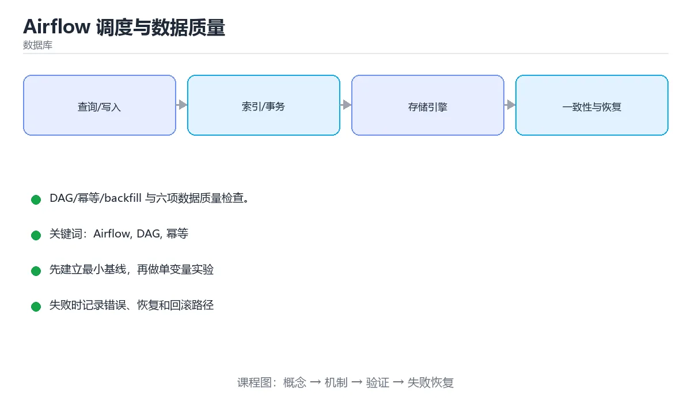

# Airflow 调度与数据质量




> 内容更新时间：2026-10-06 · 学习阶段：进阶 · 预计用时：25 分钟

## 学习目标

- 能用自己的话解释Airflow 调度与数据质量解决了什么问题，而不是只背术语。
- 能说清 「Airflow」、「DAG」、「幂等」、「backfill」 之间的关系，并分别举出一个例子。
- 能把 Airflow 放回「Airflow 调度与数据质量」的知识体系，说明它和 DAG 的边界。
- 能完成本课练习，并用验收标准检查自己的结果。

> 一句话摘要：DAG/幂等/backfill 与六项数据质量检查。

## 前置知识

- 先完成上一课《数据湖与湖仓一体》；如果已经掌握，可以直接用本课练习自测。
- 开始前先复习：Airflow、DAG、幂等。
- 卡在 Airflow 上时不要跳过：把输入、预期和实际输出写成三行，再回头读正文。

## DAG 与核心概念

Airflow 用 DAG（有向无环图）描述任务依赖：DAG 是流程，Task 是具体步骤，Operator 决定 Task 做什么。核心概念还包括：调度周期（schedule）、执行日期（logical date / data interval）、重试策略、变量与连接（Variables/Connections）、传感器（Sensor，用于等待外部条件）。

| 概念 | 要点 |
| --- | --- |
| logical date | 表示"处理哪一段数据"，而不是"什么时候跑"，重跑时用它保证幂等 |
| 幂等 | 任务重跑结果应一致（覆盖写分区、先删后插、按日期分区写入） |
| backfill | 补历史数据，前提是任务幂等且不依赖"当前时间" |
| Sensor | 等待上游就绪，但要用 `reschedule` 模式避免占满 worker |
| catchup | 是否自动补跑历史调度，新建 DAG 时按需关闭 |

## 调度设计原则

1. **一个 DAG 一件事**：不要把几十个不相关任务塞进一个 DAG。
2. **任务粒度适中**：太细会产生大量排队开销，太粗则失败重跑昂贵。
3. **避免在 DAG 定义文件里做重活**：解析器会周期性扫描所有 DAG 文件。
4. **用幂等 + 分区覆盖**替代"只跑一次"的假设。
5. **超时与重试显式配置**：`execution_timeout`、`retries`、`retry_delay` 不要依赖默认值。

## 数据质量监控的六个检查

| 检查 | 说明 | 处理 |
| --- | --- | --- |
| 行数波动 | 与近 7 天均值比较，偏离阈值即告警 | 阻断下游并通知 |
| 主键唯一 | 重复即数据重复投递 | 去重或隔离 |
| 空值率 | 关键字段空值比例超限 | 隔离坏分区 |
| 枚举合法 | 状态字段是否出现未定义值 | 拒绝入仓 |
| 跨表对账 | 订单金额 = 明细之和 | 差异超阈值告警 |
| 时效性 | 分区是否按时产出 | 超时告警并触发补跑 |

落地方式：把检查写成独立任务放在 DAG 关键节点之后，失败即阻断下游；坏数据写入 dead-letter 表并保留原始分区，便于修复后重跑。

## 本课小结

Airflow 的价值是**把数据加工变成可观测、可重跑的流程**：用幂等与分区设计保证重跑安全，用质量检查与告警守住数据可信度。

## DAG 设计速查

| 要点 | 做法 |
| --- | --- |
| 幂等 | 同一分区重跑结果一致（覆盖写或 upsert） |
| 参数化 | 用 `{{ ds }}`、`{{ data_interval_start }}` 而不是 `datetime.now()` |
| 分层 | 抽取、清洗、聚合、导出拆成独立任务 |
| 依赖 | 用 `>>` 或 `set_upstream` 明确顺序 |
| 重试 | 配置 `retries` 与 `retry_delay`，区分可重试错误 |
| 超时 | 设 `execution_timeout` 防止任务挂死 |
| 并发控制 | 用 `max_active_runs`、池与优先级 |
| 资源隔离 | 重任务放独立队列或独立 worker |
| 通知 | `on_failure_callback` 发送告警 |
| 测试 | DAG 解析测试 + 任务逻辑单测 |

```python
from datetime import datetime, timedelta

from airflow import DAG
from airflow.operators.python import PythonOperator
from airflow.sensors.external_task import ExternalTaskSensor

default_args = {
    "owner": "data",
    "retries": 3,
    "retry_delay": timedelta(minutes=5),
    "execution_timeout": timedelta(minutes=40),
    "on_failure_callback": lambda context: print(f"任务失败：{context['task_instance_key_str']}"),
}

with DAG(
    dag_id="daily_orders",
    start_date=datetime(2025, 1, 1),
    schedule="0 2 * * *",
    catchup=False,                     # 只跑当天，避免历史回填风暴
    max_active_runs=1,                 # 防止多次运行互相覆盖
    default_args=default_args,
    tags=["warehouse", "orders"],
) as dag:
    wait_upstream = ExternalTaskSensor(
        task_id="wait_ods_ready",
        external_dag_id="ods_ingest",
        external_task_id="done",
        mode="reschedule",             # 不占用 worker 槽位
        timeout=60 * 60,
    )

    def build_dwd(ds, **context):
        # 用 {{ ds }} 作为分区参数，可安全重跑同一分区
        print(f"构建 DWD 分区 {ds}")

    dwd = PythonOperator(
        task_id="build_dwd",
        python_callable=build_dwd,
    )
    wait_upstream >> dwd
```

## 数据质量检查速查

| 检查类型 | 例子 | 处理 |
| --- | --- | --- |
| 完整性 | 主键非空、必填字段齐全 | 阻断下游 |
| 唯一性 | 主键与业务键不重复 | 阻断并告警 |
| 一致性 | 明细汇总与汇总表一致 | 告警并重跑 |
| 准确性 | 金额大于等于 0、状态在枚举内 | 阻断 |
| 及时性 | 最新分区时间不早于预期 | 告警 |
| 波动性 | 行数与昨日相比变化不超过阈值 | 先告警后人工确认 |
| 参照完整性 | 外键能在维表找到 | 记录孤儿行 |

```sql
-- 用一条 SQL 产出多项质量指标，便于统一入库与告警
SELECT
  COUNT(*)                                              AS row_count,
  COUNT(DISTINCT order_id)                              AS distinct_orders,
  SUM(CASE WHEN order_id IS NULL THEN 1 ELSE 0 END)     AS null_ids,
  SUM(CASE WHEN amount < 0 THEN 1 ELSE 0 END)           AS negative_amounts,
  SUM(CASE WHEN status NOT IN ('created','paid','shipped','done') THEN 1 ELSE 0 END) AS invalid_status,
  MAX(created_at)                                       AS latest_event
FROM dwd_orders
WHERE dt = '{{ ds }}';
```

## 常见错误与排查

| 容易踩的做法 | 实际现象 | 原因与正确做法 |
| --- | --- | --- |
| 用 `datetime.now()` 取分区 | 重跑结果错乱 | 用调度时间变量 `{{ ds }}` |
| 任务不幂等 | 重跑产生重复数据 | 覆盖分区或用 upsert |
| Sensor 用默认 poke 模式 | 占满 worker | 改 `mode="reschedule"` |
| 不设 `max_active_runs` | 多轮运行互相覆盖 | 限制并发运行数 |
| 任务粒度过粗 | 失败重跑代价大 | 拆分到合理粒度 |
| 不设超时 | 卡死任务长期占用 | 配置 `execution_timeout` |
| 只在失败时告警 | 数据错但任务成功 | 加数据质量校验任务 |
| 质量校验直接阻断一切 | 小波动导致全链路停摆 | 分阻断与告警两级 |
| 不用 catchup 也不评估回填 | 历史数据缺失 | 明确回填策略与限流 |
| DAG 里写重逻辑 | 解析慢、难测试 | 逻辑抽到模块并写单测 |

## 复习与自测

- [ ] DAG 全部使用调度时间参数，可安全重跑。
- [ ] Sensor 使用 `reschedule` 模式。
- [ ] 配置重试、超时与并发上限。
- [ ] 数据质量检查分阻断与告警两级。
- [ ] DAG 解析与任务逻辑都有测试覆盖。

## 动手练习

> 本课练习重点：围绕「Airflow、DAG、幂等」完成复述、实验和交付，每个结果都要能被别人检查。

先确定 DAG 的约束，再决定索引与事务边界。

### 练习 1：建立心智模型（10 分钟）

合上教程，用 3～5 句话回答：

1. Airflow 调度与数据质量解决了什么问题？
2. 如果没有它，会出现什么具体后果？
3. 它和「DAG」是什么关系？

验收标准：回答里必须出现 Airflow，并写出一个让结论失效的边界条件。

### 练习 2：做一次可控实验（20 分钟）

从正文中选一个最小示例，完成以下操作：

1. 先预测修改一个参数、输入或步骤后的结果。
2. 再实际执行或逐步推演，记录真实结果。
3. 如果结果与预测不同，写出差异原因。

**验收标准**：先在「DAG 与核心概念」里找一个可运行的最小输入，再按五步法记录Airflow的影响；预测与结果不一致时补写被忽略的前提。

### 练习 3：交付一个小结果（30 分钟）

先用最小表结构验证 task_instance_key_str，确认结果正确后再迁移到主库。

任务要求：

- 结果必须能被别人检查，不能只写“我已经理解了”。
- 至少覆盖「Airflow」和「DAG」两个关键词。
- 写出 1 个仍然不确定的问题，以及下一步如何验证。

> 提示：时间有限时优先做练习 1 和练习 2；练习 3 可以拆成两次完成。

## 可运行练习

### 任务 1：先跑通，再解释

```python
from datetime import datetime, timedelta

from airflow import DAG
from airflow.operators.python import PythonOperator
from airflow.sensors.external_task import ExternalTaskSensor

default_args = {
    "owner": "data",
    "retries": 3,
    "retry_delay": timedelta(minutes=5),
    "execution_timeout": timedelta(minutes=40),
    "on_failure_callback": lambda context: print(f"任务失败：{context['task_instance_key_str']}"),
}

with DAG(
    dag_id="daily_orders",
    start_date=datetime(2025, 1, 1),
    schedule="0 2 * * *",
    catchup=False,                     # 只跑当天，避免历史回填风暴
    max_active_runs=1,                 # 防止多次运行互相覆盖
    default_args=default_args,
    tags=["warehouse", "orders"],
) as dag:
    wait_upstream = ExternalTaskSensor(
        task_id="wait_ods_ready",
        external_dag_id="ods_ingest",
        external_task_id="done",
        mode="reschedule",             # 不占用 worker 槽位
        timeout=60 * 60,
    )

    def build_dwd(ds, **context):
        # 用 {{ ds }} 作为分区参数，可安全重跑同一分区
        print(f"构建 DWD 分区 {ds}")

    dwd = PythonOperator(
        task_id="build_dwd",
        python_callable=build_dwd,
    )
    wait_upstream >> dwd
```

### 任务 2：只改一个条件

把「Airflow 调度与数据质量」的最小示例复制一份，只改一个条件再跑一次：

- 改动点：只调整 task_instance_key_str 的一个参数，其余条件一律不动。
- 预测：先写下「Airflow 调度与数据质量」在改动后的输出或错误信息，再运行。
- 记录：对照改动前后的结果，指出差异出在哪一步。
- 验收：换回原条件能复现原结果，改动只影响Airflow。

### 任务 3：迁移到自己的数据

换一个 DAG 场景重做一次，确认结论不是只对示例数据成立。

## 故障现场

### 现场 1：用 datetime.now() 取分区

**症状**：在《Airflow 调度与数据质量》的复现场景中，重跑结果错乱。

**根因**：“重跑结果错乱”只是表层结果。向上追溯会落到“用 datetime.now() 取分区”这一步，因为它省略了《Airflow 调度与数据质量》的约束，使实现行为和预期模型发生了偏离。

**修复**：针对《Airflow 调度与数据质量》的问题，用调度时间变量 {{ ds }}。

**验证**：在《Airflow 调度与数据质量》中按“用调度时间变量 {{ ds }}”调整后，从“用 datetime.now() 取分区”的触发条件重放同一条路径，确认“重跑结果错乱”不再出现，并补一个相邻边界用例检查没有引入新问题。

### 现场 2：Sensor 用默认 poke 模式

**症状**：在《Airflow 调度与数据质量》的复现场景中，占满 worker。

**根因**：“占满 worker”只是表层结果。向上追溯会落到“Sensor 用默认 poke 模式”这一步，因为它省略了《Airflow 调度与数据质量》的约束，使实现行为和预期模型发生了偏离。

**修复**：针对《Airflow 调度与数据质量》的问题，改 mode="reschedule"。

**验证**：在《Airflow 调度与数据质量》中按“改 mode="reschedule"”调整后，从“Sensor 用默认 poke 模式”的触发条件重放同一条路径，确认“占满 worker”不再出现，并补一个相邻边界用例检查没有引入新问题。

### 现场 3：不设 max_active_runs

**症状**：在《Airflow 调度与数据质量》的复现场景中，多轮运行互相覆盖。

**根因**：触发点是把“不设 max_active_runs”当成安全做法。它没有满足《Airflow 调度与数据质量》要求的前提，因此先表现为“多轮运行互相覆盖”；排查时先完整复现这一段，再核对输入、配置与依赖。

**修复**：针对《Airflow 调度与数据质量》的问题，限制并发运行数。

**验证**：保留《Airflow 调度与数据质量》里触发“多轮运行互相覆盖”的输入、版本和日志，按“限制并发运行数”完成修改后原样重放；只有失败现象消失且相邻场景仍可解释，才保留改动。

## 本课复习清单

离开本课前，逐项确认：

- [ ] 不看解析，能说出「Airflow 中保证任务可安全重跑的核心要求是？」的判断依据。
- [ ] 不看解析，能说出「Sensor 应使用哪种模式避免占满 worker？」的判断依据。
- [ ] 不看解析，能说出「下面哪项属于典型的数据质量检查？」的判断依据。
- [ ] 不看解析，能说出「Airflow 的 catchup 参数控制什么？」的判断依据。
- [ ] 不看解析，能说出「数据新鲜度（freshness）监控的意义是？」的判断依据。
- [ ] 用 Airflow 构造一个正常输入和一个边界输入，分别记录输出与判断依据。
- [ ] 把本课最容易混淆的两个概念写成一句话对照。

| 复盘项 | 记录 |
| --- | --- |
| 已经能独立解释的考点 |  |
| 仍然说不清的概念 |  |
| 下一步验证动作 |  |

## 术语速查

| 术语 | 一句话说明 |
| --- | --- |
| `execution_timeout` | 超时与重试显式配置**：`execution_timeout`、`retries`、`retry_delay` 不要依赖默认值。 |
| `DAG` | 有向无环图，用节点和依赖边描述任务执行顺序。 |
| `幂等` | 同一请求执行一次或多次产生相同结果，使重试不会重复创建或扣减。 |
| `数据质量` | 数据在完整性、准确性、唯一性、及时性和一致性上的满足程度。 |

## 考点精讲

### 考点 1：多选辨析·Airflow

- **题目**：围绕“Airflow 调度与数据质量”中的 Airflow、DAG、幂等，下列哪两项是本课强调的实践判断？
- **判断依据**：本课把Airflow 调度与数据质量拆成概念、示例与故障现场三部分，因此判断 Airflow 时必须同时交代输入、输出和失败路径，这使“学习 Airflow 时要同时说明输入、输出和失败路径，不能只看正常流程”成立。在Airflow 调度与数据质量里，判断 DAG 时要固定版本与边界输入，所以“验证 DAG 时要固定版本并覆盖边界输入，结论才可复现”才可复现。

### 考点 2：概念判断·Airflow

- **题目**：Sensor 应使用哪种模式避免占满 worker？
- **判断依据**：在「Airflow 调度与数据质量」里，reschedule 会让出 worker 槽位，等待期间不占用资源。在「Airflow 调度与数据质量」里，其他选项：Sensor 应使用 reschedule 模式，等待期间释放 worker 槽位。回到「Airflow 调度与数据质量」的正文示例，用“Sensor 应使用哪种模式避免占满”走一遍Airflow、DAG、幂等的完整流程，能复现的结论才可以保留。

### 考点 3：代码补全·Airflow

- **题目**：下面这段 SQL 代码摘自「Airflow 调度与数据质量」的正文示例。关于这段代码，下面哪一项说法与实际内容相符？
- **判断依据**：在「Airflow 调度与数据质量」里，这段代码只做静态声明，没有循环、分支或可观察输出。这段代码出自「Airflow 调度与数据质量」的正文示例，围绕Airflow、DAG、幂等展开；把输入或边界换成空值、极值或失败情况后，结论要以「Airflow 调度与数据质量」的实际运行结果为准。

### 考点 4：概念判断·Airflow

- **题目**：Airflow 的 catchup 参数控制什么？
- **判断依据**：在「Airflow 调度与数据质量」里，结论应落在「是否自动补跑开始日期到当前之间遗漏的调度周期」。依赖历史数据回填时开启，只关心当前数据的定时任务通常设为 False。在「Airflow 调度与数据质量」里，这道题要求区分概念与边界，「是否自动补跑开始日期到当前之间遗漏的调度周期」只有在题干给出的前提下才成立，而「是否并行执行任务」、「是否发送告警」缺少同一组条件。

### 考点 5：概念判断·Airflow

- **题目**：数据新鲜度（freshness）监控的意义是？
- **判断依据**：常见做法是断言最新分区时间或最大事件时间与当前时间的差值。在「Airflow 调度与数据质量」里，其他选项：新鲜度监控用于发现数据未按时更新，避免下游基于陈旧数据决策。“数据新鲜度（freshness）监控的意义是”与「Airflow 调度与数据质量」的术语表相呼应，只有符合Airflow、DAG、幂等约束的“发现数据未按时更新”才是正文支持的结论。

### 考点 6：填空·Airflow

- **题目**：补全代码：「Airflow 调度与数据质量」示例中，下面这行代码缺少哪个关键字或函数名？请填入 ____。 `"____": lambda context: print(f"任务失败：{context['task_instance_key_str']}"),`
- **判断依据**：空格应填写「on_failure_callback」。把“onfailurecallback”代回「Airflow 调度与数据质量」里“Airflow 调度与数据质量示例中”的例子核对，条件一旦改变，结论就要用Airflow、DAG、幂等重新推导。「Airflow 调度与数据质量」要求先交代Airflow、DAG、幂等的前提再下结论，所以“onfailurecallback”只在题干“Airflow”给定的条件下成立。

## English Overview

**Title:** Airflow & Data Quality

**Summary:** DAGs, idempotency, backfill and quality checks.

**Category:** Database
**Level:** 高级
**Key terms:** Airflow, DAG, 幂等, backfill, 数据质量

## 内容元数据

- 内容版本：v2.0
- 最后更新：2026-10-06
- 学习阶段：进阶
- 适用环境：PostgreSQL / MySQL / SQLite 等主流数据库；本课聚焦其中的 Airflow。
- 内容来源：内置结构化课程与工程实践整理
- 相关主题：Airflow、DAG、幂等、backfill、数据质量
- 质量版本：P0 测验标准 + P1 覆盖扩展 + P2 体验补全

## 参考资料与复核

- 最后复核：2026-10-04
- 下次复核：2027-06-17
- 复核范围：版本兼容、API 行为、安全建议与工程实践
- 来源性质：官方文档、标准或权威教材；正文为离线教学重组

| 参考资料 | 本课用途 |
| --- | --- |
| [MySQL 文档](https://dev.mysql.com/doc/) | 关系数据库与 InnoDB |
| [PostgreSQL 事务教程](https://www.postgresql.org/docs/current/tutorial-transactions.html) | ACID 与隔离级别 |
| [SQLite 文档](https://sqlite.org/docs.html) | 嵌入式 SQL 与事务 |

> 「Airflow 调度与数据质量」的链接用于离线阅读后的延伸核对；App 不会自动联网。
