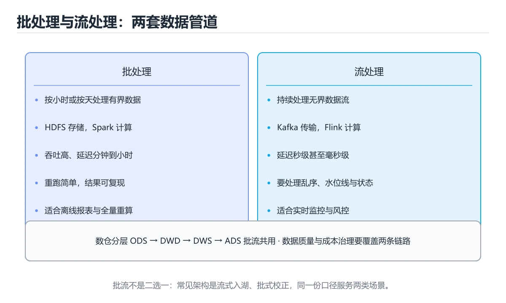
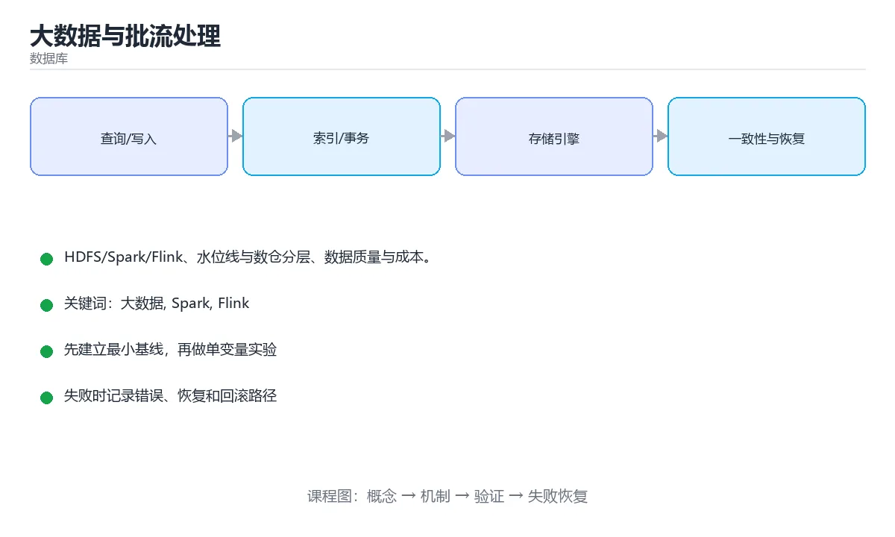

# 大数据与批流处理

> 内容更新时间：2026-10-06 · 学习阶段：进阶 · 预计用时：40 分钟





## 本节知识框架

**课程定位**：所属分类为「数据库」，课程主题为「大数据与批流处理」，学习阶段为「进阶」，建议用时 40 分钟。

**本课要解决的主问题**：HDFS/Spark/Flink、水位线与数仓分层、数据质量与成本。

| 学习层次 | 要回答的问题 | 完成判据 |
| --- | --- | --- |
| 概念层 | 「大数据与批流处理」有哪些必须区分的对象与术语？ | 能用自己的话定义核心术语，并各举一个正例和一个反例。 |
| 机制层 | 这些对象按什么顺序发生作用，输入如何变成输出？ | 能画出或写出机制步骤，并说明每一步的失败条件。 |
| 应用层 | 什么场景适合使用「大数据与批流处理」，什么场景不适合？ | 能给出一个真实场景、一个最小示例和一个边界案例。 |
| 性能层 | 时间、空间、吞吐或延迟受哪些量影响？ | 能说出复杂度或性能瓶颈的证据来源；没有证据时明确写“材料未提供”。 |
| 复习层 | 怎样确认自己不是只记住了结论？ | 能独立完成本课自测，并把错误定位到概念、机制、示例或边界。 |

### 阅读路线

1. 先读「核心概念定义」，建立「大数据」等对象的精确定义。
2. 再读「原理与运行机制」，把定义串成可重复的过程。
3. 用「代码/协议/SQL 示例」验证过程，并只改一个条件观察结果变化。
4. 最后检查性能、易错点、知识关系与自测题，形成可复习的证据链。

**前置知识**：《实战：设计并优化一个订单库》

**学习位置**：本课位于《实战：设计并优化一个订单库》之后；如果前一课的自测不能通过，应先回补再继续。

**后续衔接**：下一课《Airflow 调度与数据质量》会继续使用本课术语，学完后建议立即完成一次自测。

**教材衔接：学习目标**

- 能用自己的话解释大数据与批流处理解决了什么问题，而不是只背术语。
- 能说清 「大数据」、「Spark」、「Flink」、「数仓」 之间的关系，并分别举出一个例子。
- 能把 大数据 放回「大数据与批流处理」的知识体系，说明它和 Spark 的边界。
- 能完成本课练习，并用验收标准检查自己的结果。

> 一句话摘要：HDFS/Spark/Flink、水位线与数仓分层、数据质量与成本。

**教材衔接：前置知识**

- 先完成上一课《实战：设计并优化一个订单库》；如果已经掌握，可以直接用本课练习自测。
- 本课阶段：进阶。建议先完成「实战：设计并优化一个订单库」，或确认自己能独立跑通正文里的 deduplicate_by_key 示例。
- 开始前先复习：大数据、Spark、Flink。
- 看不懂就直接缩小例子：只保留 大数据 相关的两行输入，跑通后再加回其余部分。

**教材衔接：本课小结**

大数据的本质仍是**分治 + 并行**：存储分片、计算并行、结果汇总；批处理追求吞吐、流处理追求延迟，而数仓分层的目的是让数据加工可复用、可追溯、可治理。

## 核心概念定义

> 阅读约定：本课先给「大数据与批流处理」相关术语的操作性定义与适用边界；正文里的口语化说法与定义冲突时，以定义和可复现示例为准。

| 术语 | 操作性定义 | 本课中的边界 |
| --- | --- | --- |
| 大数据 | 规模、速度或多样性超出台式工具处理能力的数据集与处理体系。 | 仅在「大数据与批流处理」明确给出的输入、版本与资源条件下成立。 |
| Spark | 分布式数据处理引擎，用弹性数据集和内存计算完成批处理与流处理。 | 仅在「大数据与批流处理」明确给出的输入、版本与资源条件下成立。 |
| Flink | 流批一体的分布式计算引擎，以事件时间、水位线和状态管理见长，常用于实时数据处理。 | 仅在「大数据与批流处理」明确给出的输入、版本与资源条件下成立。 |
| 数仓 | 面向分析、按主题组织并保留历史的数据存储体系。 | 仅在「大数据与批流处理」明确给出的输入、版本与资源条件下成立。 |
| 水位线 | 水位线（Watermark）：用于界定"迟到的数据是否还接受"，是处理乱序的前提。 | 仅在「大数据与批流处理」明确给出的输入、版本与资源条件下成立。 |
| 数据质量 | 数据在完整性、准确性、唯一性、及时性和一致性上的满足程度。 | 仅在「大数据与批流处理」明确给出的输入、版本与资源条件下成立。 |

### 定义如何使用

在「大数据与批流处理」中判断一个说法是否成立，先确认它使用的是哪个对象的定义，再检查输入规模、运行环境与失败路径。定义不是口号，而是后续推导、代码示例和自测题共享的约束。

## 原理与运行机制

### 机制总览

1. **建立输入**：把「大数据」按本课定义整理成可观察、可重复的输入条件。
2. **执行转换**：围绕「Spark」执行本课的核心步骤；每一步都记录中间状态，避免只看最终输出。
3. **产生输出**：得到「Flink」后，用正文示例或协议/SQL 结果核对输出是否符合预期。
4. **改变一个条件**：只替换一个边界条件或环境参数，观察「大数据与批流处理」的结论是否仍然成立。

| 阶段 | 关注对象 | 失败时应检查 |
| --- | --- | --- |
| 输入 | 大数据 | 类型、范围、编码、版本或前置状态是否满足定义。 |
| 处理 | Spark | 顺序、可见性、锁、路由、事务或调度规则是否被破坏。 |
| 输出 | Flink | 结果是否可复现，错误是否被正确传播而不是被吞掉。 |

本课的机制结论要用「大数据与批流处理」自己的示例验证。「大数据与批流处理」没有给出某个数量级、吞吐或内存数据时，本课把该判断标为“材料未提供”，不从相邻主题外推。

**教材衔接：从单机到分布式**

数据量超过单机处理能力时，需要把计算拆到多台机器并行执行。核心思路始终是**分而治之**：分片存储（HDFS/对象存储）→ 并行计算（MapReduce/Spark/Flink）→ 汇总结果。

| 层次 | 组件 | 职责 |
| --- | --- | --- |
| 存储 | HDFS、S3/OSS、Iceberg/Hudi | 分布式存储与表格式（事务、时间旅行） |
| 计算 | Spark、Flink、Trino | 批处理、流处理、交互式查询 |
| 调度 | Airflow、DolphinScheduler、K8s CronJob | 任务编排、依赖管理、重试 |
| 元数据 | Hive Metastore、DataHub | 表结构、血缘与检索 |

**教材衔接：批处理与流处理**

| 维度 | 批处理（Spark） | 流处理（Flink） |
| --- | --- | --- |
| 延迟 | 分钟~小时 | 秒级甚至毫秒级 |
| 数据边界 | 有界数据集 | 无界数据流 |
| 一致性 | 一次处理整体数据 | 依赖 checkpoint 与水位线 |
| 典型场景 | 离线报表、T+1 指标 | 实时风控、实时大屏、告警 |

流处理的两个关键概念：

1. **水位线（Watermark）**：用于界定"迟到的数据是否还接受"，是处理乱序的前提。
2. **Checkpoint / 精确一次（Exactly-Once）**：定期保存状态快照，故障后从快照恢复；配合幂等写入或事务写入实现端到端精确一次。

**教材衔接：数据分层与建模**

数仓常用分层：ODS（原始贴源）→ DWD（明细清洗）→ DWS（主题汇总）→ ADS（应用层）。分层价值在于**职责隔离**：上游改动只影响 ODS 到 DWD，下游指标复用在 DWS，避免每个报表都从原始数据现算。

建表要点：按时间分区（便于裁剪）、按高基数列分桶（提升 join 效率）、小文件合并（避免 NameNode 压力）、冷热分层（热数据高性能存储、历史转对象存储）。

**教材衔接：数据质量与成本**

1. 质量校验：空值率、唯一性、枚举合法、行数波动（同比突变即告警）、跨表对账。
2. 血缘追踪：从报表能反查到源表与加工脚本，出问题能快速定位影响面。
3. 成本控制：分区裁剪、列裁剪、避免全表扫描、控制小文件、按时效分层存储；大查询加资源队列与限额。

**教材衔接：架构模式速查**

| 模式 | 结构 | 优点 | 缺点 |
| --- | --- | --- | --- |
| Lambda | 批处理 + 流处理两条链路 | 结果准确、可回溯 | 两套代码口径易不一致 |
| Kappa | 只保留流处理，靠重放历史 | 一套代码、口径统一 | 依赖消息保留与重放能力 |
| 流批一体 | 同一引擎两种模式 | 代码复用 | 引擎与运维要求高 |

## 典型应用场景

| 场景 | 典型输入或前提 | 期望产物 |
| --- | --- | --- |
| 学习验证 | 使用本课最小示例和 大数据、Spark | 能复现正文结论，并解释每一步。 |
| 工程落地 | 把「大数据与批流处理」放入真实模块或服务边界 | 输出可观测、失败可定位、参数可配置。 |
| 故障排查 | 只改一个版本、规模、输入或依赖条件 | 能区分概念错误、实现错误和环境差异。 |

判断「大数据与批流处理」的场景是否成立，标准是能否写出输入、处理、输出和失败路径；材料中没有出现的数据在本课标注为“材料未提供”，不用推测替代证据。

**课程内置实验入口**：`system_database`，用于动手验证《大数据与批流处理》的机制；实验结论不替代概念定义与复杂度分析。

## 代码/协议/SQL 示例

### 最小可验证示例

下面保留《大数据与批流处理》原文中的最小示例。先预测《大数据与批流处理》示例的输出，再按正文步骤运行或推演；示例依赖外部环境时，同时记录版本与输入。

```python
from dataclasses import dataclass, field

@dataclass
class TimeWatermark:
    """水位线：判断事件时间进度，处理乱序数据。"""

    max_event_time: int = 0
    allowed_lateness: int = 5    # 允许迟到 5 个单位

    def update(self, event_time: int) -> None:
        self.max_event_time = max(self.max_event_time, event_time)

    @property
    def watermark(self) -> int:
        return self.max_event_time - self.allowed_lateness

    def is_late(self, event_time: int) -> bool:
        return event_time < self.watermark

def deduplicate_by_key(events, key):
    """流处理中的去重：按业务键保留首次出现。"""
    seen = set()
    for event in events:
        k = key(event)
        if k in seen:
            continue
        seen.add(k)
        yield event

wm = TimeWatermark()
wm.update(100)
print(wm.watermark, wm.is_late(90), wm.is_late(96))
```

**教材衔接：数仓分层速查**

| 层 | 职责 | 示例 |
| --- | --- | --- |
| ODS | 原始数据，尽量不加工 | 业务库 binlog 落地 |
| DWD | 清洗、去重、明细 | 下单明细事实表 |
| DWS | 轻度汇总，主题宽表 | 用户日粒度行为汇总 |
| ADS | 面向应用的结果层 | 报表指标表 |
| DIM | 公共维度 | 用户、商品、门店维表 |

```python
from dataclasses import dataclass, field

@dataclass
class TimeWatermark:
    """水位线：判断事件时间进度，处理乱序数据。"""

    max_event_time: int = 0
    allowed_lateness: int = 5    # 允许迟到 5 个单位

    def update(self, event_time: int) -> None:
        self.max_event_time = max(self.max_event_time, event_time)

    @property
    def watermark(self) -> int:
        return self.max_event_time - self.allowed_lateness

    def is_late(self, event_time: int) -> bool:
        return event_time < self.watermark

def deduplicate_by_key(events, key):
    """流处理中的去重：按业务键保留首次出现。"""
    seen = set()
    for event in events:
        k = key(event)
        if k in seen:
            continue
        seen.add(k)
        yield event

wm = TimeWatermark()
wm.update(100)
print(wm.watermark, wm.is_late(90), wm.is_late(96))
```

**教材衔接：深入补充：大数据与批流处理**

前面已经建立了基本概念。这一节换一个角度，把大数据与批流处理放进真实工程里，
重点回答三件事：从单机到分布式 的机制、代价与边界。

### 一、核心模型

批处理面向有界历史数据，流处理面向无界实时事件；两者共享数据模型和计算逻辑，但时间语义、状态、容错和结果更新方式不同。

```text
数据源 → 批/流读取 → 清洗与转换 → 窗口/聚合 → 状态与检查点 → 结果写入 → 监控与补偿
```

### 二、关键机制拆解

1. 批处理按分区并行读取完整数据集，适合回溯、重算和对账。
2. 流处理持续消费事件，按事件时间开窗并用水位线处理乱序。
3. 批流统一的核心是同一套逻辑和表抽象，减少两套代码产生口径差异。
4. 状态大小决定检查点、恢复时间和资源成本，必须设置 TTL 和清理策略。
5. 端到端一致性依赖可重放源、幂等写入或事务提交。
6. 数据倾斜会让少数分区处理大部分数据，需要加盐、重分区或两阶段聚合。
7. 结果正确性需要延迟、完整性和成本三者权衡，不能只追求最低延迟。

### 三、对照表：抓住容易混淆的边界

| 维度 | 一侧 | 另一侧 |
| --- | --- | --- |
| 批处理 | 有界数据、一次执行 | 适合历史全量和复杂回溯 |
| 流处理 | 无界数据、持续执行 | 适合实时指标和事件响应 |
| 处理时间 | 按节点时间计算 | 简单但受延迟影响 |
| 事件时间 | 按事件发生时间计算 | 需要水位线和迟到处理 |

### 四、工作示例

日销售报表用批处理重算历史，实时看板用流处理展示分钟级趋势；两者共享同一份明细层和聚合函数，最终以批处理结果校准流处理结果，避免口径漂移。

### 五、常见误区与失效边界

| 错误做法或假设 | 后果 | 正确做法 |
| --- | --- | --- |
| 批流各写一套逻辑 | 指标口径不一致 | 抽取共享计算逻辑和表抽象 |
| 忽略迟到数据 | 实时结果偏低 | 设置水位线、侧输出和补偿重算 |
| 状态无限增长 | 检查点失败、成本上涨 | 设置 TTL 和状态清理 |
| 只看吞吐不看延迟 | 积压时报表越来越旧 | 同时监控端到端延迟和消费滞后 |

### 六、场景推演

实时大屏和离线报表金额不一致。排查发现流处理丢弃了迟到事件，而批处理包含全部数据。修复方案是流处理增加侧输出和延迟补偿，批处理结果作为最终对账依据。

### 七、自测问答

**Q1：批处理和流处理最大的差异是什么？**

批处理处理有界历史数据，流处理持续处理无界事件。

**Q2：水位线解决什么问题？**

估计事件时间进度，决定窗口何时触发并处理迟到数据。

**Q3：为什么需要统一批流逻辑？**

避免两套实现产生指标口径差异和维护成本。

**Q4：数据倾斜怎么缓解？**

加盐、重分区、两阶段聚合或拆分热点键。

### 八、小项目：把知识变成可检查的产出

用同一份订单数据实现批处理和流处理两个版本，分别计算每分钟销售额；人为加入乱序和迟到事件，比较结果差异并实现一次补偿重算。

### 九、适用边界

批流统一是工程目标，不是必须用同一引擎。需要根据延迟、成本、团队能力和一致性要求选择架构，并对结果差异建立校验。

### 十、完成检查清单

- [ ] 能区分批处理与流处理
- [ ] 能设计事件时间和窗口
- [ ] 能处理状态与检查点
- [ ] 能识别数据倾斜
- [ ] 能设计批流对账与补偿

### 十一、复习顺序

1. 不看资料讲清「大数据与批流处理」的核心模型，并各举一个正例和反例。
2. 再对照表逐行解释容易混淆的概念，每个概念补一个反例。
3. 跟着工作示例做一遍，改变一个条件并预测结果。
4. 用自测问答检查理解，错题回到对应小节重新阅读。
5. 把 Spark 的实现、测试与复盘整理成一份可提交的产物。

> 复习不是重读一遍，而是离开原文重新产出：复述、改写、验证、复盘。

## 时间/空间复杂度或性能分析

**复杂度证据**：「大数据与批流处理」的现有材料没有给出渐近时间或空间复杂度的明确结论，本课只做定性检查，不补写未经验证的 $O$ 记号。

| 维度 | 本课关注点 | 判断依据 |
| --- | --- | --- |
| 时间/延迟 | 「大数据与批流处理」的主要步骤是否会随输入规模、并发度或网络往返增长。 | 以正文复杂度、基准数据或可重复测量为准。 |
| 空间/内存 | 中间状态、缓存、副本、连接或索引是否随规模增长。 | 记录峰值内存与数据副本，不只看最终结果。 |
| 吞吐/资源 | 版本、调度、锁、IO、序列化或协议开销是否成为瓶颈。 | 固定环境做对照实验，改变一个变量。 |

评估「大数据与批流处理」时要区分“正确性成立”和“性能达标”两件事；材料没有给出基准时，本课只保留量级来源与测量方法，不写不可验证的绝对数字。

## 常见误区与易错点

> 复核《大数据与批流处理》的易错点时，优先保留原文的错误表、故障现场与排错路径；每条修正都要能用本课示例复验。

| 易错点 | 常见表现 | 正确做法 |
| --- | --- | --- |
| 只背结论 | 能复述「大数据与批流处理」的定义，却说不清输入、输出与边界。 | 回到机制步骤，用最小示例逐一验证。 |
| 混淆相邻概念 | 把本课对象与相邻主题的对象当成同一类。 | 先比较定义、资源归属、生命周期和失败模式。 |
| 忽略版本与环境 | 在开发机通过后直接外推到生产环境。 | 固定版本、输入和资源条件，再记录可复现结果。 |

**教材衔接：常见错误与排查**

| 容易踩的做法 | 实际现象 | 原因与正确做法 |
| --- | --- | --- |
| 只按处理时间统计 | 结果随到达顺序波动 | 用事件时间 + 水位线 |
| 不允许迟到数据 | 指标偏低 | 设置允许迟到并配侧输出 |
| 批流两套口径不一致 | 同一指标两个数 | 统一口径，必要时改为 Kappa |
| 不做幂等写入 | 重跑产生重复数据 | 用主键 upsert 或分区覆盖 |
| 忽略数据倾斜 | 个别任务极慢 | 加盐打散或两阶段聚合 |
| 分区过多或过少 | 小文件或并行度不足 | 按数据量估算并定期合并 |
| 状态不设过期 | 状态无限增长 | 配置 TTL 与状态清理 |
| 依赖默认并行度 | 资源利用率低 | 按分区数与数据量设置并行度 |
| 不做 checkpoint | 故障后数据丢失 | 开启 checkpoint 并验证恢复 |
| 只跑通流程不看监控 | 出问题无感知 | 监控延迟、积压与失败率 |

**教材衔接：故障现场**

### 现场 1：只按处理时间统计

**症状**：在《大数据与批流处理》的复现场景中，结果随到达顺序波动。

**根因**：触发点是把“只按处理时间统计”当成安全做法。它没有满足《大数据与批流处理》要求的前提，因此先表现为“结果随到达顺序波动”；排查时先完整复现这一段，再核对输入、配置与依赖。

**修复**：针对《大数据与批流处理》的问题，用事件时间 + 水位线。

**验证**：先在《大数据与批流处理》中记录“只按处理时间统计”留下的失败证据，再执行“用事件时间 + 水位线”并重放；确认错误路径变为明确结果，且修复没有掩盖同类故障。

### 现场 2：批流两套口径不一致

**症状**：在《大数据与批流处理》的复现场景中，同一指标两个数。

**根因**：“同一指标两个数”只是表层结果。向上追溯会落到“批流两套口径不一致”这一步，因为它省略了《大数据与批流处理》的约束，使实现行为和预期模型发生了偏离。

**修复**：针对《大数据与批流处理》的问题，统一口径，必要时改为 Kappa。

**验证**：保留《大数据与批流处理》里触发“同一指标两个数”的输入、版本和日志，按“统一口径，必要时改为 Kappa”完成修改后原样重放；只有失败现象消失且相邻场景仍可解释，才保留改动。

### 现场 3：不做幂等写入

**症状**：在《大数据与批流处理》的复现场景中，重跑产生重复数据。

**根因**：“重跑产生重复数据”只是表层结果。向上追溯会落到“不做幂等写入”这一步，因为它省略了《大数据与批流处理》的约束，使实现行为和预期模型发生了偏离。

**修复**：针对《大数据与批流处理》的问题，用主键 upsert 或分区覆盖。

**验证**：先在《大数据与批流处理》中记录“不做幂等写入”留下的失败证据，再执行“用主键 upsert 或分区覆盖”并重放；确认错误路径变为明确结果，且修复没有掩盖同类故障。

## 与其他知识点的关系

| 关系 | 课程 | 为什么 |
| --- | --- | --- |
| 先修 | 《实战：设计并优化一个订单库》 | 本课会直接使用它的概念或操作前提。 |
| 关联 | 《数据湖与湖仓一体》 | 用于横向比较或把本课结论迁移到相邻主题。 |
| 前置顺序 | 《实战：设计并优化一个订单库》 | 同分类中安排在本课之前，建议先完成其自测。 |
| 后续顺序 | 《Airflow 调度与数据质量》 | 同分类中安排在本课之后，会继续使用本课术语。 |

把「大数据与批流处理」放回知识体系时，不只要记住“前面学过什么”，还要说明两个主题在输入、机制、资源边界和失败模式上的差异。这样才能把单课知识迁移到项目、排障和后续课程。

**教材衔接：批处理与流处理对照**

| 维度 | 批处理 | 流处理 |
| --- | --- | --- |
| 输入 | 有界数据集 | 无界数据流 |
| 延迟 | 分钟到小时 | 毫秒到秒 |
| 典型引擎 | Spark、Hive、MapReduce | Flink、Kafka Streams、Spark Structured Streaming |
| 语义 | 一次处理全量 | 持续处理增量 |
| 状态 | 任务级 | 需要状态管理与容错 |
| 适用 | 报表、回溯、离线特征 | 实时监控、风控、实时特征 |

## 自测题与参考答案

> 先独立作答《大数据与批流处理》的自测题，再对照答案与解析；每处判断都要能在本课正文或示例中找到依据。

### 自测 1

批处理与流处理的核心区别是？

A. 编程语言不同
B. 是否需要集群
C. 存储格式不同
D. 数据是否有界

**参考答案**：数据是否有界

**解析**：在「大数据与批流处理」里，数据是否有界。批处理面对有界数据集追求吞吐，流处理面对无界数据流追求低延迟。回到「大数据与批流处理」的正文示例，用“批处理与流处理的核心区别是”走一遍大数据、Spark、Flink的完整流程，能复现的结论才可以保留。

### 自测 2

围绕“大数据与批流处理”中的 大数据、Spark、Flink，下列哪两项是本课强调的实践判断？

A. 学习 大数据 时要同时说明输入、输出和失败路径，不能只看正常流程
B. 只要 大数据 的常规示例通过，就可以跳过边界与异常路径
C. 验证 Spark 时要固定版本并覆盖边界输入，结论才可复现
D. 把 Spark 的单次运行结果当成所有版本和规模都成立

**参考答案**：学习 大数据 时要同时说明输入、输出和失败路径，不能只看正常流程；验证 Spark 时要固定版本并覆盖边界输入，结论才可复现

**解析**：本课把大数据与批流处理拆成概念、示例与故障现场三部分，因此判断 大数据 时必须同时交代输入、输出和失败路径，这使“学习 大数据 时要同时说明输入、输出和失败路径，不能只看正常流程”成立。在大数据与批流处理里，判断 Spark 时要固定版本与边界输入，所以“验证 Spark 时要固定版本并覆盖边界输入，结论才可复现”才可复现。

### 自测 3

阅读「大数据与批流处理」正文里的这段 Python 代码，下面哪一项判断是正确的？

```python
from dataclasses import dataclass, field

@dataclass
class TimeWatermark:
    """水位线：判断事件时间进度，处理乱序数据。"""

    max_event_time: int = 0
    allowed_lateness: int = 5    # 允许迟到 5 个单位

    def update(self, event_time: int) -> None:
        self.max_event_time = max(self.max_event_time, event_time)

    @property
    def watermark(self) -> int:
        return self.max_event_time - self.allowed_lateness

    def is_late(self, event_time: int) -> bool:
        return event_time < self.watermark

def deduplicate_by_key(events, key):
    """流处理中的去重：按业务键保留首次出现。"""
    seen = set()
    for event in events:
        k = key(event)
        if k in seen:
            continue
        seen.add(k)
        yield event

wm = TimeWatermark()
wm.update(100)
print(wm.watermark, wm.is_late(90), wm.is_late(96))
```

A. 这段代码会读取外部输入，结果依赖传入的数据。
B. 这段代码只做静态声明，没有循环、分支或可观察输出。
C. 这段代码包含异常处理分支，失败时会走专门的补救路径。
D. 这段代码包含条件分支，不同输入会走不同的执行路径。

**参考答案**：这段代码包含条件分支，不同输入会走不同的执行路径。

**解析**：在「大数据与批流处理」里，题干的正确项是这段代码包含条件分支，不同输入会走不同的执行路径，在「大数据与批流处理」里分支条件由大数据决定，替换条件后结论可能变化。把输入或边界换成空值、极值或失败情况后，结论要以「大数据与批流处理」的实际运行结果为准。“阅读大数据与批流处理正文里的这段”与「大数据与批流处理」的术语表相呼应，只有符合大数据、Spark、Flink约束的“这段代码包含条件分支”才是正文支持的结论。

**教材衔接：复习与自测**

- [ ] 能按延迟与数据边界选择批或流处理。
- [ ] 流处理统一使用事件时间与水位线。
- [ ] 数仓分层职责清晰（ODS / DWD / DWS / ADS）。
- [ ] 关键任务有 checkpoint、幂等与监控。
- [ ] 会处理数据倾斜与状态膨胀。

**教材衔接：动手练习**

> 本课练习重点：围绕「大数据、Spark、Flink」完成复述、实验和交付，每个结果都要能被别人检查。

先确定 Spark 的约束，再决定索引与事务边界。

### 练习 1：建立心智模型（10 分钟）

合上教程，用 3～5 句话回答：

1. 大数据与批流处理解决了什么问题？
2. 如果没有它，会出现什么具体后果？
3. 它和「Spark」是什么关系？

验收标准：回答里必须出现 大数据，并写出一个让结论失效的边界条件。

### 练习 2：做一次可控实验（20 分钟）

从正文中选一个最小示例，完成以下操作：

1. 先预测修改一个参数、输入或步骤后的结果。
2. 再实际执行或逐步推演，记录真实结果。
3. 如果结果与预测不同，写出差异原因。

**验收标准**：把 deduplicate_by_key 当作原例，改动一次Spark的取值，记录命令、输出与差异原因；五步里缺任意一步都算未完成。

### 练习 3：交付一个小结果（30 分钟）

在 SQLite 或纸面表结构上写 大数据 的查询，分别验证正常、空值和边界数据。

任务要求：

- 结果必须能被别人检查，不能只写“我已经理解了”。
- 至少覆盖「大数据」和「Spark」两个关键词。
- 写出 1 个仍然不确定的问题，以及下一步如何验证。

> 提示：时间有限时优先做练习 1 和练习 2；练习 3 可以拆成两次完成。

**教材衔接：可运行练习**

### 任务 1：先跑通，再解释

```python
from dataclasses import dataclass, field

@dataclass
class TimeWatermark:
    """水位线：判断事件时间进度，处理乱序数据。"""

    max_event_time: int = 0
    allowed_lateness: int = 5    # 允许迟到 5 个单位

    def update(self, event_time: int) -> None:
        self.max_event_time = max(self.max_event_time, event_time)

    @property
    def watermark(self) -> int:
        return self.max_event_time - self.allowed_lateness

    def is_late(self, event_time: int) -> bool:
        return event_time < self.watermark

def deduplicate_by_key(events, key):
    """流处理中的去重：按业务键保留首次出现。"""
    seen = set()
    for event in events:
        k = key(event)
        if k in seen:
            continue
        seen.add(k)
        yield event

wm = TimeWatermark()
wm.update(100)
print(wm.watermark, wm.is_late(90), wm.is_late(96))
```

### 任务 2：只改一个条件

把「大数据与批流处理」的最小示例复制一份，只改一个条件再跑一次：

- 改动点：只调整 deduplicate_by_key 的一个参数，其余条件一律不动。
- 预测：先写下「大数据与批流处理」在改动后的输出或错误信息，再运行。
- 记录：对照改动前后的结果，指出差异出在哪一步。
- 验收：换回原条件能复现原结果，改动只影响大数据。

### 任务 3：迁移到自己的数据

用同一套思路处理一组你自己的 大数据 数据，保持输出格式与任务 1 一致。

**教材衔接：本课复习清单**

离开本课前，逐项确认：

- [ ] 不看解析，能说出「批处理与流处理的核心区别是？」的判断依据。
- [ ] 不看解析，能说出「流处理中水位线（Watermark）的作用是？」的判断依据。
- [ ] 不看解析，能说出「数仓分层的 ODS→DWD→DWS→ADS 中，DWS 的职责是？」的判断依据。
- [ ] 不看解析，能说出「Lambda 架构与 Kappa 架构的区别是？」的判断依据。
- [ ] 不看解析，能说出「Spark 中数据倾斜的常见处理方式是？」的判断依据。
- [ ] 跑通「大数据与批流处理」的最小示例，并记录一次失败输入的处理方式。
- [ ] 把本课最容易混淆的两个概念写成一句话对照。

| 复盘项 | 记录 |
| --- | --- |
| 已经能独立解释的考点 |  |
| 仍然说不清的概念 |  |
| 下一步验证动作 |  |

---

## 术语速查

| 术语 | 一句话说明 |
| --- | --- |
| `大数据` | 规模、速度或多样性超出台式工具处理能力的数据集与处理体系。 |
| `Spark` | 分布式数据处理引擎，用弹性数据集和内存计算完成批处理与流处理。 |
| `Flink` | 流批一体的分布式计算引擎，以事件时间、水位线和状态管理见长，常用于实时数据处理。 |
| `数仓` | 面向分析、按主题组织并保留历史的数据存储体系。 |
| `水位线` | 水位线（Watermark）：用于界定"迟到的数据是否还接受"，是处理乱序的前提。 |
| `数据质量` | 数据在完整性、准确性、唯一性、及时性和一致性上的满足程度。 |

## 考点精讲

### 考点 1：概念判断·大数据

- **题目**：批处理与流处理的核心区别是？
- **判断依据**：在「大数据与批流处理」里，数据是否有界。批处理面对有界数据集追求吞吐，流处理面对无界数据流追求低延迟。回到「大数据与批流处理」的正文示例，用“批处理与流处理的核心区别是”走一遍大数据、Spark、Flink的完整流程，能复现的结论才可以保留。

### 考点 2：多选辨析·大数据

- **题目**：围绕“大数据与批流处理”中的 大数据、Spark、Flink，下列哪两项是本课强调的实践判断？
- **判断依据**：本课把大数据与批流处理拆成概念、示例与故障现场三部分，因此判断 大数据 时必须同时交代输入、输出和失败路径，这使“学习 大数据 时要同时说明输入、输出和失败路径，不能只看正常流程”成立。在大数据与批流处理里，判断 Spark 时要固定版本与边界输入，所以“验证 Spark 时要固定版本并覆盖边界输入，结论才可复现”才可复现。

### 考点 3：概念判断·大数据

- **题目**：数仓分层的 ODS→DWD→DWS→ADS 中，DWS 的职责是？
- **判断依据**：DWS 按主题做汇总，供多个报表复用，避免每个报表都从原始数据现算。在「大数据与批流处理」里，其他选项：DWS 是按主题汇总的中间层。在「大数据与批流处理」里，如果只凭关键词作答，很容易把「明细清洗数据」、「原始贴源数据」与「按主题汇总的中间层」混在一起；回到「大数据与批流处理」的正文示例，用“数仓分层的 ODS→DWD→DWS→”走一遍大数据、Spark、Flink的完整流程，能复现的结论才可以保留。

### 考点 4：概念判断·大数据

- **题目**：Lambda 架构与 Kappa 架构的区别是？
- **判断依据**：在「大数据与批流处理」里，结论应落在「Lambda 同时维护批处理与流处理两套链路」。Lambda 的代价是两套代码要保证口径一致。在「大数据与批流处理」里，这道题要求区分概念与边界，「Lambda 同时维护批处理与流处理两套链路」只有在题干给出的前提下才成立，而「Lambda 不能处理历史数据，但它只覆盖了部分情况」、「两者完全相同」缺少同一组条件。

### 考点 5：代码补全·大数据

- **题目**：阅读「大数据与批流处理」正文里的这段 Python 代码，下面哪一项判断是正确的？
- **判断依据**：在「大数据与批流处理」里，题干的正确项是这段代码包含条件分支，不同输入会走不同的执行路径，在「大数据与批流处理」里分支条件由大数据决定，替换条件后结论可能变化。把输入或边界换成空值、极值或失败情况后，结论要以「大数据与批流处理」的实际运行结果为准。“阅读大数据与批流处理正文里的这段”与「大数据与批流处理」的术语表相呼应，只有符合大数据、Spark、Flink约束的“这段代码包含条件分支”才是正文支持的结论。

### 考点 6：填空·大数据

- **题目**：补全代码：「大数据与批流处理」示例中，下面这行代码缺少哪个关键字或函数名？请填入 ____。 `def ____(self) -> int:`
- **判断依据**：在「大数据与批流处理」里判断这道题，要把大数据、Spark、Flink的条件、过程与失败路径逐项对齐，换成“补全代码”这个场景，只有满足前提的结论才成立。“大数据与批流处理示例中”与「大数据与批流处理」的术语表相呼应，只有符合大数据、Spark、Flink约束的“watermark”才是正文支持的结论。

## English Overview

**Title:** Big Data & Stream Processing

**Summary:** HDFS, Spark, Flink, watermarks, layering and cost.

**Category:** Database
**Level:** 进阶
**Key terms:** 大数据, Spark, Flink, 数仓, 水位线, 数据质量

## 内容元数据

- 内容版本：v2.0
- 最后更新：2026-10-06
- 学习阶段：进阶
- 适用环境：PostgreSQL / MySQL / SQLite 等主流数据库；本课聚焦其中的 大数据。
- 内容来源：内置结构化课程与工程实践整理
- 相关主题：大数据、Spark、Flink、数仓、水位线、数据质量
- 质量版本：P0 测验标准 + P1 覆盖扩展 + P2 体验补全

## 参考资料与复核

- 最后复核：2026-10-04
- 下次复核：2027-06-17
- 复核范围：版本兼容、API 行为、安全建议与工程实践
- 来源性质：官方文档、标准或权威教材；正文为离线教学重组

| 参考资料 | 本课用途 |
| --- | --- |
| [MySQL 文档](https://dev.mysql.com/doc/) | 关系数据库与 InnoDB |
| [PostgreSQL 事务教程](https://www.postgresql.org/docs/current/tutorial-transactions.html) | ACID 与隔离级别 |
| [数据库规范化](https://learn.microsoft.com/office/troubleshoot/access/database-normalization-description) | 范式与表设计 |

> 「大数据与批流处理」的链接用于离线阅读后的延伸核对；App 不会自动联网。
