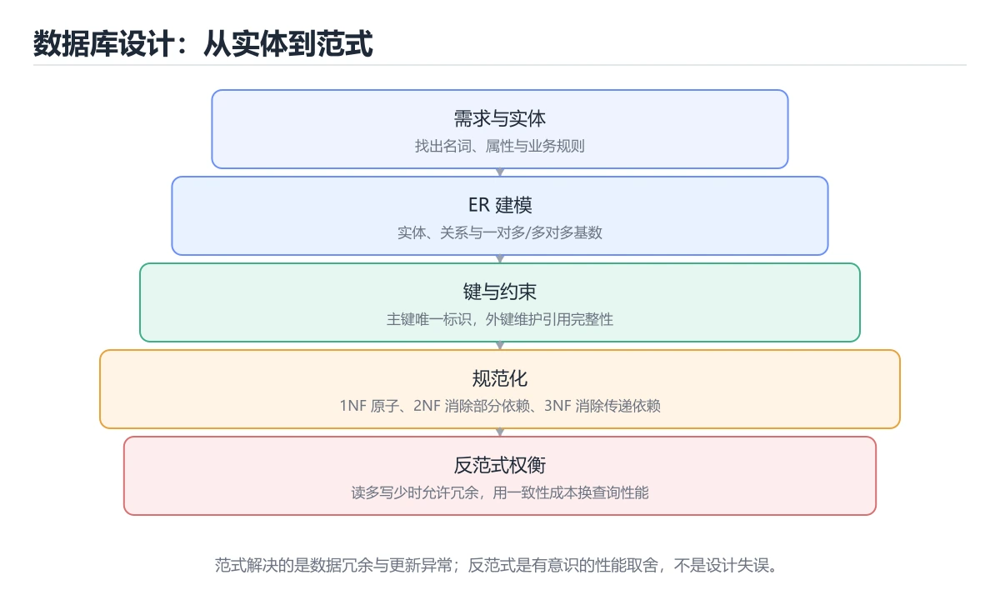
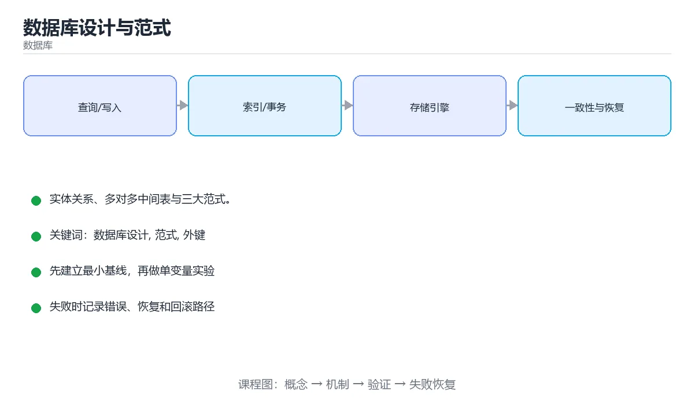

# 数据库设计与范式

> 内容更新时间：2026-10-06 · 学习阶段：进阶 · 预计用时：35 分钟





## 学习目标

- 能用自己的话解释数据库设计与范式解决了什么问题，而不是只背术语。
- 能说清 「数据库设计」、「范式」、「外键」、「中间表」 之间的关系，并分别举出一个例子。
- 能把 数据库设计 放回「数据库设计与范式」的知识体系，说明它和 范式 的边界。
- 能完成本课练习，并用验收标准检查自己的结果。

> 一句话摘要：实体关系、多对多中间表与三大范式。

## 前置知识

- 先完成上一课《事务》；如果已经掌握，可以直接用本课练习自测。
- 本课阶段：进阶。建议先完成「事务」，或确认自己能独立跑通正文里的 CURRENT_TIMESTAMP 示例。
- 开始前先复习：数据库设计、范式、外键。
- 如果 从需求到表 这一步看不懂，先记录具体卡点，再用 CURRENT_TIMESTAMP 复现一遍。

## 从需求到表

1. 找出**实体**（用户、订单、商品）→ 每张表。
2. 找出**属性**（字段）与**关系**（一对多、多对多）。
3. 确定主键、唯一约束、外键与索引。
4. 检查范式，必要时为性能做反范式。

多对多关系需要中间表：

```sql
CREATE TABLE order_items (
    order_id   INTEGER NOT NULL REFERENCES orders(id),
    product_id INTEGER NOT NULL REFERENCES products(id),
    quantity   INTEGER NOT NULL CHECK (quantity > 0),
    price      REAL    NOT NULL,        -- 下单时价格快照
    PRIMARY KEY (order_id, product_id)
);
```

## 三种常见关系

| 关系 | 实现方式 |
| --- | --- |
| 一对一 | 主键即外键，或独立表存扩展信息 |
| 一对多 | 多的一方存外键 |
| 多对多 | 中间表存双方主键 + 关系属性 |

## 范式

- **1NF**：字段不可再分（不要在一列里存逗号分隔的多个值）。
- **2NF**：非主键字段完全依赖整个主键（针对复合主键）。
- **3NF**：非主键字段不传递依赖于主键。

```text
不合 3NF：orders(order_id, customer_id, customer_name, customer_phone)
                          ↑ customer_name 依赖 customer_id，而不是直接依赖 order_id
修正：拆出 customers 表，orders 只保留 customer_id
```

反范式（冗余）用于减少 JOIN，例如订单表冗余商品名称与单价快照，代价是要维护一致性。

## 字段设计建议

1. 每张表都有主键，优先用无业务含义的自增/雪花 ID。
2. 金额用 `DECIMAL`，不要用浮点。
3. 时间统一存 UTC 或带时区类型。
4. 布尔语义用明确命名（`is_active`）。
5. 预留 `created_at` / `updated_at` 方便排查。
6. 适当加约束（NOT NULL / UNIQUE / CHECK），让数据库守住底线。

## 本课小结

设计顺序是**实体 → 关系 → 键 → 约束 → 索引**；先满足 3NF 保证一致性，再根据查询压力做有意识的冗余。

## 范式速查

| 范式 | 要求 | 解决的问题 |
| --- | --- | --- |
| 1NF | 字段原子、不可再分 | 一个字段存多个值 |
| 2NF | 消除非主属性对主键的部分依赖 | 复合主键下的冗余 |
| 3NF | 消除传递依赖 | 非主属性依赖非主属性 |
| BCNF | 每个决定因素都是候选键 | 主属性间的依赖异常 |

## 建模速查

| 关系 | 实现方式 |
| --- | --- |
| 一对多 | 多的一方加外键 |
| 多对多 | 中间关联表（联合唯一索引） |
| 一对一 | 共享主键或唯一外键 |
| 树形结构 | 父节点 ID / 路径枚举 / 闭包表 |

| 字段类型 | 建议 |
| --- | --- |
| 主键 | 无业务含义的自增或雪花 ID |
| 金额 | `DECIMAL(12,2)` 或整数分 |
| 时间 | `DATETIME(3)`，存 UTC |
| 布尔 | `TINYINT(1)` 或枚举字符串 |
| 枚举状态 | `VARCHAR` + 约束，或字典表 |
| 大文本 | 单独表或对象存储 + 引用 |
| JSON | 仅用于结构多变的扩展字段 |

```sql
-- 多对多：中间表必须有联合唯一索引，避免重复关联
CREATE TABLE user_roles (
    user_id BIGINT NOT NULL,
    role_id BIGINT NOT NULL,
    granted_at DATETIME(3) NOT NULL DEFAULT CURRENT_TIMESTAMP(3),
    PRIMARY KEY (user_id, role_id),
    KEY idx_role (role_id, user_id)
);

-- 适度反范式：订单表冗余商品快照，避免历史订单随商品改价而变
CREATE TABLE order_items (
    id BIGINT PRIMARY KEY AUTO_INCREMENT,
    order_id BIGINT NOT NULL,
    product_id BIGINT NOT NULL,
    product_name VARCHAR(128) NOT NULL,      -- 快照
    unit_price DECIMAL(12,2) NOT NULL,       -- 快照
    quantity INT NOT NULL,
    KEY idx_order (order_id)
);

-- 逻辑删除：把删除标记纳入唯一索引，保留唯一性约束
CREATE TABLE coupons (
    id BIGINT PRIMARY KEY AUTO_INCREMENT,
    code VARCHAR(32) NOT NULL,
    deleted_at DATETIME(3) NULL,
    UNIQUE KEY uk_code (code, deleted_at)
);
```

## 常见错误与排查

| 容易写错的做法 | 实际现象 | 原因与正确做法 |
| --- | --- | --- |
| 用业务字段（手机号、身份证）作主键 | 变更困难、索引膨胀 | 用无业务含义的代理主键 |
| 金额用 `FLOAT` / `DOUBLE` | 精度丢失 | 用 `DECIMAL` 或整数分 |
| 时间字段不做时区约定 | 跨时区数据错乱 | 统一存 UTC，展示时转换 |
| 无脑反范式 | 一致性维护成本高 | 先规范化，再按读性能冗余 |
| 中间表不加联合唯一索引 | 出现重复关联 | 用联合主键或唯一索引 |
| 大字段与热字段同表 | 查询变慢、页利用率低 | 拆表或存对象存储 |
| 用 `ENUM` 表示会变的状态 | 加值要改表结构 | 用字典表或字符串 + 约束 |
| 逻辑删除后唯一索引冲突 | 无法再次创建同名校验 | 把删除时间纳入唯一索引 |
| 忘记外键或约束 | 脏数据进入 | 关键关系加约束或应用层校验 |
| 表设计不考虑查询模式 | 后期频繁加索引与改表 | 先梳理核心查询再定字段 |

## 复习与自测

- [ ] 能说出 1NF 到 3NF 的核心要求。
- [ ] 多对多关系用中间表 + 联合唯一索引。
- [ ] 金额、时间、布尔字段选对类型。
- [ ] 需要冗余时说明一致性的维护方案。
- [ ] 表设计前先列出核心查询与访问模式。

## 动手练习

> 本课练习重点：围绕「数据库设计、范式、外键」完成复述、实验和交付，每个结果都要能被别人检查。

为 CURRENT_TIMESTAMP 准备正常、空值与边界数据，并用执行计划验证索引是否生效。

### 练习 1：建立心智模型（10 分钟）

合上教程，用 3～5 句话回答：

1. 数据库设计与范式解决了什么问题？
2. 如果没有它，会出现什么具体后果？
3. 它和「范式」是什么关系？

验收标准：用自己的话解释 数据库设计，并给出一个它不成立的反例。

### 练习 2：做一次可控实验（20 分钟）

从正文中选一个最小示例，完成以下操作：

1. 先预测修改一个参数、输入或步骤后的结果。
2. 再实际执行或逐步推演，记录真实结果。
3. 如果结果与预测不同，写出差异原因。

**验收标准**：用 CURRENT_TIMESTAMP 复现原例后，把范式改成边界值，五步记录缺一不可，其中「原因」一栏要写明「数据库设计与范式」里哪条规则被触发。

### 练习 3：交付一个小结果（30 分钟）

在 SQLite 或纸面表结构上写 数据库设计 的查询，分别验证正常、空值和边界数据。

任务要求：

- 结果必须能被别人检查，不能只写“我已经理解了”。
- 至少覆盖「数据库设计」和「范式」两个关键词。
- 写出 1 个仍然不确定的问题，以及下一步如何验证。

> 提示：时间有限时优先做练习 1 和练习 2；练习 3 可以拆成两次完成。

## 深入补充：数据库设计与范式

前面已经建立了基本概念。这一节换一个角度，把数据库设计与范式放进真实工程里，
重点回答三件事：从需求到表 的机制、代价与边界。

### 一、核心模型

数据库设计的核心是让数据模型准确表达业务约束，并在一致性、查询性能和演进成本之间取平衡。范式用于减少冗余，反范式用于优化读取，两者都要服务于明确的访问模式。

```text
识别实体与关系 → 定义键与约束 → 规范化 → 梳理查询模式 → 选择索引 → 评估反范式 → 设计迁移与回滚
```

### 二、关键机制拆解

1. 实体是业务对象，关系是一对一、一对多或多对多；多对多关系通常需要关联表并定义联合唯一约束。
2. 主键标识一行，候选键是可选唯一标识，外键维护引用完整性，业务键不应随意替换稳定主键。
3. 第一范式要求字段原子，第二范式消除部分依赖，第三范式消除传递依赖，BCNF 进一步约束决定因素。
4. 规范化减少更新异常和冗余，但复杂查询可能需要更多连接；反范式适合读多写少且有明确一致性策略的场景。
5. 约束应尽量下沉到数据库，包括非空、唯一、检查和外键，不能只依赖应用层校验。
6. 索引要围绕查询模式设计，联合索引顺序、选择性和覆盖能力比“索引越多越好”更重要。
7. Schema 变更必须考虑在线迁移、双写、回填、校验和回滚，不能把 DDL 当成一次性操作。

### 三、对照表：抓住容易混淆的边界

| 维度 | 一侧 | 另一侧 |
| --- | --- | --- |
| 规范化 | 减少冗余和更新异常 | 查询连接多，读性能可能下降 |
| 反范式 | 复制数据换取读取性能 | 需要处理一致性和回填 |
| 主键 | 稳定标识一行 | 不承载业务含义更安全 |
| 业务键 | 有业务意义的唯一值 | 可能变化，需谨慎作为主键 |

### 四、工作示例

订单系统可拆成 orders、order_items、products、users 四张表。订单存用户与状态，明细存商品快照和数量，商品价格在创建订单时快照，避免商品改价影响历史订单。列表查询通过联合索引覆盖用户、状态和创建时间。

### 五、常见误区与失效边界

| 错误做法或假设 | 后果 | 正确做法 |
| --- | --- | --- |
| 所有字段塞进一张大表 | 更新异常、空值多、查询难优化 | 按实体和访问模式拆分并建立约束 |
| 为了性能过早反范式 | 一致性逻辑散落各处 | 先用范式和索引解决，再基于测量反范式 |
| 用业务字段当主键 | 业务变更导致大量级联修改 | 使用稳定代理键并给业务键加唯一约束 |
| 上线前才想迁移方案 | 大表变更锁表或回滚困难 | 设计双写、分批回填和校验流程 |

### 六、场景推演

把用户邮箱从单值改成多值。正确迁移顺序是：新增邮箱表并双写；回填历史数据并持续校验；读路径逐步切换；确认无差异后再移除旧列。整个过程允许回滚，且不能一次性锁住用户表。

### 七、自测问答

**Q1：多对多关系为什么需要关联表？**

它把两个实体之间的多重关系拆成多条可约束的记录。

**Q2：第三范式解决了什么问题？**

消除非主属性之间的传递依赖，减少更新异常。

**Q3：什么时候适合反范式？**

读多写少、连接成本高且能接受明确的一致性维护方案时。

**Q4：为什么迁移要支持回滚？**

线上变更存在未知风险，必须能在异常时恢复服务。

### 八、小项目：把知识变成可检查的产出

为一个图书借阅系统设计表结构，至少包含读者、图书、副本、借阅记录和罚款；写出主键、外键、唯一约束、三个典型查询及对应索引，并说明一处反范式设计及一致性策略。

### 九、适用边界

没有绝对正确的范式级别，只有与业务访问模式匹配的模型。设计必须同时考虑数据规模、一致性要求、查询延迟、迁移成本和团队维护能力。

### 十、完成检查清单

- [ ] 能从业务描述中抽取实体和关系
- [ ] 能正确使用主键、外键和唯一约束
- [ ] 能解释 1NF 到 BCNF 的取舍
- [ ] 能围绕查询设计联合索引
- [ ] 能写出可回滚的 Schema 迁移步骤

## 可运行练习

### 任务 1：先跑通，再解释

```sql
CREATE TABLE order_items (
    order_id   INTEGER NOT NULL REFERENCES orders(id),
    product_id INTEGER NOT NULL REFERENCES products(id),
    quantity   INTEGER NOT NULL CHECK (quantity > 0),
    price      REAL    NOT NULL,        -- 下单时价格快照
    PRIMARY KEY (order_id, product_id)
);
```

### 任务 2：只改一个条件

把「数据库设计与范式」的最小示例复制一份，只改一个条件再跑一次：

- 改动点：把 范式 换成边界值，其他输入保持原样。
- 预测：先写下「数据库设计与范式」在改动后的输出或错误信息，再运行。
- 记录：对照改动前后的结果，指出差异出在哪一步。
- 验收：换回原条件能复现原结果，改动只影响数据库设计。

### 任务 3：迁移到自己的数据

换一个 范式 场景重做一次，确认结论不是只对示例数据成立。

## 故障现场

### 现场 1：用业务字段（手机号、身份证）作主键

**症状**：在《数据库设计与范式》的复现场景中，变更困难、索引膨胀。

**根因**：当出现“用业务字段（手机号、身份证）作主键”时，执行路径已经绕过了《数据库设计与范式》的关键约束，最终以“变更困难、索引膨胀”暴露出来；修复前必须先确认约束在哪里失效。

**修复**：针对《数据库设计与范式》的问题，用无业务含义的代理主键。

**验证**：先在《数据库设计与范式》中记录“用业务字段（手机号、身份证）作主键”留下的失败证据，再执行“用无业务含义的代理主键”并重放；确认错误路径变为明确结果，且修复没有掩盖同类故障。

### 现场 2：时间字段不做时区约定

**症状**：在《数据库设计与范式》的复现场景中，跨时区数据错乱。

**根因**：触发点是把“时间字段不做时区约定”当成安全做法。它没有满足《数据库设计与范式》要求的前提，因此先表现为“跨时区数据错乱”；排查时先完整复现这一段，再核对输入、配置与依赖。

**修复**：针对《数据库设计与范式》的问题，统一存 UTC，展示时转换。

**验证**：在《数据库设计与范式》中按“统一存 UTC，展示时转换”调整后，从“时间字段不做时区约定”的触发条件重放同一条路径，确认“跨时区数据错乱”不再出现，并补一个相邻边界用例检查没有引入新问题。

### 现场 3：中间表不加联合唯一索引

**症状**：在《数据库设计与范式》的复现场景中，出现重复关联。

**根因**：触发点是把“中间表不加联合唯一索引”当成安全做法。它没有满足《数据库设计与范式》要求的前提，因此先表现为“出现重复关联”；排查时先完整复现这一段，再核对输入、配置与依赖。

**修复**：针对《数据库设计与范式》的问题，用联合主键或唯一索引。

**验证**：在《数据库设计与范式》中按“用联合主键或唯一索引”调整后，从“中间表不加联合唯一索引”的触发条件重放同一条路径，确认“出现重复关联”不再出现，并补一个相邻边界用例检查没有引入新问题。

## 本课复习清单

离开本课前，逐项确认：

- [ ] 不看解析，能说出「多对多关系在关系型数据库中如何实现？」的判断依据。
- [ ] 不看解析，能说出「3NF 主要解决什么问题？」的判断依据。
- [ ] 不看解析，能说出「金额字段推荐使用哪种类型？」的判断依据。
- [ ] 不看解析，能说出「反范式化的主要动机是？」的判断依据。
- [ ] 不看解析，能说出「逻辑删除（soft delete）的主要代价是？」的判断依据。
- [ ] 用 数据库设计 构造一个正常输入和一个边界输入，分别记录输出与判断依据。
- [ ] 把本课最容易混淆的两个概念写成一句话对照。

| 复盘项 | 记录 |
| --- | --- |
| 已经能独立解释的考点 |  |
| 仍然说不清的概念 |  |
| 下一步验证动作 |  |

## 术语速查

| 术语 | 一句话说明 |
| --- | --- |
| `DECIMAL` | 金额用 `DECIMAL`，不要用浮点。 |
| `is_active` | 布尔语义用明确命名（`is_active`）。 |
| `created_at` | 预留 `created_at` / `updated_at` 方便排查。 |
| `范式` | 1NF：字段不可再分（不要在一列里存逗号分隔的多个值）。 |

## 考点精讲

### 考点 1：概念判断·数据库设计

- **题目**：多对多关系在关系型数据库中如何实现？
- **判断依据**：在「数据库设计与范式」里，使用中间表保存双方主键。中间表保存双方主键，还可以携带关系属性，如数量与价格。在「数据库设计与范式」里判断这道题，要把数据库设计、范式、外键的条件、过程与失败路径逐项对齐，换成“多对多关系在关系型数据库中如何实现”这个场景，只有满足前提的结论才成立。回到「数据库设计与范式」的正文示例，用“多对多关系在关系型数据库中如何实现”走一遍数据库设计、范式、外键的完整流程，能复现的结论才可以保留。

### 考点 2：多选辨析·数据库设计

- **题目**：围绕“数据库设计与范式”中的 数据库设计、范式、外键，下列哪两项是本课强调的实践判断？
- **判断依据**：本课把数据库设计与范式拆成概念、示例与故障现场三部分，因此判断 数据库设计 时必须同时交代输入、输出和失败路径，这使“学习 数据库设计 时要同时说明输入、输出和失败路径，不能只看正常流程”成立。在数据库设计与范式里，判断 范式 时要固定版本与边界输入，所以“验证 范式 时要固定版本并覆盖边界输入，结论才可复现”才可复现。

### 考点 3：概念判断·数据库设计

- **题目**：金额字段推荐使用哪种类型？
- **判断依据**：浮点存在精度误差，金额应使用 DECIMAL/NUMERIC 精确十进制类型。其他选项：金额用 DECIMAL 保证精度。如果只凭关键词作答，很容易把「TEXT」、「FLOAT」与「DECIMAL」混在一起；把“DECIMAL”代回「数据库设计与范式」里“金额字段推荐使用哪种类型”的例子核对，条件一旦改变，结论就要用数据库设计、范式、外键重新推导。

### 考点 4：概念判断·数据库设计

- **题目**：反范式化的主要动机是？
- **判断依据**：读多写少的报表或列表页常做适度冗余，用触发器或应用层保证同步。在「数据库设计与范式」里，作答时，先用数据库设计建立输入与输出的基线，再把通过冗余字段减少 JOIN代入边界条件核对，结论才能复现。在「数据库设计与范式」里，这道题要求区分概念与边界，「通过冗余字段减少 JOIN」只有在题干给出的前提下才成立，而「消除主键」、「提高写入性能，但这会让抖动更明显」缺少同一组条件。

### 考点 5：代码补全·数据库设计

- **题目**：阅读「数据库设计与范式」正文里的这段 SQL 代码，下面哪一项判断是正确的？
- **判断依据**：在「数据库设计与范式」里，题干的正确项是这段代码只做静态声明，没有循环、分支或可观察输出，在「数据库设计与范式」里它只能证明数据库设计相关约束存在，不能替代真实运行证据。把输入或边界换成空值、极值或失败情况后，结论要以「数据库设计与范式」的实际运行结果为准。把“这段代码只做静态声明，没有循环”代回「数据库设计与范式」里“阅读数据库设计与范式正文里的这段 SQL 代码”的例子核对，条件一旦改变，结论就要用数据库设计、范式、外键重新推导。

### 考点 6：填空·数据库设计

- **题目**：补全代码：「数据库设计与范式」示例中，下面这行代码缺少哪个关键字或函数名？请填入 ____。 `CREATE TABLE ____ (`
- **判断依据**：空格应填写「order_items」。在「数据库设计与范式」里判断这道题，要把数据库设计、范式、外键的条件、过程与失败路径逐项对齐，换成“补全代码”这个场景，只有满足前提的结论才成立。“数据库设计与范式示例中”与「数据库设计与范式」的术语表相呼应，只有符合数据库设计、范式、外键约束的“orderitems”才是正文支持的结论。

## English Overview

**Title:** Schema Design

**Summary:** Entities, relations, join tables and normal forms.

**Category:** Database
**Level:** 进阶
**Key terms:** 数据库设计, 范式, 外键, 中间表, ER

## 内容元数据

- 内容版本：v2.0
- 最后更新：2026-10-06
- 学习阶段：进阶
- 适用环境：PostgreSQL / MySQL / SQLite 等主流数据库；本课聚焦其中的 数据库设计。
- 内容来源：内置结构化课程与工程实践整理
- 相关主题：数据库设计、范式、外键、中间表、ER
- 质量版本：P0 测验标准 + P1 覆盖扩展 + P2 体验补全

## 参考资料与复核

- 最后复核：2026-10-04
- 下次复核：2027-06-10
- 复核范围：版本兼容、API 行为、安全建议与工程实践
- 来源性质：官方文档、标准或权威教材；正文为离线教学重组

| 参考资料 | 本课用途 |
| --- | --- |
| [数据库规范化](https://learn.microsoft.com/office/troubleshoot/access/database-normalization-description) | 范式与表设计 |
| [MySQL 文档](https://dev.mysql.com/doc/) | 关系数据库与 InnoDB |
| [SQL 标准概览](https://www.iso.org/standard/76583.html) | SQL 标准范围 |

> 「数据库设计与范式」的链接用于离线阅读后的延伸核对；App 不会自动联网。

<!-- p1-deep-dive:start -->
## 深挖「数据库设计」的边界与代价

这一章只用「数据库设计与范式」自己的正文、代码和测验题，把数据库设计推到边界再看一遍：先确认它在什么条件下成立，再估计代价，最后给出可复现的证据。

### 一、数据库设计 的关键句与适用条件

| 正文出处 | 原句 | 用之前先确认 |
| --- | --- | --- |
| 从需求到表 | 确定主键、唯一约束、外键与索引。 | 把 外键 换成边界值时，这一步是否仍然成立 |
| 从需求到表 | 检查范式，必要时为性能做反范式。 | 把 范式 换成边界值时，这一步是否仍然成立 |
| 范式 | 反范式（冗余）用于减少 JOIN，例如订单表冗余商品名称与单价快照，代价是要维护一致性。 | 把 范式 换成边界值时，这一步是否仍然成立 |
| 一、核心模型 | 数据库设计的核心是让数据模型准确表达业务约束，并在一致性、查询性能和演进成本之间取平衡。 | 把 数据库设计 换成边界值时，这一步是否仍然成立 |
| 二、关键机制拆解 | 主键标识一行，候选键是可选唯一标识，外键维护引用完整性，业务键不应随意替换稳定主键。 | 把 外键 换成边界值时，这一步是否仍然成立 |

读这张表时不要只记结论：每一句都要问「把数据库设计换成边界值还成立吗」。如果第二列的原句里已经写明前提，第三列就写成「前提不变」；如果原句省略了前提，第三列必须补出来。

### 二、把 order_items 推到边界

下面是本课第一段代码（sql），先原样运行一次作为基线：

```sql
CREATE TABLE order_items (
    order_id   INTEGER NOT NULL REFERENCES orders(id),
    product_id INTEGER NOT NULL REFERENCES products(id),
    quantity   INTEGER NOT NULL CHECK (quantity > 0),
    price      REAL    NOT NULL,        -- 下单时价格快照
    PRIMARY KEY (order_id, product_id)
);
```

| 变式 | 怎么改 | 先写下什么 | 观察点 |
| --- | --- | --- | --- |
| 边界输入 | 把 order_items 的输入换成空值或最大值 | 预测输出 | 是否报错、是否静默返回 |
| 只改一处 | 把 order_id 的一个参数改成另一档 | 预测差异来源 | 输出变化能否用本课结论解释 |
| 去掉一步 | 注释掉 order_items 之后的一行 | 预测哪一步先失败 | 错误位置是否与预期一致 |

三次实验都要保留「原例 → 改动 → 预测 → 结果 → 原因」五步记录；其中「原因」必须引用「数据库设计与范式」正文里的结论，而不是只写「正常」或「报错」。

### 三、「数据库设计」的代价怎么量

| 观察项 | 怎么测 | 结论怎么写 |
| --- | --- | --- |
| 时间 | 把 数据库设计 的输入规模翻倍，记录耗时变化 | 写出增长是线性、对数还是常数，并给出实测数据 |
| 空间 | 记录 范式 占用的内存或存储峰值 | 说明峰值出现在哪一步，以及能否提前释放 |
| 可读性 | 统计完成同一件事需要多少行代码或多少步操作 | 用具体行数代替「更简洁」这类主观描述 |
| 失败代价 | 触发一次失败，记录恢复所需步骤 | 写清失败后是否有残留状态、如何回滚 |

如果在「数据库设计与范式」里量不出上表的任何一项，说明实验还停留在阅读层面：先把输入规模翻倍，再回来填表。

### 四、测验复盘

| 题号 | 正确答案 | 最容易选错的干扰项 | 复盘动作 |
| --- | --- | --- | --- |
| 1 | 使用中间表保存双方主键 | 在一张表里存逗号分隔的值 | 把干扰项改写成一句反例，再说明它违反本课哪条前提 |
| 2 | 验证 范式 时要固定版本并覆盖边界输入，结论才可复现 | 只要 数据库设计 的常规示例通过，就可以跳过边界与异常路径 | 把干扰项改写成一句反例，再说明它违反本课哪条前提 |
| 3 | DECIMAL | TEXT | 把干扰项改写成一句反例，再说明它违反本课哪条前提 |
| 4 | 通过冗余字段减少 JOIN | 消除主键 | 把干扰项改写成一句反例，再说明它违反本课哪条前提 |
| 5 | 这段代码只做静态声明，没有循环、分支或可观察输出。 | 这段代码包含条件分支，不同输入会走不同的执行路径。 | 把干扰项改写成一句反例，再说明它违反本课哪条前提 |
| 6 | 0 | （无干扰项） | 把干扰项改写成一句反例，再说明它违反本课哪条前提 |

复盘「数据库设计与范式」时只写「我记住了」没有意义：每个错误选项都要能对应到本课的一条前提，写完后再回到第一节的关键句表核对一次。

### 五、离开本课前的自检

- [ ] 能用一句话说明 数据库设计 解决什么问题、在什么条件下失效。
- [ ] 能指出 范式 与相邻概念的分工，并各举一个反例。
- [ ] 能在不看解析的情况下重做本课测验，并解释数据库设计与范式中每个错误选项。
- [ ] 能按第二节的表格完成至少两次 数据库设计 实验，并留下命令与输出。
- [ ] 能写出「数据库设计与范式」的三条结论，每条都配一个适用边界。

全部勾选后，再去做「数据库设计与范式」的测验与练习；只要有一项答不上来，就回到对应小节补一次实验，而不是先背结论。
<!-- p1-deep-dive:end -->

