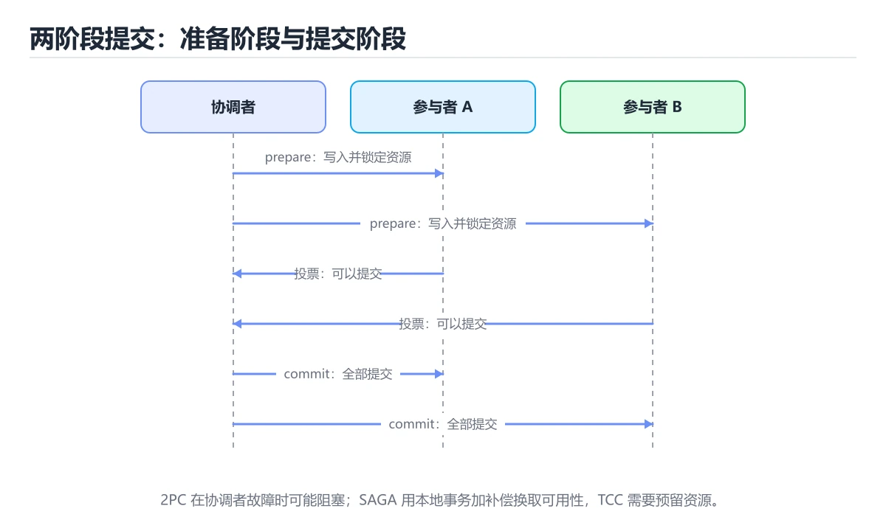
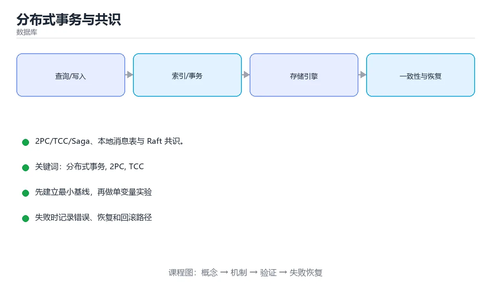

# 分布式事务与共识





> 内容更新时间：2026-10-06 · 学习阶段：进阶 · 预计用时：45 分钟

## 本节知识框架

**课程定位**：所属分类为「数据库」，课程主题为「分布式事务与共识」，学习阶段为「进阶」，建议用时 45 分钟。

**本课要解决的主问题**：2PC/TCC/Saga、本地消息表与 Raft 共识。

| 学习层次 | 要回答的问题 | 完成判据 |
| --- | --- | --- |
| 概念层 | 「分布式事务与共识」有哪些必须区分的对象与术语？ | 能用自己的话定义核心术语，并各举一个正例和一个反例。 |
| 机制层 | 这些对象按什么顺序发生作用，输入如何变成输出？ | 能画出或写出机制步骤，并说明每一步的失败条件。 |
| 应用层 | 什么场景适合使用「分布式事务与共识」，什么场景不适合？ | 能给出一个真实场景、一个最小示例和一个边界案例。 |
| 性能层 | 时间、空间、吞吐或延迟受哪些量影响？ | 能说出复杂度或性能瓶颈的证据来源；没有证据时明确写“材料未提供”。 |
| 复习层 | 怎样确认自己不是只记住了结论？ | 能独立完成本课自测，并把错误定位到概念、机制、示例或边界。 |

### 阅读路线

1. 先读「核心概念定义」，建立「分布式事务」等对象的精确定义。
2. 再读「原理与运行机制」，把定义串成可重复的过程。
3. 用「代码/协议/SQL 示例」验证过程，并只改一个条件观察结果变化。
4. 最后检查性能、易错点、知识关系与自测题，形成可复习的证据链。

**前置知识**：《存储引擎与 B+ 树实现》

**学习位置**：本课位于《存储引擎与 B+ 树实现》之后；如果前一课的自测不能通过，应先回补再继续。

**后续衔接**：下一课《OLAP 与列式存储》会继续使用本课术语，学完后建议立即完成一次自测。

**教材衔接：学习目标**

- 能用自己的话解释分布式事务与共识解决了什么问题，而不是只背术语。
- 能说清 「分布式事务」、「2PC」、「TCC」、「Saga」 之间的关系，并分别举出一个例子。
- 能把 分布式事务 放回「分布式事务与共识」的知识体系，说明它和 2PC 的边界。
- 能完成本课练习，并用验收标准检查自己的结果。

> 一句话摘要：2PC/TCC/Saga、本地消息表与 Raft 共识。

**教材衔接：前置知识**

- 先完成上一课《存储引擎与 B+ 树实现》；如果已经掌握，可以直接用本课练习自测。
- 本课阶段：进阶。建议先完成「存储引擎与 B+ 树实现」，或确认自己能独立跑通正文里的 default_factory 示例。
- 开始前先复习：分布式事务、2PC、TCC。
- 如果 为什么需要分布式事务 这一步看不懂，先记录具体卡点，再用 default_factory 复现一遍。

**教材衔接：本课小结**

能用本地事务就不要分布式事务；必须跨服务时优先**最终一致 + 幂等 + 对账**，一致性要求极高再上 TCC/2PC，元数据与选主交给 Raft 类共识组件。

## 核心概念定义

> 阅读约定：本课先给「分布式事务与共识」相关术语的操作性定义与适用边界；正文里的口语化说法与定义冲突时，以定义和可复现示例为准。

| 术语 | 操作性定义 | 本课中的边界 |
| --- | --- | --- |
| 分布式事务 | 跨多个数据库或服务保证一组操作要么全部提交要么全部回滚。 | 仅在「分布式事务与共识」明确给出的输入、版本与资源条件下成立。 |
| TCC | 能用本地事务就不要分布式事务；必须跨服务时优先最终一致 + 幂等 + 对账，一致性要求极高再上 TCC/2PC，元数据与选主交给 Raft 类共识组件。 | 仅在「分布式事务与共识」明确给出的输入、版本与资源条件下成立。 |
| Saga | 把长事务拆成一组本地事务并各配补偿动作，失败时反向补偿，换取最终一致性。 | 仅在「分布式事务与共识」明确给出的输入、版本与资源条件下成立。 |
| 幂等补偿 | 补偿操作重复执行也不产生额外副作用，这是对账与重试能够安全进行的前提。 | 仅在「分布式事务与共识」明确给出的输入、版本与资源条件下成立。 |

### 定义如何使用

在「分布式事务与共识」中判断一个说法是否成立，先确认它使用的是哪个对象的定义，再检查输入规模、运行环境与失败路径。定义不是口号，而是后续推导、代码示例和自测题共享的约束。

## 原理与运行机制

### 机制总览

1. **建立输入**：把「分布式事务」按本课定义整理成可观察、可重复的输入条件。
2. **执行转换**：围绕「TCC」执行本课的核心步骤；每一步都记录中间状态，避免只看最终输出。
3. **产生输出**：得到「Saga」后，用正文示例或协议/SQL 结果核对输出是否符合预期。
4. **改变一个条件**：只替换一个边界条件或环境参数，观察「分布式事务与共识」的结论是否仍然成立。

| 阶段 | 关注对象 | 失败时应检查 |
| --- | --- | --- |
| 输入 | 分布式事务 | 类型、范围、编码、版本或前置状态是否满足定义。 |
| 处理 | TCC | 顺序、可见性、锁、路由、事务或调度规则是否被破坏。 |
| 输出 | Saga | 结果是否可复现，错误是否被正确传播而不是被吞掉。 |

本课的机制结论要用「分布式事务与共识」自己的示例验证。「分布式事务与共识」没有给出某个数量级、吞吐或内存数据时，本课把该判断标为“材料未提供”，不从相邻主题外推。

**教材衔接：为什么需要分布式事务**

数据分布在多个库/服务时，本地事务无法覆盖跨库操作，需要额外协议保证一致性。按一致性强度与性能取舍，方案分三类。

**教材衔接：强一致方案**

| 方案 | 流程 | 缺点 |
| --- | --- | --- |
| 2PC（两阶段提交） | 协调者先 prepare，全部成功再 commit | 阻塞、协调者单点、prepare 后宕机易悬挂 |
| 3PC | 增加 preCommit 减少阻塞 | 仍不能解决网络分区 |

2PC 适合内部可控、并发不高的场景（如跨库转账）；它降低了可用性，不适合高并发互联网业务。

**教材衔接：柔性事务**

| 方案 | 思路 | 适用 |
| --- | --- | --- |
| TCC | Try 预留、Confirm 提交、Cancel 回滚 | 资金、库存等需强约束的业务 |
| Saga | 拆成本地事务链，失败时执行补偿 | 长流程、跨服务编排 |
| 本地消息表 | 业务与消息同库同事务，异步投递 | 最终一致的主流做法 |
| 事务消息 | 消息中间件保证「本地事务 + 消息」原子 | 已有 MQ 的架构 |

柔性事务的关键是**幂等 + 重试 + 对账**：消费者必须能重复消费，补偿必须可重入，最终用定时对账兜底。

**教材衔接：共识算法**

共识解决「多个节点对同一值达成一致」，是复制状态机的基础。

| 算法 | 特点 |
| --- | --- |
| Paxos | 理论奠基，理解难度高 |
| Raft | 强领导者 + 选举 + 日志复制，易于工程实现 |
| ZAB | ZooKeeper 使用，类似 Raft 的领导者模型 |

Raft 三要素：任期（term）、选举超时随机化避免脑裂、日志匹配保证已提交条目不会丢失。多数派（quorum）是安全性的核心：n 个节点可容忍 (n-1)/2 个故障。

**教材衔接：分布式锁**

基于 Redis 的 SET NX PX + Lua 释放是常见轻量方案；需要更强保证时用 etcd/ZooKeeper 的租约锁。要点：锁必须带过期时间、释放必须校验持有者、业务逻辑要能容忍锁失效（fencing token）。

**教材衔接：共识算法速查**

| 算法 | 容错 | 特点 |
| --- | --- | --- |
| Raft | n 个节点容忍 (n-1)/2 故障 | 易理解，主流选主与复制 |
| Paxos | 同上 | 理论经典，实现复杂 |
| ZAB | 同上 | ZooKeeper 使用 |
| 多数派写入 | 需要 ⌊n/2⌋+1 确认 | 保证不丢已提交数据 |

```python
from dataclasses import dataclass, field
from enum import Enum

class SagaStep(Enum):
    PENDING = "pending"
    DONE = "done"
    COMPENSATED = "compensated"

@dataclass
class Saga:
    """Saga 编排：正向依次执行，失败时逆序补偿。"""

    actions: list = field(default_factory=list)       # (名称, 执行函数, 补偿函数)
    executed: list = field(default_factory=list)

    def run(self, context):
        for name, action, compensate in self.actions:
            try:
                action(context)
                self.executed.append((name, compensate))
            except Exception as exc:
                print(f"[{name}] 失败：{exc}，开始补偿")
                self._compensate(context)
                raise
        return context

    def _compensate(self, context):
        while self.executed:
            name, compensate = self.executed.pop()
            try:
                compensate(context)                   # 补偿必须幂等
                print(f"[{name}] 已补偿")
            except Exception as exc:
                print(f"[{name}] 补偿失败，需人工介入：{exc}")

def tolerant_write(acks: int, nodes: int) -> bool:
    """判断写入确认数是否满足多数派。"""
    return acks >= nodes // 2 + 1

print(tolerant_write(2, 3), tolerant_write(1, 3))     # True False
```

**教材衔接：幂等与对账速查**

| 手段 | 说明 |
| --- | --- |
| 幂等键 | 客户端生成唯一 ID，服务端去重表保证只执行一次 |
| 状态机 | 只允许合法状态迁移，重复请求直接返回 |
| 唯一索引 | 数据库层面兜底防重复 |
| 去重表 | 记录已处理的业务 ID 与结果 |
| 对账任务 | 定时比对双方数据，修复差异 |
| 补偿重试 | 指数退避 + 最大次数 + 告警 |

## 典型应用场景

| 场景 | 典型输入或前提 | 期望产物 |
| --- | --- | --- |
| 学习验证 | 使用本课最小示例和 分布式事务、2PC | 能复现正文结论，并解释每一步。 |
| 工程落地 | 把「分布式事务与共识」放入真实模块或服务边界 | 输出可观测、失败可定位、参数可配置。 |
| 故障排查 | 只改一个版本、规模、输入或依赖条件 | 能区分概念错误、实现错误和环境差异。 |

判断「分布式事务与共识」的场景是否成立，标准是能否写出输入、处理、输出和失败路径；材料中没有出现的数据在本课标注为“材料未提供”，不用推测替代证据。

**课程内置实验入口**：`system_database`，用于动手验证《分布式事务与共识》的机制；实验结论不替代概念定义与复杂度分析。

## 代码/协议/SQL 示例

### 最小可验证示例

下面保留《分布式事务与共识》原文中的最小示例。先预测《分布式事务与共识》示例的输出，再按正文步骤运行或推演；示例依赖外部环境时，同时记录版本与输入。

```python
from dataclasses import dataclass, field
from enum import Enum

class SagaStep(Enum):
    PENDING = "pending"
    DONE = "done"
    COMPENSATED = "compensated"

@dataclass
class Saga:
    """Saga 编排：正向依次执行，失败时逆序补偿。"""

    actions: list = field(default_factory=list)       # (名称, 执行函数, 补偿函数)
    executed: list = field(default_factory=list)

    def run(self, context):
        for name, action, compensate in self.actions:
            try:
                action(context)
                self.executed.append((name, compensate))
            except Exception as exc:
                print(f"[{name}] 失败：{exc}，开始补偿")
                self._compensate(context)
                raise
        return context

    def _compensate(self, context):
        while self.executed:
            name, compensate = self.executed.pop()
            try:
                compensate(context)                   # 补偿必须幂等
                print(f"[{name}] 已补偿")
            except Exception as exc:
                print(f"[{name}] 补偿失败，需人工介入：{exc}")

def tolerant_write(acks: int, nodes: int) -> bool:
    """判断写入确认数是否满足多数派。"""
    return acks >= nodes // 2 + 1

print(tolerant_write(2, 3), tolerant_write(1, 3))     # True False
```

**教材衔接：原文最小示例**

```python
from dataclasses import dataclass, field
from enum import Enum

class SagaStep(Enum):
    PENDING = "pending"
    DONE = "done"
    COMPENSATED = "compensated"

@dataclass
class Saga:
    """Saga 编排：正向依次执行，失败时逆序补偿。"""

    actions: list = field(default_factory=list)       # (名称, 执行函数, 补偿函数)
    executed: list = field(default_factory=list)

    def run(self, context):
        for name, action, compensate in self.actions:
            try:
                action(context)
                self.executed.append((name, compensate))
            except Exception as exc:
                print(f"[{name}] 失败：{exc}，开始补偿")
                self._compensate(context)
                raise
        return context

    def _compensate(self, context):
        while self.executed:
            name, compensate = self.executed.pop()
            try:
                compensate(context)                   # 补偿必须幂等
                print(f"[{name}] 已补偿")
            except Exception as exc:
                print(f"[{name}] 补偿失败，需人工介入：{exc}")

def tolerant_write(acks: int, nodes: int) -> bool:
    """判断写入确认数是否满足多数派。"""
    return acks >= nodes // 2 + 1

print(tolerant_write(2, 3), tolerant_write(1, 3))     # True False
```

## 时间/空间复杂度或性能分析

**复杂度证据**：「分布式事务与共识」的现有材料没有给出渐近时间或空间复杂度的明确结论，本课只做定性检查，不补写未经验证的 $O$ 记号。

| 维度 | 本课关注点 | 判断依据 |
| --- | --- | --- |
| 时间/延迟 | 「分布式事务与共识」的主要步骤是否会随输入规模、并发度或网络往返增长。 | 以正文复杂度、基准数据或可重复测量为准。 |
| 空间/内存 | 中间状态、缓存、副本、连接或索引是否随规模增长。 | 记录峰值内存与数据副本，不只看最终结果。 |
| 吞吐/资源 | 版本、调度、锁、IO、序列化或协议开销是否成为瓶颈。 | 固定环境做对照实验，改变一个变量。 |

评估「分布式事务与共识」时要区分“正确性成立”和“性能达标”两件事；材料没有给出基准时，本课只保留量级来源与测量方法，不写不可验证的绝对数字。

## 常见误区与易错点

> 复核《分布式事务与共识》的易错点时，优先保留原文的错误表、故障现场与排错路径；每条修正都要能用本课示例复验。

| 易错点 | 常见表现 | 正确做法 |
| --- | --- | --- |
| 只背结论 | 能复述「分布式事务与共识」的定义，却说不清输入、输出与边界。 | 回到机制步骤，用最小示例逐一验证。 |
| 混淆相邻概念 | 把本课对象与相邻主题的对象当成同一类。 | 先比较定义、资源归属、生命周期和失败模式。 |
| 忽略版本与环境 | 在开发机通过后直接外推到生产环境。 | 固定版本、输入和资源条件，再记录可复现结果。 |

**教材衔接：常见错误与排查**

| 容易踩的做法 | 实际现象 | 原因与正确做法 |
| --- | --- | --- |
| 用 2PC 处理长事务 | 资源长时间被锁 | 长流程用 Saga 或 TCC |
| 补偿逻辑不幂等 | 重试导致重复退款 | 补偿必须可重复执行 |
| 没有对账机制 | 差异长期积累 | 定期对账并自动修复 |
| 只重试不设上限 | 故障放大 | 指数退避 + 上限 + 告警 |
| 忽略悬挂（空补偿） | 补偿先于正向执行到达 | 用状态机与唯一 ID 防悬挂 |
| 认为最终一致不需要设计 | 用户看到中间态异常 | 前端做状态提示与轮询 |
| 单点协调者无高可用 | 协调者挂掉流程卡住 | 协调者集群化并持久化状态 |
| 不记录流程日志 | 失败后无法定位到哪一步 | 每步记录状态与上下文 |
| 混用多种一致性方案无文档 | 维护困难、结论冲突 | 统一方案并写清边界 |
| 忽略时钟依赖 | 顺序判断出错 | 用逻辑时间或服务端序号 |

**教材衔接：故障现场**

### 现场 1：用 2PC 处理长事务

**症状**：在《分布式事务与共识》的复现场景中，资源长时间被锁。

**根因**：当出现“用 2PC 处理长事务”时，执行路径已经绕过了《分布式事务与共识》的关键约束，最终以“资源长时间被锁”暴露出来；修复前必须先确认约束在哪里失效。

**修复**：针对《分布式事务与共识》的问题，长流程用 Saga 或 TCC。

**验证**：保留《分布式事务与共识》里触发“资源长时间被锁”的输入、版本和日志，按“长流程用 Saga 或 TCC”完成修改后原样重放；只有失败现象消失且相邻场景仍可解释，才保留改动。

### 现场 2：补偿逻辑不幂等

**症状**：在《分布式事务与共识》的复现场景中，重试导致重复退款。

**根因**：当出现“补偿逻辑不幂等”时，执行路径已经绕过了《分布式事务与共识》的关键约束，最终以“重试导致重复退款”暴露出来；修复前必须先确认约束在哪里失效。

**修复**：针对《分布式事务与共识》的问题，补偿必须可重复执行。

**验证**：先在《分布式事务与共识》中记录“补偿逻辑不幂等”留下的失败证据，再执行“补偿必须可重复执行”并重放；确认错误路径变为明确结果，且修复没有掩盖同类故障。

### 现场 3：没有对账机制

**症状**：在《分布式事务与共识》的复现场景中，差异长期积累。

**根因**：当出现“没有对账机制”时，执行路径已经绕过了《分布式事务与共识》的关键约束，最终以“差异长期积累”暴露出来；修复前必须先确认约束在哪里失效。

**修复**：针对《分布式事务与共识》的问题，定期对账并自动修复。

**验证**：在《分布式事务与共识》中按“定期对账并自动修复”调整后，从“没有对账机制”的触发条件重放同一条路径，确认“差异长期积累”不再出现，并补一个相邻边界用例检查没有引入新问题。

## 与其他知识点的关系

| 关系 | 课程 | 为什么 |
| --- | --- | --- |
| 先修 | 《存储引擎与 B+ 树实现》 | 本课会直接使用它的概念或操作前提。 |
| 关联 | 《OLAP 与列式存储》 | 用于横向比较或把本课结论迁移到相邻主题。 |
| 前置顺序 | 《存储引擎与 B+ 树实现》 | 同分类中安排在本课之前，建议先完成其自测。 |
| 后续顺序 | 《OLAP 与列式存储》 | 同分类中安排在本课之后，会继续使用本课术语。 |

把「分布式事务与共识」放回知识体系时，不只要记住“前面学过什么”，还要说明两个主题在输入、机制、资源边界和失败模式上的差异。这样才能把单课知识迁移到项目、排障和后续课程。

**教材衔接：方案对照速查**

| 方案 | 一致性 | 复杂度 | 适用 |
| --- | --- | --- | --- |
| 2PC / XA | 强一致（阻塞式） | 中 | 少量短事务、同构数据库 |
| 3PC | 减少阻塞 | 高 | 少用 |
| TCC | 最终一致 | 高 | 资金、库存等需要预留的业务 |
| Saga | 最终一致 | 中 | 长流程、多服务编排 |
| 本地消息表 | 最终一致 | 低 | 业务与消息的一致性 |
| 事务消息 | 最终一致 | 中 | 支持事务消息的 MQ |
| 最大努力通知 | 最终一致 | 低 | 对账、通知类场景 |

**教材衔接：复习与迁移**

复习目标：把「分布式事务与共识」的判断标准放回可复现的例子里。先自己作答，再对照依据；如果结论正确但理由不完整，回到正文补足前提。

### 概念复述

- 用一句话说明「分布式事务与共识」解决什么问题：2PC/TCC/Saga、本地消息表与 Raft 共识。
- 写出分布式事务、2PC、TCC之间的关系，并各举一个例子。
- 说出本课最容易混淆的两个概念，以及区分它们的判据。

### 正文逐节复核

- **强一致方案**：2PC 适合内部可控、并发不高的场景（如跨库转账）；它降低了可用性，不适合高并发互联网业务。
- **共识算法**：Raft 三要素：任期（term）、选举超时随机化避免脑裂、日志匹配保证已提交条目不会丢失。

### 测验回顾

1. 「分布式事务与共识」的核心结论是什么？
   - 依据：题干的正确项是分布式事务与共识：2PC/TCC/Saga、本地消息表与 Raft 共识。把“分布式事务与共识”代回正文里“的核心结论是什么”的例子核对，条件一旦改变，结论就要用分布式事务、2PC、TCC重新推导。回到分布式事务、2PC、TCC本身再看一遍：只有“分布式事务与共识”与题干“的核心结论是什么”的前提一致，结论才成立。
2. 围绕“分布式事务与共识”中的 分布式事务、2PC、TCC，下列哪两项是本课强调的实践判断？
   - 依据：本课把分布式事务与共识拆成概念、示例与故障现场三部分，因此判断 分布式事务 时必须同时交代输入、输出和失败路径，这使“学习 分布式事务 时要同时说明输入、输出和失败路径，不能只看正常流程”成立。在分布式事务与共识里，判断 2PC 时要固定版本与边界输入，所以“验证 2PC 时要固定版本并覆盖边界输入，结论才可复现”才可复现。
3. Raft 中 n 个节点最多容忍多少节点故障？
   - 依据：多数派可用即可继续服务，因此容忍少数派故障。其他选项：Raft 容忍 (n-1)/2 个节点故障：3 节点容 1 台、5 节点容 2 台。「分布式事务与共识」要求先交代分布式事务、2PC、TCC的前提再下结论，所以“(n-1)/2”只在题干“Raft 中 n 个节点最多容忍多少节点故障”给定的条件下成立。
4. 本地消息表方案解决的核心问题是？
   - 依据：在「分布式事务与共识」里，结论应落在「业务数据修改与消息发送的原子性（借助本地事务 + 轮询投递实现最终一致）」。同一事务里写业务表与消息表，再异步投递并保证消费端幂等。这道题的关键在「分布式事务与共识」的分布式事务、2PC、TCC：先确认题干“本地消息表方案解决的核心问题是”问的是哪一步，再排除偷换前提的选项。
5. TCC 的三个阶段是？
   - 依据：在「分布式事务与共识」里，Try 预留资源，Confirm 确认执行。TCC 需要业务实现三种操作，并处理空回滚、悬挂与幂等。这道题的关键在「分布式事务与共识」的分布式事务、2PC、TCC：先确认题干“TCC 的三个阶段是”问的是哪一步，再排除偷换前提的选项。把“Try 预留资源”代回「分布式事务与共识」里“TCC 的三个阶段是”的例子核对，条件一旦改变，结论就要用分布式事务、2PC、TCC重新推导。
6. 补全代码：「分布式事务与共识」示例中，下面这行代码缺少哪个关键字或函数名？请填入 ____。

`for name, action, compensate in self.____:`
   - 依据：这道题的关键在「分布式事务与共识」的分布式事务、2PC、TCC：先确认题干“补全代码”问的是哪一步，再排除偷换前提的选项。把“actions”代回「分布式事务与共识」里“分布式事务与共识示例中”的例子核对，条件一旦改变，结论就要用分布式事务、2PC、TCC重新推导。“actions”是否可用，取决于分布式事务、2PC、TCC在题干条件下的表现，不能直接套用相邻结论。

### 迁移练习

把「分布式事务与共识」的结论迁移到相邻主题，每次迁移都写清预测与证据：

1. 换输入：用分布式事务处理一组你自己的数据，对比教材示例的结果差异。
2. 换失败条件：制造一个2PC相关的错误，说明如何从错误信息定位根因。
3. 换规模：把数据量或并发度提高一个数量级，说明「分布式事务与共识」的结论是否仍成立。

## 自测题与参考答案

> 先独立作答《分布式事务与共识》的自测题，再对照答案与解析；每处判断都要能在本课正文或示例中找到依据。

### 自测 1

阅读这段 Saga 编排代码，下面哪项判断是正确的？

```python
class Saga:
    def run(self, ctx):
        for name, action, compensate in self.actions:
            try:
                action(ctx)
                self.executed.append((name, compensate))
            except Exception:
                self.rollback(ctx)
                raise

    def rollback(self, ctx):
        for name, compensate in reversed(self.executed):   # 逆序补偿
            compensate(ctx)
```

A. 补偿要按正向执行的逆序进行，并且补偿操作本身必须幂等
B. 补偿失败可以直接忽略，因为业务已经回滚过一次
C. Saga 保证了隔离性，中间状态不会被其他事务读到
D. 只要每步都包了异常处理，整个流程就等价于两阶段提交

**参考答案**：补偿要按正向执行的逆序进行，并且补偿操作本身必须幂等

**解析**：正确判断是补偿要按正向执行的逆序进行，并且补偿操作本身必须幂等。分布式事务跨越多个服务与数据库，无法依赖单机锁，Saga 把长事务拆成一串本地事务，失败时按逆序执行补偿；重试与超时会让补偿被调用多次，因此补偿必须可重复执行。Saga 不提供隔离性，中间状态可能被其他事务读到，需要配合预留、状态机或语义锁；两阶段提交依赖协调者与全局锁，阻塞风险与代价都更高。

### 自测 2

围绕“分布式事务与共识”中的 分布式事务、2PC、TCC，下列哪两项是本课强调的实践判断？

A. 学习 分布式事务 时要同时说明输入、输出和失败路径，不能只看正常流程
B. 只要 分布式事务 的常规示例通过，就可以跳过边界与异常路径
C. 验证 2PC 时要固定版本并覆盖边界输入，结论才可复现
D. 把 2PC 的单次运行结果当成所有版本和规模都成立

**参考答案**：学习 分布式事务 时要同时说明输入、输出和失败路径，不能只看正常流程；验证 2PC 时要固定版本并覆盖边界输入，结论才可复现

**解析**：本课把分布式事务与共识拆成概念、示例与故障现场三部分，因此判断 分布式事务 时必须同时交代输入、输出和失败路径，这使“学习 分布式事务 时要同时说明输入、输出和失败路径，不能只看正常流程”成立。在分布式事务与共识里，判断 2PC 时要固定版本与边界输入，所以“验证 2PC 时要固定版本并覆盖边界输入，结论才可复现”才可复现。

### 自测 3

Raft 中 n 个节点最多容忍多少节点故障？

A. n-1
B. 1
C. (n-1)/2
D. n/2

**参考答案**：(n-1)/2

**解析**：多数派可用即可继续服务，因此容忍少数派故障。其他选项：Raft 容忍 (n-1)/2 个节点故障：3 节点容 1 台、5 节点容 2 台。「分布式事务与共识」要求先交代分布式事务、2PC、TCC的前提再下结论，所以“(n-1)/2”只在题干“Raft 中 n 个节点最多容忍多少节点故障”给定的条件下成立。

**教材衔接：复习与自测**

- [ ] 能按业务选择 2PC / TCC / Saga / 本地消息表。
- [ ] 所有补偿与重试都保证幂等。
- [ ] 有对账与差异修复机制。
- [ ] 处理空补偿与悬挂问题。
- [ ] 分布式事务流程有完整日志与人工兜底入口。

**教材衔接：动手练习**

> 本课练习重点：围绕「分布式事务、2PC、TCC」完成复述、实验和交付，每个结果都要能被别人检查。

先确定 2PC 的约束，再决定索引与事务边界。

### 练习 1：建立心智模型（10 分钟）

合上教程，用 3～5 句话回答：

1. 分布式事务与共识解决了什么问题？
2. 如果没有它，会出现什么具体后果？
3. 它和「2PC」是什么关系？

验收标准：用自己的话解释 分布式事务，并给出一个它不成立的反例。

### 练习 2：做一次可控实验（20 分钟）

从正文中选一个最小示例，完成以下操作：

1. 先预测修改一个参数、输入或步骤后的结果。
2. 再实际执行或逐步推演，记录真实结果。
3. 如果结果与预测不同，写出差异原因。

**验收标准**：先原样跑通正文里的 `default_factory`，再只改分布式事务相关的输入，按「原例 → 改动 → 预测 → 结果 → 原因」记录；预测必须写在实际运行之前。

### 练习 3：交付一个小结果（30 分钟）

在 SQLite 或纸面表结构上写 分布式事务 的查询，分别验证正常、空值和边界数据。

任务要求：

- 结果必须能被别人检查，不能只写“我已经理解了”。
- 至少覆盖「分布式事务」和「2PC」两个关键词。
- 写出 1 个仍然不确定的问题，以及下一步如何验证。

> 提示：时间有限时优先做练习 1 和练习 2；练习 3 可以拆成两次完成。

**教材衔接：可运行练习**

### 任务 1：先跑通，再解释

```python
from dataclasses import dataclass, field
from enum import Enum

class SagaStep(Enum):
    PENDING = "pending"
    DONE = "done"
    COMPENSATED = "compensated"

@dataclass
class Saga:
    """Saga 编排：正向依次执行，失败时逆序补偿。"""

    actions: list = field(default_factory=list)       # (名称, 执行函数, 补偿函数)
    executed: list = field(default_factory=list)

    def run(self, context):
        for name, action, compensate in self.actions:
            try:
                action(context)
                self.executed.append((name, compensate))
            except Exception as exc:
                print(f"[{name}] 失败：{exc}，开始补偿")
                self._compensate(context)
                raise
        return context

    def _compensate(self, context):
        while self.executed:
            name, compensate = self.executed.pop()
            try:
                compensate(context)                   # 补偿必须幂等
                print(f"[{name}] 已补偿")
            except Exception as exc:
                print(f"[{name}] 补偿失败，需人工介入：{exc}")

def tolerant_write(acks: int, nodes: int) -> bool:
    """判断写入确认数是否满足多数派。"""
    return acks >= nodes // 2 + 1

print(tolerant_write(2, 3), tolerant_write(1, 3))     # True False
```

### 任务 2：只改一个条件

把「分布式事务与共识」的最小示例复制一份，只改一个条件再跑一次：

- 改动点：只把 分布式事务 的输入换成空值、极值或错误输入，其余保持不变。
- 预测：先写下「分布式事务与共识」在改动后的输出或错误信息，再运行。
- 记录：对照改动前后的结果，指出差异出在哪一步。
- 验收：换回原条件能复现原结果，改动只影响分布式事务。

### 任务 3：迁移到自己的数据

换一个 2PC 场景重做一次，确认结论不是只对示例数据成立。

**教材衔接：本课复习清单**

离开本课前，逐项确认：

- [ ] 不看解析，能说出「2PC 的主要缺点是？」的判断依据。
- [ ] 不看解析，能说出「Saga 模式在某个本地事务失败时依靠什么恢复一致性？」的判断依据。
- [ ] 不看解析，能说出「Raft 中 n 个节点最多容忍多少节点故障？」的判断依据。
- [ ] 不看解析，能说出「本地消息表方案解决的核心问题是？」的判断依据。
- [ ] 不看解析，能说出「TCC 的三个阶段是？」的判断依据。
- [ ] 用 分布式事务 构造一个正常输入和一个边界输入，分别记录输出与判断依据。
- [ ] 把本课最容易混淆的两个概念写成一句话对照。

| 复盘项 | 记录 |
| --- | --- |
| 已经能独立解释的考点 |  |
| 仍然说不清的概念 |  |
| 下一步验证动作 |  |

---

## 术语速查

把「分布式事务与共识」里反复出现的术语集中放在一起。复习时先遮住右列，尝试用自己的话解释，再回到正文核对。

| 术语 | 一句话说明 |
| --- | --- |
| `分布式事务` | 跨多个数据库或服务保证一组操作要么全部提交要么全部回滚。 |
| `TCC` | 能用本地事务就不要分布式事务；必须跨服务时优先最终一致 + 幂等 + 对账，一致性要求极高再上 TCC/2PC，元数据与选主交给 Raft 类共识组件。 |
| `Saga` | 把长事务拆成一组本地事务并各配补偿动作，失败时反向补偿，换取最终一致性。 |
| `幂等补偿` | 补偿操作重复执行也不产生额外副作用，这是对账与重试能够安全进行的前提。 |

## 考点精讲

### 考点 1：代码阅读·Saga 补偿

- **题目**：阅读这段 Saga 编排代码，下面哪项判断是正确的？
- **正确判断**：补偿要按正向执行的逆序进行，并且补偿操作本身必须幂等
- **判断依据**：正确判断是补偿要按正向执行的逆序进行，并且补偿操作本身必须幂等。分布式事务跨越多个服务与数据库，无法依赖单机锁，Saga 把长事务拆成一串本地事务，失败时按逆序执行补偿；重试与超时会让补偿被调用多次，因此补偿必须可重复执行。Saga 不提供隔离性，中间状态可能被其他事务读到，需要配合预留、状态机或语义锁；两阶段提交依赖协调者与全局锁，阻塞风险与代价都更高。

### 考点 2：多选辨析·分布式事务

- **题目**：围绕“分布式事务与共识”中的 分布式事务、2PC、TCC，下列哪两项是本课强调的实践判断？
- **判断依据**：本课把分布式事务与共识拆成概念、示例与故障现场三部分，因此判断 分布式事务 时必须同时交代输入、输出和失败路径，这使“学习 分布式事务 时要同时说明输入、输出和失败路径，不能只看正常流程”成立。在分布式事务与共识里，判断 2PC 时要固定版本与边界输入，所以“验证 2PC 时要固定版本并覆盖边界输入，结论才可复现”才可复现。

### 考点 3：概念判断·分布式事务

- **题目**：Raft 中 n 个节点最多容忍多少节点故障？
- **判断依据**：多数派可用即可继续服务，因此容忍少数派故障。其他选项：Raft 容忍 (n-1)/2 个节点故障：3 节点容 1 台、5 节点容 2 台。「分布式事务与共识」要求先交代分布式事务、2PC、TCC的前提再下结论，所以“(n-1)/2”只在题干“Raft 中 n 个节点最多容忍多少节点故障”给定的条件下成立。

### 考点 4：概念判断·分布式事务

- **题目**：本地消息表方案解决的核心问题是？
- **判断依据**：在「分布式事务与共识」里，结论应落在「业务数据修改与消息发送的原子性」。同一事务里写业务表与消息表，再异步投递并保证消费端幂等。这道题的关键在「分布式事务与共识」的分布式事务、2PC、TCC：先确认题干“本地消息表方案解决的核心问题是”问的是哪一步，再排除偷换前提的选项。

### 考点 5：概念判断·分布式事务

- **题目**：TCC 的三个阶段是？
- **判断依据**：在「分布式事务与共识」里，Try 预留资源，Confirm 确认执行。TCC 需要业务实现三种操作，并处理空回滚、悬挂与幂等。这道题的关键在「分布式事务与共识」的分布式事务、2PC、TCC：先确认题干“TCC 的三个阶段是”问的是哪一步，再排除偷换前提的选项。把“Try 预留资源”代回「分布式事务与共识」里“TCC 的三个阶段是”的例子核对，条件一旦改变，结论就要用分布式事务、2PC、TCC重新推导。

### 考点 6：填空·分布式事务

- **题目**：补全代码：「分布式事务与共识」示例中，下面这行代码缺少哪个关键字或函数名？请填入 ____。 `for name, action, compensate in self.____:`
- **判断依据**：这道题的关键在「分布式事务与共识」的分布式事务、2PC、TCC：先确认题干“补全代码”问的是哪一步，再排除偷换前提的选项。把“actions”代回「分布式事务与共识」里“分布式事务与共识示例中”的例子核对，条件一旦改变，结论就要用分布式事务、2PC、TCC重新推导。“actions”是否可用，取决于分布式事务、2PC、TCC在题干条件下的表现，不能直接套用相邻结论。

## English Overview

**Title:** Distributed Transactions

**Summary:** 2PC, TCC, Saga, outbox and Raft.

**Category:** Database
**Level:** 进阶
**Key terms:** 分布式事务, 2PC, TCC, Saga, Raft

## 内容元数据

- 内容版本：v2.0
- 最后更新：2026-10-06
- 学习阶段：进阶
- 适用环境：PostgreSQL / MySQL / SQLite 等主流数据库；本课聚焦其中的 分布式事务。
- 内容来源：内置结构化课程与工程实践整理
- 相关主题：分布式事务、2PC、TCC、Saga、Raft
- 质量版本：P0 测验标准 + P1 覆盖扩展 + P2 体验补全

## 参考资料与复核

- 最后复核：2026-10-04
- 下次复核：2027-06-17
- 复核范围：版本兼容、API 行为、安全建议与工程实践
- 来源性质：官方文档、标准或权威教材；正文为离线教学重组

| 参考资料 | 本课用途 |
| --- | --- |
| [JDBC 事务](https://docs.oracle.com/javase/tutorial/jdbc/basics/transactions.html) | 连接事务与回滚 |
| [PostgreSQL 文档](https://www.postgresql.org/docs/) | SQL、索引、事务与并发 |
| [数据库规范化](https://learn.microsoft.com/office/troubleshoot/access/database-normalization-description) | 范式与表设计 |

> 「分布式事务与共识」的链接用于离线阅读后的延伸核对；App 不会自动联网。
