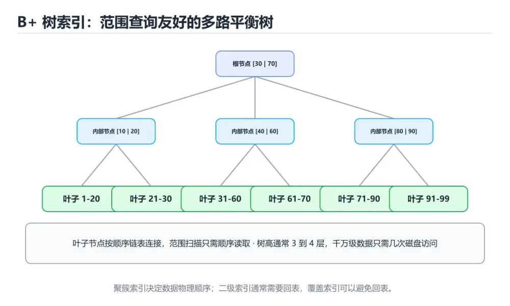

# 索引

> 内容更新时间：2026-10-06 · 学习阶段：基础 · 预计用时：45 分钟




## 本节知识框架

**课程定位**：所属分类为「数据库」，课程主题为「索引」，学习阶段为「基础」，建议用时 45 分钟。

**本课要解决的主问题**：B+ 树、最左前缀原则，以及索引什么时候失效。

| 学习层次 | 要回答的问题 | 完成判据 |
| --- | --- | --- |
| 概念层 | 「索引」有哪些必须区分的对象与术语？ | 能用自己的话定义核心术语，并各举一个正例和一个反例。 |
| 机制层 | 这些对象按什么顺序发生作用，输入如何变成输出？ | 能画出或写出机制步骤，并说明每一步的失败条件。 |
| 应用层 | 什么场景适合使用「索引」，什么场景不适合？ | 能给出一个真实场景、一个最小示例和一个边界案例。 |
| 性能层 | 时间、空间、吞吐或延迟受哪些量影响？ | 能说出复杂度或性能瓶颈的证据来源；没有证据时明确写“材料未提供”。 |
| 复习层 | 怎样确认自己不是只记住了结论？ | 能独立完成本课自测，并把错误定位到概念、机制、示例或边界。 |

### 阅读路线

1. 先读「核心概念定义」，建立「索引」等对象的精确定义。
2. 再读「原理与运行机制」，把定义串成可重复的过程。
3. 用「代码/协议/SQL 示例」验证过程，并只改一个条件观察结果变化。
4. 最后检查性能、易错点、知识关系与自测题，形成可复习的证据链。

**前置知识**：《SQL 基础》

**学习位置**：本课位于《SQL 基础》之后；如果前一课的自测不能通过，应先回补再继续。

**后续衔接**：下一课《事务》会继续使用本课术语，学完后建议立即完成一次自测。

**教材衔接：学习目标**

- 能用自己的话解释索引解决了什么问题，而不是只背术语。
- 能说清 索引、「B+树」、「复合索引」、「最左前缀」 之间的关系，并分别举出一个例子。
- 能把 索引 放回「索引」的知识体系，说明它和 B+树 的边界。
- 能完成本课练习，并用验收标准检查自己的结果。

> 一句话摘要：B+ 树、最左前缀原则，以及索引什么时候失效。

**教材衔接：前置知识**

- 先完成上一课《SQL 基础》；如果已经掌握，可以直接用本课练习自测。
- 本课阶段：基础。建议先完成「SQL 基础」，或确认自己能独立跑通正文里的 idx_students_city 示例。
- 开始前先复习：索引、B+树、复合索引。
- 卡在 索引 上时不要跳过：把输入、预期和实际输出写成三行，再回头读正文。

**教材衔接：本课小结**

索引是「用空间和写入速度换查询速度」。判断是否该建索引，先看查询频率和选择性。

## 核心概念定义

> 阅读约定：本课先给「索引」相关术语的操作性定义与适用边界；正文里的口语化说法与定义冲突时，以定义和可复现示例为准。

| 术语 | 操作性定义 | 本课中的边界 |
| --- | --- | --- |
| B+树 | 所有键值存放在叶子节点、叶子按链表连接的多路平衡树，适合磁盘索引和范围查询。 | 仅在「索引」明确给出的输入、版本与资源条件下成立。 |
| 复合索引 | 由多个列按顺序组成的索引，查询条件能否命中取决于最左前缀。 | 仅在「索引」明确给出的输入、版本与资源条件下成立。 |
| 最左前缀 | 复合索引按列顺序匹配，查询只有从最左列开始才能充分利用索引。 | 仅在「索引」明确给出的输入、版本与资源条件下成立。 |
| EXPLAIN | EXPLAIN 中 Extra 出现 Using index condition 即表示启用了索引下推；出现 Using index 表示覆盖索引；出现 Using filesort 或 Using temporary 则是需要优化的信号。 | 仅在「索引」明确给出的输入、版本与资源条件下成立。 |
| 覆盖索引 | 索引里已经包含查询需要的全部列，不必回表，能显著减少随机 I/O | 仅在「索引」明确给出的输入、版本与资源条件下成立。 |

### 定义如何使用

在「索引」中判断一个说法是否成立，先确认它使用的是哪个对象的定义，再检查输入规模、运行环境与失败路径。定义不是口号，而是后续推导、代码示例和自测题共享的约束。

## 原理与运行机制

### 机制总览

1. **建立输入**：把「B+树」按本课定义整理成可观察、可重复的输入条件。
2. **执行转换**：围绕「复合索引」执行本课的核心步骤；每一步都记录中间状态，避免只看最终输出。
3. **产生输出**：得到「最左前缀」后，用正文示例或协议/SQL 结果核对输出是否符合预期。
4. **改变一个条件**：只替换一个边界条件或环境参数，观察「索引」的结论是否仍然成立。

| 阶段 | 关注对象 | 失败时应检查 |
| --- | --- | --- |
| 输入 | B+树 | 类型、范围、编码、版本或前置状态是否满足定义。 |
| 处理 | 复合索引 | 顺序、可见性、锁、路由、事务或调度规则是否被破坏。 |
| 输出 | 最左前缀 | 结果是否可复现，错误是否被正确传播而不是被吞掉。 |

本课的机制结论要用「索引」自己的示例验证。「索引」没有给出某个数量级、吞吐或内存数据时，本课把该判断标为“材料未提供”，不从相邻主题外推。

**教材衔接：索引解决什么问题**

没有索引时，数据库只能**全表扫描**，逐行比对。索引就像书的目录，让数据库快速定位到目标数据，把 `O(n)` 的查找降到 `O(log n)`。

**教材衔接：索引的代价**

索引不是越多越好：

1. 占用额外磁盘空间。
2. `INSERT / UPDATE / DELETE` 都要同步维护索引，写变慢。
3. 优化器选错索引时反而更慢。

一般只为**高频查询条件、连接列、排序分组列**建立索引。

**教材衔接：覆盖索引与索引下推**

**覆盖索引**：查询需要的列全部包含在索引中，无需回表。

| 查询 | 索引 | 是否回表 |
| --- | --- | --- |
| `SELECT name FROM users WHERE city='上海'` | `(city)` | 回表（需取 name） |
| 同上 | `(city, name)` | **不回表**，Extra 显示 Using index |
| `SELECT * FROM users WHERE city='上海'` | `(city)` | 回表（需要全部列） |

这也是 `SELECT *` 拖慢查询的一个具体原因：它几乎必然导致回表。建议列表查询只取需要的列，并为高频组合建复合索引。

**索引下推（ICP, MySQL 5.6+）**：在存储引擎层就利用索引中的列过滤掉不满足条件的记录，减少回表次数。

| 查询 | 有无 ICP | 效果 |
| --- | --- | --- |
| `WHERE name LIKE '张%' AND age = 20`，索引 `(name, age)` | 有 | 引擎层先按 name 与 age 双重过滤，再回表 |
| 同上 | 无（老版本） | 只按 name 过滤，全部回表后再筛 age |

`EXPLAIN` 中 Extra 出现 `Using index condition` 即表示启用了索引下推；出现 `Using index` 表示覆盖索引；出现 `Using filesort` 或 `Using temporary` 则是需要优化的信号。

**教材衔接：建索引速查**

| 场景 | 建议 |
| --- | --- |
| 高频等值查询 | 单列或联合索引，把等值列放前面 |
| 高频范围查询 | 范围列放联合索引最后一位 |
| 排序 + 过滤 | 让索引顺序匹配 `WHERE` + `ORDER BY` |
| 只查少量列 | 建覆盖索引，避免回表 |
| 写入非常频繁的表 | 索引越少越好，每个索引都要维护 |
| 区分度极低的列（性别、状态） | 单独建索引意义不大，考虑组合列 |
| 前缀很长的字符串 | 用前缀索引 `INDEX(url(32))` 省空间 |
| 大表加索引 | 用在线 DDL 工具，避开业务高峰 |

## 典型应用场景

| 场景 | 典型输入或前提 | 期望产物 |
| --- | --- | --- |
| 学习验证 | 使用本课最小示例和 索引、B+树 | 能复现正文结论，并解释每一步。 |
| 工程落地 | 把「索引」放入真实模块或服务边界 | 输出可观测、失败可定位、参数可配置。 |
| 故障排查 | 只改一个版本、规模、输入或依赖条件 | 能区分概念错误、实现错误和环境差异。 |

判断「索引」的场景是否成立，标准是能否写出输入、处理、输出和失败路径；材料中没有出现的数据在本课标注为“材料未提供”，不用推测替代证据。

**课程内置实验入口**：`system_database`，用于动手验证《索引》的机制；实验结论不替代概念定义与复杂度分析。

## 代码/协议/SQL 示例

### 最小可验证示例

下面保留《索引》原文中的最小示例。先预测《索引》示例的输出，再按正文步骤运行或推演；示例依赖外部环境时，同时记录版本与输入。

```text
              [30 | 60]
            /     |      \
     [10|20]   [40|50]   [70|90]
        ↓          ↓          ↓
     叶子节点按顺序双向链表相连
```

**教材衔接：B+ 树索引**

主流关系型数据库的索引底层多用 **B+ 树**：

- 所有数据都在叶子节点，且按顺序用链表相连。
- 非叶子节点只存键，可以容纳更多分支，树更矮。
- 叶子节点链表非常适合范围查询和排序。

```text
              [30 | 60]
            /     |      \
     [10|20]   [40|50]   [70|90]
        ↓          ↓          ↓
     叶子节点按顺序双向链表相连
```

三次磁盘 I/O 左右就能在千万级数据中定位一行记录。

**教材衔接：创建与使用**

```sql
CREATE INDEX idx_students_city ON students(city);

-- 走索引：条件列是索引列
SELECT * FROM students WHERE city = '上海';

-- 复合索引遵循最左前缀原则
CREATE INDEX idx_name_age ON students(name, age);
-- 可用：WHERE name = ? / WHERE name = ? AND age = ?
-- 不可用：WHERE age = ?
```

**教材衔接：什么时候索引会失效**

```sql
-- 在索引列上做运算或函数调用
SELECT * FROM students WHERE YEAR(created_at) = 2024;

-- 以 % 开头的模糊查询无法使用普通索引
SELECT * FROM students WHERE name LIKE '%明';

-- 类型隐式转换
SELECT * FROM students WHERE phone = 13800000000;  -- phone 是字符串
```

改写建议：把运算移到常量一侧，或使用覆盖索引、全文索引。

**教材衔接：用 EXPLAIN 验证**

```sql
EXPLAIN QUERY PLAN
SELECT * FROM students WHERE city = '上海';
```

关注是否出现 `SCAN TABLE`（全表扫描）或 `SEARCH ... USING INDEX`（使用索引）。

**教材衔接：B+ 树查找过程示例**

以 `WHERE id = 42` 为例（假设每页存 100 个键、树高 3 层）：

```text
根节点（第 1 次 IO）：比较 42 落在哪个区间 → 定位到中间节点
中间节点（第 2 次 IO）：继续比较 → 定位到叶子页
叶子节点（第 3 次 IO）：页内二分查找 → 命中记录，返回
```

千万级数据只需 **3 次磁盘 IO**，这就是索引快于全表扫描的根本原因。范围查询（`WHERE id BETWEEN 40 AND 60`）在叶子节点沿链表顺序读取，因此范围扫描同样高效。

**教材衔接：排查速查**

```sql
-- 1. 看优化器怎么执行，重点看 type / key / rows / Extra
EXPLAIN SELECT id, name FROM users WHERE email = 'a@b.com';

-- 2. 看真实耗时与扫描行数（MySQL 8）
EXPLAIN ANALYZE SELECT id, name FROM users WHERE email = 'a@b.com';

-- 3. 看表的索引清单与区分度
SHOW INDEX FROM users;
SELECT COUNT(DISTINCT email) / COUNT(*) AS selectivity FROM users;
```

`EXPLAIN` 中值得警惕的信号：`type=ALL`（全表扫描）、`key=NULL`（没用索引）、`rows` 远大于预期、`Extra` 出现 `Using filesort` 或 `Using temporary`。

## 时间/空间复杂度或性能分析

**复杂度证据**：本课正文出现 `O(n)`、`O(log n)` 等量级表达式；使用前要同时确认输入规模、最好/平均/最坏情况以及常数项来源。

| 维度 | 本课关注点 | 判断依据 |
| --- | --- | --- |
| 时间/延迟 | 「索引」的主要步骤是否会随输入规模、并发度或网络往返增长。 | 以正文复杂度、基准数据或可重复测量为准。 |
| 空间/内存 | 中间状态、缓存、副本、连接或索引是否随规模增长。 | 记录峰值内存与数据副本，不只看最终结果。 |
| 吞吐/资源 | 版本、调度、锁、IO、序列化或协议开销是否成为瓶颈。 | 固定环境做对照实验，改变一个变量。 |

评估「索引」时要区分“正确性成立”和“性能达标”两件事；材料没有给出基准时，本课只保留量级来源与测量方法，不写不可验证的绝对数字。

## 常见误区与易错点

> 复核《索引》的易错点时，优先保留原文的错误表、故障现场与排错路径；每条修正都要能用本课示例复验。

| 易错点 | 常见表现 | 正确做法 |
| --- | --- | --- |
| 只背结论 | 能复述「索引」的定义，却说不清输入、输出与边界。 | 回到机制步骤，用最小示例逐一验证。 |
| 混淆相邻概念 | 把本课对象与相邻主题的对象当成同一类。 | 先比较定义、资源归属、生命周期和失败模式。 |
| 忽略版本与环境 | 在开发机通过后直接外推到生产环境。 | 固定版本、输入和资源条件，再记录可复现结果。 |

**教材衔接：故障现场**

### 现场 1：把索引当成越多越好

**症状**：在《索引》的复现场景中，每个索引都要在写入时维护，写多读少的表会被拖慢。

**根因**：触发点是把“把索引当成越多越好”当成安全做法。它没有满足《索引》要求的前提，因此先表现为“每个索引都要在写入时维护，写多读少的表会被拖慢”；排查时先完整复现这一段，再核对输入、配置与依赖。

**修复**：针对《索引》的问题，只给高频查询、高选择性的列建索引，并定期清理无用索引。

**验证**：先在《索引》中记录“把索引当成越多越好”留下的失败证据，再执行“只给高频查询、高选择性的列建索引，并定期清理无用索引”并重放；确认错误路径变为明确结果，且修复没有掩盖同类故障。

### 现场 2：用 LIKE '%关键词' 做模糊匹配

**症状**：在《索引》的复现场景中，前缀不确定，B+ 树无法定位范围。

**根因**：触发点是把“用 LIKE '%关键词' 做模糊匹配”当成安全做法。它没有满足《索引》要求的前提，因此先表现为“前缀不确定，B+ 树无法定位范围”；排查时先完整复现这一段，再核对输入、配置与依赖。

**修复**：针对《索引》的问题，前缀确定的 LIKE '关键词%' 才能用上索引，否则改用全文检索。

**验证**：在《索引》中按“前缀确定的 LIKE '关键词%' 才能用上索引，否则改用全文检索”调整后，从“用 LIKE '%关键词' 做模糊匹配”的触发条件重放同一条路径，确认“前缀不确定，B+ 树无法定位范围”不再出现，并补一个相邻边界用例检查没有引入新问题。

### 现场 3：联合索引 (a, b, c) 只查 b

**症状**：在《索引》的复现场景中，跳过最左列，索引的有序性用不上。

**根因**：触发点是把“联合索引 (a, b, c) 只查 b”当成安全做法。它没有满足《索引》要求的前提，因此先表现为“跳过最左列，索引的有序性用不上”；排查时先完整复现这一段，再核对输入、配置与依赖。

**修复**：针对《索引》的问题，遵守最左前缀，把高频列放在最左边或另建索引。

**验证**：在《索引》中按“遵守最左前缀，把高频列放在最左边或另建索引”调整后，从“联合索引 (a, b, c) 只查 b”的触发条件重放同一条路径，确认“跳过最左列，索引的有序性用不上”不再出现，并补一个相邻边界用例检查没有引入新问题。

**教材衔接：常见错误与排查**

> 复核：已人工核对并重写（2026-10-06），每行对应本课的一个真实易错点。

| 易错点 | 容易踩的做法 | 正确结论 |
| --- | --- | --- |
| 把索引当成越多越好 | 每个索引都要在写入时维护，写多读少的表会被拖慢 | 只给高频查询、高选择性的列建索引，并定期清理无用索引 |
| 用 LIKE '%关键词' 做模糊匹配 | 前缀不确定，B+ 树无法定位范围 | 前缀确定的 LIKE '关键词%' 才能用上索引，否则改用全文检索 |
| 联合索引 (a, b, c) 只查 b | 跳过最左列，索引的有序性用不上 | 遵守最左前缀，把高频列放在最左边或另建索引 |
| 只在开发库上判断索引是否生效 | 数据量与统计信息不同，执行计划会完全不一样 | 用 EXPLAIN 看真实数据量下的访问路径，并用真实参数验证 |
| 建了索引就以为一定会被用上 | 隐式类型转换、对列做函数运算、统计信息过期都会让索引失效 | 保持列可比、避免在列上做运算，并及时更新统计信息 |

## 与其他知识点的关系

| 关系 | 课程 | 为什么 |
| --- | --- | --- |
| 先修 | 《SQL 基础》 | 本课会直接使用它的概念或操作前提。 |
| 关联 | 《事务》 | 用于横向比较或把本课结论迁移到相邻主题。 |
| 关联 | 《图解 B+ 树与数据库索引》 | 用于横向比较或把本课结论迁移到相邻主题。 |
| 前置顺序 | 《SQL 基础》 | 同分类中安排在本课之前，建议先完成其自测。 |
| 后续顺序 | 《事务》 | 同分类中安排在本课之后，会继续使用本课术语。 |

把「索引」放回知识体系时，不只要记住“前面学过什么”，还要说明两个主题在输入、机制、资源边界和失败模式上的差异。这样才能把单课知识迁移到项目、排障和后续课程。

**教材衔接：索引失效实例对照**

| 写法 | 是否走索引 | 原因与改法 |
| --- | --- | --- |
| `WHERE city = '上海'` | 走 | 索引列直接比较 |
| `WHERE YEAR(created_at) = 2024` | 不走 | 列上有函数，改为 `created_at >= '2024-01-01' AND created_at < '2025-01-01'` |
| `WHERE name LIKE '%明'` | 不走 | 前缀未知，改为 `LIKE '明%'` 或用全文索引 |
| `WHERE phone = 13800000000`（phone 是字符串） | 可能不走 | 隐式类型转换，改为 `phone = '13800000000'` |
| `WHERE a = 1 ORDER BY b`（索引为 a） | 需排序 | 建复合索引 `(a, b)` 让过滤与排序都走索引 |
| `WHERE a = 1 OR b = 2`（只索引 a） | 可能不走 | 拆成两条查询 UNION，或分别建索引 |
| 复合索引 `(a, b, c)` 上 `WHERE b = 2` | 不走 | 违反最左前缀，考虑单独为 b 建索引 |

验证方法始终是 `EXPLAIN`：看 type 是否为 `ref/range`、key 是否命中、rows 扫描行数是否显著下降。

**教材衔接：索引失效与命中对照表**

| SQL 写法 | 能否用上索引 | 原因与改写建议 |
| --- | --- | --- |
| `WHERE name = 'abc'` | 能 | 等值查询，最理想 |
| `WHERE name LIKE 'abc%'` | 能 | 前缀匹配可走索引 |
| `WHERE name LIKE '%abc'` | 不能 | 左侧通配无法定位区间；改用全文索引或倒排方案 |
| `WHERE YEAR(created_at) = 2024` | 不能 | 列被函数包裹；改写为 `created_at >= '2024-01-01' AND created_at < '2025-01-01'` |
| `WHERE id + 1 = 10` | 不能 | 列参与运算；改成 `id = 9` |
| `WHERE status = 1 OR user_id = 2` | 可能退化为全表扫描 | 用 `UNION ALL` 拆开，或建联合索引 |
| `WHERE a = 1 AND c = 3`（索引为 `(a, b, c)`） | 只用到 a | 违反最左前缀；按查询顺序设计索引列 |
| `WHERE name = 123`（列为字符串） | 不能 | 隐式类型转换让列变成函数调用 |
| `ORDER BY created_at LIMIT 10`（有该列索引） | 能 | 索引天然有序，可省掉排序 |
| `ORDER BY a, b`（索引为 `(a, b)`） | 能 | 排序顺序要与索引列顺序一致 |
| `SELECT *` 且需要回表 | 走索引但回表 | 只查必要列，或建覆盖索引 |
| `WHERE deleted = 0 AND user_id = 5` | 能，但区分度低 | 低区分度列放联合索引右侧 |

## 自测题与参考答案

> 先独立作答《索引》的自测题，再对照答案与解析；每处判断都要能在本课正文或示例中找到依据。

### 自测 1

这段 SQL 代码是「索引」的示例片段，下面哪一项描述与它一致？

```sql
CREATE INDEX idx_students_city ON students(city); -- 走索引：条件列是索引列 SELECT * FROM students WHERE city = '上海'; -- 复合索引遵循最左前缀原则 CREATE INDEX idx_name_age ON students(name, age); -- 可用：WHERE name = ? / WHERE name = ? AND age = ? -- 不可用：WHERE age = ?
```

A. 这段代码包含条件分支，不同输入会走不同的执行路径。
B. 这段代码只做静态声明，没有循环、分支或可观察输出。
C. 这段代码会产生可观察的输出，运行后能看到结果。
D. 这段代码包含循环结构，同一段逻辑会被重复执行。

**参考答案**：这段代码只做静态声明，没有循环、分支或可观察输出。

**解析**：在「索引」里，题干的正确项是这段代码只做静态声明，没有循环、分支或可观察输出，在「索引」里它只能证明索引相关约束存在，不能替代真实运行证据。在「索引」里判断这道题，要把索引、B+树、复合索引的条件、过程与失败路径逐项对齐，换成“这段 SQL 代码是索引的示例片段”这个场景，只有满足前提的结论才成立。回到索引、B+树、复合索引本身再看一遍：只有“这段代码只做静态声明，没有循环”与题干“代码是的示例片段”的前提一致，结论才成立。

### 自测 2

围绕“索引”中的 索引、B+树、复合索引，下列哪两项是本课强调的实践判断？

A. 学习 索引 时要同时说明输入、输出和失败路径，不能只看正常流程
B. 只要 索引 的常规示例通过，就可以跳过边界与异常路径
C. 验证 B+树 时要固定版本并覆盖边界输入，结论才可复现
D. 把 B+树 的单次运行结果当成所有版本和规模都成立

**参考答案**：学习 索引 时要同时说明输入、输出和失败路径，不能只看正常流程；验证 B+树 时要固定版本并覆盖边界输入，结论才可复现

**解析**：题干的正确项是学习 索引 时要同时说明输入、输出和失败路径，不能只看正常流程；验证 B+树 时要固定版本并覆盖边界输入，结论才可复现。「索引」要求先交代索引、B+树、复合索引的前提再下结论，所以“学习 索引 时要同时说明输入”只在题干“围绕索引中的 索引、B+树、复合索引”给定的条件下成立。

### 自测 3

为什么 WHERE name LIKE '%明' 通常用不上普通索引？

A. 索引只支持数字列
B. 中文无法建索引
C. 模糊匹配以 % 开头
D. LIKE 语法错误

**参考答案**：模糊匹配以 % 开头

**解析**：在「索引」里，题干的正确项是模糊匹配以 % 开头。在「索引」里判断这道题，要把索引、B+树、复合索引的条件、过程与失败路径逐项对齐，换成“为什么 WHERE name LIK”这个场景，只有满足前提的结论才成立。回到索引、B+树、复合索引本身再看一遍：只有“模糊匹配以 % 开头”与题干“WHERE”的前提一致，结论才成立。

**教材衔接：复习与自测**

- [ ] 能说出最左前缀原则，并据此排列联合索引列顺序。
- [ ] 知道列上加函数、隐式类型转换会导致索引失效。
- [ ] 会读 `EXPLAIN` 的 `type`、`key`、`rows`、`Extra` 四个字段。
- [ ] 知道区分度低的列不适合单独建索引。
- [ ] 能给高频查询设计覆盖索引，避免回表。

**教材衔接：动手练习**

> 本课练习重点：围绕「索引、B+树、复合索引」完成复述、实验和交付，每个结果都要能被别人检查。

先写 索引 的 schema 与查询，再补边界数据，最后看执行计划与锁等待。

### 练习 1：建立心智模型（10 分钟）

合上教程，用 3～5 句话回答：

1. 索引解决了什么问题？
2. 如果没有它，会出现什么具体后果？
3. 它和「B+树」是什么关系？

验收标准：回答里必须出现 索引，并写出一个让结论失效的边界条件。

### 练习 2：做一次可控实验（20 分钟）

从正文中选一个最小示例，完成以下操作：

1. 先预测修改一个参数、输入或步骤后的结果。
2. 再实际执行或逐步推演，记录真实结果。
3. 如果结果与预测不同，写出差异原因。

**验收标准**：把 idx_students_city 当作原例，改动一次B+树的取值，记录命令、输出与差异原因；五步里缺任意一步都算未完成。

### 练习 3：交付一个小结果（30 分钟）

用三类数据验证 B+树：正常、空值与越界。

任务要求：

- 结果必须能被别人检查，不能只写“我已经理解了”。
- 至少覆盖索引和「B+树」两个关键词。
- 写出 1 个仍然不确定的问题，以及下一步如何验证。

> 提示：时间有限时优先做练习 1 和练习 2；练习 3 可以拆成两次完成。

**教材衔接：可运行练习**

### 任务 1：先跑通，再解释

```sql
CREATE INDEX idx_students_city ON students(city);

-- 走索引：条件列是索引列
SELECT * FROM students WHERE city = '上海';

-- 复合索引遵循最左前缀原则
CREATE INDEX idx_name_age ON students(name, age);
-- 可用：WHERE name = ? / WHERE name = ? AND age = ?
-- 不可用：WHERE age = ?
```

### 任务 2：只改一个条件

把「索引」的最小示例复制一份，只改一个条件再跑一次：

- 改动点：只调整 idx_students_city 的一个参数，其余条件一律不动。
- 预测：先写下「索引」在改动后的输出或错误信息，再运行。
- 记录：对照改动前后的结果，指出差异出在哪一步。
- 验收：换回原条件能复现原结果，改动只影响索引。

### 任务 3：迁移到自己的数据

用同一套思路处理一组你自己的 索引 数据，保持输出格式与任务 1 一致。

**教材衔接：本课复习清单**

离开本课前，逐项确认：

- [ ] 不看解析，能说出「数据库索引主要用来加速哪类操作？」的判断依据。
- [ ] 不看解析，能说出「关系型数据库常用的 B+ 树索引，其叶子节点有什么特点？」的判断依据。
- [ ] 不看解析，能说出「为什么 WHERE name LIKE '%明' 通常用不上普通索引？」的判断依据。
- [ ] 不看解析，能说出「联合索引 (a, b, c) 上，只对 b 做条件查询能否用上该索引？」的判断依据。
- [ ] 不看解析，能说出「覆盖索引带来的直接好处是？」的判断依据。
- [ ] 跑通「索引」的最小示例，并记录一次失败输入的处理方式。
- [ ] 把本课最容易混淆的两个概念写成一句话对照。

| 复盘项 | 记录 |
| --- | --- |
| 已经能独立解释的考点 |  |
| 仍然说不清的概念 |  |
| 下一步验证动作 |  |

---

## 术语速查

把「索引」里反复出现的术语集中放在一起。复习时先遮住右列，尝试用自己的话解释，再回到正文核对。

| 术语 | 一句话说明 |
| --- | --- |
| `B+树` | 所有键值存放在叶子节点、叶子按链表连接的多路平衡树，适合磁盘索引和范围查询。 |
| `复合索引` | 由多个列按顺序组成的索引，查询条件能否命中取决于最左前缀。 |
| `最左前缀` | 复合索引按列顺序匹配，查询只有从最左列开始才能充分利用索引。 |
| `EXPLAIN` | EXPLAIN 中 Extra 出现 Using index condition 即表示启用了索引下推；出现 Using index 表示覆盖索引；出现 Using filesort 或 Using temporary 则是需要优化的信号。 |
| `覆盖索引` | 索引里已经包含查询需要的全部列，不必回表，能显著减少随机 I/O |

## 考点精讲

### 考点 1：代码补全·索引

- **题目**：这段 SQL 代码是「索引」的示例片段，下面哪一项描述与它一致？
- **判断依据**：在「索引」里，题干的正确项是这段代码只做静态声明，没有循环、分支或可观察输出，在「索引」里它只能证明索引相关约束存在，不能替代真实运行证据。在「索引」里判断这道题，要把索引、B+树、复合索引的条件、过程与失败路径逐项对齐，换成“这段 SQL 代码是索引的示例片段”这个场景，只有满足前提的结论才成立。回到索引、B+树、复合索引本身再看一遍：只有“这段代码只做静态声明，没有循环”与题干“代码是的示例片段”的前提一致，结论才成立。

### 考点 2：多选辨析·索引

- **题目**：围绕“索引”中的 索引、B+树、复合索引，下列哪两项是本课强调的实践判断？
- **判断依据**：题干的正确项是学习 索引 时要同时说明输入、输出和失败路径，不能只看正常流程；验证 B+树 时要固定版本并覆盖边界输入，结论才可复现。「索引」要求先交代索引、B+树、复合索引的前提再下结论，所以“学习 索引 时要同时说明输入”只在题干“围绕索引中的 索引、B+树、复合索引”给定的条件下成立。

### 考点 3：概念判断·索引

- **题目**：为什么 WHERE name LIKE '%明' 通常用不上普通索引？
- **判断依据**：在「索引」里，题干的正确项是模糊匹配以 % 开头。在「索引」里判断这道题，要把索引、B+树、复合索引的条件、过程与失败路径逐项对齐，换成“为什么 WHERE name LIK”这个场景，只有满足前提的结论才成立。回到索引、B+树、复合索引本身再看一遍：只有“模糊匹配以 % 开头”与题干“WHERE”的前提一致，结论才成立。

### 考点 4：概念判断·索引

- **题目**：联合索引 (a, b, c) 上，只对 b 做条件查询能否用上该索引？
- **判断依据**：在「索引」里，题干的正确项是一般用不上（最左前缀原则）。B+ 树按 (a, b, c) 顺序排序，跳过 a 就无法定位区间。这道题的关键在「索引」的索引、B+树、复合索引：先确认题干“联合索引 (a”问的是哪一步，再排除偷换前提的选项。这道题的关键在索引、B+树、复合索引：先确认题干“一般用不上（最左前缀原则）”问的是哪一步，再排除偷换前提的选项。

### 考点 5：概念判断·索引

- **题目**：覆盖索引带来的直接好处是？
- **判断依据**：把“查询所需字段都在索引里”代回「索引」里“覆盖索引带来的直接好处是”的例子核对，条件一旦改变，结论就要用索引、B+树、复合索引重新推导。这道题的关键在索引、B+树、复合索引：先确认题干“覆盖带来的直接好处是”问的是哪一步，再排除偷换前提的选项。

### 考点 6：填空·索引

- **题目**：补全代码：「索引」示例中，下面这行代码缺少哪个关键字或函数名？请填入 ____。 `SELECT * FROM students WHERE YEAR(____) = 2024;`
- **判断依据**：空格应填写「created_at」。把“createdat”代回「索引」里“索引示例中”的例子核对，条件一旦改变，结论就要用索引、B+树、复合索引重新推导。回到索引、B+树、复合索引本身再看一遍：只有“createdat”与题干“createdat”的前提一致，结论才成立。“createdat”与术语表相呼应，只有符合索引、B+树、复合索引约束的“createdat”才是正文支持的结论。

## English Overview

**Title:** Indexes

**Summary:** B+ trees, leftmost prefix and when indexes fail.

**Category:** Database
**Level:** 进阶
**Key terms:** 索引, B+树, 复合索引, 最左前缀, EXPLAIN

## 内容元数据

- 内容版本：v2.0
- 最后更新：2026-10-06
- 学习阶段：基础
- 适用环境：PostgreSQL / MySQL / SQLite 等主流数据库；本课聚焦其中的 索引。
- 内容来源：内置结构化课程与工程实践整理
- 相关主题：索引、B+树、复合索引、最左前缀、EXPLAIN
- 质量版本：P0 测验标准 + P1 覆盖扩展 + P2 体验补全

## Full English Study Guide

### Overview

**Indexes** focuses on B+ trees, leftmost prefix and when indexes fail.

### Learning Outcomes

- Explain what **Indexes** solves and when it should be used.

### Glossary

- Topic: **Indexes**
- Related terms: 索引, B+树, 复合索引, 最左前缀

## Bilingual Section Outline

| 中文小节 | English section |
| --- | --- |
| 学习目标 | Learning objectives |
| 前置知识 | Prerequisites |
| 索引解决什么问题 | Index解决什么问题 |
| B+ 树索引 | B+ 树Index |
| 创建与使用 | 创建与使用 |
| 什么时候索引会失效 | 什么时候Index会失效 |
| 索引的代价 | Index的代价 |
| 用 EXPLAIN 验证 | 用 EXPLAIN 验证 |
| B+ 树查找过程示例 | B+ 树查找过程示例 |
| 索引失效实例对照 | Index失效实例对照 |

## 参考资料与复核

- 最后复核：2026-10-04
- 下次复核：2027-06-17
- 复核范围：版本兼容、API 行为、安全建议与工程实践
- 来源性质：官方文档、标准或权威教材；正文为离线教学重组

| 参考资料 | 本课用途 |
| --- | --- |
| [MySQL 文档](https://dev.mysql.com/doc/) | 关系数据库与 InnoDB |
| [Use The Index, Luke](https://use-the-index-luke.com/) | SQL 索引与查询优化 |
| [JDBC 事务](https://docs.oracle.com/javase/tutorial/jdbc/basics/transactions.html) | 连接事务与回滚 |

> 「索引」的链接用于离线阅读后的延伸核对；App 不会自动联网。
