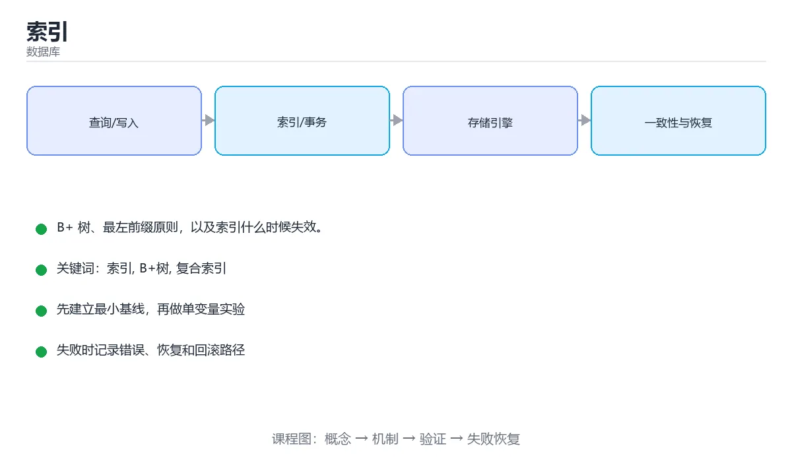

# 索引



> 内容更新时间：2026-10-03 · 学习阶段：进阶 · 预计用时：15 分钟

## 学习目标

- 能用自己的话解释「索引」解决了什么问题，而不是只背术语。
- 能说清 「索引」、「B+树」、「复合索引」、「最左前缀」 之间的关系，并分别举出一个例子。
- 能把本课知识放回「数据库」的知识体系，说明它和相邻主题的边界。
- 能完成本课练习，并用验收标准检查自己的结果。

> 一句话摘要：B+ 树、最左前缀原则，以及索引什么时候失效。

## 前置知识

- 先完成上一课《SQL 基础》；如果已经掌握，可以直接用本课练习自测。
- 本课阶段：进阶。建议先掌握同一分类的基础课程，并能独立运行正文中的最小示例。
- 开始前先复习：索引、B+树、复合索引。
- 如果某一步看不懂，先记录具体卡点，完成练习后再回头读一遍。


## 索引解决什么问题

没有索引时，数据库只能**全表扫描**，逐行比对。索引就像书的目录，让数据库快速定位到目标数据，把 `O(n)` 的查找降到 `O(log n)`。

## B+ 树索引

主流关系型数据库的索引底层多用 **B+ 树**：

- 所有数据都在叶子节点，且按顺序用链表相连。
- 非叶子节点只存键，可以容纳更多分支，树更矮。
- 叶子节点链表非常适合范围查询和排序。

```text
              [30 | 60]
            /     |      \
     [10|20]   [40|50]   [70|90]
        ↓          ↓          ↓
     叶子节点按顺序双向链表相连
```

三次磁盘 I/O 左右就能在千万级数据中定位一行记录。

## 创建与使用

```sql
CREATE INDEX idx_students_city ON students(city);

-- 走索引：条件列是索引列
SELECT * FROM students WHERE city = '上海';

-- 复合索引遵循最左前缀原则
CREATE INDEX idx_name_age ON students(name, age);
-- 可用：WHERE name = ? / WHERE name = ? AND age = ?
-- 不可用：WHERE age = ?
```

## 什么时候索引会失效

```sql
-- 在索引列上做运算或函数调用
SELECT * FROM students WHERE YEAR(created_at) = 2024;

-- 以 % 开头的模糊查询无法使用普通索引
SELECT * FROM students WHERE name LIKE '%明';

-- 类型隐式转换
SELECT * FROM students WHERE phone = 13800000000;  -- phone 是字符串
```

改写建议：把运算移到常量一侧，或使用覆盖索引、全文索引。

## 索引的代价

索引不是越多越好：

1. 占用额外磁盘空间。
2. `INSERT / UPDATE / DELETE` 都要同步维护索引，写变慢。
3. 优化器选错索引时反而更慢。

一般只为**高频查询条件、连接列、排序分组列**建立索引。

## 用 EXPLAIN 验证

```sql
EXPLAIN QUERY PLAN
SELECT * FROM students WHERE city = '上海';
```

关注是否出现 `SCAN TABLE`（全表扫描）或 `SEARCH ... USING INDEX`（使用索引）。

## B+ 树查找过程示例

以 `WHERE id = 42` 为例（假设每页存 100 个键、树高 3 层）：

```text
根节点（第 1 次 IO）：比较 42 落在哪个区间 → 定位到中间节点
中间节点（第 2 次 IO）：继续比较 → 定位到叶子页
叶子节点（第 3 次 IO）：页内二分查找 → 命中记录，返回
```

千万级数据只需 **3 次磁盘 IO**，这就是索引快于全表扫描的根本原因。范围查询（`WHERE id BETWEEN 40 AND 60`）在叶子节点沿链表顺序读取，因此范围扫描同样高效。

## 索引失效实例对照

| 写法 | 是否走索引 | 原因与改法 |
| --- | --- | --- |
| `WHERE city = '上海'` | 走 | 索引列直接比较 |
| `WHERE YEAR(created_at) = 2024` | 不走 | 列上有函数，改为 `created_at >= '2024-01-01' AND created_at < '2025-01-01'` |
| `WHERE name LIKE '%明'` | 不走 | 前缀未知，改为 `LIKE '明%'` 或用全文索引 |
| `WHERE phone = 13800000000`（phone 是字符串） | 可能不走 | 隐式类型转换，改为 `phone = '13800000000'` |
| `WHERE a = 1 ORDER BY b`（索引为 a） | 需排序 | 建复合索引 `(a, b)` 让过滤与排序都走索引 |
| `WHERE a = 1 OR b = 2`（只索引 a） | 可能不走 | 拆成两条查询 UNION，或分别建索引 |
| 复合索引 `(a, b, c)` 上 `WHERE b = 2` | 不走 | 违反最左前缀，考虑单独为 b 建索引 |

验证方法始终是 `EXPLAIN`：看 type 是否为 `ref/range`、key 是否命中、rows 扫描行数是否显著下降。

## 覆盖索引与索引下推

**覆盖索引**：查询需要的列全部包含在索引中，无需回表。

| 查询 | 索引 | 是否回表 |
| --- | --- | --- |
| `SELECT name FROM users WHERE city='上海'` | `(city)` | 回表（需取 name） |
| 同上 | `(city, name)` | **不回表**，Extra 显示 Using index |
| `SELECT * FROM users WHERE city='上海'` | `(city)` | 回表（需要全部列） |

这也是 `SELECT *` 拖慢查询的一个具体原因：它几乎必然导致回表。建议列表查询只取需要的列，并为高频组合建复合索引。

**索引下推（ICP, MySQL 5.6+）**：在存储引擎层就利用索引中的列过滤掉不满足条件的记录，减少回表次数。

| 查询 | 有无 ICP | 效果 |
| --- | --- | --- |
| `WHERE name LIKE '张%' AND age = 20`，索引 `(name, age)` | 有 | 引擎层先按 name 与 age 双重过滤，再回表 |
| 同上 | 无（老版本） | 只按 name 过滤，全部回表后再筛 age |

`EXPLAIN` 中 Extra 出现 `Using index condition` 即表示启用了索引下推；出现 `Using index` 表示覆盖索引；出现 `Using filesort` 或 `Using temporary` 则是需要优化的信号。

## 本课小结
索引是「用空间和写入速度换查询速度」。判断是否该建索引，先看查询频率和选择性。


## 索引失效与命中对照表

| SQL 写法 | 能否用上索引 | 原因与改写建议 |
| --- | --- | --- |
| `WHERE name = 'abc'` | 能 | 等值查询，最理想 |
| `WHERE name LIKE 'abc%'` | 能 | 前缀匹配可走索引 |
| `WHERE name LIKE '%abc'` | 不能 | 左侧通配无法定位区间；改用全文索引或倒排方案 |
| `WHERE YEAR(created_at) = 2024` | 不能 | 列被函数包裹；改写为 `created_at >= '2024-01-01' AND created_at < '2025-01-01'` |
| `WHERE id + 1 = 10` | 不能 | 列参与运算；改成 `id = 9` |
| `WHERE status = 1 OR user_id = 2` | 可能退化为全表扫描 | 用 `UNION ALL` 拆开，或建联合索引 |
| `WHERE a = 1 AND c = 3`（索引为 `(a, b, c)`） | 只用到 a | 违反最左前缀；按查询顺序设计索引列 |
| `WHERE name = 123`（列为字符串） | 不能 | 隐式类型转换让列变成函数调用 |
| `ORDER BY created_at LIMIT 10`（有该列索引） | 能 | 索引天然有序，可省掉排序 |
| `ORDER BY a, b`（索引为 `(a, b)`） | 能 | 排序顺序要与索引列顺序一致 |
| `SELECT *` 且需要回表 | 走索引但回表 | 只查必要列，或建覆盖索引 |
| `WHERE deleted = 0 AND user_id = 5` | 能，但区分度低 | 低区分度列放联合索引右侧 |

## 建索引速查

| 场景 | 建议 |
| --- | --- |
| 高频等值查询 | 单列或联合索引，把等值列放前面 |
| 高频范围查询 | 范围列放联合索引最后一位 |
| 排序 + 过滤 | 让索引顺序匹配 `WHERE` + `ORDER BY` |
| 只查少量列 | 建覆盖索引，避免回表 |
| 写入非常频繁的表 | 索引越少越好，每个索引都要维护 |
| 区分度极低的列（性别、状态） | 单独建索引意义不大，考虑组合列 |
| 前缀很长的字符串 | 用前缀索引 `INDEX(url(32))` 省空间 |
| 大表加索引 | 用在线 DDL 工具，避开业务高峰 |

## 排查速查

```sql
-- 1. 看优化器怎么执行，重点看 type / key / rows / Extra
EXPLAIN SELECT id, name FROM users WHERE email = 'a@b.com';

-- 2. 看真实耗时与扫描行数（MySQL 8）
EXPLAIN ANALYZE SELECT id, name FROM users WHERE email = 'a@b.com';

-- 3. 看表的索引清单与区分度
SHOW INDEX FROM users;
SELECT COUNT(DISTINCT email) / COUNT(*) AS selectivity FROM users;
```

`EXPLAIN` 中值得警惕的信号：`type=ALL`（全表扫描）、`key=NULL`（没用索引）、`rows` 远大于预期、`Extra` 出现 `Using filesort` 或 `Using temporary`。

## 自测清单

- [ ] 能说出最左前缀原则，并据此排列联合索引列顺序。
- [ ] 知道列上加函数、隐式类型转换会导致索引失效。
- [ ] 会读 `EXPLAIN` 的 `type`、`key`、`rows`、`Extra` 四个字段。
- [ ] 知道区分度低的列不适合单独建索引。
- [ ] 能给高频查询设计覆盖索引，避免回表。

## 动手练习


> 本课练习重点：围绕「索引、B+树、复合索引」完成复述、实验和交付，每个结果都要能被别人检查。

先写 schema 与查询，再补边界和失败数据，最后看执行计划与锁等待。

### 练习 1：建立心智模型（10 分钟）

合上教程，用 3～5 句话回答：

1. 「索引」解决了什么问题？
2. 如果没有它，会出现什么具体后果？
3. 它和「B+树」是什么关系？

**验收标准**：至少出现一个本课关键词，并写出一个反例、边界条件或失效场景。

### 练习 2：做一次可控实验（20 分钟）

从正文中选一个最小示例，完成以下操作：

1. 先预测修改一个参数、输入或步骤后的结果。
2. 再实际执行或逐步推演，记录真实结果。
3. 如果结果与预测不同，写出差异原因。

**验收标准**：留下「原例 → 改动 → 预测 → 结果 → 原因」五步记录。

### 练习 3：交付一个小结果（30 分钟）

在 SQLite 或纸面表结构上写查询，分别验证正常数据、空值和边界数据。

任务要求：

- 结果必须能被别人检查，不能只写“我已经理解了”。
- 至少覆盖「索引」和「B+树」两个关键词。
- 写出 1 个仍然不确定的问题，以及下一步如何验证。

> 提示：时间有限时优先做练习 1 和练习 2；练习 3 可以拆成两次完成。


## 考点精讲：把测验题还原成判断过程

本课有 6 个判断点。先自己作答，再看「判断依据」；如果结论正确但理由不完整，回到正文对应章节补足概念。

### 考点 1：数据库索引主要用来加速哪类操作？

- **正确判断**：查询数据
- **判断依据**：正确答案是「查询数据」，本课在「覆盖索引与索引下推」中说明：建议列表查询只取需要的列，并为高频组合建复合索引。索引把全表扫描变成有序查找，显著加速查询。本课还在「索引解决什么问题」中说明：没有索引时，数据库只能全表扫描，逐行比对。本课还在「索引解决什么问题」中说明：索引就像书的目录，让数据库快速定位到目标数据，把 O(n) 的查找降到 O(log n)。
- **迁移检查**：如果给某个错误选项去掉一个限定词，它会不会变成正确？说明理由。

### 考点 2：关系型数据库常用的 B+ 树索引，其叶子节点有什么特点？

- **正确判断**：按顺序用链表相连，便于范围查询
- **判断依据**：正确答案是「按顺序用链表相连，便于范围查询」，本课在「B+ 树索引」中说明：所有数据都在叶子节点，且按顺序用链表相连。B+ 树所有键都在叶子节点，叶子之间用链表相连，因此范围查询和排序效率很高。本课还在「B+ 树索引」中说明：主流关系型数据库的索引底层多用 B+ 树。本课还在「B+ 树查找过程示例」中说明：范围查询（WHERE id BETWEEN 40 AND 60）在叶子节点沿链表顺序读取，因此范围扫描同样高效。
- **迁移检查**：如果给某个错误选项去掉一个限定词，它会不会变成正确？说明理由。

### 考点 3：为什么 WHERE name LIKE '%明' 通常用不上普通索引？

- **正确判断**：模糊匹配以 % 开头
- **判断依据**：正确答案是「模糊匹配以 % 开头」，本课在「覆盖索引与索引下推」中说明：建议列表查询只取需要的列，并为高频组合建复合索引。普通 B+ 树索引按前缀有序，以 % 开头相当于前缀未知，只能全表扫描。本课还在「用 EXPLAIN 验证」中说明：关注是否出现 SCAN TABLE（全表扫描）或 SEARCH ... USING INDEX（使用索引）。本课还在「排查速查」中说明：EXPLAIN 中值得警惕的信号：type=ALL（全表扫描）、key=NULL（没用索引）、rows 远大于预期、Extra 出现 Using filesort 或 Using temporary。
- **迁移检查**：把题干里的一个条件换成边界值，原来的结论还成立吗？写出判断过程。

### 考点 4：联合索引 (a, b, c) 上，只对 b 做条件查询能否用上该索引？

- **正确判断**：一般用不上（最左前缀原则）
- **判断依据**：正确答案是「一般用不上（最左前缀原则）」，本课在「索引的代价」中说明：一般只为高频查询条件、连接列、排序分组列建立索引。B+ 树按 (a, b, c) 顺序排序，跳过 a 就无法定位区间。本课还在「索引解决什么问题」中说明：没有索引时，数据库只能全表扫描，逐行比对。本课还在「索引解决什么问题」中说明：索引就像书的目录，让数据库快速定位到目标数据，把 O(n) 的查找降到 O(log n)。
- **迁移检查**：如果给某个错误选项去掉一个限定词，它会不会变成正确？说明理由。

### 考点 5：覆盖索引带来的直接好处是？

- **正确判断**：查询所需字段都在索引里
- **判断依据**：EXPLAIN 中 Extra 出现 Using index 就表示用到了覆盖索引。其他选项：覆盖索引让查询所需字段都在索引里，无需回表。针对「覆盖索引带来的直接好处是，」，本课在「覆盖索引与索引下推」中说明：覆盖索引：查询需要的列全部包含在索引中，无需回表。本课还在「什么时候索引会失效」中说明：改写建议：把运算移到常量一侧，或使用覆盖索引、全文索引。本课还在「覆盖索引与索引下推」中说明：出现 Using index 表示覆盖索引。
- **迁移检查**：如果给某个错误选项去掉一个限定词，它会不会变成正确？说明理由。

### 考点 6：补全代码：「索引」示例中，下面这行代码缺少哪个关键字或函数名？请填入 ____。 `SELECT * FROM students WHERE YEAR(____) = 2024;`

- **正确判断**：created_at
- **判断依据**：正确答案是「created_at」，本课在「索引的代价」中说明：INSERT / UPDATE / DELETE 都要同步维护索引，写变慢。本课还在「B+ 树查找过程示例」中说明：千万级数据只需 3 次磁盘 IO，这就是索引快于全表扫描的根本原因。本课还在「覆盖索引与索引下推」中说明：索引下推（ICP, MySQL 5.6+）：在存储引擎层就利用索引中的列过滤掉不满足条件的记录，减少回表次数。
- **迁移检查**：如果填成相近的另一个函数或关键字，程序会在哪一步出错？

## 本课复习清单

离开本课前，逐项确认：

- [ ] 不看解析，能说出「数据库索引主要用来加速哪类操作？」的判断依据。
- [ ] 不看解析，能说出「关系型数据库常用的 B+ 树索引，其叶子节点有什么特点？」的判断依据。
- [ ] 不看解析，能说出「为什么 WHERE name LIKE '%明' 通常用不上普通索引？」的判断依据。
- [ ] 不看解析，能说出「联合索引 (a, b, c) 上，只对 b 做条件查询能否用上该索引？」的判断依据。
- [ ] 不看解析，能说出「覆盖索引带来的直接好处是？」的判断依据。
- [ ] 不看解析，能说出「补全代码：「索引」示例中，下面这行代码缺少哪个关键字或函数名？请填入 ____。…」的判断依据。
- [ ] 至少运行一次本课示例，记录输入、输出和一个边界情况。
- [ ] 把本课最容易混淆的两个概念写成一句话对照。

| 复盘项 | 记录 |
| --- | --- |
| 已经能独立解释的考点 |  |
| 仍然说不清的概念 |  |
| 下一步验证动作 |  |

## 术语速查

把本课反复出现的术语集中放在一起。复习时先遮住右列，尝试用自己的话解释，再回到正文核对。

| 术语 | 本课语境 |
| --- | --- |
| `O(n)` | 没有索引时，数据库只能**全表扫描**，逐行比对。索引就像书的目录，让数据库快速定位到目标数据，把 `O(n)` 的查找降到 `O(log n)`。 |
| `O(log n)` | 没有索引时，数据库只能**全表扫描**，逐行比对。索引就像书的目录，让数据库快速定位到目标数据，把 `O(n)` 的查找降到 `O(log n)`。 |
| `INSERT / UPDATE / DELETE` | `INSERT / UPDATE / DELETE` 都要同步维护索引，写变慢。 |
| `SCAN TABLE` | 关注是否出现 `SCAN TABLE`（全表扫描）或 `SEARCH ... USING INDEX`（使用索引）。 |
| `SEARCH ... USING INDEX` | 关注是否出现 `SCAN TABLE`（全表扫描）或 `SEARCH ... USING INDEX`（使用索引）。 |
| `WHERE id = 42` | 以 `WHERE id = 42` 为例（假设每页存 100 个键、树高 3 层）： |
| `WHERE id BETWEEN 40 AND 60` | 千万级数据只需 **3 次磁盘 IO**，这就是索引快于全表扫描的根本原因。范围查询（`WHERE id BETWEEN 40 AND 60`）在叶子节点沿链表顺序读取，因此范围扫描同样高效。 |
| `WHERE city = '上海'` | \| `WHERE city = '上海'` \| 走 \| 索引列直接比较 \| |
| `WHERE YEAR(created_at) = 2024` | \| `WHERE YEAR(created_at) = 2024` \| 不走 \| 列上有函数，改为 `created_at >= '2024-01-01' AND created_at < '2025-01-01'… |
| `WHERE name LIKE '%明'` | \| `WHERE name LIKE '%明'` \| 不走 \| 前缀未知，改为 `LIKE '明%'` 或用全文索引 \| |
| `LIKE '明%'` | \| `WHERE name LIKE '%明'` \| 不走 \| 前缀未知，改为 `LIKE '明%'` 或用全文索引 \| |
| `WHERE phone = 13800000000` | \| `WHERE phone = 13800000000`（phone 是字符串） \| 可能不走 \| 隐式类型转换，改为 `phone = '13800000000'` \| |

## 面试问答与自测

下面把本课考点换成面试追问。先口述自己的答案，
再对照参考回答检查是否遗漏了前提、边界或失败路径。

### 追问 1：数据库索引主要用来加速哪类操作？

**参考回答**：正确答案是「查询数据」，本课在「覆盖索引与索引下推」中说明：建议列表查询只取需要的列，并为高频组合建复合索引。索引把全表扫描变成有序查找，显著加速查询。本课还在「索引解决什么问题」中说明：没有索引时，数据库只能全表扫描，逐行比对。本课还在「索引解决什么问题」中说明：索引就像书的目录，让数据库快速定位到目标数据，把 O(n) 的查找降到 O(log n)。

### 追问 2：关系型数据库常用的 B+ 树索引，其叶子节点有什么特点？

**参考回答**：正确答案是「按顺序用链表相连，便于范围查询」，本课在「B+ 树索引」中说明：所有数据都在叶子节点，且按顺序用链表相连。B+ 树所有键都在叶子节点，叶子之间用链表相连，因此范围查询和排序效率很高。本课还在「B+ 树索引」中说明：主流关系型数据库的索引底层多用 B+ 树。本课还在「B+ 树查找过程示例」中说明：范围查询（WHERE id BETWEEN 40 AND 60）在叶子节点沿链表顺序读取，因此范围扫描同样高效。

### 追问 3：为什么 WHERE name LIKE '%明' 通常用不上普通索引？

**参考回答**：正确答案是「模糊匹配以 % 开头」，本课在「覆盖索引与索引下推」中说明：建议列表查询只取需要的列，并为高频组合建复合索引。普通 B+ 树索引按前缀有序，以 % 开头相当于前缀未知，只能全表扫描。本课还在「用 EXPLAIN 验证」中说明：关注是否出现 SCAN TABLE（全表扫描）或 SEARCH ... USING INDEX（使用索引）。本课还在「排查速查」中说明：EXPLAIN 中值得警惕的信号：type=ALL（全表扫描）、key=NULL（没用索引）、rows 远大于预期、Extra 出现 Using filesort 或 Using temporary。

### 追问 4：联合索引 (a, b, c) 上，只对 b 做条件查询能否用上该索引？

**参考回答**：正确答案是「一般用不上（最左前缀原则）」，本课在「索引的代价」中说明：一般只为高频查询条件、连接列、排序分组列建立索引。B+ 树按 (a, b, c) 顺序排序，跳过 a 就无法定位区间。本课还在「索引解决什么问题」中说明：没有索引时，数据库只能全表扫描，逐行比对。本课还在「索引解决什么问题」中说明：索引就像书的目录，让数据库快速定位到目标数据，把 O(n) 的查找降到 O(log n)。

### 追问 5：覆盖索引带来的直接好处是？

**参考回答**：EXPLAIN 中 Extra 出现 Using index 就表示用到了覆盖索引。其他选项：覆盖索引让查询所需字段都在索引里，无需回表。针对「覆盖索引带来的直接好处是，」，本课在「覆盖索引与索引下推」中说明：覆盖索引：查询需要的列全部包含在索引中，无需回表。本课还在「什么时候索引会失效」中说明：改写建议：把运算移到常量一侧，或使用覆盖索引、全文索引。本课还在「覆盖索引与索引下推」中说明：出现 Using index 表示覆盖索引。

## English Overview

**Title:** Indexes

**Summary:** B+ trees, leftmost prefix and when indexes fail.

**Category:** Database  
**Level:** 进阶  
**Key terms:** 索引, B+树, 复合索引, 最左前缀, EXPLAIN

> The full tutorial is written in Chinese. This bilingual overview helps English readers identify the topic, scope and key terms before studying the detailed examples.

## 内容元数据

- 内容版本：v2.0
- 最后更新：2026-10-03
- 学习阶段：进阶
- 适用环境：PostgreSQL / MySQL / SQLite 等主流数据库
- 内容来源：内置结构化课程与工程实践整理
- 相关主题：索引、B+树、复合索引、最左前缀、EXPLAIN
- 质量版本：P0 测验标准 + P1 覆盖扩展 + P2 体验补全


## Full English Study Guide

### Overview

**Indexes** focuses on B+ trees, leftmost prefix and when indexes fail.

### Learning Outcomes

- Explain what **Indexes** solves and when it should be used.
- Identify inputs, outputs, state and failure boundaries.
- Build a minimal reproducible example and observe the real result.
- Test normal, boundary and failure paths.
- Measure performance, resource cost or security impact before optimizing.
- Document the decision, rollback path and remaining uncertainty.

### Core Mental Model

1. **Problem first:** define the exact problem before choosing a tool or pattern.
2. **Smallest example:** reduce the system to one input and one observable output.
3. **State and flow:** trace how data, control or responsibility moves through the system.
4. **Boundaries:** identify invalid input, resource limits, timeouts and permission edges.
5. **Evidence:** use tests, logs, metrics or reproductions instead of intuition.
6. **Trade-offs:** compare correctness, latency, cost, complexity and operability.

### Step-by-step Study Plan

1. Read the Chinese lesson once and write down the main problem in one sentence.
2. Run the smallest example and save the exact command and output.
3. Change only one input or parameter and predict the result before running it.
4. Introduce one failure and record how the system detects, reports and recovers.
5. Write one test or checklist item for the normal, boundary and failure paths.
6. Complete the quiz and explain every wrong answer in your own words.

### Practice Tasks

- Rebuild the minimal example from an empty directory.
- Add one boundary test and one failure test.
- Produce a short report containing the baseline, change, result and rollback.

### Common Failure Modes

- Treating a happy-path demo as production readiness.
- Skipping boundary values and invalid inputs.
- Optimizing before establishing a measurable baseline.
- Hiding errors, permissions or resource limits.

### Self-check Questions

1. What is the smallest observable result that proves this lesson works?
2. What input or state is most likely to break it?
3. Which metric or test would reveal a regression?
4. What is the rollback path?
5. What is the cost of using this approach at 10x scale?
6. Which adjacent topic is most often confused with this one?

### Glossary

- Topic: **Indexes**
- Related terms: 索引, B+树, 复合索引, 最左前缀
- Primary evidence: command output, tests, logs, metrics or reproductions

> This guide is an English study companion for the detailed Chinese lesson. It covers the learning path, mental model and acceptance questions; code examples and engineering details remain in the main tutorial.


## Bilingual Section Outline

| 中文小节 | English section |
| --- | --- |
| 学习目标 | Learning objectives |
| 前置知识 | Prerequisites |
| 索引解决什么问题 | Index解决什么问题 |
| B+ 树索引 | B+ 树Index |
| 创建与使用 | 创建与使用 |
| 什么时候索引会失效 | 什么时候Index会失效 |
| 索引的代价 | Index的代价 |
| 用 EXPLAIN 验证 | 用 EXPLAIN 验证 |
| B+ 树查找过程示例 | B+ 树查找过程示例 |
| 索引失效实例对照 | Index失效实例对照 |

> 该大纲把每个中文小节映射为英文标题，配合 Full English Study Guide 使用。


## 参考资料与复核

- 最后复核：2026-10-04
- 下次复核：2027-04-04
- 复核范围：版本兼容、API 行为、安全建议与工程实践
- 来源性质：官方文档与标准；本课正文为离线教学重组，不复制原文

| 参考资料 | 本课用途 |
| --- | --- |
| [PostgreSQL 文档](https://www.postgresql.org/docs/) | SQL、索引与事务 |
| [SQLite 文档](https://sqlite.org/docs.html) | 嵌入式数据库与 SQL 行为 |

> 本课主题：B+ 树、最左前缀原则，以及索引什么时候失效。

> App 完全离线展示文字链接，不会自动联网；需要延伸阅读时可复制链接到浏览器。
