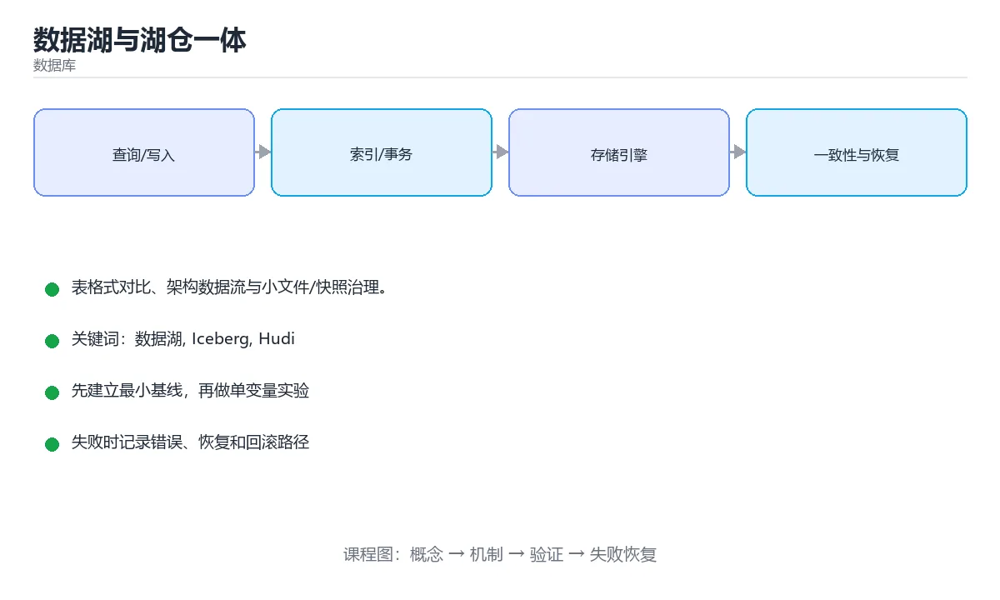

# 数据湖与湖仓一体



> 内容更新时间：2026-10-03 · 学习阶段：高级 · 预计用时：15 分钟

## 学习目标

- 能用自己的话解释「数据湖与湖仓一体」解决了什么问题，而不是只背术语。
- 能说清 「数据湖」、「Iceberg」、「Hudi」、「Delta」 之间的关系，并分别举出一个例子。
- 能把本课知识放回「数据库」的知识体系，说明它和相邻主题的边界。
- 能完成本课练习，并用验收标准检查自己的结果。

> 一句话摘要：表格式对比、架构数据流与小文件/快照治理。

## 前置知识

- 先完成上一课《大数据与批流处理》；如果已经掌握，可以直接用本课练习自测。
- 本课阶段：高级。建议具备同一方向的完整基础，能阅读较长的代码、配置或系统设计说明。
- 开始前先复习：数据湖、Iceberg、Hudi。
- 如果某一步看不懂，先记录具体卡点，完成练习后再回头读一遍。


## 数据仓库、数据湖与湖仓

| 形态 | 存储 | 数据特点 | 典型问题 |
| --- | --- | --- | --- |
| 数据仓库 | 专有格式 + 高性能引擎 | 结构化、治理好 | 贵、半结构化支持弱 |
| 数据湖 | 对象存储 + 文件 | 结构化/半结构化/非结构化都能放 | 易变"数据沼泽"（无元数据、无质量） |
| 湖仓一体 | 对象存储 + 开放表格式 | 兼具灵活与事务能力 | 对元数据与 compaction 有运维要求 |

湖仓的核心是**在对象存储上加一层表格式**，把"文件集合"变成有事务、有 schema、有版本的表。

## 开放表格式对比

| 格式 | 特点 | 适合 |
| --- | --- | --- |
| Iceberg | 隐藏分区、快照隔离、增量读，生态最广 | 通用湖仓，多引擎共享 |
| Hudi | 强调 upsert 与增量处理，支持 MOR/COW | 近实时入湖 |
| Delta Lake | 与 Spark 生态结合紧密，事务日志清晰 | Databricks/Spark 体系 |

三者共同能力：ACID 事务、时间旅行（查历史快照）、schema 演进、分区演化。选型主要看现有计算引擎与团队熟悉度。

## 典型架构与数据流

对象存储（S3/OSS）+ 表格式（Iceberg）→ 计算引擎（Spark/Flink/Trino）→ 元数据服务（Hive Metastore/REST Catalog）→ 上层 BI 与特征平台。数据流通常是：CDC 采集业务库 → 入湖（ODS）→ 清洗（DWD）→ 汇总（DWS）→ 应用（ADS）。

## 必做的运维与治理

1. **小文件合并**：流式写入会产生大量小文件，需定期 compaction（否则元数据与查询都变慢）。
2. **快照过期**：时间旅行会保留历史快照，需按策略清理过期快照并回收孤儿文件。
3. **元数据服务高可用**：Catalog 挂了整条链路不可用，需部署多副本。
4. **数据质量**：入湖即校验（空值、枚举、行数波动），坏数据隔离到 dead-letter 表。
5. **权限与血缘**：按库/表/列授权，血缘可用于影响面分析与成本归集。

## 本课小结
湖仓一体的价值是**用开放格式在廉价对象存储上获得数仓级的事务与治理**；落地成败往往取决于小文件治理、快照清理与元数据高可用这三件运维事。


## 三种架构对照

| 维度 | 数据仓库 | 数据湖 | 湖仓一体 |
| --- | --- | --- | --- |
| 数据 | 结构化、schema-on-write | 任意格式、schema-on-read | 开放格式 + 表格式 |
| 事务 | 强 | 弱 | 支持 ACID |
| schema 演进 | 成本高 | 灵活但易失控 | 受控演进 |
| 分析性能 | 好 | 取决于引擎 | 好（含索引与统计） |
| 典型 | Snowflake、Redshift | S3 + Hive | Iceberg、Hudi、Delta Lake |

## 表格式对照

| 能力 | Iceberg | Hudi | Delta Lake |
| --- | --- | --- | --- |
| 快照与时间旅行 | 支持 | 支持 | 支持 |
| 增量读取 | 支持 | 强（增量拉取） | 支持 |
| 行级更新 | 支持（merge-on-read） | 强（copy-on-write / merge-on-read） | 支持 |
| 引擎中立 | 强 | 中 | 偏 Spark 生态 |
| 适合场景 | 通用湖仓、引擎多样 | 近实时入湖与 CDC | Databricks / Spark 生态 |

共识：三者都提供 ACID、schema 演进、时间旅行与元数据管理，差异在写入模式与生态侧重。

```sql
-- Iceberg：按天分区并做元数据维护
CREATE TABLE lake.orders (
    order_id   BIGINT,
    user_id    BIGINT,
    amount     DECIMAL(12, 2),
    created_at TIMESTAMP
)
USING iceberg
PARTITIONED BY (days(created_at))
TBLPROPERTIES (
    'write.target-file-size-bytes' = '134217728'   -- 目标文件 128 MB
);

-- 小文件治理：合并数据文件与清单文件
CALL catalog.system.rewrite_data_files(table => 'lake.orders');
CALL catalog.system.rewrite_manifests(table => 'lake.orders');
CALL catalog.system.expire_snapshots(table => 'lake.orders', older_than => TIMESTAMP '2025-09-01 00:00:00');

-- 时间旅行：排查某天的数据状态
SELECT COUNT(*) FROM lake.orders VERSION AS OF '2025-09-01-snapshot';
```

## 湖仓落地要点

| 要点 | 做法 |
| --- | --- |
| 文件大小 | 目标 128 到 512 MB，定期 compaction |
| 分区设计 | 按时间 + 高基数列组合，避免过度分区 |
| 元数据 | 定期 expire 快照与清单，控制元数据膨胀 |
| CDC 入湖 | 用 upsert / merge 策略，保证主键唯一 |
| 权限 | 表级与列级权限 + 存储层访问控制 |
| 质量 | 入湖前后做行数、主键、枚举值校验 |
| 血缘 | 记录上下游依赖，便于影响分析 |

## 常见错误对照表

| 容易踩的做法 | 实际现象 | 原因与正确做法 |
| --- | --- | --- |
| 把湖仓当纯湖使用 | 小文件与元数据爆炸 | 开启 compaction 与元数据清理 |
| 分区字段基数过高 | 目录与元数据膨胀 | 用时间分区 + 桶或排序键 |
| 不清理快照 | 存储成本持续上升 | 配置快照过期策略 |
| 直接覆盖写全表 | 成本高且不可回溯 | 用增量 merge 或分区覆盖 |
| 忽略 schema 演进策略 | 下游读取失败 | 用向后兼容的加列方式 |
| 无主键约束的 upsert | 出现重复数据 | 明确主键并做去重校验 |
| 权限只在表层 | 敏感列泄漏 | 加列级权限与脱敏视图 |
| 不记录血缘 | 影响分析困难 | 采集血缘并在变更前评估 |
| 只测小数据量 | 上线后性能不达标 | 用接近生产的数据量验证 |
| 缺少数据质量门禁 | 脏数据进入下游 | 入湖与出湖都设校验规则 |

## 自测清单

- [ ] 能说清数据仓库、数据湖与湖仓一体的区别。
- [ ] 知道 Iceberg、Hudi、Delta Lake 的共性与侧重。
- [ ] 会配置 compaction 与快照过期策略。
- [ ] 分区设计避免高基数。
- [ ] 有表级与列级权限和数据质量门禁。

## 动手练习


> 本课练习重点：围绕「数据湖、Iceberg、Hudi」完成复述、实验和交付，每个结果都要能被别人检查。

先写 schema 与查询，再补边界和失败数据，最后看执行计划与锁等待。

### 练习 1：建立心智模型（10 分钟）

合上教程，用 3～5 句话回答：

1. 「数据湖与湖仓一体」解决了什么问题？
2. 如果没有它，会出现什么具体后果？
3. 它和「Iceberg」是什么关系？

**验收标准**：至少出现一个本课关键词，并写出一个反例、边界条件或失效场景。

### 练习 2：做一次可控实验（20 分钟）

从正文中选一个最小示例，完成以下操作：

1. 先预测修改一个参数、输入或步骤后的结果。
2. 再实际执行或逐步推演，记录真实结果。
3. 如果结果与预测不同，写出差异原因。

**验收标准**：留下「原例 → 改动 → 预测 → 结果 → 原因」五步记录。

### 练习 3：交付一个小结果（30 分钟）

在 SQLite 或纸面表结构上写查询，分别验证正常数据、空值和边界数据。

任务要求：

- 结果必须能被别人检查，不能只写“我已经理解了”。
- 至少覆盖「数据湖」和「Iceberg」两个关键词。
- 写出 1 个仍然不确定的问题，以及下一步如何验证。

> 提示：时间有限时优先做练习 1 和练习 2；练习 3 可以拆成两次完成。


## 深入补充：数据湖与湖仓一体

前面已经建立了基本概念。这一节换一个角度，把「数据湖与湖仓一体」放进真实工程里，
重点回答三件事：它为什么存在、内部如何运转、什么时候会失效。

### 一、核心模型

数据湖保存原始多样数据，数据仓库提供结构化分析；湖仓一体在低成本对象存储上叠加表格式、事务、Schema 演进和元数据，让分析与机器学习共用一份数据。

```text
原始数据入湖 → 表格式元数据 → 清洗与分层 → 事务提交与快照 → SQL/Spark/Flink 查询 → 特征与服务层 → 治理与血缘
```

### 二、关键机制拆解

1. 对象存储成本低、容量大，但通常只提供最终一致性或有限原子操作，需要表格式补齐事务。
2. 开放表格式通过元数据文件记录快照、Schema 和分区，支持时间旅行、回滚和并发写。
3. 数据分层通常分为原始层、清洗层、明细层、汇总层和应用层，避免所有逻辑堆在一层。
4. 小文件会拖慢查询和元数据操作，需要定期合并并控制文件大小。
5. Schema 演进要向后兼容，新增列相对安全，删除或改类型需要版本化处理。
6. 数据湖容易变成数据沼泽：没有所有权、质量、血缘和访问控制时，数据越多越难用。
7. 湖仓的批流统一依赖同一份表格式和元数据，而不是把所有引擎简单拼在一起。

### 三、对照表：抓住容易混淆的边界

| 维度 | 一侧 | 另一侧 |
| --- | --- | --- |
| 数据湖 | 存原始多样数据 | 灵活但缺少事务和治理 |
| 数据仓库 | 结构化、强 Schema | 分析稳定但扩展和多样数据受限 |
| 湖仓一体 | 对象存储加表格式和事务 | 兼顾成本、开放与治理 |
| 数据沼泽 | 数据多但不可信 | 缺所有权、质量和血缘 |

### 四、工作示例

订单数据先以 Parquet 写入原始层，经批处理清洗成明细表，再聚合为日销售汇总；表格式记录每次提交快照。出现数据错误时可回滚到前一快照，同时下游仍能按版本读取。

### 五、常见误区与失效边界

| 错误做法或假设 | 后果 | 正确做法 |
| --- | --- | --- |
| 直接把文件当表 | 没有事务、Schema 和快照 | 使用开放表格式管理元数据 |
| 小文件不治理 | 查询元数据开销爆炸 | 定期 compaction 并控制分区粒度 |
| 没有数据所有权 | 质量问题无人负责 | 为每张表指定负责人和质量规则 |
| 缺失血缘和权限 | 数据泄露与难以追责 | 统一元数据、血缘和访问控制 |

### 六、场景推演

报表口径出现差异。通过血缘追踪发现上游清洗层修改了字段含义但未升级版本。修复方案是恢复兼容 Schema、重跑受影响分区、对下游通知，并增加 Schema 变更评审和回归校验。

### 七、自测问答

**Q1：湖仓一体相比数据湖多了什么？**

事务、Schema、快照、元数据和治理能力。

**Q2：为什么对象存储需要表格式？**

它补齐原子提交、快照和并发控制等能力。

**Q3：小文件为什么影响性能？**

查询和元数据操作需要打开大量文件，I/O 和调度开销高。

**Q4：数据沼泽的根因是什么？**

缺少所有权、质量标准、血缘和访问控制。

### 八、小项目：把知识变成可检查的产出

用本地 Parquet 文件模拟湖仓：建立原始、明细、汇总三层，记录 Schema 版本和快照；执行一次增量更新、一次回滚和一次小文件合并，验证查询结果与血缘。

### 九、适用边界

湖仓不是把所有数据都放对象存储就结束了。它需要表格式、计算引擎、元数据、治理和运维协同，否则只是更贵的数据湖。

### 十、完成检查清单

- [ ] 能解释数据湖、仓库和湖仓的边界
- [ ] 能设计分层与表格式方案
- [ ] 能处理 Schema 演进和快照
- [ ] 能治理小文件与分区
- [ ] 能建立血缘、所有权和权限

### 十一、复习顺序

1. 先不看资料复述“核心模型”，确认能说出它解决的三个问题。
2. 再对照表逐行解释容易混淆的概念，每个概念补一个反例。
3. 跟着工作示例做一遍，改变一个条件并预测结果。
4. 用自测问答检查理解，错题回到对应小节重新阅读。
5. 最后完成小项目，把结果、失败记录和复查清单整理成一份可提交产物。

> 复习不是重读一遍，而是离开原文重新产出：复述、改写、验证、复盘。


## 考点精讲：把测验题还原成判断过程

本课有 6 个判断点。先自己作答，再看「判断依据」；如果结论正确但理由不完整，回到正文对应章节补足概念。

### 考点 1：湖仓一体相比传统数据湖的关键增强是？

- **正确判断**：在对象存储上提供事务
- **判断依据**：开放表格式把文件集合变成有 ACID 与时间旅行的表。其他选项：湖仓一体的关键增强是在对象存储上提供事务。针对「湖仓一体相比传统数据湖的关键增强是，」，本课在「深入补充：数据湖与湖仓一体」中说明：湖仓一体在低成本对象存储上叠加表格式、事务、Schema 演进和元数据，让分析与机器学习共用一份数据。本课还在「本课小结」中说明：湖仓一体的价值是用开放格式在廉价对象存储上获得数仓级的事务与治理。本课还在「数据仓库、数据湖与湖仓」中说明：湖仓的核心是在对象存储上加一层表格式，把"文件集合"变成有事务、有 schema、有版本的表。
- **迁移检查**：遮住选项，只根据定义复述一次答案，再回来看哪个选项与复述一致。

### 考点 2：Iceberg、Hudi、Delta Lake 的共同能力不包括？

- **正确判断**：自动优化所有查询性能
- **判断依据**：表格式提供事务与元数据能力，查询性能仍取决于引擎与文件组织。其他选项：三者都支持时间旅行、ACID 与 schema 演进，但都不会「自动优化所有查询性能」，仍需建模与调优。针对「Iceberg、Hudi、Delta Lake …」，本课在「开放表格式对比」中说明：三者共同能力：ACID 事务、时间旅行（查历史快照）、schema 演进、分区演化。本课还在「表格式对照」中说明：共识：三者都提供 ACID、schema 演进、时间旅行与元数据管理，差异在写入模式与生态侧重。
- **迁移检查**：把题干里的一个条件换成边界值，原来的结论还成立吗？写出判断过程。

### 考点 3：流式写入湖表后必须定期做的一件事是？

- **正确判断**：小文件合并（compaction）
- **判断依据**：正确答案是「小文件合并（compaction）」，本课在「必做的运维与治理」中说明：小文件合并：流式写入会产生大量小文件，需定期 compaction（否则元数据与查询都变慢）。小文件过多会让元数据膨胀、查询变慢，需要定期合并。本课还在「典型架构与数据流」中说明：对象存储（S3/OSS）+ 表格式（Iceberg）→ 计算引擎（Spark/Flink/Trino）→ 元数据服务（Hive Metastore/REST Catalog）→ 上层 BI 与特征平台。
- **迁移检查**：遮住选项，只根据定义复述一次答案，再回来看哪个选项与复述一致。

### 考点 4：Iceberg 等表格式相比 Hive 表的关键改进是？

- **正确判断**：支持 ACID
- **判断依据**：正确答案是「支持 ACID」，本课在「深入补充：数据湖与湖仓一体」中说明：湖仓一体在低成本对象存储上叠加表格式、事务、Schema 演进和元数据，让分析与机器学习共用一份数据。表格式把「哪些文件构成一张表」变成可原子提交的元数据快照。本课还在「本课小结」中说明：湖仓一体的价值是用开放格式在廉价对象存储上获得数仓级的事务与治理。本课还在「典型架构与数据流」中说明：对象存储（S3/OSS）+ 表格式（Iceberg）→ 计算引擎（Spark/Flink/Trino）→ 元数据服务（Hive Metastore/REST Catalog）→ 上层 BI 与特征平台。
- **迁移检查**：把题干里的一个条件换成边界值，原来的结论还成立吗？写出判断过程。

### 考点 5：湖仓中小文件问题如何缓解？

- **正确判断**：定期执行 compaction 合并小文件，并控制写入批次大小
- **判断依据**：正确答案是「定期执行 compaction 合并小文件，并控制写入批次大小」，本课在「深入补充：数据湖与湖仓一体」中说明：小文件会拖慢查询和元数据操作，需要定期合并并控制文件大小。小文件会让元数据与读取开销暴涨，流式写入场景尤其需要 compaction。本课还在「必做的运维与治理」中说明：快照过期：时间旅行会保留历史快照，需按策略清理过期快照并回收孤儿文件。本课还在「必做的运维与治理」中说明：小文件合并：流式写入会产生大量小文件，需定期 compaction（否则元数据与查询都变慢）。
- **迁移检查**：如果给某个错误选项去掉一个限定词，它会不会变成正确？说明理由。

### 考点 6：补全代码：「数据湖与湖仓一体」示例中，下面这行代码缺少哪个关键字或函数名？请填入 ____。 `CALL ____.system.rewrite_data_files(table => 'lake.orders');`

- **正确判断**：catalog
- **判断依据**：正确答案是「catalog」，本课在「深入补充：数据湖与湖仓一体」中说明：数据湖保存原始多样数据，数据仓库提供结构化分析。本课还在「深入补充：数据湖与湖仓一体」中说明：数据湖容易变成数据沼泽：没有所有权、质量、血缘和访问控制时，数据越多越难用。本课还在「深入补充：数据湖与湖仓一体」中说明：它需要表格式、计算引擎、元数据、治理和运维协同，否则只是更贵的数据湖。
- **迁移检查**：如果填成相近的另一个函数或关键字，程序会在哪一步出错？

## 本课复习清单

离开本课前，逐项确认：

- [ ] 不看解析，能说出「湖仓一体相比传统数据湖的关键增强是？」的判断依据。
- [ ] 不看解析，能说出「Iceberg、Hudi、Delta Lake 的共同能力不包括？」的判断依据。
- [ ] 不看解析，能说出「流式写入湖表后必须定期做的一件事是？」的判断依据。
- [ ] 不看解析，能说出「Iceberg 等表格式相比 Hive 表的关键改进是？」的判断依据。
- [ ] 不看解析，能说出「湖仓中小文件问题如何缓解？」的判断依据。
- [ ] 不看解析，能说出「补全代码：「数据湖与湖仓一体」示例中，下面这行代码缺少哪个关键字或函数名？请填入…」的判断依据。
- [ ] 至少运行一次本课示例，记录输入、输出和一个边界情况。
- [ ] 把本课最容易混淆的两个概念写成一句话对照。

| 复盘项 | 记录 |
| --- | --- |
| 已经能独立解释的考点 |  |
| 仍然说不清的概念 |  |
| 下一步验证动作 |  |

## 术语速查

把本课反复出现的术语集中放在一起。复习时先遮住右列，尝试用自己的话解释，再回到正文核对。

| 术语 | 本课语境 |
| --- | --- |
| `数据湖` | 本课围绕该主题展开，结合正文与代码示例理解它的适用边界。 |
| `Iceberg` | 本课围绕该主题展开，结合正文与代码示例理解它的适用边界。 |
| `Hudi` | 本课围绕该主题展开，结合正文与代码示例理解它的适用边界。 |
| `Delta` | 本课围绕该主题展开，结合正文与代码示例理解它的适用边界。 |
| `湖仓` | 本课围绕该主题展开，结合正文与代码示例理解它的适用边界。 |

## 面试问答与自测

下面把本课考点换成面试追问。先口述自己的答案，
再对照参考回答检查是否遗漏了前提、边界或失败路径。

### 追问 1：湖仓一体相比传统数据湖的关键增强是？

**参考回答**：开放表格式把文件集合变成有 ACID 与时间旅行的表。其他选项：湖仓一体的关键增强是在对象存储上提供事务。针对「湖仓一体相比传统数据湖的关键增强是，」，本课在「深入补充·数据湖与湖仓一体」中说明：湖仓一体在低成本对象存储上叠加表格式、事务、Schema 演进和元数据，让分析与机器学习共用一份数据。本课还在「本课小结」中说明：湖仓一体的价值是用开放格式在廉价对象存储上获得数仓级的事务与治理。本课还在「数据仓库、数据湖与湖仓」中说明：湖仓的核心是在对象存储上加一层表格式，把"文件集合"变成有事务、有 schema、有版本的表。

### 追问 2：Iceberg、Hudi、Delta Lake 的共同能力不包括？

**参考回答**：表格式提供事务与元数据能力，查询性能仍取决于引擎与文件组织。其他选项：三者都支持时间旅行、ACID 与 schema 演进，但都不会「自动优化所有查询性能」，仍需建模与调优。针对「Iceberg、Hudi、Delta Lake …」，本课在「开放表格式对比」中说明：三者共同能力：ACID 事务、时间旅行（查历史快照）、schema 演进、分区演化。本课还在「表格式对照」中说明：共识：三者都提供 ACID、schema 演进、时间旅行与元数据管理，差异在写入模式与生态侧重。

### 追问 3：流式写入湖表后必须定期做的一件事是？

**参考回答**：正确答案是「小文件合并（compaction）」，本课在「必做的运维与治理」中说明：小文件合并：流式写入会产生大量小文件，需定期 compaction（否则元数据与查询都变慢）。小文件过多会让元数据膨胀、查询变慢，需要定期合并。本课还在「典型架构与数据流」中说明：对象存储（S3/OSS）+ 表格式（Iceberg）→ 计算引擎（Spark/Flink/Trino）→ 元数据服务（Hive Metastore/REST Catalog）→ 上层 BI 与特征平台。

### 追问 4：Iceberg 等表格式相比 Hive 表的关键改进是？

**参考回答**：正确答案是「支持 ACID」，本课在「深入补充·数据湖与湖仓一体」中说明：湖仓一体在低成本对象存储上叠加表格式、事务、Schema 演进和元数据，让分析与机器学习共用一份数据。表格式把「哪些文件构成一张表」变成可原子提交的元数据快照。本课还在「本课小结」中说明：湖仓一体的价值是用开放格式在廉价对象存储上获得数仓级的事务与治理。本课还在「典型架构与数据流」中说明：对象存储（S3/OSS）+ 表格式（Iceberg）→ 计算引擎（Spark/Flink/Trino）→ 元数据服务（Hive Metastore/REST Catalog）→ 上层 BI 与特征平台。

### 追问 5：湖仓中小文件问题如何缓解？

**参考回答**：正确答案是「定期执行 compaction 合并小文件，并控制写入批次大小」，本课在「深入补充·数据湖与湖仓一体」中说明：小文件会拖慢查询和元数据操作，需要定期合并并控制文件大小。小文件会让元数据与读取开销暴涨，流式写入场景尤其需要 compaction。本课还在「必做的运维与治理」中说明：快照过期：时间旅行会保留历史快照，需按策略清理过期快照并回收孤儿文件。本课还在「必做的运维与治理」中说明：小文件合并：流式写入会产生大量小文件，需定期 compaction（否则元数据与查询都变慢）。

## English Overview

**Title:** Data Lakehouse

**Summary:** Table formats, architecture and maintenance.

**Category:** Database  
**Level:** 高级  
**Key terms:** 数据湖, Iceberg, Hudi, Delta, 湖仓

> The full tutorial is written in Chinese. This bilingual overview helps English readers identify the topic, scope and key terms before studying the detailed examples.

## 内容元数据

- 内容版本：v2.0
- 最后更新：2026-10-03
- 学习阶段：高级
- 适用环境：PostgreSQL / MySQL / SQLite 等主流数据库
- 内容来源：内置结构化课程与工程实践整理
- 相关主题：数据湖、Iceberg、Hudi、Delta、湖仓
- 质量版本：P0 测验标准 + P1 覆盖扩展 + P2 体验补全


## 参考资料与复核

- 最后复核：2026-10-04
- 下次复核：2027-04-04
- 复核范围：版本兼容、API 行为、安全建议与工程实践
- 来源性质：官方文档与标准；本课正文为离线教学重组，不复制原文

| 参考资料 | 本课用途 |
| --- | --- |
| [PostgreSQL 文档](https://www.postgresql.org/docs/) | SQL、索引与事务 |
| [SQLite 文档](https://sqlite.org/docs.html) | 嵌入式数据库与 SQL 行为 |

> 本课主题：表格式对比、架构数据流与小文件/快照治理。

> App 完全离线展示文字链接，不会自动联网；需要延伸阅读时可复制链接到浏览器。
