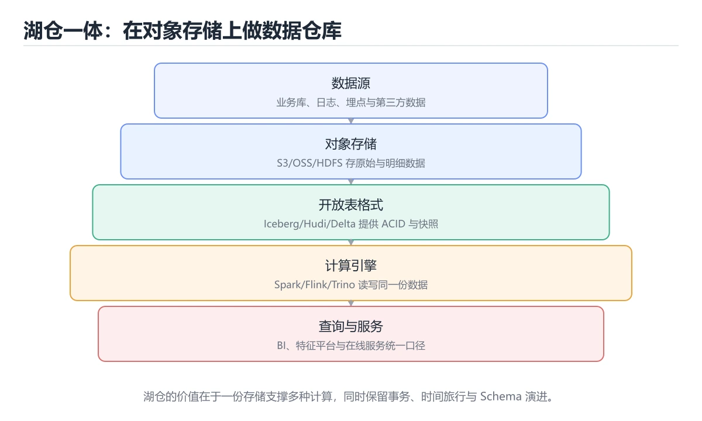

# 数据湖与湖仓一体




> 内容更新时间：2026-10-06 · 学习阶段：高级 · 预计用时：45 分钟

## 本节知识框架

**课程定位**：所属分类为「数据库」，课程主题为「数据湖与湖仓一体」，学习阶段为「高级」，建议用时 45 分钟。

**本课要解决的主问题**：表格式对比、架构数据流与小文件/快照治理。

| 学习层次 | 要回答的问题 | 完成判据 |
| --- | --- | --- |
| 概念层 | 「数据湖与湖仓一体」有哪些必须区分的对象与术语？ | 能用自己的话定义核心术语，并各举一个正例和一个反例。 |
| 机制层 | 这些对象按什么顺序发生作用，输入如何变成输出？ | 能画出或写出机制步骤，并说明每一步的失败条件。 |
| 应用层 | 什么场景适合使用「数据湖与湖仓一体」，什么场景不适合？ | 能给出一个真实场景、一个最小示例和一个边界案例。 |
| 性能层 | 时间、空间、吞吐或延迟受哪些量影响？ | 能说出复杂度或性能瓶颈的证据来源；没有证据时明确写“材料未提供”。 |
| 复习层 | 怎样确认自己不是只记住了结论？ | 能独立完成本课自测，并把错误定位到概念、机制、示例或边界。 |

### 阅读路线

1. 先读「核心概念定义」，建立「数据湖」等对象的精确定义。
2. 再读「原理与运行机制」，把定义串成可重复的过程。
3. 用「代码/协议/SQL 示例」验证过程，并只改一个条件观察结果变化。
4. 最后检查性能、易错点、知识关系与自测题，形成可复习的证据链。

**前置知识**：《大数据与批流处理》

**学习位置**：本课位于《数据库运维：备份、迁移与分库分表》之后；如果前一课的自测不能通过，应先回补再继续。

**后续衔接**：下一课《实时数仓：从 Kafka 到 Flink》会继续使用本课术语，学完后建议立即完成一次自测。

**教材衔接：学习目标**

- 能用自己的话解释数据湖与湖仓一体解决了什么问题，而不是只背术语。
- 能说清 「数据湖」、「Iceberg」、「Hudi」、「Delta」 之间的关系，并分别举出一个例子。
- 能把 数据湖 放回「数据湖与湖仓一体」的知识体系，说明它和 Iceberg 的边界。
- 能完成本课练习，并用验收标准检查自己的结果。

> 一句话摘要：表格式对比、架构数据流与小文件/快照治理。

**教材衔接：前置知识**

- 先完成上一课《大数据与批流处理》；如果已经掌握，可以直接用本课练习自测。
- 开始前先复习：数据湖、Iceberg、Hudi。
- 卡在 数据湖 上时不要跳过：把输入、预期和实际输出写成三行，再回头读正文。

**教材衔接：本课小结**

湖仓一体的价值是**用开放格式在廉价对象存储上获得数仓级的事务与治理**；落地成败往往取决于小文件治理、快照清理与元数据高可用这三件运维事。

## 核心概念定义

> 阅读约定：本课先给「数据湖与湖仓一体」相关术语的操作性定义与适用边界；正文里的口语化说法与定义冲突时，以定义和可复现示例为准。

| 术语 | 操作性定义 | 本课中的边界 |
| --- | --- | --- |
| 数据湖 | 保存原始与多格式数据、按需读取和加工的大规模存储。 | 仅在「数据湖与湖仓一体」明确给出的输入、版本与资源条件下成立。 |
| Iceberg | -- Iceberg：按天分区并做元数据维护。 | 仅在「数据湖与湖仓一体」明确给出的输入、版本与资源条件下成立。 |
| 湖仓 | 在同一存储和元数据体系上结合数据湖灵活性与数据仓库治理能力。 | 仅在「数据湖与湖仓一体」明确给出的输入、版本与资源条件下成立。 |
| 时间旅行 | 借助快照查询历史版本的数据，用于回溯口径变化和排查错误写入。 | 仅在「数据湖与湖仓一体」明确给出的输入、版本与资源条件下成立。 |

### 定义如何使用

在「数据湖与湖仓一体」中判断一个说法是否成立，先确认它使用的是哪个对象的定义，再检查输入规模、运行环境与失败路径。定义不是口号，而是后续推导、代码示例和自测题共享的约束。

## 原理与运行机制

### 机制总览

1. **建立输入**：把「数据湖」按本课定义整理成可观察、可重复的输入条件。
2. **执行转换**：围绕「Iceberg」执行本课的核心步骤；每一步都记录中间状态，避免只看最终输出。
3. **产生输出**：得到「湖仓」后，用正文示例或协议/SQL 结果核对输出是否符合预期。
4. **改变一个条件**：只替换一个边界条件或环境参数，观察「数据湖与湖仓一体」的结论是否仍然成立。

| 阶段 | 关注对象 | 失败时应检查 |
| --- | --- | --- |
| 输入 | 数据湖 | 类型、范围、编码、版本或前置状态是否满足定义。 |
| 处理 | Iceberg | 顺序、可见性、锁、路由、事务或调度规则是否被破坏。 |
| 输出 | 湖仓 | 结果是否可复现，错误是否被正确传播而不是被吞掉。 |

本课的机制结论要用「数据湖与湖仓一体」自己的示例验证。「数据湖与湖仓一体」没有给出某个数量级、吞吐或内存数据时，本课把该判断标为“材料未提供”，不从相邻主题外推。

**教材衔接：数据仓库、数据湖与湖仓**

| 形态 | 存储 | 数据特点 | 典型问题 |
| --- | --- | --- | --- |
| 数据仓库 | 专有格式 + 高性能引擎 | 结构化、治理好 | 贵、半结构化支持弱 |
| 数据湖 | 对象存储 + 文件 | 结构化/半结构化/非结构化都能放 | 易变"数据沼泽"（无元数据、无质量） |
| 湖仓一体 | 对象存储 + 开放表格式 | 兼具灵活与事务能力 | 对元数据与 compaction 有运维要求 |

湖仓的核心是**在对象存储上加一层表格式**，把"文件集合"变成有事务、有 schema、有版本的表。

**教材衔接：开放表格式对比**

| 格式 | 特点 | 适合 |
| --- | --- | --- |
| Iceberg | 隐藏分区、快照隔离、增量读，生态最广 | 通用湖仓，多引擎共享 |
| Hudi | 强调 upsert 与增量处理，支持 MOR/COW | 近实时入湖 |
| Delta Lake | 与 Spark 生态结合紧密，事务日志清晰 | Databricks/Spark 体系 |

三者共同能力：ACID 事务、时间旅行（查历史快照）、schema 演进、分区演化。选型主要看现有计算引擎与团队熟悉度。

**教材衔接：典型架构与数据流**

对象存储（S3/OSS）+ 表格式（Iceberg）→ 计算引擎（Spark/Flink/Trino）→ 元数据服务（Hive Metastore/REST Catalog）→ 上层 BI 与特征平台。数据流通常是：CDC 采集业务库 → 入湖（ODS）→ 清洗（DWD）→ 汇总（DWS）→ 应用（ADS）。

**教材衔接：必做的运维与治理**

1. **小文件合并**：流式写入会产生大量小文件，需定期 compaction（否则元数据与查询都变慢）。
2. **快照过期**：时间旅行会保留历史快照，需按策略清理过期快照并回收孤儿文件。
3. **元数据服务高可用**：Catalog 挂了整条链路不可用，需部署多副本。
4. **数据质量**：入湖即校验（空值、枚举、行数波动），坏数据隔离到 dead-letter 表。
5. **权限与血缘**：按库/表/列授权，血缘可用于影响面分析与成本归集。

**教材衔接：湖仓落地要点**

| 要点 | 做法 |
| --- | --- |
| 文件大小 | 目标 128 到 512 MB，定期 compaction |
| 分区设计 | 按时间 + 高基数列组合，避免过度分区 |
| 元数据 | 定期 expire 快照与清单，控制元数据膨胀 |
| CDC 入湖 | 用 upsert / merge 策略，保证主键唯一 |
| 权限 | 表级与列级权限 + 存储层访问控制 |
| 质量 | 入湖前后做行数、主键、枚举值校验 |
| 血缘 | 记录上下游依赖，便于影响分析 |

## 典型应用场景

| 场景 | 典型输入或前提 | 期望产物 |
| --- | --- | --- |
| 学习验证 | 使用本课最小示例和 数据湖、Iceberg | 能复现正文结论，并解释每一步。 |
| 工程落地 | 把「数据湖与湖仓一体」放入真实模块或服务边界 | 输出可观测、失败可定位、参数可配置。 |
| 故障排查 | 只改一个版本、规模、输入或依赖条件 | 能区分概念错误、实现错误和环境差异。 |

判断「数据湖与湖仓一体」的场景是否成立，标准是能否写出输入、处理、输出和失败路径；材料中没有出现的数据在本课标注为“材料未提供”，不用推测替代证据。

**课程内置实验入口**：`system_database`，用于动手验证《数据湖与湖仓一体》的机制；实验结论不替代概念定义与复杂度分析。

## 代码/协议/SQL 示例

### 最小可验证示例

下面保留《数据湖与湖仓一体》原文中的最小示例。先预测《数据湖与湖仓一体》示例的输出，再按正文步骤运行或推演；示例依赖外部环境时，同时记录版本与输入。

```sql
-- Iceberg：按天分区并做元数据维护
CREATE TABLE lake.orders (
    order_id   BIGINT,
    user_id    BIGINT,
    amount     DECIMAL(12, 2),
    created_at TIMESTAMP
)
USING iceberg
PARTITIONED BY (days(created_at))
TBLPROPERTIES (
    'write.target-file-size-bytes' = '134217728'   -- 目标文件 128 MB
);

-- 小文件治理：合并数据文件与清单文件
CALL catalog.system.rewrite_data_files(table => 'lake.orders');
CALL catalog.system.rewrite_manifests(table => 'lake.orders');
CALL catalog.system.expire_snapshots(table => 'lake.orders', older_than => TIMESTAMP '2025-09-01 00:00:00');

-- 时间旅行：排查某天的数据状态
SELECT COUNT(*) FROM lake.orders VERSION AS OF '2025-09-01-snapshot';
```

**教材衔接：深入补充：数据湖与湖仓一体**

前面已经建立了基本概念。这一节换一个角度，把数据湖与湖仓一体放进真实工程里，
重点回答三件事：数据湖 为什么存在、内部如何运转、什么时候会失效。

### 一、核心模型

数据湖保存原始多样数据，数据仓库提供结构化分析；湖仓一体在低成本对象存储上叠加表格式、事务、Schema 演进和元数据，让分析与机器学习共用一份数据。

```text
原始数据入湖 → 表格式元数据 → 清洗与分层 → 事务提交与快照 → SQL/Spark/Flink 查询 → 特征与服务层 → 治理与血缘
```

### 二、关键机制拆解

1. 对象存储成本低、容量大，但通常只提供最终一致性或有限原子操作，需要表格式补齐事务。
2. 开放表格式通过元数据文件记录快照、Schema 和分区，支持时间旅行、回滚和并发写。
3. 数据分层通常分为原始层、清洗层、明细层、汇总层和应用层，避免所有逻辑堆在一层。
4. 小文件会拖慢查询和元数据操作，需要定期合并并控制文件大小。
5. Schema 演进要向后兼容，新增列相对安全，删除或改类型需要版本化处理。
6. 数据湖容易变成数据沼泽：没有所有权、质量、血缘和访问控制时，数据越多越难用。
7. 湖仓的批流统一依赖同一份表格式和元数据，而不是把所有引擎简单拼在一起。

### 三、对照表：抓住容易混淆的边界

| 维度 | 一侧 | 另一侧 |
| --- | --- | --- |
| 数据湖 | 存原始多样数据 | 灵活但缺少事务和治理 |
| 数据仓库 | 结构化、强 Schema | 分析稳定但扩展和多样数据受限 |
| 湖仓一体 | 对象存储加表格式和事务 | 兼顾成本、开放与治理 |
| 数据沼泽 | 数据多但不可信 | 缺所有权、质量和血缘 |

### 四、工作示例

订单数据先以 Parquet 写入原始层，经批处理清洗成明细表，再聚合为日销售汇总；表格式记录每次提交快照。出现数据错误时可回滚到前一快照，同时下游仍能按版本读取。

### 五、常见误区与失效边界

| 错误做法或假设 | 后果 | 正确做法 |
| --- | --- | --- |
| 直接把文件当表 | 没有事务、Schema 和快照 | 使用开放表格式管理元数据 |
| 小文件不治理 | 查询元数据开销爆炸 | 定期 compaction 并控制分区粒度 |
| 没有数据所有权 | 质量问题无人负责 | 为每张表指定负责人和质量规则 |
| 缺失血缘和权限 | 数据泄露与难以追责 | 统一元数据、血缘和访问控制 |

### 六、场景推演

报表口径出现差异。通过血缘追踪发现上游清洗层修改了字段含义但未升级版本。修复方案是恢复兼容 Schema、重跑受影响分区、对下游通知，并增加 Schema 变更评审和回归校验。

### 七、自测问答

**Q1：湖仓一体相比数据湖多了什么？**

事务、Schema、快照、元数据和治理能力。

**Q2：为什么对象存储需要表格式？**

它补齐原子提交、快照和并发控制等能力。

**Q3：小文件为什么影响性能？**

查询和元数据操作需要打开大量文件，I/O 和调度开销高。

**Q4：数据沼泽的根因是什么？**

缺少所有权、质量标准、血缘和访问控制。

### 八、小项目：把知识变成可检查的产出

用本地 Parquet 文件模拟湖仓：建立原始、明细、汇总三层，记录 Schema 版本和快照；执行一次增量更新、一次回滚和一次小文件合并，验证查询结果与血缘。

### 九、适用边界

湖仓不是把所有数据都放对象存储就结束了。它需要表格式、计算引擎、元数据、治理和运维协同，否则只是更贵的数据湖。

### 十、完成检查清单

- [ ] 能解释数据湖、仓库和湖仓的边界
- [ ] 能设计分层与表格式方案
- [ ] 能处理 Schema 演进和快照
- [ ] 能治理小文件与分区
- [ ] 能建立血缘、所有权和权限

### 十一、复习顺序

1. 合上教程复述 数据湖，确认能说出它解决的三个问题。
2. 再对照表逐行解释容易混淆的概念，每个概念补一个反例。
3. 跟着工作示例做一遍，改变一个条件并预测结果。
4. 用自测问答检查理解，错题回到对应小节重新阅读。
5. 最后完成 数据湖 的小项目，把结果、失败记录和复查清单整理成可提交产物。

> 复习不是重读一遍，而是离开原文重新产出：复述、改写、验证、复盘。

**教材衔接：深挖「数据湖」的边界与代价**

这一章只用「数据湖与湖仓一体」自己的正文、代码和测验题，把数据湖推到边界再看一遍：先确认它在什么条件下成立，再估计代价，最后给出可复现的证据。

### 一、数据湖 的关键句与适用条件

| 正文出处 | 原句 | 用之前先确认 |
| --- | --- | --- |
| 数据仓库、数据湖与湖仓 | 湖仓的核心是在对象存储上加一层表格式，把"文件集合"变成有事务、有 schema、有版本的表。 | 把 湖仓 换成边界值时，这一步是否仍然成立 |
| 典型架构与数据流 | 对象存储（S3/OSS）+ 表格式（Iceberg）→ 计算引擎（Spark/Flink/Trino）→ 元数据服务（Hive Metastore/REST Catalog）→ 上层 BI 与特征平台。 | 把 Iceberg 换成边界值时，这一步是否仍然成立 |
| 一、核心模型 | 数据湖保存原始多样数据，数据仓库提供结构化分析； | 把 数据湖 换成边界值时，这一步是否仍然成立 |
| 二、关键机制拆解 | 数据湖容易变成数据沼泽：没有所有权、质量、血缘和访问控制时，数据越多越难用。 | 把 数据湖 换成边界值时，这一步是否仍然成立 |
| 二、关键机制拆解 | 湖仓的批流统一依赖同一份表格式和元数据，而不是把所有引擎简单拼在一起。 | 把 湖仓 换成边界值时，这一步是否仍然成立 |

读这张表时不要只记结论：每一句都要问「把数据湖换成边界值还成立吗」。如果第二列的原句里已经写明前提，第三列就写成「前提不变」；如果原句省略了前提，第三列必须补出来。

### 二、把 order_id 推到边界

下面是本课第一段代码（sql），先原样运行一次作为基线：

```sql
-- Iceberg：按天分区并做元数据维护
CREATE TABLE lake.orders (
    order_id   BIGINT,
    user_id    BIGINT,
    amount     DECIMAL(12, 2),
    created_at TIMESTAMP
)
USING iceberg
PARTITIONED BY (days(created_at))
TBLPROPERTIES (
    'write.target-file-size-bytes' = '134217728'   -- 目标文件 128 MB
);
-- 小文件治理：合并数据文件与清单文件
CALL catalog.system.rewrite_data_files(table => 'lake.orders');
CALL catalog.system.rewrite_manifests(table => 'lake.orders');
CALL catalog.system.expire_snapshots(table => 'lake.orders', older_than => TIMESTAMP '2025-09-01 00:00:00');
-- 时间旅行：排查某天的数据状态
SELECT COUNT(*) FROM lake.orders VERSION AS OF '2025-09-01-snapshot';
```

| 变式 | 怎么改 | 先写下什么 | 观察点 |
| --- | --- | --- | --- |
| 边界输入 | 把 order_id 的输入换成空值或最大值 | 预测输出 | 是否报错、是否静默返回 |
| 只改一处 | 把 created_at 的一个参数改成另一档 | 预测差异来源 | 输出变化能否用本课结论解释 |
| 去掉一步 | 注释掉 order_id 之后的一行 | 预测哪一步先失败 | 错误位置是否与预期一致 |

三次实验都要保留「原例 → 改动 → 预测 → 结果 → 原因」五步记录；其中「原因」必须引用「数据湖与湖仓一体」正文里的结论，而不是只写「正常」或「报错」。

### 三、「数据湖」的代价怎么量

| 观察项 | 怎么测 | 结论怎么写 |
| --- | --- | --- |
| 时间 | 把 数据湖 的输入规模翻倍，记录耗时变化 | 写出增长是线性、对数还是常数，并给出实测数据 |
| 空间 | 记录 Iceberg 占用的内存或存储峰值 | 说明峰值出现在哪一步，以及能否提前释放 |
| 可读性 | 统计完成同一件事需要多少行代码或多少步操作 | 用具体行数代替「更简洁」这类主观描述 |
| 失败代价 | 触发一次失败，记录恢复所需步骤 | 写清失败后是否有残留状态、如何回滚 |

如果在「数据湖与湖仓一体」里量不出上表的任何一项，说明实验还停留在阅读层面：先把输入规模翻倍，再回来填表。

### 四、测验复盘

| 题号 | 正确答案 | 最容易选错的干扰项 | 复盘动作 |
| --- | --- | --- | --- |
| 1 | 在对象存储上提供事务 | 存储更便宜 | 把干扰项改写成一句反例，再说明它违反本课哪条前提 |
| 2 | 验证 Iceberg 时要固定版本并覆盖边界输入，结论才可复现 | 把 Iceberg 的单次运行结果当成所有版本和规模都成立 | 把干扰项改写成一句反例，再说明它违反本课哪条前提 |
| 3 | 这段代码把主要逻辑封装在函数或方法里，需要被调用才会执行。 | 这段代码会读取外部输入，结果依赖传入的数据。 | 把干扰项改写成一句反例，再说明它违反本课哪条前提 |
| 4 | 支持 ACID | 无需元数据 | 把干扰项改写成一句反例，再说明它违反本课哪条前提 |
| 5 | 定期执行 compaction 合并小文件，并控制写入批次大小 | 改用 CSV 格式（混淆了相邻概念，不能回答本题） | 把干扰项改写成一句反例，再说明它违反本课哪条前提 |
| 6 | 0 | （无干扰项） | 把干扰项改写成一句反例，再说明它违反本课哪条前提 |

复盘「数据湖与湖仓一体」时只写「我记住了」没有意义：每个错误选项都要能对应到本课的一条前提，写完后再回到第一节的关键句表核对一次。

### 五、离开本课前的自检

- [ ] 能用一句话说明 数据湖 解决什么问题、在什么条件下失效。
- [ ] 能指出 Iceberg 与相邻概念的分工，并各举一个反例。
- [ ] 能在不看解析的情况下重做本课测验，并解释数据湖与湖仓一体中每个错误选项。
- [ ] 能按第二节的表格完成至少两次 数据湖 实验，并留下命令与输出。
- [ ] 能写出「数据湖与湖仓一体」的三条结论，每条都配一个适用边界。

全部勾选后，再去做「数据湖与湖仓一体」的测验与练习；只要有一项答不上来，就回到对应小节补一次实验，而不是先背结论。
<!-- p1-deep-dive:end -->

## 时间/空间复杂度或性能分析

**复杂度证据**：「数据湖与湖仓一体」的现有材料没有给出渐近时间或空间复杂度的明确结论，本课只做定性检查，不补写未经验证的 $O$ 记号。

| 维度 | 本课关注点 | 判断依据 |
| --- | --- | --- |
| 时间/延迟 | 「数据湖与湖仓一体」的主要步骤是否会随输入规模、并发度或网络往返增长。 | 以正文复杂度、基准数据或可重复测量为准。 |
| 空间/内存 | 中间状态、缓存、副本、连接或索引是否随规模增长。 | 记录峰值内存与数据副本，不只看最终结果。 |
| 吞吐/资源 | 版本、调度、锁、IO、序列化或协议开销是否成为瓶颈。 | 固定环境做对照实验，改变一个变量。 |

评估「数据湖与湖仓一体」时要区分“正确性成立”和“性能达标”两件事；材料没有给出基准时，本课只保留量级来源与测量方法，不写不可验证的绝对数字。

## 常见误区与易错点

> 复核《数据湖与湖仓一体》的易错点时，优先保留原文的错误表、故障现场与排错路径；每条修正都要能用本课示例复验。

| 易错点 | 常见表现 | 正确做法 |
| --- | --- | --- |
| 只背结论 | 能复述「数据湖与湖仓一体」的定义，却说不清输入、输出与边界。 | 回到机制步骤，用最小示例逐一验证。 |
| 混淆相邻概念 | 把本课对象与相邻主题的对象当成同一类。 | 先比较定义、资源归属、生命周期和失败模式。 |
| 忽略版本与环境 | 在开发机通过后直接外推到生产环境。 | 固定版本、输入和资源条件，再记录可复现结果。 |

**教材衔接：常见错误与排查**

| 容易踩的做法 | 实际现象 | 原因与正确做法 |
| --- | --- | --- |
| 把湖仓当纯湖使用 | 小文件与元数据爆炸 | 开启 compaction 与元数据清理 |
| 分区字段基数过高 | 目录与元数据膨胀 | 用时间分区 + 桶或排序键 |
| 不清理快照 | 存储成本持续上升 | 配置快照过期策略 |
| 直接覆盖写全表 | 成本高且不可回溯 | 用增量 merge 或分区覆盖 |
| 忽略 schema 演进策略 | 下游读取失败 | 用向后兼容的加列方式 |
| 无主键约束的 upsert | 出现重复数据 | 明确主键并做去重校验 |
| 权限只在表层 | 敏感列泄漏 | 加列级权限与脱敏视图 |
| 不记录血缘 | 影响分析困难 | 采集血缘并在变更前评估 |
| 只测小数据量 | 上线后性能不达标 | 用接近生产的数据量验证 |
| 缺少数据质量门禁 | 脏数据进入下游 | 入湖与出湖都设校验规则 |

**教材衔接：故障现场**

### 现场 1：把湖仓当纯湖使用

**症状**：在《数据湖与湖仓一体》的复现场景中，小文件与元数据爆炸。

**根因**：触发点是把“把湖仓当纯湖使用”当成安全做法。它没有满足《数据湖与湖仓一体》要求的前提，因此先表现为“小文件与元数据爆炸”；排查时先完整复现这一段，再核对输入、配置与依赖。

**修复**：针对《数据湖与湖仓一体》的问题，开启 compaction 与元数据清理。

**验证**：保留《数据湖与湖仓一体》里触发“小文件与元数据爆炸”的输入、版本和日志，按“开启 compaction 与元数据清理”完成修改后原样重放；只有失败现象消失且相邻场景仍可解释，才保留改动。

### 现场 2：分区字段基数过高

**症状**：在《数据湖与湖仓一体》的复现场景中，目录与元数据膨胀。

**根因**：触发点是把“分区字段基数过高”当成安全做法。它没有满足《数据湖与湖仓一体》要求的前提，因此先表现为“目录与元数据膨胀”；排查时先完整复现这一段，再核对输入、配置与依赖。

**修复**：针对《数据湖与湖仓一体》的问题，用时间分区 + 桶或排序键。

**验证**：在《数据湖与湖仓一体》中按“用时间分区 + 桶或排序键”调整后，从“分区字段基数过高”的触发条件重放同一条路径，确认“目录与元数据膨胀”不再出现，并补一个相邻边界用例检查没有引入新问题。

### 现场 3：直接覆盖写全表

**症状**：在《数据湖与湖仓一体》的复现场景中，成本高且不可回溯。

**根因**：“成本高且不可回溯”只是表层结果。向上追溯会落到“直接覆盖写全表”这一步，因为它省略了《数据湖与湖仓一体》的约束，使实现行为和预期模型发生了偏离。

**修复**：针对《数据湖与湖仓一体》的问题，用增量 merge 或分区覆盖。

**验证**：先在《数据湖与湖仓一体》中记录“直接覆盖写全表”留下的失败证据，再执行“用增量 merge 或分区覆盖”并重放；确认错误路径变为明确结果，且修复没有掩盖同类故障。

## 与其他知识点的关系

| 关系 | 课程 | 为什么 |
| --- | --- | --- |
| 先修 | 《大数据与批流处理》 | 本课会直接使用它的概念或操作前提。 |
| 关联 | 《Airflow 调度与数据质量》 | 用于横向比较或把本课结论迁移到相邻主题。 |
| 前置顺序 | 《数据库运维：备份、迁移与分库分表》 | 同分类中安排在本课之前，建议先完成其自测。 |
| 后续顺序 | 《实时数仓：从 Kafka 到 Flink》 | 同分类中安排在本课之后，会继续使用本课术语。 |

把「数据湖与湖仓一体」放回知识体系时，不只要记住“前面学过什么”，还要说明两个主题在输入、机制、资源边界和失败模式上的差异。这样才能把单课知识迁移到项目、排障和后续课程。

**教材衔接：三种架构对照**

| 维度 | 数据仓库 | 数据湖 | 湖仓一体 |
| --- | --- | --- | --- |
| 数据 | 结构化、schema-on-write | 任意格式、schema-on-read | 开放格式 + 表格式 |
| 事务 | 强 | 弱 | 支持 ACID |
| schema 演进 | 成本高 | 灵活但易失控 | 受控演进 |
| 分析性能 | 好 | 取决于引擎 | 好（含索引与统计） |
| 典型 | Snowflake、Redshift | S3 + Hive | Iceberg、Hudi、Delta Lake |

**教材衔接：表格式对照**

| 能力 | Iceberg | Hudi | Delta Lake |
| --- | --- | --- | --- |
| 快照与时间旅行 | 支持 | 支持 | 支持 |
| 增量读取 | 支持 | 强（增量拉取） | 支持 |
| 行级更新 | 支持（merge-on-read） | 强（copy-on-write / merge-on-read） | 支持 |
| 引擎中立 | 强 | 中 | 偏 Spark 生态 |
| 适合场景 | 通用湖仓、引擎多样 | 近实时入湖与 CDC | Databricks / Spark 生态 |

共识：三者都提供 ACID、schema 演进、时间旅行与元数据管理，差异在写入模式与生态侧重。

```sql
-- Iceberg：按天分区并做元数据维护
CREATE TABLE lake.orders (
    order_id   BIGINT,
    user_id    BIGINT,
    amount     DECIMAL(12, 2),
    created_at TIMESTAMP
)
USING iceberg
PARTITIONED BY (days(created_at))
TBLPROPERTIES (
    'write.target-file-size-bytes' = '134217728'   -- 目标文件 128 MB
);

-- 小文件治理：合并数据文件与清单文件
CALL catalog.system.rewrite_data_files(table => 'lake.orders');
CALL catalog.system.rewrite_manifests(table => 'lake.orders');
CALL catalog.system.expire_snapshots(table => 'lake.orders', older_than => TIMESTAMP '2025-09-01 00:00:00');

-- 时间旅行：排查某天的数据状态
SELECT COUNT(*) FROM lake.orders VERSION AS OF '2025-09-01-snapshot';
```

## 自测题与参考答案

> 先独立作答《数据湖与湖仓一体》的自测题，再对照答案与解析；每处判断都要能在本课正文或示例中找到依据。

### 自测 1

湖仓一体相比传统数据湖的关键增强是？

A. 不需要元数据
B. 只能存结构化数据
C. 存储更便宜
D. 在对象存储上提供事务

**参考答案**：在对象存储上提供事务

**解析**：开放表格式把文件集合变成有 ACID 与时间旅行的表。在「数据湖与湖仓一体」里，其他选项：湖仓一体的关键增强是在对象存储上提供事务。回到「数据湖与湖仓一体」的正文示例，用“湖仓一体相比传统数据湖的关键增强是”走一遍数据湖、Iceberg、Hudi的完整流程，能复现的结论才可以保留。

### 自测 2

围绕“数据湖与湖仓一体”中的 数据湖、Iceberg、Hudi，下列哪两项是本课强调的实践判断？

A. 验证 Iceberg 时要固定版本并覆盖边界输入，结论才可复现
B. 把 Iceberg 的单次运行结果当成所有版本和规模都成立
C. 学习 数据湖 时要同时说明输入、输出和失败路径，不能只看正常流程
D. 只要 数据湖 的常规示例通过，就可以跳过边界与异常路径

**参考答案**：验证 Iceberg 时要固定版本并覆盖边界输入，结论才可复现；学习 数据湖 时要同时说明输入、输出和失败路径，不能只看正常流程

**解析**：本课把数据湖与湖仓一体拆成概念、示例与故障现场三部分，因此判断 数据湖 时必须同时交代输入、输出和失败路径，这使“学习 数据湖 时要同时说明输入、输出和失败路径，不能只看正常流程”成立。在数据湖与湖仓一体里，判断 Iceberg 时要固定版本与边界输入，所以“验证 Iceberg 时要固定版本并覆盖边界输入，结论才可复现”才可复现。

### 自测 3

这段 SQL 代码是「数据湖与湖仓一体」的示例片段，下面哪一项描述与它一致？

```sql
-- Iceberg：按天分区并做元数据维护
CREATE TABLE lake.orders (
    order_id   BIGINT,
    user_id    BIGINT,
    amount     DECIMAL(12, 2),
    created_at TIMESTAMP
)
USING iceberg
PARTITIONED BY (days(created_at))
TBLPROPERTIES (
    'write.target-file-size-bytes' = '134217728'   -- 目标文件 128 MB
);

-- 小文件治理：合并数据文件与清单文件
CALL catalog.system.rewrite_data_files(table => 'lake.orders');
CALL catalog.system.rewrite_manifests(table => 'lake.orders');
CALL catalog.system.expire_snapshots(table => 'lake.orders', older_than => TIMESTAMP '2025-09-01 00:00:00');

-- 时间旅行：排查某天的数据状态
SELECT COUNT(*) FROM lake.orders VERSION AS OF '2025-09-01-snapshot';
```

A. 这段代码会读取外部输入，结果依赖传入的数据。
B. 这段代码会产生可观察的输出，运行后能看到结果。
C. 这段代码把主要逻辑封装在函数或方法里，需要被调用才会执行。
D. 这段代码包含异常处理分支，失败时会走专门的补救路径。

**参考答案**：这段代码把主要逻辑封装在函数或方法里，需要被调用才会执行。

**解析**：在「数据湖与湖仓一体」里，题干的正确项是这段代码把主要逻辑封装在函数或方法里，需要被调用才会执行，在「数据湖与湖仓一体」里封装边界决定数据湖从哪一步开始生效。把输入或边界换成空值、极值或失败情况后，结论要以「数据湖与湖仓一体」的实际运行结果为准。“代码是数据湖与湖仓一体的示例片段”与「数据湖与湖仓一体」的术语表相呼应，只有符合数据湖、Iceberg、Hudi约束的“这段代码把主要逻辑封装在函数或方法里”才是正文支持的结论。

**教材衔接：复习与自测**

- [ ] 能说清数据仓库、数据湖与湖仓一体的区别。
- [ ] 知道 Iceberg、Hudi、Delta Lake 的共性与侧重。
- [ ] 会配置 compaction 与快照过期策略。
- [ ] 分区设计避免高基数。
- [ ] 有表级与列级权限和数据质量门禁。

**教材衔接：动手练习**

> 本课练习重点：围绕「数据湖、Iceberg、Hudi」完成复述、实验和交付，每个结果都要能被别人检查。

为 rewrite_data_files 准备正常、空值与边界数据，并用执行计划验证索引是否生效。

### 练习 1：建立心智模型（10 分钟）

合上教程，用 3～5 句话回答：

1. 数据湖与湖仓一体解决了什么问题？
2. 如果没有它，会出现什么具体后果？
3. 它和「Iceberg」是什么关系？

验收标准：用自己的话解释 数据湖，并给出一个它不成立的反例。

### 练习 2：做一次可控实验（20 分钟）

从正文中选一个最小示例，完成以下操作：

1. 先预测修改一个参数、输入或步骤后的结果。
2. 再实际执行或逐步推演，记录真实结果。
3. 如果结果与预测不同，写出差异原因。

**验收标准**：把 rewrite_data_files 当作原例，改动一次Iceberg的取值，记录命令、输出与差异原因；五步里缺任意一步都算未完成。

### 练习 3：交付一个小结果（30 分钟）

先用最小表结构验证 rewrite_data_files，确认结果正确后再迁移到主库。

任务要求：

- 结果必须能被别人检查，不能只写“我已经理解了”。
- 至少覆盖「数据湖」和「Iceberg」两个关键词。
- 写出 1 个仍然不确定的问题，以及下一步如何验证。

> 提示：时间有限时优先做练习 1 和练习 2；练习 3 可以拆成两次完成。

**教材衔接：可运行练习**

### 任务 1：先跑通，再解释

```sql
-- Iceberg：按天分区并做元数据维护
CREATE TABLE lake.orders (
    order_id   BIGINT,
    user_id    BIGINT,
    amount     DECIMAL(12, 2),
    created_at TIMESTAMP
)
USING iceberg
PARTITIONED BY (days(created_at))
TBLPROPERTIES (
    'write.target-file-size-bytes' = '134217728'   -- 目标文件 128 MB
);

-- 小文件治理：合并数据文件与清单文件
CALL catalog.system.rewrite_data_files(table => 'lake.orders');
CALL catalog.system.rewrite_manifests(table => 'lake.orders');
CALL catalog.system.expire_snapshots(table => 'lake.orders', older_than => TIMESTAMP '2025-09-01 00:00:00');

-- 时间旅行：排查某天的数据状态
SELECT COUNT(*) FROM lake.orders VERSION AS OF '2025-09-01-snapshot';
```

### 任务 2：只改一个条件

把「数据湖与湖仓一体」的最小示例复制一份，只改一个条件再跑一次：

- 改动点：把 Iceberg 换成边界值，其他输入保持原样。
- 预测：先写下「数据湖与湖仓一体」在改动后的输出或错误信息，再运行。
- 记录：对照改动前后的结果，指出差异出在哪一步。
- 验收：换回原条件能复现原结果，改动只影响数据湖。

### 任务 3：迁移到自己的数据

把 rewrite_data_files 换成你自己的输入，先保持步骤不变，再比较输出差异。

**教材衔接：本课复习清单**

离开本课前，逐项确认：

- [ ] 不看解析，能说出「湖仓一体相比传统数据湖的关键增强是？」的判断依据。
- [ ] 不看解析，能说出「Iceberg、Hudi、Delta Lake 的共同能力不包括？」的判断依据。
- [ ] 不看解析，能说出「流式写入湖表后必须定期做的一件事是？」的判断依据。
- [ ] 不看解析，能说出「Iceberg 等表格式相比 Hive 表的关键改进是？」的判断依据。
- [ ] 不看解析，能说出「湖仓中小文件问题如何缓解？」的判断依据。
- [ ] 用 数据湖 构造一个正常输入和一个边界输入，分别记录输出与判断依据。
- [ ] 把本课最容易混淆的两个概念写成一句话对照。

| 复盘项 | 记录 |
| --- | --- |
| 已经能独立解释的考点 |  |
| 仍然说不清的概念 |  |
| 下一步验证动作 |  |

---

## 术语速查

| 术语 | 一句话说明 |
| --- | --- |
| `数据湖` | 保存原始与多格式数据、按需读取和加工的大规模存储。 |
| `Iceberg` | -- Iceberg：按天分区并做元数据维护。 |
| `湖仓` | 在同一存储和元数据体系上结合数据湖灵活性与数据仓库治理能力。 |
| `时间旅行` | 借助快照查询历史版本的数据，用于回溯口径变化和排查错误写入。 |

## 考点精讲

### 考点 1：概念判断·数据湖

- **题目**：湖仓一体相比传统数据湖的关键增强是？
- **判断依据**：开放表格式把文件集合变成有 ACID 与时间旅行的表。在「数据湖与湖仓一体」里，其他选项：湖仓一体的关键增强是在对象存储上提供事务。回到「数据湖与湖仓一体」的正文示例，用“湖仓一体相比传统数据湖的关键增强是”走一遍数据湖、Iceberg、Hudi的完整流程，能复现的结论才可以保留。

### 考点 2：多选辨析·数据湖

- **题目**：围绕“数据湖与湖仓一体”中的 数据湖、Iceberg、Hudi，下列哪两项是本课强调的实践判断？
- **判断依据**：本课把数据湖与湖仓一体拆成概念、示例与故障现场三部分，因此判断 数据湖 时必须同时交代输入、输出和失败路径，这使“学习 数据湖 时要同时说明输入、输出和失败路径，不能只看正常流程”成立。在数据湖与湖仓一体里，判断 Iceberg 时要固定版本与边界输入，所以“验证 Iceberg 时要固定版本并覆盖边界输入，结论才可复现”才可复现。

### 考点 3：代码补全·数据湖

- **题目**：这段 SQL 代码是「数据湖与湖仓一体」的示例片段，下面哪一项描述与它一致？
- **判断依据**：在「数据湖与湖仓一体」里，题干的正确项是这段代码把主要逻辑封装在函数或方法里，需要被调用才会执行，在「数据湖与湖仓一体」里封装边界决定数据湖从哪一步开始生效。把输入或边界换成空值、极值或失败情况后，结论要以「数据湖与湖仓一体」的实际运行结果为准。“代码是数据湖与湖仓一体的示例片段”与「数据湖与湖仓一体」的术语表相呼应，只有符合数据湖、Iceberg、Hudi约束的“这段代码把主要逻辑封装在函数或方法里”才是正文支持的结论。

### 考点 4：概念判断·数据湖

- **题目**：Iceberg 等表格式相比 Hive 表的关键改进是？
- **判断依据**：表格式把「哪些文件构成一张表」变成可原子提交的元数据快照。作答时，先用数据湖建立输入与输出的基线，再把支持 ACID代入边界条件核对，结论才能复现。在「数据湖与湖仓一体」里，这道题要求区分概念与边界，「支持 ACID」只有在题干给出的前提下才成立，而「无需元数据」、「不再需要对象存储」缺少同一组条件。

### 考点 5：概念判断·数据湖

- **题目**：湖仓中小文件问题如何缓解？
- **判断依据**：在「数据湖与湖仓一体」里，定期执行 compaction 合并小文件，并控制写入批次大小。小文件会让元数据与读取开销暴涨，流式写入场景尤其需要 compaction。回到「数据湖与湖仓一体」的正文示例，用“湖仓中小文件问题如何缓解”走一遍数据湖、Iceberg、Hudi的完整流程，能复现的结论才可以保留。

### 考点 6：填空·数据湖

- **题目**：补全代码：「数据湖与湖仓一体」示例中，下面这行代码缺少哪个关键字或函数名？请填入 ____。 `CALL ____.system.rewrite_data_files(table => 'lake.orders');`
- **判断依据**：在「数据湖与湖仓一体」里判断这道题，要把数据湖、Iceberg、Hudi的条件、过程与失败路径逐项对齐，换成“补全代码”这个场景，只有满足前提的结论才成立。“数据湖与湖仓一体示例中”与「数据湖与湖仓一体」的术语表相呼应，只有符合数据湖、Iceberg、Hudi约束的“catalog”才是正文支持的结论。

## English Overview

**Title:** Data Lakehouse

**Summary:** Table formats, architecture and maintenance.

**Category:** Database
**Level:** 高级
**Key terms:** 数据湖, Iceberg, Hudi, Delta, 湖仓

## 内容元数据

- 内容版本：v2.0
- 最后更新：2026-10-06
- 学习阶段：高级
- 适用环境：PostgreSQL / MySQL / SQLite 等主流数据库；本课聚焦其中的 数据湖。
- 内容来源：内置结构化课程与工程实践整理
- 相关主题：数据湖、Iceberg、Hudi、Delta、湖仓
- 质量版本：P0 测验标准 + P1 覆盖扩展 + P2 体验补全

## 参考资料与复核

- 最后复核：2026-10-04
- 下次复核：2027-06-17
- 复核范围：版本兼容、API 行为、安全建议与工程实践
- 来源性质：官方文档、标准或权威教材；正文为离线教学重组

| 参考资料 | 本课用途 |
| --- | --- |
| [数据库规范化](https://learn.microsoft.com/office/troubleshoot/access/database-normalization-description) | 范式与表设计 |
| [Redis 文档](https://redis.io/docs/latest/) | 缓存、数据结构与持久化 |
| [SQL 标准概览](https://www.iso.org/standard/76583.html) | SQL 标准范围 |

> 「数据湖与湖仓一体」的链接用于离线阅读后的延伸核对；App 不会自动联网。

<!-- p1-deep-dive:start -->
