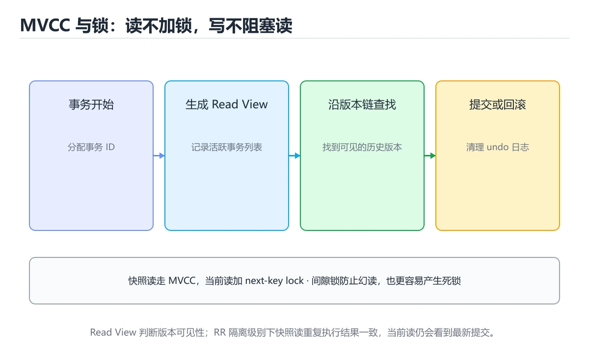
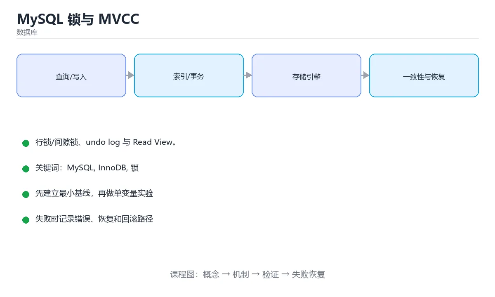

# MySQL 锁与 MVCC





> 内容更新时间：2026-10-06 · 学习阶段：高级 · 预计用时：45 分钟

## 本节知识框架

**课程定位**：所属分类为「数据库」，课程主题为「MySQL 锁与 MVCC」，学习阶段为「高级」，建议用时 45 分钟。

**本课要解决的主问题**：行锁/间隙锁、undo log 与 Read View。

| 学习层次 | 要回答的问题 | 完成判据 |
| --- | --- | --- |
| 概念层 | 「MySQL 锁与 MVCC」有哪些必须区分的对象与术语？ | 能用自己的话定义核心术语，并各举一个正例和一个反例。 |
| 机制层 | 这些对象按什么顺序发生作用，输入如何变成输出？ | 能画出或写出机制步骤，并说明每一步的失败条件。 |
| 应用层 | 什么场景适合使用「MySQL 锁与 MVCC」，什么场景不适合？ | 能给出一个真实场景、一个最小示例和一个边界案例。 |
| 性能层 | 时间、空间、吞吐或延迟受哪些量影响？ | 能说出复杂度或性能瓶颈的证据来源；没有证据时明确写“材料未提供”。 |
| 复习层 | 怎样确认自己不是只记住了结论？ | 能独立完成本课自测，并把错误定位到概念、机制、示例或边界。 |

### 阅读路线

1. 先读「核心概念定义」，建立「MySQL」等对象的精确定义。
2. 再读「原理与运行机制」，把定义串成可重复的过程。
3. 用「代码/协议/SQL 示例」验证过程，并只改一个条件观察结果变化。
4. 最后检查性能、易错点、知识关系与自测题，形成可复习的证据链。

**前置知识**：《Redis 实战》

**学习位置**：本课位于《PostgreSQL 深入实践》之后；如果前一课的自测不能通过，应先回补再继续。

**后续衔接**：下一课《数据库运维：备份、迁移与分库分表》会继续使用本课术语，学完后建议立即完成一次自测。

**教材衔接：学习目标**

- 能用自己的话解释MySQL 锁与 MVCC解决了什么问题，而不是只背术语。
- 能说清 「MySQL」、「InnoDB」、「锁」、「MVCC」 之间的关系，并分别举出一个例子。
- 能把 MySQL 放回「MySQL 锁与 MVCC」的知识体系，说明它和 InnoDB 的边界。
- 能完成本课练习，并用验收标准检查自己的结果。

> 一句话摘要：行锁/间隙锁、undo log 与 Read View。

**教材衔接：前置知识**

- 先完成上一课《Redis 实战》；如果已经掌握，可以直接用本课练习自测。
- 开始前先复习：MySQL、InnoDB、锁。
- 如果 为什么需要锁与多版本 这一步看不懂，先记录具体卡点，再用 INNODB_TRX 复现一遍。

**教材衔接：本课小结**

InnoDB 的并发控制 = **MVCC 提供无锁读 + 锁机制保证写一致性**。记住「行锁加在索引上」与「RC/RR 的 Read View 差异」，多数锁问题都能解释。

## 核心概念定义

> 阅读约定：本课先给「MySQL 锁与 MVCC」相关术语的操作性定义与适用边界；正文里的口语化说法与定义冲突时，以定义和可复现示例为准。

| 术语 | 操作性定义 | 本课中的边界 |
| --- | --- | --- |
| SHOW ENGINE INNODB STATUS | 查看当前事务与锁等待：SHOW ENGINE INNODB STATUS、performance_schema.data_locks / data_waits。 | 仅在「MySQL 锁与 MVCC」明确给出的输入、版本与资源条件下成立。 |
| age | 以 InnoDB 可重复读为例，表 t(id PK, name, age)，age 上无索引： | 仅在「MySQL 锁与 MVCC」明确给出的输入、版本与资源条件下成立。 |
| InnoDB | MySQL 的默认事务存储引擎，支持行锁、MVCC、崩溃恢复和外键。 | 仅在「MySQL 锁与 MVCC」明确给出的输入、版本与资源条件下成立。 |
| 锁 | 限制同一时刻访问共享资源的同步原语，使用时要明确粒度、顺序和释放路径。 | 仅在「MySQL 锁与 MVCC」明确给出的输入、版本与资源条件下成立。 |

### 定义如何使用

在「MySQL 锁与 MVCC」中判断一个说法是否成立，先确认它使用的是哪个对象的定义，再检查输入规模、运行环境与失败路径。定义不是口号，而是后续推导、代码示例和自测题共享的约束。

**教材衔接：InnoDB 的锁类型**

| 锁 | 说明 |
| --- | --- |
| 共享锁 S | 读锁，多个事务可同时持有 |
| 排他锁 X | 写锁，与其他锁互斥 |
| 意向锁 IS/IX | 表级标记，表示行上将加锁 |
| 记录锁 Record Lock | 锁住索引记录本身 |
| 间隙锁 Gap Lock | 锁住索引记录之间的区间，防幻读 |
| 临键锁 Next-Key | 记录锁 + 间隙锁，RR 隔离级别的默认行为 |

关键点：**InnoDB 的行锁是加在索引上的**。如果查询条件没有走到索引，就会退化为锁大量记录甚至全表，这是线上锁等待的常见原因。

**教材衔接：锁类型速查**

| 锁 | 粒度 | 作用 | 典型触发 |
| --- | --- | --- | --- |
| 记录锁（Record Lock） | 单行索引记录 | 锁住某一行 | `WHERE id = 1 FOR UPDATE` |
| 间隙锁（Gap Lock） | 索引区间 | 阻止区间内插入 | RR 下的范围查询 |
| 临键锁（Next-Key Lock） | 记录 + 前面的间隙 | 记录锁与间隙锁组合 | RR 下的范围条件 |
| 插入意向锁 | 间隙内 | 插入前声明意图 | `INSERT` 与间隙锁冲突时 |
| 意向共享锁 / 意向排他锁 | 表级 | 表锁与行锁共存的标记 | 加行锁前自动加 |
| 表锁 | 整表 | 锁住全表 | `LOCK TABLES`、无索引更新 |
| 元数据锁（MDL） | 表结构 | 保护表结构 | DDL 与长事务互相阻塞 |

## 原理与运行机制

### 机制总览

1. **建立输入**：把「SHOW ENGINE INNODB STATUS」按本课定义整理成可观察、可重复的输入条件。
2. **执行转换**：围绕「age」执行本课的核心步骤；每一步都记录中间状态，避免只看最终输出。
3. **产生输出**：得到「InnoDB」后，用正文示例或协议/SQL 结果核对输出是否符合预期。
4. **改变一个条件**：只替换一个边界条件或环境参数，观察「MySQL 锁与 MVCC」的结论是否仍然成立。

| 阶段 | 关注对象 | 失败时应检查 |
| --- | --- | --- |
| 输入 | SHOW ENGINE INNODB STATUS | 类型、范围、编码、版本或前置状态是否满足定义。 |
| 处理 | age | 顺序、可见性、锁、路由、事务或调度规则是否被破坏。 |
| 输出 | InnoDB | 结果是否可复现，错误是否被正确传播而不是被吞掉。 |

本课的机制结论要用「MySQL 锁与 MVCC」自己的示例验证。「MySQL 锁与 MVCC」没有给出某个数量级、吞吐或内存数据时，本课把该判断标为“材料未提供”，不从相邻主题外推。

**教材衔接：为什么需要锁与多版本**

并发事务同时读写同一批数据会互相干扰。InnoDB 用**锁**保证写写互斥，用 **MVCC（多版本并发控制）**让读写尽量不互相阻塞——读不加锁，写不阻塞读。

**教材衔接：MVCC 的实现**

每行记录隐含两个字段：创建版本号（trx_id）与删除版本号；undo log 保存历史版本，通过回滚指针串成版本链。

| 概念 | 作用 |
| --- | --- |
| 隐藏列 trx_id | 记录最后修改该行的事务 ID |
| undo log | 保存旧版本数据，支持回滚与快照读 |
| Read View | 判断当前事务能看到哪个版本 |

读已提交（RC）每次查询都生成新的 Read View；可重复读（RR）在事务第一次查询时生成并沿用，因此同一事务内多次读结果一致。

**教材衔接：快照读与当前读**

| 类型 | 说明 |
| --- | --- |
| 快照读 | 普通 SELECT，走 MVCC 读历史版本，不加锁 |
| 当前读 | SELECT ... FOR UPDATE / LOCK IN SHARE MODE / UPDATE / DELETE，读最新版本并加锁 |

RR 下快照读避免了不可重复读，但**当前读仍可能看到其他事务已提交的新数据**，这也是「幻读」讨论的焦点：InnoDB 用间隙锁在当前读场景下阻止区间插入。

**教材衔接：排查锁问题**

1. 查看当前事务与锁等待：`SHOW ENGINE INNODB STATUS`、performance_schema.data_locks / data_waits。
2. 定位长事务：查询 information_schema.innodb_trx，关注 trx_started 与 trx_rows_locked。
3. 死锁：InnoDB 检测到后回滚代价小的事务，日志中会打印 LATEST DETECTED DEADLOCK 段落。

**教材衔接：最佳实践**

1. 事务尽量短，避免在事务里做网络调用。
2. 更新语句必须走索引，否则容易全表加锁。
3. 多表访问保持一致的加锁顺序，降低死锁概率。
4. 明确隔离级别，理解 RC 与 RR 的差异再选型。
5. 高并发计数用原子更新（`SET n = n + 1`）而不是先查后写。

**教材衔接：加锁分析实例**

以 InnoDB 可重复读为例，表 `t(id PK, name, age)`，`age` 上无索引：

| SQL | 加锁情况 | 说明 |
| --- | --- | --- |
| `SELECT * FROM t WHERE id = 5` | 记录锁（仅 id=5 行） | 走主键，锁范围最小 |
| `UPDATE t SET name='x' WHERE id = 5` | 记录锁 | 同上，未命中则可能加间隙锁 |
| `UPDATE t SET name='x' WHERE age = 20` | **全表扫描 + 大量临键锁** | age 无索引，几乎锁全表——线上事故高发点 |
| `UPDATE t SET name='x' WHERE id > 5 AND id < 10` | 间隙/临键锁 | 范围更新会锁住区间，防幻读 |
| `SELECT * FROM t WHERE id = 5 FOR UPDATE` | 记录锁 | 当前读，读最新并加锁 |

结论：**行锁加在索引上**。要让更新只锁目标行，就必须让 WHERE 走索引；批量更新要分批提交，避免一次锁太多行引发大面积等待。

**教材衔接：死锁排查步骤**

1. `SHOW ENGINE INNODB STATUS` 查看 `LATEST DETECTED DEADLOCK` 段落，能直接看到两个事务的 SQL、持有的锁与等待的锁。
2. 用 `information_schema.innodb_trx` 找长事务（trx_started 早、trx_rows_locked 多）。
3. 定位代码中的加锁顺序不一致（常见于批量更新、跨表更新）。
4. 修复手段：统一加锁顺序、缩小事务范围、给查询补索引、必要时用 `SELECT ... FOR UPDATE` 明确锁定顺序。

**教材衔接：快照读与当前读速查**

| 类型 | 语句 | 读到的版本 | 是否加锁 |
| --- | --- | --- | --- |
| 快照读 | 普通 `SELECT` | 事务开始时的快照 | 不加锁 |
| 当前读 | `SELECT ... FOR UPDATE` | 最新已提交版本 | 加排他锁 |
| 当前读 | `SELECT ... FOR SHARE` | 最新已提交版本 | 加共享锁 |
| 当前读 | `UPDATE` / `DELETE` | 最新版本 | 加排他锁 |

MVCC 依赖的三个隐藏要素：事务 ID（`trx_id`）、回滚指针（`roll_pointer`）、undo log
中的历史版本链。

## 典型应用场景

| 场景 | 典型输入或前提 | 期望产物 |
| --- | --- | --- |
| 学习验证 | 使用本课最小示例和 MySQL、InnoDB | 能复现正文结论，并解释每一步。 |
| 工程落地 | 把「MySQL 锁与 MVCC」放入真实模块或服务边界 | 输出可观测、失败可定位、参数可配置。 |
| 故障排查 | 只改一个版本、规模、输入或依赖条件 | 能区分概念错误、实现错误和环境差异。 |

判断「MySQL 锁与 MVCC」的场景是否成立，标准是能否写出输入、处理、输出和失败路径；材料中没有出现的数据在本课标注为“材料未提供”，不用推测替代证据。

**课程内置实验入口**：`system_database`，用于动手验证《MySQL 锁与 MVCC》的机制；实验结论不替代概念定义与复杂度分析。

## 代码/协议/SQL 示例

### 最小可验证示例

下面保留《MySQL 锁与 MVCC》原文中的最小示例。先预测《MySQL 锁与 MVCC》示例的输出，再按正文步骤运行或推演；示例依赖外部环境时，同时记录版本与输入。

```sql
-- 当前正在运行的事务（重点看 trx_state、trx_started、trx_rows_locked）
SELECT * FROM information_schema.INNODB_TRX ORDER BY trx_started;

-- InnoDB 状态：最近一次死锁、等待锁的事务与语句
SHOW ENGINE INNODB STATUS\G

-- 当前锁等待关系（MySQL 8）
SELECT * FROM performance_schema.data_lock_waits;

-- 查看事务隔离级别
SELECT @@transaction_isolation;
```

**教材衔接：排查速查**

```sql
-- 当前正在运行的事务（重点看 trx_state、trx_started、trx_rows_locked）
SELECT * FROM information_schema.INNODB_TRX ORDER BY trx_started;

-- InnoDB 状态：最近一次死锁、等待锁的事务与语句
SHOW ENGINE INNODB STATUS\G

-- 当前锁等待关系（MySQL 8）
SELECT * FROM performance_schema.data_lock_waits;

-- 查看事务隔离级别
SELECT @@transaction_isolation;
```

## 时间/空间复杂度或性能分析

**复杂度证据**：「MySQL 锁与 MVCC」的现有材料没有给出渐近时间或空间复杂度的明确结论，本课只做定性检查，不补写未经验证的 $O$ 记号。

| 维度 | 本课关注点 | 判断依据 |
| --- | --- | --- |
| 时间/延迟 | 「MySQL 锁与 MVCC」的主要步骤是否会随输入规模、并发度或网络往返增长。 | 以正文复杂度、基准数据或可重复测量为准。 |
| 空间/内存 | 中间状态、缓存、副本、连接或索引是否随规模增长。 | 记录峰值内存与数据副本，不只看最终结果。 |
| 吞吐/资源 | 版本、调度、锁、IO、序列化或协议开销是否成为瓶颈。 | 固定环境做对照实验，改变一个变量。 |

评估「MySQL 锁与 MVCC」时要区分“正确性成立”和“性能达标”两件事；材料没有给出基准时，本课只保留量级来源与测量方法，不写不可验证的绝对数字。

## 常见误区与易错点

> 复核《MySQL 锁与 MVCC》的易错点时，优先保留原文的错误表、故障现场与排错路径；每条修正都要能用本课示例复验。

| 易错点 | 常见表现 | 正确做法 |
| --- | --- | --- |
| 只背结论 | 能复述「MySQL 锁与 MVCC」的定义，却说不清输入、输出与边界。 | 回到机制步骤，用最小示例逐一验证。 |
| 混淆相邻概念 | 把本课对象与相邻主题的对象当成同一类。 | 先比较定义、资源归属、生命周期和失败模式。 |
| 忽略版本与环境 | 在开发机通过后直接外推到生产环境。 | 固定版本、输入和资源条件，再记录可复现结果。 |

**教材衔接：常见错误与排查**

| 容易写错的做法 | 实际现象 | 原因与正确做法 |
| --- | --- | --- |
| 更新条件没有索引 | 锁住大量行甚至全表 | 行锁加在索引上，没有可用索引会退化为扫描并锁住扫描到的记录 |
| 用 `SELECT ... FOR UPDATE` 后忘记提交 | 其他请求全部等待 | 尽早提交，缩短事务；检查连接池是否归还连接 |
| 在 RR 级别做范围查询加锁 | 出现间隙锁，插入被阻塞 | 明确是否需要加锁；必要时评估降到 RC |
| 以为 RC 与 RR 的加锁行为一致 | 并发表现与预期不同 | RC 每次读生成新快照、无间隙锁，需按业务选择 |
| 大批量 `UPDATE` 单条语句 | 锁范围大、主从延迟 | 分批处理（如按主键区间循环），控制每批行数 |
| 长事务与 DDL 并发 | DDL 被 MDL 阻塞，后续全部排队 | 先查长事务再执行 DDL，或用在线 DDL 工具 |
| 死锁后不做重试 | 请求直接失败 | 捕获死锁错误码（1213）做有限次重试 |
| 认为「快照读」能读到自己的未提交改动之外的数据 | 读到旧值，误判为 bug | 需要最新数据时显式使用当前读 |
| 依赖 `SELECT` 后再 `UPDATE` 保证一致性 | 并发下仍会丢失更新 | 使用条件更新或加锁 |
| 事务里访问顺序不一致 | 频繁死锁 | 统一访问顺序并缩小事务范围 |

**教材衔接：故障现场**

### 现场 1：更新条件没有索引

**症状**：在《MySQL 锁与 MVCC》的复现场景中，锁住大量行甚至全表。

**根因**：当出现“更新条件没有索引”时，执行路径已经绕过了《MySQL 锁与 MVCC》的关键约束，最终以“锁住大量行甚至全表”暴露出来；修复前必须先确认约束在哪里失效。

**修复**：针对《MySQL 锁与 MVCC》的问题，行锁加在索引上，没有可用索引会退化为扫描并锁住扫描到的记录。

**验证**：先在《MySQL 锁与 MVCC》中记录“更新条件没有索引”留下的失败证据，再执行“行锁加在索引上，没有可用索引会退化为扫描并锁住扫描到的记录”并重放；确认错误路径变为明确结果，且修复没有掩盖同类故障。

### 现场 2：用 SELECT ... FOR UPDATE 后忘记提交

**症状**：在《MySQL 锁与 MVCC》的复现场景中，其他请求全部等待。

**根因**：触发点是把“用 SELECT ... FOR UPDATE 后忘记提交”当成安全做法。它没有满足《MySQL 锁与 MVCC》要求的前提，因此先表现为“其他请求全部等待”；排查时先完整复现这一段，再核对输入、配置与依赖。

**修复**：针对《MySQL 锁与 MVCC》的问题，尽早提交，缩短事务；检查连接池是否归还连接。

**验证**：保留《MySQL 锁与 MVCC》里触发“其他请求全部等待”的输入、版本和日志，按“尽早提交，缩短事务；检查连接池是否归还连接”完成修改后原样重放；只有失败现象消失且相邻场景仍可解释，才保留改动。

### 现场 3：在 RR 级别做范围查询加锁

**症状**：在《MySQL 锁与 MVCC》的复现场景中，出现间隙锁，插入被阻塞。

**根因**：当出现“在 RR 级别做范围查询加锁”时，执行路径已经绕过了《MySQL 锁与 MVCC》的关键约束，最终以“出现间隙锁，插入被阻塞”暴露出来；修复前必须先确认约束在哪里失效。

**修复**：针对《MySQL 锁与 MVCC》的问题，明确是否需要加锁；必要时评估降到 RC。

**验证**：保留《MySQL 锁与 MVCC》里触发“出现间隙锁，插入被阻塞”的输入、版本和日志，按“明确是否需要加锁；必要时评估降到 RC”完成修改后原样重放；只有失败现象消失且相邻场景仍可解释，才保留改动。

**教材衔接：工程化精练：决策、失败与验证**

这一章把「MySQL 锁与 MVCC」从“看懂”推进到“能判断、能验证、能排错”。所有判断都围绕MySQL、InnoDB与锁展开，并与前文的示例、测验和失败现场互相对照。

### 一、MySQL 的判断算法

| 步骤 | 要回答的问题 | 判断依据 | 记录什么 |
| --- | --- | --- | --- |
| 1. 定目标 | 「MySQL 锁与 MVCC」这一步要解决什么问题？ | 把MySQL的目标写成一句可验证的结论 | 输入、约束、成功标准 |
| 2. 找边界 | InnoDB在什么条件下失效？ | 先列空值、极值、重复和失败路径 | 反例与触发条件 |
| 3. 跑基线 | 原始示例的真实输出是什么？ | 命令、版本和环境必须可复现 | 命令、输出、耗时 |
| 4. 只改一处 | 把锁换成另一种取值会怎样？ | 预测写在运行之前 | 预测与实际的差异 |
| 5. 回写结论 | 结论能否被他人复现？ | 把判断写成清单或测试 | 结论、证据、遗留问题 |

这张表的用法不是从上到下浏览，而是每次只填一行：先用「MySQL 锁与 MVCC」前文的示例验证第 3 行，再故意破坏一个条件验证第 2 行。当你能在不看解析的情况下说出MySQL的判断依据，才算真正掌握本课。

- 先从MySQL入手：把它写成“输入是什么、输出是什么、哪一步最容易出错”。如果这三句话中有一句说不清，说明对「MySQL 锁与 MVCC」的理解还停留在术语层面，需要回到正文的最小示例重新观察一次。

- 再把InnoDB当成对照实验的变量：固定其他条件，只改变它的取值，记录输出是否变化。结论“变”或“不变”都要写出理由，并说明这个理由能否被他人独立复现。

- 针对锁做一次失败演练：故意给出空值、极值或错误类型，观察「MySQL 锁与 MVCC」的报错位置和处理方式。错误信息只是入口，真正要定位的是哪一层假设被破坏。

- 把「MySQL 锁与 MVCC」的结论压缩成一条可执行清单：先检查输入，再检查版本与环境，然后跑最小用例，最后才扩大规模。顺序颠倒会让排错范围成倍增加。

- 如果结论依赖时间或规模，就把数据量提高一个数量级再跑一次。在「MySQL 锁与 MVCC」里，小样本成立不代表大样本成立，复杂度、资源占用和失败率都要重新记录。

- 如果结论依赖并发或共享状态，就固定输入并连续运行多次。结果不一致时，优先怀疑「MySQL 锁与 MVCC」中MySQL相关步骤的隐藏状态，而不是先改代码。

- 把「MySQL 锁与 MVCC」的判断写成测试：一个正常用例、一个边界用例、一个失败用例。测试通过只是起点，还要确认失败用例确实以预期方式失败。

- 把本课与相邻主题连起来：MySQL解决的是“怎么做”，InnoDB回答“什么时候不适用”。两者都答得出来，迁移才算完成。

> 第 2 轮复核「MySQL 锁与 MVCC」：把上面的结论逐条改写为可验证的问题，并记录仍不确定的部分。

- 先从MySQL入手：把它写成“输入是什么、输出是什么、哪一步最容易出错”。如果这三句话中有一句说不清，说明对「MySQL 锁与 MVCC」的理解还停留在术语层面，需要回到正文的最小示例重新观察一次。

- 再把InnoDB当成对照实验的变量：固定其他条件，只改变它的取值，记录输出是否变化。结论“变”或“不变”都要写出理由，并说明这个理由能否被他人独立复现。

### 二、MySQL 锁与 MVCC 的机制拆解与自测

把本课考点还原成可回答的问题，再逐题写出依据：

**问题 1**：InnoDB 的行锁加在什么之上？

- 关联术语：MySQL
- 判断依据：回到「MySQL 锁与 MVCC」正文对应小节，先用最小示例验证再下结论。
- 追问：如果把MySQL的条件换成边界值，这个结论是否仍然成立？

**问题 2**：围绕“MySQL 锁与 MVCC”中的 MySQL、InnoDB、锁，下列哪两项是本课强调的实践判断？

- 关联术语：InnoDB
- 判断依据：验证 InnoDB 时要固定版本并覆盖边界输入，结论才可复现
- 追问：如果把InnoDB的条件换成边界值，这个结论是否仍然成立？

**问题 3**：可重复读（RR）下 Read View 何时生成？

- 关联术语：锁
- 判断依据：事务第一次查询时
- 追问：如果把锁的条件换成边界值，这个结论是否仍然成立？

**问题 4**：这段 SQL 代码是「MySQL 锁与 MVCC」的示例片段，下面哪一项描述与它一致？

- 关联术语：MVCC
- 判断依据：回到「MySQL 锁与 MVCC」正文对应小节，先用最小示例验证再下结论。
- 追问：如果把MVCC的条件换成边界值，这个结论是否仍然成立？

**问题 5**：快照读与当前读的区别是？

- 关联术语：Read View
- 判断依据：快照读读 MVCC 历史版本（普通 SELECT），当前读读最新版本并加锁（FOR UPDATE / UPDATE）
- 追问：如果把Read View的条件换成边界值，这个结论是否仍然成立？

**问题 6**：补全代码：「MySQL 锁与 MVCC」示例中，下面这行代码缺少哪个关键字或函数名？请填入 ____。

`SELECT * FROM ____.INNODB_TRX ORDER BY trx_started;`

- 关联术语：死锁
- 判断依据：回到「MySQL 锁与 MVCC」正文对应小节，先用最小示例验证再下结论。
- 追问：如果把死锁的条件换成边界值，这个结论是否仍然成立？

### 三、失败模式与修复顺序

| 失败信号 | 常见根因 | 先做什么 | 修复后如何确认 |
| --- | --- | --- | --- |
| 「MySQL 锁与 MVCC」中 MySQL 相关步骤报错 | 输入、版本或前置条件与示例不一致 | 保留第一条错误信息，回到最小输入 | 用验证 InnoDB 时要固定版本并覆盖边界输入，结论才可复现复跑，确认输出可复现 |
| 「MySQL 锁与 MVCC」中 InnoDB 相关步骤报错 | 输入、版本或前置条件与示例不一致 | 保留第一条错误信息，回到最小输入 | 用事务第一次查询时复跑，确认输出可复现 |
| 「MySQL 锁与 MVCC」中 锁 相关步骤报错 | 输入、版本或前置条件与示例不一致 | 保留第一条错误信息，回到最小输入 | 用快照读读 MVCC 历史版本（普通 SELECT），当前读读最新版本并加锁（FOR UPDATE / UPDATE）复跑，确认输出可复现 |
- 检查点：固定版本与输入重跑《MySQL 锁与 MVCC》，记录两次差异并定位不稳定条件。
| 单次结果正确但规模一大就失效 | 只测了正常路径，没有覆盖边界 | 把数据量或并发度提高一个数量级 | 记录边界值、耗时与失败率 |

排错顺序固定为：先复现，再缩小输入，然后只改一个条件，最后把结论写成回归用例。对「MySQL 锁与 MVCC」来说，任何不能复现的“修好了”都不算完成。

### 四、离开本课前的验证清单

| 检查项 | 通过标准 | 证据 |
| --- | --- | --- |
| 能复述 | 用三句话说明「MySQL 锁与 MVCC」解决什么问题、边界在哪 | 不看解析写出的结论 |
| 能运行 | 最小示例在本机跑通 | 命令、输出与版本 |
| 能改条件 | 只改一个输入并解释差异 | 预测与实际的对照 |
| 能排错 | 至少制造并修复一个失败 | 错误信息与修复步骤 |
| 能迁移 | 把MySQL、InnoDB、锁、MVCC、Read View、死锁用到新场景 | 一个自选练习的结论 |

完成标准：能不看解析说清「MySQL 锁与 MVCC」全部自测题的依据，并且至少有一条MySQL相关的结论经过真实运行验证。如果某一步只停留在“感觉懂了”，就把它写成下一轮针对「MySQL 锁与 MVCC」的最小验证任务。

### 五、把结论写成可检查的证据

学习「MySQL 锁与 MVCC」时，最容易出现的情况是“听过、看懂了，但换一个输入就说不清”。下面把MySQL与InnoDB放进一条可检查的证据链：每一句结论都要能回答“从哪里来、在什么条件下成立、失败时怎么发现”。

| 证据类型 | 本课要求 | 不合格的表现 |
| --- | --- | --- |
| 概念证据 | 用一句话说明MySQL的定义与适用场景 | 只背术语，说不出它解决什么问题 |
| 运行证据 | 能复现「MySQL 锁与 MVCC」的最小示例 | 输出与记录对不上，或换机器就不一致 |
| 对照证据 | 只改一个条件，说明差异来自哪里 | 一次改多个变量，无法归因 |
| 失败证据 | 故意制造错误并记录恢复步骤 | 只测正常路径，失败时靠猜 |
| 迁移证据 | 把InnoDB用到自选场景 | 换一个例子就完全套不上 |

举例：验证 InnoDB 时要固定版本并覆盖边界输入，结论才可复现。把这个结论代回「MySQL 锁与 MVCC」的正文，找出它对应的输入、处理步骤与输出；再换掉其中一个条件，观察结论是否仍然成立。能完成这一步，才说明这条知识已经从“记忆”变成“可用的判断”。

最后留一个自检问题：如果只能保留三条笔记，你会写下哪三句？把答案限定为「MySQL 锁与 MVCC」中的可验证结论，并给每条结论配一个反例。这三句加上对应反例，就是本课最值得带入后续课程的复习材料。

## 与其他知识点的关系

| 关系 | 课程 | 为什么 |
| --- | --- | --- |
| 先修 | 《Redis 实战》 | 本课会直接使用它的概念或操作前提。 |
| 关联 | 《数据库运维：备份、迁移与分库分表》 | 用于横向比较或把本课结论迁移到相邻主题。 |
| 关联 | 《死锁》 | 用于横向比较或把本课结论迁移到相邻主题。 |
| 关联 | 《图解数据库事务隔离级别》 | 用于横向比较或把本课结论迁移到相邻主题。 |
| 前置顺序 | 《PostgreSQL 深入实践》 | 同分类中安排在本课之前，建议先完成其自测。 |
| 后续顺序 | 《数据库运维：备份、迁移与分库分表》 | 同分类中安排在本课之后，会继续使用本课术语。 |

把「MySQL 锁与 MVCC」放回知识体系时，不只要记住“前面学过什么”，还要说明两个主题在输入、机制、资源边界和失败模式上的差异。这样才能把单课知识迁移到项目、排障和后续课程。

## 自测题与参考答案

> 先独立作答《MySQL 锁与 MVCC》的自测题，再对照答案与解析；每处判断都要能在本课正文或示例中找到依据。

### 自测 1

InnoDB 的行锁加在什么之上？

A. 日志文件
B. 表空间
C. 索引
D. 数据行

**参考答案**：索引

**解析**：查询未走索引时行锁会退化，导致锁大量记录。作答时，先用MySQL建立输入与输出的基线，再把索引代入边界条件核对，结论才能复现。在「MySQL 锁与 MVCC」里判断这道题，要把MySQL、InnoDB、锁的条件、过程与失败路径逐项对齐，换成“InnoDB 的行锁加在什么之上”这个场景，只有满足前提的结论才成立。

### 自测 2

围绕“MySQL 锁与 MVCC”中的 MySQL、InnoDB、锁，下列哪两项是本课强调的实践判断？

A. 验证 InnoDB 时要固定版本并覆盖边界输入，结论才可复现
B. 把 InnoDB 的单次运行结果当成所有版本和规模都成立
C. 学习 MySQL 时要同时说明输入、输出和失败路径，不能只看正常流程
D. 只要 MySQL 的常规示例通过，就可以跳过边界与异常路径

**参考答案**：验证 InnoDB 时要固定版本并覆盖边界输入，结论才可复现；学习 MySQL 时要同时说明输入、输出和失败路径，不能只看正常流程

**解析**：本课把MySQL 锁与 MVCC拆成概念、示例与故障现场三部分，因此判断 MySQL 时必须同时交代输入、输出和失败路径，这使“学习 MySQL 时要同时说明输入、输出和失败路径，不能只看正常流程”成立。在MySQL 锁与 MVCC里，判断 InnoDB 时要固定版本与边界输入，所以“验证 InnoDB 时要固定版本并覆盖边界输入，结论才可复现”才可复现。

### 自测 3

这段 SQL 代码是「MySQL 锁与 MVCC」的示例片段，下面哪一项描述与它一致？

```sql
-- 当前正在运行的事务（重点看 trx_state、trx_started、trx_rows_locked）
SELECT * FROM information_schema.INNODB_TRX ORDER BY trx_started;

-- InnoDB 状态：最近一次死锁、等待锁的事务与语句
SHOW ENGINE INNODB STATUS\G

-- 当前锁等待关系（MySQL 8）
SELECT * FROM performance_schema.data_lock_waits;

-- 查看事务隔离级别
SELECT @@transaction_isolation;
```

A. 这段代码会产生可观察的输出，运行后能看到结果。
B. 这段代码包含循环结构，同一段逻辑会被重复执行。
C. 这段代码包含条件分支，不同输入会走不同的执行路径。
D. 这段代码只做静态声明，没有循环、分支或可观察输出。

**参考答案**：这段代码只做静态声明，没有循环、分支或可观察输出。

**解析**：题干的正确项是这段代码只做静态声明，没有循环、分支或可观察输出，在「MySQL 锁与 MVCC」里它只能证明MySQL相关约束存在，不能替代真实运行证据。这段代码出自「MySQL 锁与 MVCC」的正文示例，围绕MySQL、InnoDB、锁展开；把输入或边界换成空值、极值或失败情况后，结论要以「MySQL 锁与 MVCC」的实际运行结果为准。“代码是MySQL”与「MySQL 锁与 MVCC」的术语表相呼应，只有符合MySQL、InnoDB、锁约束的“这段代码只做静态声明，没有循环”才是正文支持的结论。

**教材衔接：复习与自测**

- [ ] 能说清记录锁、间隙锁、临键锁的关系。
- [ ] 知道快照读与当前读分别读哪个版本、是否加锁。
- [ ] 明白「行锁加在索引上」，无索引更新会扩大锁范围。
- [ ] 会用 `INNODB_TRX` 与 `SHOW ENGINE INNODB STATUS` 排查锁等待。
- [ ] 死锁发生时知道统一加锁顺序并做有限重试。

**教材衔接：动手练习**

> 本课练习重点：围绕「MySQL、InnoDB、锁」完成复述、实验和交付，每个结果都要能被别人检查。

为 INNODB_TRX 准备正常、空值与边界数据，并用执行计划验证索引是否生效。

### 练习 1：建立心智模型（10 分钟）

合上教程，用 3～5 句话回答：

1. MySQL 锁与 MVCC解决了什么问题？
2. 如果没有它，会出现什么具体后果？
3. 它和「InnoDB」是什么关系？

验收标准：说明 MySQL 与 InnoDB 的分工，并写出一个失效场景。

### 练习 2：做一次可控实验（20 分钟）

从正文中选一个最小示例，完成以下操作：

1. 先预测修改一个参数、输入或步骤后的结果。
2. 再实际执行或逐步推演，记录真实结果。
3. 如果结果与预测不同，写出差异原因。

**验收标准**：先原样跑通正文里的 `INNODB_TRX`，再只改MySQL相关的输入，按「原例 → 改动 → 预测 → 结果 → 原因」记录；预测必须写在实际运行之前。

### 练习 3：交付一个小结果（30 分钟）

在 SQLite 或纸面表结构上写 MySQL 的查询，分别验证正常、空值和边界数据。

任务要求：

- 结果必须能被别人检查，不能只写“我已经理解了”。
- 至少覆盖「MySQL」和「InnoDB」两个关键词。
- 写出 1 个仍然不确定的问题，以及下一步如何验证。

> 提示：时间有限时优先做练习 1 和练习 2；练习 3 可以拆成两次完成。

**教材衔接：可运行练习**

### 任务 1：先跑通，再解释

```sql
-- 当前正在运行的事务（重点看 trx_state、trx_started、trx_rows_locked）
SELECT * FROM information_schema.INNODB_TRX ORDER BY trx_started;

-- InnoDB 状态：最近一次死锁、等待锁的事务与语句
SHOW ENGINE INNODB STATUS\G

-- 当前锁等待关系（MySQL 8）
SELECT * FROM performance_schema.data_lock_waits;

-- 查看事务隔离级别
SELECT @@transaction_isolation;
```

### 任务 2：只改一个条件

把「MySQL 锁与 MVCC」的最小示例复制一份，只改一个条件再跑一次：

- 改动点：把 InnoDB 换成边界值，其他输入保持原样。
- 预测：先写下「MySQL 锁与 MVCC」在改动后的输出或错误信息，再运行。
- 记录：对照改动前后的结果，指出差异出在哪一步。
- 验收：换回原条件能复现原结果，改动只影响MySQL。

### 任务 3：迁移到自己的数据

把 INNODB_TRX 换成你自己的输入，先保持步骤不变，再比较输出差异。

**教材衔接：本课复习清单**

离开本课前，逐项确认：

- [ ] 不看解析，能说出「InnoDB 的行锁加在什么之上？」的判断依据。
- [ ] 不看解析，能说出「MVCC 的主要收益是？」的判断依据。
- [ ] 不看解析，能说出「可重复读（RR）下 Read View 何时生成？」的判断依据。
- [ ] 不看解析，能说出「InnoDB 间隙锁（gap lock）的作用是？」的判断依据。
- [ ] 不看解析，能说出「快照读与当前读的区别是？」的判断依据。
- [ ] 至少运行一次 INNODB_TRX 的示例，记录输入、输出和 MySQL 的边界情况。
- [ ] 把本课最容易混淆的两个概念写成一句话对照。

| 复盘项 | 记录 |
| --- | --- |
| 已经能独立解释的考点 |  |
| 仍然说不清的概念 |  |
| 下一步验证动作 |  |

---

## 术语速查

| 术语 | 一句话说明 |
| --- | --- |
| `SHOW ENGINE INNODB STATUS` | 查看当前事务与锁等待：`SHOW ENGINE INNODB STATUS`、performance_schema.data_locks / data_waits。 |
| `age` | 以 InnoDB 可重复读为例，表 `t(id PK, name, age)`，`age` 上无索引： |
| `InnoDB` | MySQL 的默认事务存储引擎，支持行锁、MVCC、崩溃恢复和外键。 |
| `锁` | 限制同一时刻访问共享资源的同步原语，使用时要明确粒度、顺序和释放路径。 |

## 考点精讲

### 考点 1：概念判断·MySQL

- **题目**：InnoDB 的行锁加在什么之上？
- **判断依据**：查询未走索引时行锁会退化，导致锁大量记录。作答时，先用MySQL建立输入与输出的基线，再把索引代入边界条件核对，结论才能复现。在「MySQL 锁与 MVCC」里判断这道题，要把MySQL、InnoDB、锁的条件、过程与失败路径逐项对齐，换成“InnoDB 的行锁加在什么之上”这个场景，只有满足前提的结论才成立。

### 考点 2：多选辨析·MySQL

- **题目**：围绕“MySQL 锁与 MVCC”中的 MySQL、InnoDB、锁，下列哪两项是本课强调的实践判断？
- **判断依据**：本课把MySQL 锁与 MVCC拆成概念、示例与故障现场三部分，因此判断 MySQL 时必须同时交代输入、输出和失败路径，这使“学习 MySQL 时要同时说明输入、输出和失败路径，不能只看正常流程”成立。在MySQL 锁与 MVCC里，判断 InnoDB 时要固定版本与边界输入，所以“验证 InnoDB 时要固定版本并覆盖边界输入，结论才可复现”才可复现。

### 考点 3：概念判断·MySQL

- **题目**：可重复读（RR）下 Read View 何时生成？
- **判断依据**：在「MySQL 锁与 MVCC」里，作答时，先用MySQL建立输入与输出的基线，再把事务第一次查询时代入边界条件核对，结论才能复现。在「MySQL 锁与 MVCC」里，如果只凭关键词作答，很容易把「连接建立时」、「事务提交时」与「事务第一次查询时」混在一起；“可重复读（RR）下”与「MySQL 锁与 MVCC」的术语表相呼应，只有符合MySQL、InnoDB、锁约束的“事务第一次查询时”才是正文支持的结论。

### 考点 4：代码补全·MySQL

- **题目**：这段 SQL 代码是「MySQL 锁与 MVCC」的示例片段，下面哪一项描述与它一致？
- **判断依据**：题干的正确项是这段代码只做静态声明，没有循环、分支或可观察输出，在「MySQL 锁与 MVCC」里它只能证明MySQL相关约束存在，不能替代真实运行证据。这段代码出自「MySQL 锁与 MVCC」的正文示例，围绕MySQL、InnoDB、锁展开；把输入或边界换成空值、极值或失败情况后，结论要以「MySQL 锁与 MVCC」的实际运行结果为准。“代码是MySQL”与「MySQL 锁与 MVCC」的术语表相呼应，只有符合MySQL、InnoDB、锁约束的“这段代码只做静态声明，没有循环”才是正文支持的结论。

### 考点 5：概念判断·MySQL

- **题目**：快照读与当前读的区别是？
- **判断依据**：在「MySQL 锁与 MVCC」里，快照读读历史版本，当前读读最新并加锁。理解两者差异才能解释「同一事务里读到旧值」这类现象。在「MySQL 锁与 MVCC」里判断这道题，要把MySQL、InnoDB、锁的条件、过程与失败路径逐项对齐，换成“快照读与当前读的区别是”这个场景，只有满足前提的结论才成立。

### 考点 6：填空·MySQL

- **题目**：补全代码：「MySQL 锁与 MVCC」示例中，下面这行代码缺少哪个关键字或函数名？请填入 ____。 `SELECT * FROM ____.INNODB_TRX ORDER BY trx_started;`
- **判断依据**：空格应填写「information_schema」。这道题的关键在「MySQL 锁与 MVCC」的MySQL、InnoDB、锁：先确认题干“补全代码”问的是哪一步，再排除偷换前提的选项。把“informationschema”代回「MySQL 锁与 MVCC」里“MySQL 锁与 MVCC示例中”的例子核对，条件一旦改变，结论就要用MySQL、InnoDB、锁重新推导。

## English Overview

**Title:** MySQL Locks & MVCC

**Summary:** Row/gap locks, undo logs and read views.

**Category:** Database
**Level:** 高级
**Key terms:** MySQL, InnoDB, 锁, MVCC, Read View, 死锁

## 内容元数据

- 内容版本：v2.0
- 最后更新：2026-10-06
- 学习阶段：高级
- 适用环境：PostgreSQL / MySQL / SQLite 等主流数据库；本课聚焦其中的 MySQL。
- 内容来源：内置结构化课程与工程实践整理
- 相关主题：MySQL、InnoDB、锁、MVCC、Read View、死锁
- 质量版本：P0 测验标准 + P1 覆盖扩展 + P2 体验补全

## 参考资料与复核

- 最后复核：2026-10-04
- 下次复核：2027-06-17
- 复核范围：版本兼容、API 行为、安全建议与工程实践
- 来源性质：官方文档、标准或权威教材；正文为离线教学重组

| 参考资料 | 本课用途 |
| --- | --- |
| [MySQL 文档](https://dev.mysql.com/doc/) | 关系数据库与 InnoDB |
| [SQLite 文档](https://sqlite.org/docs.html) | 嵌入式 SQL 与事务 |
| [数据库规范化](https://learn.microsoft.com/office/troubleshoot/access/database-normalization-description) | 范式与表设计 |

> 「MySQL 锁与 MVCC」的链接用于离线阅读后的延伸核对；App 不会自动联网。
