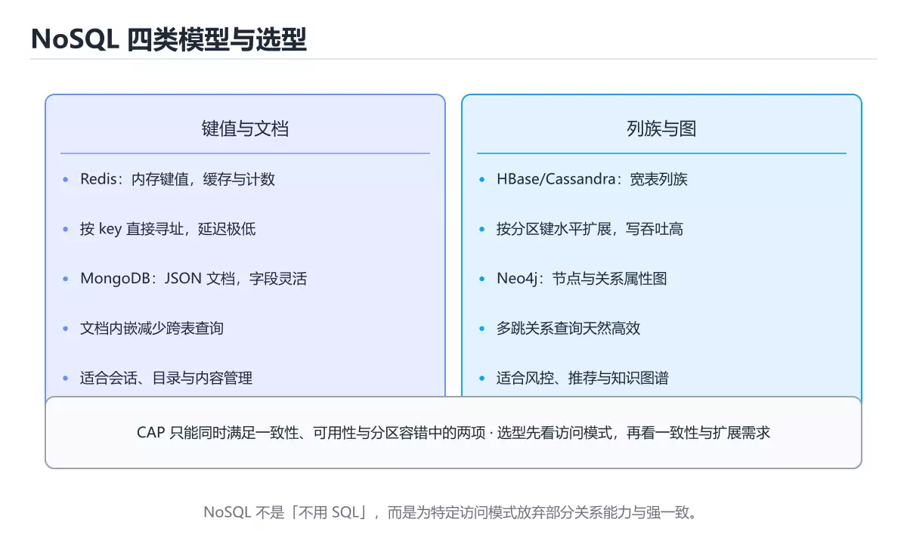

# NoSQL 数据库

> 内容更新时间：2026-10-06 · 学习阶段：进阶 · 预计用时：40 分钟




## 本节知识框架

**课程定位**：所属分类 `database`（数据库），课程主题 `NoSQL 数据库`，学习阶段 进阶，建议用时 45 分钟。

本课主线：键值/文档/列族/图四类模型、CAP 与选型。

**学完本课应当能够**
- 说清 `QUORUM` 与 `NoSQL` 的含义与区别，并各举一个正例和一个反例。
- 用本课示例验证 `MongoDB` 的行为，记录输入、输出与失败条件。
- 遇到「用 NoSQL 替代一切」这类问题时，能说出触发条件与修复顺序。

### 从概念到验证的学习链条

1. `QUORUM`：先掌握 实践要点：网络分区一定会发生，所以选择实际是在 CP 与 AP 之间。多数系统提供可调一致性（如 `QUORUM`、`ONE`），再用它解释 `NoSQL` 为什么会出现。
2. `NoSQL`：先掌握 不以固定关系表为核心的数据存储类别，包括文档、键值和图数据库，再用它解释 `MongoDB` 为什么会出现。
3. `MongoDB`：先掌握 面向文档的 NoSQL 数据库：数据以 BSON 文档存储，字段灵活并支持聚合管道，再用它解释 `CAP` 为什么会出现。
4. `CAP`：先掌握 CAP：一致性 Consistency、可用性 Availability、分区容错 Partition tolerance，再用它解释 本课示例的观察结果 为什么会出现。

**先修与衔接**：本课是「数据库」分类的第 8 课。先修内容：《查询优化与执行计划》。《查询优化与执行计划》里的 `SCAN`、`ANALYZE` 是本课的前提。相关或后续课程：《Redis 实战》。

### 完成判据

- **定义关**：不看正文也能说明 `QUORUM` 是 实践要点：网络分区一定会发生，所以选择实际是在 CP 与 AP 之间，多数系统提供可调一致性（如 `QUORUM`、`ONE`），并指出一个反例。
- **机制关**：能按“输入 → 转换 → 输出 → 验证”复述 `NoSQL 数据库`，而不是只背结论。
- **示例关**：能运行或推演 `NoSQL 数据库` 的 `text` 示例，并说明一个真实出现的标识符或字面量。
- **证据关**：能指出 `NoSQL 数据库` 示例里的 调用了 `insertOne()`，并说明它支持或反驳了本课的哪一条结论。
- **排错关**：能复现 用 NoSQL 替代一切，记录现象并按 按访问模式分工，混合存储常见 修复。
- **迁移关**：能把 `NoSQL`、`MongoDB`、`CAP`、`BASE` 放进一个与 `NoSQL 数据库` 不同的项目场景，并保持输入与验证条件可追踪。
- **复盘关**：学完 `NoSQL 数据库` 后，用一句话写下仍然不确定的结论，并列出下一次验证需要的输入、环境和成功判据。

### 复习清单

- [ ] 能不看正文复述本课核心术语，并指出一个边界或反例。
- [ ] 能运行或推演本课示例，记录输入、输出与失败现象。
- [ ] 能完成一次自测，并把错题对照错误表定位原因。

## 核心概念定义

| 术语 | 操作性定义 | 常见边界与风险 |
| --- | --- | --- |
| QUORUM | 实践要点：网络分区一定会发生，所以选择实际是在 CP 与 AP 之间。多数系统提供可调一致性（如 QUORUM、ONE）。 | 隔离级别与并发事务会影响可见性，换级别或换存储引擎后要重新验证。 |
| NoSQL | 不以固定关系表为核心的数据存储类别，包括文档、键值和图数据库。 | 易错：事务与一致性难保证；正确做法是按访问模式分工，混合存储常见。 |
| MongoDB | 面向文档的 NoSQL 数据库：数据以 BSON 文档存储，字段灵活并支持聚合管道。 | 索引命中与数据分布决定实际开销，判断前先看执行计划而不是只看结果是否正确。 |
| CAP | CAP：一致性 Consistency、可用性 Availability、分区容错 Partition tolerance。 | 隔离级别与并发事务会影响可见性，换级别或换存储引擎后要重新验证。 |
| 键值 | key -> value | 只在「key -> value」这一前提下成立，换输入或换环境要重新验证。 |
| 文档 | JSON 文档 | 易错：后期查询无法支持；正确做法是宽列与文档都必须按查询设计模型。 |
| 列族 | 宽表、按列存储 | 只在「宽表、按列存储」这一前提下成立，换输入或换环境要重新验证。 |
| 图 | 节点 + 边 | 只在「节点 + 边」这一前提下成立，换输入或换环境要重新验证。 |
| 键值 | key → value | 只在「key → value」这一前提下成立，换输入或换环境要重新验证。 |
| 文档 | JSON 文档 | 易错：后期查询无法支持；正确做法是宽列与文档都必须按查询设计模型。 |
| 宽列 | 行键 + 列族 | 易错：后期查询无法支持；正确做法是宽列与文档都必须按查询设计模型。 |
| 图 | 点与边 | 只在「点与边」这一前提下成立，换输入或换环境要重新验证。 |
| 搜索 | 倒排索引 | 易错：数据丢失难以恢复；正确做法是权威数据放数据库，搜索做索引。 |
| 时序 | 时间戳 + 标签 | 只在「时间戳 + 标签」这一前提下成立，换输入或换环境要重新验证。 |

## 原理与运行机制

### 机制总览

**教材衔接：混合架构（Polyglot Persistence）**

```text
MySQL/PostgreSQL  存核心交易数据（强一致、事务）
Redis             存热点缓存与会话（毫秒级）
Elasticsearch     做全文检索与聚合分析
MongoDB           存灵活的内容与日志类数据
```

真实系统往往是多存储并存，关键是明确**每种数据的权威来源（Source of Truth）**，并设计好同步与补偿机制。

**失败路径（来自本课错误表）**
- 用 NoSQL 替代一切 → 事务与一致性难保证 → 按访问模式分工，混合存储常见。
- 认为 NoSQL 不需要建模 → 后期查询无法支持 → 宽列与文档都必须按查询设计模型。
- 把 Elasticsearch 当权威存储 → 数据丢失难以恢复 → 权威数据放数据库，搜索做索引。
- 忽略最终一致的业务影响 → 用户看到过期数据 → 读写路径设计补偿与提示。
### 机制拆解：每一步的输入、动作与输出

#### 1. `QUORUM`
- 输入：`NoSQL`；本步把 实践要点：网络分区一定会发生，所以选择实际是在 CP 与 AP 之间。多数系统提供可调一致性（如 `QUORUM`、`ONE`） 当作判断规则。
- 动作：围绕 `QUORUM` 保留中间状态，并记录它与 `NoSQL` 的对应关系。
- 输出：`NoSQL`，它可以被下一段代码、测试或记录继续使用。
- `QUORUM` 的失败条件：隔离级别与并发事务会影响可见性，换级别或换存储引擎后要重新验证。

#### 2. `NoSQL`
- 输入：`QUORUM`；本步把 不以固定关系表为核心的数据存储类别，包括文档、键值和图数据库 当作判断规则。
- 动作：围绕 `NoSQL` 保留中间状态，并记录它与 `MongoDB` 的对应关系。
- 输出：`MongoDB`，它可以被下一段代码、测试或记录继续使用。
- `NoSQL` 的失败条件：当用 NoSQL 替代一切时，会出现事务与一致性难保证。

#### 3. `MongoDB`
- 输入：`NoSQL`；本步把 面向文档的 NoSQL 数据库：数据以 BSON 文档存储，字段灵活并支持聚合管道 当作判断规则。
- 动作：围绕 `MongoDB` 保留中间状态，并记录它与 `CAP` 的对应关系。
- 输出：`CAP`，它可以被下一段代码、测试或记录继续使用。
- `MongoDB` 的失败条件：索引命中与数据分布决定实际开销，判断前先看执行计划而不是只看结果是否正确。

#### 4. `CAP`
- 输入：`MongoDB`；本步把 CAP：一致性 Consistency、可用性 Availability、分区容错 Partition tolerance 当作判断规则。
- 动作：围绕 `CAP` 保留中间状态，并记录它与 `insertOne` 的对应关系。
- 输出：`insertOne`，它可以被下一段代码、测试或记录继续使用。
- `CAP` 的失败条件：隔离级别与并发事务会影响可见性，换级别或换存储引擎后要重新验证。

### 示例中的可观察事实

1. 调用了 `insertOne()`；它对应的课程主题是 `NoSQL 数据库`。
2. 调用了 `Date()`；它对应的课程主题是 `NoSQL 数据库`。
3. 调用了 `find()`；它对应的课程主题是 `NoSQL 数据库`。
4. 调用了 `sort()`；它对应的课程主题是 `NoSQL 数据库`。
5. 调用了 `limit()`；它对应的课程主题是 `NoSQL 数据库`。
6. 调用了 `createIndex()`；它对应的课程主题是 `NoSQL 数据库`。
7. 出现字面量 `vip`；它对应的课程主题是 `NoSQL 数据库`。
8. 出现字面量 `new`；它对应的课程主题是 `NoSQL 数据库`。

### 复现实验记录

- 环境：`NoSQL 数据库` 使用 `text` 示例，固定 `NoSQL`、`MongoDB`、`CAP`、`BASE` 作为第一组条件。
- 首轮输入：先确认 调用了 `insertOne()`，预测 `QUORUM` 会怎样变化。
- 基线观察：记录命令、输入、输出和错误原文，不用截图代替可复制的文本。
- 单变量修改：只改变 `NoSQL`，观察 `CAP` 是否仍满足定义。
- 失败注入：复现 用 NoSQL 替代一切，确认现象是 事务与一致性难保证。
- 记录结论：把“修改前、修改后、预期变化、实际变化”写成四列表，这样复盘 `NoSQL 数据库` 时才能区分概念错误与实现错误。

## 典型应用场景

- **用 NoSQL 替代一切**：典型现象是事务与一致性难保证；正确做法是按访问模式分工，混合存储常见。
- **认为 NoSQL 不需要建模**：典型现象是后期查询无法支持；正确做法是宽列与文档都必须按查询设计模型。
- **把 Elasticsearch 当权威存储**：典型现象是数据丢失难以恢复；正确做法是权威数据放数据库，搜索做索引。
- **忽略最终一致的业务影响**：典型现象是用户看到过期数据；正确做法是读写路径设计补偿与提示。

### 最小验证场景

- 准备：保留 `text` 示例的原始输入，先记录 `NoSQL 数据库` 的基线输出和完整运行命令。
- 观察：先核对 调用了 `insertOne()`，再改变一个与 `QUORUM` 相关的条件。
- 判定：新结果与 `NoSQL 数据库` 的基线不同不等于错误；只有当差异破坏了 `QUORUM` 的定义或错误表中的约束，才判定为失败。

### 选择与边界

- 使用 `QUORUM` 时，先满足它的定义：实践要点：网络分区一定会发生，所以选择实际是在 CP 与 AP 之间。多数系统提供可调一致性（如 `QUORUM`、`ONE`）；隔离级别与并发事务会影响可见性，换级别或换存储引擎后要重新验证。
- 使用 `NoSQL` 时，先满足它的定义：不以固定关系表为核心的数据存储类别，包括文档、键值和图数据库；易错：事务与一致性难保证；正确做法是按访问模式分工，混合存储常见。
- 使用 `MongoDB` 时，先满足它的定义：面向文档的 NoSQL 数据库：数据以 BSON 文档存储，字段灵活并支持聚合管道；索引命中与数据分布决定实际开销，判断前先看执行计划而不是只看结果是否正确。
- 使用 `CAP` 时，先满足它的定义：CAP：一致性 Consistency、可用性 Availability、分区容错 Partition tolerance；隔离级别与并发事务会影响可见性，换级别或换存储引擎后要重新验证。

## 代码/协议/SQL 示例

### 最小可验证示例

```javascript
// MongoDB：文档结构灵活，一条记录就是一份完整对象
db.users.insertOne({
  name: "小明",
  tags: ["vip", "new"],
  address: { city: "上海", zip: "200000" },
  createdAt: new Date()
});

db.users.find({ tags: "vip", "address.city": "上海" })
         .sort({ createdAt: -1 })
         .limit(20);

db.users.createIndex({ "address.city": 1, createdAt: -1 });
```

**教材衔接：为什么会有 NoSQL**

关系型数据库强调强一致与固定表结构，在海量数据、灵活结构、高并发写入场景下成本较高。NoSQL 用**牺牲部分一致性或查询能力**换取扩展性与灵活度。

**教材衔接：文档数据库示例**

常见设计原则：**按查询模式建模**，把经常一起读取的数据放进同一个文档，减少跨集合查询。

**教材衔接：CAP 与 BASE**

```text
CAP：一致性 Consistency、可用性 Availability、分区容错 Partition tolerance
     分布式系统发生分区时，只能在 C 与 A 之间取舍
BASE：基本可用 Basically Available、软状态 Soft state、最终一致 Eventually consistent
```

多数 NoSQL 选择 AP + 最终一致，用版本号、向量时钟或冲突解决策略处理并发写入。

**教材衔接：什么时候选 NoSQL**

1. 数据量大且需要水平分片（Sharding）。
2. 结构经常变化，或嵌套层级深（文档模型天然契合）。
3. 写入吞吐极高（列族数据库）。
4. 关系本身就是数据，需要多跳查询（图数据库）。

反过来，涉及多表事务、复杂 JOIN、强一致约束（如金融账务）时，关系型数据库仍是首选。

**教材衔接：CAP 与 BASE 速查**

| 概念 | 含义 |
| --- | --- |
| C 一致性 | 所有节点看到相同数据 |
| A 可用性 | 每个请求都能得到非错误响应 |
| P 分区容忍 | 网络分区时系统仍可运行 |
| CA / CP / AP | 分区发生时只能二选一：CP 牺牲可用性，AP 牺牲强一致 |
| BASE | 基本可用、软状态、最终一致 |
| 最终一致 | 停止写入后，副本最终收敛一致 |

实践要点：网络分区一定会发生，所以选择实际是在 CP 与 AP 之间。多数系统提供可调一致性（如 `QUORUM`、`ONE`）。

```python
def quorum_needed(replicas: int) -> tuple[int, int]:
    """写与读的法定人数：W + R > N 才能保证读到最新写入。"""
    write = replicas // 2 + 1
    read = replicas - write + 1
    return write, read

print(quorum_needed(3))     # (2, 2)：写 2 读 2 必然有交集
print(quorum_needed(5))     # (3, 3)

def choose_store(needs: dict) -> str:
    """按需求给一个粗略的选型建议。"""
    if needs.get("complex_transaction"):
        return "关系型数据库（PostgreSQL / MySQL）"
    if needs.get("full_text"):
        return "Elasticsearch + 权威存储"
    if needs.get("massive_write"):
        return "宽列存储（Cassandra / HBase）"
    if needs.get("flexible_schema"):
        return "文档数据库（MongoDB）"
    return "键值存储（Redis）"

print(choose_store({"full_text": True}))
```

### 示例精读：先找证据，再改一个条件

1. 调用了 `insertOne()`；它出现在 `NoSQL 数据库` 的示例中，阅读时先确认它前后各发生了什么。
2. 调用了 `Date()`；它出现在 `NoSQL 数据库` 的示例中，阅读时先确认它前后各发生了什么。
3. 调用了 `find()`；它出现在 `NoSQL 数据库` 的示例中，阅读时先确认它前后各发生了什么。
4. 调用了 `sort()`；它出现在 `NoSQL 数据库` 的示例中，阅读时先确认它前后各发生了什么。
5. 调用了 `limit()`；它出现在 `NoSQL 数据库` 的示例中，阅读时先确认它前后各发生了什么。
6. 调用了 `createIndex()`；它出现在 `NoSQL 数据库` 的示例中，阅读时先确认它前后各发生了什么。
7. 出现字面量 `vip`；它出现在 `NoSQL 数据库` 的示例中，阅读时先确认它前后各发生了什么。
8. 出现字面量 `new`；它出现在 `NoSQL 数据库` 的示例中，阅读时先确认它前后各发生了什么。
- 在 `NoSQL 数据库` 中与 `QUORUM` 对照：示例必须能支持 实践要点：网络分区一定会发生，所以选择实际是在 CP 与 AP 之间。多数系统提供可调一致性（如 `QUORUM`、`ONE`），否则说明这一段还缺少实现或验证步骤。
- 在 `NoSQL 数据库` 中与 `NoSQL` 对照：示例必须能支持 不以固定关系表为核心的数据存储类别，包括文档、键值和图数据库，否则说明这一段还缺少实现或验证步骤。
- 在 `NoSQL 数据库` 中与 `MongoDB` 对照：示例必须能支持 面向文档的 NoSQL 数据库：数据以 BSON 文档存储，字段灵活并支持聚合管道，否则说明这一段还缺少实现或验证步骤。
- 在 `NoSQL 数据库` 中与 `CAP` 对照：示例必须能支持 CAP：一致性 Consistency、可用性 Availability、分区容错 Partition tolerance，否则说明这一段还缺少实现或验证步骤。

## 时间/空间复杂度或性能分析

**性能关注点（NoSQL 数据库）**：扫描行数与索引命中决定开销：记录查询耗时、执行计划与锁等待。

**本课特有开销（NoSQL 数据库 · NoSQL）**：重试与超时会成倍放大尾延迟，记录 P99 而不是平均值。

**测量方法**：以 `NoSQL 数据库` 的 `NoSQL` 场景为对象，固定输入跑一遍记录基线，再把规模或并发度提高一个数量级复测；两次结果的差值与波动范围才是结论依据。

### 需要控制的变量与记录项

- `NoSQL 数据库` 的 `NoSQL`：固定它的版本、输入范围和资源上限，分别记录速度、内存与失败率的变化。
- `NoSQL 数据库` 的 `MongoDB`：固定它的版本、输入范围和资源上限，分别记录速度、内存与失败率的变化。
- `NoSQL 数据库` 的 `CAP`：固定它的版本、输入范围和资源上限，分别记录速度、内存与失败率的变化。
- `NoSQL 数据库` 的 `BASE`：固定它的版本、输入范围和资源上限，分别记录速度、内存与失败率的变化。
- `NoSQL 数据库` 的 `选型`：固定它的版本、输入范围和资源上限，分别记录速度、内存与失败率的变化。
- `NoSQL 数据库` 中 `QUORUM` 的边界：隔离级别与并发事务会影响可见性，换级别或换存储引擎后要重新验证。达到边界时不要外推，必须重新测量。
- `NoSQL 数据库` 中 `NoSQL` 的边界：易错：事务与一致性难保证；正确做法是按访问模式分工，混合存储常见。达到边界时不要外推，必须重新测量。
- `NoSQL 数据库` 中 `MongoDB` 的边界：索引命中与数据分布决定实际开销，判断前先看执行计划而不是只看结果是否正确。达到边界时不要外推，必须重新测量。
- `NoSQL 数据库` 中 `CAP` 的边界：隔离级别与并发事务会影响可见性，换级别或换存储引擎后要重新验证。达到边界时不要外推，必须重新测量。
- `NoSQL 数据库` 的代码证据：先验证 调用了 `insertOne()`，再记录该路径的输入规模与耗时；只看代码行数不能推出复杂度。

## 常见误区与易错点

| 容易写错的做法 | 实际现象 | 原因与正确做法 |
| --- | --- | --- |
| 用 NoSQL 替代一切 | 事务与一致性难保证 | 按访问模式分工，混合存储常见 |
| 认为 NoSQL 不需要建模 | 后期查询无法支持 | 宽列与文档都必须按查询设计模型 |
| 把 Elasticsearch 当权威存储 | 数据丢失难以恢复 | 权威数据放数据库，搜索做索引 |
| 忽略最终一致的业务影响 | 用户看到过期数据 | 读写路径设计补偿与提示 |
| 无脑选 AP 系统 | 业务出现超卖 | 关键路径用 CP 或加分布式锁 |
| 把 N+1 查询搬到 NoSQL | 依然慢 | 按主键批量取或反范式冗余 |
| 认为扩容就能解决热点 | 单分区仍被打爆 | 重新设计分区键打散热点 |
| 用 Redis 存唯一权威数据 | 重启或淘汰后丢失 | 明确持久化与主存储职责 |
| 忽略文档大小上限 | 写入失败 | 拆分大文档或改用对象存储 |
| 不做容量与压测评估 | 上线后性能不达标 | 用真实数据量与并发压测 |

### 现场 1：用 NoSQL 替代一切

**症状**：事务与一致性难保证。

**根因与修复**：按访问模式分工，混合存储常见。

**自检**：在本课示例里复现「用 NoSQL 替代一切」，改成按访问模式分工，混合存储常见后重跑；如果症状消失且失败路径按预期变化，说明定位正确。

### 现场 2：认为 NoSQL 不需要建模

**症状**：后期查询无法支持。

**根因与修复**：宽列与文档都必须按查询设计模型。

**自检**：在本课示例里复现「认为 NoSQL 不需要建模」，改成宽列与文档都必须按查询设计模型后重跑；如果症状消失且失败路径按预期变化，说明定位正确。

### 现场 3：把 Elasticsearch 当权威存储

**症状**：数据丢失难以恢复。

**根因与修复**：权威数据放数据库，搜索做索引。

**自检**：在本课示例里复现「把 Elasticsearch 当权威存储」，改成权威数据放数据库，搜索做索引后重跑；如果症状消失且失败路径按预期变化，说明定位正确。

### 现场 4：忽略最终一致的业务影响

**症状**：用户看到过期数据。

**根因与修复**：读写路径设计补偿与提示。

**自检**：在本课示例里复现「忽略最终一致的业务影响」，改成读写路径设计补偿与提示后重跑；如果症状消失且失败路径按预期变化，说明定位正确。

### 现场 5：无脑选 AP 系统

**症状**：业务出现超卖。

**根因与修复**：关键路径用 CP 或加分布式锁。

**自检**：在本课示例里复现「无脑选 AP 系统」，改成关键路径用 CP 或加分布式锁后重跑；如果症状消失且失败路径按预期变化，说明定位正确。

### 现场 6：把 N+1 查询搬到 NoSQL

**症状**：依然慢。

**根因与修复**：按主键批量取或反范式冗余。

**自检**：在本课示例里复现「把 N+1 查询搬到 NoSQL」，改成按主键批量取或反范式冗余后重跑；如果症状消失且失败路径按预期变化，说明定位正确。

### 现场 7：认为扩容就能解决热点

**症状**：单分区仍被打爆。

**根因与修复**：重新设计分区键打散热点。

**自检**：在本课示例里复现「认为扩容就能解决热点」，改成重新设计分区键打散热点后重跑；如果症状消失且失败路径按预期变化，说明定位正确。

### 现场 8：用 Redis 存唯一权威数据

**症状**：重启或淘汰后丢失。

**根因与修复**：明确持久化与主存储职责。

**自检**：在本课示例里复现「用 Redis 存唯一权威数据」，改成明确持久化与主存储职责后重跑；如果症状消失且失败路径按预期变化，说明定位正确。

### 现场 9：忽略文档大小上限

**症状**：写入失败。

**根因与修复**：拆分大文档或改用对象存储。

**自检**：在本课示例里复现「忽略文档大小上限」，改成拆分大文档或改用对象存储后重跑；如果症状消失且失败路径按预期变化，说明定位正确。

## 与其他知识点的关系

**教材衔接：复习与迁移**

### 概念复述

- 用一句话说明「NoSQL 数据库」解决什么问题：键值/文档/列族/图四类模型、CAP 与选型。
- 写出NoSQL、MongoDB、CAP之间的关系，并各举一个例子。
- 说出本课最容易混淆的两个概念，以及区分它们的判据。

### 正文逐节复核

- **CAP 与 BASE**：多数 NoSQL 选择 AP + 最终一致，用版本号、向量时钟或冲突解决策略处理并发写入。


### 迁移练习

把「NoSQL 数据库」的结论迁移到相邻主题，每次迁移都写清预测与证据：

- **先修**：`查询优化与执行计划`。本课默认这些内容已经掌握。
- **相关或后续**：`Redis 实战`。本课术语会在这些课程里继续使用。
- **术语归属**：`QUORUM`、`NoSQL`、`MongoDB` 的定义以本课「核心概念定义」为准，换到其他课程时先确认定义是否被改写。

### 先修与后续术语接口

- `查询优化与执行计划`：两者通过本分类的学习顺序衔接，阅读时重点比较各自的输入与失败条件。
- `Redis 实战`：两者通过本分类的学习顺序衔接，阅读时重点比较各自的输入与失败条件。

### 容易混淆的相邻概念

- `QUORUM` 与 `NoSQL`：前者强调 实践要点：网络分区一定会发生，所以选择实际是在 CP 与 AP 之间。多数系统提供可调一致性（如 `QUORUM`、`ONE`）；后者强调 不以固定关系表为核心的数据存储类别，包括文档、键值和图数据库。判断时分别检查两条定义的适用范围，不要只看名称相似就互换。
- `NoSQL` 与 `MongoDB`：前者强调 不以固定关系表为核心的数据存储类别，包括文档、键值和图数据库；后者强调 面向文档的 NoSQL 数据库：数据以 BSON 文档存储，字段灵活并支持聚合管道。判断时分别检查两条定义的适用范围，不要只看名称相似就互换。
- `MongoDB` 与 `CAP`：前者强调 面向文档的 NoSQL 数据库：数据以 BSON 文档存储，字段灵活并支持聚合管道；后者强调 CAP：一致性 Consistency、可用性 Availability、分区容错 Partition tolerance。判断时分别检查两条定义的适用范围，不要只看名称相似就互换。

## 自测题与参考答案

> 先独立作答，再对照参考答案；答案都能在本课正文、术语表或错误表里找到依据。

### 自测 1（概念复述）

不看正文，写出 `QUORUM` 的操作性定义，并说明它与 `NoSQL` 的区别。

**参考答案**：实践要点：网络分区一定会发生，所以选择实际是在 CP 与 AP 之间。多数系统提供可调一致性（如 `QUORUM`、`ONE`）。

`NoSQL` 的定位是：不以固定关系表为核心的数据存储类别，包括文档、键值和图数据库；两者的差别要从适用对象与失败模式上说明。

### 自测 2（排错）

本课错误表记录了「用 NoSQL 替代一切」这类做法。请写出它会出现的现象、根因，以及修复顺序。

**参考答案**：现象是事务与一致性难保证；正确做法是按访问模式分工，混合存储常见。修复时先复现现象并保留证据，再改动一处假设重跑，确认现象消失。

### 自测 3（动手验证）

运行本课的 `text` 示例，改动其中一个输入后重新运行，记录输出与错误信息。

**参考答案**：正常输入下 `text` 示例应当复现正文给出的结果；改动输入后，如果结果改变或报错，先核对它是否满足 `NoSQL 数据库` 中`QUORUM` 的适用范围，再检查错误表里是否有同类现象。

### 自测 4（代码阅读）

阅读本课开头的 `text` 示例，说明它体现了`QUORUM` 的哪一条性质，并指出改动哪个输入会让这条性质不再成立。

**参考答案**：`QUORUM` 的定义是 实践要点：网络分区一定会发生，所以选择实际是在 CP 与 AP 之间，多数系统提供可调一致性（如 `QUORUM`、`ONE`），示例正是在实现这条定义。改动与 `QUORUM` 有关的一个输入后，如果结果不再符合 `NoSQL 数据库` 的正文描述，就说明该性质只在当前前提成立。

### 自测 5（迁移）

把 `NoSQL 数据库` 的方法迁移到自己的项目：围绕 `QUORUM` 写出一个与错误表同类的风险点，并说明触发条件和检验方式。

**参考答案**：例如「不做容量与压测评估」，它会导致上线后性能不达标；检验方式是按用真实数据量与并发压测改一处再复现，确认现象消失且没有引入新的失败分支。

### 自测 6（对比）

用一个表格对比 `QUORUM` 与 `NoSQL`：各写一行适用场景、一行失败表现。

**参考答案**：`QUORUM` 的定义是实践要点：网络分区一定会发生，所以选择实际是在 CP 与 AP 之间。多数系统提供可调一致性（如 `QUORUM`、`ONE`）；`NoSQL` 的定义是不以固定关系表为核心的数据存储类别，包括文档、键值和图数据库。两者的失败表现分别对应本课错误表里与本术语相关的行。

### 自测 7（排错顺序）

面对「用 NoSQL 替代一切」引发的问题，请把“复现 事务与一致性难保证 → 保留证据 → 按访问模式分工，混合存储常见 → 回归验证”四步写成可执行的检查清单。

**参考答案**：第一步按事务与一致性难保证复现；第二步记录输入、版本与完整报错；第三步按按访问模式分工，混合存储常见只改一处；第四步重跑并确认失败路径也按预期变化。

### 自测 8（边界判断）

针对 `CAP`，分别写出“可以使用”的条件和“结论不再成立”的条件。

**参考答案**：隔离级别与并发事务会影响可见性，换级别或换存储引擎后要重新验证。 同时要把 `CAP` 的定义 CAP：一致性 Consistency、可用性 Availability、分区容错 Partition tolerance 与实际输入逐项对照。

### 自测 9（机制重建）

不看正文，按输入、转换、输出、验证四段重建 `QUORUM` → `NoSQL` → `MongoDB` → `CAP` 的作用链。

**参考答案**：起点是 `QUORUM` 的定义 实践要点：网络分区一定会发生，所以选择实际是在 CP 与 AP 之间。多数系统提供可调一致性（如 `QUORUM`、`ONE`）；中间每一步都保留可观察状态；终点由 `CAP` 检查，失败时回到错误表定位第一个偏离定义的步骤。

### 自测 10（综合排错）

在 `NoSQL 数据库` 中，现象是 上线后性能不达标。请围绕 不做容量与压测评估 写出最小复现、关键证据、修复动作和回归验证，并说明为什么不能只凭一次运行下结论。

**参考答案**：先复现 不做容量与压测评估，记录输入与完整错误；再按 用真实数据量与并发压测 只改一处。回归时同时跑正常路径和边界路径，只有两次结果都可解释，才把修复视为完成。

### 自测 11（一分钟复述）

用每分钟约 200 字的速度复述 `NoSQL 数据库`：先给主问题，再按顺序说出 `QUORUM`、`NoSQL`、`MongoDB`、`CAP`，最后给一个失败案例。

**自评标准**：主问题必须对应 键值/文档/列族/图四类模型、CAP 与选型；每个术语都要能接上一句定义或边界；失败案例必须写成可观察现象，不能用“可能有风险”代替证据。

## 术语速查

| 术语 | 一句话说明 |
| --- | --- |
| `QUORUM` | 实践要点：网络分区一定会发生，所以选择实际是在 CP 与 AP 之间。多数系统提供可调一致性（如 `QUORUM`、`ONE`）。 |
| `NoSQL` | 不以固定关系表为核心的数据存储类别，包括文档、键值和图数据库。 |
| `MongoDB` | 面向文档的 NoSQL 数据库：数据以 BSON 文档存储，字段灵活并支持聚合管道。 |
| `CAP` | CAP：一致性 Consistency、可用性 Availability、分区容错 Partition tolerance。 |

**术语关系**：`QUORUM`（实践要点：网络分区一定会发生） → `NoSQL`（不以固定关系表为核心的数据存储类别） → `MongoDB`（面向文档的 NoSQL 数据库：数据以 BSON 文档存储） → `CAP`（CAP：一致性 Consistency、可用性 Availability、分区容错 Partition tolerance）。

## 考点精讲

`NoSQL 数据库` 的题库有 6 道题，下面逐题给出题干、正确项与判断依据：先自己作答，再核对正确项，最后回到正文对应小节复核。

### 考点 1：第 1 题

- **题目**：围绕“NoSQL 数据库”中的 NoSQL、MongoDB、CAP，下列哪两项是本课强调的实践判断？
- **正确项**：学习 NoSQL 时要同时说明输入、输出和失败路径，不能只看正常流程；验证 MongoDB 时要固定版本并覆盖边界输入，结论才可复现
- **判断依据**：这道题落在术语 `NoSQL` 上：不以固定关系表为核心的数据存储类别，包括文档、键值和图数据库。复习时把 `NoSQL` 的定义、适用边界和一个反例一起说清楚，再回到「核心概念定义」核对原文。

### 考点 2：第 2 题

- **题目**：CAP 中的 P 指的是？
- **正确项**：分区容错
- **判断依据**：这道题落在术语 `CAP` 上：CAP：一致性 Consistency、可用性 Availability、分区容错 Partition tolerance。复习时把 `CAP` 的定义、适用边界和一个反例一起说清楚，再回到「核心概念定义」核对原文。

### 考点 3：第 3 题

- **题目**：代码语言为 `python`，选自 `NoSQL 数据库` 的 `QUORUM` 部分。课程问题为键值/文档/列族/图四类模型、CAP 与选型。哪一项描述与代码一致？
- **正确项**：出现字面量 `new`
- **判断依据**：这道题落在术语 `QUORUM` 上：实践要点：网络分区一定会发生，所以选择实际是在 CP 与 AP 之间，多数系统提供可调一致性（如 `QUORUM`、`ONE`）。复习时把 `QUORUM` 的定义、适用边界和一个反例一起说清楚，再回到「核心概念定义」核对原文。

### 考点 4：第 4 题

- **题目**：宽列存储（如 Cassandra）的典型特点是？
- **正确项**：按分区键把数据分布到多节点
- **判断依据**：这道题检验本课主问题：键值/文档/列族/图四类模型、CAP 与选型。复习时先复述本课主问题，再举一个会让结论失效的输入。

### 考点 5：第 5 题

- **题目**：最终一致性的业务补偿常见手段是？
- **正确项**：幂等设计 + 重试 + 定时对账/补偿任务
- **判断依据**：这道题检验本课主问题：键值/文档/列族/图四类模型、CAP 与选型。复习时先复述本课主问题，再举一个会让结论失效的输入。

### 考点 6：第 6 题

- **题目**：填空：补齐下面这段术语说明中的空缺。课程 `键值/文档/列族/图四类模型、CAP 与选型。`，这段说明是：`____`：不以固定关系表为核心的数据存储类别，包括文档、键值和图数据库。空缺处应填哪个术语？
- **正确项**：NoSQL
- **判断依据**：这道题落在术语 `NoSQL` 上：不以固定关系表为核心的数据存储类别，包括文档、键值和图数据库。复习时把 `NoSQL` 的定义、适用边界和一个反例一起说清楚，再回到「核心概念定义」核对原文。

### 考点 7：`QUORUM`

- **要点**：实践要点：网络分区一定会发生，所以选择实际是在 CP 与 AP 之间。多数系统提供可调一致性（如 `QUORUM`、`ONE`）。
- **QUORUM 的边界**：隔离级别与并发事务会影响可见性，换级别或换存储引擎后要重新验证。

### 考点 8：`NoSQL`

- **要点**：不以固定关系表为核心的数据存储类别，包括文档、键值和图数据库。
- **NoSQL 的边界**：易错：事务与一致性难保证；正确做法是按访问模式分工，混合存储常见。

### 考点 9：`MongoDB`

- **要点**：面向文档的 NoSQL 数据库：数据以 BSON 文档存储，字段灵活并支持聚合管道。
- **MongoDB 的边界**：索引命中与数据分布决定实际开销，判断前先看执行计划而不是只看结果是否正确。

### 考点 10：`CAP`

- **要点**：CAP：一致性 Consistency、可用性 Availability、分区容错 Partition tolerance。
- **CAP 的边界**：隔离级别与并发事务会影响可见性，换级别或换存储引擎后要重新验证。

### 考点 11：排错——用 NoSQL 替代一切

- **现象**：事务与一致性难保证。
- **处理**：按访问模式分工，混合存储常见。

### 考点 12：排错——认为 NoSQL 不需要建模

- **现象**：后期查询无法支持。
- **处理**：宽列与文档都必须按查询设计模型。

### 考点 13：综合辨析——`QUORUM` 与 `CAP`

- **辨析点**：`QUORUM` 的定义是 实践要点：网络分区一定会发生，所以选择实际是在 CP 与 AP 之间。多数系统提供可调一致性（如 `QUORUM`、`ONE`）；`CAP` 的定义是 CAP：一致性 Consistency、可用性 Availability、分区容错 Partition tolerance。
- **答题要求**：面对 `NoSQL 数据库` 的题目，先判断描述的是 `QUORUM` 还是 `CAP`，再归到对应定义，最后写出一个会让该定义失效的边界输入。

### 考点 14：排错评分点

- **现象分**：能写出 事务与一致性难保证，而不是只写“程序有错”。
- **证据分**：保留触发 用 NoSQL 替代一切 的输入、版本和错误原文。
- **修复分**：按 按访问模式分工，混合存储常见 只改一处，并同时回归正常路径与边界路径。

## 内容元数据

- 内容版本：v2.0
- 最后更新：2026-10-06
- 学习阶段：进阶
- 适用环境：PostgreSQL / MySQL / SQLite 等主流数据库；本课聚焦其中的 NoSQL。
- 内容来源：内置结构化课程与工程实践整理
- 相关主题：NoSQL、MongoDB、CAP、BASE、选型
- 质量版本：P0 测验标准 + P1 覆盖扩展 + P2 体验补全

## 参考资料与复核

- 最后复核：2026-10-04
- 下次复核：2027-06-17
- 复核范围：版本兼容、API 行为、安全建议与工程实践
- 来源性质：官方文档、标准或权威教材；本课核对关键词：NoSQL、MongoDB、CAP、BASE、选型。

| 参考资料 | 本课用途 |
| --- | --- |
| [MongoDB 文档](https://www.mongodb.com/docs/) | 文档数据库与聚合 |
| [SQL 标准概览](https://www.iso.org/standard/76583.html) | SQL 标准范围 |
| [Use The Index, Luke](https://use-the-index-luke.com/) | SQL 索引与查询优化 |

| [本课术语索引：NoSQL 数据库](#核心概念定义) | 按本课输入、术语边界和错误表现逐项核对 |
> 「NoSQL 数据库」的链接用于离线阅读后的延伸核对；App 不会自动联网。