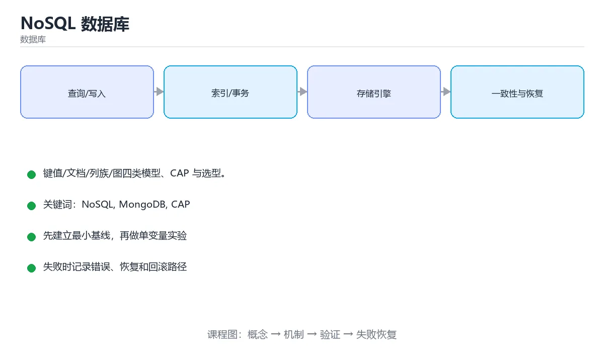

# NoSQL 数据库



> 内容更新时间：2026-10-03 · 学习阶段：进阶 · 预计用时：15 分钟

## 学习目标

- 能用自己的话解释「NoSQL 数据库」解决了什么问题，而不是只背术语。
- 能说清 「NoSQL」、「MongoDB」、「CAP」、「BASE」 之间的关系，并分别举出一个例子。
- 能把本课知识放回「数据库」的知识体系，说明它和相邻主题的边界。
- 能完成本课练习，并用验收标准检查自己的结果。

> 一句话摘要：键值/文档/列族/图四类模型、CAP 与选型。

## 前置知识

- 先完成上一课《查询优化与执行计划》；如果已经掌握，可以直接用本课练习自测。
- 本课阶段：进阶。建议先掌握同一分类的基础课程，并能独立运行正文中的最小示例。
- 开始前先复习：NoSQL、MongoDB、CAP。
- 如果某一步看不懂，先记录具体卡点，完成练习后再回头读一遍。


## 为什么会有 NoSQL

关系型数据库强调强一致与固定表结构，在海量数据、灵活结构、高并发写入场景下成本较高。NoSQL 用**牺牲部分一致性或查询能力**换取扩展性与灵活度。

## 四大类型

| 类型 | 数据模型 | 代表 | 典型场景 |
| --- | --- | --- | --- |
| 键值 | key -> value | Redis、etcd | 缓存、会话、配置 |
| 文档 | JSON 文档 | MongoDB、CouchDB | 内容管理、商品、用户画像 |
| 列族 | 宽表、按列存储 | HBase、Cassandra | 时序数据、海量写入 |
| 图 | 节点 + 边 | Neo4j、JanusGraph | 社交关系、风控、知识图谱 |

## 文档数据库示例

```javascript
// MongoDB：文档结构灵活，一条记录就是一份完整对象
db.users.insertOne({
  name: "小明",
  tags: ["vip", "new"],
  address: { city: "上海", zip: "200000" },
  createdAt: new Date()
});

db.users.find({ tags: "vip", "address.city": "上海" })
         .sort({ createdAt: -1 })
         .limit(20);

db.users.createIndex({ "address.city": 1, createdAt: -1 });
```

常见设计原则：**按查询模式建模**，把经常一起读取的数据放进同一个文档，减少跨集合查询。

## CAP 与 BASE

```text
CAP：一致性 Consistency、可用性 Availability、分区容错 Partition tolerance
     分布式系统发生分区时，只能在 C 与 A 之间取舍
BASE：基本可用 Basically Available、软状态 Soft state、最终一致 Eventually consistent
```

多数 NoSQL 选择 AP + 最终一致，用版本号、向量时钟或冲突解决策略处理并发写入。

## 什么时候选 NoSQL

1. 数据量大且需要水平分片（Sharding）。
2. 结构经常变化，或嵌套层级深（文档模型天然契合）。
3. 写入吞吐极高（列族数据库）。
4. 关系本身就是数据，需要多跳查询（图数据库）。

反过来，涉及多表事务、复杂 JOIN、强一致约束（如金融账务）时，关系型数据库仍是首选。

## 混合架构（Polyglot Persistence）

```text
MySQL/PostgreSQL  存核心交易数据（强一致、事务）
Redis             存热点缓存与会话（毫秒级）
Elasticsearch     做全文检索与聚合分析
MongoDB           存灵活的内容与日志类数据
```

真实系统往往是多存储并存，关键是明确**每种数据的权威来源（Source of Truth）**，并设计好同步与补偿机制。

## 本课小结
NoSQL 不是「更好的数据库」，而是**不同取舍的数据库**。选型先看查询模式、一致性要求与扩展需求，再看具体产品。


## NoSQL 类型对照

| 类型 | 数据模型 | 代表 | 强项 | 弱项 |
| --- | --- | --- | --- | --- |
| 键值 | key → value | Redis、etcd | 极快、简单 | 无复杂查询 |
| 文档 | JSON 文档 | MongoDB | 结构灵活、查询较强 | 跨文档事务弱 |
| 宽列 | 行键 + 列族 | Cassandra、HBase | 超高写入、水平扩展 | 查询受限于主键设计 |
| 图 | 点与边 | Neo4j | 关系遍历快 | 通用分析弱 |
| 搜索 | 倒排索引 | Elasticsearch | 全文检索与聚合 | 非权威存储、近实时 |
| 时序 | 时间戳 + 标签 | InfluxDB、TDengine | 高写入压缩比 | 通用事务弱 |

## CAP 与 BASE 速查

| 概念 | 含义 |
| --- | --- |
| C 一致性 | 所有节点看到相同数据 |
| A 可用性 | 每个请求都能得到非错误响应 |
| P 分区容忍 | 网络分区时系统仍可运行 |
| CA / CP / AP | 分区发生时只能二选一：CP 牺牲可用性，AP 牺牲强一致 |
| BASE | 基本可用、软状态、最终一致 |
| 最终一致 | 停止写入后，副本最终收敛一致 |

实践要点：网络分区一定会发生，所以选择实际是在 CP 与 AP 之间。多数系统提供可调一致性（如 `QUORUM`、`ONE`）。

```python
def quorum_needed(replicas: int) -> tuple[int, int]:
    """写与读的法定人数：W + R > N 才能保证读到最新写入。"""
    write = replicas // 2 + 1
    read = replicas - write + 1
    return write, read


print(quorum_needed(3))     # (2, 2)：写 2 读 2 必然有交集
print(quorum_needed(5))     # (3, 3)


def choose_store(needs: dict) -> str:
    """按需求给一个粗略的选型建议。"""
    if needs.get("complex_transaction"):
        return "关系型数据库（PostgreSQL / MySQL）"
    if needs.get("full_text"):
        return "Elasticsearch + 权威存储"
    if needs.get("massive_write"):
        return "宽列存储（Cassandra / HBase）"
    if needs.get("flexible_schema"):
        return "文档数据库（MongoDB）"
    return "键值存储（Redis）"


print(choose_store({"full_text": True}))
```

## 常见错误对照表

| 容易写错的做法 | 实际现象 | 原因与正确做法 |
| --- | --- | --- |
| 用 NoSQL 替代一切 | 事务与一致性难保证 | 按访问模式分工，混合存储常见 |
| 认为 NoSQL 不需要建模 | 后期查询无法支持 | 宽列与文档都必须按查询设计模型 |
| 把 Elasticsearch 当权威存储 | 数据丢失难以恢复 | 权威数据放数据库，搜索做索引 |
| 忽略最终一致的业务影响 | 用户看到过期数据 | 读写路径设计补偿与提示 |
| 无脑选 AP 系统 | 业务出现超卖 | 关键路径用 CP 或加分布式锁 |
| 把 N+1 查询搬到 NoSQL | 依然慢 | 按主键批量取或反范式冗余 |
| 认为扩容就能解决热点 | 单分区仍被打爆 | 重新设计分区键打散热点 |
| 用 Redis 存唯一权威数据 | 重启或淘汰后丢失 | 明确持久化与主存储职责 |
| 忽略文档大小上限 | 写入失败 | 拆分大文档或改用对象存储 |
| 不做容量与压测评估 | 上线后性能不达标 | 用真实数据量与并发压测 |

## 自测清单

- [ ] 能按数据模型与访问模式选对 NoSQL 类型。
- [ ] 能解释 CAP 中 P 必然存在，实际是在 C 与 A 间取舍。
- [ ] 知道 `W + R > N` 是读到自己写入的条件。
- [ ] 搜索型存储不做唯一权威数据源。
- [ ] 最终一致场景有补偿与对账机制。

## 动手练习


> 本课练习重点：围绕「NoSQL、MongoDB、CAP」完成复述、实验和交付，每个结果都要能被别人检查。

先写 schema 与查询，再补边界和失败数据，最后看执行计划与锁等待。

### 练习 1：建立心智模型（10 分钟）

合上教程，用 3～5 句话回答：

1. 「NoSQL 数据库」解决了什么问题？
2. 如果没有它，会出现什么具体后果？
3. 它和「MongoDB」是什么关系？

**验收标准**：至少出现一个本课关键词，并写出一个反例、边界条件或失效场景。

### 练习 2：做一次可控实验（20 分钟）

从正文中选一个最小示例，完成以下操作：

1. 先预测修改一个参数、输入或步骤后的结果。
2. 再实际执行或逐步推演，记录真实结果。
3. 如果结果与预测不同，写出差异原因。

**验收标准**：留下「原例 → 改动 → 预测 → 结果 → 原因」五步记录。

### 练习 3：交付一个小结果（30 分钟）

在 SQLite 或纸面表结构上写查询，分别验证正常数据、空值和边界数据。

任务要求：

- 结果必须能被别人检查，不能只写“我已经理解了”。
- 至少覆盖「NoSQL」和「MongoDB」两个关键词。
- 写出 1 个仍然不确定的问题，以及下一步如何验证。

> 提示：时间有限时优先做练习 1 和练习 2；练习 3 可以拆成两次完成。


## 考点精讲：把测验题还原成判断过程

本课有 6 个判断点。先自己作答，再看「判断依据」；如果结论正确但理由不完整，回到正文对应章节补足概念。

### 考点 1：下面哪个属于文档数据库？

- **正确判断**：MongoDB
- **判断依据**：MongoDB 以 JSON 文档存储。Redis 键值、Neo4j 图、HBase 列族。针对「下面哪个属于文档数据库，」，本课在「为什么会有 NoSQL」中说明：关系型数据库强调强一致与固定表结构，在海量数据、灵活结构、高并发写入场景下成本较高。本课还在「什么时候选 NoSQL」中说明：关系本身就是数据，需要多跳查询（图数据库）。本课还在「什么时候选 NoSQL」中说明：反过来，涉及多表事务、复杂 JOIN、强一致约束（如金融账务）时，关系型数据库仍是首选。
- **迁移检查**：把题干里的一个条件换成边界值，原来的结论还成立吗？写出判断过程。

### 考点 2：CAP 中的 P 指的是？

- **正确判断**：分区容错
- **判断依据**：网络分区发生时一致性与可用性只能二选一。其他选项：CAP 中的 P 指分区容错（Partition tolerance），与并行、性能、持久性无关。针对「CAP 中的 P 指的是，」，本课在「本课小结」中说明：NoSQL 不是「更好的数据库」，而是不同取舍的数据库。本课还在「为什么会有 NoSQL」中说明：关系型数据库强调强一致与固定表结构，在海量数据、灵活结构、高并发写入场景下成本较高。本课还在「什么时候选 NoSQL」中说明：关系本身就是数据，需要多跳查询（图数据库）。
- **迁移检查**：如果给某个错误选项去掉一个限定词，它会不会变成正确？说明理由。

### 考点 3：多表事务与复杂 JOIN 场景应优先选？

- **正确判断**：关系型数据库
- **判断依据**：关系型数据库在事务与关联查询上最成熟。其他选项：多表事务与复杂 JOIN 应优先关系型数据库。针对「多表事务与复杂 JOIN 场景应优先选，」，本课在「什么时候选 NoSQL」中说明：反过来，涉及多表事务、复杂 JOIN、强一致约束（如金融账务）时，关系型数据库仍是首选。本课还在「本课小结」中说明：NoSQL 不是「更好的数据库」，而是不同取舍的数据库。本课还在「为什么会有 NoSQL」中说明：NoSQL 用牺牲部分一致性或查询能力换取扩展性与灵活度。
- **迁移检查**：把题干里的一个条件换成边界值，原来的结论还成立吗？写出判断过程。

### 考点 4：宽列存储（如 Cassandra）的典型特点是？

- **正确判断**：按分区键把数据分布到多节点，写入吞吐高
- **判断依据**：正确答案是「按分区键把数据分布到多节点，写入吞吐高」，本课在「文档数据库示例」中说明：常见设计原则：按查询模式建模，把经常一起读取的数据放进同一个文档，减少跨集合查询。它的数据模型围绕查询设计，反范式与冗余是常态。本课还在「CAP 与 BASE」中说明：多数 NoSQL 选择 AP + 最终一致，用版本号、向量时钟或冲突解决策略处理并发写入。本课还在「什么时候选 NoSQL」中说明：结构经常变化，或嵌套层级深（文档模型天然契合）。
- **迁移检查**：遮住选项，只根据定义复述一次答案，再回来看哪个选项与复述一致。

### 考点 5：最终一致性的业务补偿常见手段是？

- **正确判断**：幂等设计 + 重试 + 定时对账/补偿任务
- **判断依据**：正确答案是「幂等设计 + 重试 + 定时对账/补偿任务」，本课在「CAP 与 BASE」中说明：多数 NoSQL 选择 AP + 最终一致，用版本号、向量时钟或冲突解决策略处理并发写入。只要可能重试，就必须保证重复执行不会产生副作用。本课还在「本课小结」中说明：选型先看查询模式、一致性要求与扩展需求，再看具体产品。本课还在「为什么会有 NoSQL」中说明：NoSQL 用牺牲部分一致性或查询能力换取扩展性与灵活度。
- **迁移检查**：把题干里的一个条件换成边界值，原来的结论还成立吗？写出判断过程。

### 考点 6：补全代码：「NoSQL 数据库」示例中，下面这行代码缺少哪个关键字或函数名？请填入 ____。 `____ 做全文检索与聚合分析`

- **正确判断**：Elasticsearch / elasticsearch
- **判断依据**：正确答案是「Elasticsearch」，本课在「混合架构（Polyglot Persistence）」中说明：真实系统往往是多存储并存，关键是明确每种数据的权威来源（Source of Truth），并设计好同步与补偿机制。本课还在「什么时候选 NoSQL」中说明：数据量大且需要水平分片（Sharding）。
- **迁移检查**：把答案换成另一种等价写法，是否仍然正确？说明依据。

## 本课复习清单

离开本课前，逐项确认：

- [ ] 不看解析，能说出「下面哪个属于文档数据库？」的判断依据。
- [ ] 不看解析，能说出「CAP 中的 P 指的是？」的判断依据。
- [ ] 不看解析，能说出「多表事务与复杂 JOIN 场景应优先选？」的判断依据。
- [ ] 不看解析，能说出「宽列存储（如 Cassandra）的典型特点是？」的判断依据。
- [ ] 不看解析，能说出「最终一致性的业务补偿常见手段是？」的判断依据。
- [ ] 不看解析，能说出「补全代码：「NoSQL 数据库」示例中，下面这行代码缺少哪个关键字或函数名？请填…」的判断依据。
- [ ] 至少运行一次本课示例，记录输入、输出和一个边界情况。
- [ ] 把本课最容易混淆的两个概念写成一句话对照。

| 复盘项 | 记录 |
| --- | --- |
| 已经能独立解释的考点 |  |
| 仍然说不清的概念 |  |
| 下一步验证动作 |  |

## English Overview

**Title:** NoSQL Databases

**Summary:** Key-value, document, column and graph stores.

**Category:** Database  
**Level:** 进阶  
**Key terms:** NoSQL, MongoDB, CAP, BASE, 选型

> The full tutorial is written in Chinese. This bilingual overview helps English readers identify the topic, scope and key terms before studying the detailed examples.

## 内容元数据

- 内容版本：v2.0
- 最后更新：2026-10-03
- 学习阶段：进阶
- 适用环境：PostgreSQL / MySQL / SQLite 等主流数据库
- 内容来源：内置结构化课程与工程实践整理
- 相关主题：NoSQL、MongoDB、CAP、BASE、选型
- 质量版本：P0 测验标准 + P1 覆盖扩展 + P2 体验补全


## 参考资料与复核

- 最后复核：2026-10-04
- 下次复核：2027-04-04
- 复核范围：版本兼容、API 行为、安全建议与工程实践
- 来源性质：官方文档与标准；本课正文为离线教学重组，不复制原文

| 参考资料 | 本课用途 |
| --- | --- |
| [PostgreSQL 文档](https://www.postgresql.org/docs/) | SQL、索引与事务 |
| [SQLite 文档](https://sqlite.org/docs.html) | 嵌入式数据库与 SQL 行为 |

> 本课主题：键值/文档/列族/图四类模型、CAP 与选型。

> App 完全离线展示文字链接，不会自动联网；需要延伸阅读时可复制链接到浏览器。

