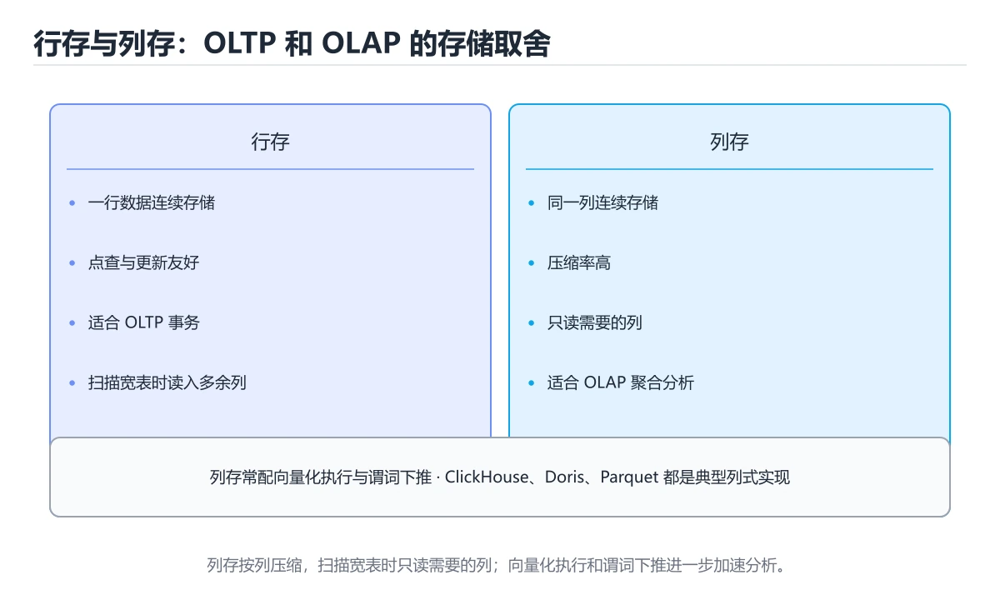
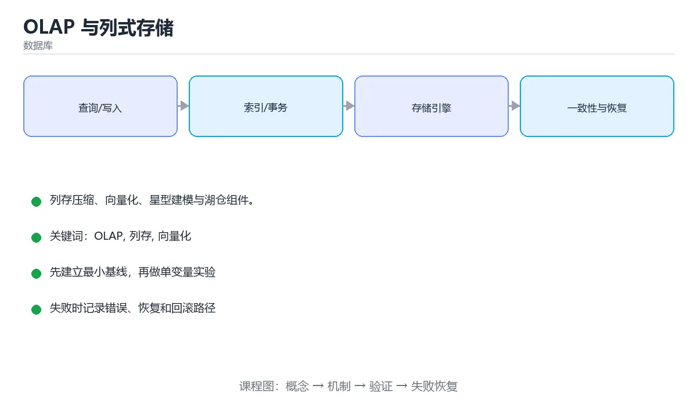

# OLAP 与列式存储

> 内容更新时间：2026-10-06 · 学习阶段：进阶 · 预计用时：25 分钟





## 学习目标

- 能用自己的话解释OLAP 与列式存储解决了什么问题，而不是只背术语。
- 能说清 「OLAP」、「列存」、「向量化」、「星型模型」 之间的关系，并分别举出一个例子。
- 能把本课知识放回「数据库」的知识体系，说明它和相邻主题的边界。
- 能完成本课练习，并用验收标准检查自己的结果。

> 一句话摘要：列存压缩、向量化、星型建模与湖仓组件。

## 前置知识

- 先完成上一课《分布式事务与共识》；如果已经掌握，可以直接用本课练习自测。
- 本课阶段：进阶。建议先掌握同一分类的基础课程，并能独立运行正文中的最小示例。
- 开始前先复习：OLAP、列存、向量化。
- 如果某一步看不懂，先记录具体卡点，完成练习后再回头读一遍。

## OLTP 与 OLAP

| 维度 | OLTP | OLAP |
| --- | --- | --- |
| 负载 | 高频小事务读写 | 少量大扫描聚合 |
| 典型查询 | 按主键取一行 | 全表扫描 + 分组统计 |
| 存储 | 行存 | 列存 |
| 优化目标 | 延迟与并发 | 吞吐与扫描效率 |

把分析查询跑在业务库上会拖垮线上服务，因此需要独立的分析存储（数据仓库/湖仓）。

## 列式存储为什么快

1. **只读需要的列**：分析通常只涉及少数列，列存避免读整行。
2. **压缩率高**：同列数据类型一致，可用字典编码、RLE、Delta 编码，压缩后 IO 大幅减少。
3. **向量化执行**：按批处理而非逐行，配合 SIMD 提升 CPU 效率。
4. **列级统计**：每列保存 min/max，可跳过不相关的数据块。

## 建模方式

| 模型 | 结构 | 特点 |
| --- | --- | --- |
| 星型模型 | 事实表 + 维度表 | 查询简单，主流选择 |
| 雪花模型 | 维度继续规范化 | 省空间但 JOIN 更多 |
| 宽表 | 预关联成大表 | 查询最快，冗余与更新成本高 |

事实表存度量（金额、数量）与外键，维度表存描述属性（时间、地区、商品）。常用优化：**分区**（按日期）、**分桶**（按高基数列）、**物化视图**（预聚合）、**预计算汇总表**。

## 典型组件

| 组件 | 定位 |
| --- | --- |
| ClickHouse | 单表极致查询性能，适合日志与实时分析 |
| Apache Doris / StarRocks | MPP 架构，支持高并发点查与联邦查询 |
| Hive / Spark SQL | 离线数仓，批处理为主 |
| 数据湖（Iceberg/Hudi/Delta） | 在对象存储上提供事务与时间旅行 |

湖仓一体（Lakehouse）试图用一套存储同时满足分析与机器学习需求。

## 实践建议

1. 分层建模：ODS（原始）→ DWD（明细）→ DWS（汇总）→ ADS（应用）。
2. 大表必须分区，避免全表扫描。
3. 高基数分组注意内存溢出，必要时用近似算法（HyperLogLog、分位数近似）。
4. 指标口径统一放在 DWS 层，避免各报表口径不一致。
5. 冷热分层：热数据放高性能存储，历史数据转对象存储。

## 本课小结
OLAP 的性能来自**列存 + 压缩 + 向量化 + 分区裁剪**，工程上则依赖分层建模与口径治理；两者缺一不可。

## 行存与列存对照

| 维度 | 行存（OLTP） | 列存（OLAP） |
| --- | --- | --- |
| 存储方式 | 一行连续存放 | 一列连续存放 |
| 优势场景 | 单行读写、事务 | 大范围扫描、聚合 |
| 压缩率 | 低 | 高（同列类型一致） |
| 写入 | 适合频繁小写入 | 适合批量写入 |
| 典型系统 | MySQL、PostgreSQL | ClickHouse、Doris、Snowflake |
| 向量化 | 有限 | 天然适配 |

## 建模速查

| 模型 | 结构 | 特点 |
| --- | --- | --- |
| 星型模型 | 事实表 + 维度表 | 维度少、JOIN 少、易理解 |
| 雪花模型 | 维度表再规范化 | 省空间、JOIN 多 |
| 宽表 | 打平所有维度 | 查询最快、ETL 成本高 |
| 预聚合 | 提前算好指标 | 查询极快、灵活性差 |

| 技术 | 作用 |
| --- | --- |
| 字典编码 | 低基数列映射为整数 ID |
| 游程编码 | 连续重复值只存一次 |
| 位图索引 | 低基数维度快速过滤 |
| 分区裁剪 | 只扫描相关分区 |
| 排序键 / 主键 | 决定数据有序与跳数索引效率 |
| 物化视图 | 保存预聚合结果 |
| 向量化执行 | 批量处理 + SIMD |

```sql
-- ClickHouse 风格：排序键决定扫描效率
CREATE TABLE events (
    event_date Date,
    user_id    UInt64,
    event_type LowCardinality(String),   -- 低基数列用字典编码
    amount     Decimal(12, 2)
) ENGINE = MergeTree
PARTITION BY toYYYYMM(event_date)
ORDER BY (event_type, event_date, user_id);   -- 高频过滤列放前面

-- 预聚合：把日粒度结果物化，查询时直接扫小表
CREATE MATERIALIZED VIEW daily_sales_mv
ENGINE = SummingMergeTree
PARTITION BY toYYYYMM(day)
ORDER BY (day, category)
AS SELECT
    toDate(created_at) AS day,
    category,
    sum(amount)  AS total_amount,
    count()      AS order_count
FROM orders
GROUP BY day, category;

-- 查询时先看扫描量：分区裁剪是否生效
EXPLAIN SELECT category, sum(total_amount)
FROM daily_sales_mv
WHERE day BETWEEN '2025-09-01' AND '2025-09-30'
GROUP BY category;
```

## 常见错误对照表

| 容易踩的做法 | 实际现象 | 原因与正确做法 |
| --- | --- | --- |
| 在列存上做高频单行更新 | 性能极差 | 列存面向批量写入，单行更新代价高 |
| 用列存库跑点查业务 | 并发与延迟不达标 | OLTP 用行存，分析用列存 |
| 排序键乱序 | 扫描量大 | 按高频过滤与聚合维度排序 |
| 不分区直接全表扫 | 查询慢、成本高 | 用时间或业务维度分区裁剪 |
| 高基数维度上建位图索引 | 索引膨胀 | 位图适合低基数 |
| 宽表无限膨胀 | 存储与 ETL 成本高 | 分级建模，控制宽表粒度 |
| 预聚合覆盖所有场景 | 维度组合爆炸 | 只预聚合高频查询，其余走明细 |
| 忽视数据倾斜 | 部分节点慢 | 调整分桶键或加盐打散 |
| 只用行数评估成本 | 低估扫描字节数 | 关注扫描数据量与列数 |
| 不做压测就上生产 | 查询超时 | 用真实数据量测试 P95 延迟 |

## 自测清单

- [ ] 能说出行存与列存的适用边界。
- [ ] 会按高频过滤列设计排序键与分区。
- [ ] 低基数列用字典或位图，高基数列用排序或跳数索引。
- [ ] 预聚合只覆盖高频查询，明细保留可回溯。
- [ ] 用扫描数据量与 P95 延迟评估查询成本。

## 动手练习

> 本课练习重点：围绕「OLAP、列存、向量化」完成复述、实验和交付，每个结果都要能被别人检查。

先写 schema 与查询，再补边界和失败数据，最后看执行计划与锁等待。

### 练习 1：建立心智模型（10 分钟）

合上教程，用 3～5 句话回答：

1. OLAP 与列式存储解决了什么问题？
2. 如果没有它，会出现什么具体后果？
3. 它和「列存」是什么关系？

**验收标准**：至少出现一个本课关键词，并写出一个反例、边界条件或失效场景。

### 练习 2：做一次可控实验（20 分钟）

从正文中选一个最小示例，完成以下操作：

1. 先预测修改一个参数、输入或步骤后的结果。
2. 再实际执行或逐步推演，记录真实结果。
3. 如果结果与预测不同，写出差异原因。

**验收标准**：留下「原例 → 改动 → 预测 → 结果 → 原因」五步记录。

### 练习 3：交付一个小结果（30 分钟）

在 SQLite 或纸面表结构上写查询，分别验证正常数据、空值和边界数据。

任务要求：

- 结果必须能被别人检查，不能只写“我已经理解了”。
- 至少覆盖「OLAP」和「列存」两个关键词。
- 写出 1 个仍然不确定的问题，以及下一步如何验证。

> 提示：时间有限时优先做练习 1 和练习 2；练习 3 可以拆成两次完成。

## 深入补充：OLAP 与列式存储

前面已经建立了基本概念。这一节换一个角度，把OLAP 与列式存储放进真实工程里，
重点回答三件事：它为什么存在、内部如何运转、什么时候会失效。

### 一、核心模型

OLAP 面向分析查询，通常扫描大量行、只读取少数列并做聚合；列式存储把同一列的值连续放置，配合压缩、向量化执行和分区裁剪，显著降低 I/O 与 CPU 开销。

```text
分析 SQL → 逻辑计划 → 列裁剪与谓词下推 → 分区/文件裁剪 → 列式扫描 → 向量化聚合 → 结果合并
```

### 二、关键机制拆解

1. 行存适合点查和事务，列存适合全表扫描、聚合和宽表分析，因为一次只需读取相关列。
2. 列内数据类型一致，压缩效果通常远好于行存，常见编码包括字典、游程、位图和差值编码。
3. 向量化执行按批处理数据，减少虚函数调用和分支，配合 SIMD 能把 CPU 利用率提高数倍。
4. 延迟物化先只处理过滤列，确定命中行后再读取其他列，避免为未通过过滤的数据做无效 I/O。
5. 分区、分桶、排序键和 zone map 让查询跳过无关文件或数据块，是列存性能的第一层保障。
6. MPP 架构把扫描和聚合下推到多个节点并行执行，但网络 shuffle 和热点节点会成为新瓶颈。

### 三、对照表：抓住容易混淆的边界

| 维度 | 一侧 | 另一侧 |
| --- | --- | --- |
| 行存 | 一行数据连续存放 | 适合点查、更新和事务 |
| 列存 | 一列数据连续存放 | 适合扫描、聚合和分析 |
| 行式执行 | 逐行处理，解释开销大 | 通用性好但 CPU 效率低 |
| 向量化执行 | 按批处理并利用 SIMD | 分析吞吐高但对实现有要求 |

### 四、工作示例

查询 `SELECT city, sum(amount) FROM orders WHERE dt='2026-10-01' GROUP BY city` 时，列存只需读取 dt、city、amount 三列；若按 dt 分区，可直接跳过其他日期文件；聚合按批处理并只输出城市维度结果。

### 五、常见误区与失效边界

| 错误做法或假设 | 后果 | 正确做法 |
| --- | --- | --- |
| 把列存当成万能加速器 | 小点查和频繁更新反而更慢 | 按查询模式选择存储格式 |
| 只建分区不做文件大小治理 | 小文件过多，元数据开销压垮查询 | 合并小文件并控制单文件大小 |
| 忽略数据倾斜 | 少数节点处理大部分数据 | 分桶、加盐或改写聚合键 |
| 为压缩牺牲可扫描性 | 解压开销超过 I/O 节省 | 按列特征选择编码并做基准测试 |

### 六、场景推演

报表查询从 30 秒降到 3 秒，优化顺序是：先看扫描了多少列和文件，再检查分区裁剪和谓词下推，然后确认聚合是否向量化，最后才调整硬件。多数慢查询的问题在“读多了”，而不是“算慢了”。

### 七、自测问答

**Q1：为什么列存压缩率通常更高？**

同一列类型一致、重复模式稳定，适合字典或游程编码。

**Q2：延迟物化节省了什么？**

避免为未通过过滤的行读取非必要列。

**Q3：分区裁剪发生在什么阶段？**

在扫描前根据谓词排除无关分区或文件。

**Q4：MPP 的新瓶颈通常是什么？**

节点间 shuffle、数据倾斜和网络带宽。

### 八、小项目：把知识变成可检查的产出

用同一份 100 万行订单数据生成行存 CSV 和列存 Parquet，分别执行点查、单列聚合和多列分组；记录扫描字节、耗时和文件大小，写出列存优势与不适用场景。

### 九、适用边界

列存优化的是分析扫描与聚合，不擅长高频单行更新、强事务和随机点查。HTAP 系统通常需要行列混合或冷热分层，而不是用一套格式解决所有问题。

### 十、完成检查清单

- [ ] 能区分 OLTP 与 OLAP 的访问模式
- [ ] 能解释列存压缩和向量化执行
- [ ] 能使用分区、分桶和排序键做裁剪
- [ ] 能识别 MPP 的 shuffle 与倾斜问题
- [ ] 能为一份数据选择行存或列存

## 可运行练习

### 任务 1：先跑通，再解释

```sql
-- ClickHouse 风格：排序键决定扫描效率
CREATE TABLE events (
    event_date Date,
    user_id    UInt64,
    event_type LowCardinality(String),   -- 低基数列用字典编码
    amount     Decimal(12, 2)
) ENGINE = MergeTree
PARTITION BY toYYYYMM(event_date)
ORDER BY (event_type, event_date, user_id);   -- 高频过滤列放前面

-- 预聚合：把日粒度结果物化，查询时直接扫小表
CREATE MATERIALIZED VIEW daily_sales_mv
ENGINE = SummingMergeTree
PARTITION BY toYYYYMM(day)
ORDER BY (day, category)
AS SELECT
    toDate(created_at) AS day,
    category,
    sum(amount)  AS total_amount,
    count()      AS order_count
FROM orders
GROUP BY day, category;

-- 查询时先看扫描量：分区裁剪是否生效
EXPLAIN SELECT category, sum(total_amount)
FROM daily_sales_mv
WHERE day BETWEEN '2025-09-01' AND '2025-09-30'
GROUP BY category;
```

### 任务 2：只改一个条件

把「OLAP 与列式存储」的最小示例复制一份，只改一个条件再跑一次：

- 改动点：只把OLAP的输入换成空值、极值或错误输入，其余保持不变。
- 预测：先写下「OLAP 与列式存储」在改动后的输出或错误信息，再运行。
- 记录：对照改动前后的结果，指出差异出在哪一步。
- 验收：换回原条件能复现原结果，改动只影响OLAP。

### 任务 3：迁移到自己的数据

用同一套思路处理一组你自己的数据或场景，保持输出格式与任务 1 一致。

## 故障现场

### 现场 1：本课的 OLAP 常规用例通过，但边界用例失败

**症状**：在本课的练习或生产场景里出现“本课的 OLAP 常规用例通过，但边界用例失败”。

**复现**：准备一组最小输入，只保留触发“本课的 OLAP 常规用例通过，但边界用例失败”的必要条件，连续运行两次确认结果稳定。

**定位**：围绕“OLAP 的前置条件与取值边界没有写进代码，默认值掩盖了空值和极值”检查调用链、输入数据和环境配置，先验证假设再改代码。

**预防**：把“本课的 OLAP 常规用例通过，但边界用例失败”写成一条自动化用例，并在本课的验收清单里保留对应检查项。

### 现场 2：本课的 列存 结果在两次运行之间不一致

**症状**：在本课的练习或生产场景里出现“本课的 列存 结果在两次运行之间不一致”。

**复现**：准备一组最小输入，只保留触发“本课的 列存 结果在两次运行之间不一致”的必要条件，连续运行两次确认结果稳定。

**定位**：围绕“列存 依赖了当前版本、执行顺序或共享状态，单次运行无法暴露差异”检查调用链、输入数据和环境配置，先验证假设再改代码。

**预防**：把“本课的 列存 结果在两次运行之间不一致”写成一条自动化用例，并在本课的验收清单里保留对应检查项。

### 现场 3：同一条 SQL 在数据量变大后突然变慢

**症状**：在本课的练习或生产场景里出现“同一条 SQL 在数据量变大后突然变慢”。

**定位**：围绕“执行计划随统计信息或数据分布改变，OLAP 的索引没有被用上，回表次数反而增加”检查调用链、输入数据和环境配置，先验证假设再改代码。

## 本课复习清单

离开本课前，逐项确认：

- [ ] 不看解析，能说出「列式存储快的主要原因是？」的判断依据。
- [ ] 不看解析，能说出「星型模型由什么组成？」的判断依据。
- [ ] 不看解析，能说出「大表分析的必备优化是？」的判断依据。
- [ ] 不看解析，能说出「列式存储为什么压缩率高？」的判断依据。
- [ ] 不看解析，能说出「向量化执行的作用是？」的判断依据。
- [ ] 不看解析，能说出的判断依据。
- [ ] 至少运行一次本课示例，记录输入、输出和一个边界情况。
- [ ] 把本课最容易混淆的两个概念写成一句话对照。

| 复盘项 | 记录 |
| --- | --- |
| 已经能独立解释的考点 |  |
| 仍然说不清的概念 |  |
| 下一步验证动作 |  |

## 术语速查

| 术语 | 本课语境 |
| --- | --- |
| `OLAP` | OLAP 面向分析查询，通常扫描大量行、只读取少数列并做聚合；列式存储把同一列的值连续放置，配合压缩、向量化执行和分区裁剪，显著降低 I/O 与 CPU 开销。 |
| `列存` | 围绕“列存 依赖了当前版本、执行顺序或共享状态，单次运行无法暴露差异”检查调用链、输入数据和环境配置，先验证假设再改代码。 |
| `向量化` | OLAP 的性能来自列存 + 压缩 + 向量化 + 分区裁剪，工程上则依赖分层建模与口径治理；两者缺一不可。 |
| `星型模型` | 它在「OLAP 与列式存储」里是理解「星型模型」的关键术语，用来解释定义、适用条件与失败路径；它与OLAP、列存共同决定这一节的判断边界。复习时回到正文示例核对输入、输出和验证方式。 |
| `数仓分层` | 它在「OLAP 与列式存储」里是理解「数仓分层」的关键术语，用来解释定义、适用条件与失败路径；它与OLAP、列存共同决定这一节的判断边界。复习时回到正文示例核对输入、输出和验证方式。 |

## 考点精讲

### 考点 1：概念判断·OLAP

- **题目**：列式存储快的主要原因是？
- **判断依据**：分析查询只涉及少数列，列存避免读整行并大幅减少 IO。在「OLAP 与列式存储」里，其他选项：列存只读需要的列且同列压缩率高，IO 量更小。这道题的关键在「OLAP 与列式存储」的OLAP、列存、向量化：先确认题干“列式存储快的主要原因是”问的是哪一步，再排除偷换前提的选项。把“只读需要的列且同列压缩率高”代回「OLAP 与列式存储」里“列式存储快的主要原因是”的例子核对，条件一旦改变，结论就要用OLAP、列存、向量化重新推导。

### 考点 2：代码补全·OLAP

- **题目**：阅读「OLAP 与列式存储」正文里的这段 SQL 代码，下面哪一项判断是正确的？
- **判断依据**：在「OLAP 与列式存储」里，题干的正确项是这段代码只做静态声明，没有循环、分支或可观察输出，在「OLAP 与列式存储」里它只能证明OLAP相关约束存在，不能替代真实运行证据。把输入或边界换成空值、极值或失败情况后，结论要以「OLAP 与列式存储」的实际运行结果为准。这道题的关键在「OLAP 与列式存储」的OLAP、列存、向量化：先确认题干“阅读OLAP 与列式存储正文里的这段”问的是哪一步，再排除偷换前提的选项。

### 考点 3：多选辨析·OLAP

- **题目**：围绕“OLAP 与列式存储”中的 OLAP、列存、向量化，下列哪两项是本课强调的实践判断？
- **判断依据**：本课把OLAP 与列式存储拆成概念、示例与故障现场三部分，因此判断 OLAP 时必须同时交代输入、输出和失败路径，这使“学习 OLAP 时要同时说明输入、输出和失败路径，不能只看正常流程”成立。在OLAP 与列式存储里，判断 列存 时要固定版本与边界输入，所以“验证 列存 时要固定版本并覆盖边界输入，结论才可复现”才可复现。

### 考点 4：概念判断·OLAP

- **题目**：列式存储为什么压缩率高？
- **判断依据**：压缩后 IO 量下降，这也是列存分析快的核心原因之一。在「OLAP 与列式存储」里，作答时，先用OLAP建立输入与输出的基线，再把同一列数据类型一致，重复度高代入边界条件核对，结论才能复现。在「OLAP 与列式存储」里，这道题要求区分概念与边界，「同一列数据类型一致，重复度高」只有在题干给出的前提下才成立，而「列存不需要读取数据」、「列存会丢弃部分数据」缺少同一组条件。

### 考点 5：概念判断·OLAP

- **题目**：向量化执行的作用是？
- **判断依据**：在「OLAP 与列式存储」里，按批处理数据并使用 CPU SIMD 指令，减少函数调用与解释开销。向量化 + 列存是现代 OLAP 引擎提升吞吐的标准组合。在「OLAP 与列式存储」里判断这道题，要把OLAP、列存、向量化的条件、过程与失败路径逐项对齐，换成“向量化执行的作用是”这个场景，只有满足前提的结论才成立。

### 考点 6：填空·OLAP

- **题目**：补全代码：「OLAP 与列式存储」示例中，下面这行代码缺少哪个关键字或函数名？请填入 ____。 `-- ____ 风格：排序键决定扫描效率`
- **判断依据**：在「OLAP 与列式存储」里，ClickHouse。回到「OLAP 与列式存储」的正文示例，用“补全代码”走一遍OLAP、列存、向量化的完整流程，能复现的结论才可以保留。回到OLAP、列存、向量化本身再看一遍：只有“ClickHouse”与题干“OLAP”的前提一致，结论才成立。

## English Overview

**Title:** OLAP & Columnar Storage

**Summary:** Columnar storage, vectorization and star schema.

**Category:** Database
**Level:** 进阶
**Key terms:** OLAP, 列存, 向量化, 星型模型, 数仓分层

## 内容元数据

- 内容版本：v2.0
- 最后更新：2026-10-06
- 学习阶段：进阶
- 适用环境：PostgreSQL / MySQL / SQLite 等主流数据库
- 内容来源：内置结构化课程与工程实践整理
- 相关主题：OLAP、列存、向量化、星型模型、数仓分层
- 质量版本：P0 测验标准 + P1 覆盖扩展 + P2 体验补全

## 参考资料与复核

- 最后复核：2026-10-04
- 下次复核：2027-04-04
- 复核范围：版本兼容、API 行为、安全建议与工程实践
- 来源性质：官方文档、标准或权威教材；正文为离线教学重组

| 参考资料 | 本课用途 |
| --- | --- |
| [MySQL 文档](https://dev.mysql.com/doc/) | 关系数据库与 InnoDB |
| [PostgreSQL 文档](https://www.postgresql.org/docs/) | SQL、索引、事务与并发 |
| [SQLite 文档](https://sqlite.org/docs.html) | 嵌入式 SQL 与事务 |

> 「OLAP 与列式存储」的链接用于离线阅读后的延伸核对；App 不会自动联网。
