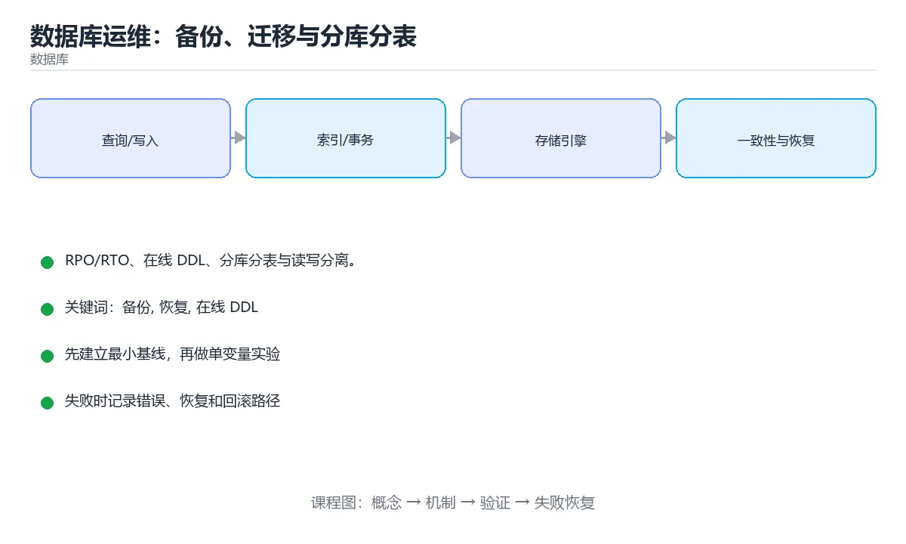

# 数据库运维：备份、迁移与分库分表



> 内容更新时间：2026-10-03 · 学习阶段：高级 · 预计用时：16 分钟

## 学习目标

- 能用自己的话解释「数据库运维：备份、迁移与分库分表」解决了什么问题，而不是只背术语。
- 能说清 「备份」、「恢复」、「在线 DDL」、「分库分表」 之间的关系，并分别举出一个例子。
- 能把本课知识放回「数据库」的知识体系，说明它和相邻主题的边界。
- 能完成本课练习，并用验收标准检查自己的结果。

> 一句话摘要：RPO/RTO、在线 DDL、分库分表与读写分离。

## 前置知识

- 先完成上一课《MySQL 锁与 MVCC》；如果已经掌握，可以直接用本课练习自测。
- 本课阶段：高级。建议具备同一方向的完整基础，能阅读较长的代码、配置或系统设计说明。
- 开始前先复习：备份、恢复、在线 DDL。
- 如果某一步看不懂，先记录具体卡点，完成练习后再回头读一遍。


## 备份与恢复

备份的价值只有在**恢复演练成功**时才成立。三类备份：全量（可独立恢复）、增量（自上次全量以来的变化）、日志备份（binlog/WAL，支持时间点恢复）。

| 指标 | 含义 |
| --- | --- |
| RPO | 可容忍丢失多少数据，决定备份频率 |
| RTO | 可容忍停机多久，决定恢复方案 |

MySQL 常用 mysqldump（逻辑备份，适合小库）与 xtrabackup（物理热备，适合大库）；PostgreSQL 用 pg_dump 配合 WAL 归档。关键是**异地保存 + 定期演练恢复**，否则备份可能早已损坏。

## 数据迁移

常见场景：加字段、改类型、拆表、换库。原则是**可回滚、可灰度、不阻塞业务**：

1. 大表加字段用在线 DDL（Online DDL 或 pt-online-schema-change），避免长时间锁表。
2. 双写阶段：新旧结构同时写，验证一致性后再切换读取。
3. 回填历史数据要限速分批，避开业务高峰。
4. 切换前保留回滚开关，切换后观察一段时间再下线旧结构。

## 分库分表

单表过大（常见阈值千万级）时，读写性能与 DDL 成本都会急剧上升。

| 拆分方式 | 说明 | 注意 |
| --- | --- | --- |
| 垂直拆分 | 按业务把表分到不同库 | 减少单库压力，跨库 JOIN 变难 |
| 水平拆分 | 同一张表按分片键分散 | 分片键选择决定是否均匀 |

分片键要选**查询最常用且分布均匀**的字段（如 user_id）。哈希取模分布均匀但扩容需迁移；范围分片易扩容但可能热点。分片后跨片查询、分布式事务与全局唯一 ID 都需要额外方案（如雪花算法）。

## 读写分离

主库写、从库读，通过复制同步。要特别注意**主从延迟**：写完立刻读可能读到旧数据，可用写后短时间走主库（读写绑定），或用半同步复制缩小延迟窗口。

## 日常运维清单

1. 监控慢查询、连接数、复制延迟、磁盘水位与锁等待。
2. 定期分析表并更新统计信息，避免优化器选错执行计划。
3. 专项治理大事务与长事务，它们是锁等待与空间膨胀的根源。
4. 变更走工单与评审，DDL 在低峰执行并准备回滚脚本。
5. 演练主从切换与故障恢复，确认 RPO/RTO 达标。

## 备份与恢复的关键参数

| 场景 | 工具与关键参数 | 说明 |
| --- | --- | --- |
| 小库逻辑备份 | mysqldump 加 `--single-transaction` | InnoDB 一致性快照，不锁表 |
| 备份完整性 | 同时导出 `--routines --triggers --events` | 否则恢复后缺存储过程与定时任务 |
| 大库物理备份 | xtrabackup `--backup` 后必须 `--prepare` | 未 prepare 的数据目录不可直接启动 |
| 时间点恢复 | 全量备份 + binlog 重放（指定 start/stop datetime） | 可精确恢复到误删前一刻 |
| 恢复验证 | 恢复到独立实例后跑校验查询与行数比对 | 未演练过的备份不能算有效备份 |

演练清单：确认备份文件可读、恢复到隔离环境、比对关键表行数与金额汇总、跑一遍核心业务查询、记录**实际恢复耗时（RTO）与丢失窗口（RPO）**，并把耗时写进故障预案。

## 在线 DDL 的安全步骤

1. 评估表大小与预估耗时（查 information_schema 的数据与索引长度）。
2. 优先用原生 Online DDL；不支持或大表改用 pt-online-schema-change / gh-ost（建影子表 + 增量同步 + 分批拷贝 + 原子改名）。
3. 低峰执行并限速：限制复制延迟上限与每批处理时间，避免拖垮主库。
4. 执行中监控复制延迟、锁等待、磁盘剩余空间（影子表需要额外空间）。
5. 保留回滚路径：改名前旧表仍在，异常时可直接切回。

## 本课小结
数据库运维的核心是**数据不丢、可用性可控、变更可回滚**。分库分表是最后手段，先优化索引与 SQL，再考虑拆分。

<!-- appendix:v1 -->

## 备份策略速查

| 备份类型 | 特点 | 恢复速度 | 适用 |
| --- | --- | --- | --- |
| 逻辑备份 | `mysqldump`、`pg_dump`，纯 SQL | 慢 | 小库、跨版本迁移 |
| 物理备份 | 复制数据文件（XtraBackup） | 快 | 大库、在线备份 |
| 全量备份 | 完整副本 | 中 | 周期性基线 |
| 增量备份 | 只备份变化 | 恢复需串联 | 大库日常 |
| 二进制日志 | 记录所有变更 | 可做时间点恢复 | 误删数据恢复 |

关键原则：**备份的价值只有在恢复演练成功后才被证明**。备份要考虑 RPO（可容忍丢失多少数据）与 RTO（多久恢复）。

```bash
# 逻辑备份（MySQL 示例）
mysqldump --single-transaction --routines --triggers \
  --set-gtid-purged=OFF app > app_$(date +%F).sql

# 物理备份（XtraBackup 示例）
xtrabackup --backup --target-dir=/backup/full
xtrabackup --prepare --target-dir=/backup/full

# 从 binlog 恢复到指定时间点（误删之后的时间）
mysqlbinlog --start-datetime="2025-09-01 00:00:00" \
            --stop-datetime="2025-09-01 10:29:59" \
  binlog.000123 | mysql -u root app

# 校验备份可恢复性：恢复到临时实例再跑一致性检查
mysql -u root -e "CREATE DATABASE verify;"
mysql -u root verify < app_2025-09-01.sql
mysql -u root verify -e "CHECK TABLE orders;"
```

## 在线 DDL 与迁移速查

| 方式 | 影响 | 适用 |
| --- | --- | --- |
| 直接 `ALTER TABLE` | 可能长时间锁表 | 小表或支持 instant 的变更 |
| `ALGORITHM=INPLACE` | 不重建表（部分变更） | 加二级索引等 |
| `ALGORITHM=INSTANT` | 仅改元数据 | 加列（MySQL 8，末尾列） |
| gh-ost / pt-osc | 影子表 + 增量同步 + 切换 | 大表结构变更 |

迁移原则：**只做可回滚、可分批、可重复执行的变更**。先加字段（可空）→ 双写 → 回填 → 切读 → 删旧字段。

## 分库分表速查

| 维度 | 方案 | 注意 |
| --- | --- | --- |
| 垂直分库 | 按业务拆分 | 跨库 JOIN 消失，需服务化 |
| 水平分表 | 按分片键拆分 | 分片键决定查询能力 |
| 分片键 | 用户 ID、租户 ID | 尽量让高频查询带分片键 |
| 全局 ID | 雪花算法、号段模式 | 趋势递增、避免枚举 |
| 跨片查询 | 异构索引、宽表同步 | 需要额外数据同步 |
| 扩容 | 成倍扩容、一致性哈希 | 避免大范围数据搬迁 |

## 常见错误对照表

| 容易踩的做法 | 实际现象 | 原因与正确做法 |
| --- | --- | --- |
| 备份从不演练恢复 | 真出事时恢复失败 | 定期做恢复演练并记录耗时 |
| 只做全量备份 | 恢复点太旧 | 全量 + 增量 + binlog |
| 备份与主库放同一块盘 | 一起损坏 | 异地或对象存储保存 |
| 业务高峰做 DDL | 锁表影响线上 | 低峰执行并限速，或用 gh-ost |
| 一次性删除大量数据 | 长事务、主从延迟 | 分批删除，控制每批行数 |
| 分片键选错 | 高频查询跨所有分片 | 按最常用查询维度选分片键 |
| 扩容用取模 | 几乎全量搬迁 | 用成倍扩容或一致性哈希 |
| 读写分离后立即回读主库 | 数据看起来丢了 | 写后短时间读主库或加同步等待 |
| 无慢查询与延迟监控 | 故障后才发现 | 加延迟、慢查询、复制延迟告警 |
| 迁移脚本不可重复执行 | 重跑报错 | 设计成幂等（存在即跳过） |

## 自测清单

- [ ] 明确 RPO 与 RTO 并据此设计备份策略。
- [ ] 定期做恢复演练并记录恢复耗时。
- [ ] 大表结构变更使用在线 DDL 工具。
- [ ] 数据清理分批执行，避免长事务。
- [ ] 分片键按高频查询维度选择，扩容方案避免全量搬迁。

## 动手练习

<!-- practice-diversified:v1 -->

> 本课练习重点：围绕「备份、恢复、在线 DDL」完成复述、实验和交付，每个结果都要能被别人检查。

先写 schema 与查询，再补边界和失败数据，最后看执行计划与锁等待。

### 练习 1：建立心智模型（10 分钟）

合上教程，用 3～5 句话回答：

1. 「数据库运维：备份、迁移与分库分表」解决了什么问题？
2. 如果没有它，会出现什么具体后果？
3. 它和「恢复」是什么关系？

**验收标准**：至少出现一个本课关键词，并写出一个反例、边界条件或失效场景。

### 练习 2：做一次可控实验（20 分钟）

从正文中选一个最小示例，完成以下操作：

1. 先预测修改一个参数、输入或步骤后的结果。
2. 再实际执行或逐步推演，记录真实结果。
3. 如果结果与预测不同，写出差异原因。

**验收标准**：留下「原例 → 改动 → 预测 → 结果 → 原因」五步记录。

### 练习 3：交付一个小结果（30 分钟）

在 SQLite 或纸面表结构上写查询，分别验证正常数据、空值和边界数据。

任务要求：

- 结果必须能被别人检查，不能只写“我已经理解了”。
- 至少覆盖「备份」和「恢复」两个关键词。
- 写出 1 个仍然不确定的问题，以及下一步如何验证。

> 提示：时间有限时优先做练习 1 和练习 2；练习 3 可以拆成两次完成。

<!-- scaffold:v1 -->

<!-- p2-enrichment:v1 -->

## English Overview

**Title:** Database Operations

**Summary:** Backup, migration, sharding and replication.

**Category:** Database  
**Level:** 高级  
**Key terms:** 备份, 恢复, 在线 DDL, 分库分表, 读写分离

> The full tutorial is written in Chinese. This bilingual overview helps English readers identify the topic, scope and key terms before studying the detailed examples.

## 内容元数据

- 内容版本：v2.0
- 最后更新：2026-10-03
- 学习阶段：高级
- 适用环境：PostgreSQL / MySQL / SQLite 等主流数据库
- 内容来源：内置结构化课程与工程实践整理
- 相关主题：备份、恢复、在线 DDL、分库分表、读写分离
- 质量版本：P0 测验标准 + P1 覆盖扩展 + P2 体验补全

<!-- top50-rewrite:v1 -->

## 课程专属精读：数据库运维：备份、迁移与分库分表

### 一、知识地图

- **备份与恢复**：备份的价值只有在**恢复演练成功**时才成立。三类备份：全量（可独立恢复）、增量（自上次全量以来的变化）、日志备份（binlog/WAL，支持时间点恢复）。
- **数据迁移**：常见场景：加字段、改类型、拆表、换库。原则是**可回滚、可灰度、不阻塞业务**：
- **分库分表**：单表过大（常见阈值千万级）时，读写性能与 DDL 成本都会急剧上升。
- **读写分离**：主库写、从库读，通过复制同步。要特别注意**主从延迟**：写完立刻读可能读到旧数据，可用写后短时间走主库（读写绑定），或用半同步复制缩小延迟窗口。
- **日常运维清单**：1. 监控慢查询、连接数、复制延迟、磁盘水位与锁等待。
- **备份与恢复的关键参数**：理解它的定义、输入、输出和失败边界。
- **在线 DDL 的安全步骤**：1. 评估表大小与预估耗时（查 information_schema 的数据与索引长度）。
- **备份策略速查**：理解它的定义、输入、输出和失败边界。

### 二、机制与验证

| 主题 | 需要回答的问题 | 验证方式 |
| --- | --- | --- |
| 备份与恢复 | 它解决什么问题，输入和输出是什么？ | 最小示例、边界输入、日志或指标 |
| 数据迁移 | 它解决什么问题，输入和输出是什么？ | 最小示例、边界输入、日志或指标 |
| 分库分表 | 它解决什么问题，输入和输出是什么？ | 最小示例、边界输入、日志或指标 |
| 读写分离 | 它解决什么问题，输入和输出是什么？ | 最小示例、边界输入、日志或指标 |
| 日常运维清单 | 它解决什么问题，输入和输出是什么？ | 最小示例、边界输入、日志或指标 |
| 备份与恢复的关键参数 | 它解决什么问题，输入和输出是什么？ | 最小示例、边界输入、日志或指标 |
| 在线 DDL 的安全步骤 | 它解决什么问题，输入和输出是什么？ | 最小示例、边界输入、日志或指标 |
| 备份策略速查 | 它解决什么问题，输入和输出是什么？ | 最小示例、边界输入、日志或指标 |

### 三、专属检查问题

1. 备份与恢复 与相邻主题的边界是什么？
2. 数据迁移 与相邻主题的边界是什么？
3. 分库分表 与相邻主题的边界是什么？
4. 读写分离 与相邻主题的边界是什么？
5. 日常运维清单 与相邻主题的边界是什么？
6. 备份与恢复的关键参数 与相邻主题的边界是什么？
7. 在线 DDL 的安全步骤 与相邻主题的边界是什么？
8. 备份策略速查 与相邻主题的边界是什么？

### 四、故障排查

1. 固定输入和环境，确认问题能复现。
2. 找到第一个异常状态，不从最终错误倒猜。
3. 只改变一个变量，记录预测和真实结果。
4. 修复后补边界、失败和重复执行测试。

<!-- p2-references:v1 -->

## 参考资料与复核

- 最后复核：2026-10-04
- 下次复核：2027-04-04
- 复核范围：版本兼容、API 行为、安全建议与工程实践
- 来源性质：官方文档与标准；本课正文为离线教学重组，不复制原文

| 参考资料 | 本课用途 |
| --- | --- |
| [PostgreSQL 文档](https://www.postgresql.org/docs/) | SQL、索引与事务 |
| [SQLite 文档](https://sqlite.org/docs.html) | 嵌入式数据库与 SQL 行为 |

> 本课主题：RPO/RTO、在线 DDL、分库分表与读写分离。

> App 完全离线展示文字链接，不会自动联网；需要延伸阅读时可复制链接到浏览器。

