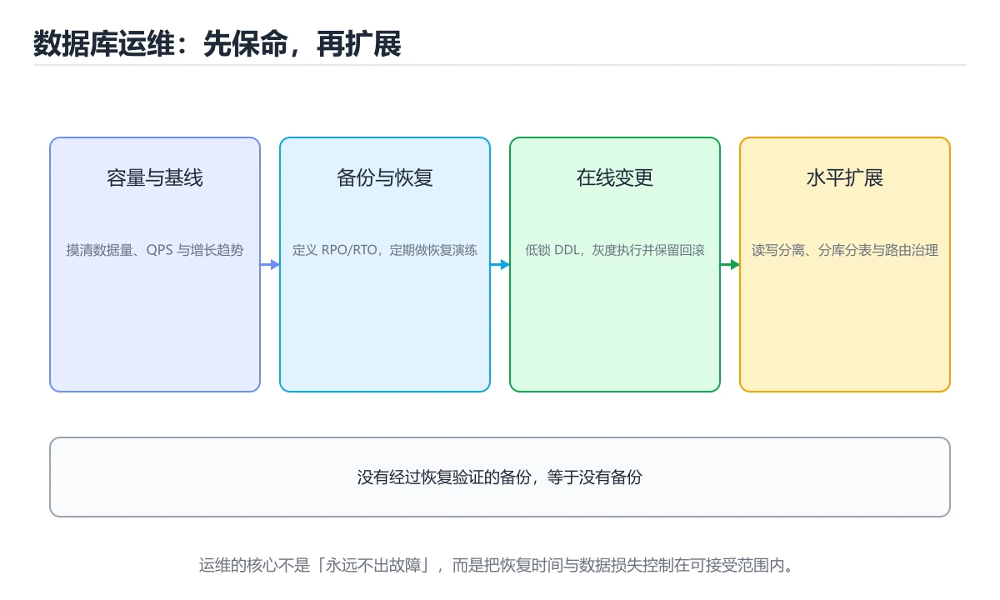

# 数据库运维：备份、迁移与分库分表

> 内容更新时间：2026-10-06 · 学习阶段：高级 · 预计用时：40 分钟




## 本节知识框架

**课程定位**：所属分类为「数据库」，课程主题为「数据库运维：备份、迁移与分库分表」，学习阶段为「高级」，建议用时 40 分钟。

**本课要解决的主问题**：RPO/RTO、在线 DDL、分库分表与读写分离。

| 学习层次 | 要回答的问题 | 完成判据 |
| --- | --- | --- |
| 概念层 | 「数据库运维：备份、迁移与分库分表」有哪些必须区分的对象与术语？ | 能用自己的话定义核心术语，并各举一个正例和一个反例。 |
| 机制层 | 这些对象按什么顺序发生作用，输入如何变成输出？ | 能画出或写出机制步骤，并说明每一步的失败条件。 |
| 应用层 | 什么场景适合使用「数据库运维：备份、迁移与分库分表」，什么场景不适合？ | 能给出一个真实场景、一个最小示例和一个边界案例。 |
| 性能层 | 时间、空间、吞吐或延迟受哪些量影响？ | 能说出复杂度或性能瓶颈的证据来源；没有证据时明确写“材料未提供”。 |
| 复习层 | 怎样确认自己不是只记住了结论？ | 能独立完成本课自测，并把错误定位到概念、机制、示例或边界。 |

### 阅读路线

1. 先读「核心概念定义」，建立「备份」等对象的精确定义。
2. 再读「原理与运行机制」，把定义串成可重复的过程。
3. 用「代码/协议/SQL 示例」验证过程，并只改一个条件观察结果变化。
4. 最后检查性能、易错点、知识关系与自测题，形成可复习的证据链。

**前置知识**：《MySQL 锁与 MVCC》

**学习位置**：本课位于《MySQL 锁与 MVCC》之后；如果前一课的自测不能通过，应先回补再继续。

**后续衔接**：下一课《数据湖与湖仓一体》会继续使用本课术语，学完后建议立即完成一次自测。

**教材衔接：学习目标**

- 能用自己的话解释数据库运维：备份、迁移与分库分表解决了什么问题，而不是只背术语。
- 能说清 「备份」、「恢复」、「在线 DDL」、「分库分表」 之间的关系，并分别举出一个例子。
- 能把 备份 放回「数据库运维：备份、迁移与分库分表」的知识体系，说明它和 恢复 的边界。
- 能完成本课练习，并用验收标准检查自己的结果。

> 一句话摘要：RPO/RTO、在线 DDL、分库分表与读写分离。

**教材衔接：前置知识**

- 先完成上一课《MySQL 锁与 MVCC》；如果已经掌握，可以直接用本课练习自测。
- 开始前先复习：备份、恢复、在线 DDL。
- 如果 备份与恢复 这一步看不懂，先记录具体卡点，再用 DATABASE 复现一遍。

**教材衔接：本课小结**

数据库运维的核心是**数据不丢、可用性可控、变更可回滚**。分库分表是最后手段，先优化索引与 SQL，再考虑拆分。

## 核心概念定义

> 阅读约定：本课先给「数据库运维：备份、迁移与分库分表」相关术语的操作性定义与适用边界；正文里的口语化说法与定义冲突时，以定义和可复现示例为准。

| 术语 | 操作性定义 | 本课中的边界 |
| --- | --- | --- |
| 备份 | 把数据复制到独立位置，以便原数据损坏或误删后恢复。 | 仅在「数据库运维：备份、迁移与分库分表」明确给出的输入、版本与资源条件下成立。 |
| 恢复 | 故障后把数据和服务重新带回可用且一致的状态。 | 仅在「数据库运维：备份、迁移与分库分表」明确给出的输入、版本与资源条件下成立。 |
| 分库分表 | 单表过大（常见阈值千万级）时，读写性能与 DDL 成本都会急剧上升。 | 仅在「数据库运维：备份、迁移与分库分表」明确给出的输入、版本与资源条件下成立。 |
| 读写分离 | 主库写、从库读，通过复制同步。要特别注意主从延迟：写完立刻读可能读到旧数据，可用写后短时间走主库（读写绑定），或用半同步复制缩小延迟窗口。 | 仅在「数据库运维：备份、迁移与分库分表」明确给出的输入、版本与资源条件下成立。 |

### 定义如何使用

在「数据库运维：备份、迁移与分库分表」中判断一个说法是否成立，先确认它使用的是哪个对象的定义，再检查输入规模、运行环境与失败路径。定义不是口号，而是后续推导、代码示例和自测题共享的约束。

## 原理与运行机制

### 机制总览

1. **建立输入**：把「备份」按本课定义整理成可观察、可重复的输入条件。
2. **执行转换**：围绕「恢复」执行本课的核心步骤；每一步都记录中间状态，避免只看最终输出。
3. **产生输出**：得到「分库分表」后，用正文示例或协议/SQL 结果核对输出是否符合预期。
4. **改变一个条件**：只替换一个边界条件或环境参数，观察「数据库运维：备份、迁移与分库分表」的结论是否仍然成立。

| 阶段 | 关注对象 | 失败时应检查 |
| --- | --- | --- |
| 输入 | 备份 | 类型、范围、编码、版本或前置状态是否满足定义。 |
| 处理 | 恢复 | 顺序、可见性、锁、路由、事务或调度规则是否被破坏。 |
| 输出 | 分库分表 | 结果是否可复现，错误是否被正确传播而不是被吞掉。 |

本课的机制结论要用「数据库运维：备份、迁移与分库分表」自己的示例验证。「数据库运维：备份、迁移与分库分表」没有给出某个数量级、吞吐或内存数据时，本课把该判断标为“材料未提供”，不从相邻主题外推。

**教材衔接：备份与恢复**

备份的价值只有在**恢复演练成功**时才成立。三类备份：全量（可独立恢复）、增量（自上次全量以来的变化）、日志备份（binlog/WAL，支持时间点恢复）。

| 指标 | 含义 |
| --- | --- |
| RPO | 可容忍丢失多少数据，决定备份频率 |
| RTO | 可容忍停机多久，决定恢复方案 |

MySQL 常用 mysqldump（逻辑备份，适合小库）与 xtrabackup（物理热备，适合大库）；PostgreSQL 用 pg_dump 配合 WAL 归档。关键是**异地保存 + 定期演练恢复**，否则备份可能早已损坏。

**教材衔接：数据迁移**

常见场景：加字段、改类型、拆表、换库。原则是**可回滚、可灰度、不阻塞业务**：

1. 大表加字段用在线 DDL（Online DDL 或 pt-online-schema-change），避免长时间锁表。
2. 双写阶段：新旧结构同时写，验证一致性后再切换读取。
3. 回填历史数据要限速分批，避开业务高峰。
4. 切换前保留回滚开关，切换后观察一段时间再下线旧结构。

**教材衔接：分库分表**

单表过大（常见阈值千万级）时，读写性能与 DDL 成本都会急剧上升。

| 拆分方式 | 说明 | 注意 |
| --- | --- | --- |
| 垂直拆分 | 按业务把表分到不同库 | 减少单库压力，跨库 JOIN 变难 |
| 水平拆分 | 同一张表按分片键分散 | 分片键选择决定是否均匀 |

分片键要选**查询最常用且分布均匀**的字段（如 user_id）。哈希取模分布均匀但扩容需迁移；范围分片易扩容但可能热点。分片后跨片查询、分布式事务与全局唯一 ID 都需要额外方案（如雪花算法）。

**教材衔接：读写分离**

主库写、从库读，通过复制同步。要特别注意**主从延迟**：写完立刻读可能读到旧数据，可用写后短时间走主库（读写绑定），或用半同步复制缩小延迟窗口。

**教材衔接：日常运维清单**

1. 监控慢查询、连接数、复制延迟、磁盘水位与锁等待。
2. 定期分析表并更新统计信息，避免优化器选错执行计划。
3. 专项治理大事务与长事务，它们是锁等待与空间膨胀的根源。
4. 变更走工单与评审，DDL 在低峰执行并准备回滚脚本。
5. 演练主从切换与故障恢复，确认 RPO/RTO 达标。

**教材衔接：备份与恢复的关键参数**

| 场景 | 工具与关键参数 | 说明 |
| --- | --- | --- |
| 小库逻辑备份 | mysqldump 加 `--single-transaction` | InnoDB 一致性快照，不锁表 |
| 备份完整性 | 同时导出 `--routines --triggers --events` | 否则恢复后缺存储过程与定时任务 |
| 大库物理备份 | xtrabackup `--backup` 后必须 `--prepare` | 未 prepare 的数据目录不可直接启动 |
| 时间点恢复 | 全量备份 + binlog 重放（指定 start/stop datetime） | 可精确恢复到误删前一刻 |
| 恢复验证 | 恢复到独立实例后跑校验查询与行数比对 | 未演练过的备份不能算有效备份 |

演练清单：确认备份文件可读、恢复到隔离环境、比对关键表行数与金额汇总、跑一遍核心业务查询、记录**实际恢复耗时（RTO）与丢失窗口（RPO）**，并把耗时写进故障预案。

**教材衔接：在线 DDL 的安全步骤**

1. 评估表大小与预估耗时（查 information_schema 的数据与索引长度）。
2. 优先用原生 Online DDL；不支持或大表改用 pt-online-schema-change / gh-ost（建影子表 + 增量同步 + 分批拷贝 + 原子改名）。
3. 低峰执行并限速：限制复制延迟上限与每批处理时间，避免拖垮主库。
4. 执行中监控复制延迟、锁等待、磁盘剩余空间（影子表需要额外空间）。
5. 保留回滚路径：改名前旧表仍在，异常时可直接切回。

**教材衔接：在线 DDL 与迁移速查**

| 方式 | 影响 | 适用 |
| --- | --- | --- |
| 直接 `ALTER TABLE` | 可能长时间锁表 | 小表或支持 instant 的变更 |
| `ALGORITHM=INPLACE` | 不重建表（部分变更） | 加二级索引等 |
| `ALGORITHM=INSTANT` | 仅改元数据 | 加列（MySQL 8，末尾列） |
| gh-ost / pt-osc | 影子表 + 增量同步 + 切换 | 大表结构变更 |

迁移原则：**只做可回滚、可分批、可重复执行的变更**。先加字段（可空）→ 双写 → 回填 → 切读 → 删旧字段。

**教材衔接：分库分表速查**

| 维度 | 方案 | 注意 |
| --- | --- | --- |
| 垂直分库 | 按业务拆分 | 跨库 JOIN 消失，需服务化 |
| 水平分表 | 按分片键拆分 | 分片键决定查询能力 |
| 分片键 | 用户 ID、租户 ID | 尽量让高频查询带分片键 |
| 全局 ID | 雪花算法、号段模式 | 趋势递增、避免枚举 |
| 跨片查询 | 异构索引、宽表同步 | 需要额外数据同步 |
| 扩容 | 成倍扩容、一致性哈希 | 避免大范围数据搬迁 |

## 典型应用场景

| 场景 | 典型输入或前提 | 期望产物 |
| --- | --- | --- |
| 学习验证 | 使用本课最小示例和 备份、恢复 | 能复现正文结论，并解释每一步。 |
| 工程落地 | 把「数据库运维：备份、迁移与分库分表」放入真实模块或服务边界 | 输出可观测、失败可定位、参数可配置。 |
| 故障排查 | 只改一个版本、规模、输入或依赖条件 | 能区分概念错误、实现错误和环境差异。 |

判断「数据库运维：备份、迁移与分库分表」的场景是否成立，标准是能否写出输入、处理、输出和失败路径；材料中没有出现的数据在本课标注为“材料未提供”，不用推测替代证据。

**课程内置实验入口**：`system_database`，用于动手验证《数据库运维：备份、迁移与分库分表》的机制；实验结论不替代概念定义与复杂度分析。

## 代码/协议/SQL 示例

### 最小可验证示例

下面保留《数据库运维：备份、迁移与分库分表》原文中的最小示例。先预测《数据库运维：备份、迁移与分库分表》示例的输出，再按正文步骤运行或推演；示例依赖外部环境时，同时记录版本与输入。

```bash
# 逻辑备份（MySQL 示例）
mysqldump --single-transaction --routines --triggers \
  --set-gtid-purged=OFF app > app_$(date +%F).sql

# 物理备份（XtraBackup 示例）
xtrabackup --backup --target-dir=/backup/full
xtrabackup --prepare --target-dir=/backup/full

# 从 binlog 恢复到指定时间点（误删之后的时间）
mysqlbinlog --start-datetime="2025-09-01 00:00:00" \
            --stop-datetime="2025-09-01 10:29:59" \
  binlog.000123 | mysql -u root app

# 校验备份可恢复性：恢复到临时实例再跑一致性检查
mysql -u root -e "CREATE DATABASE verify;"
mysql -u root verify < app_2025-09-01.sql
mysql -u root verify -e "CHECK TABLE orders;"
```

**教材衔接：备份策略速查**

| 备份类型 | 特点 | 恢复速度 | 适用 |
| --- | --- | --- | --- |
| 逻辑备份 | `mysqldump`、`pg_dump`，纯 SQL | 慢 | 小库、跨版本迁移 |
| 物理备份 | 复制数据文件（XtraBackup） | 快 | 大库、在线备份 |
| 全量备份 | 完整副本 | 中 | 周期性基线 |
| 增量备份 | 只备份变化 | 恢复需串联 | 大库日常 |
| 二进制日志 | 记录所有变更 | 可做时间点恢复 | 误删数据恢复 |

关键原则：**备份的价值只有在恢复演练成功后才被证明**。备份要考虑 RPO（可容忍丢失多少数据）与 RTO（多久恢复）。

```bash
# 逻辑备份（MySQL 示例）
mysqldump --single-transaction --routines --triggers \
  --set-gtid-purged=OFF app > app_$(date +%F).sql

# 物理备份（XtraBackup 示例）
xtrabackup --backup --target-dir=/backup/full
xtrabackup --prepare --target-dir=/backup/full

# 从 binlog 恢复到指定时间点（误删之后的时间）
mysqlbinlog --start-datetime="2025-09-01 00:00:00" \
            --stop-datetime="2025-09-01 10:29:59" \
  binlog.000123 | mysql -u root app

# 校验备份可恢复性：恢复到临时实例再跑一致性检查
mysql -u root -e "CREATE DATABASE verify;"
mysql -u root verify < app_2025-09-01.sql
mysql -u root verify -e "CHECK TABLE orders;"
```

## 时间/空间复杂度或性能分析

**复杂度证据**：「数据库运维：备份、迁移与分库分表」的现有材料没有给出渐近时间或空间复杂度的明确结论，本课只做定性检查，不补写未经验证的 $O$ 记号。

| 维度 | 本课关注点 | 判断依据 |
| --- | --- | --- |
| 时间/延迟 | 「数据库运维：备份、迁移与分库分表」的主要步骤是否会随输入规模、并发度或网络往返增长。 | 以正文复杂度、基准数据或可重复测量为准。 |
| 空间/内存 | 中间状态、缓存、副本、连接或索引是否随规模增长。 | 记录峰值内存与数据副本，不只看最终结果。 |
| 吞吐/资源 | 版本、调度、锁、IO、序列化或协议开销是否成为瓶颈。 | 固定环境做对照实验，改变一个变量。 |

评估「数据库运维：备份、迁移与分库分表」时要区分“正确性成立”和“性能达标”两件事；材料没有给出基准时，本课只保留量级来源与测量方法，不写不可验证的绝对数字。

## 常见误区与易错点

> 复核《数据库运维：备份、迁移与分库分表》的易错点时，优先保留原文的错误表、故障现场与排错路径；每条修正都要能用本课示例复验。

| 易错点 | 常见表现 | 正确做法 |
| --- | --- | --- |
| 只背结论 | 能复述「数据库运维：备份、迁移与分库分表」的定义，却说不清输入、输出与边界。 | 回到机制步骤，用最小示例逐一验证。 |
| 混淆相邻概念 | 把本课对象与相邻主题的对象当成同一类。 | 先比较定义、资源归属、生命周期和失败模式。 |
| 忽略版本与环境 | 在开发机通过后直接外推到生产环境。 | 固定版本、输入和资源条件，再记录可复现结果。 |

**教材衔接：常见错误与排查**

| 容易踩的做法 | 实际现象 | 原因与正确做法 |
| --- | --- | --- |
| 备份从不演练恢复 | 真出事时恢复失败 | 定期做恢复演练并记录耗时 |
| 只做全量备份 | 恢复点太旧 | 全量 + 增量 + binlog |
| 备份与主库放同一块盘 | 一起损坏 | 异地或对象存储保存 |
| 业务高峰做 DDL | 锁表影响线上 | 低峰执行并限速，或用 gh-ost |
| 一次性删除大量数据 | 长事务、主从延迟 | 分批删除，控制每批行数 |
| 分片键选错 | 高频查询跨所有分片 | 按最常用查询维度选分片键 |
| 扩容用取模 | 几乎全量搬迁 | 用成倍扩容或一致性哈希 |
| 读写分离后立即回读主库 | 数据看起来丢了 | 写后短时间读主库或加同步等待 |
| 无慢查询与延迟监控 | 故障后才发现 | 加延迟、慢查询、复制延迟告警 |
| 迁移脚本不可重复执行 | 重跑报错 | 设计成幂等（存在即跳过） |

**教材衔接：故障现场**

### 现场 1：备份从不演练恢复

**症状**：在《数据库运维：备份、迁移与分库分表》的复现场景中，真出事时恢复失败。

**根因**：触发点是把“备份从不演练恢复”当成安全做法。它没有满足《数据库运维：备份、迁移与分库分表》要求的前提，因此先表现为“真出事时恢复失败”；排查时先完整复现这一段，再核对输入、配置与依赖。

**修复**：针对《数据库运维：备份、迁移与分库分表》的问题，定期做恢复演练并记录耗时。

**验证**：保留《数据库运维：备份、迁移与分库分表》里触发“真出事时恢复失败”的输入、版本和日志，按“定期做恢复演练并记录耗时”完成修改后原样重放；只有失败现象消失且相邻场景仍可解释，才保留改动。

### 现场 2：业务高峰做 DDL

**症状**：在《数据库运维：备份、迁移与分库分表》的复现场景中，锁表影响线上。

**根因**：“锁表影响线上”只是表层结果。向上追溯会落到“业务高峰做 DDL”这一步，因为它省略了《数据库运维：备份、迁移与分库分表》的约束，使实现行为和预期模型发生了偏离。

**修复**：针对《数据库运维：备份、迁移与分库分表》的问题，低峰执行并限速，或用 gh-ost。

**验证**：先在《数据库运维：备份、迁移与分库分表》中记录“业务高峰做 DDL”留下的失败证据，再执行“低峰执行并限速，或用 gh-ost”并重放；确认错误路径变为明确结果，且修复没有掩盖同类故障。

### 现场 3：一次性删除大量数据

**症状**：在《数据库运维：备份、迁移与分库分表》的复现场景中，长事务、主从延迟。

**根因**：当出现“一次性删除大量数据”时，执行路径已经绕过了《数据库运维：备份、迁移与分库分表》的关键约束，最终以“长事务、主从延迟”暴露出来；修复前必须先确认约束在哪里失效。

**修复**：针对《数据库运维：备份、迁移与分库分表》的问题，分批删除，控制每批行数。

**验证**：保留《数据库运维：备份、迁移与分库分表》里触发“长事务、主从延迟”的输入、版本和日志，按“分批删除，控制每批行数”完成修改后原样重放；只有失败现象消失且相邻场景仍可解释，才保留改动。

## 与其他知识点的关系

| 关系 | 课程 | 为什么 |
| --- | --- | --- |
| 先修 | 《MySQL 锁与 MVCC》 | 本课会直接使用它的概念或操作前提。 |
| 关联 | 《SQL 高级查询》 | 用于横向比较或把本课结论迁移到相邻主题。 |
| 前置顺序 | 《MySQL 锁与 MVCC》 | 同分类中安排在本课之前，建议先完成其自测。 |
| 后续顺序 | 《数据湖与湖仓一体》 | 同分类中安排在本课之后，会继续使用本课术语。 |

把「数据库运维：备份、迁移与分库分表」放回知识体系时，不只要记住“前面学过什么”，还要说明两个主题在输入、机制、资源边界和失败模式上的差异。这样才能把单课知识迁移到项目、排障和后续课程。

**教材衔接：复习与迁移**

复习目标：把「数据库运维：备份、迁移与分库分表」的判断标准放回可复现的例子里。先自己作答，再对照依据；如果结论正确但理由不完整，回到正文补足前提。

### 概念复述

- 用一句话说明「数据库运维：备份、迁移与分库分表」解决什么问题：RPO/RTO、在线 DDL、分库分表与读写分离。
- 写出备份、恢复、在线 DDL之间的关系，并各举一个例子。
- 说出本课最容易混淆的两个概念，以及区分它们的判据。

### 正文逐节复核

- **备份与恢复**：MySQL 常用 mysqldump（逻辑备份，适合小库）与 xtrabackup（物理热备，适合大库）；PostgreSQL 用 pg_dump 配合 WAL 归档。
- **备份与恢复的关键参数**：演练清单：确认备份文件可读、恢复到隔离环境、比对关键表行数与金额汇总、跑一遍核心业务查询、记录**实际恢复耗时（RTO）与丢失窗口（RPO）**，并把耗时写进故障预案。
- **备份策略速查**：关键原则：**备份的价值只有在恢复演练成功后才被证明**。

### 测验回顾

1. 备份真正有效的判断标准是？
   - 依据：作答时，先用备份建立输入与输出的基线，再把恢复演练成功代入边界条件核对，结论才能复现。在「数据库运维：备份、迁移与分库分表」里判断这道题，要把备份、恢复、在线 DDL的条件、过程与失败路径逐项对齐，换成“备份真正有效的判断标准是”这个场景，只有满足前提的结论才成立。“备份真正有效的判断标准是”与「数据库运维：备份、迁移与分库分表」的术语表相呼应，只有符合备份、恢复、在线 DDL约束的“恢复演练成功”才是正文支持的结论。
2. 给大表加字段的推荐做法是？
   - 依据：在「数据库运维：备份、迁移与分库分表」里，使用在线 DDL 或 pt-online-schema-change。在线 DDL 能避免长时间持有元数据锁影响业务。回到「数据库运维：备份、迁移与分库分表」的正文示例，用“给大表加字段的推荐做法是”走一遍备份、恢复、在线 DDL的完整流程，能复现的结论才可以保留。
3. 下面这段代码摘自「数据库运维：备份、迁移与分库分表」的正文示例。关于这段代码，下面哪一项说法与实际内容相符？
   - 依据：在「数据库运维：备份、迁移与分库分表」里，这段代码只做静态声明，没有循环、分支或可观察输出。这段代码出自「数据库运维：备份、迁移与分库分表」的正文示例，围绕备份、恢复、在线 DDL展开；把输入或边界换成空值、极值或失败情况后，结论要以「数据库运维：备份、迁移与分库分表」的实际运行结果为准。
4. 围绕“数据库运维：备份、迁移与分库分表”中的 备份、恢复、在线 DDL，下列哪两项是本课强调的实践判断？
   - 依据：结论应落在学习 备份 时要同时说明输入、输出和失败路径。本课把数据库运维：备份、迁移与分库分表拆成概念、示例与故障现场三部分，因此判断 备份 时必须同时交代输入、输出和失败路径，这使“学习 备份 时要同时说明输入、输出和失败路径，不能只看正常流程”成立。在数据库运维：备份、迁移与分库分表里，判断 恢复 时要固定版本与边界输入，所以“验证 恢复 时要固定版本并覆盖边界输入，结论才可复现”才可复现。
5. gh-ost / pt-online-schema-change 修改大表结构的思路是？
   - 依据：在「数据库运维：备份、迁移与分库分表」里，建影子表拷贝数据并同步增量，最后原子改名切换。通过限速与分块拷贝，把长时间锁表降到几乎无感的切换瞬间。回到「数据库运维：备份、迁移与分库分表」的正文示例，用“gh-ost / pt-online”走一遍备份、恢复、在线 DDL的完整流程，能复现的结论才可以保留。
6. 补全代码：「数据库运维：备份、迁移与分库分表」示例中，下面这行代码缺少哪个关键字或函数名？请填入 ____。

`mysqldump --single-____ --routines --triggers \`
   - 依据：在「数据库运维：备份、迁移与分库分表」里，transaction。回到「数据库运维：备份、迁移与分库分表」的正文示例，用“补全代码”走一遍备份、恢复、在线 DDL的完整流程，能复现的结论才可以保留。回到备份、恢复、在线 DDL本身再看一遍：只有“transaction”与题干“数据库运维”的前提一致，结论才成立。

### 迁移练习

把「数据库运维：备份、迁移与分库分表」的结论迁移到相邻主题，每次迁移都写清预测与证据：

1. 换输入：用备份处理一组你自己的数据，对比教材示例的结果差异。
2. 换失败条件：制造一个恢复相关的错误，说明如何从错误信息定位根因。
3. 换规模：把数据量或并发度提高一个数量级，说明「数据库运维：备份、迁移与分库分表」的结论是否仍成立。

## 自测题与参考答案

> 先独立作答《数据库运维：备份、迁移与分库分表》的自测题，再对照答案与解析；每处判断都要能在本课正文或示例中找到依据。

### 自测 1

备份真正有效的判断标准是？

A. 备份频率高
B. 备份文件存在
C. 存储在同一机房
D. 恢复演练成功

**参考答案**：恢复演练成功

**解析**：作答时，先用备份建立输入与输出的基线，再把恢复演练成功代入边界条件核对，结论才能复现。在「数据库运维：备份、迁移与分库分表」里判断这道题，要把备份、恢复、在线 DDL的条件、过程与失败路径逐项对齐，换成“备份真正有效的判断标准是”这个场景，只有满足前提的结论才成立。“备份真正有效的判断标准是”与「数据库运维：备份、迁移与分库分表」的术语表相呼应，只有符合备份、恢复、在线 DDL约束的“恢复演练成功”才是正文支持的结论。

### 自测 2

下面这段代码摘自「数据库运维：备份、迁移与分库分表」的正文示例。关于这段代码，下面哪一项说法与实际内容相符？

```bash
# 逻辑备份（MySQL 示例）
mysqldump --single-transaction --routines --triggers \
  --set-gtid-purged=OFF app > app_$(date +%F).sql

# 物理备份（XtraBackup 示例）
xtrabackup --backup --target-dir=/backup/full
xtrabackup --prepare --target-dir=/backup/full

# 从 binlog 恢复到指定时间点（误删之后的时间）
mysqlbinlog --start-datetime="2025-09-01 00:00:00" \
            --stop-datetime="2025-09-01 10:29:59" \
  binlog.000123 | mysql -u root app

# 校验备份可恢复性：恢复到临时实例再跑一致性检查
mysql -u root -e "CREATE DATABASE verify;"
mysql -u root verify < app_2025-09-01.sql
mysql -u root verify -e "CHECK TABLE orders;"
```

A. 这段代码包含条件分支，不同输入会走不同的执行路径。
B. 这段代码把主要逻辑封装在函数或方法里，需要被调用才会执行。
C. 这段代码只做静态声明，没有循环、分支或可观察输出。
D. 这段代码包含循环结构，同一段逻辑会被重复执行。

**参考答案**：这段代码只做静态声明，没有循环、分支或可观察输出。

**解析**：在「数据库运维：备份、迁移与分库分表」里，这段代码只做静态声明，没有循环、分支或可观察输出。这段代码出自「数据库运维：备份、迁移与分库分表」的正文示例，围绕备份、恢复、在线 DDL展开；把输入或边界换成空值、极值或失败情况后，结论要以「数据库运维：备份、迁移与分库分表」的实际运行结果为准。

### 自测 3

围绕“数据库运维：备份、迁移与分库分表”中的 备份、恢复、在线 DDL，下列哪两项是本课强调的实践判断？

A. 把 恢复 的单次运行结果当成所有版本和规模都成立
B. 学习 备份 时要同时说明输入、输出和失败路径，不能只看正常流程
C. 只要 备份 的常规示例通过，就可以跳过边界与异常路径
D. 验证 恢复 时要固定版本并覆盖边界输入，结论才可复现

**参考答案**：学习 备份 时要同时说明输入、输出和失败路径，不能只看正常流程；验证 恢复 时要固定版本并覆盖边界输入，结论才可复现

**解析**：结论应落在学习 备份 时要同时说明输入、输出和失败路径。本课把数据库运维：备份、迁移与分库分表拆成概念、示例与故障现场三部分，因此判断 备份 时必须同时交代输入、输出和失败路径，这使“学习 备份 时要同时说明输入、输出和失败路径，不能只看正常流程”成立。在数据库运维：备份、迁移与分库分表里，判断 恢复 时要固定版本与边界输入，所以“验证 恢复 时要固定版本并覆盖边界输入，结论才可复现”才可复现。

**教材衔接：复习与自测**

- [ ] 明确 RPO 与 RTO 并据此设计备份策略。
- [ ] 定期做恢复演练并记录恢复耗时。
- [ ] 大表结构变更使用在线 DDL 工具。
- [ ] 数据清理分批执行，避免长事务。
- [ ] 分片键按高频查询维度选择，扩容方案避免全量搬迁。

**教材衔接：动手练习**

> 本课练习重点：围绕「备份、恢复、在线 DDL」完成复述、实验和交付，每个结果都要能被别人检查。

先确定 恢复 的约束，再决定索引与事务边界。

### 练习 1：建立心智模型（10 分钟）

合上教程，用 3～5 句话回答：

1. 数据库运维：备份、迁移与分库分表解决了什么问题？
2. 如果没有它，会出现什么具体后果？
3. 它和「恢复」是什么关系？

验收标准：说明 备份 与 恢复 的分工，并写出一个失效场景。

### 练习 2：做一次可控实验（20 分钟）

从正文中选一个最小示例，完成以下操作：

1. 先预测修改一个参数、输入或步骤后的结果。
2. 再实际执行或逐步推演，记录真实结果。
3. 如果结果与预测不同，写出差异原因。

**验收标准**：用 DATABASE 复现原例后，把恢复改成边界值，五步记录缺一不可，其中「原因」一栏要写明「数据库运维：备份、迁移与分库分表」里哪条规则被触发。

### 练习 3：交付一个小结果（30 分钟）

在 SQLite 或纸面表结构上写 备份 的查询，分别验证正常、空值和边界数据。

任务要求：

- 结果必须能被别人检查，不能只写“我已经理解了”。
- 至少覆盖「备份」和「恢复」两个关键词。
- 写出 1 个仍然不确定的问题，以及下一步如何验证。

> 提示：时间有限时优先做练习 1 和练习 2；练习 3 可以拆成两次完成。

**教材衔接：可运行练习**

### 任务 1：先跑通，再解释

```bash
# 逻辑备份（MySQL 示例）
mysqldump --single-transaction --routines --triggers \
  --set-gtid-purged=OFF app > app_$(date +%F).sql

# 物理备份（XtraBackup 示例）
xtrabackup --backup --target-dir=/backup/full
xtrabackup --prepare --target-dir=/backup/full

# 从 binlog 恢复到指定时间点（误删之后的时间）
mysqlbinlog --start-datetime="2025-09-01 00:00:00" \
            --stop-datetime="2025-09-01 10:29:59" \
  binlog.000123 | mysql -u root app

# 校验备份可恢复性：恢复到临时实例再跑一致性检查
mysql -u root -e "CREATE DATABASE verify;"
mysql -u root verify < app_2025-09-01.sql
mysql -u root verify -e "CHECK TABLE orders;"
```

### 任务 2：只改一个条件

把「数据库运维：备份、迁移与分库分表」的最小示例复制一份，只改一个条件再跑一次：

- 改动点：只调整 DATABASE 的一个参数，其余条件一律不动。
- 预测：先写下「数据库运维：备份、迁移与分库分表」在改动后的输出或错误信息，再运行。
- 记录：对照改动前后的结果，指出差异出在哪一步。
- 验收：换回原条件能复现原结果，改动只影响备份。

### 任务 3：迁移到自己的数据

把 DATABASE 换成你自己的输入，先保持步骤不变，再比较输出差异。

**教材衔接：本课复习清单**

离开本课前，逐项确认：

- [ ] 不看解析，能说出「备份真正有效的判断标准是？」的判断依据。
- [ ] 不看解析，能说出「给大表加字段的推荐做法是？」的判断依据。
- [ ] 不看解析，能说出「读写分离后写入立刻读取可能读到旧数据，常见对策是？」的判断依据。
- [ ] 不看解析，能说出「分库分表带来的主要代价是？」的判断依据。
- [ ] 跑通「数据库运维：备份、迁移与分库分表」的最小示例，并记录一次失败输入的处理方式。
- [ ] 把本课最容易混淆的两个概念写成一句话对照。

| 复盘项 | 记录 |
| --- | --- |
| 已经能独立解释的考点 |  |
| 仍然说不清的概念 |  |
| 下一步验证动作 |  |

---

## 术语速查

| 术语 | 一句话说明 |
| --- | --- |
| `备份` | 把数据复制到独立位置，以便原数据损坏或误删后恢复。 |
| `恢复` | 故障后把数据和服务重新带回可用且一致的状态。 |
| `分库分表` | 单表过大（常见阈值千万级）时，读写性能与 DDL 成本都会急剧上升。 |
| `读写分离` | 主库写、从库读，通过复制同步。要特别注意主从延迟：写完立刻读可能读到旧数据，可用写后短时间走主库（读写绑定），或用半同步复制缩小延迟窗口。 |

## 考点精讲

### 考点 1：概念判断·备份

- **题目**：备份真正有效的判断标准是？
- **判断依据**：作答时，先用备份建立输入与输出的基线，再把恢复演练成功代入边界条件核对，结论才能复现。在「数据库运维：备份、迁移与分库分表」里判断这道题，要把备份、恢复、在线 DDL的条件、过程与失败路径逐项对齐，换成“备份真正有效的判断标准是”这个场景，只有满足前提的结论才成立。“备份真正有效的判断标准是”与「数据库运维：备份、迁移与分库分表」的术语表相呼应，只有符合备份、恢复、在线 DDL约束的“恢复演练成功”才是正文支持的结论。

### 考点 2：概念判断·备份

- **题目**：给大表加字段的推荐做法是？
- **判断依据**：在「数据库运维：备份、迁移与分库分表」里，使用在线 DDL 或 pt-online-schema-change。在线 DDL 能避免长时间持有元数据锁影响业务。回到「数据库运维：备份、迁移与分库分表」的正文示例，用“给大表加字段的推荐做法是”走一遍备份、恢复、在线 DDL的完整流程，能复现的结论才可以保留。

### 考点 3：代码补全·备份

- **题目**：下面这段代码摘自「数据库运维：备份、迁移与分库分表」的正文示例。关于这段代码，下面哪一项说法与实际内容相符？
- **判断依据**：在「数据库运维：备份、迁移与分库分表」里，这段代码只做静态声明，没有循环、分支或可观察输出。这段代码出自「数据库运维：备份、迁移与分库分表」的正文示例，围绕备份、恢复、在线 DDL展开；把输入或边界换成空值、极值或失败情况后，结论要以「数据库运维：备份、迁移与分库分表」的实际运行结果为准。

### 考点 4：多选辨析·备份

- **题目**：围绕“数据库运维：备份、迁移与分库分表”中的 备份、恢复、在线 DDL，下列哪两项是本课强调的实践判断？
- **判断依据**：结论应落在学习 备份 时要同时说明输入、输出和失败路径。本课把数据库运维：备份、迁移与分库分表拆成概念、示例与故障现场三部分，因此判断 备份 时必须同时交代输入、输出和失败路径，这使“学习 备份 时要同时说明输入、输出和失败路径，不能只看正常流程”成立。在数据库运维：备份、迁移与分库分表里，判断 恢复 时要固定版本与边界输入，所以“验证 恢复 时要固定版本并覆盖边界输入，结论才可复现”才可复现。

### 考点 5：概念判断·备份

- **题目**：gh-ost / pt-online-schema-change 修改大表结构的思路是？
- **判断依据**：在「数据库运维：备份、迁移与分库分表」里，建影子表拷贝数据并同步增量，最后原子改名切换。通过限速与分块拷贝，把长时间锁表降到几乎无感的切换瞬间。回到「数据库运维：备份、迁移与分库分表」的正文示例，用“gh-ost / pt-online”走一遍备份、恢复、在线 DDL的完整流程，能复现的结论才可以保留。

### 考点 6：填空·备份

- **题目**：补全代码：「数据库运维：备份、迁移与分库分表」示例中，下面这行代码缺少哪个关键字或函数名？请填入 ____。 `mysqldump --single-____ --routines --triggers \`
- **判断依据**：在「数据库运维：备份、迁移与分库分表」里，transaction。回到「数据库运维：备份、迁移与分库分表」的正文示例，用“补全代码”走一遍备份、恢复、在线 DDL的完整流程，能复现的结论才可以保留。回到备份、恢复、在线 DDL本身再看一遍：只有“transaction”与题干“数据库运维”的前提一致，结论才成立。

## English Overview

**Title:** Database Operations

**Summary:** Backup, migration, sharding and replication.

**Category:** Database
**Level:** 高级
**Key terms:** 备份, 恢复, 在线 DDL, 分库分表, 读写分离

## 内容元数据

- 内容版本：v2.0
- 最后更新：2026-10-06
- 学习阶段：高级
- 适用环境：PostgreSQL / MySQL / SQLite 等主流数据库；本课聚焦其中的 备份。
- 内容来源：内置结构化课程与工程实践整理
- 相关主题：备份、恢复、在线 DDL、分库分表、读写分离
- 质量版本：P0 测验标准 + P1 覆盖扩展 + P2 体验补全

## 参考资料与复核

- 最后复核：2026-10-04
- 下次复核：2027-06-17
- 复核范围：版本兼容、API 行为、安全建议与工程实践
- 来源性质：官方文档、标准或权威教材；正文为离线教学重组

| 参考资料 | 本课用途 |
| --- | --- |
| [数据库规范化](https://learn.microsoft.com/office/troubleshoot/access/database-normalization-description) | 范式与表设计 |
| [JDBC 事务](https://docs.oracle.com/javase/tutorial/jdbc/basics/transactions.html) | 连接事务与回滚 |
| [SQLite 文档](https://sqlite.org/docs.html) | 嵌入式 SQL 与事务 |

> 「数据库运维：备份、迁移与分库分表」的链接用于离线阅读后的延伸核对；App 不会自动联网。
